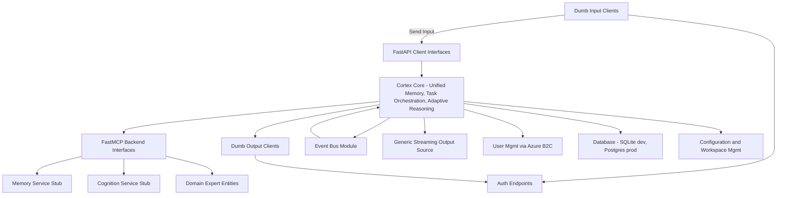

# Cortex Core API Contract

## Overview

The Cortex Core is the central orchestrator in our system. It exposes HTTP endpoints for "dumb" input clients and Server-Sent Event (SSE) endpoints for "dumb" output clients. The core provides configuration endpoints to manage workspaces, conversations, and backend service (MCP) registrations, and it abstracts authentication using Azure AD B2C concepts. In all MCP connections, the Cortex Core acts as the client.

All models across the system include a `metadata` field (a dictionary) to allow experimental, debug, or auxiliary data without modifying the core schema.

---

## High-Level Architecture

Below is a mermaid diagram that shows the overall flow between the core components:



### Diagram Explanation

- **Cortex Core (A):**
  Acts as the central orchestrator that manages unified memory, task orchestration, and decision making. It receives input, publishes events internally via the event bus, manages workspace configuration, and connects as an MCP client to backend services.

- **FastAPI Client Interfaces (B):**
  Exposes endpoints for:

  - Receiving input (via POST) from dumb input clients.
  - Delivering output via SSE.

- **FastMCP Backend Interfaces (C):**
  The core connects as an MCP client to external services such as a Memory Service Stub (F), Cognition Service Stub (G), and Domain Expert Entities (H).

- **Event Bus Module (I):**
  Provides a simple in-memory publish-subscribe mechanism to route internal events.

- **Generic Streaming Output Source (J):**
  Provides output content for streaming via SSE. This output is not tied to a specific external LLM endpoint.

- **User Mgmt (K) and Auth Endpoints (N):**
  Implement Azure AD B2C integration. In production, clients are directed to B2C, but for our MVP, stub endpoints are provided so the client always communicates with the core. The core abstracts away external auth details.

- **Configuration and Workspace Mgmt (M):**
  Contains endpoints to manage workspaces, conversations, and service registrations.

- **Database (L):**
  Used for persistent storage. SQLite is used during development, with PostgreSQL recommended for production.

---

## API Endpoints

### 1. Authentication Endpoints

These endpoints allow users to log in to the Cortex Core and verify tokens—all while abstracting Azure AD B2C details.

#### Login Endpoint

- **URL:** `/auth/login`
- **Method:** POST
- **Description:**
  In production, clients will use Azure AD B2C for authentication; here the core proxies B2C behavior. The endpoint validates provided credentials (stubbed for now) and returns a JWT with standard B2C claims.
- **Request Body:**
  ```json
  {
    "email": "user@example.com",
    "password": "testpassword"
  }
  ```
- **Response:**
  ```json
  {
    "access_token": "dummy-jwt-token-with-claims",
    "token_type": "bearer",
    "expires_in": 3600,
    "claims": {
      "oid": "unique-user-id",
      "email": "user@example.com",
      "name": "User Name"
    }
  }
  ```
  _Note: In production, the token would be issued by Azure AD B2C and include standardized claim names (e.g., 'oid' for the unique user id)._

#### Token Verification Endpoint

- **URL:** `/auth/verify`
- **Method:** GET
- **Description:**
  Verifies the submitted JWT (provided in the Authorization header). In production, the core uses Azure AD B2C metadata for validation. The stub decodes the token and returns the embedded claims.
- **Response:**
  ```json
  {
    "user_id": "unique-user-id",
    "email": "user@example.com",
    "name": "User Name"
  }
  ```

---

### 2. Input Endpoint

- **URL:** `/input`
- **Method:** POST
- **Description:**
  Receives content from dumb input clients. The endpoint:
  - Validates the user's token.
  - Attaches the unique user id from the auth process.
  - Publishes an event (of type "input") to the internal event bus.
  - (Placeholder) Forwards the input to the Memory Service Stub.
- **Request Body:**
  A JSON payload representing the input data.
- **Response:**
  ```json
  {
    "status": "received",
    "data": {
      /* input content */
    }
  }
  ```

---

### 3. Output Streaming Endpoint

- **URL:** `/output/stream`
- **Method:** GET
- **Description:**
  Allows dumb output clients to subscribe to an SSE stream. Authenticated clients will receive output events that originate from any internal content source.
- **Response Format (SSE):**

  ```
  data: {"type": "output", "content": "sample text", "user": "unique-user-id"}

  ```

---

### 4. Configuration and Workspace Management Endpoints

#### Create Workspace

- **URL:** `/config/workspace`
- **Method:** POST
- **Description:**
  Creates a new workspace.
- **Request Body (Workspace Model):**
  ```json
  {
    "id": "ws1",
    "name": "General",
    "description": "General discussion workspace",
    "owner_id": "unique-user-id",
    "metadata": {}
  }
  ```
- **Response:**
  ```json
  {
    "status": "workspace created",
    "workspace": {
      "id": "ws1",
      "name": "General",
      "description": "General discussion workspace",
      "owner_id": "unique-user-id",
      "metadata": {}
    }
  }
  ```

#### List Workspaces

- **URL:** `/config/workspace`
- **Method:** GET
- **Description:**
  Retrieves all workspaces owned by the authenticated user.
- **Response:**
  ```json
  {
    "workspaces": [
      {
        "id": "ws1",
        "name": "General",
        "description": "General discussion workspace",
        "owner_id": "unique-user-id",
        "metadata": {}
      }
    ]
  }
  ```

#### Create Conversation

- **URL:** `/config/conversation`
- **Method:** POST
- **Description:**
  Creates a new conversation within a workspace.
- **Request Body (Conversation Model):**
  ```json
  {
    "id": "conv1",
    "workspace_id": "ws1",
    "topic": "Project Discussion",
    "participant_ids": ["unique-user-id"],
    "metadata": {}
  }
  ```
- **Response:**
  ```json
  {
    "status": "conversation created",
    "conversation": {
      "id": "conv1",
      "workspace_id": "ws1",
      "topic": "Project Discussion",
      "participant_ids": ["unique-user-id"],
      "metadata": {}
    }
  }
  ```

---

### 5. MCP Backend Services Integration

The Cortex Core connects as a client to external MCP services, including:

- **Memory Service Stub:**
  Receives input via a predefined tool interface and stores the data, exposing it as a resource.

- **Cognition Service Stub:**
  Returns conversation history (by querying the Memory Service).

- **Domain Expert Entities:**
  Generic MCP servers that provide additional tools, resources, or prompts.

These integrations are handled internally by the core. Detailed contracts for these services will be documented separately.

---

### 6. Internal Event Bus Module

The event bus is a simple, in-memory publish-subscribe mechanism with the following interface:

- **subscribe(queue):**
  Registers an asyncio queue to receive events.

- **publish(event):**
  Publishes an event (a JSON object with properties such as `type`, `data`, and `user`) to all subscribed queues.

This mechanism enables internal components to react to incoming input events, configuration changes, and output notifications.

---

## Summary

This document outlines the core API contracts for the Cortex Core MVP. It covers:

- **Authentication:**
  Endpoints that abstract Azure AD B2C so clients always interact with the same core endpoints regardless of environment.

- **Input and Output:**
  The input endpoint accepts user content and publishes it internally; the SSE output endpoint streams processed content to dumb output clients.

- **Configuration:**
  Endpoints for managing workspaces, conversations, and service registrations.

- **Internal Components:**
  A simple event bus module enables publish-subscribe behavior.

- **MCP Integration:**
  The core acts as an MCP client integrating with backend stubs for Memory, Cognition, and Domain Expert Entities.

All data models include a flexible `metadata` field for storing experimental or auxiliary data.

_This API contract serves as a high-level guide for the implementation and future extension of the Cortex Core. Further detailed specifications and examples will be provided in subsequent documentation updates._
