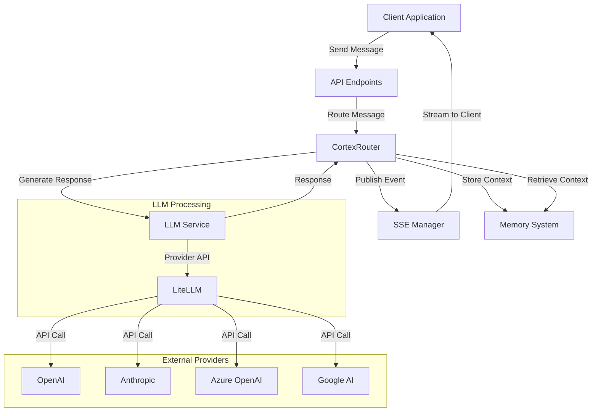

# LLM Integration in Cortex Core

This document provides comprehensive information about the LLM (Large Language Model) integration in Cortex Core, explaining how the system communicates with language models and how to leverage this capability in your implementation.

## Overview

Cortex Core integrates with various LLM providers through [LiteLLM](https://github.com/BerriAI/litellm), a unified interface for multiple LLM providers. This integration allows the CortexRouter to generate real responses to user messages by forwarding them to language models, supporting both synchronous and streaming interactions.

## Architecture

The LLM integration is designed following the service layer pattern used throughout Cortex Core, with clear separation of concerns and well-defined interfaces:



### Key Components

1. **CortexRouter**: Orchestrates the message flow, determining when to call the LLM and managing the conversation
2. **LLM Service**: Provides a clean interface to language models, handling prompts, responses, and streaming
3. **LiteLLM**: Abstracts provider differences, offering a unified API for multiple LLM providers
4. **Memory System**: Stores conversation history and provides context for LLM interactions
5. **SSE Manager**: Delivers streaming responses to clients in real-time

### Data Flow

1. Client sends a message through the API
2. CortexRouter receives the message and decides on the action (e.g., respond with LLM)
3. CortexRouter retrieves relevant context from the Memory System
4. LLM Service constructs the prompt and sends it to the appropriate model via LiteLLM
5. Response is received (either all at once or streaming)
6. Response is stored in the database and delivered to the client
7. Relevant context is updated in the Memory System

## Implementation Details

### Service Interface

The LLM Service provides a clean, well-defined interface for interacting with language models:

```python
class LLMService:
    """Service for interacting with language models"""
    
    async def get_completion(
        self, 
        prompt: str, 
        system_prompt: Optional[str] = None,
        temperature: float = 0.7,
        max_tokens: Optional[int] = None,
        model: Optional[str] = None
    ) -> str:
        """Generate a completion from a language model"""
        pass
    
    async def get_streaming_completion(
        self, 
        prompt: str,
        callback: Callable[[str], Awaitable[None]],
        system_prompt: Optional[str] = None,
        temperature: float = 0.7,
        max_tokens: Optional[int] = None,
        model: Optional[str] = None
    ) -> str:
        """Generate a streaming completion from a language model"""
        pass
```

### Router Integration

The CortexRouter integrates with the LLM Service to process messages and generate responses:

```python
class CortexRouter:
    async def _handle_respond_action(self, message: InputMessage, decision: RoutingDecision):
        """Handle a 'respond' action by calling the LLM"""
        # Show typing indicator
        await self._send_typing_indicator(message.conversation_id, True)
        
        try:
            # Retrieve conversation history for context
            conversation = await self.conversation_service.get_conversation(
                message.conversation_id, include_messages=True
            )
            recent_messages = self._format_messages_for_context(conversation.messages[-10:])
            
            # Create system prompt with context
            system_prompt = f"You are a helpful assistant. Respond to the user's query."
            
            # Get LLM service
            llm_service = get_llm_service()
            
            # Get response from LLM - Standard completion
            response_content = await llm_service.get_completion(
                prompt=message.content,
                system_prompt=system_prompt
            )
            
            # Save and send response
            await self._save_and_send_response(
                message.conversation_id,
                response_content,
                "assistant"
            )
            
        finally:
            # Turn off typing indicator
            await self._send_typing_indicator(message.conversation_id, False)
```

### Streaming Implementation

For streaming responses, which improve user experience, the implementation leverages AsyncIO:

```python
async def _handle_streaming_respond_action(self, message: InputMessage, decision: RoutingDecision):
    """Handle a streaming response action"""
    # Show typing indicator
    await self._send_typing_indicator(message.conversation_id, True)
    
    try:
        # Save the assistant message with empty content initially
        message_id = await self.conversation_service.add_message(
            message.conversation_id, "", "assistant"
        )
        
        # Create a callback for handling streaming chunks
        full_response = []
        
        async def stream_callback(chunk: str):
            full_response.append(chunk)
            
            # Send the chunk to the client
            await self.sse_service.send_event(
                "conversation",
                message.conversation_id,
                "message_chunk",
                {
                    "message_id": message_id,
                    "chunk": chunk
                }
            )
        
        # Get LLM service
        llm_service = get_llm_service()
        
        # Get streaming response from LLM
        await llm_service.get_streaming_completion(
            prompt=message.content,
            callback=stream_callback,
            system_prompt="You are a helpful assistant."
        )
        
        # Update the message with the complete response
        complete_response = "".join(full_response)
        await self.conversation_service.update_message(
            message.conversation_id,
            message_id,
            complete_response
        )
        
    finally:
        # Turn off typing indicator
        await self._send_typing_indicator(message.conversation_id, False)
        
        # Send a completion event
        await self.sse_service.send_event(
            "conversation",
            message.conversation_id,
            "message_complete",
            {
                "message_id": message_id
            }
        )
```

## Configuration

LLM integration is configured through environment variables:

- `LLM_DEFAULT_MODEL`: The default model to use (e.g., "openai/gpt-3.5-turbo", "anthropic/claude-3-sonnet")
- `LLM_USE_MOCK`: Set to "true" to run in mock mode (no actual API calls)
- `LLM_TIMEOUT`: Timeout in seconds for LLM API calls
- `LLM_MAX_RETRIES`: Maximum number of retries for failed API calls
- `LLM_CACHE_ENABLED`: Enable caching of responses for identical prompts

### Advanced Configuration

Additional configuration options are available for specific use cases:

```python
# Example advanced configuration in config.py
llm_settings = {
    "streaming_enabled": True,
    "rate_limit_rpm": 60,  # Requests per minute
    "default_system_prompt": "You are a helpful assistant...",
    "context_window_size": 10,  # Number of recent messages to include in context
    "fallback_model": "openai/gpt-3.5-turbo",  # Fallback if primary model fails
    "cache_ttl_seconds": 3600,  # Cache lifetime for identical requests
}
```

### Provider API Keys

LiteLLM looks for environment variables for provider API keys:

- `OPENAI_API_KEY`: For OpenAI models
- `ANTHROPIC_API_KEY`: For Anthropic models
- `GOOGLE_API_KEY`: For Google AI models
- `AZURE_OPENAI_API_KEY`: For Azure OpenAI models
- Various other provider-specific keys (see LiteLLM documentation)

## Usage Examples

### Basic Completion

```python
# Get the LLM service
llm_service = get_llm_service()

# Generate a simple completion
response = await llm_service.get_completion(
    prompt="What is the capital of France?",
    system_prompt="You are a helpful assistant that provides concise answers."
)

print(response)  # "The capital of France is Paris."
```

### Streaming Completion

```python
# Define a callback function
async def stream_callback(chunk: str):
    print(chunk, end="", flush=True)  # Print in real-time
    # In a real app, you would send this to the client via SSE

# Get the LLM service
llm_service = get_llm_service()

# Generate a streaming completion
full_response = await llm_service.get_streaming_completion(
    prompt="Write a short poem about programming.",
    callback=stream_callback,
    temperature=0.8
)

print("\nFull response:", full_response)
```

### Context-Aware Completion

```python
# Get conversation history
conversation = await conversation_service.get_conversation(
    conversation_id, include_messages=True
)

# Format historical messages for context
formatted_messages = []
for msg in conversation.messages[-5:]:  # Last 5 messages
    formatted_messages.append(f"{msg.role}: {msg.content}")
context = "\n".join(formatted_messages)

# Generate completion with context
response = await llm_service.get_completion(
    prompt="What did we discuss earlier?",
    system_prompt=f"This is a continuation of a conversation. Previous messages:\n{context}"
)
```

## Error Handling

The integration includes comprehensive error handling to ensure robustness:

```python
async def get_completion(self, prompt: str, system_prompt: Optional[str] = None, **kwargs):
    """Generate a completion with error handling"""
    try:
        # Attempt to get completion from provider
        return await self._get_provider_completion(prompt, system_prompt, **kwargs)
    except TimeoutError:
        logger.error(f"LLM request timed out after {self.timeout} seconds")
        return "I apologize, but I'm having trouble responding right now due to a timeout. Please try again."
    except RateLimitError:
        logger.error("Rate limit exceeded for LLM provider")
        return "I apologize, but we've reached our rate limit. Please try again in a moment."
    except ProviderAPIError as e:
        logger.error(f"Provider API error: {str(e)}")
        # Try fallback model if available
        if self.fallback_model and kwargs.get('model') != self.fallback_model:
            logger.info(f"Attempting fallback to {self.fallback_model}")
            kwargs['model'] = self.fallback_model
            return await self.get_completion(prompt, system_prompt, **kwargs)
        return "I apologize, but I encountered an error processing your request."
    except Exception as e:
        logger.exception(f"Unexpected error in LLM service: {str(e)}")
        return "I apologize, but I encountered an unexpected error. Please try again."
```

## Mock Mode

For development, testing, or environments without API keys, the LLM service can run in mock mode:

```python
async def _mock_completion(self, prompt: str, system_prompt: Optional[str] = None) -> str:
    """Generate a mock completion for development"""
    # Add a small delay to simulate API latency
    await asyncio.sleep(random.uniform(0.5, 2.0))
    
    # Create a simple echo response
    if "?" in prompt:
        return f"[MOCK] This is a simulated answer to your question: '{prompt}'"
    elif len(prompt) < 20:
        return f"[MOCK] I acknowledge your statement about {prompt}"
    else:
        return f"[MOCK] I've processed your message which was {len(prompt)} characters long. In a real environment, I would generate a thoughtful response."
```

### Testing with Mock Mode

```python
# Test example
@pytest.mark.asyncio
async def test_llm_service_mock_mode():
    """Test the LLM service in mock mode"""
    # Create LLM service with mock enabled
    config = LLMConfig(default_model="openai/gpt-3.5-turbo", use_mock=True)
    service = LiteLLMService(config)
    
    # Test completion
    response = await service.get_completion("What is the meaning of life?")
    assert "[MOCK]" in response
    assert "question" in response.lower()
```

## Performance Considerations

When implementing LLM features, consider these performance aspects:

### 1. Latency Management

- **Streaming Responses**: Use streaming for longer responses to improve perceived performance
- **Timeouts**: Configure appropriate timeouts to prevent hanging requests
- **Background Processing**: For non-interactive tasks, use background processing

### 2. Resource Optimization

- **Prompt Engineering**: Craft efficient prompts to reduce token usage
- **Context Window Management**: Only include relevant context to reduce token consumption
- **Model Selection**: Use smaller models for simpler tasks to reduce latency and cost

### 3. Caching Strategy

- **Response Caching**: Cache responses for identical or similar prompts
- **Embedding Caching**: Cache embeddings for frequently used text
- **Vector Store Integration**: Use vector stores for semantic caching

### 4. Scaling Considerations

- **Rate Limiting**: Implement client-side rate limiting to avoid provider limits
- **Load Balancing**: Distribute requests across multiple providers
- **Queueing**: Implement request queuing for high-volume scenarios

### 5. Cost Management

- **Token Monitoring**: Track token usage to manage costs
- **Model Tiering**: Use different models based on task complexity
- **Response Length Control**: Set appropriate max_tokens limits

## Advanced Features (Planned)

### Tool Calling / Function Calling

Planned implementation for tool/function calling will enable LLMs to invoke external functions:

```python
# Future implementation example
tools = [
    {
        "name": "get_weather",
        "description": "Get current weather for a location",
        "parameters": {
            "location": {
                "type": "string",
                "description": "City name or zip code"
            }
        }
    }
]

async def get_tool_using_completion(prompt: str, tools: List[Dict]):
    """Generate a completion with tool calling capabilities"""
    # This will be implemented in a future update
    pass
```

### Conversational Memory

Enhanced memory integration will provide better context management:

```python
# Future implementation example
async def get_contextual_completion(prompt: str, conversation_id: str):
    """Generate a completion with memory context"""
    # Get memory system
    memory_system = get_memory_system()
    
    # Retrieve relevant context
    memory_query = MemoryQuery(
        types=["message"],
        metadata_filters={"conversation_id": conversation_id},
        limit=10
    )
    context = await memory_system.synthesize_context(workspace_id, memory_query)
    
    # Generate completion with context
    return await llm_service.get_completion(
        prompt=prompt,
        system_prompt=f"Previous context:\n{context.summary}\n\nRespond to the user's message."
    )
```

### Prompt Templating

A planned templating system will standardize prompts across the application:

```python
# Future implementation example
from jinja2 import Template

prompt_templates = {
    "question_answering": Template("""
    Answer the following question based on your knowledge:
    
    Question: {{ question }}
    
    Answer:
    """),
    
    "summarization": Template("""
    Summarize the following text in {{ words }} words or less:
    
    {{ text }}
    
    Summary:
    """)
}

async def apply_template(template_name: str, **kwargs):
    """Apply a prompt template with variables"""
    template = prompt_templates.get(template_name)
    if not template:
        raise ValueError(f"Template '{template_name}' not found")
    
    return template.render(**kwargs)
```

## Related Documentation

- [LLM_SERVICE.md](./services/LLM_SERVICE.md): Detailed documentation of the LLM service implementation
- [ROUTER.md](./ROUTER.md): Documentation on the CortexRouter that uses the LLM Service
- [SSE.md](./SSE.md): Documentation on the SSE system used for streaming responses
- [MEMORY_SYSTEM.md](./MEMORY_SYSTEM.md): Documentation on the Memory System for context
- [LiteLLM Documentation](https://docs.litellm.ai/docs/): Documentation for the LiteLLM library