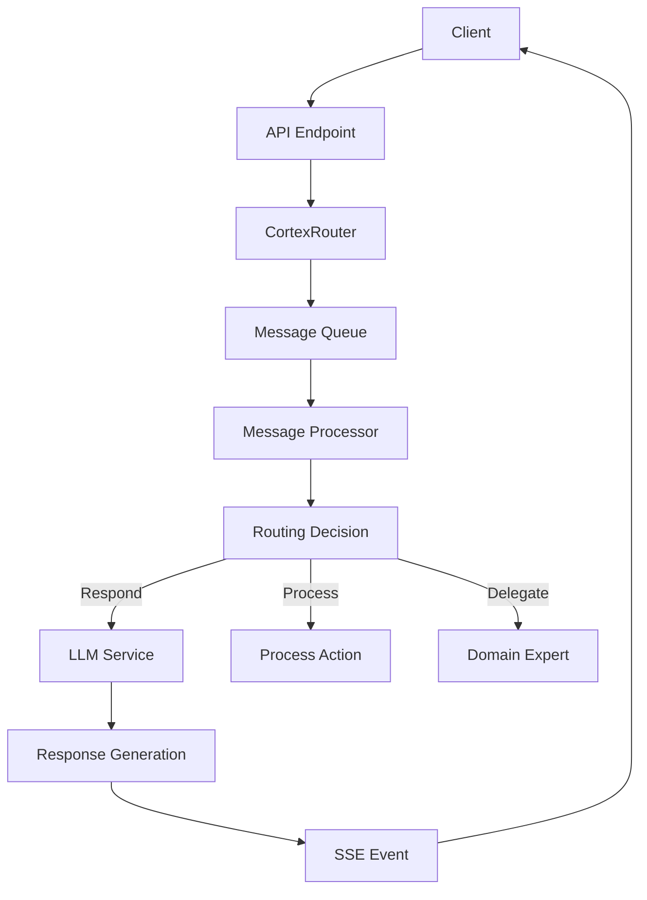

# Cortex Router

This document describes the CortexRouter component, its architecture, implementation, and integration with other parts of the Cortex Core system.

## Overview

The CortexRouter is a central component of Cortex Core that processes incoming messages, makes routing decisions, and generates responses. It acts as the orchestrator for message handling, delegating tasks to appropriate services including LLM services and domain expert entities.



## Architecture

The CortexRouter follows an asynchronous queue-based architecture:

1. **Input Reception**: Messages are received via API endpoints and passed to the router
2. **Queuing**: Messages are queued for asynchronous processing
3. **Routing Decision**: Each message is analyzed to determine the appropriate action
4. **Action Handling**: Different actions (respond, process, delegate) are handled by specialized methods
5. **Response Generation**: Responses are generated via LLM or other processing
6. **Event Publishing**: Results are published as SSE events

## Implementation

The CortexRouter is implemented in `app/components/cortex_router.py` with the following key components:

### Message Queue

The router uses an `asyncio.Queue` to handle messages asynchronously:

```python
def __init__(self):
    """Initialize the router"""
    self.event_system = get_event_system()
    self.message_queue = asyncio.Queue()
    self.logger = logging.getLogger(__name__)
    self.running = True

    # Start async task to process messages
    self.processing_task = asyncio.create_task(self._process_messages())
```

### Message Processing

Messages are processed in a background task that runs continuously:

```python
async def _process_messages(self):
    """Process messages from the queue asynchronously"""
    while self.running:
        try:
            # Get message from queue (with timeout for clean shutdown)
            message = await asyncio.wait_for(self.message_queue.get(), timeout=1.0)

            # Process the message
            await self._handle_message(message)

            # Mark task as done
            self.message_queue.task_done()

        except asyncio.TimeoutError:
            # This is expected when the queue is empty
            pass
        except Exception as e:
            self.logger.error(f"Error processing message: {e}")
```

### Routing Decisions

The router makes decisions about how to handle each message:

```python
async def _make_routing_decision(self, message: InputMessage) -> RoutingDecision:
    """
    Make a routing decision for a message

    Args:
        message: The input message

    Returns:
        A routing decision
    """
    # Current implementation always responds to the same channel
    return RoutingDecision(
        action_type=ActionType.RESPOND,
        priority=3,
        target_channels=[message.channel_id],
        status_message="Processing your request...",
        reference_id=str(uuid.uuid4()),
        metadata={"timestamp": datetime.now(timezone.utc).isoformat()}
    )
```

### Action Handling

Different action types are handled by specialized methods:

```python
async def _handle_message(self, message: InputMessage):
    """
    Process a message from the queue
    """
    try:
        # Make a routing decision
        decision = await self._make_routing_decision(message)

        # Handle the message based on the decision
        if decision.action_type == ActionType.RESPOND:
            await self._handle_respond_action(message, decision)
        elif decision.action_type == ActionType.PROCESS:
            await self._handle_process_action(message, decision)
        elif decision.action_type == ActionType.DELEGATE:
            await self._handle_delegate_action(message, decision)
        elif decision.action_type == ActionType.IGNORE:
            self.logger.info(f"Ignoring message {message.message_id}")
        else:
            self.logger.warning(f"Unknown action type {decision.action_type}")

    except Exception as e:
        self.logger.error(f"Error handling message {message.message_id}: {e}")
```

### LLM Integration

The router integrates with the LLM service to generate responses:

```python
# Get LLM service
llm_service = get_llm_service()

# Get response from LLM
response_content = await llm_service.get_completion(
    prompt=message.content,
    system_prompt="You are a helpful AI assistant. Respond accurately and clearly to the user's request."
)
```

### Real-time Feedback

The router provides real-time feedback using typing indicators:

```python
# Show typing indicator
await self._send_typing_indicator(message.conversation_id, True)

try:
    # Process message and generate response
    # ...
finally:
    # Always turn off typing indicator
    await self._send_typing_indicator(message.conversation_id, False)
```

### Event Publishing

Results are published as SSE events for real-time client updates:

```python
async def _send_message_to_client(self, conversation_id: str, message_id: str,
                               content: str, role: str, metadata: dict):
    """Send message directly to client via SSE"""
    # Create the standard message payload
    payload = {
        "id": message_id,
        "content": content,
        "role": role,
        "created_at_utc": datetime.now(timezone.utc).isoformat(),
        "metadata": metadata,
        "conversation_id": conversation_id
    }
    
    # First, send event through event system
    event_system = get_event_system()
    await event_system.publish(
        f"conversation.message_received",
        payload,
        source="cortex_router"
    )
    
    # Also try direct SSE path for active connections
    sse_service = get_sse_service()
    await sse_service.connection_manager.send_event(
        "conversation",
        conversation_id,
        "message_received",
        payload,
        republish=False
    )
```

## Resource Cleanup

The router properly cleans up resources when shutting down:

```python
async def cleanup(self):
    """Cleanup resources when shutting down"""
    self.running = False

    # Cancel processing task
    if self.processing_task and not self.processing_task.done():
        self.processing_task.cancel()
        try:
            await asyncio.wait_for(asyncio.shield(self.processing_task), timeout=0.5)
        except (asyncio.CancelledError, asyncio.TimeoutError):
            pass
```

## Interface Contract

The CortexRouter implements the `RouterInterface` contract from `app/interfaces/router.py`:

```python
class RouterInterface(Protocol):
    """Interface for the Cortex Router"""
    
    async def process_input(self, message: InputMessage) -> bool:
        """Process an input message"""
        pass
        
    async def cleanup(self) -> None:
        """Clean up resources when shutting down"""
        pass
```

## Message Models

The router works with these key message models:

```python
class InputMessage(CortexMessage):
    """Message received from an input channel"""
    
    # Source identification
    channel_id: str
    channel_type: ChannelType
    
    # Content
    content: str
    
    # Context
    user_id: Optional[str] = None
    workspace_id: Optional[str] = None
    conversation_id: str
```

```python
class RoutingDecision(BaseModel):
    """Decision made by the Router about handling input"""
    
    # Core decision info
    action_type: ActionType = ActionType.PROCESS
    priority: int = 3
    
    # Destinations
    target_channels: List[str] = Field(default_factory=list)
    
    # Processing info
    status_message: Optional[str] = None
    reference_id: Optional[str] = None
    metadata: Dict[str, Any] = Field(default_factory=dict)
```

## Action Types

The router supports these action types:

- **RESPOND**: Generate an immediate response
- **PROCESS**: Process the message with specialized logic
- **DELEGATE**: Delegate to a domain expert
- **IGNORE**: Take no action
- **CLARIFY**: Ask for clarification
- **SEARCH**: Search for information
- **ROUTE**: Route to a specific handler

## Future Enhancements

While the current implementation primarily uses the RESPOND action with LLM integration, future enhancements will:

1. **Implement Domain Expert Delegation**: Delegate specialized tasks to domain expert entities
2. **Add Advanced Routing Logic**: Use context, intent, and content to make smarter routing decisions
3. **Support Multi-Modal Input**: Process various input modalities beyond text
4. **Add Tool Usage**: Integrate function calling and tool usage with LLMs
5. **Implement Context Preservation**: Maintain history and context across interactions
6. **Add Memory Integration**: Leverage the Memory System for contextual responses

## Testing

Testing the CortexRouter requires a combination of unit tests and integration tests:

```python
# Unit test example
@pytest.mark.asyncio
async def test_router_process_input():
    """Test that router queues messages for processing"""
    # Create router instance
    router = CortexRouter()
    
    try:
        # Create a test message
        message = InputMessage(
            message_id="test-123",
            channel_id="channel-1",
            channel_type=ChannelType.CONVERSATION,
            content="Test message",
            conversation_id="conv-1"
        )
        
        # Process the message
        result = await router.process_input(message)
        
        # Check that the message was queued
        assert result is True
        assert router.message_queue.qsize() == 1
    finally:
        # Clean up
        await router.cleanup()
```

## Integration Example

Adding a message to a conversation and processing it through the router:

```python
@router.post("/conversations/{conversation_id}/messages")
async def add_message(
    conversation_id: str,
    message_request: AddMessageRequest,
    user: User = Depends(get_current_user),
    service: ConversationService = Depends(get_conversation_service),
):
    """Add a message to a conversation."""
    # Add the message to the database
    message = await service.add_message(
        conversation_id=conversation_id,
        content=message_request.content,
        role=message_request.role,
        metadata=message_request.metadata,
    )
    
    # Create input message for router
    from app.components.cortex_router import get_router
    from app.interfaces.router import InputMessage, ChannelType
    import asyncio
    
    input_message = InputMessage(
        message_id=str(uuid.uuid4()),
        channel_id=f"conversation-{conversation_id}",
        channel_type=ChannelType.CONVERSATION,
        content=message_request.content,
        user_id=str(user.id),
        workspace_id=message.workspace_id,
        conversation_id=conversation_id,
        metadata={"source": "api"}
    )
    
    # Get router and queue the message for processing
    router = get_router()
    asyncio.create_task(router.process_input(input_message))
    
    # Return acknowledgment
    return {
        "status": "message_received",
        "message_id": message.id
    }
```

## Related Documentation

- [ARCHITECTURE.md](ARCHITECTURE.md): Overall system architecture
- [SSE.md](SSE.md): Server-Sent Events documentation
- [LLM_INTEGRATION.md](LLM_INTEGRATION.md): LLM integration details
- [DOMAIN_EXPERTS.md](DOMAIN_EXPERTS.md): Domain Expert entities documentation