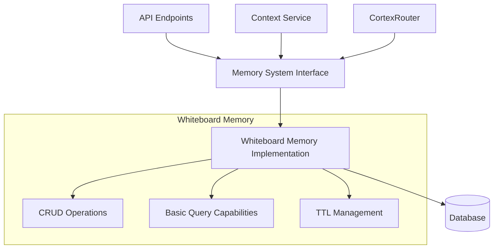
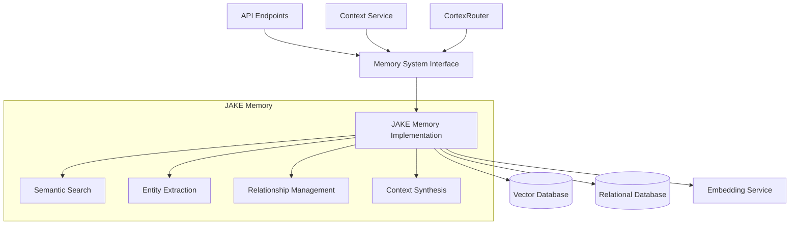

# Memory System Implementations

This document provides detailed information about the specific memory implementations in Cortex Core, including the current Whiteboard Memory implementation and the planned JAKE Memory system.

## Whiteboard Memory Implementation

The Whiteboard Memory is the current default implementation that uses a database-backed approach for storing and retrieving memory items.

### Architecture



### Implementation Details

The Whiteboard Memory implementation is built on these key components:

1. **SQLAlchemy Models**: Memory items are stored in the database using SQLAlchemy ORM
2. **JSON Serialization**: Complex data structures are serialized to JSON for storage
3. **Database Indexing**: Indexes optimize queries by type, workspace, and timestamp
4. **TTL Management**: Items automatically expire based on configurable policies

### Database Schema

```python
class MemoryItemDB(Base):
    """Database model for memory items"""
    __tablename__ = "memory_items"
    
    id = Column(String, primary_key=True)
    workspace_id = Column(String, ForeignKey("workspaces.id"), nullable=False, index=True)
    type = Column(String, nullable=False, index=True)
    content = Column(String, nullable=False)  # JSON serialized content
    metadata = Column(String)  # JSON serialized metadata
    timestamp_utc = Column(DateTime(timezone=True), nullable=False, index=True)
    expires_at_utc = Column(DateTime(timezone=True), index=True)
    
    # Relationships
    workspace = relationship("WorkspaceDB", back_populates="memory_items")
```

### Code Implementation

The core implementation of the Whiteboard Memory is as follows:

```python
class WhiteboardMemory(MemorySystemInterface):
    """Database-backed memory implementation"""
    
    def __init__(self, db_session_provider: Callable[[], AsyncSession]):
        """
        Initialize the whiteboard memory
        
        Args:
            db_session_provider: Function that provides a database session
        """
        self.db_session_provider = db_session_provider
        self.retention_days = None
    
    async def initialize(self, config: MemoryConfig) -> None:
        """
        Initialize the memory system
        
        Args:
            config: Memory configuration
        """
        if config.retention_policy:
            self.retention_days = config.retention_policy.default_ttl_days
    
    async def store(self, workspace_id: str, item: MemoryItem) -> str:
        """
        Store a memory item
        
        Args:
            workspace_id: ID of the workspace
            item: Memory item to store
            
        Returns:
            ID of the stored item
        """
        # Create a unique ID if not provided
        if not item.id:
            item.id = str(uuid.uuid4())
            
        # Calculate expiration date based on retention policy
        if not item.expires_at and self.retention_days:
            item.expires_at = datetime.now(timezone.utc) + timedelta(days=self.retention_days)
            
        # Create database model from domain model
        db_item = MemoryItemDB(
            id=item.id,
            workspace_id=workspace_id,
            type=item.type,
            content=json.dumps(item.content),
            metadata=json.dumps(item.metadata),
            timestamp_utc=item.timestamp,
            expires_at_utc=item.expires_at
        )
        
        # Save to database
        async with self.db_session_provider() as session:
            session.add(db_item)
            await session.commit()
        
        return item.id
        
    async def retrieve(self, workspace_id: str, query: MemoryQuery) -> List[MemoryItem]:
        """
        Retrieve memory items based on a query
        
        Args:
            workspace_id: ID of the workspace
            query: Memory query parameters
            
        Returns:
            List of memory items
        """
        async with self.db_session_provider() as session:
            # Build the base query
            db_query = select(MemoryItemDB).where(MemoryItemDB.workspace_id == workspace_id)
            
            # Apply type filters
            if query.types:
                db_query = db_query.where(MemoryItemDB.type.in_(query.types))
                
            # Apply timestamp filters
            if query.from_timestamp:
                db_query = db_query.where(MemoryItemDB.timestamp_utc >= query.from_timestamp)
            if query.to_timestamp:
                db_query = db_query.where(MemoryItemDB.timestamp_utc <= query.to_timestamp)
                
            # Apply expiration filter
            if not query.include_expired:
                db_query = db_query.where(
                    or_(
                        MemoryItemDB.expires_at_utc == None,
                        MemoryItemDB.expires_at_utc > datetime.now(timezone.utc)
                    )
                )
                
            # Apply limit
            if query.limit:
                db_query = db_query.limit(query.limit)
                
            # Execute query
            result = await session.execute(db_query)
            db_items = result.scalars().all()
            
            # Convert to domain models
            memory_items = []
            for db_item in db_items:
                # Content filter is applied in memory for now
                # In a more advanced implementation, this would use full-text search
                content_json = json.loads(db_item.content)
                if query.content_query and not self._content_matches_query(content_json, query.content_query):
                    continue
                    
                # Metadata filter is applied in memory for now
                metadata_json = json.loads(db_item.metadata) if db_item.metadata else {}
                if query.metadata_filters and not self._metadata_matches_filters(metadata_json, query.metadata_filters):
                    continue
                
                memory_items.append(MemoryItem(
                    id=db_item.id,
                    type=db_item.type,
                    content=content_json,
                    metadata=metadata_json,
                    timestamp=db_item.timestamp_utc,
                    expires_at=db_item.expires_at_utc
                ))
                
            return memory_items
            
    def _content_matches_query(self, content: Any, query: str) -> bool:
        """
        Check if content matches a query string
        
        Args:
            content: Content to check
            query: Query string
            
        Returns:
            True if content matches query
        """
        # Simple text search for now
        # Could be enhanced with better search strategies
        content_str = json.dumps(content).lower()
        return query.lower() in content_str
        
    def _metadata_matches_filters(self, metadata: Dict[str, Any], filters: Dict[str, Any]) -> bool:
        """
        Check if metadata matches filters
        
        Args:
            metadata: Metadata to check
            filters: Filter criteria
            
        Returns:
            True if metadata matches all filters
        """
        for key, value in filters.items():
            if key not in metadata or metadata[key] != value:
                return False
        return True
```

### Current Limitations

The Whiteboard Memory implementation has several limitations:

1. **Simple Text Search**: Content searching uses basic string matching
2. **In-Memory Filtering**: Some filtering happens after database retrieval
3. **No Semantic Understanding**: No concept of meaning or relationships
4. **Limited Scalability**: Database performance may degrade with large datasets
5. **Basic Context Synthesis**: No advanced summarization capabilities
6. **No Cross-Referencing**: Items are isolated with no automatic linking

### Performance Considerations

When using Whiteboard Memory, consider these performance aspects:

1. **Database Indexing**: Ensure proper indexes are in place for common queries
2. **Query Size Limits**: Use `limit` in queries to prevent retrieving too many items
3. **TTL Management**: Set appropriate TTL values to prevent database growth
4. **Content Size**: Large content values may impact performance
5. **Transaction Scope**: Use appropriate transaction boundaries for batch operations

## JAKE Memory System (Planned)

The JAKE Memory system is a planned advanced implementation using vector-based storage for semantic understanding and retrieval.

### Architecture



### Key Components

The planned JAKE Memory implementation includes:

1. **Vector Database**: For semantic similarity search using embeddings
2. **Embedding Service**: For converting content to vector embeddings
3. **Entity Extraction**: For identifying and tracking entities
4. **Relationship Management**: For tracking connections between items
5. **Advanced Context Synthesis**: For generating rich, contextual summaries

### Design Patterns

The JAKE Memory design incorporates these patterns:

1. **Hybrid Storage Pattern**: Combining vector and relational databases
2. **Query Federation**: Coordinating queries across multiple storage systems
3. **Progressive Enhancement**: Falling back to simpler methods when advanced features fail
4. **Caching Strategy**: Multi-level caching for frequently accessed items
5. **Async Processing**: Background processing for computationally intensive operations

### Implementation Considerations

When implementing JAKE Memory, these aspects need consideration:

1. **Vector Database Selection**: Options include Pinecone, Weaviate, Milvus, or Qdrant
2. **Embedding Model Choice**: Balancing quality vs. performance
3. **Storage Partitioning**: How to partition data for scalability
4. **Search Optimization**: Tuning vector search parameters
5. **Relevance Ranking**: Algorithms for ranking search results
6. **Incremental Updates**: Efficiently updating existing embeddings
7. **Cross-Modal Capabilities**: Handling different content types
8. **Security Implementation**: Ensuring proper access control

### Decision Points

Key decisions for JAKE Memory implementation:

1. **Vector Database Technology**:
   - **Options**: Pinecone, Weaviate, Milvus, Qdrant, ChromaDB
   - **Considerations**: Hosted vs. self-hosted, scaling, query capabilities, integrations
   - **Recommendation**: ChromaDB for initial implementation due to Python integration ease

2. **Embedding Models**:
   - **Options**: OpenAI embeddings, Hugging Face models, Sentence Transformers
   - **Considerations**: Dimensionality, quality, throughput, cost
   - **Recommendation**: OpenAI embeddings for quality, with Sentence Transformers as fallback

3. **Storage Strategy**:
   - **Options**: Vector-only, dual storage (vector + SQL), triplestore
   - **Considerations**: Query complexity, integrity, flexibility
   - **Recommendation**: Dual storage with vector database for semantic search and SQL for structured data

4. **Retention Strategy**:
   - **Options**: TTL-based, importance-based, hybrid
   - **Considerations**: Storage costs, relevance decay, legal requirements
   - **Recommendation**: Hybrid approach with base TTL modified by importance score

## Performance Considerations

General performance considerations for memory implementations:

### Whiteboard Memory

1. **Database Optimization**:
   - Proper indexes for `workspace_id`, `type`, and `timestamp_utc`
   - Regular database maintenance
   - Connection pooling configuration

2. **Query Optimization**:
   - Limit result sets to necessary items
   - Use specific type filters
   - Use date ranges to limit search space

3. **Content Size**:
   - Consider limits on content size
   - Compression for large content values

### JAKE Memory

1. **Vector Optimization**:
   - Appropriate vector dimensions (768-1536 typical)
   - Approximate nearest neighbor algorithms
   - Index optimization for vector database

2. **Embedding Generation**:
   - Batching embed requests for efficiency
   - Caching embeddings for frequently used content
   - Incremental embedding updates

3. **Hybrid Search Strategies**:
   - Pre-filtering with metadata before vector search
   - Combining metadata and vector scoring
   - Progressive search strategies (fast first, deep if needed)

## Testing and Validation

### Whiteboard Memory Tests

```python
@pytest.mark.asyncio
async def test_whiteboard_memory_store_retrieve():
    """Test storing and retrieving memory items"""
    # Create memory system
    memory = WhiteboardMemory(get_test_db_session)
    await memory.initialize(MemoryConfig(storage_type="whiteboard"))
    
    # Create test item
    test_item = MemoryItem(
        type="message",
        content={"text": "Test message"},
        metadata={"conversation_id": "test-conv"},
        timestamp=datetime.now(timezone.utc)
    )
    
    # Store item
    item_id = await memory.store("test-workspace", test_item)
    assert item_id is not None
    
    # Retrieve item
    query = MemoryQuery(types=["message"])
    items = await memory.retrieve("test-workspace", query)
    
    # Verify
    assert len(items) == 1
    assert items[0].type == "message"
    assert items[0].content["text"] == "Test message"
```

### JAKE Memory Tests (Proposed)

```python
@pytest.mark.asyncio
async def test_jake_memory_semantic_search():
    """Test semantic search in JAKE memory"""
    # Create memory system
    memory = JakeMemory(get_vector_db_client, get_test_db_session)
    await memory.initialize(MemoryConfig(storage_type="jake"))
    
    # Store multiple test items
    await memory.store("test-workspace", MemoryItem(
        type="message",
        content={"text": "Python is a programming language"},
        metadata={},
        timestamp=datetime.now(timezone.utc)
    ))
    
    await memory.store("test-workspace", MemoryItem(
        type="message",
        content={"text": "Apples are fruits that grow on trees"},
        metadata={},
        timestamp=datetime.now(timezone.utc)
    ))
    
    # Perform semantic search
    query = MemoryQuery(content_query="coding languages")
    items = await memory.retrieve("test-workspace", query)
    
    # Verify semantic relevance
    assert len(items) > 0
    assert "Python" in items[0].content["text"]
```

## Integration Examples

### Using Memory in the CortexRouter

```python
async def _handle_message(self, message: InputMessage):
    """Process an incoming message"""
    # Get memory system
    memory_system = get_memory_system()
    
    # Store the user message
    memory_item = MemoryItem(
        type="message",
        content={
            "role": "user",
            "content": message.content,
            "message_id": message.id
        },
        metadata={
            "conversation_id": message.conversation_id
        },
        timestamp=datetime.now(timezone.utc)
    )
    await memory_system.store(message.workspace_id, memory_item)
    
    # Retrieve context for processing
    query = MemoryQuery(
        types=["message"],
        metadata_filters={"conversation_id": message.conversation_id},
        limit=10
    )
    context = await memory_system.synthesize_context(message.workspace_id, query)
    
    # Use context for decision making
    # ...
```

### Building a Context Window

```python
async def build_conversation_context(memory_system, workspace_id, conversation_id):
    """Build a context window for an LLM from memory"""
    # Query for conversation messages
    query = MemoryQuery(
        types=["message"],
        metadata_filters={"conversation_id": conversation_id},
        limit=20  # Last 20 messages
    )
    messages = await memory_system.retrieve(workspace_id, query)
    
    # Format messages for LLM context
    formatted_messages = []
    for msg in sorted(messages, key=lambda x: x.timestamp):
        content = msg.content
        formatted_messages.append({
            "role": content.get("role", "user"),
            "content": content.get("content", "")
        })
    
    # Query for relevant entities
    entity_query = MemoryQuery(
        types=["entity"],
        metadata_filters={"conversation_id": conversation_id}
    )
    entities = await memory_system.retrieve(workspace_id, entity_query)
    
    # Add entity information to system prompt
    entity_context = "Relevant information:\n"
    for entity in entities:
        entity_context += f"- {entity.content.get('name')}: {entity.content.get('description')}\n"
    
    # Construct final context
    system_prompt = f"""You are a helpful assistant.
{entity_context}
Please respond to the user's request."""

    return {
        "messages": formatted_messages,
        "system_prompt": system_prompt
    }
```

## Conclusion

The Memory System implementations in Cortex Core provide a foundation for contextual awareness in AI interactions. The current Whiteboard Memory implementation offers basic functionality with database-backed storage, while the planned JAKE Memory system will introduce advanced semantic capabilities.

As development progresses, the Memory System will evolve to support more sophisticated use cases, enabling Cortex Core to maintain rich, contextual understanding across conversations and interactions.

## Related Documentation

- [MEMORY_SYSTEM.md](../MEMORY_SYSTEM.md): Memory System architecture
- [IMPLEMENTATION_STATUS.md](../IMPLEMENTATION_STATUS.md): Overall implementation status
- [ARCHITECTURE.md](../ARCHITECTURE.md): System architecture overview
- [Technical_Architecture.md](../../cortex-platform/ai-context/cortex/Cortex_Platform-Technical_Architecture.md): Vision document for the memory system