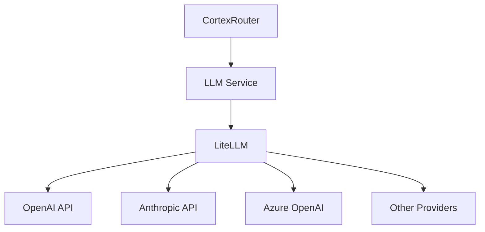

# LLM Service Implementation

This document provides detailed information about the LLM (Large Language Model) service implementation in Cortex Core.

## Overview

The LLM Service is a core component of Cortex Core that provides a unified interface for interacting with various language model providers. It abstracts away the differences between providers and offers a consistent API for generating completions, handling streaming responses, and managing model-specific parameters.

## Architecture

The LLM Service follows the service layer pattern used throughout Cortex Core, with a clean separation between the service interface and the underlying implementation details:



### Core Components

1. **LLM Service Interface**: Defines the contract for LLM interactions
2. **LLM Service Implementation**: Provides the actual implementation using LiteLLM
3. **Mock Mode**: Alternative implementation for development without API keys
4. **Configuration**: Settings for model selection and behavior

## Implementation

The LLM Service is implemented in `app/services/llm_service.py` with these key features:

### Service Interface

```python
class LLMService:
    """Service for interacting with language models"""
    
    async def get_completion(
        self, 
        prompt: str, 
        system_prompt: Optional[str] = None,
        temperature: float = 0.7,
        max_tokens: Optional[int] = None,
        model: Optional[str] = None
    ) -> str:
        """
        Generate a completion from a language model
        
        Args:
            prompt: The user prompt
            system_prompt: Optional system prompt for context
            temperature: Temperature for generation (0.0-1.0)
            max_tokens: Maximum tokens to generate
            model: Specific model to use (overrides default)
            
        Returns:
            Generated text response
        """
        pass
    
    async def get_streaming_completion(
        self, 
        prompt: str,
        callback: Callable[[str], Awaitable[None]],
        system_prompt: Optional[str] = None,
        temperature: float = 0.7,
        max_tokens: Optional[int] = None,
        model: Optional[str] = None
    ) -> str:
        """
        Generate a streaming completion from a language model
        
        Args:
            prompt: The user prompt
            callback: Async function to call with each chunk
            system_prompt: Optional system prompt for context
            temperature: Temperature for generation (0.0-1.0)
            max_tokens: Maximum tokens to generate
            model: Specific model to use (overrides default)
            
        Returns:
            Complete generated text when done
        """
        pass
```

### LiteLLM Implementation

```python
class LiteLLMService(LLMService):
    """LLM service implementation using LiteLLM"""
    
    def __init__(self, config: LLMConfig):
        self.config = config
        self.mock_mode = config.use_mock
        self.default_model = config.default_model
        self.timeout = config.timeout
        
    async def get_completion(
        self, 
        prompt: str, 
        system_prompt: Optional[str] = None,
        temperature: float = 0.7,
        max_tokens: Optional[int] = None,
        model: Optional[str] = None
    ) -> str:
        """Generate a completion from a language model"""
        # Check if we're in mock mode
        if self.mock_mode:
            return await self._mock_completion(prompt, system_prompt)
            
        # Use litellm to generate a completion
        try:
            from litellm import completion
            
            # Prepare messages
            messages = []
            if system_prompt:
                messages.append({"role": "system", "content": system_prompt})
            messages.append({"role": "user", "content": prompt})
            
            # Select model
            model_name = model or self.default_model
            
            # Generate completion
            response = await completion(
                model=model_name,
                messages=messages,
                temperature=temperature,
                max_tokens=max_tokens,
                timeout=self.timeout
            )
            
            # Extract and return content
            content = response.choices[0].message.content
            return content
            
        except ImportError:
            logger.warning("LiteLLM not installed, using mock mode")
            return await self._mock_completion(prompt, system_prompt)
        except Exception as e:
            logger.error(f"Error generating completion: {e}")
            return f"I apologize, but I encountered an error processing your request: {str(e)}"
```

### Mock Mode

```python
async def _mock_completion(self, prompt: str, system_prompt: Optional[str] = None) -> str:
    """Generate a mock completion for development"""
    # Add a small delay to simulate API latency
    await asyncio.sleep(1.0)
    
    # Create a simple echo response
    mock_response = f"[MOCK] Response to: {prompt}"
    if system_prompt:
        mock_response = f"[MOCK with system context] Response to: {prompt}"
        
    return mock_response
```

### Factory Function

```python
# Singleton instance
_llm_service: Optional[LLMService] = None

def get_llm_service() -> LLMService:
    """Get the LLM service instance"""
    global _llm_service
    if _llm_service is None:
        # Create a new LLM service
        config = LLMConfig(
            default_model=settings.llm.default_model,
            use_mock=settings.llm.use_mock,
            timeout=settings.llm.timeout
        )
        _llm_service = LiteLLMService(config)
    return _llm_service
```

## Usage

### Basic Completion

```python
# Get the LLM service
llm_service = get_llm_service()

# Generate a completion
response = await llm_service.get_completion(
    prompt="What is the capital of France?",
    system_prompt="You are a helpful assistant that provides concise answers."
)

print(response)  # "The capital of France is Paris."
```

### Streaming Completion

```python
# Define a callback function
async def stream_callback(chunk: str):
    print(chunk, end="", flush=True)

# Get the LLM service
llm_service = get_llm_service()

# Generate a streaming completion
full_response = await llm_service.get_streaming_completion(
    prompt="Write a short poem about programming.",
    callback=stream_callback,
    temperature=0.8
)

print("\nFull response:", full_response)
```

### Usage in CortexRouter

The LLM Service is used in the CortexRouter to generate responses to user messages:

```python
async def _handle_respond_action(self, message: InputMessage, decision: RoutingDecision):
    """Handle a 'respond' action"""
    # Show typing indicator
    await self._send_typing_indicator(message.conversation_id, True)

    try:
        # Get LLM service
        llm_service = get_llm_service()
        
        # Get response from LLM
        response_content = await llm_service.get_completion(
            prompt=message.content,
            system_prompt="You are a helpful AI assistant."
        )
        
        # Process the response
        # ...
    finally:
        # Turn off typing indicator
        await self._send_typing_indicator(message.conversation_id, False)
```

## Configuration

The LLM Service is configured through environment variables:

```
# LLM Configuration
LLM_DEFAULT_MODEL="openai/gpt-3.5-turbo"  # <provider>/<model>
LLM_USE_MOCK=false                        # Set to "true" for mock mode
LLM_TIMEOUT=60                            # Timeout in seconds

# Provider API Keys
OPENAI_API_KEY="your-openai-api-key"
ANTHROPIC_API_KEY="your-anthropic-api-key"
```

### Model Specification

Models are specified in the format `<provider>/<model>`:

- `openai/gpt-3.5-turbo`
- `openai/gpt-4`
- `anthropic/claude-3-sonnet`
- `anthropic/claude-3-opus`
- `azure/gpt-4`

## Error Handling

The LLM Service implements several error handling mechanisms:

1. **Exception Handling**: All API calls are wrapped in try/except blocks
2. **Timeout Handling**: API calls have configurable timeouts
3. **Mock Mode Fallback**: Falls back to mock mode if LiteLLM is not installed
4. **Graceful Degradation**: Returns error messages instead of failing silently

## Testing

Testing the LLM Service can be done using mocks:

```python
@pytest.mark.asyncio
async def test_llm_service():
    """Test the LLM service"""
    # Create a mock LiteLLM completion function
    async def mock_completion(*args, **kwargs):
        # Create a mock response object
        class MockResponse:
            class Choice:
                class Message:
                    content = "Test response"
                message = Message()
            choices = [Choice()]
        return MockResponse()
    
    # Patch the litellm.completion function
    with patch("litellm.completion", side_effect=mock_completion):
        # Create LLM service with mock disabled
        config = LLMConfig(default_model="openai/gpt-3.5-turbo", use_mock=False)
        service = LiteLLMService(config)
        
        # Test completion
        response = await service.get_completion("Test prompt")
        assert response == "Test response"
```

## Performance Considerations

When using the LLM Service, consider these performance aspects:

1. **API Latency**: LLM API calls can take several seconds, especially for longer content
2. **Streaming vs. Non-Streaming**: Streaming provides better user experience for long responses
3. **Caching**: Consider implementing caching for common prompts
4. **Concurrency**: Multiple simultaneous API calls may hit rate limits
5. **Model Selection**: Smaller models are faster but may provide lower quality responses

## Future Enhancements

Planned improvements to the LLM Service:

1. **Tool Calling/Function Calling**: Support for tool/function calling capabilities
2. **Prompt Templates**: System for generating and managing prompt templates
3. **Caching Layer**: Implement caching for common prompts
4. **Model Fallback Chain**: Automatic fallback to alternative models on failure
5. **Metrics Collection**: Gather performance and usage metrics
6. **Cost Tracking**: Track token usage and associated costs

## Related Documentation

- [LLM_INTEGRATION.md](../LLM_INTEGRATION.md): Overview of LLM integration in Cortex Core
- [ROUTER.md](../ROUTER.md): Documentation of the CortexRouter that uses the LLM Service
- [LiteLLM Documentation](https://docs.litellm.ai/docs/): Documentation for the LiteLLM library