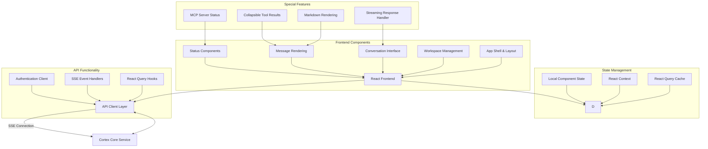
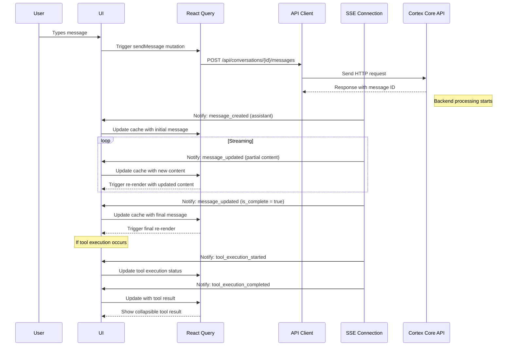

# Cortex Core Frontend Development Plan

## Project Overview

We'll develop a React/TypeScript + Vite frontend for the cortex-core service that provides a modern chat interface with robust support for streaming responses. The application will connect to the cortex-core service at http://127.0.0.1:8000, support workspace and conversation management, and display various message types including collapsible tool results. We'll use Microsoft's Fluent UI v2 library for a polished, consistent user experience.

## Technology Stack

- **Frontend Framework**: React with TypeScript
- **Build Tool**: Vite
- **UI Library**: Microsoft Fluent UI v2 (@fluentui/react-components)
- **Data Fetching**: React Query for REST API interactions
- **Real-time Communication**: Server-Sent Events (SSE) with custom integration
- **Styling**: CSS-in-JS approach with Fluent UI's styling system
- **Routing**: React Router
- **Authentication**:
  - Initial: Simple token-based auth for development
  - Future: MSAL integration with Azure AD

## System Architecture



## Implementation Plan

### 1. Project Setup & Foundation (15%)

1. **Initialize Project**

   - Create new Vite project with React, TypeScript
   - Configure ESLint, Prettier, and TypeScript settings
   - Set up project structure

2. **Install Dependencies**

   - Fluent UI v2 (@fluentui/react-components)
   - React Query for data fetching
   - EventSource polyfill for SSE
   - React Router for navigation
   - React Markdown for rendering

3. **Configure Base Layout**
   - Create responsive app shell with Fluent UI
   - Implement theme support (light/dark mode)
   - Set up basic routing structure

### 2. API Integration Layer (25%)

1. **TypeScript Interface Definitions**

   - Define interfaces for all API entities (Conversation, Message, etc.)
   - Create request/response type definitions
   - Define SSE event type interfaces

2. **React Query Integration**

   - Set up React Query client and provider
   - Create base query hooks for conversations and messages
   - Implement query invalidation strategy

3. **SSE Integration**

   - Create SSE connection management hooks
   - Implement SSE event handlers that update React Query cache
   - Build reconnection and error recovery logic

4. **Authentication Implementation**
   - Implement simple token-based authentication for initial development
   - Design architecture to support future MSAL integration
   - Create auth context provider and hooks

```typescript
// Sample API integration hooks
function useConversations() {
  return useQuery("conversations", fetchConversations);
}

function useConversation(id: string) {
  return useQuery(["conversation", id], () => fetchConversation(id));
}

function useSendMessage() {
  const queryClient = useQueryClient();

  return useMutation((params: SendMessageParams) => sendMessage(params), {
    onSuccess: (data, variables) => {
      // Update conversation in cache
      queryClient.setQueryData(
        ["conversation", variables.conversationId],
        (old: Conversation) => updateConversationWithMessage(old, data)
      );
    },
  });
}

// SSE integration hook
function useConversationStream(conversationId: string) {
  const queryClient = useQueryClient();
  const [streamStatus, setStreamStatus] = useState("disconnected");

  useEffect(() => {
    if (!conversationId) return;

    const eventSource = new EventSource(
      `${API_BASE_URL}/api/sse/conversations/${conversationId}?token=${getToken()}`
    );
    setStreamStatus("connecting");

    eventSource.onopen = () => setStreamStatus("connected");

    eventSource.addEventListener("message_created", (event) => {
      const message = JSON.parse(event.data);
      // Update React Query cache with new message
      queryClient.setQueryData(
        ["conversation", conversationId],
        (old: Conversation) => addMessageToConversation(old, message)
      );
    });

    eventSource.addEventListener("message_updated", (event) => {
      const message = JSON.parse(event.data);
      // Update React Query cache with updated message
      queryClient.setQueryData(
        ["conversation", conversationId],
        (old: Conversation) => updateMessageInConversation(old, message)
      );
    });

    eventSource.onerror = () => {
      setStreamStatus("error");
      // Implement reconnection logic
    };

    return () => {
      eventSource.close();
      setStreamStatus("disconnected");
    };
  }, [conversationId, queryClient]);

  return streamStatus;
}
```

### 3. Core UI Components (30%)

1. **Main Layout & Navigation**

   - Implement `AppLayout` using Fluent UI's layout components
   - Create responsive sidebar for workspace/conversation management
   - Build main content area for current conversation
   - Add status bar for connection information

2. **Workspace Management**

   - Build workspace selector using Fluent UI's dropdown components
   - Create conversation list with sorting and filtering capabilities
   - Implement new conversation creation dialog

3. **Chat Interface**

   - Design message list with automatic scrolling
   - Create message input with Fluent UI's text field and button components
   - Implement typing indicators for streaming responses
   - Add shortcuts and accessibility features

4. **Message Rendering**
   - Create components for different message types (user, assistant, system)
   - Implement markdown rendering with code syntax highlighting
   - Build collapsible tool result component with expandable sections

### 4. Advanced Features (20%)

1. **Streaming Response Handling**

   - Implement progressive rendering of streaming message chunks
   - Create typing indicators and animation effects
   - Handle proper scroll behavior during streaming
   - Manage partial message state in React Query cache

2. **Tool Result Display**

   - Create expandable/collapsible tool result cards
   - Implement syntax highlighting for code in tool results
   - Add copy-to-clipboard functionality for result content
   - Design visual indicators for different tool types

3. **MCP Server Status**

   - Create status indicators using Fluent UI's badge components
   - Implement server status refresh functionality
   - Build hover cards for detailed connection information

4. **Workspace/Conversation Management**
   - Implement conversation creation/deletion functionality
   - Create workspace switching interface
   - Build conversation renaming and organization features

### 5. Authentication & Security (5%)

1. **Initial Authentication Implementation**

   - Create simple token input/storage mechanism
   - Implement authentication header injection
   - Build session validation and refresh logic

2. **MSAL Integration Planning**
   - Create architecture for future MSAL integration
   - Document integration points and required changes
   - Design authentication flow compatible with MSAL

### 6. Testing & Quality Assurance (10%)

1. **Unit Testing**

   - Set up testing framework (Jest + React Testing Library)
   - Write tests for core hooks and utilities
   - Create test mocks for API responses and SSE events

2. **Integration Testing**

   - Test API integration with mock server
   - Verify SSE connection and event handling
   - Test authentication flows

3. **UI Component Testing**
   - Test rendering of message components with different content types
   - Verify UI behavior for streaming messages
   - Test accessibility features

### 7. Finalization & Polish (10%)

1. **Error Handling & Edge Cases**

   - Implement comprehensive error handling
   - Add retry mechanisms for failed API operations
   - Create user-friendly error messages with Fluent UI components

2. **Performance Optimization**

   - Optimize rendering for large conversations
   - Implement virtualized lists for better performance
   - Add lazy loading for conversation history

3. **UI Polish**
   - Refine animations and transitions
   - Ensure consistent styling throughout the application
   - Implement dark/light theme support

## Project Structure

```
/src
  /api
    /hooks
      - useConversations.ts       # React Query hooks for conversations
      - useMessages.ts            # React Query hooks for messages
      - useSSE.ts                 # SSE connection management
    - types.ts                    # TypeScript interfaces for API
    - client.ts                   # Base API client functions

  /components
    /layout
      - AppLayout.tsx             # Main application layout
      - Sidebar.tsx               # Workspaces/conversations sidebar
      - StatusBar.tsx             # Connection status, MCP servers

    /workspace
      - WorkspaceSelector.tsx     # Workspace dropdown/switcher
      - ConversationList.tsx      # List of conversations
      - ConversationActions.tsx   # Create/delete/rename actions

    /conversation
      - ConversationView.tsx      # Main chat view container
      - MessageList.tsx           # Virtualized list of messages
      - MessageItem.tsx           # Individual message display
      - MessageInput.tsx          # User input component
      - StreamingIndicator.tsx    # Typing/streaming indicator

    /common
      - MarkdownRenderer.tsx      # Markdown rendering component
      - CodeBlock.tsx             # Syntax highlighted code display
      - ToolResultView.tsx        # Collapsible tool results
      - ErrorDisplay.tsx          # Error message component

  /context
    - AuthContext.tsx             # Authentication state provider
    - ThemeContext.tsx            # Theme management

  /utils
    - formatting.ts               # Date, message formatting utilities
    - constants.ts                # API URLs, constants
    - storage.ts                  # Local storage utilities

  - App.tsx                       # Main application component
  - main.tsx                      # Application entry point
```

## Message Flow



## Timeline Estimate

- Project Setup & Foundation: 1-2 days
- API Integration Layer: 2-3 days
- Core UI Components: 3-4 days
- Advanced Features: 2-3 days
- Authentication & Security: 1 day
- Testing & Quality Assurance: 2 days
- Finalization & Polish: 1-2 days

**Total Estimated Time**: 12-17 days

## Key Technical Considerations

1. **SSE Integration with React Query**: Custom integration between SSE events and React Query's cache for seamless real-time updates.

2. **Authentication Evolution**: Design the authentication layer to start simple but allow for seamless transition to MSAL in the future.

3. **Streaming Message Handling**: Proper management of partial message states during streaming to provide a smooth user experience.

4. **Performance Optimization**: For large conversations, implement virtualization and optimized rendering to maintain performance.

5. **Accessibility**: Ensure the application is fully accessible with keyboard navigation and screen reader support.
