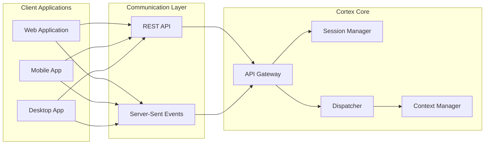

# Cortex Core Client Integration Guide

This guide provides comprehensive information for developers building client applications that integrate with the Cortex Core platform. Whether you're building a web application, mobile app, or desktop client, this document will help you understand how to connect to Cortex Core and implement various input and output modalities.

## Table of Contents

- [Overview](#overview)
- [Authentication](#authentication)
- [Input Modalities](#input-modalities)
- [Output Modalities](#output-modalities)
- [Streaming Responses](#streaming-responses)
- [Real-time Updates with SSE](#real-time-updates-with-sse)
- [Error Handling](#error-handling)
- [Sample Implementations](#sample-implementations)

## Overview

Cortex Core is designed with a modular architecture that supports multiple input and output modalities. Client applications communicate with Cortex Core through a RESTful API and Server-Sent Events (SSE), enabling real-time interactions across various interfaces like chat, voice, canvas, and more.



### Key Concepts

- **Sessions**: Client applications establish a session with Cortex Core to maintain context across interactions.
- **Workspaces**: Logical containers for conversations and resources.
- **Conversations**: Threads of interaction between users and Cortex Core in specific modalities.
- **Modalities**: Different forms of input (chat, voice, canvas) and output (text, speech, visualizations).

## Authentication

All requests to Cortex Core require authentication using JWT tokens.

### Obtaining an Authentication Token

```javascript
// Example using fetch API in JavaScript
async function login(email, password) {
  const response = await fetch("https://your-cortex-core-instance/auth/login", {
    method: "POST",
    headers: {
      "Content-Type": "application/json",
    },
    body: JSON.stringify({
      type: "password",
      identifier: email,
      secret: password,
    }),
  });

  if (!response.ok) {
    throw new Error(`Authentication failed: ${response.statusText}`);
  }

  const data = await response.json();

  // Response format may vary slightly depending on implementation
  // Some implementations return access_token in data.access_token, others in data.token
  const token = data.access_token || data.token;

  // Store the token securely
  localStorage.setItem("cortex_token", token);

  return data;
}
```

### Using the Token in Requests

```javascript
// Example of making an authenticated request
async function makeAuthenticatedRequest(url, method = "GET", body = null) {
  const token = localStorage.getItem("cortex_token");

  if (!token) {
    throw new Error("Not authenticated");
  }

  const options = {
    method,
    headers: {
      Authorization: `Bearer ${token}`,
      "Content-Type": "application/json",
    },
  };

  if (body) {
    options.body = JSON.stringify(body);
  }

  const response = await fetch(url, options);

  if (!response.ok) {
    throw new Error(`Request failed: ${response.statusText}`);
  }

  return response.json();
}
```

### Token Refresh

> ⚠️ **Note**: According to the API Reference, the token refresh endpoint is not currently implemented and returns a 501 Not Implemented status.

```javascript
async function refreshToken() {
  const response = await fetch(
    "https://your-cortex-core-instance/auth/refresh",
    {
      method: "POST",
      headers: {
        Authorization: `Bearer ${localStorage.getItem("cortex_token")}`,
        "Content-Type": "application/json",
      },
    }
  );

  if (!response.ok) {
    // If refresh fails, redirect to login
    window.location.href = "/login";
    return;
  }

  const data = await response.json();
  localStorage.setItem("cortex_token", data.token);

  return data;
}
```

## Input Modalities

Cortex Core supports various input modalities. Here's how to implement each:

### Chat Input

```javascript
async function sendChatMessage(workspaceId, conversationId, message) {
  return makeAuthenticatedRequest(
    `https://your-cortex-core-instance/conversations/${conversationId}/messages`,
    "POST",
    {
      content: message,
      role: "user",
      metadata: {},
    }
  );
}

// Creating a new chat conversation
async function createChatConversation(workspaceId, title = "New Conversation") {
  return makeAuthenticatedRequest(
    `https://your-cortex-core-instance/workspaces/${workspaceId}/conversations`,
    "POST",
    {
      title,
      modality: "chat",
    }
  );
}
```

### Voice Input

For voice input, you'll typically:

1. Record audio on the client
2. Convert to a suitable format (e.g., WAV, MP3)
3. Send to Cortex Core

```javascript
// Example using WebAudio API
let mediaRecorder;
let audioChunks = [];

function startRecording() {
  navigator.mediaDevices.getUserMedia({ audio: true }).then((stream) => {
    mediaRecorder = new MediaRecorder(stream);
    mediaRecorder.ondataavailable = (event) => {
      audioChunks.push(event.data);
    };
    mediaRecorder.start();
  });
}

function stopRecording() {
  return new Promise((resolve) => {
    mediaRecorder.onstop = () => {
      const audioBlob = new Blob(audioChunks, { type: "audio/wav" });
      audioChunks = [];
      resolve(audioBlob);
    };
    mediaRecorder.stop();
  });
}

async function sendVoiceInput(workspaceId, conversationId, audioBlob) {
  const formData = new FormData();
  formData.append("audio", audioBlob);

  const token = localStorage.getItem("cortex_token");

  const response = await fetch(
    `https://your-cortex-core-instance/workspaces/${workspaceId}/conversations/${conversationId}/voice`,
    {
      method: "POST",
      headers: {
        Authorization: `Bearer ${token}`,
      },
      body: formData,
    }
  );

  if (!response.ok) {
    throw new Error(`Voice input failed: ${response.statusText}`);
  }

  return response.json();
}
```

### Canvas Input

For canvas input, you'll typically:

1. Capture user drawings/diagrams as SVG or bitmap data
2. Send to Cortex Core

```javascript
// Example using HTML5 Canvas
const canvas = document.getElementById("inputCanvas");
const ctx = canvas.getContext("2d");

// Drawing functionality implementation...

async function sendCanvasInput(workspaceId, conversationId) {
  // Get canvas data as PNG
  const dataUrl = canvas.toDataURL("image/png");

  // Convert to blob
  const response = await fetch(dataUrl);
  const blob = await response.blob();

  const formData = new FormData();
  formData.append("image", blob, "canvas-input.png");

  const token = localStorage.getItem("cortex_token");

  const apiResponse = await fetch(
    `https://your-cortex-core-instance/workspaces/${workspaceId}/conversations/${conversationId}/canvas`,
    {
      method: "POST",
      headers: {
        Authorization: `Bearer ${token}`,
      },
      body: formData,
    }
  );

  if (!apiResponse.ok) {
    throw new Error(`Canvas input failed: ${apiResponse.statusText}`);
  }

  return apiResponse.json();
}
```

## Output Modalities

Cortex Core can generate outputs in various modalities. Here's how to handle each:

### Chat Output

```javascript
// Get messages from a conversation
async function getConversationMessages(conversationId) {
  return makeAuthenticatedRequest(
    `https://your-cortex-core-instance/conversations/${conversationId}/messages`
  );
}

// Example rendering chat messages
function renderChatMessages(messages) {
  const chatContainer = document.getElementById("chat-container");
  chatContainer.innerHTML = "";

  messages.forEach((message) => {
    const messageDiv = document.createElement("div");
    messageDiv.className = `message ${message.role}`;
    messageDiv.textContent = message.content;
    chatContainer.appendChild(messageDiv);
  });

  // Scroll to the bottom
  chatContainer.scrollTop = chatContainer.scrollHeight;
}
```

### Voice Output

```javascript
// Example using Web Speech API
function speakText(text) {
  const utterance = new SpeechSynthesisUtterance(text);
  window.speechSynthesis.speak(utterance);
}

// Handle voice response from Cortex Core
async function handleVoiceOutput(conversationId, messageId) {
  const response = await makeAuthenticatedRequest(
    `https://your-cortex-core-instance/conversations/${conversationId}/messages/${messageId}/audio`
  );

  if (response.audioUrl) {
    // If server provides audio URL
    const audio = new Audio(response.audioUrl);
    audio.play();
  } else if (response.text) {
    // If server provides text to be spoken by client
    speakText(response.text);
  }
}
```

### Canvas Output

```javascript
// Example handling canvas drawing instructions
async function displayCanvasOutput(conversationId, messageId) {
  const response = await makeAuthenticatedRequest(
    `https://your-cortex-core-instance/conversations/${conversationId}/messages/${messageId}/canvas`
  );

  if (response.svgContent) {
    // If SVG content is provided
    const canvasContainer = document.getElementById("canvas-output");
    canvasContainer.innerHTML = response.svgContent;
  } else if (response.imageUrl) {
    // If image URL is provided
    const img = document.createElement("img");
    img.src = response.imageUrl;
    document.getElementById("canvas-output").appendChild(img);
  } else if (response.drawingInstructions) {
    // If drawing instructions are provided
    const canvas = document.getElementById("outputCanvas");
    const ctx = canvas.getContext("2d");
    executeDrawingInstructions(ctx, response.drawingInstructions);
  }
}

// Execute drawing instructions on canvas
function executeDrawingInstructions(ctx, instructions) {
  instructions.forEach((instruction) => {
    switch (instruction.type) {
      case "line":
        ctx.beginPath();
        ctx.moveTo(instruction.startX, instruction.startY);
        ctx.lineTo(instruction.endX, instruction.endY);
        ctx.stroke();
        break;
      case "circle":
        ctx.beginPath();
        ctx.arc(
          instruction.x,
          instruction.y,
          instruction.radius,
          0,
          2 * Math.PI
        );
        ctx.stroke();
        break;
      // Handle other drawing instruction types
    }
  });
}
```

### Dashboard Output

```javascript
async function renderDashboard(dashboardId) {
  const dashboardData = await makeAuthenticatedRequest(
    `https://your-cortex-core-instance/dashboards/${dashboardId}`
  );

  // Render dashboard components
  const container = document.getElementById("dashboard-container");

  dashboardData.components.forEach((component) => {
    switch (component.type) {
      case "chart":
        renderChart(container, component);
        break;
      case "metric":
        renderMetric(container, component);
        break;
      case "table":
        renderTable(container, component);
        break;
      // Other component types
    }
  });
}

// Example rendering a chart component
function renderChart(container, component) {
  const chartDiv = document.createElement("div");
  chartDiv.className = "dashboard-chart";

  // Using a charting library like Chart.js
  const canvas = document.createElement("canvas");
  chartDiv.appendChild(canvas);
  container.appendChild(chartDiv);

  const ctx = canvas.getContext("2d");
  new Chart(ctx, {
    type: component.chartType,
    data: component.data,
    options: component.options,
  });
}
```

## Streaming Responses

> ⚠️ **Important Update**: According to the API Reference, the streaming endpoint (`/conversations/{id}/messages/stream`) currently returns a placeholder response instructing clients to listen for events via the SSE endpoints. Clients should use the SSE implementation described below for real-time updates.

For real-time interactions, you can use streaming responses from Cortex Core.

### Chat Streaming

```javascript
async function streamChatResponse(workspaceId, conversationId, message) {
  const token = localStorage.getItem("cortex_token");

  const response = await fetch(
    `https://your-cortex-core-instance/workspaces/${workspaceId}/conversations/${conversationId}/messages/stream`,
    {
      method: "POST",
      headers: {
        Authorization: `Bearer ${token}`,
        "Content-Type": "application/json",
      },
      body: JSON.stringify({
        content: message,
        role: "user",
      }),
    }
  );

  if (!response.ok) {
    throw new Error(`Stream request failed: ${response.statusText}`);
  }

  // Process the stream
  const reader = response.body.getReader();
  const decoder = new TextDecoder();
  const responseElement = document.getElementById("response-container");

  responseElement.textContent = ""; // Clear previous content

  while (true) {
    const { value, done } = await reader.read();

    if (done) {
      break;
    }

    // Decode and display the chunk
    const chunk = decoder.decode(value, { stream: true });
    try {
      const parsedChunk = JSON.parse(chunk);

      if (
        parsedChunk.choices &&
        parsedChunk.choices[0] &&
        parsedChunk.choices[0].delta &&
        parsedChunk.choices[0].delta.content
      ) {
        responseElement.textContent += parsedChunk.choices[0].delta.content;
      }
    } catch (e) {
      // Handle parsing errors or partial JSON
      console.warn("Error parsing chunk:", e);
    }
  }
}
```

## Real-time Updates with SSE

For real-time updates and events, use Server-Sent Events (SSE). The SSE system has been updated to use the sse-starlette library for improved connection stability.

> ⚠️ **Important**: All timestamp fields from the server are provided in ISO 8601 format with UTC timezone (e.g., `2023-01-15T12:00:00Z`). Client implementations should convert these to local time for display.

### Unified SSE Endpoint Pattern

The Cortex Core SSE implementation uses a clean, unified endpoint pattern for all event types:

```
GET /v1/{channel_type}/{resource_id}?token={token}
```

Where:

- `channel_type`: The type of events to subscribe to (one of: `global`, `user`, `workspace`, `conversation`)
- `resource_id`: The ID of the resource to subscribe to (not required for global events)
- `token`: Your authentication token as a query parameter

### SSE Client Implementation

```javascript
class CortexEventSource {
  constructor(baseUrl) {
    this.baseUrl = baseUrl;
    this.eventSource = null;
    this.eventHandlers = {};
    this.reconnectAttempts = 0;
    this.maxReconnectAttempts = 5;
    this.reconnectDelay = 1000; // Start with 1 second delay
  }

  connect(path) {
    const token = localStorage.getItem("cortex_token");

    if (!token) {
      throw new Error("Not authenticated");
    }

    const url = new URL(`${this.baseUrl}${path}`);
    url.searchParams.append("token", token);

    this.disconnect(); // Close any existing connection

    try {
      this.eventSource = new EventSource(url.toString());

      this.eventSource.onopen = () => {
        console.log("SSE connection opened");
        this.reconnectAttempts = 0;
        this.reconnectDelay = 1000;
        this._triggerEvent("connect");
      };

      this.eventSource.onerror = (error) => {
        console.error("SSE connection error:", error);
        this._triggerEvent("error", error);

        // Attempt to reconnect on error
        if (this.eventSource.readyState === EventSource.CLOSED) {
          this._reconnect(path);
        }
      };

      // Setup general message handler
      this.eventSource.addEventListener("message", (event) => {
        try {
          const data = JSON.parse(event.data);
          this._triggerEvent("message", data);
        } catch (error) {
          console.error("Error parsing SSE message:", error);
        }
      });

      // Listen for specific event types
      [
        "conversation_update",
        "message_received",
        "notification",
        "status_update",
        "typing_indicator",
      ].forEach((eventType) => {
        this.eventSource.addEventListener(eventType, (event) => {
          try {
            const data = JSON.parse(event.data);

            // Convert UTC timestamp to local time for display
            if (data.created_at) {
              data.localTime = new Date(data.created_at).toLocaleString();
            }

            this._triggerEvent(eventType, data);
          } catch (error) {
            console.error(`Error parsing ${eventType} event:`, error);
          }
        });
      });
    } catch (error) {
      console.error("Failed to create EventSource:", error);
      this._reconnect(path);
    }
  }

  disconnect() {
    if (this.eventSource) {
      this.eventSource.close();
      this.eventSource = null;
    }
  }

  on(eventType, handler) {
    if (!this.eventHandlers[eventType]) {
      this.eventHandlers[eventType] = [];
    }

    this.eventHandlers[eventType].push(handler);
  }

  off(eventType, handler) {
    if (!this.eventHandlers[eventType]) {
      return;
    }

    if (handler) {
      this.eventHandlers[eventType] = this.eventHandlers[eventType].filter(
        (h) => h !== handler
      );
    } else {
      this.eventHandlers[eventType] = [];
    }
  }

  _triggerEvent(eventType, data) {
    if (!this.eventHandlers[eventType]) {
      return;
    }

    this.eventHandlers[eventType].forEach((handler) => {
      try {
        handler(data);
      } catch (error) {
        console.error(`Error in ${eventType} event handler:`, error);
      }
    });
  }

  _reconnect(path) {
    if (this.reconnectAttempts >= this.maxReconnectAttempts) {
      console.error("Maximum reconnection attempts reached");
      this._triggerEvent("reconnect_failed");
      return;
    }

    this.reconnectAttempts++;
    this._triggerEvent("reconnecting", { attempt: this.reconnectAttempts });

    setTimeout(() => {
      console.log(`Reconnecting (attempt ${this.reconnectAttempts})...`);
      this.connect(path);
    }, this.reconnectDelay);

    // Exponential backoff
    this.reconnectDelay *= 2;
  }
}

// Usage example
const events = new CortexEventSource("https://your-cortex-core-instance");

events.on("connect", () => {
  console.log("Connected to Cortex Core events");
});

events.on("conversation_update", (data) => {
  console.log("Conversation updated:", data);
  // Update UI with new conversation data
});

events.on("message_received", (data) => {
  console.log("New message received:", data);
  // Update UI with new message

  // Example of using the converted local time
  console.log(`Message received at local time: ${data.localTime}`);
});

// Connect to the unified events endpoints
events.connect("/v1/global"); // For system-wide events

// For user-specific events
// events.connect(`/v1/user/${userId}`);

// For workspace-specific events
// events.connect(`/v1/workspace/${workspaceId}`);

// For conversation-specific events
// events.connect(`/v1/conversation/${conversationId}`);
```

### SSE Channel Types and Events

#### Global Channel (`/v1/global`)

```javascript
// Subscribe to global events
events.connect("/v1/global");

// Handle global notifications
events.on("notification", (data) => {
  console.log("Global notification:", data);
  showNotification(data.message);
});

// Handle system updates
events.on("system_update", (data) => {
  console.log("System update:", data);
  if (data.requiresRefresh) {
    alert("System has been updated. Please refresh your browser.");
  }
});
```

#### User Channel (`/v1/user/{userId}`)

```javascript
// Subscribe to user-specific events
events.connect(`/v1/user/${userId}`);

// Handle user notifications
events.on("notification", (data) => {
  console.log("User notification:", data);
  showUserNotification(data.message);
});

// Handle preference updates
events.on("preference_update", (data) => {
  console.log("Preference update:", data);
  updateUserPreferences(data);
});
```

#### Workspace Channel (`/v1/workspace/{workspaceId}`)

```javascript
// Subscribe to workspace events
events.connect(`/v1/workspace/${workspaceId}`);

// Handle new conversation creation
events.on("conversation_created", (data) => {
  console.log("New conversation:", data);
  addConversationToUI(data);
});

// Handle conversation deletion
events.on("conversation_deleted", (data) => {
  console.log("Conversation deleted:", data);
  removeConversationFromUI(data.id);
});

// Handle workspace updates
events.on("workspace_update", (data) => {
  console.log("Workspace update:", data);
  updateWorkspaceUI(data);
});
```

#### Conversation Channel (`/v1/conversation/{conversationId}`)

```javascript
// Subscribe to conversation events
events.connect(`/v1/conversation/${conversationId}`);

// Handle new messages
events.on("message_received", (data) => {
  console.log("New message:", data);
  addMessageToUI(data);
});

// Handle typing indicators
events.on("typing_indicator", (data) => {
  console.log("Typing indicator:", data);
  if (data.isTyping) {
    showTypingIndicator();
  } else {
    hideTypingIndicator();
  }
});

// Handle conversation updates
events.on("conversation_update", (data) => {
  console.log("Conversation update:", data);
  updateConversationUI(data);
});

// Handle status updates
events.on("status_update", (data) => {
  console.log("Status update:", data);
  updateStatusUI(data);
});
```

### Handling Timestamps

All timestamps from the server are provided in UTC and should be converted to local time for display:

```javascript
// Convert UTC timestamp to local time
function formatTimestamp(utcTimestamp) {
  if (!utcTimestamp) return "";

  const date = new Date(utcTimestamp);
  return date.toLocaleString(); // Format according to user's locale
}

// Example usage
events.on("message_received", (data) => {
  const localTime = formatTimestamp(data.created_at);
  console.log(`Message received at ${localTime}`);

  // Update UI with message and formatted time
  const messageEl = document.createElement("div");
  messageEl.innerHTML = `
    <div class="message-content">${data.content}</div>
    <div class="message-time">${localTime}</div>
  `;
  messagesContainer.appendChild(messageEl);
});
```

## Error Handling

Implement robust error handling to ensure a good user experience:

```javascript
// Example error handling wrapper
async function safeApiCall(apiFunction, ...args) {
  try {
    return await apiFunction(...args);
  } catch (error) {
    console.error("API call failed:", error);

    // Handle token expiration
    if (
      error.message.includes("401") ||
      error.message.includes("Unauthorized")
    ) {
      try {
        await refreshToken();
        // Retry the API call once with the new token
        return await apiFunction(...args);
      } catch (refreshError) {
        console.error("Token refresh failed:", refreshError);
        // Redirect to login
        window.location.href = "/login";
        throw new Error("Authentication required");
      }
    }

    // Handle other error types
    if (error.message.includes("404")) {
      notifyUser("Resource not found");
    } else if (error.message.includes("429")) {
      notifyUser("Rate limit exceeded. Please try again later.");
    } else {
      notifyUser("An error occurred. Please try again.");
    }

    throw error;
  }
}

// User notification function
function notifyUser(message) {
  // Implement your UI notification system
  const notification = document.createElement("div");
  notification.className = "notification error";
  notification.textContent = message;
  document.body.appendChild(notification);

  setTimeout(() => {
    notification.classList.add("fade-out");
    setTimeout(() => {
      notification.remove();
    }, 500);
  }, 3000);
}
```

### Handling SSE Connection Errors

```javascript
// SSE-specific error handling
function setupSSEErrorHandling(eventSource) {
  // Listen for connection errors
  eventSource.addEventListener("error", (event) => {
    console.error("SSE connection error:", event);

    // Check if the connection is closed
    if (eventSource.readyState === EventSource.CLOSED) {
      notifyUser("Connection lost. Attempting to reconnect...");

      // Implement reconnection logic
      setTimeout(() => {
        // Attempt to reconnect
        reconnectSSE();
      }, 3000);
    }
  });
}

// Reconnection with exponential backoff
let reconnectAttempts = 0;
const maxReconnectAttempts = 5;

function reconnectSSE() {
  if (reconnectAttempts >= maxReconnectAttempts) {
    notifyUser("Unable to reconnect. Please refresh the page.");
    return;
  }

  reconnectAttempts++;
  const backoffTime = Math.min(1000 * Math.pow(2, reconnectAttempts), 30000);

  notifyUser(`Reconnecting (attempt ${reconnectAttempts})...`);

  // Try to reconnect after backoff time
  setTimeout(() => {
    // Implementation depends on your SSE setup
    setupSSEConnection();
  }, backoffTime);
}
```

## Sample Implementations

### Basic Chat Interface

This is a simplified example of a chat interface using the Cortex Core API and SSE:

```html
<!DOCTYPE html>
<html lang="en">
  <head>
    <meta charset="UTF-8" />
    <meta name="viewport" content="width=device-width, initial-scale=1.0" />
    <title>Cortex Chat Interface</title>
    <style>
      /* CSS styles omitted for brevity */
    </style>
  </head>
  <body>
    <div class="chat-container">
      <div class="chat-header">
        <h2>Cortex Chat</h2>
      </div>
      <div class="messages-container" id="messages-container">
        <div class="message assistant">Hello! How can I help you today?</div>
        <div class="typing-indicator" id="typing-indicator">
          <span class="dot"></span>
          <span class="dot"></span>
          <span class="dot"></span>
        </div>
      </div>
      <div class="input-container">
        <input
          type="text"
          id="message-input"
          placeholder="Type your message..."
        />
        <button id="send-button">Send</button>
      </div>
    </div>

    <script>
      // JavaScript for the chat interface
      document.addEventListener("DOMContentLoaded", () => {
        const messagesContainer = document.getElementById("messages-container");
        const messageInput = document.getElementById("message-input");
        const sendButton = document.getElementById("send-button");
        const typingIndicator = document.getElementById("typing-indicator");

        // Current conversation details
        const workspaceId = "workspace-123";
        const conversationId = "conversation-456";

        // Send a message when the send button is clicked
        sendButton.addEventListener("click", () => {
          sendMessage();
        });

        // Send a message when Enter key is pressed in the input field
        messageInput.addEventListener("keypress", (event) => {
          if (event.key === "Enter") {
            sendMessage();
          }
        });

        // Set up SSE for real-time updates
        setupEventSource();

        // Function to send a message
        async function sendMessage() {
          const message = messageInput.value.trim();

          if (!message) {
            return;
          }

          // Add the user message to the chat
          addMessage(message, "user");

          // Clear the input field
          messageInput.value = "";

          // Show typing indicator
          typingIndicator.style.display = "block";

          try {
            // Send the message to Cortex Core
            const response = await fetch(
              `https://your-cortex-core-instance/conversations/${conversationId}/messages`,
              {
                method: "POST",
                headers: {
                  Authorization: `Bearer ${localStorage.getItem(
                    "cortex_token"
                  )}`,
                  "Content-Type": "application/json",
                },
                body: JSON.stringify({
                  content: message,
                  role: "user",
                }),
              }
            );

            if (!response.ok) {
              throw new Error(`Request failed: ${response.statusText}`);
            }

            // We don't need to handle the response here as we'll get updates via SSE
            // The typing indicator will be hidden when we receive the message via SSE
          } catch (error) {
            console.error("Error sending message:", error);

            // Hide typing indicator
            typingIndicator.style.display = "none";

            // Display error message
            addMessage(
              "Sorry, something went wrong. Please try again.",
              "assistant"
            );
          }
        }

        // Function to add a message to the chat
        function addMessage(content, role, timestamp = "") {
          const messageElement = document.createElement("div");
          messageElement.className = `message ${role}`;

          // Add timestamp prefix if provided
          messageElement.textContent = timestamp + content;

          // Insert before typing indicator
          messagesContainer.insertBefore(messageElement, typingIndicator);

          // Scroll to the bottom
          messagesContainer.scrollTop = messagesContainer.scrollHeight;
        }

        // Function to set up SSE for real-time updates
        function setupEventSource() {
          const token = localStorage.getItem("cortex_token");

          if (!token) {
            console.error("Not authenticated");
            return;
          }

          const url = new URL(
            `https://your-cortex-core-instance/v1/conversation/${conversationId}`
          );
          url.searchParams.append("token", token);

          const eventSource = new EventSource(url.toString());

          eventSource.onopen = () => {
            console.log("SSE connection opened");
          };

          eventSource.onerror = (error) => {
            console.error("SSE connection error:", error);
            eventSource.close();

            // Attempt to reconnect after a delay
            setTimeout(setupEventSource, 3000);
          };

          // Listen for new messages
          eventSource.addEventListener("message_received", (event) => {
            try {
              const data = JSON.parse(event.data);

              // Hide typing indicator
              typingIndicator.style.display = "none";

              // Add the assistant's message to the chat
              if (data.role === "assistant" && data.content) {
                // Convert UTC timestamp to local time for display if timestamp exists
                let timestampDisplay = "";
                if (data.created_at) {
                  const localTime = new Date(
                    data.created_at
                  ).toLocaleTimeString();
                  timestampDisplay = `[${localTime}] `;
                }

                // Add message with timestamp if available
                addMessage(data.content, "assistant", timestampDisplay);
              }
            } catch (error) {
              console.error("Error handling message event:", error);
            }
          });

          // Listen for typing indicator events
          eventSource.addEventListener("typing_indicator", (event) => {
            try {
              const data = JSON.parse(event.data);

              if (data.isTyping) {
                typingIndicator.style.display = "block";
              } else {
                typingIndicator.style.display = "none";
              }
            } catch (error) {
              console.error("Error handling typing indicator event:", error);
            }
          });

          // Clean up on page unload
          window.addEventListener("beforeunload", () => {
            eventSource.close();
          });
        }
      });
    </script>
  </body>
</html>
```

### Full Client Implementation

For a more complete implementation, refer to the `web-client.html` in the `cortex-chat` directory, which demonstrates:

1. User authentication
2. Workspace and conversation management
3. SSE connection management with reconnection logic
4. Message sending and receiving
5. Proper timestamp handling
6. Typing indicators

## Best Practices

1. **Authentication Management**

   - Store tokens securely (HttpOnly cookies for web apps, secure storage for mobile apps)
   - Handle authentication errors gracefully
   - Implement proper redirection to login when authentication fails

2. **Error Handling**

   - Implement comprehensive error handling
   - Provide user-friendly error messages
   - Log detailed errors for debugging
   - Retry strategies for transient failures

3. **Performance Optimization**

   - Use connection pooling for API requests
   - Implement caching where appropriate
   - Optimize assets and payloads
   - Use SSE for real-time updates

4. **UX Considerations**

   - Show loading states and typing indicators
   - Provide feedback for user actions
   - Handle transitions smoothly
   - Ensure accessibility compliance

5. **Security Best Practices**

   - Validate all inputs
   - Implement proper CORS settings for web apps
   - Use HTTPS for all communications
   - Follow the principle of least privilege

6. **Timestamp Handling**

   - Always treat server timestamps as UTC (all API timestamps are provided in ISO 8601 format with UTC timezone)
   - Convert UTC timestamps to local time on the client side for display
   - Use timezone-aware date libraries (like date-fns, luxon, or moment-timezone) to handle conversions
   - Consider user timezone preferences in your application settings

7. **SSE Connection Management**

   - Implement proper reconnection strategy with exponential backoff
   - Handle connection errors gracefully
   - Clean up connections when no longer needed
   - Consider connection limits in production environments

8. **Testing**
   - Test across different browsers/devices
   - Implement unit tests for client logic
   - Test error scenarios and edge cases
   - Monitor performance metrics

## Troubleshooting

### Common Issues and Solutions

1. **Authentication Issues**

   - **Issue**: 401 Unauthorized errors
   - **Solution**: Check if the token is valid, not expired, and properly sent in the Authorization header

2. **SSE Connection Problems**

   - **Issue**: EventSource disconnects frequently
   - **Solution**: Implement reconnection logic with exponential backoff
   - **Solution**: Ensure server configurations allow long-lived connections

3. **Response Handling Errors**

   - **Issue**: Error parsing response data
   - **Solution**: Validate response structure before processing
   - **Solution**: Implement proper error handling for malformed data

4. **Performance Issues**
   - **Issue**: Slow response times
   - **Solution**: Optimize request payloads, implement caching, and consider client-side optimizations

### Deployment Considerations

1. **Proxy Configuration**

   If you're deploying behind a proxy (e.g., Nginx), ensure it's configured for SSE:

   ```nginx
   # Nginx configuration for SSE
   location /v1/ {
       proxy_pass http://your-backend-service;
       proxy_http_version 1.1;
       proxy_set_header Connection "";
       proxy_buffering off;
       proxy_read_timeout 3600s;
       proxy_set_header Host $host;
       proxy_set_header X-Real-IP $remote_addr;
   }
   ```

2. **Load Balancing**

   For high-availability setups:

   - Consider sticky sessions for SSE connections
   - Implement Redis or similar for shared connection state
   - Set appropriate timeout values on load balancers

3. **Timeouts**

   Configure appropriate timeouts:

   - Client-side reconnection timeouts (as shown in the SSE implementation)
   - Server-side request timeouts
   - Proxy/load balancer timeouts

### Debugging Tips

1. Use browser developer tools to inspect network requests and responses
2. Enable verbose logging during development
3. Test API endpoints with tools like Postman or Insomnia before integration
4. Use EventSource monitoring in browser dev tools for SSE debugging

## Support and Resources

- [API Documentation](./API_REFERENCE.md)
- [SSE Documentation](./SSE.md)
- [SSE Implementation Improvements](./SSE_IMPROVEMENTS.md)
