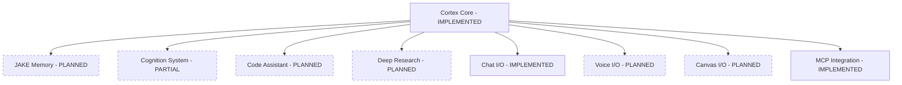

# Cortex Core Architecture

This document describes the high-level architecture of Cortex Core, its components, and design principles. It connects the current implementation to the architectural vision outlined in the Cortex Platform documents.

## Vision Alignment

Cortex Core implements the central architecture described in the [Cortex Platform Vision](../cortex-platform/ai-context/cortex/Cortex_Platform-Vision_and_Values.md) and [Technical Architecture](../cortex-platform/ai-context/cortex/Cortex_Platform-Technical_Architecture.md) documents. The implementation follows the modular design principles of the "Central AI Core with Adaptive Ecosystem" approach:



The current implementation provides the foundation for this vision with several key components already in place, while others are planned for future development. See the [Implementation Status](./IMPLEMENTATION_STATUS.md) document for a detailed breakdown.

## Architectural Principles

1. **Separation of Concerns**: Each component has a single responsibility
2. **Dependency Inversion**: High-level modules don't depend on low-level modules
3. **Interface Segregation**: Clients depend only on interfaces they use
4. **Clean Architecture**: Dependencies point inward toward domain entities
5. **Repository Pattern**: Data access is abstracted behind repository interfaces
6. **Modularity**: Components can be developed, tested, and replaced independently
7. **Domain-Driven Design**: Strong focus on domain models and business logic

## Layered Architecture

The current implementation follows a layered architecture that aligns with the vision's modular approach:

```
┌─────────────────┐
│   API Layer     │ ← HTTP concerns only
├─────────────────┤
│  Service Layer  │ ← Business logic
├─────────────────┤
│ Repository Layer│ ← Data access
├─────────────────┤
│   Data Layer    │ ← Database/ORM
└─────────────────┘
```

### API Layer

The API layer is responsible for handling HTTP requests and responses. It:
- Defines routes and endpoint handlers
- Validates input data
- Handles authentication and authorization
- Returns formatted responses
- Doesn't contain business logic

### Service Layer

The service layer contains the core business logic of the application. It:
- Implements business rules and workflows
- Orchestrates operations across multiple repositories
- Handles domain events
- Doesn't know about HTTP or database details

### Repository Layer

The repository layer abstracts data access. It:
- Provides a collection-like interface for domain entities
- Hides database implementation details
- Translates between domain entities and database models
- Handles serialization/deserialization to/from database formats

### Data Layer

The data layer contains the database models and connections. It:
- Defines database schema
- Provides ORM models
- Handles database connections and sessions

## Core System Components

### CortexRouter

The CortexRouter is the central dispatching component that aligns with the "Task Orchestration" aspect of the Cortex Core in the vision. It:
- Receives input messages from various channels
- Makes routing decisions based on message content
- Delegates specialized tasks to appropriate handlers
- Manages asynchronous processing of messages
- Sends responses through appropriate channels

See [ROUTER.md](./ROUTER.md) for detailed information.

### Event System

The event system provides a publish-subscribe mechanism for loose coupling between components. Events represent things that have happened in the system. The event system consists of:

1. **Event Bus**: Core publish-subscribe mechanism for internal communication
2. **Event Subscribers**: Components that listen for and react to events
3. **SSE System**: Server-Sent Events module for real-time client communication

#### SSE Architecture

The SSE system follows a clean, modular design with a unified endpoint structure:

```
┌───────────────────────────────┐
│       Unified SSE API         │ ← HTTP endpoints (/v1/{channel_type}/{resource_id})
├───────────────────────────────┤
│         SSE Service           │ ← Orchestration layer
├───────────┬─────────┬─────────┤
│Connection │   Auth  │  Event  │ ← Component layer
│ Manager   │ Service │Subscriber│
└───────────┴─────────┴─────────┘
```

This modular architecture provides:
- Clean separation of concerns with specialized components
- Improved testability through dependency injection
- Easier maintenance and evolution
- Consistent interface for all event types
- Unified authentication and authorization

See [SSE.md](./SSE.md) for detailed information.

### Integration Hub and MCP Architecture

The Integration Hub manages communication between Cortex Core and Domain Expert services using the Model Context Protocol (MCP). This is a central component of the platform's architecture for service-to-service communication, corresponding to the "Inter-Service Communication" layer in the vision:

```
┌────────────────────┐           ┌────────────────────┐
│    Cortex Core     │           │   Domain Experts   │
│                    │◄────────►│                    │
│ ┌────────────────┐ │           │ ┌────────────────┐ │
│ │Integration Hub │ │   MCP     │ │  FastMCP API   │ │
│ │with MCP Client │◄┼──────────┼►│  Server         │ │
│ └────────────────┘ │           │ └────────────────┘ │
└────────────────────┘           └────────────────────┘
```

The Integration Hub provides:

1. **MCP Client Implementation**: Uses the Python MCP SDK client to communicate with domain expert services
2. **Tool Execution Framework**: Registers, discovers and executes tools provided by domain experts
3. **Service Discovery**: Manages connections to configured MCP endpoints 
4. **Resource Access**: Facilitates access to resources exposed by domain expert services
5. **Error Handling**: Implements robust error handling and retries for domain expert communication

See [INTEGRATION_HUB.md](./INTEGRATION_HUB.md) and [DOMAIN_EXPERTS.md](./DOMAIN_EXPERTS.md) for detailed information.

### Memory System

The Memory System provides short and long-term storage capabilities for conversation context and user preferences. It implements the "unified memory" concept from the vision:

- **Current Implementation**: Whiteboard Memory (simple database-backed storage)
- **Planned Implementation**: JAKE Memory or equivalent (vector-based storage with advanced capabilities)

The Memory System follows an interface-based design pattern, allowing for different implementations with a consistent API:

```
┌─────────────────┐     ┌─────────────────────┐
│                 │     │                     │
│  API Endpoints  │     │  Context Manager    │
│                 │     │                     │
└────────┬────────┘     └──────────┬──────────┘
         │                         │
         │                         │
         │     ┌───────────────────▼────────────────────┐
         │     │                                        │
         └────►│   Memory System Interface (Abstract)   │
               │                                        │
               └───────────┬───────────────────────────┘
                           │
                           │
             ┌─────────────┴──────────────┐
             │                            │
 ┌───────────▼───────────┐    ┌───────────▼───────────┐
 │                       │    │                       │
 │  Whiteboard Memory    │    │   JAKE Memory         │
 │  (Database-backed)    │    │   (Vector database)   │
 │    [IMPLEMENTED]      │    │      [PLANNED]        │
 └───────────────────────┘    └───────────────────────┘
```

See [MEMORY_SYSTEM.md](./MEMORY_SYSTEM.md) for detailed information.

### LLM Service

The LLM Service provides a unified interface to language models from various providers. This component is part of the Cortex Core's "adaptive reasoning" capabilities described in the vision:

- Supports multiple LLM providers through LiteLLM
- Provides standardized completion and streaming APIs
- Handles model-specific parameters and authentication
- Includes mock mode for development without API keys

```
┌───────────────────┐           ┌───────────────┐           ┌────────────────┐
│   CortexRouter    │           │  LLM Service  │           │     LiteLLM    │
│                   │──────────▶│               │──────────▶│                │
│ (Message Routing) │           │ (LLM Access)  │           │ (Provider API) │
└───────────────────┘           └───────────────┘           └────────────────┘
```

See [LLM_INTEGRATION.md](./LLM_INTEGRATION.md) and [services/LLM_SERVICE.md](./services/LLM_SERVICE.md) for detailed information.

## Repository Pattern Implementation

We use the Repository Pattern to abstract database access concerns. For example:

```python
# Abstract Repository Interface
class ConversationRepository(ABC):
    @abstractmethod
    def get_conversation_by_id(self, conversation_id: str) -> Optional[Conversation]:
        pass
        
    @abstractmethod
    def get_conversations_by_workspace(self, workspace_id: str, limit: int, offset: int) -> List[Conversation]:
        pass
        
    @abstractmethod
    def add_message(self, conversation_id: str, content: str, role: str, metadata: Optional[Dict] = None) -> Dict:
        pass
        
# Concrete Implementation
class SQLAlchemyConversationRepository(ConversationRepository):
    def __init__(self, db_session: Session):
        self.db = db_session
        
    def get_conversation_by_id(self, conversation_id: str) -> Optional[Conversation]:
        return self.db.query(Conversation).filter(Conversation.id == conversation_id).first()
        
    # ... other methods
```

This pattern ensures clean separation between domain logic and data access, and is a key part of the domain-driven architecture.

## Dependency Injection

We use FastAPI's dependency injection system to provide services and repositories to endpoints:

```python
@router.get("/conversations/{conversation_id}")
async def get_conversation(
    conversation_id: str,
    repository: ConversationRepository = Depends(get_repository),
    user: User = Depends(get_current_user)
):
    conversation = repository.get_conversation_by_id(conversation_id)
    if not conversation:
        raise HTTPException(status_code=404, detail="Conversation not found")
    return conversation
```

## Message Processing Architecture

The system uses a message-based architecture for processing client requests:

1. **Asyncio-Based Processing**: Background tasks use asyncio for better performance and resource utilization
2. **Direct Communication Paths**: Services communicate directly when appropriate for simplicity
3. **Server-Sent Events (SSE)**: Real-time updates use SSE for efficient, one-way client communication
4. **Fire-and-Forget API**: Message processing happens asynchronously after API acknowledgment
5. **Required vs Optional Fields**: Message fields that are always needed are marked as required for type safety
6. **Clean Resource Management**: All components with background tasks provide proper cleanup methods

See [ROUTER.md](./ROUTER.md) for more details on message processing.

## Data Flow Examples

### Creating a Conversation

1. Client sends a POST request to `/workspaces/{workspace_id}/conversations`
2. API layer validates the request
3. Service layer performs business logic
4. Repository layer creates the conversation in the database
5. API layer returns the created conversation

### Adding a Message to a Conversation

1. Client sends a POST request to `/conversations/{conversation_id}/messages`
2. API layer validates the request
3. Repository layer adds the message to the conversation
4. Message is passed to the CortexRouter for asynchronous processing
5. API layer returns acknowledgment
6. CortexRouter processes the message in the background:
   - Shows typing indicator via direct SSE
   - Performs required processing 
   - Saves response to database
   - Removes typing indicator
   - Sends response via direct SSE
7. Client receives real-time updates via SSE

## Architecture Decision Records

For major architectural decisions, we maintain ADRs (Architecture Decision Records) in the `/docs/adr` directory.

We currently have the following ADRs:

1. [ADR-001: Automated Architecture Validation](adr/adr-001-automated-architecture-validation.md) - Implementation of automated tests and tools to enforce architectural boundaries
2. [ADR-002: Domain-Driven Repository Architecture](adr/adr-002-domain-driven-repository-architecture.md) - Our overall architecture pattern for separation of database, domain, and API models
3. [ADR-003: SSE Implementation with sse-starlette](adr/adr-003-sse-starlette-implementation.md) - Adoption of the sse-starlette library for improved SSE handling
4. [ADR-004: Type Safety with SQLAlchemy and Pydantic](adr/adr-004-type-safety-sqlalchemy-pydantic.md) - Patterns for ensuring type safety between SQLAlchemy and Pydantic models
5. [ADR-005: Service Layer Pattern](adr/adr-005-service-layer-pattern.md) - Implementation of a dedicated service layer for business logic
6. [ADR-006: Simplified Messaging Architecture](adr/adr-006-messaging-architecture.md) - Design decisions for the messaging architecture

## Future Architecture Evolution

As Cortex Core evolves, it will continue to align more closely with the architectural vision:

1. **Advanced Memory System**: Implementing the JAKE Memory system or equivalent
2. **Domain Expert Integration**: Building actual Domain Expert services
3. **Multi-Modal Support**: Adding voice and canvas modalities
4. **Enhanced Context Management**: Implementing more sophisticated context handling

These enhancements will build on the existing architectural foundation while maintaining the clean separation of concerns and modular design.

## Related Documentation

- [Implementation Status](./IMPLEMENTATION_STATUS.md): Current implementation status and roadmap
- [Cortex Platform Vision](../cortex-platform/ai-context/cortex/Cortex_Platform-Vision_and_Values.md): Overall vision for the Cortex Platform
- [Cortex Platform Technical Architecture](../cortex-platform/ai-context/cortex/Cortex_Platform-Technical_Architecture.md): Detailed technical architecture for the Cortex Platform