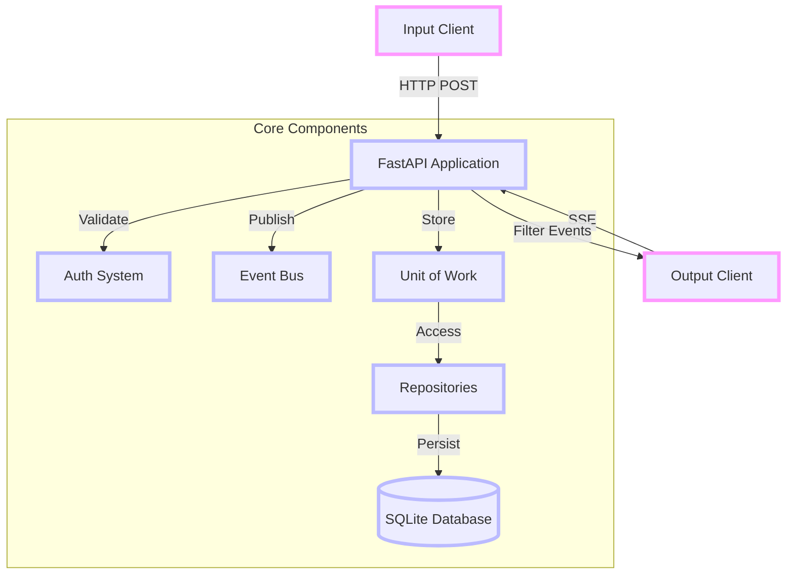
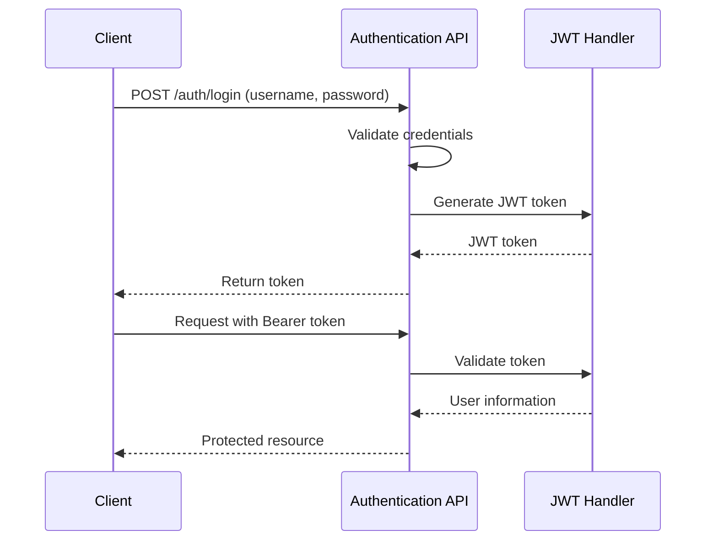
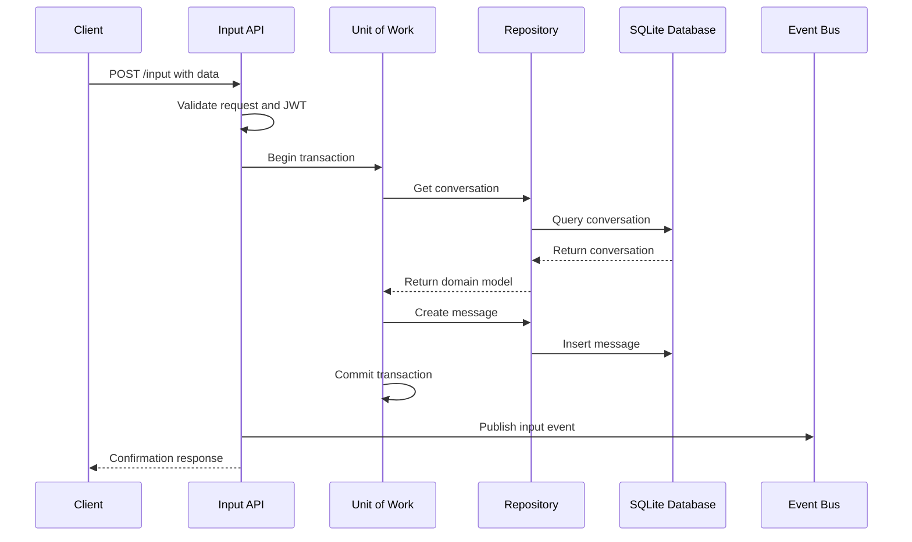
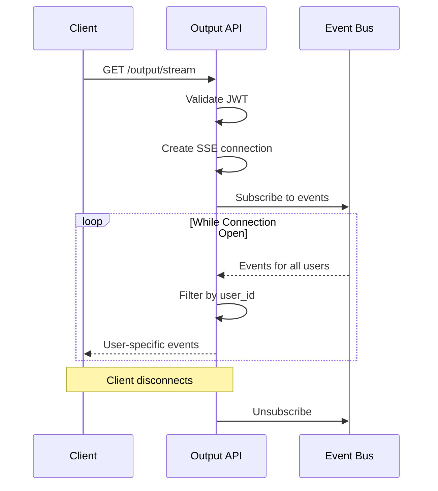

# Cortex Core Architecture Overview

This document provides a high-level overview of the Cortex Core architecture as implemented in Phase 2. It serves as a comprehensive guide for developers working with the codebase.

## System Purpose

Cortex Core is a centralized API service that manages communication between input clients (which send data) and output clients (which receive processed data). It provides a clean, reliable communication channel between these clients while ensuring proper data isolation between users.

## Core Architecture Principles

The Cortex Core architecture is built upon these fundamental principles:

1. **Ruthless Simplicity**: Every component is designed to be as simple as possible while maintaining functionality.
2. **Clean Separation**: Input and output paths are strictly separated.
3. **Event-Driven Communication**: An event bus handles all internal communication.
4. **User Partitioning**: All data is strictly partitioned by user ID.
5. **Stateless API Design**: No server-side sessions; authentication via JWT.
6. **Domain-Driven Repository Architecture**: Clear separation between database, domain, and API models.

## Phase 2 Implementation

Phase 2 implements a complete, functional input/output system with SQLite persistence using a repository pattern. This enables immediate development of client applications while providing a robust data storage solution.

### High-Level Architecture Diagram



### Core Components

#### 1. FastAPI Application (`app/main.py`)

- Main application entry point
- Router registration and middleware configuration
- Dependency injection configuration
- Application lifecycle management

```python
# Basic structure
app = FastAPI(title="Cortex Core API")
app.include_router(auth_router)
app.include_router(input_router)
app.include_router(output_router)
app.include_router(config_router)

# CORS middleware
app.add_middleware(
    CORSMiddleware,
    allow_origins=origins,
    allow_credentials=True,
    allow_methods=["*"],
    allow_headers=["*"],
)

# Lifespan context manager for startup/shutdown
@asynccontextmanager
async def lifespan(app: FastAPI):
    # Setup code (event bus initialization, etc.)
    yield
    # Cleanup code
```

#### 2. Authentication System (`app/utils/auth.py`, `app/api/auth.py`)

- JWT token generation and validation
- User authentication endpoints
- Token validation dependencies for protected endpoints

#### 3. Event Bus (`app/core/event_bus.py`)

- In-memory message bus using asyncio
- Subscription management and event publishing
- Event filtering by user ID

```python
# Basic structure
class EventBus:
    def __init__(self):
        self.subscribers = []  # List of asyncio.Queue objects

    def subscribe(self, queue: asyncio.Queue) -> None:
        self.subscribers.append(queue)

    async def publish(self, event: Dict[str, Any]) -> None:
        # Distribute events to all subscribers
        for queue in self.subscribers:
            await queue.put(event)

    def unsubscribe(self, queue: asyncio.Queue) -> None:
        if queue in self.subscribers:
            self.subscribers.remove(queue)
```

#### 4. Input API (`app/api/input.py`)

- Endpoint for receiving data from clients
- Request validation and authentication
- Event publication to the Event Bus

```python
# Basic structure
@router.post("/input")
async def receive_input(
    input_data: InputRequest,
    user: UserData = Depends(get_current_user),
    event_bus: EventBus = Depends(get_event_bus),
    storage: InMemoryStorage = Depends(get_storage)
) -> Dict[str, Any]:
    # Validate, process input, and publish event
    event = {
        "type": "input",
        "data": input_data.dict(),
        "user_id": user.user_id,
        "timestamp": datetime.now().isoformat()
    }

    # Store in memory and publish to event bus
    await storage.store_message(user.user_id, input_data.conversation_id, event)
    await event_bus.publish(event)

    return {"status": "received"}
```

#### 5. Output API with SSE (`app/api/output.py`)

- Server-Sent Events endpoint for streaming output
- User-specific event filtering
- Connection management with proper cleanup

```python
# Basic structure
@router.get("/output/stream")
async def output_stream(
    request: Request,
    user: UserData = Depends(get_current_user),
    event_bus: EventBus = Depends(get_event_bus)
) -> StreamingResponse:
    # Create a queue for this connection
    queue = asyncio.Queue()

    # Subscribe to the event bus
    event_bus.subscribe(queue)

    async def event_generator():
        try:
            while True:
                # Get event from queue with timeout
                try:
                    event = await asyncio.wait_for(queue.get(), timeout=30)

                    # Filter events for this user
                    if event.get("user_id") == user.user_id:
                        yield f"data: {json.dumps(event)}\n\n"
                except asyncio.TimeoutError:
                    # Send heartbeat on timeout
                    yield f"data: {json.dumps({'type': 'heartbeat'})}\n\n"
        except asyncio.CancelledError:
            # Client disconnected, clean up
            raise
        finally:
            # Always unsubscribe to prevent memory leaks
            event_bus.unsubscribe(queue)

    return StreamingResponse(
        event_generator(),
        media_type="text/event-stream"
    )
```

#### 6. Repository Pattern (`app/database/repositories/`)

- SQLite persistence with SQLAlchemy ORM
- Repository interface for data access abstraction
- User-partitioned data structure
- Type-safe conversion between domain and database models

```python
# Example Repository
class ConversationRepository(BaseRepository[Conversation, DbConversation]):
    """Repository for conversation operations."""

    def __init__(self, session: AsyncSession):
        """
        Initialize conversation repository.

        Args:
            session: SQLAlchemy async session
        """
        super().__init__(session, Conversation, DbConversation)
        
    async def list_by_workspace(self, workspace_id: str,
                              limit: int = 100, offset: int = 0) -> List[Conversation]:
        """
        List conversations in a specific workspace.

        Args:
            workspace_id: Workspace ID
            limit: Maximum number of conversations to return
            offset: Pagination offset

        Returns:
            List of conversations
        """
        try:
            result = await self.session.execute(
                select(DbConversation)
                .where(DbConversation.workspace_id == workspace_id)
                .limit(limit)
                .offset(offset)
            )
            db_conversations = result.scalars().all()
            conversations = [conv for conv in [self._to_domain(db) for db in db_conversations] if conv is not None]
            return conversations
        except Exception as e:
            self._handle_db_error(e, f"Error listing conversations for workspace {workspace_id}")
            return []
```

#### 7. Unit of Work (`app/database/unit_of_work.py`)

- Transaction management with proper cleanup
- Repository factory for creating repositories with the same session
- Context manager interface for clean transaction handling

```python
# Basic structure
class UnitOfWork:
    """
    Unit of Work pattern implementation for managing database transactions.
    """
    
    def __init__(self, session: AsyncSession):
        """
        Initialize Unit of Work.
        
        Args:
            session: SQLAlchemy async session
        """
        self.session = session
        self.repositories = RepositoryFactory(session)
    
    @classmethod
    @asynccontextmanager
    async def for_transaction(cls) -> AsyncGenerator["UnitOfWork", None]:
        """
        Create a Unit of Work for a transaction.
        """
        async with get_session() as session:
            uow = cls(session)
            try:
                yield uow
            except Exception:
                # Rollback on exception
                await uow.rollback()
                raise
```

#### 7. Configuration API (`app/api/config.py`)

- Endpoints for workspace and conversation management
- User-specific configuration

#### 8. Data Models

- Base models with metadata (`app/models/base.py`)
- Domain models for users, workspaces, conversations (`app/models/domain.py`)
- API request/response models (`app/models/api/request.py`, `app/models/api/response.py`)

## Key Flows

### Authentication Flow



### Input Flow



### Output Flow



## Error Handling

The system implements structured error handling:

1. API errors return appropriate HTTP status codes with consistent error format
2. Authentication errors return 401 Unauthorized with clear error messages
3. Validation errors return 422 Unprocessable Entity with field-specific details
4. Server errors are logged with contextual information
5. SSE connections handle disconnections gracefully with proper cleanup

## Resource Management

Special attention is paid to proper resource management:

1. All background tasks are properly tracked and cleaned up
2. SSE connections are cleaned up when clients disconnect
3. Event Bus subscriptions are properly removed when no longer needed
4. Asyncio resources are managed with proper error handling
5. The application implements proper lifespan management for startup/shutdown

## Security

The system implements these security measures:

1. JWT authentication for all protected endpoints
2. User ID validation on every request
3. Strict user partitioning for all data
4. No cross-user data access
5. CORS protection with configurable allowed origins

## Future Expansion

While Phase 2 implements a complete input/output system with SQLite persistence, future phases will add:

1. Azure B2C integration for production authentication
2. MCP (Model Context Protocol) client and service integrations
3. Memory and cognition service integration
4. More sophisticated error handling and recovery mechanisms
5. Production deployment configuration
6. PostgreSQL migration for production scaling

## Development Guidelines

When working with this architecture:

1. Maintain strict separation between input and output paths
2. Always partition data by user ID
3. Handle asyncio exceptions properly, especially CancelledError
4. Clean up resources in finally blocks
5. Keep components as simple as possible
6. Follow the existing patterns for consistency
