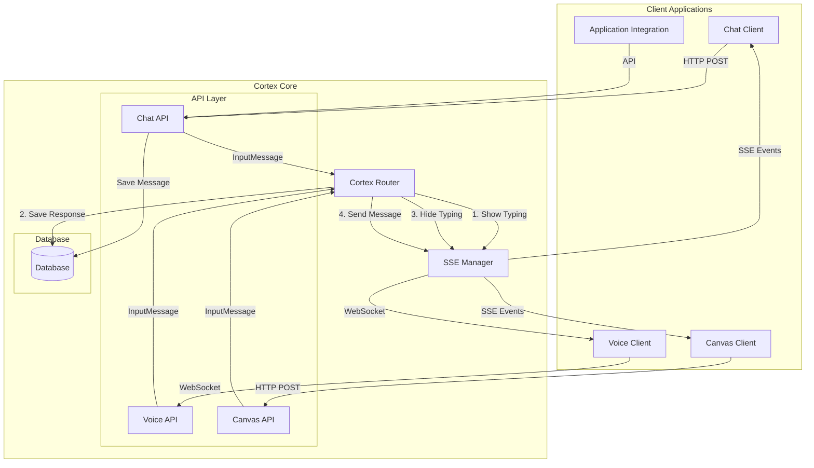
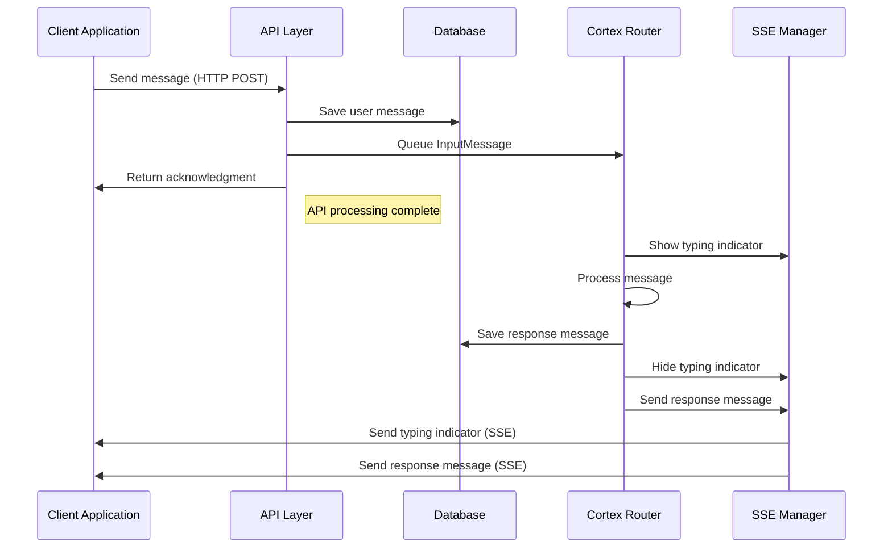
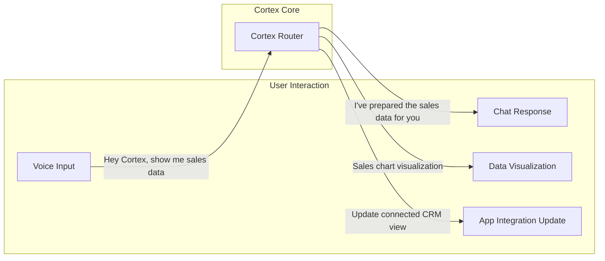
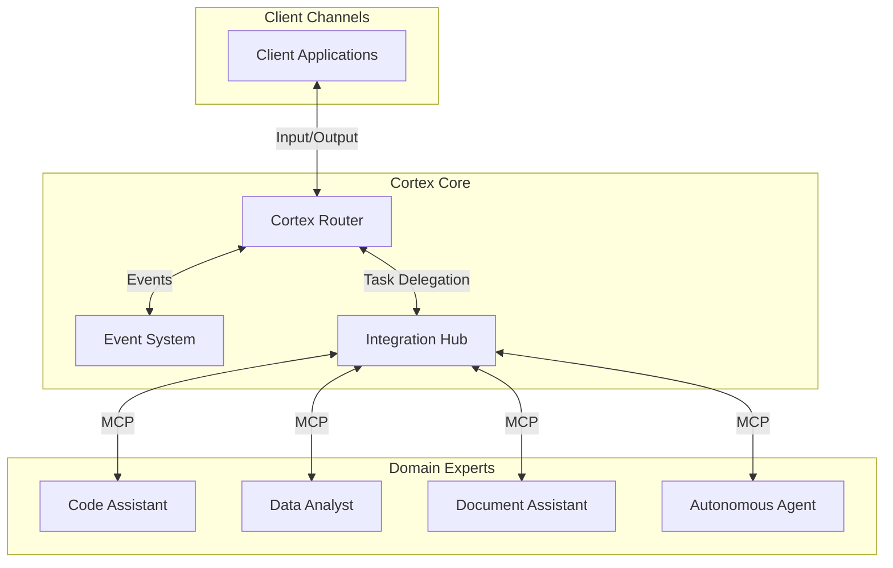
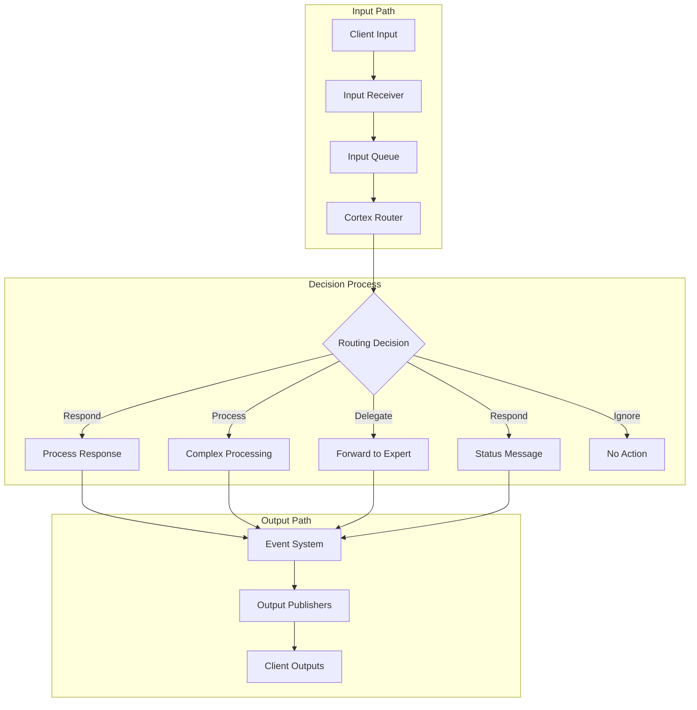

# Cortex Core Components

This document details the core components and interfaces of the Cortex Core system.

## Table of Contents

- [Session Management](#session-management)
- [Routing System](#routing-system)
- [Event System](#event-system)
- [Cortex Router](#cortex-router)
- [Input Receivers](#input-receivers)
- [Output Publishers](#output-publishers)
- [Messaging Architecture](#messaging-architecture)
- [Future Components](#future-components)
- [Workspace and Conversation Management](#workspace-and-conversation-management)
- [Security Manager](#security-manager)
- [Memory System Interface](#memory-system-interface)
- [Domain Expert Interface (Planned)](#domain-expert-interface-planned)
- [Circuit Breaker](#circuit-breaker)
- [SSE System](#sse-system)

## Session Management

The session management system is currently handled through the database models without a dedicated Session Manager component. This is planned for future implementation.

### Current Implementation

Sessions are managed through the database model and FastAPI's dependency injection system:

```python
class Session(Base):
    """Session model"""
    __tablename__ = "sessions"
    id = Column(String(36), primary_key=True, default=lambda: str(uuid.uuid4()))
    user_id = Column(String(36), ForeignKey("users.id", ondelete="CASCADE"))
    created_at = Column(DateTime, default=datetime.utcnow)
    last_active_at = Column(DateTime, default=datetime.utcnow)
    active_workspace_id = Column(String(36), nullable=True)
    config = Column(Text, default="{}")  # Stored as JSON string
    meta_data = Column(Text, default="{}")  # Stored as JSON string
    # Relationships
    user = relationship("User", back_populates="sessions")
```

### Future Interface Plans

A dedicated SessionManager component is planned for the future with the following interface:

```python
class SessionManager:
    async def create_session(self, user_id: str, workspace_id: Optional[str] = None, config: Optional[Dict[str, Any]] = None) -> Session:
        """Create a new user session"""
        pass

    async def get_session(self, session_id: str) -> Optional[Session]:
        """Get an existing session"""
        pass

    async def terminate_session(self, session_id: str) -> bool:
        """Terminate an existing session"""
        pass

    async def validate_session(self, session_id: str) -> bool:
        """Check if a session is active and valid"""
        pass

    async def update_session(self, session_id: str, updates: Dict[str, Any]) -> Optional[Session]:
        """Update session metadata or configuration"""
        pass
```

**Note**: This component is planned for future implementation. Currently, session management is handled through database operations and authentication middleware.

## Routing System

Instead of a dedicated Dispatcher component, Cortex Core uses FastAPI's built-in routing mechanisms.

### Implementation Details

Routing is handled directly by FastAPI's include_router functionality in `app/main.py`:

```python
# API routes for different endpoints
app.include_router(auth_router, prefix="/auth", tags=["Authentication"])
app.include_router(workspaces_router, prefix="", tags=["Workspaces"])
app.include_router(conversations_router, prefix="", tags=["Conversations"])
app.include_router(sse_router, prefix="", tags=["Events"])
app.include_router(monitoring_router, prefix="/monitoring", tags=["Monitoring"])
```

Each router is defined in its respective module in the `app/api` directory, with endpoints grouped by functionality.

## Event System

The Event System provides a decoupled message bus for communication between components, enabling standardized events with tracing, correlation, and monitoring capabilities.

### Responsibilities

- Enable communication between components without direct coupling
- Support publishing events to subscribers with standardized payloads
- Allow components to subscribe to event patterns with wildcard support
- Provide a way to unsubscribe from events
- Track event statistics and provide monitoring capabilities
- Support event tracing and correlation
- Ensure error isolation between subscribers

### Core Features

- **Standardized Event Payloads**: Consistent structure for all events with source, timestamp, and tracing information
- **Event Tracing**: Each event carries a trace ID to track event chains across components
- **Event Correlation**: Related events can be linked through correlation IDs
- **Pattern-Based Routing**: Subscribe to event types with flexible wildcard patterns
- **Concurrent Processing**: Efficient handling of multiple subscribers with asyncio
- **Error Resilience**: Subscriber errors don't affect other subscribers
- **Monitoring**: Comprehensive statistics for observability

### Event Naming Convention

The Event System follows a hierarchical naming convention to enable intuitive pattern matching:

`{domain}.{entity}.{action}`

Examples:

- `conversation.message.created`
- `user.session.started`
- `workspace.document.updated`
- `system.component.initialized`

### Implementation Details

#### Event Payload

```python
class EventPayload(BaseModel):
    """
    Standardized structure for all events in the system

    Attributes:
        event_type: Type of the event (e.g., 'conversation.message.created')
        data: Event-specific data payload
        source: Component that generated the event
        timestamp: Unix timestamp of when the event was created
        trace_id: ID for tracing event chains (automatically generated if not provided)
        correlation_id: Optional ID to correlate related events
    """
    event_type: str
    data: Dict[str, Any]
    source: str
    timestamp: float = Field(default_factory=time.time)
    trace_id: Optional[str] = None
    correlation_id: Optional[str] = None
```

#### Event System Interface

```python
class EventSystemInterface(Protocol):
    """Interface for the event system that connects components"""

    async def publish(self, event_type: str, data: Dict[str, Any], source: str,
                     trace_id: Optional[str] = None,
                     correlation_id: Optional[str] = None) -> None:
        """
        Publish an event to all subscribers

        Args:
            event_type: Type of the event (e.g., 'conversation.message.created')
            data: Event data
            source: Component that generated the event
            trace_id: Optional ID for tracing event chains
            correlation_id: Optional ID to correlate related events
        """
        ...

    async def subscribe(self, event_pattern: str, callback: EventCallback) -> str:
        """
        Subscribe to events matching a pattern

        Args:
            event_pattern: Pattern to match event types (can use wildcards)
            callback: Async function to call when matching events occur

        Returns:
            Subscription ID that can be used to unsubscribe
        """
        ...

    async def unsubscribe(self, subscription_id: str) -> bool:
        """
        Unsubscribe from events

        Args:
            subscription_id: ID returned from subscribe

        Returns:
            Boolean indicating success
        """
        ...

    async def get_stats(self) -> Dict[str, Any]:
        """
        Get statistics about event processing

        Returns:
            Dictionary with event statistics
        """
        ...
```

#### Event Callback Protocol

```python
class EventCallback(Protocol):
    """Callback protocol for event system subscribers"""

    async def __call__(self, event_type: str, payload: EventPayload) -> None:
        """
        Handle an event

        Args:
            event_type: Type of the event
            payload: Event payload with full event data
        """
        ...
```

### Monitoring

The Event System provides statistics for monitoring through the `/monitoring/events/stats` endpoint, including:

- Total events published
- Total events delivered
- Number of subscribers
- Event type breakdown
- Error count
- Events per second
- System uptime

This data is valuable for observability, performance monitoring, and diagnosing issues in the event system.

## Cortex Router

The Cortex Router is the central intelligence component that processes inputs and determines responses. It serves as the cognitive heart of the Cortex system, making autonomous decisions about how to handle inputs from various channels and coordinate responses across multiple output modalities.

### Responsibilities

- Process input messages from any source
- Make autonomous decisions about how to handle each input
- Determine if and when to respond
- Choose appropriate output channels for responses
- Coordinate with memory systems and domain experts
- Support asynchronous processing and delayed responses
- Manage typing indicators and status updates
- Properly clean up resources on shutdown

### Implementation Details

The CortexRouter uses asyncio for efficient background processing:

```python
class CortexRouter(RouterInterface):
    def __init__(self):
        self.event_system = get_event_system()
        self.message_queue = asyncio.Queue()  # Asyncio queue instead of threading.Queue
        self.logger = logging.getLogger(__name__)
        self.running = True

        # Start async task to process messages
        self.processing_task = asyncio.create_task(self._process_messages())

    async def process_input(self, message: InputMessage) -> bool:
        """Queue a message for processing (fire and forget)"""
        await self.message_queue.put(message)
        return True

    async def cleanup(self):
        """Clean up resources when shutting down"""
        self.running = False
        if self.processing_task and not self.processing_task.done():
            self.processing_task.cancel()
```

The Router handles messages in a predictable sequence:

1. Show typing indicator
2. Process message and generate response
3. Save response to database
4. Hide typing indicator
5. Send message to client via SSE

### Client-Router-Output Communication Flow

The Cortex system implements a sophisticated communication architecture that enables multi-modal, bi-directional interactions while maintaining complete decoupling between input and output channels.

#### Core Architecture Principles



#### Key Architectural Characteristics

1. **Simplified Message Flow**

   - Direct, predictable flow from API through Router to SSE
   - Clear sequence of operations for consistent processing
   - Router centralizes all message processing logic

2. **Asyncio-Based Processing**

   - Background processing uses asyncio for better efficiency
   - Queue-based message handling for proper backpressure
   - Clean resource management with proper cleanup methods

3. **Direct SSE Communication**

   - Router communicates directly with SSE Manager for real-time updates
   - Typing indicators and messages follow the same direct path
   - Clear connection management in the SSE system

4. **Multi-Modal Capabilities**

   - The system can receive input on one channel (e.g., voice) and respond on another (e.g., chat)
   - A single input can generate multiple outputs across different channels
   - Outputs can be synchronized across modalities (voice narration with visual data)

5. **Autonomous Routing Decisions**
   - The Router decides independently when and how to respond to inputs
   - Responses can be immediate, delayed, or completely absent
   - The system can choose optimal output channels based on context and content type

#### Detailed Flow Sequence



#### Multi-Modal Interaction Example



### Implementation Details

The core messaging models that enable this architecture:

```python
class InputMessage(CortexMessage):
    """Message received from an input channel"""

    # Source identification
    channel_id: str
    channel_type: ChannelType

    # Content
    content: str

    # Context
    user_id: Optional[str] = None
    workspace_id: Optional[str] = None
    conversation_id: Optional[str] = None


class OutputMessage(CortexMessage):
    """Message to be sent to an output channel"""

    # Destination
    channel_id: str
    channel_type: ChannelType

    # Content
    content: str

    # Context - same fields as InputMessage for consistency
    user_id: Optional[str] = None
    workspace_id: Optional[str] = None
    conversation_id: Optional[str] = None

    # Relationship
    reference_message_id: Optional[str] = None  # ID of a message this is responding to
    context_ids: List[str] = Field(default_factory=list)  # Related context IDs (conversation, workspace, etc.)


class RouterInterface(Protocol):
    """Interface for the Cortex Router"""

    async def process_input(self, message: InputMessage) -> bool:
        """Process an input message"""
        pass
```

### Routing Decisions

The Router makes autonomous decisions about how to handle each input through the `RoutingDecision` model:

```python
class RoutingDecision(BaseModel):
    """
    Represents a decision made by the Router about how to handle an input
    """

    # Core decision info
    action_type: ActionType  # RESPOND, PROCESS, DELEGATE, IGNORE, etc.
    priority: int = 3        # 1 (lowest) to 5 (highest)

    # Destinations - can specify multiple output channels
    target_channels: List[str] = Field(default_factory=list)

    # Processing info
    status_message: Optional[str] = None  # Message to show while processing
    reference_id: Optional[str] = None    # ID for tracking
    metadata: Dict[str, Any] = Field(default_factory=dict)
```

### Future Evolution with Domain Experts

The current architecture will evolve to incorporate Domain Expert entities through the Model Context Protocol (MCP):



In this evolved architecture:

1. The Router will delegate complex tasks to specialized Domain Experts via the Integration Hub
2. Domain Experts will communicate using the Model Context Protocol (MCP)
3. Each expert will maintain independent state and context for its domain
4. The Router will coordinate multi-expert collaborations for complex tasks
5. Event-driven communication remains the backbone of the system

## Input Receivers

Input Receivers handle inputs from specific channels and forward them to the Router.

### Responsibilities

- Accept inputs from specific modalities (conversation, voice, canvas, etc.)
- Package inputs into a standardized format
- Forward inputs to the Router
- Complete their job immediately with no expectation of responses

### Implementation Details

```python
class InputReceiverInterface(Protocol):
    """Interface for components that receive inputs from external sources"""

    async def receive_input(self, **kwargs) -> bool:
        """Process incoming input and forward it to the Router"""
        pass

    def get_channel_id(self) -> str:
        """Get the unique ID for this input channel"""
        pass

    def get_channel_type(self) -> ChannelType:
        """Get the type of this input channel"""
        pass
```

## Output Publishers

Output Publishers handle delivering messages to specific channels.

### Responsibilities

- Subscribe to events from the Event System
- Receive messages from the Router via events
- Format and deliver messages to specific channels
- Maintain persistent connections to clients (SSE, WebSocket, etc.)
- Handle message persistence to storage when needed

### Implementation Details

```python
class OutputPublisherInterface(Protocol):
    """Interface for components that send outputs to external destinations"""

    async def publish(self, message: OutputMessage) -> bool:
        """Publish a message to this output channel"""
        pass

    def get_channel_id(self) -> str:
        """Get the unique ID for this output channel"""
        pass

    def get_channel_type(self) -> ChannelType:
        """Get the type of this output channel"""
        pass
```

## Messaging Architecture

The key architectural principle of the Cortex System is the complete decoupling of inputs and outputs, enabling a flexible, multi-modal communication system.

### Core Messaging Flow



### Key Architectural Characteristics

1. **Complete Decoupling of Input and Output**

   - Input Receivers accept inputs and forward them to the Router with no expectation of responses
   - The Router processes inputs asynchronously and makes autonomous decisions
   - If/when the Router decides to respond, it publishes messages via the Event System
   - Output Publishers subscribe to events and deliver messages to their channels
   - There is no direct connection between input and output paths

2. **Multi-Modal Context Awareness**

   - The system maintains context across different modalities (text, voice, visual)
   - Context from one modality can influence responses in another
   - User preferences can determine optimal output channels

3. **Asynchronous Processing Model**
   - All message processing is handled asynchronously
   - Messages are queued and processed in order of priority
   - Long-running operations don't block the main processing flow

### Messaging Benefits

This architecture enables powerful capabilities not possible with traditional request-response models:

1. **Intelligent Interaction Flow**

   - Completely autonomous routing decisions
   - Responses might be immediate, delayed, or completely absent
   - Multiple responses can be generated from a single input
   - Responses can be delivered on different channels than the input came from

2. **Adaptive Response Strategies**

   - Deliver preliminary responses while complex processing continues
   - Coordinate responses across multiple channels simultaneously
   - Choose optimal channels based on content type and user context
   - Preserve context across interaction sessions

3. **Scalable Processing**
   - Background processing isolates resource-intensive operations
   - Components can be scaled independently based on load
   - Event-driven architecture enables horizontal scaling

This architecture forms the foundation for Cortex's evolution toward a sophisticated ecosystem of specialized domain experts working together through the Model Context Protocol (MCP).

For details on the messaging architecture, see [ADR-006: Messaging Architecture](adr/adr-006-messaging-architecture.md).

## Future Components

The following components are planned for future implementation but are not currently implemented in the codebase. They represent the architectural vision for the system's evolution.

### Context Manager (Planned)

The Context Manager will interface with the memory system to retrieve and update the context for processing requests.

#### Planned Responsibilities

- Retrieve relevant context for processing requests
- Update the memory state with new information
- Maintain an in-memory cache of recent context for performance

#### Proposed Interface

```python
class ContextManager:
    async def get_context(self, session_id: str, workspace_id: str, query: Optional[str] = None) -> Context:
        """Get context relevant to a specific query or task"""
        pass

    async def update_context(self, session_id: str, workspace_id: str, context_update: ContextUpdate) -> None:
        """Update the context with new information"""
        pass

    async def prune_context(self, session_id: str, workspace_id: str, older_than: Optional[datetime] = None) -> None:
        """Clear outdated or irrelevant context"""
        pass
```

### Integration Hub

The Integration Hub facilitates communication with Domain Expert services and external tools using the Model Context Protocol (MCP). It acts as an MCP client to connect to various services that implement MCP servers.

#### Responsibilities

- Implement MCP client using the Python SDK
- Register and manage connections to domain expert services
- Execute tools from domain experts with proper error handling
- Enable discovery of available tools and capabilities
- Handle resource access for file sharing and context
- Implement robust error handling and retries for domain expert communication
- Maintain compatibility with the MCP protocol specification

#### Implementation with Python MCP SDK

```python
# app/components/integration_hub.py
from typing import Dict, Any, List, Optional
import logging
from contextlib import asynccontextmanager
from mcp.client import McpClient
from app.config import get_settings
from app.utils.logger import get_logger

logger = get_logger(__name__)

class IntegrationHub:
    """Manages connections to Domain Expert services via MCP"""

    def __init__(self):
        self.settings = get_settings()
        self.clients: Dict[str, McpClient] = {}

    async def startup(self):
        """Initialize connections to all configured MCP endpoints"""
        for endpoint in self.settings.mcp.endpoints:
            try:
                client = McpClient(
                    client_info={"name": "cortex-integration-hub", "version": "0.1.0"},
                    transport_options={"url": endpoint["endpoint"]}
                )
                await client.initialize()
                self.clients[endpoint["name"]] = client
                logger.info(f"Connected to MCP endpoint: {endpoint['name']}")
            except Exception as e:
                logger.error(f"Failed to connect to MCP endpoint {endpoint['name']}: {str(e)}")

    async def shutdown(self):
        """Close all MCP connections"""
        for name, client in self.clients.items():
            try:
                await client.shutdown()
                logger.info(f"Closed connection to MCP endpoint: {name}")
            except Exception as e:
                logger.error(f"Error closing MCP connection to {name}: {str(e)}")

    async def list_experts(self) -> List[str]:
        """List all available domain experts"""
        return list(self.clients.keys())

    async def list_expert_tools(self, expert_name: str) -> Dict[str, Any]:
        """List all tools available from a specific domain expert"""
        if expert_name not in self.clients:
            raise ValueError(f"Unknown domain expert: {expert_name}")

        client = self.clients[expert_name]
        return await client.tools_list()

    async def invoke_expert_tool(self, expert_name: str, tool_name: str, arguments: Dict[str, Any]) -> Dict[str, Any]:
        """Invoke a tool on a specific domain expert"""
        if expert_name not in self.clients:
            raise ValueError(f"Unknown domain expert: {expert_name}")

        client = self.clients[expert_name]
        return await client.tools_call(name=tool_name, arguments=arguments)

    async def read_expert_resource(self, expert_name: str, uri: str) -> Dict[str, Any]:
        """Read a resource from a specific domain expert"""
        if expert_name not in self.clients:
            raise ValueError(f"Unknown domain expert: {expert_name}")

        client = self.clients[expert_name]
        return await client.resources_read(uri=uri)
```

#### Domain Expert Implementation with FastMCP

Domain Expert services implement MCP servers using the FastMCP API from the Python SDK:

```python
# code_assistant/main.py
from mcp.server.fastmcp import FastMCP
from typing import Dict, Any, List
import asyncio

# Create the FastMCP server
mcp = FastMCP("Code Assistant Expert")

@mcp.tool(
    description="Generate code based on a description",
    schema={
        "type": "object",
        "properties": {
            "description": {"type": "string", "description": "Description of code to generate"},
            "language": {"type": "string", "description": "Programming language"}
        },
        "required": ["description", "language"]
    }
)
async def generate_code(description: str, language: str) -> Dict[str, Any]:
    """Generate code based on a description"""
    # Implementation calls an LLM to generate code

    code = f"// Generated {language} code for: {description}\n"
    if language.lower() == "python":
        code = f"# Generated Python code for: {description}\n\ndef main():\n    print('Hello, world!')\n\nif __name__ == '__main__':\n    main()"

    return {
        "content": [
            {
                "type": "text",
                "text": code
            }
        ]
    }

# Run the server
if __name__ == "__main__":
    mcp.run(transport="sse", host="0.0.0.0", port=5000)
```

#### Integration in FastAPI Application

```python
# app/main.py
from fastapi import FastAPI, Depends
from app.components.integration_hub import IntegrationHub

app = FastAPI()

# Create Integration Hub instance
integration_hub = IntegrationHub()

@app.on_event("startup")
async def startup_event():
    await integration_hub.startup()

@app.on_event("shutdown")
async def shutdown_event():
    await integration_hub.shutdown()

# Dependency to get Integration Hub
async def get_integration_hub():
    return integration_hub

# API endpoints that use Integration Hub
@app.post("/experts/{expert_name}/tools/{tool_name}")
async def invoke_expert_tool(
    expert_name: str,
    tool_name: str,
    arguments: Dict[str, Any],
    hub: IntegrationHub = Depends(get_integration_hub)
):
    return await hub.invoke_expert_tool(expert_name, tool_name, arguments)
```

## Workspace and Conversation Management

While there is no dedicated WorkspaceManager component, workspace and conversation functionality is implemented through the Repository Pattern in the current codebase.

### Current Implementation

Workspaces and conversations are managed through database models and repositories:

```python
class Workspace(Base):
    """Workspace model"""
    __tablename__ = "workspaces"
    id = Column(String(36), primary_key=True, default=lambda: str(uuid.uuid4()))
    user_id = Column(String(36), ForeignKey("users.id", ondelete="CASCADE"))
    name = Column(String(255), nullable=False)
    created_at = Column(DateTime, default=datetime.utcnow)
    last_active_at = Column(DateTime, default=datetime.utcnow)
    config = Column(Text, default="{}")  # Stored as JSON string
    meta_data = Column(Text, default="{}")  # Stored as JSON string
    # Relationships
    user = relationship("User", back_populates="workspaces")
    conversations = relationship("Conversation", back_populates="workspace", cascade="all, delete-orphan")
    memory_items = relationship("MemoryItem", back_populates="workspace", cascade="all, delete-orphan")

class Conversation(Base):
    """Conversation model"""
    __tablename__ = "conversations"
    id = Column(String(36), primary_key=True, default=lambda: str(uuid.uuid4()))
    workspace_id = Column(String(36), ForeignKey("workspaces.id", ondelete="CASCADE"), index=True)
    modality = Column(String(50), nullable=False, index=True)
    title = Column(String(255), nullable=False)
    created_at = Column(DateTime, default=datetime.utcnow)
    last_active_at = Column(DateTime, default=datetime.utcnow)
    entries = Column(Text, default="[]")  # Stored as JSON array string
    meta_data = Column(Text, default="{}")  # Stored as JSON string
    # Relationships
    workspace = relationship("Workspace", back_populates="conversations")
```

### Repository Pattern Implementation

Conversations are managed through a repository implementation:

```python
class ConversationRepository:
    def __init__(self, db_session: Session):
        self.db = db_session

    def get_conversation_by_id(self, conversation_id: str) -> Optional[Conversation]:
        return self.db.query(Conversation).filter(Conversation.id == conversation_id).first()

    def get_conversations_by_workspace(self, workspace_id: str, limit: int = 100, offset: int = 0) -> List[Conversation]:
        return self.db.query(Conversation).filter(
            Conversation.workspace_id == workspace_id
        ).order_by(Conversation.last_active_at.desc()).offset(offset).limit(limit).all()

    def add_message(self, conversation_id: str, content: str, role: str, metadata: Optional[Dict] = None) -> Dict:
        # Implementation...
```

A dedicated WorkspaceManager component is planned for the future to provide more advanced workspace management features.

## Security Manager

The Security Manager handles basic encryption and authentication functions. The current implementation is simplified compared to the planned comprehensive security layer.

### Responsibilities

- Data encryption for sensitive information
- JSON serialization/deserialization
- Basic token handling functions

### Current Implementation

```python
class SecurityManager:
    """Security Manager implementation"""
    def __init__(self):
        # Derive encryption key from the provided key
        key_bytes = hashlib.sha256(settings.security.encryption_key.encode()).digest()
        self.fernet = Fernet(base64.urlsafe_b64encode(key_bytes))

    def encrypt(self, data: str) -> str:
        """Encrypt sensitive data"""
        try:
            return self.fernet.encrypt(data.encode()).decode()
        except Exception as e:
            logger.error(f"Encryption failed: {str(e)}")
            raise

    def decrypt(self, encrypted_data: str) -> str:
        """Decrypt sensitive data"""
        try:
            return self.fernet.decrypt(encrypted_data.encode()).decode()
        except Exception as e:
            logger.error(f"Decryption failed: {str(e)}")
            raise

    def stringify_json(self, data: Any) -> str:
        """Convert object to JSON string"""
        try:
            return json.dumps(data)
        except Exception as e:
            logger.error(f"JSON stringify failed: {str(e)}")
            return "{}"

    def parse_json(self, json_str: str) -> Any:
        """Parse JSON string to object"""
        try:
            return json.loads(json_str)
        except Exception as e:
            logger.error(f"JSON parse failed: {str(e)}")
            return {}
```

### Authentication Implementation

Authentication is currently implemented through utility functions that handle JWT token generation and verification:

```python
def generate_jwt_token(data: TokenData, expires_delta: Optional[timedelta] = None) -> str:
    """Generate a JWT token"""
    to_encode = data.model_dump()

    if expires_delta:
        expire = datetime.utcnow() + expires_delta
    else:
        expire = datetime.utcnow() + timedelta(seconds=settings.security.token_expiry_seconds)

    to_encode.update({"exp": expire})

    return jwt.encode(to_encode, settings.security.jwt_secret, algorithm="HS256")

def verify_jwt_token(token: str) -> Optional[TokenData]:
    """Verify a JWT token"""
    try:
        payload = jwt.decode(token, settings.security.jwt_secret, algorithms=["HS256"])

        user_id = payload.get("user_id")
        if user_id is None:
            return None

        scopes = payload.get("scopes", [])

        return TokenData(user_id=user_id, scopes=scopes)

    except jwt.ExpiredSignatureError:
        logger.warning("Token has expired")
        return None
    except jwt.InvalidTokenError:
        logger.warning("Invalid token")
        return None
```

### Authentication Schemes

The system also uses auth_schemes module for authentication dependencies:

```python
def get_current_user(token: str = Depends(oauth2_scheme), db: Session = Depends(get_db)) -> User:
    """Dependency to get the current authenticated user"""
    credentials_exception = HTTPException(
        status_code=status.HTTP_401_UNAUTHORIZED,
        detail="Could not validate credentials",
        headers={"WWW-Authenticate": "Bearer"},
    )

    token_data = verify_jwt_token(token)
    if token_data is None:
        raise credentials_exception

    user = db.query(User).filter(User.id == token_data.user_id).first()
    if user is None:
        raise credentials_exception

    return user
```

### Future Enhancements

Plans for enhancing security include:

- Comprehensive access control policies
- Advanced API key management
- Role-based authorization system
- Resource-level permission checks
- Integration with external identity providers

## Memory System Interface

The Memory System Interface defines the contract for memory systems (Whiteboard, JAKE, etc.).

### Interface Definition

```python
class RetentionPolicy(BaseModel):
    """Retention policy for memory items"""
    default_ttl_days: int
    type_specific_ttl: Optional[Dict[str, int]] = None  # type -> days
    max_items: Optional[int] = None

class MemoryConfig(BaseModel):
    """Memory system configuration"""
    storage_type: str  # "in_memory" or "persistent"
    retention_policy: Optional[RetentionPolicy] = None
    encryption_enabled: bool = False

class MemoryItem(BaseModel):
    """Memory item model"""
    id: Optional[str] = None
    type: str  # "message", "entity", "file", "event"
    content: Any
    metadata: Dict[str, Any] = {}
    timestamp: datetime
    expires_at: Optional[datetime] = None

class MemoryQuery(BaseModel):
    """Memory query parameters"""
    types: Optional[List[str]] = None
    from_timestamp: Optional[datetime] = None
    to_timestamp: Optional[datetime] = None
    content_query: Optional[str] = None
    metadata_filters: Optional[Dict[str, Any]] = None
    limit: Optional[int] = None
    include_expired: bool = False

class SynthesizedMemory(BaseModel):
    """Synthesized memory result"""
    raw_items: List[MemoryItem]
    summary: str
    entities: Dict[str, Any]
    relevance_score: float

class MemorySystemInterface(ABC):
    """
    Interface for memory systems in Cortex Core
    """
    @abstractmethod
    async def initialize(self, config: MemoryConfig) -> None:
        """Initialize the memory system"""
        pass

    @abstractmethod
    async def store(self, workspace_id: str, item: MemoryItem) -> str:
        """Store a memory item"""
        pass

    @abstractmethod
    async def retrieve(self, workspace_id: str, query: MemoryQuery) -> List[MemoryItem]:
        """Retrieve memory items based on a query"""
        pass

    @abstractmethod
    async def update(self, workspace_id: str, item_id: str, updates: MemoryItem) -> None:
        """Update an existing memory item"""
        pass

    @abstractmethod
    async def delete(self, workspace_id: str, item_id: str) -> None:
        """Delete a memory item"""
        pass

    @abstractmethod
    async def synthesize_context(self, workspace_id: str, query: MemoryQuery) -> SynthesizedMemory:
        """Generate a synthetic/enriched context from raw memory"""
        pass
```

## Domain Expert Interface (Planned)

The Domain Expert Interface defines the planned contract for domain expert entities. This is a future component and is not currently implemented in the codebase.

### Planned Interface Definition

```python
class ExpertTaskConstraints(BaseModel):
    """Constraints for expert tasks"""
    deadline: Optional[datetime] = None
    max_tokens: Optional[int] = None
    priority_level: Literal["high", "normal", "low"] = "normal"
    max_retries: Optional[int] = None

class ExpertTask(BaseModel):
    """Task for domain expert"""
    id: Optional[str] = None
    type: str
    content: Any
    context: Optional[Any] = None
    constraints: Optional[ExpertTaskConstraints] = None
    metadata: Dict[str, Any] = {}

class TaskStatus(BaseModel):
    """Status of a domain expert task"""
    id: str
    state: Literal["queued", "processing", "completed", "failed", "cancelled"]
    progress: Optional[int] = None  # 0-100
    estimated_completion_time: Optional[datetime] = None
    status_message: Optional[str] = None

class ExpertTaskResult(BaseModel):
    """Result from a domain expert task"""
    task_id: str
    success: bool
    result: Optional[Any] = None
    error: Optional[str] = None
    metrics: Optional[Dict[str, Any]] = None

class ExpertCapabilities(BaseModel):
    """Capabilities of a domain expert"""
    supported_task_types: List[str]
    supports_async_tasks: bool
    supports_cancellation: bool
    supports_progress: bool
    max_concurrent_tasks: Optional[int] = None

class DomainExpertInterface(ABC):
    """
    Interface for domain expert entities in Cortex Core
    """
    @abstractmethod
    async def initialize(self, config: Dict[str, Any]) -> None:
        """Initialize the domain expert"""
        pass

    @abstractmethod
    async def handle_task(self, task: ExpertTask) -> str:
        """Handle a domain expert task"""
        pass

    @abstractmethod
    async def check_status(self, task_id: str) -> TaskStatus:
        """Check the status of a task"""
        pass

    @abstractmethod
    async def get_result(self, task_id: str) -> ExpertTaskResult:
        """Get the result of a completed task"""
        pass

    @abstractmethod
    async def cancel_task(self, task_id: str) -> bool:
        """Cancel an in-progress task"""
        pass

    @abstractmethod
    def get_capabilities(self) -> ExpertCapabilities:
        """Get the capabilities of this domain expert"""
        pass
```

**Note**: This interface is planned for future implementation. The current codebase does not include domain expert implementations.

## Circuit Breaker

The Circuit Breaker pattern prevents cascading failures by protecting services from repeated calls to failing operations. It automatically breaks the circuit when failure thresholds are reached and gradually attempts recovery.

### Responsibilities

- Protect services from repeated failures
- Prevent cascading service failures
- Fail fast when services are down
- Gradually attempt recovery with half-open state
- Provide monitoring and error tracking

### States

The Circuit Breaker has three states:

1. **CLOSED**: Normal operation. Requests pass through to the service. Failed requests increment the failure counter.
2. **OPEN**: Failure threshold exceeded. Requests fail immediately without calling the service, saving resources.
3. **HALF_OPEN**: Recovery attempt. After a timeout, allows a test request to pass. Success restores normal operation, failure keeps the circuit open.

### Implementation Details

```python
class CircuitBreaker:
    """
    Implementation of the Circuit Breaker pattern for service resilience
    """

    def __init__(
        self,
        name: str,
        failure_threshold: int = 5,
        recovery_timeout: float = 30.0
    ):
        self.name = name
        self.failure_threshold = failure_threshold
        self.recovery_timeout = recovery_timeout
        self.failure_count = 0
        self.last_failure_time = 0.0
        self.state = CircuitState.CLOSED

    async def execute(self, func: Callable[..., Awaitable[T]], *args: Any, **kwargs: Any) -> T:
        """
        Execute a function with circuit breaker protection
        """
        # Check if circuit is open
        if self.state == CircuitState.OPEN:
            if time.time() - self.last_failure_time > self.recovery_timeout:
                logger.info(f"Circuit {self.name} transitioning to HALF_OPEN")
                self.state = CircuitState.HALF_OPEN
            else:
                raise ServiceError(
                    detail=f"Service {self.name} is unavailable",
                    code="SERVICE_UNAVAILABLE",
                    status_code=503
                )

        try:
            # Execute the function
            result = await func(*args, **kwargs)

            # Success, reset if in half-open state
            if self.state == CircuitState.HALF_OPEN:
                self.failure_count = 0
                self.state = CircuitState.CLOSED
                logger.info(f"Circuit {self.name} recovered")

            return result

        except Exception as e:
            # Track failure
            self.failure_count += 1
            self.last_failure_time = time.time()

            # Trip the circuit if threshold reached
            if self.state == CircuitState.CLOSED and self.failure_count >= self.failure_threshold:
                self.state = CircuitState.OPEN
                logger.warning(f"Circuit {self.name} tripped open after {self.failure_count} failures")

            # Re-raise the exception
            raise
```

### Usage Example

The Circuit Breaker is particularly useful for protecting external service calls, database operations, and any component that may fail. In Cortex Core, it's used for SSE conversation publishers:

```python
# Initialize circuit breaker
conversation_publisher_cb = CircuitBreaker(
    "conversation_publisher",
    failure_threshold=3,
    recovery_timeout=60.0
)

# Use it to protect an operation
try:
    result = await conversation_publisher_cb.execute(
        get_conversation_publisher,
        conversation_id
    )
    # Handle successful result
except ServiceError as e:
    # Handle service unavailability
    logger.error(f"Service unavailable: {str(e)}")
except Exception as e:
    # Handle other errors
    logger.error(f"Operation failed: {str(e)}")
```

## SSE System

The SSE (Server-Sent Events) system provides real-time event streams to clients via a clean, modular architecture.

### Architecture Overview

The SSE system follows a clean, modular design:

```
┌───────────────────────────────┐
│       Unified SSE API         │ ← HTTP endpoints
├───────────────────────────────┤
│         SSE Service           │ ← Orchestration layer
├───────────┬─────────┬─────────┤
│Connection │   Auth  │  Event  │ ← Component layer
│ Manager   │ Service │Subscriber│
└───────────┴─────────┴─────────┘
```

This modular architecture allows for:

- Clean separation of concerns
- Improved testability
- Easier maintenance and evolution

### SSE Components

The SSE system consists of the following components:

#### SSE API (Unified Endpoint)

The unified SSE API endpoint provides a consistent interface for all event types. Key features:

- Consistent endpoint pattern: `/v1/{channel_type}/{resource_id}`
- Unified authentication via token parameter
- Standardized error responses and status codes
- Support for various channel types (global, user, workspace, conversation)

```python
@router.get("/{channel_type}/{resource_id}")
async def events(
    channel_type: str,
    resource_id: str,
    request: Request,
    token: str,
    sse_service = Depends(get_sse_service),
    db: Session = Depends(get_db)
):
    """
    Unified SSE endpoint for all event types
    """
    # Endpoint implementation...
```

#### SSE Service

The SSE Service orchestrates the SSE components and provides a facade for the SSE functionality. Responsibilities:

- Initialize and manage the component dependencies
- Authenticate tokens and verify resource access
- Coordinate connection registration and event delivery
- Start special publishers for specific channel types (e.g., conversation)

```python
class SSEService:
    """
    Service coordinating SSE components and operations
    """
    def __init__(
        self,
        connection_manager: ConnectionManager,
        auth_service: AuthService,
        event_subscriber: EventSubscriber
    ):
        self.connection_manager = connection_manager
        self.auth_service = auth_service
        self.event_subscriber = event_subscriber

    async def authenticate_token(self, token: str) -> Dict[str, Any]:
        """Authenticate a token and return user info"""
        # Implementation...

    async def verify_resource_access(self, user_info, channel_type, resource_id, db):
        """Verify user has access to the resource"""
        # Implementation...
```

#### Connection Manager

The Connection Manager handles the lifecycle of SSE connections. Responsibilities:

- Register and remove connections
- Track active connections by channel type and resource
- Generate SSE events for clients
- Provide connection statistics
- Send heartbeats to maintain connections

```python
class ConnectionManager:
    """
    Manages SSE connection lifecycle and event generation
    """
    def __init__(self):
        self.connections = {
            "global": [],
            "user": {},
            "workspace": {},
            "conversation": {},
        }

    async def register_connection(self, channel_type, resource_id, user_id):
        """Register a new connection and return its queue and ID"""
        # Implementation...

    async def remove_connection(self, channel_type, resource_id, connection_id):
        """Remove a connection when client disconnects"""
        # Implementation...

    async def generate_sse_events(self, queue):
        """Generate SSE events from a queue for a client"""
        # Implementation...

    def get_stats(self):
        """Get connection statistics"""
        # Implementation...
```

#### Auth Service

The Auth Service handles authentication and authorization for SSE connections. Responsibilities:

- Validate authentication tokens
- Verify user permissions for resources
- Enforce access controls for different channel types

```python
class AuthService:
    """
    Handles authentication and authorization for SSE connections
    """
    def __init__(self, security_manager=None):
        self.security_manager = security_manager

    async def validate_token(self, token: str) -> Dict[str, Any]:
        """Validate a token and return user information"""
        # Implementation...

    async def check_resource_access(self, user_info, channel_type, resource_id, db):
        """Check if user has access to the requested resource"""
        # Implementation...
```

#### Event Subscriber

The Event Subscriber connects to the Event System and routes events to the appropriate SSE channels. Responsibilities:

- Subscribe to relevant events from the Event System
- Map events to appropriate SSE channels
- Format events for SSE delivery
- Handle event routing and filtering

```python
class EventSubscriber:
    """
    Subscribes to the Event System and routes events to SSE channels
    """
    def __init__(self, event_system, connection_manager):
        self.event_system = event_system
        self.connection_manager = connection_manager
        self.subscription_ids = []

    async def initialize(self):
        """Subscribe to relevant events"""
        # Implementation...

    async def handle_event(self, event_type, payload):
        """Handle events from the event system and route to SSE clients"""
        # Implementation...
```

This document provides an overview of the key components and interfaces that make up the Cortex Core system. Each component is designed to be modular and extensible, allowing for easy replacement or enhancement as the system evolves.
