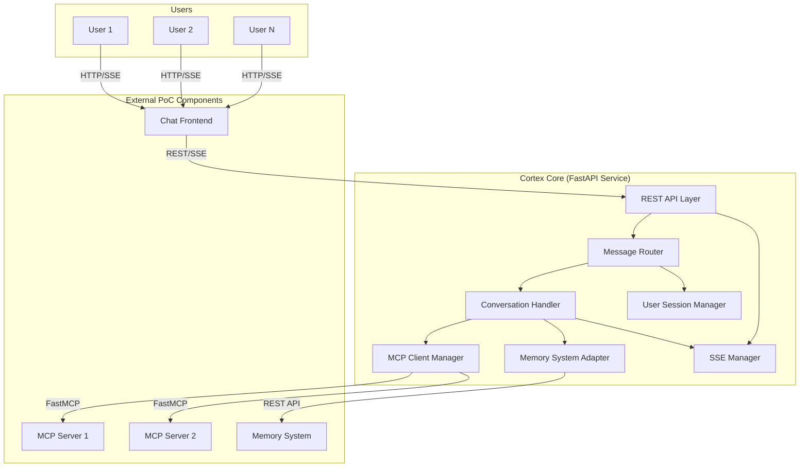
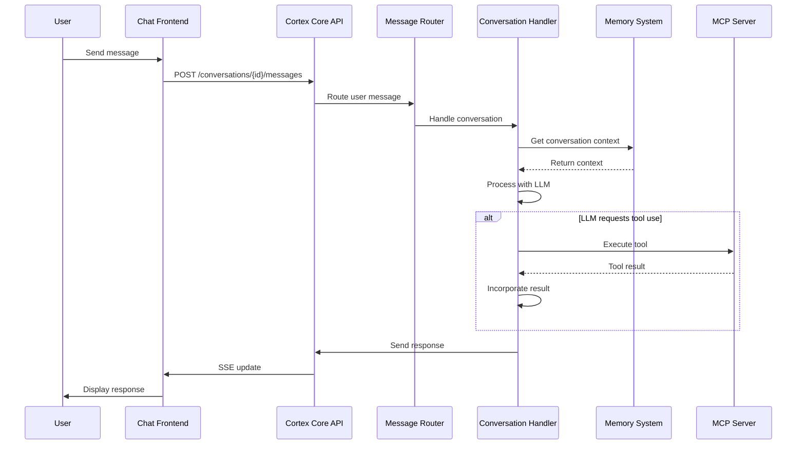

# Cortex Core PoC Implementation Plan

**Date:** 2025-03-06
**Status:** Working Draft - Being actively refined

## 1. Introduction

This document outlines the implementation plan for a minimal Proof of Concept (PoC) build of the Cortex Core that can be completed in a 1-day coding spike. The goal is to create a foundational system that demonstrates the core capabilities of the Cortex Platform while enabling others to fast-follow and start building other components of the system.

> **Document Purpose Note:** This is a living document that will be updated throughout our planning process. Each time we make a meaningful decision or refinement, we'll document it here to ensure continuity.
>
> **AI Assistant Instructions:** This document serves as the complete reference for the Cortex Core PoC implementation plan. Due to AI memory limitations (similar to the character in "Memento" who cannot form new long-term memories), the AI assistant is unable to access the full chat history from planning discussions. Therefore, this document is intentionally detailed and comprehensive to avoid losing important information or requiring repeated clarifications. All key requirements, design decisions, and implementation details will be incorporated here to serve as the single source of truth for this project. Additionally, a Change Log section is maintained at the bottom of this document to track all modifications made during planning sessions to prevent accidental reverts of previous changes.

### Objectives

- Create a minimal but functional Cortex Core that can route between different components
- Implement a basic LLM-powered conversation handler that can use tools provided by MCP servers
- Support multiple simultaneous users with simple data partitioning
- Provide RESTful interfaces with Server-Sent Events (SSE) for real-time capabilities
- Design the system with extensibility in mind to enable future integration with domain expert entities and other components
- Connect early PoCs of other systems (chat frontends, memory system, MCP servers)

### Scope

- **In Scope**:

  - Core routing functionality
  - Basic memory system integration
  - MCP server connection and tool usage
  - Basic LLM conversation handling
  - Multi-user support with simple partitioning
  - RESTful API with SSE for real-time updates
  - Web UI integration points

- **Out of Scope**:
  - Domain expert entities
  - Advanced memory systems
  - Complex security and access controls
  - Building the other PoC components (chat frontends, memory systems, MCP servers)

## 2. System Architecture

The Cortex Core PoC will follow a modular architecture that enables the core functionality while providing clear extension points for future development. For this 1-day coding spike, we'll focus on building the essential components needed to demonstrate the routing capabilities and LLM conversation handling.

### High-Level Architecture



### Data Flow



### Component Descriptions

#### Core Components (To Be Implemented)

1. **REST API Layer**:

   - Exposes endpoints for user interactions, including conversation management and message handling
   - Handles authentication and user session management
   - Routes incoming requests to appropriate internal components
   - Provides SSE endpoints for real-time updates

2. **Message Router**:

   - Central component that directs messages between different parts of the system
   - Determines which components should process each message based on type and context
   - Maintains message flow throughout the conversation lifecycle

3. **Conversation Handler**:

   - LLM-powered component that manages dialog flow
   - Formats messages for the LLM and parses responses
   - Identifies when tools should be used and coordinates tool execution
   - Maintains conversation history and manages conversation state

4. **Memory System Adapter**:

   - Interface to the external memory system PoC
   - Handles storing and retrieving conversation context
   - Manages memory partitioning by user
   - Provides abstractions to simplify memory operations

5. **MCP Client Manager**:

   - Manages connections to FastMCP servers
   - Discovers and registers tools provided by MCP servers
   - Handles tool execution requests from the Conversation Handler
   - Manages serialization and deserialization of tool inputs/outputs

6. **User Session Manager**:

   - Handles user authentication and session tracking
   - Ensures data partitioning between users
   - Manages user-specific configuration and preferences
   - Coordinates user-specific resources

7. **SSE Manager**:
   - Manages Server-Sent Events connections
   - Handles broadcasting of real-time updates to clients
   - Ensures correct message delivery to the appropriate clients
   - Manages connection lifecycle and error handling

#### External Components (Out of Scope for Implementation)

1. **Chat Frontend**:

   - Web-based user interface for conversation interactions
   - Connects to Cortex Core via REST API and SSE
   - Handles displaying messages and conversation history
   - Expected to be provided as a separate PoC

2. **Memory System**:

   - External system for storing and retrieving conversation context
   - Provides long-term persistence for conversation data
   - Expected to be provided as a separate PoC

3. **MCP Servers**:
   - Provide tools and functionality that can be used by the Conversation Handler
   - Connect to Cortex Core via FastMCP protocol
   - Expected to be provided as separate PoCs

## 3. Data Models

The following Pydantic models will be implemented to support the core functionality of the Cortex Core PoC:

```python
from pydantic import BaseModel, Field
from typing import Dict, List, Any, Optional, Union
from datetime import datetime
from enum import Enum
import uuid

# Utility function for ID generation
def generate_id() -> str:
    return str(uuid.uuid4())

# Enums for better type safety
class MessageRole(str, Enum):
    USER = "user"
    ASSISTANT = "assistant"
    SYSTEM = "system"
    TOOL = "tool"

class ToolExecutionStatus(str, Enum):
    PENDING = "pending"
    IN_PROGRESS = "in_progress"
    COMPLETED = "completed"
    FAILED = "failed"

# Account types for different authentication methods
class AccountType(str, Enum):
    AAD = "aad"  # Microsoft Azure AD
    MSA = "msa"  # Microsoft Account (consumer)
    LOCAL = "local"  # Local account
    OAUTH = "oauth"  # Generic OAuth provider

# Base model for all login account types
class LoginAccount(BaseModel):
    id: str = Field(default_factory=generate_id)
    type: AccountType
    created_at: datetime = Field(default_factory=datetime.utcnow)
    is_primary: bool = False
    metadata: Dict[str, Any] = Field(default_factory=dict)

# Microsoft AAD specific account
class AADAccount(LoginAccount):
    type: AccountType = AccountType.AAD
    object_id: str  # AAD object ID
    tenant_id: str  # AAD tenant ID
    email: Optional[str] = None
    display_name: Optional[str] = None

# Core data models
class User(BaseModel):
    id: str = Field(default_factory=generate_id)
    name: str
    created_at: datetime = Field(default_factory=datetime.utcnow)
    accounts: List[LoginAccount] = Field(default_factory=list)  # Associated login accounts
    primary_account_id: Optional[str] = None  # Reference to primary account

class Session(BaseModel):
    id: str = Field(default_factory=generate_id)
    user_id: str
    created_at: datetime = Field(default_factory=datetime.utcnow)
    last_active: datetime = Field(default_factory=datetime.utcnow)
    metadata: Dict[str, Any] = Field(default_factory=dict)

class Message(BaseModel):
    id: str = Field(default_factory=generate_id)
    conversation_id: str
    role: MessageRole
    content: str
    created_at: datetime = Field(default_factory=datetime.utcnow)
    metadata: Dict[str, Any] = Field(default_factory=dict)

    # For tool usage tracking
    tool_calls: List[Dict[str, Any]] = Field(default_factory=list)

    # For message chunking/streaming
    is_complete: bool = True

class Conversation(BaseModel):
    id: str = Field(default_factory=generate_id)
    user_id: str
    title: str = "New Conversation"
    created_at: datetime = Field(default_factory=datetime.utcnow)
    updated_at: datetime = Field(default_factory=datetime.utcnow)
    metadata: Dict[str, Any] = Field(default_factory=dict)

    # We'll store messages separately in the database
    # This is just for API responses
    messages: List[Message] = Field(default_factory=list)

class MemoryEntry(BaseModel):
    id: str = Field(default_factory=generate_id)
    user_id: str
    conversation_id: str
    content: str
    created_at: datetime = Field(default_factory=datetime.utcnow)
    type: str = "conversation"  # Type of memory entry (conversation, fact, etc.)
    metadata: Dict[str, Any] = Field(default_factory=dict)

class MCPToolParameter(BaseModel):
    name: str
    type: str
    description: str
    required: bool = False
    default: Optional[Any] = None

class MCPTool(BaseModel):
    id: str = Field(default_factory=generate_id)
    server_id: str
    name: str
    description: str
    parameters: List[MCPToolParameter] = Field(default_factory=list)

class MCPServer(BaseModel):
    id: str = Field(default_factory=generate_id)
    name: str
    url: str
    status: str = "connected"
    tools: List[MCPTool] = Field(default_factory=list)

class ToolExecution(BaseModel):
    id: str = Field(default_factory=generate_id)
    conversation_id: str
    message_id: str
    tool_id: str
    server_id: str
    status: ToolExecutionStatus = ToolExecutionStatus.PENDING
    created_at: datetime = Field(default_factory=datetime.utcnow)
    updated_at: datetime = Field(default_factory=datetime.utcnow)
    inputs: Dict[str, Any]
    outputs: Optional[Dict[str, Any]] = None
    error: Optional[str] = None

class SSEConnection(BaseModel):
    id: str = Field(default_factory=generate_id)
    user_id: str
    conversation_id: Optional[str] = None
    created_at: datetime = Field(default_factory=datetime.utcnow)
    last_active: datetime = Field(default_factory=datetime.utcnow)
    metadata: Dict[str, Any] = Field(default_factory=dict)
```

These data models provide a solid foundation for implementing the core functionality of the Cortex Core PoC. They include:

1. **User and Session Management**: Models for tracking users and their active sessions
2. **Conversation Handling**: Models for managing conversations and messages
3. **Memory System Integration**: Models for storing and retrieving memory entries
4. **MCP Tool Integration**: Models for tracking MCP servers and their available tools
5. **Real-time Updates**: Models for managing SSE connections

The models include default values and utility functions to simplify implementation and ensure consistency. They also use enums for better type safety and clarity.

## 4. Public API Endpoints

The Cortex Core PoC will expose only the necessary RESTful API endpoints required for chat frontends to interact with the system. Backend services like MCP servers and memory systems will be accessed internally by the Cortex Core rather than exposing them directly to clients.

### Authentication and Session Management

> Note: In the final architecture, authentication will be handled by a separate frontend system, but for the PoC we'll include basic session validation.

- `POST /api/validate-session`

  - **Purpose**: Validate an existing session token from the authentication system
  - **Request Header**: `Authorization: Bearer {session_token}`
  - **Response**: `{ "valid": true, "user": { "id": "string", "name": "string" } }`
  - **Notes**: The session token is expected to be obtained from a separate auth frontend

### Conversations

- `GET /api/conversations`

  - **Purpose**: List all conversations for the current user
  - **Request Header**: `Authorization: Bearer {session_token}`
  - **Query Parameters**: `limit`, `offset`, `sort_by`, `sort_order`
  - **Response**: `{ "conversations": [Conversation], "total": number }`

- `POST /api/conversations`

  - **Purpose**: Create a new conversation
  - **Request Header**: `Authorization: Bearer {session_token}`
  - **Request Body**: `{ "title": "string" }`
  - **Response**: `{ "conversation": Conversation }`

- `GET /api/conversations/{conversation_id}`

  - **Purpose**: Get details of a specific conversation
  - **Request Header**: `Authorization: Bearer {session_token}`
  - **Response**: `{ "conversation": Conversation }`

- `DELETE /api/conversations/{conversation_id}`
  - **Purpose**: Delete a conversation
  - **Request Header**: `Authorization: Bearer {session_token}`
  - **Response**: `{ "success": true }`

### Messages

- `GET /api/conversations/{conversation_id}/messages`

  - **Purpose**: Get all messages in a conversation
  - **Request Header**: `Authorization: Bearer {session_token}`
  - **Query Parameters**: `limit`, `offset`, `before_id`, `after_id`
  - **Response**: `{ "messages": [Message], "total": number }`

- `POST /api/conversations/{conversation_id}/messages`
  - **Purpose**: Add a new message to a conversation
  - **Request Header**: `Authorization: Bearer {session_token}`
  - **Request Body**: `{ "content": "string", "role": "user" }`
  - **Response**: `{ "message": Message }`
  - **Notes**: This will trigger the Conversation Handler to process the message and generate a response

### Server-Sent Events (SSE)

- `GET /api/sse/conversations/{conversation_id}`
  - **Purpose**: Establish an SSE connection for updates to a specific conversation
  - **Request Header**: `Authorization: Bearer {session_token}`
  - **Response**: SSE stream with events for the specified conversation
  - **Event Types**:
    - `message_created`: When a new message is added
    - `message_updated`: When a message is updated (e.g., tool result is incorporated)
    - `conversation_updated`: When conversation metadata is updated
    - `tool_execution_started`: When a tool execution begins
    - `tool_execution_completed`: When a tool execution completes

## 5. Internal Service Interfaces

The following internal interfaces will be implemented for communication between Cortex Core components and external services. These are not directly exposed as API endpoints but represent the service-to-service communication.

### Memory System Interface

- **Purpose**: Interface for storing and retrieving conversation context
- **Implementation**: Uses MCP for service-to-service communication
- **Key Operations**:
  - Store conversation context
  - Retrieve relevant memories for a conversation
  - Update existing memories

### MCP Client Interface

- **Purpose**: Interface for discovering and executing tools provided by MCP servers
- **Implementation**: Uses FastMCP protocol for direct communication with MCP servers
- **Key Operations**:
  - Discover available tools
  - Execute tools and process results
  - Handle tool execution lifecycles

## 6. Implementation Approach

The implementation will be divided into the following phases, organized for a single-day coding spike. Each phase has specific deliverables and outcomes to ensure we maintain focus and make steady progress throughout the day.

### Hour 1-2: Project Setup and Core Framework (2 hours)

1. **Initialize Project Structure (30 min)**

   - Create a new FastAPI project with appropriate directory structure
   - Set up dependency management with UV and pyproject.toml
   - Initialize Git repository for version control
   - Create README with basic setup instructions

2. **Implement Core Data Models (30 min)**

   - Define all Pydantic models as specified in the Data Models section
   - Implement utility functions for ID generation and other common operations
   - Create model validation rules and default values

3. **Set Up Database and Configuration (30 min)**

   - Configure SQLite database with SQLAlchemy for basic persistence
   - Set up configuration management with environment variables
   - Create database migration scripts
   - Implement basic ORM mappings for the data models

4. **Create Project Scaffolding (30 min)**
   - Set up the application entry point
   - Configure logging
   - Set up basic error handling and middleware
   - Create placeholder modules for each component

**Deliverables:**

- Working project structure that can be started with basic configuration
- Database connection and ORM setup
- Core data models implemented and tested
- Basic application entry point that starts without errors

### Hour 3-4: Core Components Implementation (2 hours)

1. **Implement Message Router (30 min)**

   - Create the central message routing logic
   - Define routing rules based on message types
   - Implement router registration for components
   - Set up basic error handling for routing failures

2. **Implement User Session Manager (30 min)**

   - Create session creation and validation logic for multiple authentication methods
   - Implement token validation for AAD ID and access tokens using MSAL as first auth method
   - Set up user data partitioning logic with internal user IDs that can be linked to multiple account types
   - Implement account management to associate different login accounts with a user
   - Implement session expiration and cleanup
   - Design flexible account abstraction layer that supports multiple simultaneous auth methods

3. **Implement LLM Client with LiteLLM (30 min)**

   - Set up LiteLLM integration for model access
   - Configure models (gpt-4o for reasoning, o3-mini for efficiency)
   - Create message formatting utilities leveraging LiteLLM's standardized interface
   - Implement response parsing logic based on OpenAI format
   - Create fallback mechanisms for API failures
   - Set up consistent error handling across different model calls

4. **Implement Basic Conversation Handler (30 min)**
   - Create conversation state management with focus on simplicity
   - Implement message processing flow for basic chat capability
   - Set up integration with the LLM client for processing and generating responses
   - Create basic tool use detection and handling through MCP servers
   - Implement memory integration for maintaining conversation context
   - Focus on minimal but functional implementation to demonstrate core capabilities

**Deliverables:**

- Working Message Router with routing capability
- User Session Manager with basic authentication
- LLM Client that can send requests and parse responses
- Basic Conversation Handler that can process messages

### Hour 5-6: Memory and MCP Integration (2 hours)

1. **Implement Memory System Adapter (45 min)**

   - Create interface for external memory system using MCP client/server approach (with Cortex Core as client)
   - Implement basic in-memory fallback if external memory system is unavailable
   - Create memory retrieval and storage logic with proper abstraction
   - Implement user data partitioning for memory with clean separation between users
   - Design a flexible adapter pattern that can accommodate future memory system enhancements

2. **Implement MCP Client Manager (45 min)**

   - Set up FastMCP client connections to external MCP servers (provided for testing)
   - Implement tool discovery and registration with dynamic tool loading
   - Create tool execution request handling with proper error management
   - Set up serialization and deserialization for tool interactions
   - Design flexible connection management to support multiple simultaneous MCP servers

3. **Integrate Components (30 min)**
   - Connect Conversation Handler with Memory System
   - Connect Conversation Handler with MCP Client
   - Set up event flow between components
   - Implement error recovery mechanisms

**Deliverables:**

- Working Memory System Adapter that can store and retrieve conversation context
- MCP Client Manager that can discover and execute tools
- Integrated components that can work together to handle conversations

### Hour 7-8: API Layer and Testing (2 hours)

1. **Implement REST API Endpoints (45 min)**

   - Create FastAPI route handlers for all endpoints
   - Implement request validation and response formatting
   - Set up authentication middleware
   - Create error handling for API requests

2. **Implement SSE for Real-time Updates (30 min)**

   - Set up SSE endpoint handlers
   - Create event broadcasting mechanism
   - Implement connection management
   - Create client-specific event filtering

3. **Testing and Validation (45 min)**
   - Write basic unit tests for critical components
   - Create integration tests for key workflows
   - Set up a demo script for manual testing
   - Test with multiple simultaneous users

**Deliverables:**

- Complete REST API with all endpoints implemented
- Working SSE implementation for real-time updates
- Basic test suite for critical components
- Demo script for showcasing the PoC functionality

### Final Hour: Integration and Documentation (1 hour)

1. **Final Integration and Bug Fixes (45 min)**

   - Address any integration issues discovered during testing
   - Fix critical bugs
   - Optimize any performance bottlenecks
   - Ensure all components work together correctly

2. **Documentation and Handoff (15 min)**
   - Update README with setup and usage instructions
   - Document known issues and limitations
   - Create a quick-start guide for other teams
   - Prepare for demo and knowledge transfer

**Deliverables:**

- Fully functional Cortex Core PoC
- Documentation for setup and usage
- List of known issues and future enhancements
- Ready for demonstration to stakeholders

## 7. Technology Stack

- **Backend Framework**: FastAPI with Pydantic
- **Database**: SQLite (for simplicity in the PoC)
- **LLM Integration**: LiteLLM for consistent model interface
- **LLM Providers**:
  - OpenAI API (gpt-4o and o3-mini models with high reasoning level)
  - Future potential for other providers via LiteLLM
- **Real-time Communication**: Server-Sent Events (SSE)
- **MCP Client**: FastMCP client library
- **Development Environment**: Python 3.9+, UV for dependency management

> Note: While this PoC will use LiteLLM's direct API integration, future implementations might consider using LiteLLM proxy for more advanced features like routing, fallbacks, and caching.

## 8. Key Implementation Details

### User Isolation

User isolation will be implemented through a simple user-based filtering mechanism:

1. All data models will include a `user_id` field
2. API endpoints will filter results based on the authenticated user's ID
3. The conversation handler will ensure that context and memory are partitioned by user

### LLM Conversation Handling

The conversation handler will leverage LiteLLM for consistent LLM interactions:

1. Maintain conversation context using the memory system
2. Use LiteLLM to format messages appropriately for OpenAI models (gpt-4o and o3-mini)
3. Configure models with high reasoning level for optimal tool use performance
4. Parse LLM responses to extract tool usage and other structured data
5. Handle tool execution via the MCP Client Manager
6. Benefit from LiteLLM's consistent output format and error handling capabilities

### MCP Tool Integration

The MCP Client Manager will:

1. Discover tools provided by connected MCP servers
2. Allow the conversation handler to execute tools as needed
3. Handle the serialization and deserialization of tool inputs and outputs

## 9. Testing Strategy

Given the time constraints of a 1-day spike, testing will focus on core functionality:

1. **Unit Tests**: For critical components like the Message Router and Conversation Handler
2. **Integration Tests**: Simple tests to verify that components can communicate with each other
3. **Manual Testing**: Ad-hoc testing of the API endpoints and SSE functionality

## 10. Demo Scenario

At the end of the day, the PoC should be able to demonstrate:

1. Multiple users creating separate conversations
2. Basic conversational capabilities using the LLM
3. Use of tools provided by connected MCP servers
4. Real-time updates via SSE

A simple demo script will be prepared to walk through these capabilities.

## 11. Next Steps and Future Enhancements

After the 1-day spike, the following enhancements can be considered:

1. Integration with Domain Expert entities
2. Advanced memory management
3. More sophisticated task orchestration
4. Enhanced security and access controls
5. Performance optimizations for scaling
6. Additional input/output modalities beyond chat

## 12. Risks and Mitigations

| Risk                               | Impact | Mitigation                                                    |
| ---------------------------------- | ------ | ------------------------------------------------------------- |
| LLM API availability               | High   | Have fallback provider or mock implementation                 |
| Complexity of MCP integration      | Medium | Start with minimal tool support and expand                    |
| Time constraints                   | High   | Focus on core functionality first, add features incrementally |
| Data consistency across components | Medium | Use simple transactional operations where possible            |

## 13. Conclusion

This implementation plan outlines a focused approach to building a minimal viable Cortex Core PoC within a 1-day coding spike. By concentrating on the core routing functionality, basic conversation handling, and MCP tool integration, the PoC will provide a foundation that others can build upon to implement the full vision of the Cortex Platform.

The modularity of the design ensures that components can be enhanced or replaced independently as the system evolves, aligning with the long-term vision of a flexible, adaptive AI ecosystem.

## 14. Implementation Details Addendum

This section provides additional implementation details that are important to consider before starting the coding process. These specifications will help ensure a smoother implementation by clarifying key interfaces and design decisions.

### 14.1 Component Interface Definitions

#### 14.1.1 Message Router Interface

```python
# Message Router Core Interface
class MessageRouter:
    async def route_message(self, message: Message) -> Message:
        """
        Routes a message to the appropriate handler and returns the response.

        Args:
            message: The message to route

        Returns:
            The response message from the handler
        """
        pass

    async def register_handler(self, message_type: str, handler_func: Callable):
        """
        Registers a handler function for a specific message type.

        Args:
            message_type: The type of message to handle
            handler_func: The function to call when this type of message is received
        """
        pass
```

#### 14.1.2 Conversation Handler Interface

```python
# Conversation Handler Core Interface
class ConversationHandler:
    async def handle_message(self, conversation_id: str, message: Message) -> Message:
        """
        Processes a user message in the context of a conversation and generates a response.

        Args:
            conversation_id: The ID of the conversation
            message: The user message to process

        Returns:
            The assistant's response message
        """
        pass

    async def execute_tool(self, tool_execution: ToolExecution) -> Dict[str, Any]:
        """
        Executes a tool and processes the result.

        Args:
            tool_execution: The tool execution details

        Returns:
            The result of the tool execution
        """
        pass
```

#### 14.1.3 Memory System Adapter Interface

```python
# Memory System Adapter Interface
class MemorySystemAdapter:
    async def store_memory(self, memory_entry: MemoryEntry) -> str:
        """
        Stores a memory entry in the memory system.

        Args:
            memory_entry: The memory entry to store

        Returns:
            The ID of the stored memory entry
        """
        pass

    async def retrieve_memories(
        self,
        user_id: str,
        conversation_id: str,
        query: Optional[str] = None,
        limit: int = 10
    ) -> List[MemoryEntry]:
        """
        Retrieves relevant memories for a conversation.

        Args:
            user_id: The ID of the user
            conversation_id: The ID of the conversation
            query: Optional query to filter memories
            limit: Maximum number of memories to retrieve

        Returns:
            List of relevant memory entries
        """
        pass
```

#### 14.1.4 MCP Client Manager Interface

```python
# MCP Client Manager Interface
class MCPClientManager:
    async def discover_tools(self, server_url: str) -> List[MCPTool]:
        """
        Discovers tools provided by an MCP server.

        Args:
            server_url: The URL of the MCP server

        Returns:
            List of discovered tools
        """
        pass

    async def execute_tool(
        self,
        server_id: str,
        tool_id: str,
        inputs: Dict[str, Any]
    ) -> Dict[str, Any]:
        """
        Executes a tool on an MCP server.

        Args:
            server_id: The ID of the MCP server
            tool_id: The ID of the tool to execute
            inputs: The inputs for the tool

        Returns:
            The outputs from the tool execution
        """
        pass
```

#### 14.1.5 SSE Manager Interface

```python
# SSE Manager Interface
class SSEManager:
    async def register_connection(self, connection: SSEConnection) -> None:
        """
        Registers a new SSE connection.

        Args:
            connection: The SSE connection to register
        """
        pass

    async def send_event(
        self,
        user_id: str,
        conversation_id: Optional[str],
        event_type: str,
        data: Dict[str, Any]
    ) -> None:
        """
        Sends an event to all connected clients for a user/conversation.

        Args:
            user_id: The ID of the user
            conversation_id: Optional ID of the conversation
            event_type: The type of event
            data: The event data
        """
        pass
```

### 14.2 Memory System Implementation Details

For the PoC, we'll implement a simple in-memory storage system with the following characteristics:

1. **Data Structure**: An in-memory dictionary with the following structure:

   ```python
   memory_store = {
       "user_id1": {
           "conversation_id1": [MemoryEntry1, MemoryEntry2, ...],
           "conversation_id2": [MemoryEntry1, MemoryEntry2, ...],
       },
       "user_id2": {
           "conversation_id3": [MemoryEntry1, MemoryEntry2, ...],
       }
   }
   ```

2. **Memory Retrieval Strategy**:

   - For simplicity, we'll implement a basic time-based retrieval strategy that returns the most recent N memories
   - We'll include placeholder code for more sophisticated retrieval (e.g., keyword matching, embedding-based similarity)

3. **External Memory Integration**:
   - We'll define a clear interface for connecting to an external memory system
   - The interface will use REST API calls with standardized request/response formats
   - We'll implement feature detection to use the external system when available and fall back to in-memory otherwise

### 14.3 MCP Client Implementation Details

The MCP Client Manager will implement the following:

1. **Server Discovery and Connection**:

   - Configuration-based server discovery (servers defined in a config file)
   - Connection pooling to manage multiple concurrent connections
   - Automatic reconnection logic with exponential backoff

2. **Tool Registration Process**:

   - On startup, query all configured servers for available tools
   - Parse tool schemas and register them in the internal tool registry
   - Periodically refresh tool registrations to handle new or removed tools

3. **Tool Execution**:

   - Implement standardized serialization for tool inputs based on parameter types
   - Handle tool execution timeouts and failures with proper error reporting
   - Implement result deserialization with schema validation

4. **Mock MCP Server**:
   - Include a simple mock MCP server implementation for testing
   - The mock server will provide basic tools like calculator, weather lookup, etc.
   - This ensures the PoC can function without external dependencies

### 14.4 Authentication and Error Handling

#### 14.4.1 Authentication Implementation

For the PoC, we'll implement a simplified authentication flow:

1. **Session Token Validation**:

   - Use a simple JWT-based token for authentication
   - Include user ID and basic claims in the token
   - Implement token expiration and refresh logic

2. **AAD Integration** (simplified for PoC):

   - Support basic validation of AAD tokens
   - Extract essential user information (object ID, tenant ID, name, email)
   - Map external identities to internal user IDs

3. **Session Middleware**:
   - Implement FastAPI middleware for token extraction and validation
   - Create a dependency injection pattern for authenticated user access
   - Provide appropriate HTTP responses for authentication failures

#### 14.4.2 Error Handling Strategy

We'll implement a consistent error handling approach:

1. **Exception Hierarchy**:

   ```python
   # Base exception classes
   class CortexError(Exception):
       """Base class for all Cortex Core exceptions."""
       pass

   class AuthenticationError(CortexError):
       """Raised when authentication fails."""
       pass

   class AuthorizationError(CortexError):
       """Raised when a user is not authorized to perform an action."""
       pass

   class ResourceNotFoundError(CortexError):
       """Raised when a requested resource is not found."""
       pass

   class MCPError(CortexError):
       """Raised when there's an error with MCP operations."""
       pass

   class MemorySystemError(CortexError):
       """Raised when there's an error with the memory system."""
       pass

   class LLMError(CortexError):
       """Raised when there's an error with LLM operations."""
       pass
   ```

2. **Error Response Format**:

   - All API error responses will follow this structure:

   ```json
   {
     "error": {
       "code": "error_code",
       "message": "Human-readable error message",
       "details": {
         "additional": "error details"
       }
     }
   }
   ```

3. **Logging Strategy**:
   - Implement structured logging using Python's logging module
   - Define log levels (DEBUG, INFO, WARNING, ERROR, CRITICAL)
   - Include correlation IDs in logs for request tracking
   - Log all exceptions with appropriate context

### 14.5 SSE Implementation Details

The SSE implementation will use FastAPI's streaming response features:

1. **Connection Management**:

   - Track active connections in an in-memory store with user and conversation association
   - Implement connection timeout with periodic keep-alive messages
   - Handle client disconnection gracefully

2. **Event Broadcasting**:

   - Implement a pub/sub pattern for event distribution
   - Filter events based on user ID and conversation ID
   - Queue events for clients that are temporarily disconnected

3. **Event Format**:

   ```
   event: message_created
   data: {"message": {...}}
   id: 1

   event: tool_execution_started
   data: {"tool_execution": {...}}
   id: 2
   ```

4. **Connection Lifecycle**:
   - Handle initial connection with authentication
   - Send a connection_established event with initial state
   - Implement periodic ping events to keep the connection alive
   - Gracefully handle disconnection and cleanup

### 14.6 Implementation Priority Guidelines

For this 1-day spike, prioritize the following implementation order:

1. Core message flow (API → Router → Conversation Handler)
2. Basic LLM integration with LiteLLM
3. Simple in-memory storage for conversations and memory
4. SSE implementation for real-time updates
5. MCP client for tool execution
6. Authentication and user management

This prioritization ensures that we have a working end-to-end flow early in the development process, which can then be enhanced with additional functionality like tool use and memory integration.

## 15. Change Log

This section tracks significant changes made to the implementation plan during our planning sessions:

| Date       | Change                                                       | Reason                                                                       |
| ---------- | ------------------------------------------------------------ | ---------------------------------------------------------------------------- |
| 2025-03-06 | Initial document creation                                    | Document the initial Cortex Core PoC plan                                    |
| 2025-03-06 | Updated authentication to use a more flexible account system | Support multiple auth methods beyond AAD                                     |
| 2025-03-06 | Streamlined API endpoints section                            | Focus only on public APIs needed for frontend clients                        |
| 2025-03-06 | Added Internal Service Interfaces section                    | Document backend service communications separately                           |
| 2025-03-06 | Removed specific clock times from implementation schedule    | Use only durations to provide more flexibility                               |
| 2025-03-06 | Added Change Log section                                     | Track modifications to prevent accidental reverts                            |
| 2025-03-06 | Added Implementation Details Addendum                        | Provide more specifics on component interfaces and implementation approaches |
