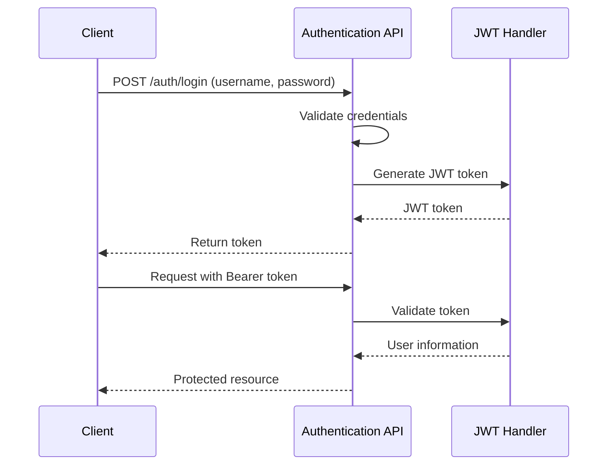
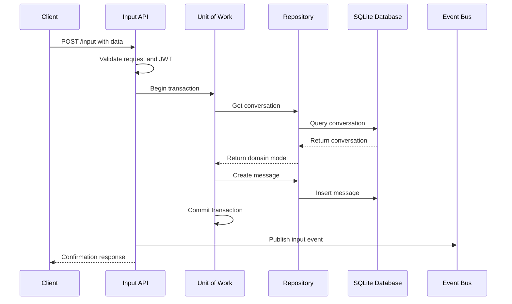
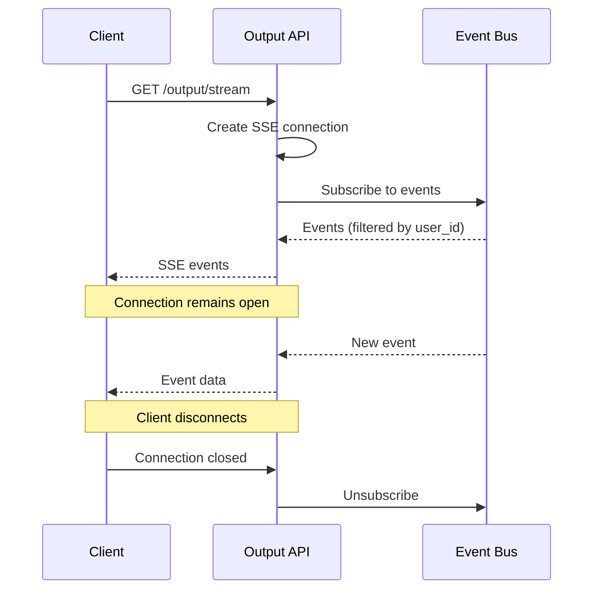

# Cortex Core Development Guide

This document provides practical guidance for developers working on the Cortex Core project. It covers development setup, common tasks, and best practices.

## Development Environment Setup

### Prerequisites

- Python 3.10+
- Git
- UV package manager
- Your favorite code editor (VS Code recommended with Python extension)

### Installation

1. Clone the repository:

   ```bash
   git clone <repository-url>
   cd cortex-core
   ```

2. Install dependencies using the Makefile:

   ```bash
   make
   ```

   This will:

   - Create a virtual environment
   - Install all dependencies
   - Set up development tools

3. Create a `.env` file with environment variables:
   ```bash
   cp .env.example .env
   # Edit .env with your settings
   ```

### Running the Server

Start the development server with:

```bash
make dev
```

The server will be available at http://localhost:8000.

## Core Development Commands

### Code Quality

- Run linting:

  ```bash
  ruff check app tests
  ```

- Run type checking:

  ```bash
  mypy app tests
  ```

- Format code:
  ```bash
  ruff format app tests
  ```

### Testing

- Run all tests:

  ```bash
  python -m pytest
  ```

- Run a specific test file:

  ```bash
  python -m pytest tests/test_event_bus.py
  ```

- Run a specific test function:

  ```bash
  python -m pytest tests/test_event_bus.py::test_event_bus_subscribe
  ```

- Run tests with verbose output:
  ```bash
  python -m pytest -v
  ```

### Database Management

- Run migrations:

  ```bash
  make migrate
  ```

- Create a new migration:
  ```bash
  make revision MSG="describe your change"
  ```

- Database operations use the Unit of Work pattern:
  ```python
  async with UnitOfWork.for_transaction() as uow:
      # Get repositories
      user_repo = uow.repositories.get_user_repository()
      workspace_repo = uow.repositories.get_workspace_repository()
      
      # Work with repositories
      user = await user_repo.get_by_id(user_id)
      workspaces = await workspace_repo.list_by_owner(user_id)
      
      # Create a new workspace
      new_workspace = Workspace(
          name="New Workspace",
          description="A new workspace",
          owner_id=user_id
      )
      created_workspace = await workspace_repo.create(new_workspace)
      
      # Commit the transaction
      await uow.commit()
  # Session is automatically closed when exiting the context
  ```

### Dependency Management

- Install a new dependency:

  ```bash
  uv add package_name
  ```

- Install a development dependency:

  ```bash
  uv add --dev package_name
  ```

- Install type stubs:

  ```bash
  uv add --dev types-package_name
  ```

- Show dependency tree:
  ```bash
  uv tree
  ```

## Project Structure

The Cortex Core project follows a modular structure:

```
cortex-core/
├── app/                    # Main application code
│   ├── __init__.py
│   ├── main.py             # FastAPI app and startup
│   ├── api/                # API endpoints
│   │   ├── __init__.py
│   │   ├── auth.py         # Authentication endpoints
│   │   ├── input.py        # Input endpoint
│   │   ├── output.py       # Output streaming endpoint
│   │   └── config.py       # Configuration endpoints
│   ├── core/               # Core components
│   │   ├── __init__.py
│   │   ├── event_bus.py    # Event bus implementation
│   │   ├── exceptions.py   # Core exception hierarchy
│   │   └── storage.py      # Storage interfaces
│   ├── database/           # Database components
│   │   ├── __init__.py
│   │   ├── connection.py   # Database connection management
│   │   ├── models.py       # SQLAlchemy ORM models
│   │   ├── dependencies.py # FastAPI dependencies for database
│   │   ├── migration.py    # Alembic migration utilities
│   │   ├── unit_of_work.py # Unit of Work pattern implementation
│   │   └── repositories/   # Repository implementations
│   │       ├── __init__.py
│   │       ├── base.py     # Base repository class
│   │       ├── factory.py  # Repository factory
│   │       ├── user_repository.py
│   │       ├── workspace_repository.py
│   │       ├── conversation_repository.py
│   │       └── message_repository.py
│   ├── models/             # Data models
│   │   ├── __init__.py
│   │   ├── base.py         # Base models
│   │   ├── domain.py       # Domain models
│   │   └── api/            # API models
│   │       ├── __init__.py
│   │       ├── request.py  # Request models
│   │       └── response.py # Response models
│   └── utils/              # Utilities
│       ├── __init__.py
│       ├── auth.py         # Authentication utilities
│       ├── db.py           # Database utilities
│       └── validation.py   # Validation utilities
├── docs/                   # Documentation
├── tests/                  # Test suite
│   ├── __init__.py
│   ├── test_api.py         # API tests
│   ├── test_event_bus.py   # Event bus tests
│   ├── test_error_handling.py # Error handling tests 
│   └── test_integration.py # Integration tests
├── alembic.ini             # Alembic migration configuration
├── Makefile                # Build and development commands
├── pyproject.toml          # Project configuration
└── requirements.txt        # Project dependencies
```

## Development Workflow

### Adding a New Feature

1. Understand the requirements and design
2. Write tests first to define the expected behavior
3. Implement the feature
4. Run linting and type checking
5. Run the tests to verify your implementation
6. Document your changes
7. Submit a pull request

### Debugging

#### Logging

The application uses Python's standard logging module. You can adjust the log level in your `.env` file:

```
LOG_LEVEL=DEBUG  # Set to INFO, WARNING, ERROR, or CRITICAL as needed
```

#### FastAPI Debug Tools

- FastAPI provides automatic documentation at `/docs` and `/redoc`
- Use these to explore and test the API interactively

#### Testing with Curl

Here are some useful curl commands for testing the API:

```bash
# Get a JWT token
curl -X POST http://localhost:8000/auth/login \
  -H "Content-Type: application/json" \
  -d '{"username": "example@example.com", "password": "password123"}'

# Send input with the token
curl -X POST http://localhost:8000/input \
  -H "Content-Type: application/json" \
  -H "Authorization: Bearer YOUR_TOKEN_HERE" \
  -d '{"content": "Hello, Cortex!", "conversation_id": "850e8400-e29b-41d4-a716-446655440333"}'

# Create a workspace
curl -X POST http://localhost:8000/config/workspace \
  -H "Content-Type: application/json" \
  -H "Authorization: Bearer YOUR_TOKEN_HERE" \
  -d '{"name": "My Workspace", "description": "A workspace for my project"}'
```

### Testing SSE Endpoints

You can use a tool like [SSE-Client](https://github.com/mpetazzoni/sseclient) to test SSE endpoints:

```python
import sseclient
import requests

# Create a session with the JWT token
session = requests.Session()
session.headers.update({
    'Authorization': 'Bearer YOUR_TOKEN_HERE'
})

# Connect to the SSE endpoint
response = session.get('http://localhost:8000/output/stream', stream=True)
client = sseclient.SSEClient(response)

# Process events
for event in client.events():
    print(f"Received event: {event.data}")
```

## Key Flows

### Authentication Flow



### Input Flow



### Output Flow



## Best Practices

### Code Style

- Follow Google Python Style Guide
- Use type hints consistently
- Keep functions focused and small
- Use descriptive variable and function names
- Write docstrings for all public functions, classes, and modules

### Error Handling

- Use try/except blocks to handle specific exceptions
- Always clean up resources in finally blocks
- Log errors with context information
- Return appropriate HTTP status codes for API errors

### Asyncio Best Practices

- Always handle asyncio.CancelledError in tasks
- Use asyncio.create_task for creating background tasks
- Keep track of all tasks for proper cleanup
- Use asyncio.Queue for communication between tasks
- Always implement proper resource cleanup

### Testing

- Write both unit tests and integration tests
- Mock external dependencies in unit tests
- Use FastAPI's TestClient for API testing
- Test both success and error cases
- Verify resource cleanup in long-running operations

### Event Bus Usage

- Always include user_id in events for proper filtering
- Include timestamps in events
- Keep event payloads simple and focused
- Handle event bus exceptions properly
- Always unsubscribe when no longer needed

### Security

- Validate all user input
- Never trust client-provided data
- Always check authorization for protected resources
- Use proper password hashing in production
- Keep secret keys secure and use environment variables

## Common Issues and Solutions

### Connection Leaks in SSE

**Problem**: Resources not being cleaned up when clients disconnect.

**Solution**:

```python
try:
    # SSE connection code
    while True:
        # Process events
except asyncio.CancelledError:
    # Client disconnected
    raise  # Re-raise to propagate
finally:
    # Always clean up resources
    event_bus.unsubscribe(queue)
```

### Blocking Operations in Async Code

**Problem**: Blocking operations freezing the async event loop.

**Solution**:

- Use asyncio-compatible libraries
- For CPU-bound tasks, use `asyncio.to_thread()`
- For IO-bound tasks, use async libraries like aiohttp, asyncpg, etc.

### Event Bus Memory Leaks

**Problem**: Subscribers not being removed from the event bus.

**Solution**:

- Always unsubscribe in finally blocks
- Keep track of all subscriptions
- Implement weak references for long-lived subscriptions

### Authentication Issues

**Problem**: JWT token validation failing.

**Solution**:

- Check token expiration
- Verify the secret key is consistent
- Ensure the token format matches what the server expects
- Check for proper Authorization header format

## Future Development

Phase 1 focuses on a functional input/output system with in-memory storage. Future phases will add:

1. **Phase 2**: Persistent storage (SQL database) and enhanced configuration API
2. **Phase 3**: MCP Protocol and service architecture
3. **Phase 4**: Distributed services
4. **Phase 5**: Production hardening

When contributing to Cortex Core, keep these future phases in mind, but focus on the current phase's requirements.

## Performance Considerations

While premature optimization should be avoided, be aware of these performance aspects:

1. **Memory Usage**: The in-memory storage can grow significantly with active usage
2. **Event Bus Scaling**: The simple event bus implementation works well for moderate loads but may need optimization for heavy usage
3. **SSE Connections**: Each SSE connection creates a task and queue that consumes resources
4. **Authentication Overhead**: JWT validation happens on every request

## Additional Resources

- [FastAPI Documentation](https://fastapi.tiangolo.com/)
- [Pydantic Documentation](https://docs.pydantic.dev/)
- [Asyncio Documentation](https://docs.python.org/3/library/asyncio.html)
- [Server-Sent Events MDN Documentation](https://developer.mozilla.org/en-US/docs/Web/API/Server-sent_events/Using_server-sent_events)
