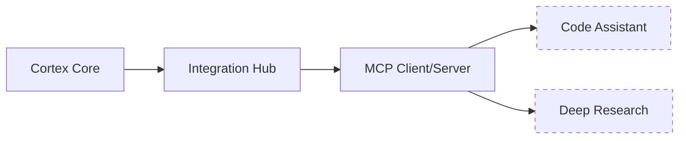

# Domain Expert Entities

This document describes the Domain Expert Entity architecture in Cortex Core, focusing on the current implementation state, integration points, and future roadmap.

## Overview

Domain Expert Entities are specialized AI modules that provide deep expertise in specific domains. As described in the architectural vision, these entities operate as autonomous extensions of the Cortex Core, taking on complex tasks with minimal oversight from the central system.

The current implementation includes the framework for integrating Domain Experts through the Model Context Protocol (MCP), but actual Domain Expert services are still in development.



## Integration Hub

The Integration Hub is the central component that manages connections to Domain Expert services.

### Current Implementation

The Integration Hub is implemented in `app/components/integration_hub.py` with these key features:

- **MCP Client Management**: Creates and manages connections to MCP endpoints
- **Tool Discovery**: Lists available tools from Domain Expert services
- **Tool Invocation**: Calls tools with appropriate arguments
- **Circuit Breaker Pattern**: Provides fault tolerance for domain expert calls
- **Resource Access**: Reads resources exposed by domain expert services

```python
# Example: Invoking a Domain Expert tool
expert_name = "code_assistant"
tool_name = "generate_code"
arguments = {
    "prompt": "Write a Python function to calculate Fibonacci numbers",
    "language": "python"
}

# Get Integration Hub
integration_hub = get_integration_hub()

# Invoke the tool
result = await integration_hub.invoke_expert_tool(
    expert_name=expert_name,
    tool_name=tool_name,
    arguments=arguments
)
```

### Configuration

Domain Expert endpoints are configured in the application settings:

```python
# In app/config.py
Settings(
    mcp=MCPSettings(
        endpoints=[
            {"name": "code_assistant", "endpoint": "https://mcp-code-assistant.example.com"},
            {"name": "deep_research", "endpoint": "https://mcp-research.example.com"},
        ]
    )
)
```

## Model Context Protocol (MCP)

The MCP is used as the standard protocol for communication between Cortex Core and Domain Expert services.

### Cortex as MCP Client

Cortex Core implements the MCP client to communicate with Domain Expert services:

- **Client Session**: Uses the Python MCP SDK client
- **SSE Transport**: Uses Server-Sent Events for asynchronous communication
- **Tool Execution**: Calls tools and processes results
- **Resource Access**: Reads resources from MCP servers

### Domain Experts as MCP Servers

Domain Expert services will implement MCP servers using the FastMCP API from the Python SDK:

- **Decorator-based Tools**: Simple definition of tools using Python decorators
- **Type-safe Interfaces**: Automatic validation of parameters using Python type annotations
- **Resource Templating**: URI-template based resource definitions
- **Lifecycle Management**: Proper setup and teardown of resources

## Planned Domain Experts

The following Domain Expert entities are planned for implementation:

### 1. Code Assistant

Will provide advanced code generation, analysis, and refactoring capabilities:

- **Code Generation**: Generate code from natural language descriptions
- **Code Analysis**: Analyze code for bugs, performance issues, and style violations
- **Refactoring**: Suggest and implement code refactorings
- **Documentation**: Generate and improve code documentation

### 2. Deep Research

Will provide in-depth research and analysis capabilities:

- **Information Retrieval**: Search across multiple data sources
- **Information Synthesis**: Combine information from multiple sources into coherent summaries
- **Analysis**: Provide analytical insights on complex topics
- **Citation Management**: Track and manage citations and references

## Creating a Domain Expert

To create a new Domain Expert service that integrates with Cortex Core:

### 1. Implement an MCP Server

```python
from fastmcp import FastMCPApp, Tool, Resource

app = FastMCPApp()

@app.tool()
async def example_tool(prompt: str, options: dict) -> dict:
    """Example tool that processes a prompt with options"""
    # Implement tool logic
    result = {"output": f"Processed: {prompt}"}
    return result

@app.resource("/files/{file_id}")
async def get_file(file_id: str) -> dict:
    """Resource that provides access to a file"""
    # Implement resource access
    return {"content": "File content here"}

if __name__ == "__main__":
    app.run()
```

### 2. Register the Domain Expert

Add the endpoint to the Cortex Core configuration:

```python
# In app/config.py
Settings(
    mcp=MCPSettings(
        endpoints=[
            # Existing endpoints...
            {"name": "my_expert", "endpoint": "https://my-expert-service.example.com"},
        ]
    )
)
```

### 3. Invoke the Domain Expert

```python
# Get Integration Hub
integration_hub = get_integration_hub()

# List available tools
tools = await integration_hub.list_expert_tools("my_expert")

# Invoke a tool
result = await integration_hub.invoke_expert_tool(
    expert_name="my_expert",
    tool_name="example_tool",
    arguments={"prompt": "Hello, world!", "options": {"format": "json"}}
)

# Read a resource
file = await integration_hub.read_expert_resource(
    expert_name="my_expert",
    uri="/files/123"
)
```

## Current Implementation Status

| Component | Status | Notes |
|-----------|--------|-------|
| Integration Hub | Implemented | Core framework for MCP integration |
| MCP Client | Implemented | Client for Model Context Protocol |
| Circuit Breaker | Implemented | Fault tolerance for domain expert calls |
| Tool Discovery | Implemented | API for listing available tools |
| Tool Invocation | Implemented | API for invoking tools with arguments |
| Resource Access | Implemented | API for reading resources |
| Code Assistant | Planned | Not yet implemented |
| Deep Research | Planned | Not yet implemented |

## Testing and Mocking

When testing components that interact with Domain Experts, you can use these approaches:

### 1. Mock the Integration Hub

```python
# In your test file
from unittest.mock import MagicMock

# Create a mock Integration Hub
mock_hub = MagicMock()
mock_hub.invoke_expert_tool.return_value = {"result": "mocked result"}

# Inject the mock
app.dependency_overrides[get_integration_hub] = lambda: mock_hub

# Test your component
response = client.post("/api/endpoint", json={"data": "test"})
assert response.status_code == 200
```

### 2. Mock MCP Clients

```python
# In your test file
def test_integration_hub():
    # Create a mock MCP client
    mock_client = MagicMock()
    mock_client.call_tool.return_value = {"result": "success"}
    
    # Create an IntegrationHub with the mock client
    hub = IntegrationHub()
    hub.clients["test_expert"] = mock_client
    
    # Test tool invocation
    result = await hub.invoke_expert_tool(
        expert_name="test_expert",
        tool_name="test_tool",
        arguments={"arg": "value"}
    )
    
    # Verify the result
    assert result["result"] == "success"
    
    # Verify the call
    mock_client.call_tool.assert_called_once_with(
        name="test_tool",
        arguments={"arg": "value"}
    )
```

## Future Enhancements

Planned improvements to the Domain Expert integration:

1. **Autonomous Processing**: More robust support for autonomous task handling
2. **Context Passing**: Better mechanisms for sharing context between Cortex Core and Domain Experts
3. **Tool Composition**: Support for composing tools from multiple Domain Experts
4. **Domain Expert Registry**: A registry service for discovering Domain Experts
5. **User-Defined Domain Experts**: Support for user-defined Domain Experts

## Related Documentation

- [ARCHITECTURE.md](ARCHITECTURE.md): Overall system architecture
- [INTEGRATION_HUB.md](INTEGRATION_HUB.md): Detailed Integration Hub documentation
- [MCP_INTERNAL_GUIDE.md](MCP_INTERNAL_GUIDE.md): Internal guide for MCP implementation