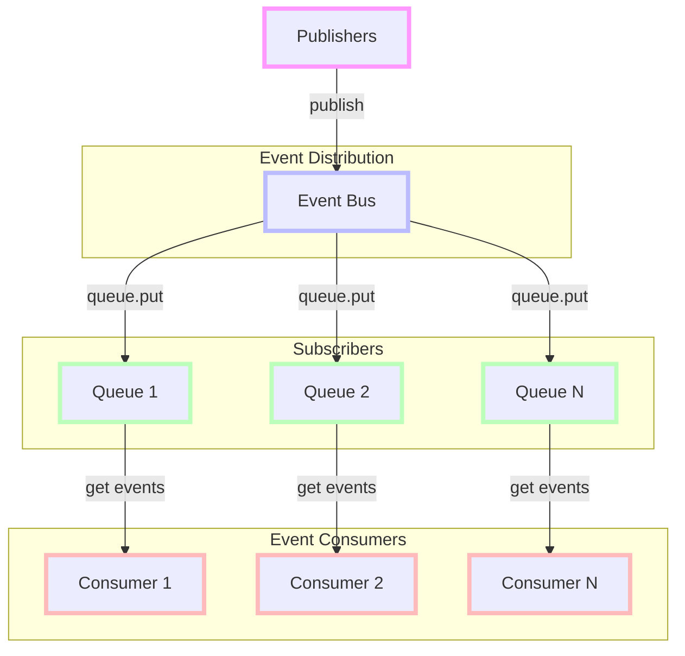
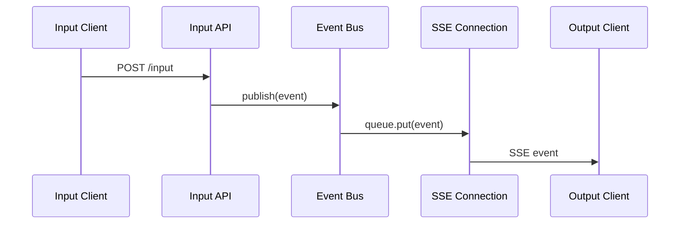

# Cortex Core Event Bus

This document provides a comprehensive guide to the Event Bus system implemented in Cortex Core. It covers the design, implementation details, best practices, and common pitfalls.

## Overview

The Event Bus is a central communication mechanism within Cortex Core that enables loosely coupled components to exchange information. It follows a publisher-subscriber pattern that allows for efficient, asynchronous communication between different parts of the system.

## Architecture

The Event Bus implementation in Phase 1 is intentionally simple, using asyncio queues for message distribution. This design prioritizes clarity and reliability over complex features.



### Core Components

1. **EventBus Class**: The central manager for subscriptions and event publishing
2. **Subscribers**: AsyncIO queues that receive events
3. **Events**: JSON-serializable dictionaries with a standard format
4. **Publishers**: Any component that needs to distribute events

### Design Principles

1. **Simplicity**: Minimal API with just subscribe, publish, and unsubscribe methods
2. **User Partitioning**: All events must include user_id for filtering
3. **Asynchronous Operation**: Non-blocking publish and receive operations
4. **Standard Event Format**: Consistent structure for all events
5. **Resource Safety**: Proper cleanup mechanisms for subscriptions

## Implementation Details

### EventBus Class

The Event Bus is implemented as a simple class that manages a list of subscribers:

```python
class EventBus:
    def __init__(self):
        """Initialize the event bus with an empty list of subscribers."""
        self.subscribers = []  # List of asyncio.Queue objects
        
    def subscribe(self, queue: asyncio.Queue) -> None:
        """Register a queue to receive events."""
        self.subscribers.append(queue)
        
    async def publish(self, event: Dict[str, Any]) -> None:
        """Publish an event to all subscribers."""
        # Validate event format
        if "type" not in event:
            raise ValueError("Event must have a 'type' field")
        if "user_id" not in event:
            raise ValueError("Event must have a 'user_id' field")
            
        # Add timestamp if not present
        if "timestamp" not in event:
            event["timestamp"] = datetime.now().isoformat()
            
        # Distribute to all subscribers
        for queue in self.subscribers:
            try:
                await queue.put(event)
            except Exception as e:
                logger.error(f"Failed to publish event: {e}")
                
    def unsubscribe(self, queue: asyncio.Queue) -> None:
        """Unregister a queue."""
        if queue in self.subscribers:
            self.subscribers.remove(queue)
```

### Standard Event Format

All events must follow this structure:

```python
{
    "type": str,       # Event type (e.g., "input", "output", "typing")
    "data": dict,      # Event payload
    "user_id": str,    # User ID for filtering (required)
    "timestamp": str,  # ISO-format timestamp (added if not provided)
    "metadata": dict   # Optional metadata
}
```

### Event Types

Common event types include:

- `input`: Input received from a client
- `output`: Output to be sent to clients
- `typing`: Typing indicator status changes
- `heartbeat`: Regular connection health check
- `error`: Error notifications
- `config_change`: Configuration changes

### Subscription Lifecycle

A typical subscription lifecycle looks like this:

```python
# 1. Create a queue for this subscriber
queue = asyncio.Queue()

# 2. Subscribe to the event bus
event_bus.subscribe(queue)

# 3. Process events in a loop
try:
    while True:
        # Wait for an event
        event = await queue.get()
        
        # Process the event
        # ...
        
except asyncio.CancelledError:
    # Handle cancellation
    raise
finally:
    # Always unsubscribe to prevent memory leaks
    event_bus.unsubscribe(queue)
```

## Consumer Filtering

The Event Bus doesn't filter events before distribution - all subscribers receive all events. Instead, consumers are responsible for filtering events based on user_id and event type:

```python
# Example: Filtering events in a consumer
async def process_events(queue, user_id):
    while True:
        event = await queue.get()
        
        # Filter events for this user
        if event.get("user_id") != user_id:
            continue
            
        # Filter by event type if needed
        if event.get("type") not in ["output", "typing"]:
            continue
            
        # Process the event
        process_event(event)
```

## SSE Implementation

The Event Bus is particularly important for the Server-Sent Events (SSE) implementation, which streams events to clients in real-time:

```python
@router.get("/output/stream")
async def output_stream(
    request: Request,
    user: UserData = Depends(get_current_user),
    event_bus: EventBus = Depends(get_event_bus)
) -> StreamingResponse:
    # Create a queue for this connection
    queue = asyncio.Queue()
    
    # Subscribe to the event bus
    event_bus.subscribe(queue)
    
    async def event_generator():
        try:
            while True:
                # Wait for an event with timeout for heartbeat
                try:
                    event = await asyncio.wait_for(queue.get(), timeout=30)
                    
                    # Filter events for this user
                    if event.get("user_id") == user.user_id:
                        # Format as SSE
                        yield f"data: {json.dumps(event)}\n\n"
                except asyncio.TimeoutError:
                    # Send heartbeat on timeout
                    heartbeat = {
                        "type": "heartbeat",
                        "timestamp": datetime.now().isoformat(),
                        "user_id": user.user_id
                    }
                    yield f"data: {json.dumps(heartbeat)}\n\n"
        except asyncio.CancelledError:
            # Client disconnected
            raise
        finally:
            # Always unsubscribe to prevent memory leaks
            event_bus.unsubscribe(queue)
    
    return StreamingResponse(
        event_generator(),
        media_type="text/event-stream"
    )
```

## Input-to-Output Flow

The complete flow from input to output involves these steps:

1. Client sends data to the input endpoint
2. Input endpoint publishes an event to the Event Bus
3. Event Bus distributes the event to all subscribers
4. SSE connections filter events and stream them to appropriate clients



## Common Pitfalls and Solutions

### Memory Leaks

**Problem**: Failing to unsubscribe from the Event Bus when clients disconnect.

**Solution**: Always use try/finally blocks to ensure unsubscription:

```python
try:
    # Process events
except asyncio.CancelledError:
    # Client disconnected
    raise
finally:
    # Always unsubscribe
    event_bus.unsubscribe(queue)
```

### Blocking the Event Loop

**Problem**: Slow event processing blocking the event loop.

**Solution**: Process events quickly or offload to a background task:

```python
async def process_event(event):
    # Offload slow processing to a background task
    asyncio.create_task(slow_processing(event))
    
    # Return quickly from this function
    return
```

### Missing Event Fields

**Problem**: Publishing events without required fields.

**Solution**: Add validation in the publish method:

```python
async def publish(self, event: Dict[str, Any]) -> None:
    # Validate required fields
    if "type" not in event:
        raise ValueError("Event must have a 'type' field")
    if "user_id" not in event:
        raise ValueError("Event must have a 'user_id' field")
    
    # Continue with publishing
    # ...
```

### Event Queue Overflow

**Problem**: Subscribers not processing events fast enough, causing queue buildup.

**Solution**: Use bounded queues with appropriate maxsize:

```python
# Create a queue with a maximum size
queue = asyncio.Queue(maxsize=100)

# Subscribe to event bus
event_bus.subscribe(queue)
```

## Event Bus Testing

Here's how to test the Event Bus:

### Unit Testing

```python
import asyncio
import pytest
from app.core.event_bus import EventBus

@pytest.mark.asyncio
async def test_event_bus_publish_subscribe():
    # Setup
    event_bus = EventBus()
    queue = asyncio.Queue()
    event_bus.subscribe(queue)
    
    # Test data
    test_event = {
        "type": "test",
        "data": {"message": "Hello"},
        "user_id": "user1"
    }
    
    # Action
    await event_bus.publish(test_event)
    
    # Assert
    received_event = await asyncio.wait_for(queue.get(), timeout=1)
    assert received_event == test_event
    assert "timestamp" in received_event
    
    # Cleanup
    event_bus.unsubscribe(queue)
```

### Integration Testing

```python
@pytest.mark.asyncio
async def test_input_to_output_flow():
    # Create test dependencies
    event_bus = EventBus()
    storage = InMemoryStorage()
    
    # Create a subscriber
    queue = asyncio.Queue()
    event_bus.subscribe(queue)
    
    # Simulate input
    input_data = {
        "content": "Test message",
        "conversation_id": "conv1"
    }
    user_id = "user1"
    
    # Process input (simplified)
    event = {
        "type": "input",
        "data": input_data,
        "user_id": user_id,
        "timestamp": datetime.now().isoformat()
    }
    
    # Publish event
    await event_bus.publish(event)
    
    # Verify event received by subscriber
    received_event = await asyncio.wait_for(queue.get(), timeout=1)
    assert received_event["type"] == "input"
    assert received_event["user_id"] == user_id
    assert received_event["data"]["content"] == "Test message"
    
    # Cleanup
    event_bus.unsubscribe(queue)
```

## Best Practices

### Event Design

1. **Keep Events Simple**: Include only necessary data in events
2. **Use Standard Types**: Ensure all values are JSON-serializable
3. **Include Timestamp**: Always include timestamp for ordering and debugging
4. **Required Fields**: Always include type and user_id
5. **Descriptive Types**: Use clear, descriptive event types

### Resource Management

1. **Always Unsubscribe**: Use finally blocks to ensure proper unsubscription
2. **Track Subscriptions**: Monitor the number of active subscriptions for debugging
3. **Limit Queue Size**: Use bounded queues to prevent memory issues
4. **Handle CancelledError**: Properly handle asyncio.CancelledError in subscribers
5. **Clean Up Tasks**: Cancel and clean up any background tasks

### Error Handling

1. **Catch Publishing Errors**: Catch exceptions during publish but log them
2. **Validate Events**: Validate event format before publishing
3. **Handle Queue Exceptions**: Prepare for exceptions when putting to queues
4. **Log Failures**: Log subscriber processing failures
5. **Circuit Breaker**: Remove problematic subscribers if they consistently fail

## Advanced Usage

### Adding Metadata to Events

```python
event = {
    "type": "input",
    "data": input_data,
    "user_id": user.user_id,
    "timestamp": datetime.now().isoformat(),
    "metadata": {
        "client_id": input_data.metadata.get("client_id"),
        "client_version": input_data.metadata.get("client_version"),
        "source_ip": request.client.host,
        "correlation_id": str(uuid.uuid4())
    }
}
```

### Custom Event Processors

```python
class EventProcessor:
    def __init__(self, event_bus: EventBus, user_id: str):
        self.event_bus = event_bus
        self.user_id = user_id
        self.queue = asyncio.Queue()
        self.task = None
        
    async def start(self):
        # Subscribe to event bus
        self.event_bus.subscribe(self.queue)
        
        # Start processing task
        self.task = asyncio.create_task(self.process_events())
        
    async def process_events(self):
        try:
            while True:
                event = await self.queue.get()
                
                # Filter events for this user
                if event.get("user_id") != self.user_id:
                    continue
                    
                # Process based on event type
                event_type = event.get("type")
                if event_type == "input":
                    await self.handle_input(event)
                elif event_type == "output":
                    await self.handle_output(event)
        except asyncio.CancelledError:
            # Task cancelled
            raise
        finally:
            # Always unsubscribe
            self.event_bus.unsubscribe(self.queue)
            
    async def handle_input(self, event):
        # Process input event
        pass
        
    async def handle_output(self, event):
        # Process output event
        pass
        
    async def stop(self):
        # Cancel the processing task
        if self.task:
            self.task.cancel()
            try:
                await self.task
            except asyncio.CancelledError:
                pass
```

## Future Enhancements

While Phase 1 implements a simple in-memory Event Bus, future phases may add:

1. **Persistent Events**: Storing events for replay and recovery
2. **Event Filtering**: Server-side filtering before distribution
3. **Pattern Matching**: More sophisticated event routing
4. **Message Guarantees**: Ensuring event delivery
5. **Event Acknowledgment**: Confirming event processing
6. **Scaling**: Distributing the event bus across multiple nodes
7. **Metrics**: Tracking event throughput and latency

## Conclusion

The Event Bus is a critical component of Cortex Core's architecture, enabling loosely coupled communication between components. While intentionally simple in Phase 1, it provides the foundation for more sophisticated event processing in future phases.

Remember these key points:
1. All events must include user_id for filtering
2. Always unsubscribe queues when they're no longer needed
3. Process events quickly to avoid blocking
4. Implement proper error handling
5. Use try/finally blocks for resource cleanup