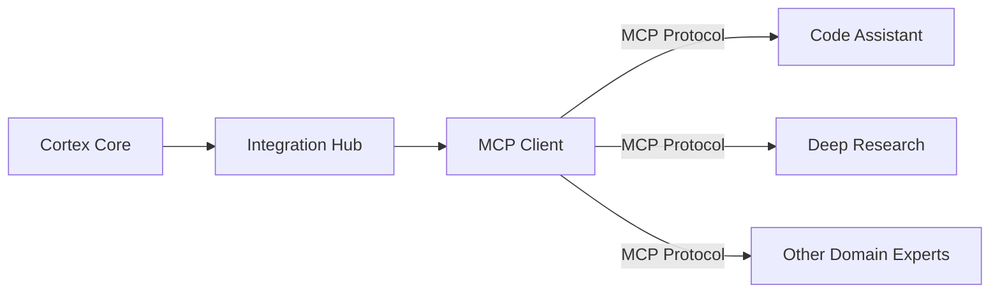

# Integration Hub

This document provides detailed information about the Integration Hub component in Cortex Core, which manages connections to Domain Expert services through the Model Context Protocol (MCP).

## Overview

The Integration Hub is a central component of Cortex Core that facilitates communication with specialized Domain Expert services. It implements the client-side of the Model Context Protocol (MCP), enabling the Cortex Core to discover and call tools provided by external services.



## Current Implementation Status

The Integration Hub is currently implemented with these key features:

**Implemented:**
- ✅ MCP Client interface
- ✅ Connection management for multiple endpoints
- ✅ Tool discovery and invocation
- ✅ Circuit breaker pattern for fault tolerance
- ✅ Resource access for reading resources

**Planned:**
- ❌ Full implementation of Domain Expert services
- ❌ Tool composition across multiple Domain Experts
- ❌ Streaming tool results
- ❌ Dynamic endpoint discovery

## Architecture

The Integration Hub is designed with a clear separation between the interface and implementation:

```
┌────────────────┐     ┌───────────────────┐
│                │     │                   │
│  Core Services │     │   CortexRouter    │
│                │     │                   │
└───────┬────────┘     └─────────┬─────────┘
        │                        │
        │                        │
        │     ┌─────────────────▼─────────────────┐
        │     │                                   │
        └────►│       Integration Hub             │
              │                                   │
              └───────────────┬───────────────────┘
                              │
                              │
                   ┌──────────▼──────────┐
                   │                     │
                   │    MCP Client       │
                   │                     │
                   └─────────┬───────────┘
                             │
                             ▼
                    ┌──────────────────┐
                    │  Domain Expert   │
                    │  MCP Servers     │
                    └──────────────────┘
```

## Component Implementation

### Integration Hub

The Integration Hub is implemented in `app/components/integration_hub.py` with these key features:

```python
class IntegrationHub:
    """Manages connections to Domain Expert services via MCP"""
    
    def __init__(self) -> None:
        self.settings = settings
        self.clients: Dict[str, CortexMcpClient] = {}
        self.circuit_breakers: Dict[str, CircuitBreaker] = {}
        
    async def startup(self) -> None:
        """Initialize connections to all configured MCP endpoints"""
        for endpoint in self.settings.mcp.endpoints:
            try:
                client = CortexMcpClient(
                    endpoint=endpoint["endpoint"],
                    service_name=endpoint["name"]
                )
                await client.connect()
                self.clients[endpoint["name"]] = client
                
                # Create circuit breaker for this endpoint
                self.circuit_breakers[endpoint["name"]] = CircuitBreaker(
                    name=f"mcp-{endpoint['name']}",
                    failure_threshold=3,
                    recovery_timeout=60.0
                )
                
                logger.info(f"Registered MCP endpoint: {endpoint['name']}")
            except Exception as e:
                logger.error(f"Failed to register MCP endpoint {endpoint['name']}: {str(e)}")
```

### MCP Client

The MCP Client is implemented as the `CortexMcpClient` class:

```python
class CortexMcpClient:
    """Wrapper for MCP client using the official Python SDK"""

    def __init__(self, endpoint: str, service_name: str):
        self.endpoint = endpoint
        self.service_name = service_name
        self.client: Optional[Union[ClientSession, ClientProtocol]] = None

    async def connect(self) -> None:
        """Connect to the MCP server"""
        if self.client is not None:
            # Already connected
            return
            
        try:
            # Connect to the MCP server
            logger.info(f"Connecting to MCP endpoint: {self.service_name} at {self.endpoint}")
            
            # In production, we'd create proper streams using the SSE client
            self.client = ClientSession(None, None)  # type: ignore
            await self.client.initialize()
            
            logger.info(f"Connected to MCP endpoint: {self.service_name} at {self.endpoint}")
        except Exception as e:
            logger.error(f"Failed to connect to MCP endpoint {self.service_name}: {str(e)}")
            self.client = None
            raise
```

### Circuit Breaker

The Integration Hub uses a circuit breaker pattern to improve fault tolerance:

```python
class CircuitBreaker:
    """Circuit breaker for fault tolerance"""
    
    def __init__(self, name: str, failure_threshold: int = 3, recovery_timeout: float = 60.0):
        self.name = name
        self.failure_threshold = failure_threshold
        self.recovery_timeout = recovery_timeout
        self.failure_count = 0
        self.last_failure_time: Optional[float] = None
        self.state = CircuitState.CLOSED
        
    async def execute(self, func: Callable, *args, **kwargs):
        """Execute a function with circuit breaker protection"""
        if self.state == CircuitState.OPEN:
            # Check if recovery timeout has elapsed
            if self.last_failure_time and time.time() - self.last_failure_time > self.recovery_timeout:
                self.state = CircuitState.HALF_OPEN
                logger.info(f"Circuit {self.name} changing to HALF_OPEN state")
            else:
                raise CircuitOpenError(f"Circuit {self.name} is OPEN")
                
        try:
            # Execute the function
            result = await func(*args, **kwargs)
            
            # If successful and in HALF_OPEN state, reset the circuit
            if self.state == CircuitState.HALF_OPEN:
                self.reset()
                
            return result
            
        except Exception as e:
            # Track the failure
            self.failure_count += 1
            self.last_failure_time = time.time()
            
            # Check if we should open the circuit
            if self.state == CircuitState.CLOSED and self.failure_count >= self.failure_threshold:
                self.state = CircuitState.OPEN
                logger.warning(f"Circuit {self.name} changed to OPEN state after {self.failure_count} failures")
                
            # Re-raise the exception
            raise
```

## API Reference

### Listing Available Experts

```python
async def list_experts(self) -> List[str]:
    """List all available domain experts"""
    return list(self.clients.keys())
```

### Listing Expert Tools

```python
async def list_expert_tools(self, expert_name: str) -> Dict[str, Any]:
    """List all tools available from a specific domain expert"""
    if expert_name not in self.clients:
        raise ValueError(f"Unknown domain expert: {expert_name}")
        
    client = self.clients[expert_name]
    circuit_breaker = self.circuit_breakers[expert_name]
    
    return await circuit_breaker.execute(client.list_tools)
```

### Invoking Expert Tools

```python
async def invoke_expert_tool(
    self, expert_name: str, tool_name: str, arguments: Dict[str, Any]
) -> Dict[str, Any]:
    """Invoke a tool on a specific domain expert"""
    if expert_name not in self.clients:
        raise ValueError(f"Unknown domain expert: {expert_name}")
        
    client = self.clients[expert_name]
    circuit_breaker = self.circuit_breakers[expert_name]
    
    return await circuit_breaker.execute(
        client.call_tool, name=tool_name, arguments=arguments
    )
```

### Reading Expert Resources

```python
async def read_expert_resource(self, expert_name: str, uri: str) -> Dict[str, Any]:
    """Read a resource from a specific domain expert"""
    if expert_name not in self.clients:
        raise ValueError(f"Unknown domain expert: {expert_name}")
        
    client = self.clients[expert_name]
    circuit_breaker = self.circuit_breakers[expert_name]
    
    return await circuit_breaker.execute(client.read_resource, uri=uri)
```

## Configuration

The Integration Hub is configured through the application settings:

```python
# In app/config.py
Settings(
    mcp=MCPSettings(
        endpoints=[
            {"name": "code_assistant", "endpoint": "https://mcp-code-assistant.example.com"},
            {"name": "deep_research", "endpoint": "https://mcp-research.example.com"},
        ]
    )
)
```

Environment variables for configuration:

```
MCP_ENDPOINTS=[{"name":"code_assistant","endpoint":"https://mcp-code-assistant.example.com"}]
MCP_CONNECTION_TIMEOUT=30
MCP_RETRY_COUNT=3
```

## Usage Examples

### Discovering Tools

```python
# Get Integration Hub
integration_hub = get_integration_hub()

# List available domain experts
experts = await integration_hub.list_experts()
print(f"Available experts: {experts}")

# List tools for a specific expert
tools = await integration_hub.list_expert_tools("code_assistant")
print(f"Available tools: {tools}")
```

### Invoking a Tool

```python
# Get Integration Hub
integration_hub = get_integration_hub()

# Define tool arguments
arguments = {
    "prompt": "Write a Python function to calculate Fibonacci numbers",
    "language": "python"
}

# Invoke the tool
result = await integration_hub.invoke_expert_tool(
    expert_name="code_assistant",
    tool_name="generate_code",
    arguments=arguments
)

# Process the result
code = result.get("code", "")
print(f"Generated code: {code}")
```

### Error Handling

```python
try:
    # Attempt to invoke a tool
    result = await integration_hub.invoke_expert_tool(
        expert_name="code_assistant",
        tool_name="generate_code",
        arguments=arguments
    )
    
    # Process successful result
    print(f"Success: {result}")
    
except ValueError as e:
    # Handle invalid expert or tool name
    print(f"Invalid expert or tool: {e}")
    
except CircuitOpenError as e:
    # Handle circuit breaker open
    print(f"Service temporarily unavailable: {e}")
    
except Exception as e:
    # Handle other errors
    print(f"Error invoking tool: {e}")
```

## Testing and Mocking

The Integration Hub includes features to support testing and mocking:

### Mocking Client Sessions

```python
def test_integration_hub():
    """Test the Integration Hub with mocked clients"""
    # Create a mock MCP client
    mock_client = MagicMock()
    mock_client.call_tool.return_value = {"result": "success"}
    
    # Create an IntegrationHub instance
    hub = IntegrationHub()
    hub.clients["test_expert"] = mock_client
    
    # Add a circuit breaker for the mock client
    hub.circuit_breakers["test_expert"] = CircuitBreaker(
        name="test-circuit",
        failure_threshold=3,
        recovery_timeout=1.0
    )
    
    # Test invoking a tool
    result = await hub.invoke_expert_tool(
        expert_name="test_expert",
        tool_name="test_tool",
        arguments={"arg": "value"}
    )
    
    # Verify the result
    assert result["result"] == "success"
    
    # Verify the client was called correctly
    mock_client.call_tool.assert_called_once_with(
        name="test_tool",
        arguments={"arg": "value"}
    )
```

## Integration with Domain Experts

For information on implementing Domain Expert services that integrate with the Integration Hub, see the [DOMAIN_EXPERTS.md](DOMAIN_EXPERTS.md) document.

## Future Enhancements

The following enhancements are planned for the Integration Hub:

1. **Full Domain Expert Implementations**: Complete implementations of Code Assistant and Deep Research Domain Experts
2. **Dynamic Discovery**: Automatic discovery of available Domain Experts
3. **Tool Composition**: Support for composing tools from multiple Domain Experts
4. **Streaming Results**: Support for streaming tool results
5. **Enhanced Fault Tolerance**: More sophisticated circuit breaker patterns
6. **Metrics and Monitoring**: Better observability for Domain Expert interactions
7. **Advanced Authentication**: More secure authentication mechanisms

## Related Documentation

- [DOMAIN_EXPERTS.md](DOMAIN_EXPERTS.md): Documentation on Domain Expert entities
- [IMPLEMENTATION_STATUS.md](IMPLEMENTATION_STATUS.md): Overall implementation status
- [Technical_Architecture.md](/cortex-platform/ai-context/cortex/Cortex_Platform-Technical_Architecture.md): Vision document describing the Domain Expert concept