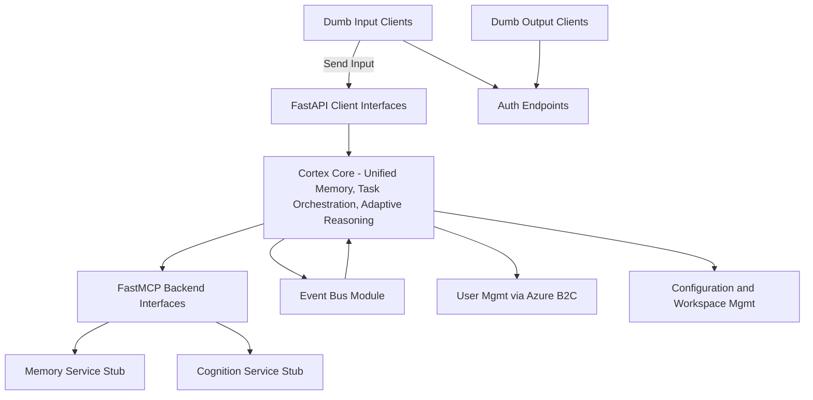

# Cortex Core End-to-End Integration and Testing Plan

## Overview

This document describes the plan for integrating the Cortex Core with backend stub services and validating the full end-to-end workflows. Our goal is to ensure that all components—from authentication, input handling, and event routing to our Memory and Cognition stub services—work together seamlessly. This plan includes:

- Integration with backend stub services (Memory and Cognition Service Stubs)
- Validation of the internal event bus functionality using simulated input and output
- Authentication flow testing using stubbed Azure AD B2C endpoints
- Configuration and workspace management endpoint tests
- End-to-end simulation test procedures
- Deployment and environment configuration (with sample Docker Compose)

---

## Integration Components

### 1. Cortex Core and Backend Stub Integration

Cortex Core (acting as an MCP client) will connect to the following stub services:

- **Memory Service Stub:** Accepts input with the `store_input` tool and provides stored data via the `get_history` resource.
- **Cognition Service Stub:** Provides context (by retrieving history) via the `get_context` tool.
- **Domain Expert Entities:** (For future integration, currently not a focus for the MVP.)

These interactions enable end-to-end flows where input from a dumb client is processed through the core, stored by Memory Service, and retrieved by the Cognition Service when needed.

### 2. Internal Event Bus

A simple in-memory publish-subscribe mechanism is used to route events internally. Key events include:

- **Input Event:** Published when a dumb input client sends data.
- **Configuration Change Event:** Published when workspaces or conversations are updated.
- All events include a `user` field to ensure proper multi-user partitioning.

### 3. Authentication Testing

Authentication is handled by stub endpoints that mimic Azure AD B2C behavior. Major endpoints include:

- `/auth/login` – Issues a JWT token containing standard claims (e.g., unique user id, email, name).
- `/auth/verify` – Validates the token and returns user details.

The Cortex Core uses these endpoints to secure its other APIs, ensuring that input, configuration, and output requests are authenticated and partitioned by user.

### 4. End-to-End Data Flow

The full workflow includes:

- **Authentication:** A client logs in using `/auth/login` to obtain a token.
- **Input Submission:** A dumb input client sends data to `/input`. The endpoint:
  - Validates the token,
  - Attaches the user id,
  - Publishes a corresponding event on the event bus,
  - Forwards the input to the Memory Service Stub.
- **Context Retrieval:** When context is needed (for example, for conversation history), Cortex Core calls the Cognition Service Stub (`get_context`) to retrieve stored data.
- **Output Streaming:** A dumb output client subscribes to `/output/stream` (SSE) and receives events that the core publishes (for example, echoing the input or sending context data).
- **Configuration Management:** Clients use endpoints under `/config/*` to create or query workspaces and conversations.

---

## High-Level Integration Flow Diagram



**Explanation:**

- A dumb input client sends data via the `/input` endpoint in the FastAPI interface (B), which is received by the Cortex Core (A).
- The core publishes the incoming event on the internal event bus (I).
- The core then calls the Memory Service Stub (F) via the FastMCP interface (C) to store the input.
- When context is requested, Cortex Core calls the Cognition Service Stub (G) to retrieve conversation history.
- Configuration and workspace management (M) ensure that workspaces and conversations are maintained.
- Authentication endpoints (N) ensure that all access is secured and user-specific (with data partitioned per user as managed by Azure B2C, K).

---

## Sample Integration Test Procedure

Below is a sample integration test snippet using `pytest` along with an asynchronous HTTP client (`httpx.AsyncClient`). This test simulates a full workflow:

```python
import pytest
import asyncio
from httpx import AsyncClient

@pytest.mark.asyncio
async def test_end_to_end_workflow():
    async with AsyncClient(base_url="http://localhost:8000") as client:
        # Step 1: Authenticate user via /auth/login endpoint
        login_payload = {"email": "user@example.com", "password": "testpassword"}
        login_resp = await client.post("/auth/login", json=login_payload)
        assert login_resp.status_code == 200
        auth_data = login_resp.json()
        access_token = auth_data.get("access_token")
        assert access_token is not None
        headers = {"Authorization": f"Bearer {access_token}"}

        # Step 2: Send input via /input endpoint
        input_payload = {"message": "Hello Cortex Core!", "timestamp": "2025-03-20T05:17:00Z"}
        input_resp = await client.post("/input", json=input_payload, headers=headers)
        assert input_resp.status_code == 200
        input_data = input_resp.json()
        assert input_data.get("status") == "received"

        # Step 3: Create a workspace via /config/workspace endpoint
        workspace_payload = {
            "id": "ws1",
            "name": "General",
            "description": "General discussion workspace",
            "owner_id": auth_data["claims"]["oid"],
            "metadata": {}
        }
        ws_resp = await client.post("/config/workspace", json=workspace_payload, headers=headers)
        assert ws_resp.status_code == 200
        ws_data = ws_resp.json()
        assert ws_data.get("status") == "workspace created"

        # Step 4: Retrieve conversation history via Cognition Service stub (assumed endpoint /cognition/history)
        history_resp = await client.get("/cognition/history", headers=headers)
        assert history_resp.status_code == 200
        history_data = history_resp.json()
        history = history_data.get("history", [])
        assert any("Hello Cortex Core!" in entry.get("message", "") for entry in history)

        # Step 5: Test output streaming via /output/stream endpoint (SSE)
        async with client.stream("GET", "/output/stream", headers=headers) as stream_resp:
            assert stream_resp.status_code == 200
            # Read first available event from the stream
            async for line in stream_resp.aiter_lines():
                if line.startswith("data:"):
                    event = line[len("data:"):].strip()
                    print("Received SSE event:", event)
                    # Assert expected fields come through (e.g. type output, user id, etc.)
                    break

# To run tests use: pytest --maxfail=1 --disable-warnings -q
```

---

## Deployment and Environment Setup

**Docker Compose:**
A sample `docker-compose.yml` to run Cortex Core and stub services together:

```yaml
version: "3.8"
services:
  cortex-core:
    image: cortex-core:latest
    build:
      context: ./cortex-core
    ports:
      - "8000:8000"
    environment:
      - ENV=development
  memory-service:
    image: memory-service:latest
    build:
      context: ./memory-service
    ports:
      - "9000:9000"
  cognition-service:
    image: cognition-service:latest
    build:
      context: ./cognition-service
    ports:
      - "9100:9100"
```

This file sets up the Cortex Core on port 8000, the Memory Service Stub on port 9000, and the Cognition Service Stub on port 9100. Adjust paths and environment variables as needed.

---

## Summary

The End-to-End Integration and Testing Plan includes:

- Detailed steps to integrate the Cortex Core with Memory and Cognition Service stubs.
- A sample integration test suite that simulates the entire data flow, including authentication, input processing, configuration, context retrieval, and SSE output streaming.
- Deployment guidance using Docker Compose for local testing.
- A mermaid diagram that visually represents the integrated system architecture.

This should provide a strong foundation for your engineering team to implement and validate the end-to-end functionality of the Cortex Core MVP.

---

_This document serves as the guide for integration and testing. Further enhancements and detailed test cases can be developed based on feedback from initial runs._
