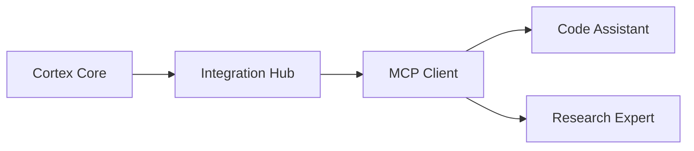

# MCP Integration Usage Guide

This document describes how to use Domain Expert services via the Model Context Protocol (MCP) in Cortex Core.

## Overview

Domain Expert services are specialized AI modules that provide deep expertise in specific domains. They are integrated with Cortex Core using the Model Context Protocol (MCP), a standardized protocol for communication between AI systems.



## Configuration

Domain Expert services are configured in the application settings:

```python
# Environment variables
MCP_ENDPOINT_code_assistant=http://localhost:5001|code
MCP_ENDPOINT_research=http://localhost:5002|research

# Or direct configuration
settings = Settings(
    mcp=McpConfig(
        endpoints=[
            {"name": "code_assistant", "endpoint": "http://localhost:5001", "type": "code"},
            {"name": "research", "endpoint": "http://localhost:5002", "type": "research"}
        ]
    )
)
```

## Basic Usage

```python
from app.components.integration_hub import get_integration_hub

# Get the Integration Hub
hub = get_integration_hub()

# List available experts
experts = await hub.list_experts()
# ['code_assistant', 'research']

# List tools for an expert
tools = await hub.list_expert_tools("code_assistant")
# {'tools': [{'name': 'generate_code', ...}, {'name': 'analyze_code', ...}]}

# Call a tool
result = await hub.invoke_expert_tool(
    expert_name="code_assistant",
    tool_name="generate_code",
    arguments={"prompt": "Write a Python function to calculate Fibonacci numbers"}
)

# Read a resource
resource = await hub.read_expert_resource(
    expert_name="research",
    uri="paper://neural-networks"
)
```

## Error Handling

```python
from app.components.integration_hub import get_integration_hub
from app.exceptions import ServiceError

try:
    hub = get_integration_hub()
    result = await hub.invoke_expert_tool(
        expert_name="code_assistant",
        tool_name="generate_code",
        arguments={"prompt": "Write a Python function to calculate Fibonacci numbers"}
    )
except ValueError as e:
    # Unknown expert or tool
    print(f"Unknown expert or tool: {str(e)}")
except ServiceError as e:
    # Communication error
    print(f"Error communicating with domain expert: {str(e)}")
```

## Health Monitoring

The Integration Hub automatically monitors the health of all registered domain experts. This ensures that unavailable or failing services are properly marked:

```python
# Get all experts with status
hub = get_integration_hub()
expert_status = await hub.get_expert_status()

for name, status in expert_status.items():
    print(f"Expert: {name}")
    print(f"  Available: {status['available']}")
    print(f"  State: {status['state']}")
    if not status['available'] and status['last_error']:
        print(f"  Last Error: {status['last_error']}")
```

## Creating a Domain Expert

See `app/components/mcp/reference_domain_expert.py` for a reference implementation.

1. Create an MCP server using the FastMCP class
2. Define tools using the `@mcp.tool()` decorator
3. Define resources using the `@mcp.resource()` decorator
4. Implement a lifespan manager for proper resource management

Example:

```python
from mcp.server.fastmcp import FastMCP, Context
from contextlib import asynccontextmanager
from dataclasses import dataclass
from typing import Dict, Any, AsyncIterator

@dataclass
class ExpertContext:
    """Strongly-typed context for domain expert"""
    data: Dict[str, Any]

@asynccontextmanager
async def expert_lifespan(server: FastMCP) -> AsyncIterator[ExpertContext]:
    """Manage domain expert lifecycle"""
    print("Starting Domain Expert...")
    
    # Initialize resources
    context = ExpertContext(data={
        "example": {"text": "Example data"}
    })
    
    try:
        yield context
    finally:
        print("Shutting down Domain Expert...")

# Create the MCP server
mcp = FastMCP(
    name="MyExpert",
    description="My domain expert",
    lifespan=expert_lifespan
)

@mcp.tool()
async def my_tool(parameter: str, ctx: Context) -> dict:
    """My tool description"""
    return {
        "content": [
            {
                "type": "text",
                "text": f"Processed: {parameter}"
            }
        ]
    }

if __name__ == "__main__":
    mcp.run(transport="sse")
```

## Advanced Usage

### Progress Reporting

Domain Expert tools can report progress during long-running operations:

```python
@mcp.tool()
async def process_data(items: list, ctx: Context) -> dict:
    """Process a list of items"""
    total = len(items)
    
    for i, item in enumerate(items):
        # Report progress (current, total)
        await ctx.report_progress(i, total)
        
        # Process item
        await asyncio.sleep(0.1)
        
        # Log information
        await ctx.info(f"Processed item {i+1}/{total}")
    
    # Report completion
    await ctx.report_progress(total, total)
    
    return {"result": "Processing complete"}
```

### Resource Templates

Resources can use URI templates to provide dynamic access to data:

```python
@mcp.resource("user://{user_id}/profile")
def get_user_profile(user_id: str) -> dict:
    """Get user profile data"""
    # Access typed context
    ctx = mcp.get_context()
    db = ctx.request_context.lifespan_context.database
    
    # Get user data
    user = db.get_user(user_id)
    
    return {
        "content": [
            {
                "type": "text",
                "text": f"Name: {user.name}\nEmail: {user.email}"
            }
        ]
    }
```

## Circuit Breaking

The Integration Hub implements circuit breaking to handle failures gracefully:

- After 3 consecutive failures, the circuit opens and blocks requests
- After 60 seconds, the circuit enters half-open state to test recovery
- If the test request succeeds, the circuit closes and normal operation resumes

This prevents cascading failures when a domain expert service is experiencing issues. Each domain expert has its own circuit breaker to maintain reliability of the system.