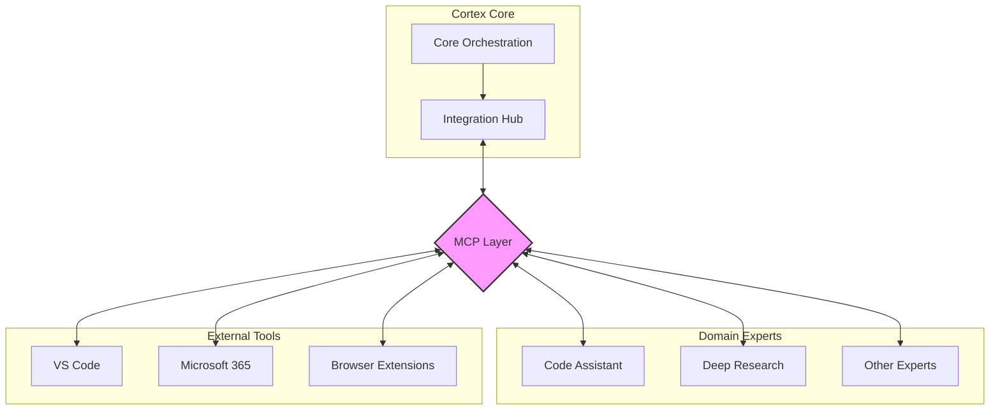

# MCP Integration Guide (Internal Services)

This guide explains how to use the Model Context Protocol (MCP) for internal service-to-service communication in the Cortex Core ecosystem.

> **Important Note:** MCP is NOT used for communication between client applications and Cortex Core. Client applications should use the REST API and Server-Sent Events (SSE) as described in the [Client Integration Guide](./CLIENT_INTEGRATION_GUIDE.md).

## Table of Contents

- [Overview](#overview)
- [MCP in the Cortex Ecosystem](#mcp-in-the-cortex-ecosystem)
- [Setting Up MCP with Python SDK](#setting-up-mcp-with-python-sdk)
- [Implementing MCP for Domain Experts using FastMCP](#implementing-mcp-for-domain-experts-using-fastmcp)
- [Implementing MCP for External Tools](#implementing-mcp-for-external-tools)
- [Security Considerations](#security-considerations)
- [Testing and Debugging](#testing-and-debugging)

## Overview

Model Context Protocol (MCP) is a standardized protocol for communication between AI services, particularly focusing on context sharing and tool invocation. In Cortex Core, we use MCP exclusively for internal communication between the core system and:

- Domain Expert services (Code Assistant, Deep Research, etc.)
- External tool integrations (VS Code, M365 Apps, etc.)
- Specialized AI services

MCP is a critical component of the platform architecture that enables a modular design where specialized domain expertise can be developed and maintained independently from the core system.

The protocol provides a structured way for these services to:

- Share resources and context
- Invoke tools and capabilities
- Manage prompts and templates
- Collect semantic information
- Facilitate communication between specialized components
- Enable extensibility through standardized interfaces

## MCP in the Cortex Ecosystem



In this architecture:

1. The Cortex Core communicates with the Integration Hub
2. The Integration Hub uses MCP to interact with specialized services
3. Domain Experts and External Tools implement MCP endpoints
4. No direct MCP communication occurs between clients and the core system

## Setting Up MCP with Python SDK ✅

### Configuration

MCP endpoints are configured in the Cortex Core's configuration:

```python
# In app/config.py
class McpConfig(BaseSettings):
    """MCP configuration - for internal service-to-service communication only"""

    internal_only: bool = True  # Flag to make it explicit
    endpoints: List[Dict[str, str]] = []

    # ...
```

You can configure MCP endpoints in your `.env` file:

```
# Individual MCP endpoints
MCP_ENDPOINT_CODE_ASSISTANT="http://localhost:5000|code_assistant"
MCP_ENDPOINT_DEEP_RESEARCH="http://localhost:5001|research"
MCP_ENDPOINT_VSCODE="http://localhost:5002|vscode"

# Or using JSON format
MCP_ENDPOINTS='[{"name":"code_assistant","endpoint":"http://localhost:5000","type":"code_assistant"},{"name":"research","endpoint":"http://localhost:5001","type":"research"},{"name":"vscode","endpoint":"http://localhost:5002","type":"vscode"}]'
```

### Using the Python MCP SDK

Cortex uses the official Python MCP SDK for all MCP client/server implementations. This provides a standardized implementation with all the required functionality.

The MCP SDK is included in the project dependencies in pyproject.toml.

#### MCP Client Implementation with Python SDK ✅

The MCP client implementation has been successfully completed, with enhancements over the basic pattern.

The implemented version includes:
- Proper session management with ClientSession
- Type safety improvements
- Circuit breaker pattern for resilient communication
- Comprehensive error handling
- Smart conversion of return values from different formats
- A singleton pattern for system-wide access

```python
# Implementation highlights from app/components/integration_hub.py
class CortexMcpClient:
    """Wrapper for MCP client using the official Python SDK"""

    def __init__(self, endpoint: str, service_name: str):
        self.endpoint = endpoint
        self.service_name = service_name
        self.client: Optional[ClientSession] = None

    async def connect(self) -> None:
        """Connect to the MCP server"""
        if self.client is not None:
            # Already connected
            return
            
        # Create ClientSession and initialize connection
        # ...

    async def list_tools(self) -> Dict[str, Any]:
        """List available tools from the MCP server"""
        # ...
    
    async def call_tool(self, name: str, arguments: Dict[str, Any]) -> Dict[str, Any]:
        """Call a tool on the MCP server"""
        # ...
    
    async def read_resource(self, uri: str) -> Dict[str, Any]:
        """Read a resource from the MCP server"""
        # ...

    async def close(self) -> None:
        """Close the MCP client"""
        # ...
```

#### Integration Hub Implementation ✅

The Integration Hub implementation has been completed, with additional features beyond the basic example:

- Circuit breaker pattern to handle service failures gracefully
- More robust error handling
- Additional utility methods for expert discovery and resource access
- Singleton pattern for consistent, system-wide access

```python
class IntegrationHub:
    """Manages connections to Domain Expert services via MCP"""
    
    def __init__(self) -> None:
        self.settings = settings
        self.clients: Dict[str, CortexMcpClient] = {}
        self.circuit_breakers: Dict[str, CircuitBreaker] = {}
        
    async def startup(self) -> None:
        """Initialize connections to all configured MCP endpoints"""
        # ...
                
    async def shutdown(self) -> None:
        """Close all MCP connections"""
        # ...
    
    async def list_experts(self) -> List[str]:
        """List all available domain experts"""
        # ...
    
    async def list_expert_tools(self, expert_name: str) -> Dict[str, Any]:
        """List all tools available from a specific domain expert"""
        # ...
    
    async def invoke_expert_tool(
        self, expert_name: str, tool_name: str, arguments: Dict[str, Any]
    ) -> Dict[str, Any]:
        """Invoke a tool on a specific domain expert"""
        # ...
    
    async def read_expert_resource(self, expert_name: str, uri: str) -> Dict[str, Any]:
        """Read a resource from a specific domain expert"""
        # ...


# Singleton instance
_integration_hub: Optional[IntegrationHub] = None


def get_integration_hub() -> IntegrationHub:
    """Get the singleton IntegrationHub instance"""
    global _integration_hub
    if _integration_hub is None:
        _integration_hub = IntegrationHub()
    return _integration_hub
```

## Implementing MCP for Domain Experts using FastMCP ⚙️

Domain Expert services should implement MCP servers using the FastMCP API from the Python SDK, which greatly simplifies implementation.

> **PARTIAL IMPLEMENTATION:** A reference implementation exists in `app/components/mcp/reference_domain_expert.py`, demonstrating the basic patterns for creating Domain Expert services. However, specialized Domain Expert services (like Code Assistant, Deep Research) have not been implemented yet in the codebase.

### FastMCP Server Implementation Example

Here's how to implement an MCP server using FastMCP:

```python
from mcp.server.fastmcp import FastMCP
from typing import Dict, Any, List, Optional
import asyncio

# Create the FastMCP server
mcp = FastMCP("Code Assistant Expert")

# Define tools using decorators
@mcp.tool(
    description="Analyze code for patterns and issues",
    schema={
        "type": "object",
        "properties": {
            "code": {"type": "string", "description": "Code to analyze"},
            "language": {"type": "string", "description": "Programming language"}
        },
        "required": ["code"]
    }
)
async def code_analysis(code: str, language: str = "unknown") -> Dict[str, Any]:
    """Analyze code for patterns and issues"""
    # For demonstration - in a real system, this would do actual analysis
    
    # Simulate some processing time
    await asyncio.sleep(1)
    
    return {
        "content": [
            {
                "type": "text",
                "text": f"Analysis of {language} code (length: {len(code)}):\n\n1. Complexity: Medium\n2. Potential issues: None detected\n3. Recommendation: Code looks good!"
            }
        ]
    }

# Define a resource
@mcp.resource("documentation://{topic}")
async def get_documentation(topic: str) -> str:
    """Get documentation for a specific topic"""
    topics = {
        "python": "# Python Documentation\n\nThis is sample Python documentation.",
        "javascript": "# JavaScript Documentation\n\nThis is sample JavaScript documentation."
    }
    
    return topics.get(topic, f"No documentation available for {topic}")

# Define a prompt template
@mcp.prompt()
def code_review_prompt(language: str, code: str) -> str:
    """Create a code review prompt template"""
    return f"""Please review this {language} code:

```{language}
{code}
```

Provide a detailed analysis including:
1. Code quality
2. Potential bugs
3. Performance issues
4. Security concerns
5. Suggestions for improvement
"""

if __name__ == "__main__":
    # Run the server with desired transport (stdio or http)
    # For HTTP server with SSE transport
    mcp.run(transport="sse", host="0.0.0.0", port=5000)
    
    # Alternatively, for standard I/O communication
    # mcp.run(transport="stdio")
```

### Integrating FastMCP with FastAPI

For more complex services, you can integrate FastMCP with FastAPI:

```python
from mcp.server.fastmcp import FastMCP
from fastapi import FastAPI, Request, Response, Depends, HTTPException
import asyncio
from typing import Dict, Any

# Create FastAPI app
app = FastAPI(title="Code Assistant Expert Service")

# Create FastMCP instance
mcp = FastMCP("Code Assistant Expert")

@mcp.tool()
async def code_analysis(code: str, language: str = "unknown") -> Dict[str, Any]:
    """Analyze code for patterns and issues"""
    # Implementation as above
    return {
        "content": [
            {
                "type": "text",
                "text": f"Analysis of {language} code (length: {len(code)}):\n\n1. Complexity: Medium\n2. Potential issues: None detected\n3. Recommendation: Code looks good!"
            }
        ]
    }

# Add MCP endpoint to FastAPI
@app.post("/mcp")
async def handle_mcp_request(request: Request):
    """Endpoint for MCP requests"""
    body = await request.json()
    result = await mcp.handle_request(body)
    return Response(content=result, media_type="application/json")

# Regular FastAPI endpoints for other functions
@app.get("/health")
async def health_check():
    return {"status": "ok"}

if __name__ == "__main__":
    import uvicorn
    uvicorn.run(app, host="0.0.0.0", port=5000)
```

### Using MCP Lifecycle Management

FastMCP supports lifecycle management for resources:

```python
from mcp.server.fastmcp import FastMCP
from contextlib import asynccontextmanager
import aiohttp

@asynccontextmanager
async def lifespan(mcp: FastMCP):
    # Setup code
    session = aiohttp.ClientSession()
    mcp.state.http_session = session
    
    yield  # Server runs here
    
    # Cleanup code
    await session.close()

# Create FastMCP with lifespan
mcp = FastMCP("Code Assistant Expert", lifespan=lifespan)

@mcp.tool()
async def fetch_documentation(url: str) -> str:
    """Fetch documentation from URL"""
    # Use shared HTTP session from state
    async with mcp.state.http_session.get(url) as response:
        return await response.text()
```

## Implementing MCP for External Tools 🔮

External tools like VS Code extensions can also implement MCP to integrate with Cortex Core.

> **PLANNED FEATURE:** This section describes future plans for extending the MCP integration to external tools. The infrastructure for connecting to external tools is in place via the Integration Hub, but no external tool implementations have been created yet.

### Resource Sharing with Python SDK

MCP enables sharing of resources such as files, code snippets, or other content. Using the Python SDK:

```python
# List available resources
resources = await mcp_client.resources_list()

# Read a resource
resource_content = await mcp_client.resources_read(uri="file:///path/to/file.py")

# Subscribe to resource updates (if supported)
resource_sub = await mcp_client.resources_subscribe(
    uri="workspace:///current-file.py", 
    callback=lambda content: print(f"Resource updated: {len(content)} bytes")
)
```

### Tool Invocation with Python SDK

Domain experts can expose tools that can be invoked by Cortex Core:

```python
# List available tools
tools_list = await mcp_client.tools_list()

# Invoke a tool
result = await mcp_client.tools_call(
    name="code_analysis",
    arguments={
        "code": "def hello():\n    print('Hello, world!')",
        "language": "python"
    }
)

# Parse the result
if "content" in result:
    for item in result["content"]:
        if item["type"] == "text":
            print(item["text"])
```

### Implementing VS Code Extension with MCP

For VS Code extensions, you can use the TypeScript SDK, but it follows similar patterns:

```typescript
import { McpServer, McpResource, McpTool } from 'mcp-typescript';
import * as vscode from 'vscode';

// Create resource handlers
const fileResource = new McpResource({
  uriPattern: 'vscode:///file/{path}',
  read: async (params: { path: string }) => {
    // Get content from VS Code
    const uri = vscode.Uri.file(params.path);
    const content = await vscode.workspace.fs.readFile(uri);
    return content.toString();
  }
});

// Create tool handlers
const searchTool = new McpTool({
  name: 'vscode.search',
  description: 'Search files in VS Code',
  schema: {
    type: 'object',
    properties: {
      query: { type: 'string' },
      includePattern: { type: 'string' }
    },
    required: ['query']
  },
  handler: async ({ query, includePattern }) => {
    // Implement search using VS Code API
    const results = await vscode.workspace.findFiles(
      includePattern || '**/*',
      null
    );
    
    return {
      content: [
        {
          type: 'text',
          text: `Found ${results.length} files matching "${query}"`
        }
      ]
    };
  }
});

// Create and start MCP server
const server = new McpServer({
  name: 'VS Code Extension',
  version: '1.0.0'
});

server.registerResource(fileResource);
server.registerTool(searchTool);

export function activate(context: vscode.ExtensionContext) {
  // Start HTTP server for MCP
  const httpServer = server.listen(5002);
  context.subscriptions.push({
    dispose: () => httpServer.close()
  });
}
```

## Security Considerations 🔒

When implementing MCP for internal services:

> **CURRENT STATUS:** Basic authentication is implemented through FastAPI's dependency system. Advanced security measures like API keys and mutual TLS are planned but not yet implemented.

1. **Authentication**:

   - Implement secure authentication between services
   - Use API keys or mutual TLS for service-to-service communication
   - Never expose MCP endpoints publicly

2. **Network Security**:

   - Keep MCP communication within internal networks
   - Use TLS for all communication
   - Implement proper network isolation

3. **Access Control**:

   - Limit tool and resource access based on service identity
   - Validate all inputs thoroughly
   - Implement proper error handling

4. **Logging and Monitoring**:
   - Log all MCP interactions for debugging
   - Monitor for unusual patterns or abuse
   - Implement rate limiting for protection

## Testing and Debugging 🧪

> **CURRENT STATUS:** Comprehensive testing infrastructure for the Integration Hub is implemented with good test coverage in `tests/components/test_integration_hub.py`, but the specialized MCP testing utilities described below have not yet been integrated.

### MCP Testing Utilities

The Python SDK includes the MCP Inspector for testing and debugging MCP integrations:

```bash
# Start the MCP Inspector (already included in dependencies)
python -m mcp.inspector

# Run MCP Inspector
python -m mcp.inspector --port 8080
```

### Testing FastMCP Servers

The FastMCP API includes testing utilities that make testing MCP servers simpler:

```python
import pytest
from mcp.server.fastmcp import FastMCP
from mcp.testing import create_test_client

# Define your FastMCP server
mcp = FastMCP("Test Service")

@mcp.tool()
async def echo(text: str) -> str:
    return f"Echo: {text}"

# Test using the testing client
@pytest.mark.asyncio
async def test_echo_tool():
    # Create a test client for the MCP server
    async with create_test_client(mcp) as client:
        # Call the tool
        result = await client.tools_call(
            name="echo",
            arguments={"text": "Hello, world!"}
        )
        
        # Verify the result
        assert result == "Echo: Hello, world!"
        
        # List available tools
        tools = await client.tools_list()
        assert len(tools["tools"]) == 1
        assert tools["tools"][0]["name"] == "echo"
```

### Integration Testing with FastAPI

For testing FastMCP integrated with FastAPI:

```python
from fastapi.testclient import TestClient
from mcp.testing import create_mcp_request
import json

# Create the FastAPI test client
test_client = TestClient(app)

def test_mcp_endpoint():
    # Create an MCP request
    request_data = create_mcp_request(
        method="tools/call",
        params={
            "name": "code_analysis",
            "arguments": {
                "code": "def test(): pass",
                "language": "python"
            }
        }
    )
    
    # Send to the FastAPI endpoint
    response = test_client.post("/mcp", json=request_data)
    
    # Verify response
    assert response.status_code == 200
    result = response.json()
    assert "result" in result
    assert "content" in result["result"]
```

### Development Mode

FastMCP supports a development mode that provides additional debugging and introspection:

```python
# Run in development mode
mcp.run(transport="sse", host="0.0.0.0", port=5000, dev_mode=True)
```

In development mode, FastMCP provides:
- Additional logging of request/response details
- Automatic schema validation errors with detailed messages
- Introspection endpoints for tools and resources
- Performance metrics for tool execution

Remember, MCP is for internal service-to-service communication only. Client applications should use the REST API and SSE as described in the [Client Integration Guide](./CLIENT_INTEGRATION_GUIDE.md).
