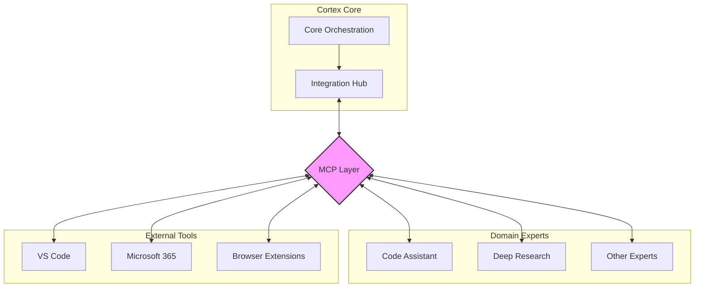

# MCP Integration Guide (Internal Services)

This guide explains how to use the Model Context Protocol (MCP) for internal service-to-service communication in the Cortex Core ecosystem.

> **Important Note:** MCP is NOT used for communication between client applications and Cortex Core. Client applications should use the REST API and Server-Sent Events (SSE) as described in the [Client Integration Guide](./CLIENT_INTEGRATION_GUIDE.md).

## Table of Contents

- [Overview](#overview)
- [MCP in the Cortex Ecosystem](#mcp-in-the-cortex-ecosystem)
- [Setting Up MCP](#setting-up-mcp)
- [Implementing MCP for Domain Experts](#implementing-mcp-for-domain-experts)
- [Implementing MCP for External Tools](#implementing-mcp-for-external-tools)
- [Security Considerations](#security-considerations)
- [Testing and Debugging](#testing-and-debugging)

## Overview

Model Context Protocol (MCP) is a standardized protocol for communication between AI services, particularly focusing on context sharing and tool invocation. In Cortex Core, we use MCP exclusively for internal communication between the core system and:

- Domain Expert services (Code Assistant, Deep Research, etc.)
- External tool integrations (VS Code, M365 Apps, etc.)
- Specialized AI services

MCP provides a structured way for these services to:

- Share resources and context
- Invoke tools and capabilities
- Manage prompts and templates
- Collect semantic information

## MCP in the Cortex Ecosystem



In this architecture:

1. The Cortex Core communicates with the Integration Hub
2. The Integration Hub uses MCP to interact with specialized services
3. Domain Experts and External Tools implement MCP endpoints
4. No direct MCP communication occurs between clients and the core system

## Setting Up MCP

### Configuration

MCP endpoints are configured in the Cortex Core's configuration:

```python
# In app/config.py
class McpConfig(BaseSettings):
    """MCP configuration - for internal service-to-service communication only"""

    internal_only: bool = True  # Flag to make it explicit
    endpoints: List[Dict[str, str]] = []

    # ...
```

You can configure MCP endpoints in your `.env` file:

```
# Individual MCP endpoints
MCP_ENDPOINT_CODE_ASSISTANT="http://localhost:5000|code_assistant"
MCP_ENDPOINT_DEEP_RESEARCH="http://localhost:5001|research"
MCP_ENDPOINT_VSCODE="http://localhost:5002|vscode"

# Or using JSON format
MCP_ENDPOINTS='[{"name":"code_assistant","endpoint":"http://localhost:5000","type":"code_assistant"},{"name":"research","endpoint":"http://localhost:5001","type":"research"},{"name":"vscode","endpoint":"http://localhost:5002","type":"vscode"}]'
```

### Basic MCP Integration

To implement a basic MCP client for internal services:

```python
import aiohttp
import json
import uuid
from typing import Dict, Any, Optional
import logging

logger = logging.getLogger(__name__)

class McpClient:
    """MCP client for internal service communication"""

    def __init__(self, endpoint: str, service_name: str):
        self.endpoint = endpoint
        self.service_name = service_name
        self.session = None
        self.initialized = False

    async def connect(self):
        """Establish connection and initialize MCP session"""
        if self.session is None:
            self.session = aiohttp.ClientSession()

        # Initialize MCP session
        init_payload = {
            "jsonrpc": "2.0",
            "id": str(uuid.uuid4()),
            "method": "initialize",
            "params": {
                "clientInfo": {
                    "name": f"cortex-{self.service_name}",
                    "version": "0.1.0"
                },
                "capabilities": {
                    "resources": {},
                    "tools": {}
                }
            }
        }

        async with self.session.post(self.endpoint, json=init_payload) as response:
            if response.status != 200:
                error_text = await response.text()
                logger.error(f"Failed to initialize MCP: {error_text}")
                raise Exception(f"MCP initialization failed: {response.status}")

            init_response = await response.json()

            if "error" in init_response:
                logger.error(f"MCP initialization error: {init_response['error']}")
                raise Exception(f"MCP initialization error: {init_response['error']['message']}")

            self.initialized = True

            # Send initialized notification
            init_notification = {
                "jsonrpc": "2.0",
                "method": "initialized",
                "params": {}
            }

            await self.session.post(self.endpoint, json=init_notification)

            return init_response

    async def request(self, method: str, params: Optional[Dict[str, Any]] = None) -> Dict[str, Any]:
        """Send request to MCP server"""
        if not self.initialized:
            await self.connect()

        request_id = str(uuid.uuid4())
        payload = {
            "jsonrpc": "2.0",
            "id": request_id,
            "method": method,
            "params": params or {}
        }

        async with self.session.post(self.endpoint, json=payload) as response:
            if response.status != 200:
                error_text = await response.text()
                logger.error(f"MCP request failed: {error_text}")
                raise Exception(f"MCP request failed: {response.status}")

            result = await response.json()

            if "error" in result:
                logger.error(f"MCP error: {result['error']}")
                raise Exception(f"MCP error: {result['error']['message']}")

            return result["result"]

    async def send_notification(self, method: str, params: Optional[Dict[str, Any]] = None):
        """Send notification to MCP server (no response expected)"""
        if not self.initialized:
            await self.connect()

        payload = {
            "jsonrpc": "2.0",
            "method": method,
            "params": params or {}
        }

        await self.session.post(self.endpoint, json=payload)

    async def close(self):
        """Close the MCP session"""
        if self.session:
            # Send shutdown request
            try:
                await self.request("shutdown", {})
            except Exception as e:
                logger.warning(f"Error during MCP shutdown: {e}")

            # Send exit notification
            try:
                await self.send_notification("exit")
            except Exception as e:
                logger.warning(f"Error during MCP exit: {e}")

            # Close session
            await self.session.close()
            self.session = None
            self.initialized = False
```

## Implementing MCP for Domain Experts

Domain Expert services should implement the MCP server protocol to receive requests from Cortex Core.

### Server Implementation Example

Here's a basic example of an MCP server for a domain expert:

```python
from fastapi import FastAPI, Request, Response
import json
import uuid
from typing import Dict, Any, List, Optional
import asyncio

app = FastAPI()

# In-memory storage for simplicity (use a proper database in production)
active_sessions = {}
available_tools = {
    "code_analysis": {
        "name": "code_analysis",
        "description": "Analyze code for patterns and issues",
        "inputSchema": {
            "type": "object",
            "properties": {
                "code": {"type": "string"},
                "language": {"type": "string"}
            },
            "required": ["code"]
        }
    }
}

@app.post("/")
async def handle_mcp_request(request: Request):
    """Handle incoming MCP requests"""
    try:
        # Parse JSON-RPC request
        data = await request.json()

        # Handle method
        if "method" in data:
            method = data["method"]
            params = data.get("params", {})

            # Check if it's a request (has ID) or notification
            if "id" in data:
                # It's a request
                request_id = data["id"]

                if method == "initialize":
                    result = handle_initialize(params, request_id)
                elif method == "tools/list":
                    result = handle_list_tools()
                elif method == "tools/call":
                    result = await handle_call_tool(params)
                elif method == "shutdown":
                    result = {}
                else:
                    return create_error_response(request_id, -32601, f"Method not found: {method}")

                return create_success_response(request_id, result)
            else:
                # It's a notification
                if method == "initialized":
                    # Nothing to do
                    pass
                elif method == "exit":
                    # Cleanup
                    pass

                # Notifications don't need a response
                return Response(status_code=204)
        else:
            return Response(status_code=400, content=json.dumps({"error": "Invalid JSON-RPC message"}))
    except Exception as e:
        # Internal error
        if "id" in data:
            return create_error_response(data["id"], -32603, f"Internal error: {str(e)}")
        else:
            return Response(status_code=500, content=json.dumps({"error": str(e)}))

def handle_initialize(params: Dict[str, Any], request_id: str) -> Dict[str, Any]:
    """Handle initialize request"""
    # Create a new session
    session_id = str(uuid.uuid4())
    active_sessions[session_id] = {
        "client_info": params.get("clientInfo", {}),
        "capabilities": params.get("capabilities", {})
    }

    # Return server capabilities
    return {
        "serverInfo": {
            "name": "code-assistant-expert",
            "version": "0.1.0"
        },
        "capabilities": {
            "tools": {}
        }
    }

def handle_list_tools() -> Dict[str, Any]:
    """Handle tools/list request"""
    return {
        "tools": list(available_tools.values())
    }

async def handle_call_tool(params: Dict[str, Any]) -> Dict[str, Any]:
    """Handle tools/call request"""
    tool_name = params.get("name")
    arguments = params.get("arguments", {})

    if tool_name not in available_tools:
        raise Exception(f"Tool not found: {tool_name}")

    if tool_name == "code_analysis":
        # For demonstration - in a real system, this would do actual analysis
        code = arguments.get("code", "")
        language = arguments.get("language", "unknown")

        # Simulate some processing time
        await asyncio.sleep(1)

        return {
            "content": [
                {
                    "type": "text",
                    "text": f"Analysis of {language} code (length: {len(code)}):\n\n1. Complexity: Medium\n2. Potential issues: None detected\n3. Recommendation: Code looks good!"
                }
            ]
        }

    # If we get here, tool exists but is not implemented
    raise Exception(f"Tool implementation not found: {tool_name}")

def create_success_response(request_id: str, result: Dict[str, Any]) -> Response:
    """Create a success response"""
    return Response(
        content=json.dumps({
            "jsonrpc": "2.0",
            "id": request_id,
            "result": result
        }),
        media_type="application/json"
    )

def create_error_response(request_id: str, code: int, message: str, data: Optional[Any] = None) -> Response:
    """Create an error response"""
    error = {
        "code": code,
        "message": message
    }

    if data is not None:
        error["data"] = data

    return Response(
        content=json.dumps({
            "jsonrpc": "2.0",
            "id": request_id,
            "error": error
        }),
        media_type="application/json"
    )

if __name__ == "__main__":
    import uvicorn
    uvicorn.run(app, host="0.0.0.0", port=5000)
```

## Implementing MCP for External Tools

External tools like VS Code extensions can also implement MCP to integrate with Cortex Core.

### Resource Sharing

MCP enables sharing of resources such as files, code snippets, or other content:

```python
# Example of listing resources
resources = await mcp_client.request("resources/list")

# Example of reading a resource
resource_content = await mcp_client.request("resources/read", {
    "uri": "file:///path/to/file.py"
})
```

### Tool Invocation

Domain experts can expose tools that can be invoked by Cortex Core:

```python
# List available tools
tools = await mcp_client.request("tools/list")

# Invoke a tool
result = await mcp_client.request("tools/call", {
    "name": "code_analysis",
    "arguments": {
        "code": "def hello():\n    print('Hello, world!')",
        "language": "python"
    }
})
```

## Security Considerations

When implementing MCP for internal services:

1. **Authentication**:

   - Implement secure authentication between services
   - Use API keys or mutual TLS for service-to-service communication
   - Never expose MCP endpoints publicly

2. **Network Security**:

   - Keep MCP communication within internal networks
   - Use TLS for all communication
   - Implement proper network isolation

3. **Access Control**:

   - Limit tool and resource access based on service identity
   - Validate all inputs thoroughly
   - Implement proper error handling

4. **Logging and Monitoring**:
   - Log all MCP interactions for debugging
   - Monitor for unusual patterns or abuse
   - Implement rate limiting for protection

## Testing and Debugging

### MCP Testing Utilities

You can use the MCP Inspector for testing and debugging MCP integrations:

```bash
# Install MCP Inspector
pip install mcp-inspector

# Run MCP Inspector
mcp-inspector --port 8080
```

### Testing MCP Servers

To test an MCP server implementation:

```python
import asyncio
from mcp_client import McpClient

async def test_mcp_server():
    client = McpClient("http://localhost:5000", "test-client")

    try:
        # Initialize connection
        init_result = await client.connect()
        print(f"Initialization result: {init_result}")

        # List tools
        tools = await client.request("tools/list")
        print(f"Available tools: {tools}")

        # Call a tool
        result = await client.request("tools/call", {
            "name": "code_analysis",
            "arguments": {
                "code": "def test(): pass",
                "language": "python"
            }
        })
        print(f"Tool result: {result}")
    finally:
        # Close connection
        await client.close()

asyncio.run(test_mcp_server())
```

Remember, MCP is for internal service-to-service communication only. Client applications should use the REST API and SSE as described in the [Client Integration Guide](./CLIENT_INTEGRATION_GUIDE.md).
