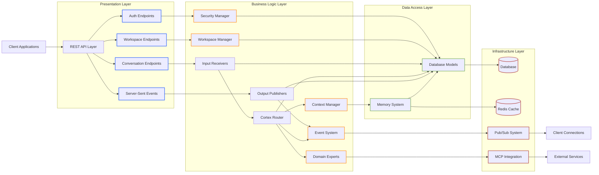

# Cortex Core Overview

Cortex Core is the central orchestration engine of the Cortex Platform, providing a unified system for managing user workspaces, conversations, and real-time interactions. This document serves as the master reference for understanding the system architecture, components, and design philosophy.

## System Purpose

Cortex Core serves as the backbone of the Cortex Platform with the following primary responsibilities:

1. **User Management** - Authentication, authorization, and user session handling
2. **Workspace Organization** - Logical grouping of conversations and memory items 
3. **Conversation Handling** - Structured management of messages across different modalities
4. **Memory Management** - Persistence of context and knowledge across interactions
5. **Real-time Communication** - Server-Sent Events for immediate client updates
6. **Extensibility** - Support for Domain Experts and external integrations

## Architectural Design

Cortex Core follows a layered architecture with clear separation of concerns:



### Key Architectural Patterns

- **Domain-Driven Design** - Core domain concepts reflected in model structures
- **CQRS Principles** - Separation of read and write operations
- **Event-Driven Architecture** - Decoupled communication via message bus and Server-Sent Events
- **Interface-Based Design** - Clear contracts for extensible components
- **Repository Pattern** - Data access abstraction through ORM
- **Asynchronous Programming** - Leveraging FastAPI's async support and SQLAlchemy's async capabilities
- **Input/Output Decoupling** - Complete separation of input reception and output production

### Layered Architecture

The system employs a four-tier layered architecture:

1. **Presentation Layer**: FastAPI routes and endpoints
2. **Business Logic Layer**: Components and services
3. **Data Access Layer**: Database models and connection management
4. **Infrastructure Layer**: Caching, security, and external communication

## Codebase Structure

The Cortex Core codebase follows a modular structure organized around key functionality areas:

```
cortex-core/
├── alembic/                # Database migration scripts
├── app/                    # Main application code
│   ├── api/                # API endpoints and route handlers
│   ├── cache/              # Caching functionality (Redis with in-memory fallback)
│   ├── components/         # Core system components and utilities
│   ├── database/           # Database models and connection management
│   ├── interfaces/         # Abstract interfaces defining system contracts
│   ├── modalities/         # Handling of different interaction modalities
│   └── utils/              # Utility functions and helpers
├── docs/                   # Documentation files
└── tests/                  # Test suite
```

### Key Files

- **app/main.py**: Entry point for the FastAPI application
- **app/config.py**: Configuration management using Pydantic
- **app/api/*.py**: API endpoint implementations
- **app/database/models.py**: SQLAlchemy models defining the database schema
- **app/interfaces/router.py**: Core interfaces for the messaging architecture
- **app/components/cortex_router.py**: Implementation of the Cortex Router
- **app/components/event_system.py**: Event system for decoupled communication
- **app/components/conversation_channels.py**: Input/output channel implementations
- **app/components/security_manager.py**: Authentication and encryption
- **app/interfaces/memory_system.py**: Memory system interface definition

## System Components

The system is composed of the following key components:

| Component | Responsibility | Implementation |
|-----------|----------------|----------------|
| Security Manager | Authentication and encryption | JWT tokens, Fernet encryption |
| Workspace Manager | Organization of user workspaces | SQLAlchemy models, CRUD operations |
| Input Receivers | Accept and forward inputs | Channel-specific implementations |
| Cortex Router | Process inputs and determine responses | Asynchronous queue-based processor |
| Output Publishers | Deliver messages to channels | Event-driven delivery mechanisms |
| Event System | Decoupled component communication | Pattern-based publish/subscribe |
| Context Manager | Context retrieval and updates | Memory system interface |
| Memory System | Knowledge persistence | Pluggable interface |
| Integration Hub | External service communication | MCP client/server |

### Key Component Details

#### FastAPI Application (app/main.py)
- Central entry point for the application
- Configures middleware, CORS settings, and error handling
- Registers routers and defines the application lifespan

#### Configuration Management (app/config.py)
- Defines settings for all system components
- Uses Pydantic for validation and environment variable overrides
- Separates concerns into domain-specific configuration classes

#### Security Manager
- Handles authentication and authorization
- Manages token generation and verification
- Provides encryption/decryption for sensitive data

#### Database Management
- Models define the data schema
- Connection management with automatic migrations
- Session handling and transaction support

See [COMPONENTS.md](COMPONENTS.md) for detailed component documentation.

## Data Flow

### Request Processing Flow

1. Client sends request to FastAPI endpoint
2. Authentication middleware validates JWT token
3. Request is routed to appropriate handler
4. Handler performs business logic, accessing database as needed
5. Response is formatted and returned to client
6. Events are generated for real-time updates

### Conversation Flow

1. User creates or selects a workspace
2. User creates a conversation within the workspace
3. User sends messages to the conversation via an Input Receiver
4. Message is stored in the database
5. Input Receiver forwards the message to the Cortex Router
6. Router processes the message asynchronously
7. If the Router decides to respond, it sends message(s) via the Event System
8. Output Publishers receive the message(s) and deliver them to appropriate channels
9. Real-time updates notify connected clients
10. Context is updated in the memory system

## API Structure

The API is organized into logical groupings:

### Authentication (/auth)
- `POST /auth/login`: Authenticate user and return JWT token
- `POST /auth/refresh`: Refresh an authentication token
- `POST /auth/logout`: Log out and invalidate token
- `POST /auth/key/generate`: Generate an API key

### Workspaces (/workspaces)
- `GET /workspaces`: List workspaces for current user
- `POST /workspaces`: Create a new workspace

### Conversations
- `GET /workspaces/{workspace_id}/conversations`: List conversations in a workspace
- `POST /workspaces/{workspace_id}/conversations`: Create a new conversation
- `GET /conversations/{conversation_id}`: Get conversation details
- `POST /conversations/{conversation_id}/messages`: Add a message to a conversation
- `POST /conversations/{conversation_id}/messages/stream`: Stream message responses

### Server-Sent Events
- `GET /v1/global/global`: Global events endpoint
- `GET /v1/user/{user_id}`: User-specific events
- `GET /v1/workspace/{workspace_id}`: Workspace-specific events
- `GET /v1/conversation/{conversation_id}`: Conversation-specific events

See [API_REFERENCE.md](API_REFERENCE.md) for complete API documentation.

## Authentication Flow

1. **User Authentication**:
   - User submits credentials via `/auth/login`
   - System validates credentials and generates JWT token
   - Token contains user_id and is signed with JWT secret

2. **Token Usage**:
   - Client includes token in Authorization header
   - `get_current_user` dependency validates token for protected endpoints
   - Token expiry is managed via expiration claims

3. **API Key Authentication**:
   - Alternative to password auth for programmatic access
   - Keys are securely stored with encryption
   - Keys have configurable expiry and scopes

## Database Schema

The database schema is defined in `app/database/models.py` and includes the following key entities:

- **User**: Application users with authentication details
- **Role**: User roles for authorization
- **Session**: User sessions for tracking active connections
- **ApiKey**: API keys for programmatic access
- **Workspace**: User workspaces for organizing conversations
- **WorkspaceSharing**: Workspace sharing permissions between users
- **Conversation**: Conversations with messages
- **MemoryItem**: Items stored in the memory system
- **Integration**: External system integrations
- **DomainExpertTask**: Tasks for domain-specific processing

Key relationships:
- Users have many workspaces (one-to-many)
- Workspaces have many conversations (one-to-many)
- Users can have multiple roles (many-to-many)
- Workspaces can be shared with multiple users (many-to-many via WorkspaceSharing)

## Messaging Architecture

The Cortex messaging architecture is designed for maximum flexibility and decoupling:

### Input/Output Decoupling

- **Complete Separation**: Input channels and output channels have no direct connection
- **Asynchronous Processing**: Messages are processed in an asynchronous queue
- **Event-Driven Communication**: Components communicate via the Event System
- **Autonomous Routing**: The Cortex Router has complete autonomy over handling inputs

### Message Flow

1. **Input Reception**:
   - Input Receivers accept messages from specific channels (conversation, voice, etc.)
   - Messages are stored in the database and forwarded to the Router
   - Input Receivers complete their work immediately with no expectation of response

2. **Message Processing**:
   - The Router receives messages in an asynchronous queue
   - Each message is analyzed and a routing decision is made
   - Processing can involve memory retrieval, domain expert consultation, etc.
   - The Router can choose to respond immediately, later, or not at all

3. **Output Delivery**:
   - When the Router decides to send a message, it publishes an event
   - Output Publishers subscribe to events for their specific channels
   - Publishers receive events and deliver messages to their channels
   - Delivery includes database storage and client notification

### Key Benefits

- **Flexibility**: Messages can be routed to any output channel, not just the source
- **Autonomy**: The Router can make complex decisions about if/when/how to respond
- **Scalability**: Components can be scaled independently
- **Extensibility**: New input/output channels can be added without changing the core

## Memory System

The memory system provides an abstraction for storing and retrieving contextual information:

- **Interface-Based** - Pluggable implementation (Whiteboard, JAKE)
- **Content-Agnostic** - Supports various data types
- **Query-Capable** - Flexible retrieval of stored items
- **Retention-Aware** - Time-based expiration of items

See [MEMORY_SYSTEM.md](MEMORY_SYSTEM.md) for detailed memory system documentation.

## Caching Strategy

The caching system uses Redis with an in-memory fallback mechanism:

1. **Redis Primary Cache**:
   - Used when available for distributed caching
   - Handles all standard operations (get, set, expire, etc.)

2. **In-Memory Fallback**:
   - Activates automatically when Redis is unavailable
   - Implements same interface for transparent usage
   - Background thread manages TTL expirations

3. **Cache Usage**:
   - Session state
   - Authentication tokens
   - Frequently accessed data
   - Rate limiting implementation

## Event System

The Event System in Cortex Core consists of two main parts: the internal event bus and the Server-Sent Events (SSE) for client communication.

### Internal Event Bus

The internal event system provides a decoupled communication mechanism between components:

1. **Standardized Event Structure**:
   - Each event has a consistent payload format including type, data, source, timestamp, and tracing IDs
   - Events follow a hierarchical naming convention: `{domain}.{entity}.{action}`

2. **Advanced Features**:
   - **Event Tracing**: Track event chains across components using trace IDs
   - **Event Correlation**: Link related events with correlation IDs
   - **Pattern Matching**: Subscribe to events using flexible wildcard patterns
   - **Error Isolation**: Errors in one subscriber don't affect others

3. **Monitoring**:
   - Comprehensive statistics through the `/monitoring/events/stats` endpoint
   - Tracks events published, delivered, subscriber count, event types, errors, and more

### Server-Sent Events (SSE)

The SSE system provides real-time updates to clients:

1. **Connection Management**:
   - Connections are tracked in memory by channel type
   - Channels include global, user-specific, workspace-specific, and conversation-specific

2. **Event Broadcasting**:
   - Events are sent to specific channels
   - Clients subscribe to channels relevant to their context
   - Heartbeats maintain connections

3. **Event Types**:
   - `connect`: Initial connection established
   - `heartbeat`: Keep-alive signal
   - `conversation_created`: New conversation created
   - `conversation_updated`: Conversation details changed
   - `message_received`: New message in conversation
   - `typing_indicator`: User/assistant typing status

## Integration Points

Cortex Core provides several integration points:

1. **REST API** - Primary programmatic interface
2. **Server-Sent Events** - Real-time updates
3. **Streaming API** - Message streaming
4. **MCP Interface** - Model Context Protocol connectivity
5. **Memory System Interface** - Custom memory implementations
6. **Domain Expert Interface** - Specialized processing entities

Future integration points:
- LLM service integration
- MSAL (Microsoft Authentication Library) integration

## Development and Extension

Cortex Core is designed for extensibility:

- **Custom Memory Systems** - Implement the `MemorySystemInterface`
- **Domain Experts** - Implement the `DomainExpertInterface`
- **Event Handlers** - Subscribe to specific event channels
- **Authentication Methods** - Add new authentication providers

See [DEVELOPMENT.md](DEVELOPMENT.md) for developer documentation.

## Configuration

The system is highly configurable through:

- **Environment Variables** - Override default settings
- **.env Files** - Environment-specific configuration
- **Hierarchical Settings** - Structured configuration model

Configuration is managed using Pydantic's `BaseSettings` in `app/config.py`, with nested configuration classes for different system areas:

- **DatabaseConfig**: Database connection settings
- **CacheConfig**: Redis configuration
- **SecurityConfig**: JWT secrets, encryption keys, token expiry
- **ServerConfig**: Host, port, logging settings
- **MemoryConfig**: Memory system type and retention settings
- **SseConfig**: Server-Sent Events configuration

See [CONFIGURATION.md](CONFIGURATION.md) for detailed configuration documentation.

## Related Documentation

- [MEMORY_SYSTEM.md](MEMORY_SYSTEM.md) - Memory system architecture and implementations
- [ERROR_HANDLING.md](ERROR_HANDLING.md) - Error handling patterns and practices 
- [API_REFERENCE.md](API_REFERENCE.md) - API endpoint documentation
- [CLIENT_INTEGRATION_GUIDE.md](CLIENT_INTEGRATION_GUIDE.md) - Client integration guidance
- [COMPONENTS.md](COMPONENTS.md) - Component interface documentation
- [DEVELOPMENT.md](DEVELOPMENT.md) - Developer guidelines
- [MCP_INTERNAL_GUIDE.md](MCP_INTERNAL_GUIDE.md) - MCP integration details

