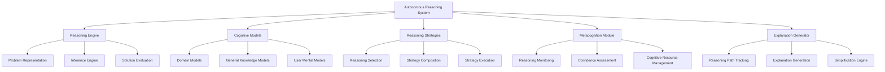

# Cortex Autonomous Reasoning System

_Version: 1.0_  
_Date: March 5, 2025_

## Overview

The Cortex Autonomous Reasoning System provides the platform with advanced cognitive capabilities, enabling it to understand complex problems, make informed decisions, and generate creative solutions. This system extends beyond simple pattern matching to true reasoning across domains, leveraging multiple reasoning strategies and maintaining awareness of its own cognitive processes.

## Core Concepts

### Reasoning Model

The Autonomous Reasoning System is built around these foundational concepts:

1. **Multi-strategy Reasoning**: Application of diverse reasoning approaches based on context
2. **Self-monitoring**: Awareness and evaluation of reasoning processes
3. **Knowledge Integration**: Seamless incorporation of memory and domain knowledge
4. **Adaptive Reasoning**: Dynamic adjustment of cognitive strategies based on task requirements
5. **Explainable Processes**: Transparent reasoning paths that can be articulated and analyzed

### Reasoning Types

The system implements several complementary reasoning types:

1. **Deductive Reasoning**: Drawing logical conclusions from known premises
2. **Inductive Reasoning**: Forming generalizations from specific observations
3. **Abductive Reasoning**: Determining likely explanations from incomplete information
4. **Analogical Reasoning**: Applying knowledge from familiar domains to new contexts
5. **Causal Reasoning**: Understanding cause-effect relationships
6. **Spatial Reasoning**: Processing relationships in physical or conceptual space
7. **Temporal Reasoning**: Analyzing sequences, durations, and time-based patterns
8. **Probabilistic Reasoning**: Handling uncertainty and likelihood

## System Architecture

### High-Level Architecture

### Core Components

#### Reasoning Engine

The Reasoning Engine processes problems and generates solutions:

- Problem modeling and representation
- Application of inference rules and patterns
- Solution construction and validation
- Consistency verification
- Alternative solution generation

#### Cognitive Models

Cognitive Models provide structured knowledge representations:

- Domain-specific mental models
- General knowledge frameworks
- User-specific mental models
- Contextual understanding models
- Conceptual relationship maps

#### Reasoning Strategies

Reasoning Strategies manage cognitive approaches:

- Strategy selection based on problem characteristics
- Composition of multi-strategy approaches
- Execution of reasoning workflows
- Strategy effectiveness assessment
- Novel strategy development

#### Metacognition Module

The Metacognition Module provides self-awareness:

- Monitoring of reasoning processes
- Assessment of solution confidence
- Detection of reasoning failures
- Cognitive resource allocation
- Learning from reasoning experiences

#### Explanation Generator

The Explanation Generator creates understandable explanations:

- Capturing reasoning paths and decision points
- Converting reasoning steps to natural language
- Adjusting explanation detail based on audience
- Highlighting key insights and factors
- Visualization of reasoning processes

## Reasoning Process

### Problem Understanding

The initial phase of reasoning:

1. **Problem Intake**: Receiving and parsing the problem statement
2. **Knowledge Activation**: Retrieving relevant knowledge from memory
3. **Problem Modeling**: Creating a formal representation of the problem
4. **Context Integration**: Incorporating situational and user context
5. **Goal Identification**: Establishing clear objectives for the solution

### Strategy Selection

Determining the appropriate reasoning approach:

1. **Problem Analysis**: Assessing problem characteristics and requirements
2. **Strategy Evaluation**: Comparing strategy suitability for the problem
3. **Resource Assessment**: Considering available cognitive resources
4. **Success Prediction**: Estimating likelihood of strategy success
5. **Strategy Decision**: Selecting optimal strategy or combination

### Reasoning Execution

Applying selected reasoning strategies:

1. **Knowledge Application**: Utilizing relevant knowledge
2. **Inference Generation**: Creating logical connections and conclusions
3. **Hypothesis Formation**: Developing potential explanations or solutions
4. **Constraint Handling**: Managing limitations and requirements
5. **Incremental Refinement**: Progressive improvement of solutions

### Solution Evaluation

Assessing reasoning outcomes:

1. **Correctness Verification**: Checking logical validity
2. **Completeness Assessment**: Ensuring all aspects are addressed
3. **Consistency Checking**: Verifying internal coherence
4. **Confidence Calculation**: Determining solution reliability
5. **Alternative Comparison**: Evaluating multiple solution candidates

### Explanation Formulation

Creating understandable justifications:

1. **Path Reconstruction**: Recreating the reasoning process
2. **Key Point Identification**: Highlighting critical factors
3. **Simplification**: Reducing complexity while maintaining accuracy
4. **Personalization**: Tailoring explanation to the audience
5. **Format Selection**: Choosing optimal presentation methods

## Integration with Core AI

### Memory Integration

Connection with the JAKE Memory System:

1. **Knowledge Retrieval**: Accessing relevant facts and concepts
2. **Context Incorporation**: Utilizing interaction history and user knowledge
3. **Solution Storage**: Recording reasoning outcomes for future reference
4. **Pattern Learning**: Identifying successful reasoning patterns
5. **Failure Memory**: Learning from unsuccessful reasoning attempts

### Task Integration

Relationship with the Task Orchestration system:

1. **Task Analysis**: Understanding requirements for reasoning
2. **Subtask Generation**: Creating reasoning-focused subtasks
3. **Progress Reporting**: Providing status of reasoning processes
4. **Resource Requests**: Requesting additional information when needed
5. **Result Delivery**: Providing reasoning outcomes to the task system

### Domain Expert Integration

Interaction with specialized Domain Experts:

1. **Expertise Consultation**: Requesting specialized knowledge
2. **Domain Delegation**: Transferring specific reasoning tasks
3. **Solution Validation**: Verifying outcomes with domain experts
4. **Knowledge Integration**: Incorporating expert insights
5. **Collaborative Reasoning**: Shared reasoning across experts

## Specialized Reasoning Capabilities

### Creative Reasoning

Capabilities for generating novel solutions:

1. **Conceptual Blending**: Combining disparate ideas
2. **Constraint Relaxation**: Exploring beyond typical boundaries
3. **Analogical Transfer**: Applying solutions from different domains
4. **Divergent Exploration**: Generating multiple alternative approaches
5. **Convergent Refinement**: Focusing and optimizing creative concepts

### Ethical Reasoning

Capabilities for moral and ethical consideration:

1. **Value Recognition**: Identifying ethical dimensions
2. **Stakeholder Analysis**: Considering impacts on different parties
3. **Principle Application**: Applying ethical frameworks
4. **Trade-off Evaluation**: Assessing competing ethical considerations
5. **Moral Consistency**: Ensuring alignment with established values

### Scientific Reasoning

Capabilities for empirical and theoretical analysis:

1. **Hypothesis Formation**: Developing testable predictions
2. **Evidence Evaluation**: Assessing data relevance and quality
3. **Model Development**: Creating explanatory frameworks
4. **Experimental Design**: Structuring tests of hypotheses
5. **Theory Refinement**: Updating models based on evidence

### Strategic Reasoning

Capabilities for long-term and competitive planning:

1. **Goal Hierarchy**: Organizing objectives by importance
2. **Scenario Projection**: Forecasting potential futures
3. **Risk Assessment**: Evaluating potential negative outcomes
4. **Opportunity Identification**: Recognizing advantageous possibilities
5. **Resource Optimization**: Allocating resources effectively

## Implementation Guidelines

### Reasoning Implementation

Approaches for implementing reasoning capabilities:

1. **Symbolic Methods**: Rule-based and logical systems
2. **Neural Approaches**: Deep learning for pattern recognition
3. **Probabilistic Models**: Bayesian and statistical reasoning
4. **Hybrid Systems**: Combinations of multiple approaches
5. **Evolutionary Methods**: Solution development through iterative improvement

### Model Training

Methods for developing reasoning models:

1. **Supervised Learning**: Training from example problems and solutions
2. **Reinforcement Learning**: Improving through outcome feedback
3. **Transfer Learning**: Adapting existing models to new domains
4. **Few-shot Learning**: Learning from minimal examples
5. **Curriculum Learning**: Progressive training on increasingly complex problems

### Performance Optimization

Strategies for efficient reasoning:

1. **Attention Mechanisms**: Focusing on relevant information
2. **Memory Optimization**: Efficient knowledge access
3. **Reasoning Shortcuts**: Heuristics for common patterns
4. **Incremental Processing**: Progressive solution development
5. **Computation Distribution**: Parallel reasoning processes

## Development Guidelines

### Extending Reasoning Capabilities

Guidelines for adding new reasoning abilities:

1. **Capability Definition**: Clear specification of new reasoning type
2. **Knowledge Requirements**: Identification of necessary knowledge
3. **Integration Points**: Connection with existing reasoning capabilities
4. **Evaluation Criteria**: Metrics for assessing performance
5. **Training Approach**: Method for developing the capability

### Best Practices

Recommendations for reasoning system development:

1. **Multi-strategy Design**: Support for diverse reasoning approaches
2. **Explanation First**: Built-in explanation capabilities from the start
3. **Failure Recovery**: Graceful handling of reasoning dead-ends
4. **Bounded Rationality**: Appropriate resource allocation
5. **Continuous Evaluation**: Ongoing assessment of reasoning quality

## Evaluation Framework

### Quality Metrics

Methods for assessing reasoning performance:

1. **Accuracy**: Correctness of conclusions
2. **Coherence**: Logical consistency of reasoning
3. **Completeness**: Comprehensive consideration of factors
4. **Efficiency**: Resource usage for reaching conclusions
5. **Adaptability**: Performance across diverse problems
6. **Explainability**: Clarity of reasoning explanations

### Testing Approaches

Techniques for validating reasoning capabilities:

1. **Benchmark Problems**: Standard test cases
2. **Adversarial Testing**: Deliberately challenging problems
3. **User Studies**: Human evaluation of reasoning quality
4. **Cross-domain Validation**: Testing across knowledge areas
5. **Longitudinal Assessment**: Evaluation over time

## Security and Ethical Considerations

### Security Aspects

Protecting the reasoning system:

1. **Reasoning Manipulation**: Prevention of adversarial inputs
2. **Bias Detection**: Identification of skewed reasoning
3. **Confidence Validation**: Verification of certainty estimates
4. **Source Verification**: Validation of knowledge provenance
5. **Access Controls**: Limitations on reasoning capabilities

### Ethical Guidelines

Ensuring responsible reasoning:

1. **Fairness Enforcement**: Prevention of discriminatory reasoning
2. **Transparency Requirements**: Clear explanation of reasoning processes
3. **Oversight Mechanisms**: Human review of critical reasoning
4. **Limitation Awareness**: Recognition of reasoning boundaries
5. **Impact Assessment**: Evaluation of reasoning consequences

## Future Directions

### Advanced Capabilities

Emerging reasoning areas:

1. **Meta-reasoning**: Reasoning about reasoning processes
2. **Counterfactual Reasoning**: Exploring alternative scenarios
3. **Collective Reasoning**: Distributed reasoning across agents
4. **Quantum-inspired Reasoning**: Novel computational approaches
5. **Embodied Reasoning**: Integration with physical context

### Research Opportunities

Areas for continued development:

1. **Reasoning Transfer**: Applying reasoning across domains
2. **Reasoning Efficiency**: More resource-effective approaches
3. **Uncertainty Management**: Better handling of incomplete information
4. **Creative Reasoning**: Enhanced novel solution generation
5. **Human-AI Collaborative Reasoning**: Joint problem-solving

## Conclusion

The Autonomous Reasoning System is a cornerstone of the Cortex Platform's intelligence, enabling it to tackle complex problems with human-like understanding while maintaining machine-like consistency and scalability. By combining multiple reasoning strategies, maintaining metacognitive awareness, and providing clear explanations, the system delivers capabilities that go beyond pattern matching to true understanding and problem-solving.

This reasoning architecture seamlessly integrates with the platform's memory, task, and domain expert systems to create a cohesive intelligence that can address diverse challenges across domains. As the platform evolves, the reasoning system will continue to advance, incorporating new reasoning strategies, improving efficiency, and expanding into emerging cognitive domains.
