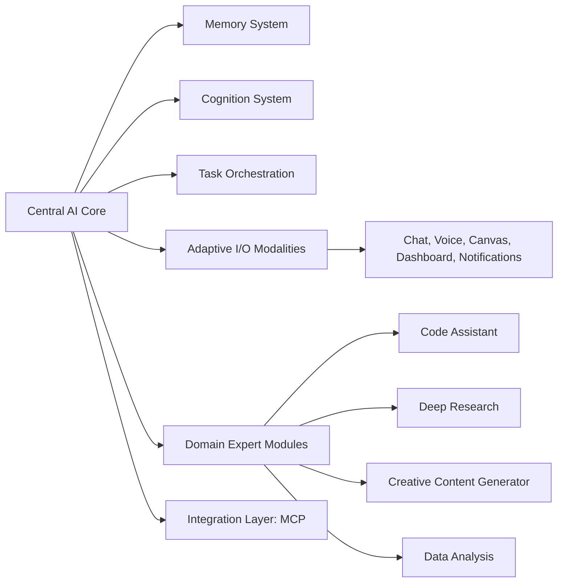
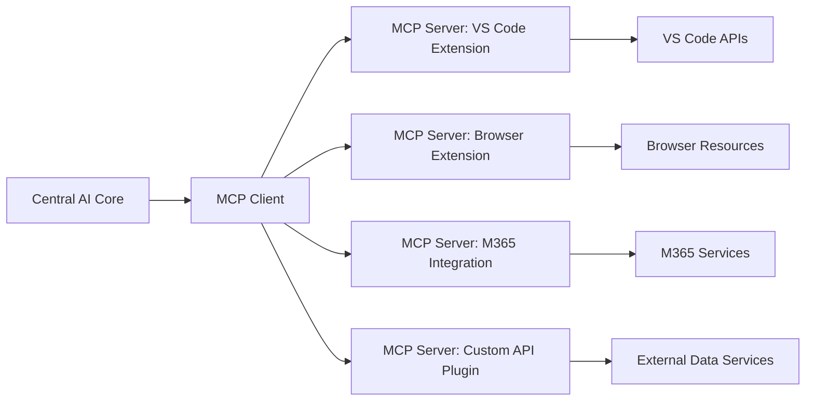

# Cortex Platform: Vision and Values

_Date: 2025-03-05_

## 1. Introduction

The Cortex Platform represents a transformative evolution in digital intelligence—an adaptive ecosystem that seamlessly integrates a centralized AI core with a suite of specialized, autonomous modules. This document outlines the high-level vision and core values that form the foundation of the Cortex Platform, capturing the essential concepts and design principles that will drive both our strategic direction and technical efforts.

### Purpose

The purpose of this document is twofold:

- **For Executives and Stakeholders:**  
  To provide a clear, concise narrative of how Cortex will redefine user experiences and digital interactions. By leveraging deep, autonomous domain expert systems along with a modular, adaptive core, Cortex empowers organizations to achieve unprecedented efficiency, scalability, and innovation.

- **For Internal Teams:**  
  To establish a foundational reference that specifies the key elements required for our system's design—such as the modular nature of the core, the role of autonomous domain experts, and integration via a robust MCP client/server approach. While the document focuses on the known and required elements at this stage, it sets the stage for deeper technical dives, ensuring that our architecture remains flexible and extensible over time.

This version is intentionally high-level; it lays the groundwork for more detailed technical specifications and integration strategies to follow.

### Context

At its heart, the Cortex Platform is built around a central AI core that is not a monolithic intelligence but rather an agile orchestrator. It leverages a network of domain expert entities—autonomous modules that can understand complex high-level requests, decompose them into structured plans, and execute tasks independently. For example, one expert might dive deep into research and analysis, while another tackles code writing, debugging, and optimization. This delegation not only improves overall efficiency but also ensures that our approach remains lean, scalable, and focused on delivering an exceptional user experience.

Additionally, our initial use of the MCP (Model Context Protocol) client/server approach underpins our integration strategy by establishing standardized connections between non-user-facing services. While MCP is our starting point—helping us leverage existing community momentum—the architecture has been designed to be flexible, allowing for custom extensions or alternative integration strategies as our needs evolve.

This document introduces the vision and values of the Cortex Platform—a system designed to empower users through seamless, adaptive digital interactions while maintaining an open, modular architecture for ongoing innovation and scalability.

## 2. The Vision of Cortex Platform

Cortex Platform is not just another digital assistant—it's an integrated, adaptive intelligence ecosystem designed to revolutionize the way users interact with digital spaces. Our vision is to create a unified intelligent experience that seamlessly bridges work, creativity, and collaboration across multiple devices and environments.

At its core, Cortex is built around a central AI core that smartly orchestrates a network of specialized modules, each acting as a domain expert in its own area. Through advanced memory synthesis, adaptive reasoning, and intuitive inputs/outputs, Cortex delivers an experience that is both human-centric and powerfully efficient.

### A Unified Intelligence Experience

Imagine a system where the boundaries between devices, applications, and tasks vanish. Whether you're drafting emails, debugging code, brainstorming creative ideas, or analyzing data, Cortex adapts dynamically to your context. Key aspects of our vision include:

- **Seamless Cross-Platform Interaction:**  
  Cortex maintains continuity across all devices. From desktops to mobile devices and even voice-enabled interactions, every engagement feels connected and coherent.

- **Adaptive Reasoning and Memory:**  
  By leveraging cutting-edge memory systems (such as our JAKE memory model, with room for alternative approaches), Cortex not only remembers important details from previous interactions but uses that context to provide proactive and personalized assistance.

- **Empowered Decision-Making:**  
  With a central core that continually refines its reasoning, Cortex anticipates your needs. It provides actionable insights and suggestions—even before you explicitly ask for them—enhancing your workflow and reducing repetitiveness.

### Visionary User Experiences

Cortex is designed to empower every user through a transformational digital experience:

- **Intelligent Assistance on Demand:**  
  Autonomous domain expert entities act as specialized consultants. When you submit a high-level request, these experts decompose the task, autonomously execute it, and deliver refined, high-quality results.

- **Context-Aware Adaptability:**  
  The system perceives not only what you ask for but also _how_ and _when_ you ask it for. This context-driven approach means your experience is tailored—whether you need a quick snippet of code help during intense work or a thorough research summary during creative brainstorming.

- **Anticipatory Support:**  
  Cortex continuously learns from your interactions. It evolves to better support your goals, offering proactive suggestions and adaptive responses that transform your routine tasks into streamlined processes.

### Illustrative Example

_Consider a day in the life of a Cortex user:_

> **Morning:** Cortex greets you with a concise summary of your schedule and important communications, filtering out noise and highlighting agile priorities.  
> **Midday:** While tackling a coding challenge, you switch to voice mode. The Code Assistant domain expert efficiently suggests code improvements and seamlessly integrates with your development environment.  
> **Afternoon:** During a brainstorming session, you sketch a rough diagram on a digital canvas; Cortex interprets your visual cues, offers creative enhancements, and produces a refined outline that sparks further ideas.  
> **Evening:** As you wind down, Cortex aggregates your accomplishments, providing a clear summary of what was achieved and what lies ahead, setting you up perfectly for the next day.

### In Summary

The Cortex Platform is a transformative leap toward a future where digital interactions are truly intelligent and context-aware. Our vision is one of empowerment—where users enjoy an experience that not only anticipates their needs but evolves with them. By fusing modular design, autonomous domain expertise, and flexible integration (anchored initially by an MCP client/server approach), Cortex paves the way for a digital ecosystem that is as dynamic as it is powerful.

## 3. Modular Architecture & Adaptive Ecosystem

The Cortex Platform is built with a modular, composable architecture that empowers both rapid innovation and parallel development. Rather than creating a monolithic system that attempts to cover every conceivable use case, Cortex decomposes its functionality into discrete, specialized components. This design enables each module to evolve independently while the central AI core maintains a unified and coherent user experience.

### A Modular, Composable Design

At the heart of Cortex lies a Central AI Core that orchestrates all activities within the system. By delegating specialized tasks to distinct modules, Cortex leverages the deep expertise embedded in each component. The main building blocks include:

- **Central AI Core:**  
  Acts as the conductor, managing context, orchestrating tasks, and maintaining the overall state of the conversation and user interactions.

- **Memory System:**  
  A robust subsystem (such as JAKE) that provides unified memory management. It stores and synthesizes historical context, enabling Cortex to recall relevant details and deliver personalized responses.

- **Cognition System:**  
  Responsible for adaptive reasoning and decision-making. By evaluating incoming requests in light of the existing context, this system guides and refines actions before delegating tasks to specialized modules.

- **Task Orchestration:**  
  Decomposes high-level requests into structured subtasks, automatically managing dependencies and prioritizing executions. This ensures that complex operations proceed smoothly and efficiently.

- **Adaptive I/O Modalities:**  
  Cortex supports multiple channels of interaction—chat, voice, canvas, dashboards, and notifications—each tailored to suit the user's needs and the current context. This flexibility allows users to shift seamlessly between different modes of communication.

- **Domain Expert Modules:**  
  Autonomous, plug‐and‐play entities that encapsulate deep domain expertise. Whether it’s a Code Assistant that generates and reviews code or a Research Expert that gathers and synthesizes information, these modules function like specialized consultants, operating independently while reporting back to the core.

- **Integration Layer (via MCP):**  
  The system uses an MCP (Model Context Protocol) client/server approach to connect non-user-facing services. This standardized protocol not only streamlines integrations but also allows for custom extensions when needed.

### Key Benefits

- **Flexibility & Scalability:**  
  Since each module is independent, updates or changes can be deployed without affecting the entire system. This modularity supports parallel development efforts, ensuring that teams can innovate rapidly and independently within their domains.

- **Resilience & Maintainability:**  
  By isolating functionality into clear components, issues in one area can be addressed without cascading failures to the entire system. This design simplifies troubleshooting and long-term maintenance.

- **Enhanced User Experience:**  
  The adaptive I/O modalities ensure that users always interact with the system in the most natural way for their context. Whether switching from text to voice or from a visual canvas to a dashboard view, the transition is seamless and context-aware.

- **Future-Proof Integration:**  
  Beginning with an MCP client/server approach, Cortex is designed to evolve. Custom integration layers or alternative protocols can be incorporated as the ecosystem matures, ensuring long-term compatibility and innovation.

### Diagram of the Modular Ecosystem

The following diagram illustrates the core components of Cortex along with their interactions:

### An Adaptive, Future-Ready Ecosystem

By leveraging this modular architecture, Cortex ensures that the central AI core remains agile and capable of coordinating a diverse ecosystem of autonomous modules. The use of standardized interfaces (via MCP) for integrating external services further reinforces Cortex’s commitment to flexibility. In effect, the platform can easily evolve—new functionalities can be added, existing modules improved, or entirely new integration methods adopted—all without disrupting the unified user experience.

The Cortex Platform’s modular design not only lays a strong foundation for current capabilities but also provides a clear pathway for future expansion and innovation. Each component plays a defined role within the ecosystem, contributing to a seamless, adaptive, and resilient digital intelligence experience.

## 4. Domain Expert Entities

The Cortex Platform distinguishes itself by entrusting specialized tasks to Domain Expert Entities—autonomous modules that operate with deep expertise in specific areas. Rather than relying on a single, all-encompassing intelligence, Cortex delegates complex, domain-specific challenges to these expert entities, each functioning much like a highly skilled professional consultant.

### Concept and Functionality

Domain Expert Entities are designed to:

- **Operate Autonomously:**  
  Once the central AI core delegates a high-level objective, a domain expert takes full ownership of the task. It independently determines if additional context is needed, gathers relevant data, and formulates a structured plan to execute the request. This level of autonomy minimizes the need for the central core to micromanage every detail.

- **Contextual Understanding:**  
  Upon receiving a task, each expert evaluates the context and determines whether further information is required. For example, a research expert might retrieve background literature or pertinent data before proceeding, ensuring that the problem is fully understood.

- **Structured Planning and Execution:**  
  Domain experts break down complex high-level requests into a series of well-defined sub-tasks. They develop a sequential plan, spawn subprocesses when necessary, and iterate over plans to refine outcomes. This mirrors the approach seen in frameworks like AutoGPT, but with a higher degree of independence and specialization.

- **Iterative Refinement:**  
  Embracing a “plan–execute–review” cycle, expert entities continuously evaluate their outputs. If results fall short of quality thresholds, they autonomously iterate—adjusting their approach or even invoking subordinate processes—until satisfactory outcomes are achieved.

- **Result Evaluation:**  
  Rather than simply returning raw outputs, each expert critically evaluates its results against domain-specific criteria. If a result is subpar, the expert may either refine it further or escalate the issue back to the core for additional guidance.

### Integration with the Central Core

Although highly autonomous, domain expert entities are not isolated. They are seamlessly integrated with the Cortex Central AI Core through well-defined interfaces:

- **Delegation:**  
  The central core issues a high-level request (e.g., “find the latest research on renewable energy storage” or “develop a user authentication module”), and the corresponding expert activates. The expert then processes the request independently, handling all necessary planning and execution.

- **Progress and Reporting:**  
  As the expert works on the task, it periodically provides progress updates and status notifications back to the core. This ensures that even if the expert operates largely on its own, there is a constant, transparent communication channel.

- **Modular Independence:**  
  The design guarantees that each domain expert can be developed, updated, or replaced independently, so long as they adhere to the agreed-upon integration interface. New experts—whether developed internally or by third-party contributors—can be seamlessly integrated into the ecosystem.

### A Real-World Analogy

Consider how businesses work with external consultants. When a company needs specialized advice—for marketing, legal, or technical matters—it outsources the task to a professional with deep expertise. The company provides high-level goals and constraints, and the consultant independently researches, plans, and executes to deliver a refined solution. Similarly, Cortex’s domain expert entities are like autonomous consultants: the central core delegates tasks, and each expert “handles its own” work, only looping back to the core for critical decisions or to signal task completion.

### Benefits to the Ecosystem

Integrating Domain Expert Entities into the Cortex Platform yields several significant advantages:

- **Enhanced Specialization:**  
  Each expert brings deep, domain-specific knowledge, ensuring that tasks are handled with expertise that far exceeds a generalist approach.

- **Offloading Complexity:**  
  By delegating complex tasks to these experts, the central core remains lean and focused on high-level orchestration. This greatly improves overall system efficiency and performance.

- **Modular Growth:**  
  The autonomous nature of domain experts allows the platform to scale by simply integrating new experts as needs evolve. This modular approach supports rapid innovation and parallel development across different domains.

- **Self-Improvement:**  
  With built-in iterative refinement and performance evaluation, domain expert entities continuously enhance their capabilities over time, adapting to new challenges without the need for constant external intervention.

Domain Expert Entities are the specialized, autonomous modules that empower Cortex to handle a diverse range of complex tasks. They represent a shift from monolithic AI to a distributed ecosystem of expert agents, ensuring that each function is executed with precision, context-aware intelligence, and continual self-improvement.

## 5. Integration Architecture

The Cortex Platform achieves a truly unified intelligence experience not only through its modular core and domain expert entities, but also by seamlessly integrating with both internal and external systems. The integration architecture is the bridge that connects the central AI core to a diverse ecosystem of tools, services, and third-party applications. At the heart of this architecture is the Model Context Protocol (MCP), a standardized framework that ensures reliable, secure, and extensible communication.

### MCP: The Backbone of Integration

The Model Context Protocol (MCP) standardizes the way Cortex and external services exchange information, commands, and context. MCP achieves this by:

- **Standardizing Communication:**  
  MCP uses the widely adopted JSON-RPC 2.0 format for message exchange, ensuring compatibility and simplicity.

- **Flexible Transport Options:**  
  Whether via local standard input/output (stdio) for command-line utilities, or through HTTP with Server-Sent Events (SSE) for real-time web communications, MCP adapts to the transport that best suits the scenario.

- **Robust Message Types:**  
  MCP defines clear types for requests, responses, errors, and notifications, which help maintain consistency across integrations. This empowers Cortex to interact with various tools without having to reinvent communication protocols for each.

### Core Integration Components

The Integration Architecture is composed of several key components:

- **Integration Layer (MCP Client/Server):**  
  The Cortex Core incorporates an MCP client that communicates with multiple MCP servers. These servers provide a gateway to external resources such as development tools, data services, and third-party applications. This approach lets us extend the capabilities of Cortex without affecting its core functionality.

- **Resource Access and Tool Invocation:**  
  External systems expose both static resources (files, data streams, configuration settings) and dynamic tools (functions, APIs, automated routines). Cortex can request, read, and even trigger these components in a standardized manner. For instance, a VS Code extension might register a tool for analyzing project structure while a browser plugin could expose resources from a webpage for data extraction.

- **Dynamic Discovery and Adaptability:**  
  One of the major benefits of the MCP-based integration is dynamic discovery. The Cortex Core, upon initialization or during runtime, queries the integration registry to learn about available tools and resources. This discovery enables flexible, plug-and-play integration of new functionalities without requiring major system overhauls.

- **Security and Compliance:**  
  All interactions across the integration layer are secured via standardized authentication, authorization, and encryption measures. This ensures that sensitive operations—such as writing files, sending commands, or retrieving confidential data—are executed safely.

### How Integration Works: The Flow

1. **Initialization:**  
   Upon startup, the Cortex Core initializes an MCP client with a defined set of capabilities. It then queries the integration registry to enumerate available MCP servers and their exposed resources or tools.

2. **Resource and Tool Discovery:**  
   The MCP client receives a list of registered resources (such as project files, log streams, or configuration data) and tools (functions to perform operations like code analysis or API interactions). This provides the Cortex Core with a dynamic map of the external environment.

3. **Message Exchange:**  
   For actions that require external interactions—like executing a code review or retrieving the latest weather data—the Cortex Core sends a request through the MCP client. The target MCP server processes the request via its configured transport mechanism (such as HTTP/SSE or stdio), performs the necessary operations, and returns a structured response.

4. **Secure and Reliable Operations:**  
   MCP ensures that every message is authenticated, validated, and processed in a secure, consistent manner. In case of errors—be it due to network issues, invalid parameters, or internal exceptions—the protocol’s error handling mechanisms provide clear feedback that the system can use to invoke fallback procedures or alert users if needed.

5. **Termination and Updates:**  
   Either the client or server can choose to terminate the connection gracefully. Moreover, servers can notify the Cortex Core of changes (e.g., new available resources or updated tool capabilities) through real-time notifications, ensuring the system continually adapts to its evolving ecosystem.

### Diagram of the Integration Ecosystem

Below is a high-level diagram that illustrates how the Cortex Core connects with external services through MCP:

This diagram emphasizes the role of the MCP client as the central conduit for all external operations, offering a flexible and extensible path for integrating varied functionality without disrupting core operations.

### Benefits of Our Integration Approach

- **Future-Proof Flexibility:**  
  By starting with a robust MCP-based integration layer, Cortex is well-positioned to adopt new protocols or custom integrations in the future as technology and user requirements evolve.

- **Seamless User Experience:**  
  The integration layer operates transparently from the user’s perspective. Whether you are coding in an IDE, browsing the web, or working with Office applications, external capabilities are seamlessly accessed and presented through the unified Cortex interface.

- **Security and Reliability:**  
  With standardized message formats and secure transport layers, our integration architecture ensures that every external interaction meets the highest standards of security, reliability, and performance.

The Integration Architecture of the Cortex Platform harnesses the power of MCP to provide a secure, flexible, and dynamic connection between the central AI core and an ever-expanding ecosystem of external tools and resources. This architectural choice not only extends the platform’s functionality but also ensures that it remains agile and scalable as new technologies and use cases emerge.

## 6. Security and Privacy by Design

The Cortex Platform is built on a foundation of trust, with robust security and stringent privacy controls embedded throughout its architecture. Security and privacy are not merely features to be added later—they are integral design principles that influence every component, from the central core to external integrations.

### Core Security Principles

- **Defense in Depth:**  
  Multiple layers of protection work in concert to mitigate risks. If one layer is compromised, others still provide safeguards.

- **Least Privilege:**  
  Every component and user is granted only the minimum permissions necessary to perform their functions, reducing the potential impact of any breach.

- **Zero Trust Architecture:**  
  No entity is implicitly trusted, regardless of its location. Every operation is continuously authenticated and authorized.

- **Privacy by Default & Data Minimization:**  
  The Cortex Platform collects only the data necessary for its operations, and all data handling aligns with strict privacy policies, ensuring that user data is processed and stored securely by default.

- **Transparency and User Control:**  
  Users can clearly see what data is collected and have full control over its usage. This transparency builds trust by providing meaningful choices about data sharing.

- **Continuous Validation:**  
  Regular security testing, performance monitoring, and real-time analytics ensure that security and privacy measures remain effective against evolving threats.

### Authentication and Authorization

- **Unified Identity Management:**  
  A centralized system manages identities across all Cortex touchpoints, integrating with multiple identity providers (OAuth 2.0, OIDC, SAML) to ensure robust, cross-platform authentication.

- **Multi-Factor Authentication:**  
  The system supports a blend of verification methods—including knowledge, ownership, and biometric factors—to enhance account security.

- **Role-Based and Context-Based Access Control:**  
  Access is governed by granular permissions based on user roles, context, and operational needs. Just-in-time access granting and automatic revocation further ensure that privileges are tightly controlled.

### Data Protection

- **Data Classification and Handling:**  
  All data is classified according to its sensitivity (public, internal, confidential, and restricted) and managed using corresponding security controls.

- **Comprehensive Encryption:**  
  Data is protected both at rest and in transit. We utilize state-of-the-art encryption standards (such as AES-256 for storage and TLS 1.3 for transmission) to secure all communications.

- **Secure Storage and Retention:**  
  Storage systems are hardened, and data retention policies are enforced to ensure data is kept only as long as necessary. This minimizes exposure and supports compliance with regulations.

- **Access Auditing and Monitoring:**  
  All data access events are logged and regularly reviewed to detect anomalies and ensure compliance with security policies.

### Communication Security

- **Transport Security:**  
  All interactions—whether via HTTP/SSE for web communications or stdio for local processes—are conducted over secure channels. Encrypted connections protect data integrity and confidentiality.

- **API and Integration Security:**  
  Every external integration and API follows rigorous security protocols that include strict input validation, rate limiting, and continuous monitoring. This protects against unauthorized access and malicious attacks.

- **Zero Trust Networking:**  
  The platform applies zero trust principles to every connection, requiring all entities to verify themselves before any data exchange occurs.

### System Security and Monitoring

- **Secure Configuration and Hardening:**  
  The default configurations are designed to minimize vulnerabilities. Unnecessary services are disabled, and regular audits ensure compliance with security best practices.

- **Vulnerability Management and Patch Updates:**  
  Regular vulnerability scans, code reviews, and prompt patch management ensure that the system stays resilient against new threats.

- **Continuous Security Monitoring:**  
  Integrated logging and monitoring systems capture and analyze every significant event—from API requests and system changes to error states—allowing for proactive threat detection and swift incident response.

- **Incident Response and Recovery:**  
  A comprehensive incident response plan is in place to rapidly address any security breaches. Post-incident reviews help to refine protocols and reduce risks in the future.

### Privacy Architecture

- **Privacy by Design:**  
  Every aspect of data collection, processing, and storage is designed with user privacy in mind. The system adheres to the strictest standards of responsible data handling.

- **User Data Control and Transparency:**  
  Users have access to a privacy dashboard where they can view, export, or delete their personal data. Explicit consent is obtained for all sensitive data processing, and users can manage their preferences easily.

- **Anonymization and Pseudonymization:**  
  Advanced techniques are applied to protect personal information, ensuring that data used for analysis or system improvements cannot be traced back to individual users.

### Monitoring and Incident Response

- **Comprehensive Logging and Diagnostics:**  
  Detailed logs capture system events, which are analyzed to identify anomalies and potential breaches. Metrics such as response times, access patterns, and resource utilization are continuously monitored.

- **Real-Time Alerts and Automated Responses:**  
  Automated alert systems notify administrators of suspicious activity, triggering predefined workflows to contain and resolve incidents.

- **Post-Incident Analysis:**  
  After an incident, a thorough review is conducted to uncover the root cause, implement necessary fixes, and update protocols to prevent future occurrences.

The Cortex Platform’s approach to security and privacy by design underpins every aspect of its functionality. Through rigorous authentication, fine-grained access control, robust encryption, and continuous monitoring, Cortex creates a secure environment that protects user data while delivering a powerful, adaptive digital experience. As technology and threats evolve, these measures will be continuously refined to maintain the highest standards of security and privacy, ensuring long-term user trust and system integrity.

## 7. Conclusion and Future Outlook

The Cortex Platform represents a transformative approach to digital intelligence, unifying a diverse range of capabilities through a modular, adaptive, and secure ecosystem. By combining a robust central AI core with specialized domain expert entities, seamless integration mechanisms via the Model Context Protocol (MCP), and a security and privacy framework built from the ground up, Cortex offers an unparalleled user and developer experience.

### Key Takeaways

- **Unified Intelligence Ecosystem:**  
  Cortex orchestrates a wide array of intelligent functionalities while offloading domain-specific tasks to autonomous, expert modules. This division of labor ensures that each nuanced area—from code analysis to research and content creation—is handled with precision and depth.

- **Modular and Scalable Architecture:**  
  The flexible design allows individual components, such as domain experts or integration servers, to evolve independently. This modularity supports parallel development, rapid innovation, and easy replacement or enhancement of system parts without disrupting overall functionality.

- **Seamless Integration and Extensibility:**  
  Leveraging the Model Context Protocol (MCP), Cortex communicates securely and reliably with external systems, services, and plugins. This standardized approach simplifies the incorporation of new tools and data sources, ensuring that the platform remains future-proof and adaptable to emerging technologies.

- **Security and Privacy by Design:**  
  With a comprehensive, multi-layered security framework—including defense in depth, zero trust principles, and continuous monitoring—the Cortex Platform upholds the highest standards of data protection and privacy. Users benefit from full transparency and control over their personal and sensitive information.

### Looking Ahead

As the Cortex Platform continues to evolve, several strategic avenues will drive its development:

- **Dynamic Expansion of Domain Experts:**  
  The growing ecosystem will see the introduction of more specialized expert entities, extending the platform’s capabilities into new domains such as legal, financial, data analytics, and creative industries. A vibrant marketplace for third-party experts will further enrich the platform’s offerings.

- **Enhanced Integration Capabilities:**  
  Ongoing improvements to the MCP integration layer will help adopt novel transport mechanisms and support advanced, model-driven workflows. This will enable even more seamless and context-aware interactions across a broader spectrum of applications and services.

- **User-Centered Innovation:**  
  With continuous feedback loops and adaptive learning cycles, Cortex will refine its interaction modalities and user interfaces to ensure a natural, efficient, and personalized experience. Future iterations will incorporate emerging technologies such as augmented reality, gestural interfaces, and deeper cross-platform integrations.

- **Enterprise-Grade Features:**  
  In parallel with consumer-oriented enhancements, additional features—such as advanced collaboration tools, comprehensive audit logging, and granular access controls—will further empower enterprise customers. This dual focus ensures that Cortex is well-suited for both individual creativity and large-scale commercial operations.

### Final Thoughts

The Cortex Platform is not just an AI assistant but the linchpin of a comprehensive digital intelligence ecosystem. Its innovative architecture, combined with a relentless focus on security, privacy, and user empowerment, positions it as a cornerstone of the future digital landscape. As we continue to refine and expand its capabilities, Cortex will remain dedicated to driving efficiency, fostering innovation, and transforming how humans interact with technology.

We look forward to collaborating with developers, partners, and users alike to realize this vision and push the boundaries of what’s possible in digital intelligence.
