# Cortex Appendices

_Version: Draft 0.1_  
_Date: 2025-03-04_

---

## 1. Code Samples and Examples

### 1.1 Core Service Example (FastAPI + MCP)

```python
from fastapi import FastAPI, WebSocket
from mcp.server.fastmcp import FastMCP

app = FastAPI(title="Cortex AI Core")
mcp = FastMCP("Cortex Hub")

class CortexCore:
    def __init__(self):
        self.memory_system = MemorySystem()
        self.cognition_system = CognitionSystem()
        self.mcp_handler = MCPHandler()

    async def process_input(self, input_data, input_type="chat"):
        # Process input data, update memory and trigger cognition.
        pass

    async def connect_domain_expert(self, expert_name, connection_details):
        # Establish connection with a domain expert system
        pass

@app.post("/v1/chat")
async def chat_endpoint(request: dict):
    # Process chat request and return response.
    return {"response": "This is a placeholder response."}

@app.websocket("/v1/voice/realtime")
async def voice_realtime(websocket: WebSocket):
    await websocket.accept()
    # Handle real-time voice streaming.
```

### 1.2 Example Domain Expert Tool (VS Code Extension)

```typescript
import { McpServer } from "@modelcontextprotocol/sdk/server/mcp.js";
import { StdioServerTransport } from "@modelcontextprotocol/sdk/server/stdio.js";
import { z } from "zod";
import * as vscode from "vscode";

const server = new McpServer({
  name: "VSCode Assistant",
  version: "1.0.0",
});

server.tool(
  "get-project-structure",
  { workspacePath: z.string() },
  async ({ workspacePath }) => {
    // Implementation to return project structure.
    return {
      content: [{ type: "text", text: "Project structure details..." }],
    };
  }
);

const transport = new StdioServerTransport();
server.connect(transport);
```

---

## 2. Detailed Diagrams

### 2.1 High-Level Architecture Diagram

```mermaid
graph TD
    %% Central Core
    CentralAI[Central AI Core:<br/>Unified Memory, Task Orchestration,<br/>Autonomous Reasoning]
    %% Memory and Cognition
    JAKE[JAKE - Memory]
    Cognition[Cognition]
    %% I/O Modalities
    ChatInput[Chat - Input]
    VoiceInput[Voice - Input<br/>Speech-to-Text]
    RealTimeVoiceInput[Voice - Real-Time Input<br/>Streaming]
    CanvasInput[Canvas - Input]
    ChatOutput[Chat - Output]
    VoiceOutput[Voice - Output<br/>Text-to-Speech]
    RealTimeVoiceOutput[Voice - Real-Time Output<br/>Streaming]
    CanvasOutput[Canvas - Output]
    DashboardOutput[Dashboard - Output]
    NotificationOutput[Notification - Output]
    %% Domain Experts and Tools
    CodeAssistant[Code Assistant<br/>Domain Expert]
    DeepResearch[Deep Research<br/>Domain Expert]
    FusionExpert[Autodesk Fusion Expert<br/>Domain Expert]
    VSCode[VS Code Extension - MCP Server]
    M365Apps[M365 Apps:<br/>Word, PPT, Excel]
    BrowserExt[Browser Extension - Playwright]
    OtherTools[Other Tools:<br/>API Plugins, Custom Connectors]

    ChatInput --> CentralAI
    VoiceInput --> CentralAI
    RealTimeVoiceInput --> CentralAI
    CanvasInput --> CentralAI
    CentralAI --> ChatOutput
    CentralAI --> VoiceOutput
    CentralAI --> RealTimeVoiceOutput
    CentralAI --> CanvasOutput
    CentralAI --> DashboardOutput
    CentralAI --> NotificationOutput
    CentralAI --> JAKE
    CentralAI --> Cognition
    CentralAI --> CodeAssistant
    CentralAI --> DeepResearch
    CentralAI --> FusionExpert
    CodeAssistant --> VSCode
    DeepResearch --> VSCode
    CentralAI --> M365Apps
    CentralAI --> BrowserExt
    CentralAI --> OtherTools
```



### 2.2 Additional Detailed Diagrams

_(Include any further diagrams developed during the design phase here.)_

---

## 3. Frequently Asked Questions (FAQ)

**Q1: What makes Cortex different from other AI assistants?**  
_A1: Cortex is an integrated digital intelligence ecosystem that combines a powerful adaptive core with modular, plug-and-play domain expert systems and seamless MCP-based connectivity across diverse digital platforms, from work environments to gaming and creative interfaces._

**Q2: How does Cortex support parallelized development?**  
_A2: With its modular architecture, different teams can work concurrently on separate subsystems (e.g., memory management, domain expert systems, multi-modal interfaces), enabling rapid innovation and integration without bottlenecks._

**Q3: Can I integrate my own domain expert system into Cortex?**  
_A3: Yes, Cortex is designed for extensibility. Its MCP-centric communication model allows third-party and community-driven expert systems to be seamlessly integrated as hot-swappable modules._

**Q4: What kinds of user interfaces can Cortex support?**  
_A4: Cortex is not limited to traditional interfaces—it can power desktop dashboards, mobile apps, gaming consoles (like integrating with Minecraft on Xbox), and more, offering adaptive outputs tailored to each context._

---

## 4. Glossary

- **Cortex Core:** The central AI engine responsible for memory, reasoning, and task orchestration.
- **MCP (Model Context Protocol):** A standard protocol that enables uniform, scalable communication between the Cortex Core and external modules.
- **Domain Expert System:** A specialized module that autonomously handles complex, domain-specific tasks (e.g., Code Assistant, Deep Research).
- **Adaptive Interaction:** The ability of Cortex to dynamically change its input/output modalities based on contextual needs.
