# Cortex JAKE Memory System

_Version: 1.0_  
_Date: March 5, 2025_

## Overview

The Just-About-Knowledge-Everything (JAKE) Memory System is the core memory architecture of the Cortex Platform, providing unified context preservation across all interactions. JAKE enables the platform to maintain coherent, consistent understanding of users, their history, and relevant knowledge, ensuring a truly unified intelligence experience regardless of interaction modality or entry point.

## Core Concepts

### Memory Model

The JAKE memory model is built on the following key concepts:

1. **Entities**: Discrete knowledge units with properties and relationships
2. **Relationships**: Connections between entities with type and directionality
3. **Context**: Active working memory for current interactions
4. **Knowledge**: Long-term structured information
5. **Memory Embeddings**: Vector representations of memories for similarity-based retrieval

### Memory Types

JAKE manages several types of memory:

1. **Episodic Memory**: Records of specific interactions and events
2. **Semantic Memory**: General knowledge and concepts
3. **Procedural Memory**: Task workflows and processes
4. **Working Memory**: Active content for current processing
5. **Meta-Memory**: Information about memory organization and access patterns

## System Architecture

### High-Level Architecture

```mermaid
graph TD
    A[JAKE Memory System] --> B[Entity Store]
    A --> C[Relation Store]
    A --> D[Context Manager]
    A --> E[Knowledge Base]
    A --> F[Embedding Engine]
    A --> G[Memory Analyzer]

    B --> B1[Entity Creation]
    B --> B2[Entity Retrieval]
    B --> B3[Entity Update]

    C --> C1[Relation Creation]
    C --> C2[Relation Traversal]
    C --> C3[Graph Operations]

    D --> D1[Context Creation]
    D --> D2[Context Switching]
    D --> D3[Context Merging]

    E --> E1[Knowledge Retrieval]
    E --> E2[Knowledge Integration]
    E --> E3[Knowledge Validation]

    F --> F1[Embedding Generation]
    F --> F2[Similarity Search]
    F --> F3[Clustering]

    G --> G1[Memory Prioritization]
    G --> G2[Memory Synthesis]
    G --> G3[Memory Consolidation]
```



### Core Components

#### Entity Store

The Entity Store manages discrete knowledge units:

- Creation, retrieval, and updating of entities
- Schema enforcement and validation
- Property indexing and search
- Entity versioning and history
- Bulk entity operations

#### Relation Store

The Relation Store manages connections between entities:

- Creation and management of typed relationships
- Bidirectional traversal capabilities
- Graph query operations
- Relationship strength and confidence levels
- Temporal relationship aspects

#### Context Manager

The Context Manager handles active memory states:

- Creation and maintenance of context sessions
- Context switching between different tasks
- Context merging for related activities
- Context persistence across interactions
- Context prioritization and relevance assessment

#### Knowledge Base

The Knowledge Base maintains structured information:

- Long-term knowledge storage
- Knowledge retrieval and query processing
- Knowledge validation and conflict resolution
- Knowledge organization and categorization
- Integration of new knowledge

#### Embedding Engine

The Embedding Engine provides vector representations:

- Generation of memory embeddings
- Similarity-based memory retrieval
- Semantic clustering of related memories
- Dimensionality management
- Embedding model optimization

#### Memory Analyzer

The Memory Analyzer processes and optimizes memory:

- Memory relevance assessment
- Memory synthesis and summarization
- Memory consolidation for efficiency
- Pattern identification across memories
- Memory lifecycle management

## Data Model

### Entity Model

Entities follow this basic structure:

```json
{
  "id": "entity-uuid-12345",
  "schema": "person|concept|task|resource|...",
  "created_at": "2025-03-05T12:00:00Z",
  "updated_at": "2025-03-05T12:34:56Z",
  "properties": {
    "name": "Entity Name",
    "description": "Entity description",
    // Schema-specific properties
  },
  "metadata": {
    "confidence": 0.95,
    "source": "user-input|inference|integration",
    "privacy_level": "public|private|sensitive"
  },
  "embeddings": {
    "default": [...],  // Vector embedding
    "specialized": [...] // Domain-specific embedding
  }
}
```

### Relationship Model

Relationships follow this basic structure:

```json
{
  "id": "relation-uuid-12345",
  "source": "entity-uuid-source",
  "target": "entity-uuid-target",
  "type": "knows|contains|created|references|...",
  "created_at": "2025-03-05T12:00:00Z",
  "strength": 0.8,
  "properties": {
    // Relation-specific properties
  },
  "temporal": {
    "started_at": "2025-01-01T00:00:00Z",
    "ended_at": null,
    "is_current": true
  },
  "metadata": {
    "confidence": 0.9,
    "source": "user-input|inference|integration",
    "bidirectional": false
  }
}
```

### Context Model

Context objects follow this basic structure:

```json
{
  "id": "context-uuid-12345",
  "type": "conversation|task|session|workspace",
  "created_at": "2025-03-05T12:00:00Z",
  "updated_at": "2025-03-05T12:34:56Z",
  "active": true,
  "priority": 5,
  "state": {
    "relevant_entities": ["entity-uuid-1", "entity-uuid-2"],
    "current_focus": "entity-uuid-1",
    "interaction_history": [...],
    "working_memory": {...}
  },
  "parent_context": "context-uuid-parent",
  "child_contexts": ["context-uuid-child1", "context-uuid-child2"],
  "metadata": {
    "user_id": "user-uuid",
    "source_modality": "chat|voice|canvas",
    "privacy_level": "public|private|sensitive"
  }
}
```

## Memory Operations

### Memory Creation

The process for creating new memories:

1. **Entity Creation**: Creating new knowledge entities

   - Schema selection and validation
   - Property assignment
   - Embedding generation
   - Storage and indexing

2. **Relationship Creation**: Establishing connections between entities

   - Source and target entity specification
   - Relationship type selection
   - Property assignment
   - Graph integration

3. **Context Creation**: Establishing new interaction contexts
   - Context type specification
   - Initial state definition
   - Parent/child relationship setup
   - Activation and prioritization

### Memory Retrieval

Methods for retrieving memories:

1. **Direct Retrieval**: Fetching specific memories by identifier

   - Entity ID lookup
   - Relationship ID lookup
   - Context ID lookup

2. **Query-Based Retrieval**: Finding memories matching criteria

   - Property-based queries
   - Schema-based filtering
   - Temporal filtering
   - Metadata-based selection

3. **Semantic Retrieval**: Finding memories by similarity

   - Embedding-based similarity search
   - Semantic relevance ranking
   - Conceptual neighborhood exploration
   - Fuzzy matching

4. **Graph Traversal**: Exploring connected memories
   - Relationship following
   - Path discovery
   - Subgraph extraction
   - Network analysis

### Memory Update

Approaches for modifying existing memories:

1. **Entity Updates**: Modifying entity properties

   - Property value changes
   - Schema transitions
   - Confidence adjustments
   - Embedding updates

2. **Relationship Updates**: Modifying connections

   - Relationship strength adjustments
   - Property updates
   - Temporal status changes
   - Direction modifications

3. **Context Updates**: Modifying active contexts
   - State updates
   - Focus changes
   - Priority adjustments
   - Timeline advances

### Memory Integration

Processes for incorporating new information:

1. **Knowledge Reconciliation**: Handling conflicting information

   - Confidence-based resolution
   - Temporal prioritization
   - Source credibility assessment
   - Contradiction handling

2. **Context Merging**: Combining related contexts

   - State combination
   - Timeline integration
   - Priority resolution
   - Relationship establishment

3. **Memory Consolidation**: Optimizing memory storage
   - Redundancy elimination
   - Summarization
   - Compression
   - Archival

## Memory Management

### Memory Prioritization

Strategies for determining memory importance:

1. **Recency**: Prioritizing recent memories
2. **Relevance**: Prioritizing topically related memories
3. **Significance**: Prioritizing impactful or important memories
4. **User Focus**: Prioritizing memories related to user attention
5. **Task Alignment**: Prioritizing task-relevant memories

### Memory Lifecycle

The stages of memory management:

1. **Creation**: Initial memory formation
2. **Active Use**: Regular access and modification
3. **Background**: Retained but not immediately active
4. **Archival**: Long-term storage with reduced access priority
5. **Forgetting**: Controlled removal of low-value memories

### Privacy and Security

Memory privacy protections:

1. **Privacy Levels**: Classification of memory sensitivity
2. **Access Controls**: Restrictions on memory retrieval
3. **Retention Policies**: Rules for memory preservation duration
4. **Anonymization**: Removal of identifying information
5. **Audit Trails**: Tracking of memory access and modifications

## Integration with Core AI

### Memory and Reasoning

The relationship between memory and the reasoning engine:

1. **Knowledge Grounding**: Providing factual bases for reasoning
2. **Context Awareness**: Enabling situation-appropriate responses
3. **Consistency Maintenance**: Ensuring coherent interactions over time
4. **Personalization**: Adapting responses based on user history
5. **Learning Integration**: Incorporating new knowledge from experiences

### Memory and Task System

Memory's role in task management:

1. **Task History**: Maintaining records of previous tasks
2. **Task Context**: Providing relevant information for task execution
3. **Resource Discovery**: Finding resources needed for tasks
4. **Progress Tracking**: Recording task advancement
5. **Experience Learning**: Improving task execution from past experiences

### Memory and Modalities

Memory integration with I/O modalities:

1. **Cross-Modal Context**: Maintaining context across modality switches
2. **Modality Preferences**: Remembering preferred interaction channels
3. **Presentation History**: Tracking how information was previously presented
4. **Interaction Patterns**: Learning from past modality effectiveness
5. **State Persistence**: Preserving state between modality transitions

## Implementation Considerations

### Performance Optimization

Strategies for memory system performance:

1. **Tiered Storage**: Multi-level storage based on access patterns
2. **Caching**: Strategic caching of frequently accessed memories
3. **Parallel Processing**: Concurrent memory operations
4. **Indexing Strategies**: Optimized indexes for common access patterns
5. **Asynchronous Updates**: Non-blocking memory modifications

### Scalability Approaches

Methods for scaling the memory system:

1. **Horizontal Scaling**: Distributing memory across multiple nodes
2. **Sharding**: Partitioning memory by logical boundaries
3. **Replication**: Maintaining copies for redundancy and access speed
4. **Load Balancing**: Distributing memory operations
5. **Incremental Growth**: Adapting to increasing memory demands

### Fault Tolerance

Approaches for resilient memory operations:

1. **Transaction Management**: Atomic memory operations
2. **Versioning**: Maintaining multiple versions for recovery
3. **Backup Strategies**: Regular memory state preservation
4. **Consistency Checks**: Validating memory integrity
5. **Self-Healing**: Automated recovery from inconsistencies

## Development Guidelines

### Extending the Memory System

Guidelines for adding capabilities:

1. **Schema Extensions**: Adding new entity and relationship types
2. **Operation Plugins**: Creating new memory operations
3. **Storage Adapters**: Supporting additional storage backends
4. **Embedding Models**: Incorporating new representation approaches
5. **Query Extensions**: Adding specialized retrieval mechanisms

### Best Practices

Recommendations for working with the memory system:

1. **Clear Entity Boundaries**: Well-defined, coherent entities
2. **Meaningful Relationships**: Semantic, typed connections
3. **Appropriate Contexts**: Right-sized context boundaries
4. **Confidence Attribution**: Explicit certainty levels
5. **Privacy Awareness**: Thoughtful privacy level assignment

## Conclusion

The JAKE Memory System provides the foundation for the Cortex Platform's unified intelligence experience. By maintaining comprehensive, structured memory across all interactions, JAKE enables the platform to deliver consistent, context-aware responses regardless of the interaction modality or entry point.

The system's flexible architecture supports diverse memory types, from specific interaction records to general knowledge, while its sophisticated prioritization and retrieval mechanisms ensure that the most relevant information is available when needed. Through deep integration with the reasoning engine, task system, and modality controllers, JAKE enables the seamless, intelligent experience that defines the Cortex Platform.

As the platform evolves, the JAKE Memory System will continue to advance, incorporating new memory representation techniques, optimization strategies, and integration capabilities to further enhance the unified intelligence experience.
