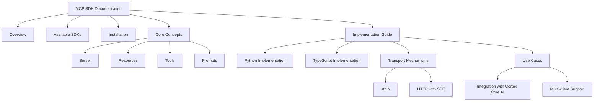

# MCP SDK Documentation Update Plan

## Introduction

This document outlines the plan for updating the Cortex Platform SDK documentation to accurately reflect the Model Context Protocol (MCP) functionality. The current documentation misrepresents the core purpose and implementation of MCP, and this plan details how to correct these issues.

## Key Issues with Current Documentation

1. **Incorrect Fundamental Purpose**: Current docs present MCP as a client-server API for conversation management, rather than its actual purpose of providing standardized context for LLMs.

2. **Misrepresented Package Structure**: Lists fictional package names and versions not matching actual MCP SDKs.

3. **Inaccurate Implementation Patterns**: Shows API usage patterns that don't align with how MCP servers actually work.

4. **Missing Transport Information**: Lacks proper information about transport mechanisms, particularly SSE which is important for our implementation.

5. **Irrelevant Authentication Methods**: Includes extensive authentication details not part of the MCP protocol.

## Updated Documentation Structure



## Detailed Content Updates

### 1. Overview Section

**Replace with**:

- Explanation of MCP as a protocol allowing applications to provide context for LLMs in a standardized way
- Description of how it separates context provision from LLM interaction
- Brief introduction to the server-based architecture and how it fits into the Cortex Platform ecosystem
- Highlight the primary benefit: allowing AI models to safely access external data and functionality

### 2. Available SDKs Section

**Replace with**:

- Python SDK (`mcp`) - Latest version, Python 3.8+ support
- TypeScript SDK (`@modelcontextprotocol/sdk`) - Latest version, TypeScript/JavaScript support
- Remove references to Java and C# as there are no official MCP SDKs for these languages
- Link to official MCP repositories and documentation

### 3. Installation Section

**Replace with**:

- Python installation instructions:
  - Using pip: `pip install mcp`
  - Using uv: `uv add "mcp[cli]"`
- TypeScript installation instructions:
  - Using npm: `npm install @modelcontextprotocol/sdk`
  - Using yarn: `yarn add @modelcontextprotocol/sdk`
- Remove all Java/C# installation examples

### 4. Core Concepts Section

**Replace with**:

#### Server

- Description of the Server as the core interface to the MCP protocol
- Explanation of how servers handle connection management, protocol compliance, and message routing
- Examples of server initialization in both Python and TypeScript

#### Resources

- Definition: Data exposed to LLMs (similar to GET endpoints)
- Explanation of static vs. dynamic resources
- Resource URI patterns and templates
- Examples of resource implementation in both Python and TypeScript

#### Tools

- Definition: Functions that let LLMs take actions (similar to POST endpoints)
- Explanation of when to use tools vs. resources
- Parameters, validation, and return values
- Examples of tool implementation in both Python and TypeScript

#### Prompts

- Definition: Reusable templates for LLM interactions
- Use cases for prompts in the Cortex Platform
- Examples of prompt implementation in both Python and TypeScript

### 5. Implementation Guide

**Replace with**:

#### Python Implementation

- High-level FastMCP API with decorator-based syntax
- Resource, tool, and prompt implementation examples
- Context handling and lifecycle management
- Best practices for Python MCP server development

#### TypeScript Implementation

- McpServer initialization and configuration
- Method-based API for resources, tools, and prompts
- Handling asynchronous operations
- Type safety with Zod schema validation

#### Transport Mechanisms

**Focus on HTTP with SSE**:

- Detailed explanation of Server-Sent Events (SSE) implementation
- Express.js examples for TypeScript
- Flask/FastAPI examples for Python
- Security considerations for SSE transport
- Performance optimization strategies
- Connection handling, reconnection logic
- Handling multiple simultaneous clients

**Include stdio basics**:

- Brief explanation of stdio transport as an alternative
- When to use stdio vs. SSE

#### Use Cases

- **Integration with Cortex Core AI**:

  - How MCP servers interface with the Central AI Core
  - Data flow between MCP servers and the Core AI
  - Example of a complete implementation

- **Multi-client Support**:
  - How to design MCP servers that can be used by multiple clients
  - Considerations for developing reusable MCP servers
  - Handling client-specific state

## Example Code Snippets

### Python MCP Server with SSE Transport

```python
# server.py
from mcp.server.fastmcp import FastMCP
from flask import Flask, Response, request
import json

# Create Flask app
app = Flask(__name__)

# Create an MCP server
mcp = FastMCP("Cortex Integration Service")

# Add a tool
@mcp.tool()
def search_database(query: str) -> dict:
    """Search the Cortex database for information"""
    # Implementation here
    return {"results": [f"Result for query: {query}"]}

# Add a resource
@mcp.resource("cortex://api/{endpoint}")
def get_api_data(endpoint: str) -> str:
    """Get data from the Cortex API"""
    # Implementation here
    return f"Data from {endpoint} endpoint"

# SSE endpoint
@app.route('/sse')
def sse():
    def event_stream():
        # SSE setup and handling
        pass

    return Response(event_stream(), content_type='text/event-stream')

# Message endpoint
@app.route('/messages', methods=['POST'])
def messages():
    # Handle incoming messages
    data = request.json
    # Process with MCP
    return json.dumps({"status": "received"})

if __name__ == '__main__':
    app.run(debug=True, port=3000)
```

### TypeScript MCP Server with SSE Transport

```typescript
import express from "express";
import {
  McpServer,
  ResourceTemplate,
} from "@modelcontextprotocol/sdk/server/mcp.js";
import { SSEServerTransport } from "@modelcontextprotocol/sdk/server/sse.js";
import { z } from "zod";

// Create Express app
const app = express();
app.use(express.json());

// Create MCP server
const server = new McpServer({
  name: "Cortex Integration Service",
  version: "1.0.0",
});

// Add a tool
server.tool("search-database", { query: z.string() }, async ({ query }) => ({
  content: [
    {
      type: "text",
      text: `Results for query: ${query}`,
    },
  ],
}));

// Add a resource
server.resource(
  "cortex-api",
  new ResourceTemplate("cortex://api/{endpoint}", { list: undefined }),
  async (uri, { endpoint }) => ({
    contents: [
      {
        uri: uri.href,
        text: `Data from ${endpoint} endpoint`,
      },
    ],
  })
);

// Set up SSE endpoint
app.get("/sse", async (req, res) => {
  res.setHeader("Content-Type", "text/event-stream");
  res.setHeader("Cache-Control", "no-cache");
  res.setHeader("Connection", "keep-alive");

  const transport = new SSEServerTransport("/messages", res);
  await server.connect(transport);
});

// Set up message endpoint
app.post("/messages", async (req, res) => {
  // Implementation for handling client messages
  res.json({ status: "received" });
});

app.listen(3000, () => {
  console.log("MCP server running on port 3000");
});
```

## Implementation Timeline

1. **Phase 1: Content Structure Update**

   - Create new outline based on the proposed structure
   - Remove incorrect/irrelevant sections (authentication, etc.)
   - Setup basic framework for all sections

2. **Phase 2: Core Concepts Documentation**

   - Update detailed explanations for Server, Resources, Tools, and Prompts
   - Create accurate code examples for both Python and TypeScript

3. **Phase 3: Transport Focus**

   - Develop comprehensive SSE transport documentation with examples
   - Explain integration patterns with Cortex Platform

4. **Phase 4: Refinement and Examples**
   - Add complete working examples for common use cases
   - Include best practices and troubleshooting
   - Ensure consistency throughout the documentation

## Integration with Cortex Platform Documentation

This MCP SDK documentation will align with the broader Cortex Platform documentation by:

1. Using consistent terminology between architectural documents and implementation guides
2. Providing clear linkages to how MCP servers fit into the overall system architecture
3. Explaining specifically how the VS Code Extension, Browser Extension, and other integration points connect with MCP servers
4. Focusing on how MCP enables the domain expert functionality shown in the architecture diagram
