# Cortex Platform: Ecosystem Strategy

_Version: 1.0_  
_Date: 2025-03-04_

## Introduction

The Cortex Platform is designed as more than just a product—it's the foundation for a vibrant ecosystem of developers, partners, domain experts, and users. This ecosystem strategy outlines how Cortex will cultivate this community, establish value exchange mechanisms, and create a self-sustaining environment for continuous innovation.

The ecosystem approach is central to Cortex's vision of a unified intelligence layer that spans diverse digital contexts. By harnessing the collective creativity and expertise of a broad community, Cortex can expand its capabilities far beyond what any single organization could develop independently.

## Ecosystem Vision

```mermaid
graph TD
    A[Cortex Platform Ecosystem] --> B[Core Platform]
    A --> C[Developer Community]
    A --> D[Partner Network]
    A --> E[Domain Experts]
    A --> F[User Community]

    B --> B1[Central AI Core]
    B --> B2[Memory & Cognition]
    B --> B3[I/O Modalities]
    B --> B4[MCP Framework]

    C --> C1[Tool Developers]
    C --> C2[Integration Creators]
    C --> C3[Domain Expert Builders]
    C --> C4[UI/UX Innovators]

    D --> D1[Technology Partners]
    D --> D2[Implementation Partners]
    D --> D3[Industry Specialists]
    D --> D4[Research Collaborators]

    E --> E1[Vertical Domain Experts]
    E --> E2[Specialized Capabilities]
    E --> E3[Industry-Specific Experts]
    E --> E4[Research-Driven Experts]

    F --> F1[Individual Users]
    F --> F2[Enterprise Customers]
    F --> F3[Educational Institutions]
    F --> F4[Creative Organizations]
```

### Ecosystem Principles

The Cortex ecosystem is guided by the following core principles:

1. **Open Standards**: Standardized interfaces and protocols enable broad participation without artificial barriers
2. **Value Exchange**: Clear mechanisms for value creation and exchange among all ecosystem participants
3. **Quality Assurance**: Standards and certification processes ensure consistent quality and security
4. **Collaborative Innovation**: Framework for cooperative development that amplifies individual contributions
5. **Sustainable Economics**: Business models that support ongoing investment and participation

### Value Exchange Framework

The Cortex ecosystem creates value exchange among various participants:

| Ecosystem Role     | Contributes                                      | Receives                                  |
| ------------------ | ------------------------------------------------ | ----------------------------------------- |
| Core Platform Team | Platform foundation, standards, security         | Expanded capabilities, market reach       |
| Developers         | Extensions, integrations, domain experts         | Development tools, marketplace access     |
| Partners           | Distribution, implementation, vertical expertise | New offerings, competitive advantage      |
| Expert Builders    | Specialized domain capabilities                  | Development framework, customer access    |
| Users              | Feedback, use cases, data                        | Enhanced capabilities, unified experience |

## Community Engagement Strategy

A thriving developer and user community is essential to Cortex's ecosystem strategy.

### Developer Community

The developer community strategy focuses on:

#### 1. Developer Experience

- Comprehensive SDK with clear documentation
- Interactive examples and starter templates
- Testing frameworks and validation tools
- Responsive support channels

#### 2. Community Infrastructure

- Developer portal with resources and tools
- Community forums for knowledge sharing
- Regular educational webinars and events
- Recognition and reward programs

#### 3. Contribution Paths

- Clear pathways for different contribution types:
  - Domain expert development
  - Tool integration creation
  - Core platform contributions
  - Documentation and examples

#### 4. Feedback Loops

- Beta programs for early access
- Structured feedback collection
- Transparent roadmap influence
- Community voting on priorities

### User Community

The user community strategy emphasizes:

#### 1. Knowledge Sharing

- User forums and knowledge base
- Best practice sharing
- Case studies and success stories
- User-to-user support networks

#### 2. User Voice

- Product feedback mechanisms
- Feature request system
- User research participation
- Advisory councils

#### 3. Adoption Support

- Getting started resources
- Training materials and certification
- Implementation guides
- Migration assistance

#### 4. Community Events

- User conferences and meetups
- Virtual user groups
- Training workshops
- Hackathons and innovation challenges

## Partnership Strategy

Strategic partnerships are crucial for expanding Cortex's reach and capabilities.

### Partnership Categories

Cortex will develop partnerships in the following key categories:

#### 1. Technology Integration Partners

- Platform technology providers (cloud, edge, devices)
- Complementary AI technology providers
- Tool and application partners
- Data and content providers

#### 2. Implementation Partners

- System integrators
- Consulting firms
- Solution providers
- Training partners

#### 3. Industry Specialists

- Vertical industry experts
- Regulatory and compliance specialists
- Industry association partnerships
- Standards body participation

#### 4. Research Collaborations

- Academic research partnerships
- Industry research consortiums
- Innovation labs
- Open research initiatives

### Partnership Development Process

Partnerships will be developed through a structured approach:

1. **Identification**: Strategic mapping of partnership needs and opportunities
2. **Qualification**: Assessment of partner capabilities and alignment
3. **Engagement**: Structured onboarding and enablement
4. **Activation**: Joint go-to-market and technical integration
5. **Growth**: Expansion of partnership scope and impact
6. **Optimization**: Continuous evaluation and enhancement

### Partner Value Proposition

The Cortex partnership proposition includes:

- Access to cutting-edge unified intelligence technology
- First-mover advantage in a transformative market
- Revenue opportunities through implementation and extensions
- Differentiation from competitors with unique capabilities
- Co-marketing and joint customer development
- Influence on platform direction and priorities

## Third-Party Integration Philosophy

The MCP framework is the foundation for Cortex's integration strategy, providing a standardized approach for connecting external tools and services.

### Integration Principles

- **Universal Connectivity**: Any tool or service can integrate through standardized interfaces
- **Graduated Complexity**: Simple integrations should be simple; complex capabilities require more investment
- **Self-Service First**: Most integrations should be possible without direct platform team involvement
- **Quality Assurance**: Clear standards and validation for integration quality
- **User-Centric Discovery**: Integrated tools should be easily discoverable by users

### Integration Types

The platform supports several integration models:

#### 1. MCP Servers

Full-featured integration servers that provide comprehensive tool and resource access to the Cortex Platform. These offer the deepest integration capabilities including:

- Tool discovery and capability advertisement
- Bi-directional communication
- Context-aware tool execution
- Result processing and refinement

#### 2. API Connectors

Lightweight integrations that connect existing APIs to the Cortex Platform:

- REST/GraphQL API mapping
- Authentication handling
- Result formatting
- Basic context passing

#### 3. Data Connectors

Specialized connectors for data sources:

- Structured data access
- Content indexing
- Real-time data streaming
- Search and retrieval

#### 4. UI Extensions

Extensions that enhance the Cortex user interface:

- Custom visualization components
- Specialized input methods
- Context-specific UI enhancements
- Workflow extensions

### Integration Marketplace

A central marketplace will facilitate discovery and distribution of integrations:

- Structured categorization and search
- Quality ratings and reviews
- Usage analytics and popularity metrics
- Installation and configuration guidance
- Version management and compatibility information

## Domain Expert Expansion Strategy

Domain experts are specialized modules that provide autonomous, high-quality capabilities in specific domains.

### Domain Expert Framework

The framework for domain experts includes:

#### 1. Expert Architecture

- Standardized interfaces for core interaction
- Autonomous planning and execution capabilities
- Self-directed information gathering
- Quality assessment and refinement
- Result evaluation and improvement

#### 2. Development Toolkit

- Expert development templates
- Planning and execution frameworks
- Testing and validation tools
- Performance benchmarking tools
- Security analysis capabilities

#### 3. Quality Standards

- Response quality requirements
- Performance benchmarks
- Security standards
- Ethics and bias guidelines
- User experience guidelines

### Domain Prioritization

The strategic approach to domain expert expansion prioritizes:

1. **High-Value Domains**: Areas with clear, significant user value
2. **Technical Feasibility**: Domains where current AI capabilities can deliver quality results
3. **Strategic Alignment**: Experts that enhance Cortex's core value proposition
4. **Community Interest**: Domains with active developer community interest
5. **Partner Capabilities**: Areas where partners bring unique expertise

### Initial Domain Focus Areas

The initial focus areas for domain experts include:

| Domain                  | Key Capabilities                            | Delivery Timeline |
| ----------------------- | ------------------------------------------- | ----------------- |
| Code Assistant          | Code generation, refactoring, documentation | Foundation Phase  |
| Deep Research           | Information gathering, synthesis, citation  | Foundation Phase  |
| Data Analysis           | Data exploration, visualization, insights   | Expansion Phase   |
| Design                  | Visual design, UI/UX, creative assistance   | Expansion Phase   |
| Content Creation        | Writing, editing, multimedia creation       | Expansion Phase   |
| Project Management      | Planning, tracking, coordination            | Maturity Phase    |
| Domain-Specific Experts | Legal, financial, healthcare, etc.          | Ecosystem Phase   |

### Expert Ecosystem Development

The long-term strategy for domain expert ecosystem development includes:

- **Expert Marketplace**: Centralized discovery and distribution
- **Composition Framework**: Ability to combine multiple experts for complex tasks
- **Specialization Support**: Tools for creating highly specialized experts
- **Community Contribution**: Framework for community-driven expert development
- **Expert Evolution**: Mechanisms for continuous improvement based on usage

## Open Source Strategy

Cortex will employ a strategic approach to open source, balancing community participation with commercial sustainability.

### Open Source Components

The following components are candidates for open source release:

1. **MCP Protocol and Reference Implementation**: Ensuring broad adoption of the integration standard
2. **Base Domain Expert Framework**: Enabling community development of domain experts
3. **Reference I/O Modalities**: Providing examples for custom modality development
4. **Developer Tools and SDKs**: Supporting the ecosystem developer experience
5. **Reference UI Components**: Ensuring consistent user experience across implementations

### Open Source Governance

Open source components will be managed through:

- **Clear Licensing**: Appropriate open source licenses for different components
- **Contribution Guidelines**: Well-defined processes for community contributions
- **Governance Structure**: Transparent decision-making processes
- **Release Management**: Structured approach to versioning and releases
- **Community Recognition**: Acknowledgment and celebration of contributors

### Commercial Components

The following components will remain proprietary:

1. **Central AI Core**: The core orchestration and intelligence engine
2. **Advanced Memory Systems**: Sophisticated memory synthesis and management
3. **Premium Domain Experts**: Selected high-value expert implementations
4. **Enterprise Features**: Security, compliance, and advanced management
5. **Managed Cloud Services**: Fully managed Cortex Platform offerings

### Balancing Strategy

The open source strategy balances:

- **Community Innovation**: Leveraging collective creativity and expertise
- **Commercial Sustainability**: Ensuring continued investment in the platform
- **Ecosystem Growth**: Maximizing adoption and extension
- **Quality Control**: Maintaining high standards across the platform

## Ecosystem Economics

A sustainable economic model is essential for long-term ecosystem health.

### Revenue Streams

The ecosystem supports multiple revenue streams:

1. **Platform Subscriptions**: Core platform access and capabilities
2. **Premium Experts**: Advanced domain expert capabilities
3. **Marketplace Commissions**: Revenue share from third-party offerings
4. **Implementation Services**: Through partners and direct channels
5. **Enterprise Capabilities**: Advanced security, management, and integration

### Marketplace Economics

The marketplace revenue model includes:

- **Fair Revenue Sharing**: Transparent model that rewards quality contributions
- **Tiered Pricing Options**: Flexibility for different offering types
- **Enterprise Licensing**: Simplified procurement for organizations
- **Usage-Based Models**: Options that align cost with value
- **Free Tier**: Entry-level offerings to drive adoption

### Developer Incentives

Incentives for ecosystem developers include:

- **Revenue Opportunities**: Direct monetization of contributions
- **Development Fund**: Grants for strategic ecosystem enhancements
- **Recognition Program**: Visibility for top contributors
- **Early Access**: Preview of new capabilities and features
- **Technical Support**: Enhanced support for ecosystem developers

## Ecosystem Development Roadmap

The ecosystem development will progress through several key phases:

### Phase 1: Foundation (Q2-Q3 2025)

- Establish developer portal and basic resources
- Release initial SDKs and documentation
- Launch early partner program
- Release MCP specification and reference implementation
- Create initial domain expert framework

### Phase 2: Expansion (Q4 2025)

- Launch beta marketplace for integrations
- Expand partner program with formal tiers
- Release enhanced developer tools
- Establish quality certification process
- Begin targeted open source releases

### Phase 3: Maturity (Q1-Q2 2026)

- Launch full production marketplace
- Implement revenue sharing model
- Expand domain expert framework
- Develop advanced partner enablement
- Create specialized community programs

### Phase 4: Ecosystem (Q3-Q4 2026)

- Establish developer ecosystem fund
- Launch expert composition framework
- Create advanced partner co-selling program
- Implement marketplace analytics
- Develop ecosystem health monitoring

### Key Ecosystem Metrics

The success of the ecosystem strategy will be measured through:

- **Developer Adoption**: Number and growth of ecosystem developers
- **Component Diversity**: Variety of available integrations and experts
- **Marketplace Activity**: Volume and growth of marketplace transactions
- **Partner Engagement**: Number and quality of active partnerships
- **User Utilization**: Usage of ecosystem components
- **Innovation Rate**: Pace of new capability introduction
- **Quality Metrics**: Ratings and satisfaction with ecosystem offerings

## Conclusion

The Cortex ecosystem strategy establishes a framework for transforming the platform from a product into a vibrant community of innovation. By creating clear value exchange mechanisms, supporting developers and partners, and establishing sustainable economics, Cortex will foster an environment where the collective expertise of the community continuously enhances the platform's capabilities.

This ecosystem approach is essential to realizing the full vision of Cortex as a unified intelligence layer that spans the entire digital experience. No single organization could develop the breadth of integrations and domain expertise required for this vision—only a thriving ecosystem of contributors can make it a reality.

Through careful cultivation of this ecosystem, Cortex will accelerate innovation, expand its reach, and create unprecedented value for all participants in the digital intelligence revolution.
