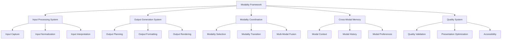
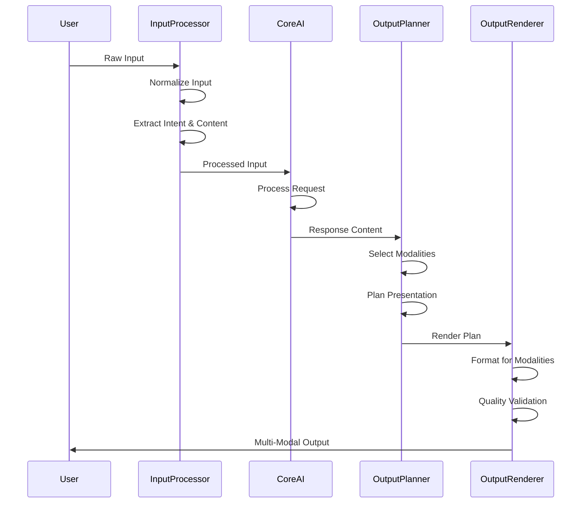
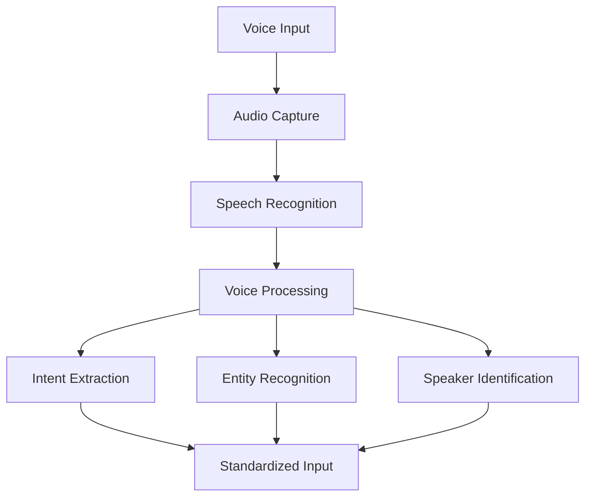
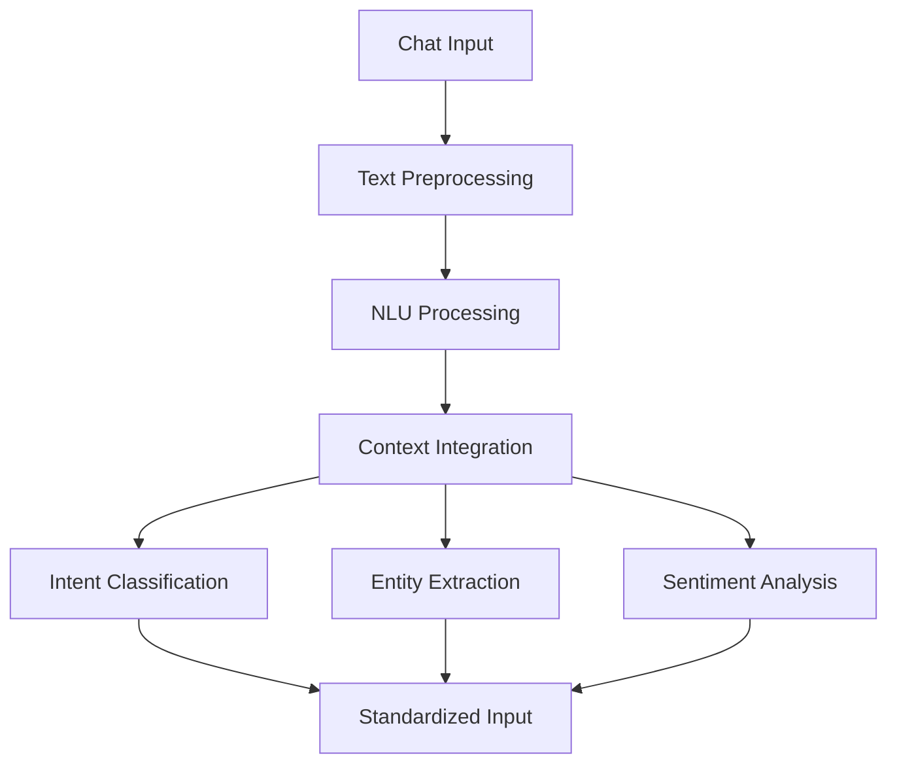
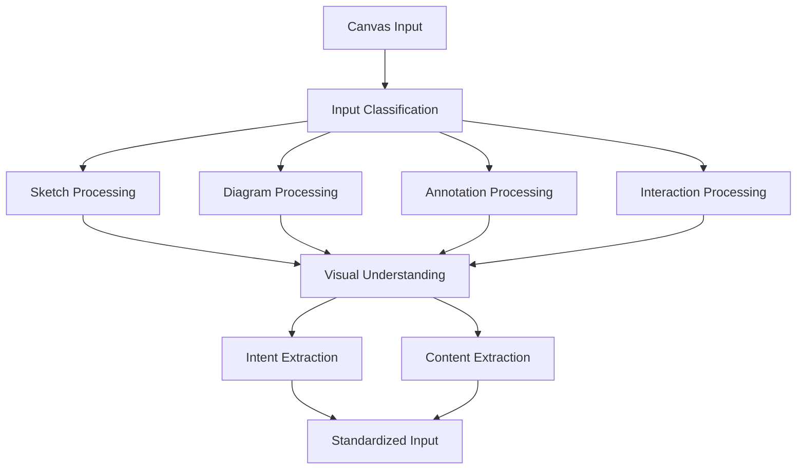
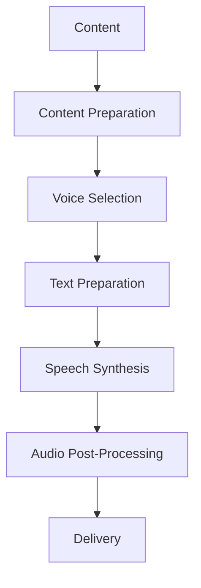
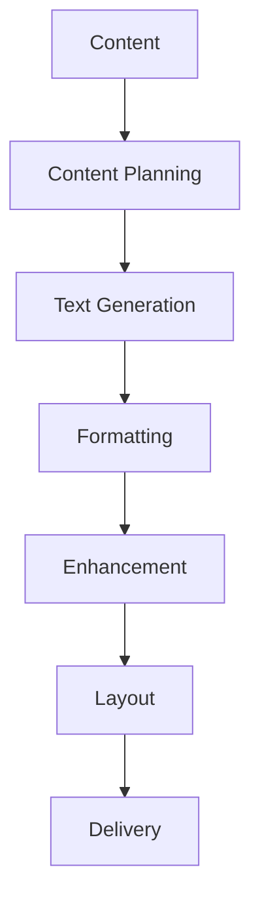
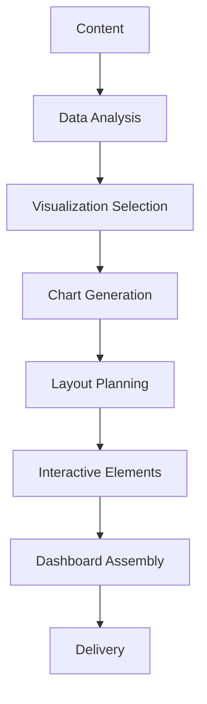
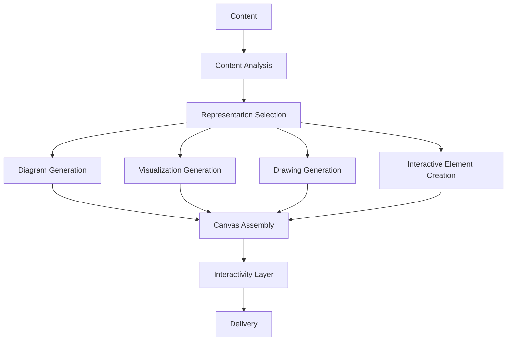
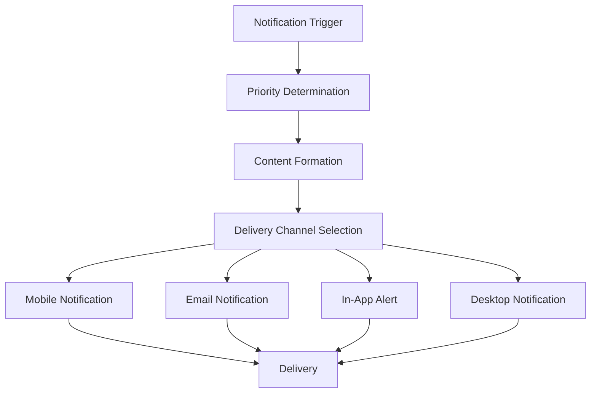

# Cortex Platform: Input/Output Modalities Implementation

_Version: 1.0_  
_Date: 2025-03-04_

## Introduction

This document provides technical implementation details for the input and output modalities of the Cortex Platform. The modality system enables rich, multi-channel interaction with the Core AI, creating a seamless and natural user experience across different interfaces. The implementation approach addresses several key considerations:

1. Consistent handling of diverse input formats
2. Flexible output generation across different channels
3. Fluid modality transitions and cross-modal experiences
4. High-quality rendering in each modality
5. Extensibility to support future modality types

The Cortex Platform currently supports these primary modalities:

**Input Modalities:**

- Voice (speech input)
- Chat (text input)
- Canvas (visual/drawing input)

**Output Modalities:**

- Voice (speech output)
- Chat (text output)
- Dashboard (structured information visualization)
- Canvas (visual output and interactive elements)
- Notification (alerts and updates)

## Modality Framework Architecture

### High-Level Architecture



### Core Components

#### Input Processing System

The Input Processing System handles diverse input types:

- **Input Capture**: Receives raw input data

  - Device-specific capture
  - Input buffering
  - Input preprocessing
  - Initial validation

- **Input Normalization**: Standardizes input format

  - Modality-specific processing
  - Format conversion
  - Feature extraction
  - Noise reduction

- **Input Interpretation**: Extracts meaning
  - Intent recognition
  - Content analysis
  - Context integration
  - Semantic extraction

#### Output Generation System

The Output Generation System creates appropriate responses:

- **Output Planning**: Determines content

  - Content selection
  - Structure planning
  - Modality-specific adaptation
  - Cross-modal coordination

- **Output Formatting**: Prepares presentation

  - Format-specific rendering
  - Style application
  - Layout determination
  - Accessibility considerations

- **Output Rendering**: Produces final output
  - Device-specific rendering
  - Performance optimization
  - Timing control
  - Verification

#### Modality Coordination

Modality Coordination manages multiple modalities:

- **Modality Selection**: Chooses appropriate channels

  - Context-based selection
  - User preference integration
  - Device capability awareness
  - Content optimization

- **Modality Transition**: Manages modality changes

  - Smooth transition handling
  - State preservation
  - Context continuity
  - Experience coherence

- **Multi-Modal Fusion**: Combines modalities
  - Synchronized presentation
  - Complementary content
  - Cross-modal reinforcement
  - Integrated experience design

#### Cross-Modal Memory

Cross-Modal Memory maintains context across modalities:

- **Modal Context**: Tracks current state

  - Active modality state
  - Input context
  - Output context
  - Interaction state

- **Modal History**: Records past interactions

  - Modality usage patterns
  - Past presentations
  - Interaction outcomes
  - Modal transitions

- **Modal Preferences**: Stores user preferences
  - Preferred modalities
  - Modality-specific settings
  - Accessibility requirements
  - Personalization data

#### Quality System

The Quality System ensures optimal experiences:

- **Quality Validation**: Verifies output quality

  - Modality-specific validation
  - Cross-modal coherence
  - Policy compliance
  - Error detection

- **Presentation Optimization**: Enhances output

  - Performance tuning
  - Visual refinement
  - Audio enhancement
  - Responsive design

- **Accessibility**: Ensures inclusive design
  - Accessibility guidelines compliance
  - Alternative representations
  - Assistive technology support
  - Inclusive interaction design

## Implementation Approach

### Common Processing Pipeline



### Modality Registration System

The system uses a modality registry to manage available modalities:

```python
class ModalityRegistry:
    def __init__(self):
        self.input_modalities = {}
        self.output_modalities = {}

    def register_input_modality(self, modality_id, handler):
        """Register an input modality handler"""
        self.input_modalities[modality_id] = handler

    def register_output_modality(self, modality_id, handler):
        """Register an output modality handler"""
        self.output_modalities[modality_id] = handler

    def get_input_modality(self, modality_id):
        """Get input modality handler by ID"""
        return self.input_modalities.get(modality_id)

    def get_output_modality(self, modality_id):
        """Get output modality handler by ID"""
        return self.output_modalities.get(modality_id)

    def available_input_modalities(self, context):
        """Get available input modalities for context"""
        available = {}
        for modality_id, handler in self.input_modalities.items():
            if handler.is_available(context):
                available[modality_id] = handler
        return available

    def available_output_modalities(self, context):
        """Get available output modalities for context"""
        available = {}
        for modality_id, handler in self.output_modalities.items():
            if handler.is_available(context):
                available[modality_id] = handler
        return available
```

### Modality Handler Interface

Each modality implements a standard interface:

```python
class InputModalityHandler:
    """Base interface for input modality handlers"""

    def is_available(self, context):
        """Check if modality is available in this context"""
        raise NotImplementedError

    def preprocess_input(self, raw_input, context):
        """Preprocess raw input data"""
        raise NotImplementedError

    def extract_content(self, preprocessed, context):
        """Extract content from preprocessed input"""
        raise NotImplementedError

    def extract_intent(self, preprocessed, context):
        """Extract intent from preprocessed input"""
        raise NotImplementedError

    def extract_metadata(self, preprocessed, context):
        """Extract metadata from preprocessed input"""
        raise NotImplementedError

    def process_input(self, raw_input, context):
        """Process complete input and return standardized result"""
        preprocessed = self.preprocess_input(raw_input, context)
        content = self.extract_content(preprocessed, context)
        intent = self.extract_intent(preprocessed, context)
        metadata = self.extract_metadata(preprocessed, context)

        return ProcessedInput(
            modality=self.modality_id,
            content=content,
            intent=intent,
            metadata=metadata,
            context=context
        )
```

```python
class OutputModalityHandler:
    """Base interface for output modality handlers"""

    def is_available(self, context):
        """Check if modality is available in this context"""
        raise NotImplementedError

    def can_render_content(self, content, context):
        """Check if this modality can render the content"""
        raise NotImplementedError

    def plan_output(self, content, context):
        """Create plan for rendering content"""
        raise NotImplementedError

    def format_output(self, plan, context):
        """Format the output according to plan"""
        raise NotImplementedError

    def render_output(self, formatted, context):
        """Render the formatted output"""
        raise NotImplementedError

    def process_output(self, content, context):
        """Process complete output generation"""
        if not self.can_render_content(content, context):
            return UnsupportedOutput(reason="Content not supported by modality")

        plan = self.plan_output(content, context)
        formatted = self.format_output(plan, context)
        rendered = self.render_output(formatted, context)

        return RenderedOutput(
            modality=self.modality_id,
            content=rendered,
            plan=plan,
            context=context
        )
```

## Input Modality Implementations

### Voice Input Implementation

The Voice Input modality processes speech into text and meaning:

#### Architecture



#### Key Components

- **Audio Processing Pipeline**:

  ```python
  class AudioProcessor:
      def process_audio(self, audio_data, context):
          # Preprocess audio
          preprocessed = self._preprocess_audio(audio_data)

          # Extract features
          features = self._extract_features(preprocessed)

          # Enhance audio
          enhanced = self._enhance_audio(preprocessed, features)

          # Segment audio
          segments = self._segment_audio(enhanced)

          return ProcessedAudio(enhanced, segments, features)
  ```

- **Speech Recognition System**:

  ```python
  class SpeechRecognizer:
      def recognize_speech(self, processed_audio, context):
          # Generate transcript
          transcript = self._generate_transcript(processed_audio)

          # Apply post-processing
          corrected = self._post_process_transcript(transcript)

          # Extract paralinguistic features
          paralinguistic = self._extract_paralinguistic(processed_audio)

          return SpeechRecognition(
              text=corrected,
              confidence=self._calculate_confidence(transcript),
              paralinguistic=paralinguistic
          )
  ```

- **Speaker Identification**:
  ```python
  class SpeakerIdentifier:
      def identify_speaker(self, audio, context):
          # Extract voice features
          voice_features = self._extract_voice_features(audio)

          # Match against known speakers
          matches = self._match_speaker(voice_features, context)

          # Select best match
          best_match = self._select_best_match(matches)

          return SpeakerIdentification(
              speaker_id=best_match.id if best_match else None,
              confidence=best_match.confidence if best_match else 0,
              voice_features=voice_features
          )
  ```

#### Implementation Details

- **Voice Capture Optimization**:

  - Adaptive noise cancellation
  - Echo-free recording
  - Far-field voice detection
  - Dynamic range adjustment

- **Recognition Enhancements**:

  - Domain-specific language models
  - Context-aware recognition
  - User-specific adaptation
  - Multi-lingual support

- **Intent Processing**:
  - Command detection
  - Conversation markers
  - Emotional content analysis
  - Voice-specific intent recognition

### Chat Input Implementation

The Chat Input modality processes text messages:

#### Architecture



#### Key Components

- **Text Preprocessing**:

  ```python
  class TextPreprocessor:
      def preprocess_text(self, text, context):
          # Normalize text
          normalized = self._normalize_text(text)

          # Correct errors
          corrected = self._correct_errors(normalized)

          # Tokenize text
          tokens = self._tokenize(corrected)

          # Extract initial metadata
          metadata = self._extract_metadata(text, normalized)

          return PreprocessedText(
              original=text,
              normalized=normalized,
              corrected=corrected,
              tokens=tokens,
              metadata=metadata
          )
  ```

- **NLU Processor**:

  ```python
  class ChatNLUProcessor:
      def process_text(self, preprocessed_text, context):
          # Extract entities
          entities = self._extract_entities(preprocessed_text)

          # Detect intent
          intent = self._detect_intent(preprocessed_text, entities, context)

          # Analyze sentiment
          sentiment = self._analyze_sentiment(preprocessed_text)

          # Extract structured data
          structured = self._extract_structured_data(preprocessed_text, entities)

          return ProcessedChat(
              text=preprocessed_text.corrected,
              entities=entities,
              intent=intent,
              sentiment=sentiment,
              structured_data=structured
          )
  ```

- **Context Integration**:
  ```python
  class ChatContextIntegrator:
      def integrate_context(self, processed_chat, context):
          # Resolve references
          resolved = self._resolve_references(processed_chat, context)

          # Add conversation history context
          with_history = self._add_history_context(resolved, context)

          # Link to entities in memory
          with_memory = self._link_memory_entities(with_history, context)

          # Resolve ambiguities
          disambiguated = self._resolve_ambiguities(with_memory, context)

          return ContextualizedChat(
              original=processed_chat,
              resolved_entities=disambiguated.entities,
              resolved_intent=disambiguated.intent,
              references=disambiguated.references,
              confidence=self._calculate_confidence(disambiguated)
          )
  ```

#### Implementation Details

- **Text Enhancement**:

  - Autocorrection
  - Normalization of informal text
  - Abbreviation expansion
  - Multi-language support

- **Chat-Specific Processing**:

  - Message threading
  - Emoji interpretation
  - Code block handling
  - Formatting preservation

- **Interactive Elements**:
  - Button click processing
  - Form submission handling
  - Selection processing
  - Interactive component state management

### Canvas Input Implementation

The Canvas Input modality processes visual and spatial input:

#### Architecture



#### Key Components

- **Input Classifier**:

  ```python
  class CanvasInputClassifier:
      def classify_input(self, input_data, context):
          # Determine input type
          input_type = self._determine_type(input_data)

          # Extract input features
          features = self._extract_features(input_data, input_type)

          # Detect objects/elements
          elements = self._detect_elements(input_data, input_type)

          return ClassifiedCanvasInput(
              type=input_type,
              features=features,
              elements=elements,
              confidence=self._calculate_confidence(input_type, features)
          )
  ```

- **Sketch Processor**:

  ```python
  class SketchProcessor:
      def process_sketch(self, sketch_data, context):
          # Extract strokes
          strokes = self._extract_strokes(sketch_data)

          # Recognize shapes
          shapes = self._recognize_shapes(strokes)

          # Detect relationships
          relationships = self._detect_relationships(shapes)

          # Interpret sketch
          interpretation = self._interpret_sketch(shapes, relationships)

          return ProcessedSketch(
              shapes=shapes,
              relationships=relationships,
              interpretation=interpretation,
              confidence=self._calculate_confidence(interpretation)
          )
  ```

- **Spatial Analyzer**:
  ```python
  class SpatialAnalyzer:
      def analyze_spatial_arrangement(self, elements, context):
          # Determine spatial relationships
          relationships = self._determine_relationships(elements)

          # Create spatial hierarchy
          hierarchy = self._create_hierarchy(elements, relationships)

          # Extract semantic meaning
          semantics = self._extract_semantics(elements, relationships, hierarchy)

          return SpatialAnalysis(
              relationships=relationships,
              hierarchy=hierarchy,
              semantics=semantics
          )
  ```

#### Implementation Details

- **Sketch Recognition Techniques**:

  - Stroke analysis
  - Shape recognition
  - Pattern matching
  - Gesture detection

- **Diagram Understanding**:

  - Node-edge detection
  - Layout analysis
  - Semantic interpretation
  - Diagram classification

- **Interactive Elements**:
  - Selection handling
  - Manipulation tracking
  - Action recognition
  - Multi-touch interaction

## Output Modality Implementations

### Voice Output Implementation

The Voice Output modality generates speech from content:

#### Architecture



#### Key Components

- **Text Preparation**:

  ```python
  class TextPreparationForSpeech:
      def prepare_text(self, content, voice_settings):
          # Normalize text for speech
          normalized = self._normalize_for_speech(content)

          # Add speech markers
          marked = self._add_speech_markers(normalized)

          # Process special content
          processed = self._process_special_content(marked)

          # Segment into utterances
          segmented = self._segment_into_utterances(processed)

          return PreparedText(
              segments=segmented,
              markers=self._extract_markers(marked),
              pronunciation_guides=self._create_pronunciation_guides(content)
          )
  ```

- **Speech Synthesizer**:

  ```python
  class SpeechSynthesizer:
      def synthesize_speech(self, prepared_text, voice_settings):
          audio_segments = []

          for segment in prepared_text.segments:
              # Generate raw audio
              raw_audio = self._generate_audio(segment, voice_settings)

              # Apply prosody
              with_prosody = self._apply_prosody(raw_audio, segment, voice_settings)

              # Enhance quality
              enhanced = self._enhance_quality(with_prosody)

              audio_segments.append(enhanced)

          # Combine segments
          combined = self._combine_segments(audio_segments)

          return SynthesizedSpeech(
              audio=combined,
              timing_data=self._extract_timing_data(combined, prepared_text),
              quality_metrics=self._measure_quality(combined)
          )
  ```

- **Voice Selection**:
  ```python
  class VoiceSelector:
      def select_voice(self, content, context):
          # Determine content characteristics
          characteristics = self._analyze_content(content)

          # Check user preferences
          preferences = self._get_user_preferences(context)

          # Match voice to content and preferences
          matches = self._match_voices(characteristics, preferences)

          # Select best match
          best_match = self._select_best_match(matches)

          return VoiceSelection(
              voice_id=best_match.id,
              settings=best_match.settings,
              rationale=best_match.rationale
          )
  ```

#### Implementation Details

- **Voice Customization**:

  - User-specific voice selection
  - Emotion-appropriate voices
  - Domain-specific voice characteristics
  - Personalized pronunciation

- **Natural Prosody**:

  - Contextual emphasis
  - Natural pausing
  - Intonation patterns
  - Rhythm variation

- **Audio Enhancement**:
  - Quality optimization
  - Background noise consideration
  - Device-specific tuning
  - Bandwidth adaptation

### Chat Output Implementation

The Chat Output modality generates text-based responses:

#### Architecture



#### Key Components

- **Content Planner**:

  ```python
  class ChatContentPlanner:
      def plan_content(self, content, context):
          # Determine message structure
          structure = self._determine_structure(content)

          # Plan content blocks
          blocks = self._plan_content_blocks(content, structure)

          # Sequence blocks
          sequence = self._sequence_blocks(blocks)

          # Plan interactive elements
          interactives = self._plan_interactives(content, context)

          return ContentPlan(
              structure=structure,
              blocks=blocks,
              sequence=sequence,
              interactives=interactives
          )
  ```

- **Text Generator**:

  ```python
  class ChatTextGenerator:
      def generate_text(self, content_plan, context):
          blocks = []

          for block in content_plan.blocks:
              # Generate block content
              block_content = self._generate_block(block, context)

              # Apply style
              styled = self._apply_style(block_content, block, context)

              # Add formatting
              formatted = self._add_formatting(styled, block)

              blocks.append(formatted)

          # Combine blocks
          combined = self._combine_blocks(blocks, content_plan.sequence)

          # Add interactive elements
          with_interactives = self._add_interactives(combined, content_plan.interactives)

          return GeneratedChatText(
              content=with_interactives,
              blocks=blocks,
              interactives=self._extract_interactives(with_interactives)
          )
  ```

- **Layout Manager**:
  ```python
  class ChatLayoutManager:
      def create_layout(self, generated_text, context):
          # Determine overall layout
          layout = self._determine_layout(context)

          # Position message elements
          positioned = self._position_elements(generated_text, layout)

          # Handle responsive considerations
          responsive = self._apply_responsive_rules(positioned, layout)

          # Optimize for device
          optimized = self._optimize_for_device(responsive, context)

          return ChatLayout(
              layout=layout,
              elements=optimized,
              responsive_rules=self._extract_responsive_rules(responsive)
          )
  ```

#### Implementation Details

- **Text Formatting**:

  - Rich text formatting
  - Code block formatting
  - List formatting
  - Table formatting

- **Interactive Elements**:

  - Button generation
  - Quick reply options
  - Form elements
  - Interactive cards

- **Conversation Flow**:
  - Message threading
  - Related message grouping
  - Temporal sequencing
  - Contextual references

### Dashboard Output Implementation

The Dashboard Output modality creates data visualizations:

#### Architecture



#### Key Components

- **Data Analyzer**:

  ```python
  class DashboardDataAnalyzer:
      def analyze_data(self, content):
          # Extract data
          data = self._extract_data(content)

          # Determine data properties
          properties = self._determine_properties(data)

          # Identify relationships
          relationships = self._identify_relationships(data)

          # Determine key insights
          insights = self._extract_insights(data, relationships)

          return AnalyzedData(
              data=data,
              properties=properties,
              relationships=relationships,
              insights=insights
          )
  ```

- **Visualization Selector**:

  ```python
  class VisualizationSelector:
      def select_visualizations(self, analyzed_data, context):
          visualizations = []

          for insight in analyzed_data.insights:
              # Determine appropriate visualization types
              viz_types = self._determine_viz_types(insight, analyzed_data)

              # Rank visualization options
              ranked = self._rank_options(viz_types, insight, context)

              # Select best option
              selected = self._select_best(ranked)

              visualizations.append({
                  'insight': insight,
                  'visualization': selected,
                  'data': self._extract_relevant_data(analyzed_data, insight)
              })

          return SelectedVisualizations(visualizations)
  ```

- **Dashboard Composer**:
  ```python
  class DashboardComposer:
      def compose_dashboard(self, visualizations, content, context):
          # Create layout
          layout = self._create_layout(visualizations, context)

          # Generate visualizations
          generated = self._generate_visualizations(visualizations, layout)

          # Add interactive elements
          interactive = self._add_interactivity(generated, visualizations)

          # Add context elements
          with_context = self._add_context(interactive, content)

          # Optimize presentation
          optimized = self._optimize_presentation(with_context, context)

          return Dashboard(
              layout=layout,
              visualizations=generated,
              interactives=self._extract_interactives(interactive),
              metadata=self._create_metadata(visualizations, content)
          )
  ```

#### Implementation Details

- **Visualization Types**:

  - Charts (bar, line, pie, etc.)
  - Tables and data grids
  - Maps and geospatial visualizations
  - Network and relationship graphs
  - KPI cards and metrics

- **Interactive Features**:

  - Filtering capabilities
  - Drill-down functionality
  - Sorting options
  - Dynamic data loading
  - Cross-filtering between visualizations

- **Layout Optimization**:
  - Responsive design
  - Visual hierarchy
  - Information density management
  - Device-specific optimization
  - Print-friendly options

### Canvas Output Implementation

The Canvas Output modality creates visual and interactive content:

#### Architecture



#### Key Components

- **Representation Selector**:

  ```python
  class CanvasRepresentationSelector:
      def select_representation(self, content, context):
          # Analyze content
          analyzed = self._analyze_content(content)

          # Determine possible representations
          representations = self._determine_representations(analyzed)

          # Evaluate representations
          evaluated = self._evaluate_representations(representations, context)

          # Select best representation
          selected = self._select_best(evaluated)

          return SelectedRepresentation(
              type=selected.type,
              elements=selected.elements,
              structure=selected.structure,
              rationale=selected.rationale
          )
  ```

- **Diagram Generator**:

  ```python
  class DiagramGenerator:
      def generate_diagram(self, representation, content):
          # Create diagram structure
          structure = self._create_structure(representation)

          # Generate elements
          elements = self._generate_elements(structure, representation)

          # Establish relationships
          relationships = self._establish_relationships(elements, representation)

          # Apply visual styling
          styled = self._apply_styling(elements, relationships, representation)

          # Layout diagram
          layout = self._create_layout(styled, representation)

          return GeneratedDiagram(
              type=representation.type,
              elements=elements,
              relationships=relationships,
              layout=layout,
              styling=self._extract_styling(styled)
          )
  ```

- **Canvas Assembler**:
  ```python
  class CanvasAssembler:
      def assemble_canvas(self, generated_elements, context):
          # Create base canvas
          canvas = self._create_canvas(context)

          # Position elements
          positioned = self._position_elements(generated_elements, canvas)

          # Establish relationships
          with_relationships = self._establish_relationships(positioned)

          # Add annotations
          annotated = self._add_annotations(with_relationships)

          # Apply final styling
          styled = self._apply_styling(annotated, context)

          return AssembledCanvas(
              canvas=canvas,
              elements=styled,
              metadata=self._create_metadata(generated_elements)
          )
  ```

#### Implementation Details

- **Visual Representation Types**:

  - Diagrams (flowcharts, UML, etc.)
  - Mind maps and concept maps
  - Process visualizations
  - Spatial layouts
  - Sketches and drawings

- **Interactive Features**:

  - Zoom and pan
  - Element selection and manipulation
  - Annotation capabilities
  - Dynamic updates
  - Collaborative editing

- **Styling and Aesthetics**:
  - Visual theming
  - Layout aesthetics
  - Consistent styling
  - Visual hierarchy
  - Brand alignment

### Notification Output Implementation

The Notification Output modality creates alerts and updates:

#### Architecture



#### Key Components

- **Priority Determinator**:

  ```python
  class NotificationPriorityDeterminator:
      def determine_priority(self, notification, context):
          # Assess notification content
          content_priority = self._assess_content(notification)

          # Consider user settings
          user_settings = self._get_user_settings(context)

          # Analyze context
          context_factors = self._analyze_context(context)

          # Calculate final priority
          priority = self._calculate_priority(content_priority, user_settings, context_factors)

          return NotificationPriority(
              level=priority.level,
              factors=priority.factors,
              rationale=priority.rationale
          )
  ```

- **Content Formatter**:

  ```python
  class NotificationContentFormatter:
      def format_content(self, notification, priority, context):
          # Create title
          title = self._create_title(notification, priority)

          # Create body
          body = self._create_body(notification, priority)

          # Determine actions
          actions = self._determine_actions(notification, context)

          # Add imagery if appropriate
          imagery = self._add_imagery(notification, priority)

          return FormattedNotification(
              title=title,
              body=body,
              actions=actions,
              imagery=imagery,
              metadata=self._create_metadata(notification, priority)
          )
  ```

- **Channel Selector**:
  ```python
  class NotificationChannelSelector:
      def select_channels(self, notification, priority, context):
          channels = []

          # Get available channels
          available = self._get_available_channels(context)

          # Match channels to notification
          matched = self._match_channels(available, notification, priority)

          # Consider user preferences
          with_preferences = self._apply_preferences(matched, context)

          # Consider timing and context
          final = self._apply_timing_rules(with_preferences, context)

          return SelectedChannels(
              channels=final,
              primary=self._determine_primary(final),
              rationale=self._create_rationale(final, notification)
          )
  ```

#### Implementation Details

- **Notification Types**:

  - Updates (information sharing)
  - Alerts (attention required)
  - Reminders (scheduled notifications)
  - Status changes (state information)
  - Action requests (user action needed)

- **Delivery Channels**:

  - Mobile push notifications
  - Email notifications
  - In-app alerts
  - Desktop notifications
  - SMS messages

- **User Control**:
  - Notification preferences
  - Priority settings
  - Channel settings
  - Do-not-disturb periods
  - Notification grouping preferences

## Cross-Modal Coordination

### Modality Selection Logic

The system selects appropriate modalities using these factors:

```python
class ModalitySelector:
    def select_modalities(self, content, context):
        # Analyze content
        content_analysis = self._analyze_content(content)

        # Check device capabilities
        device_capabilities = self._get_device_capabilities(context)

        # Consider user preferences
        user_preferences = self._get_user_preferences(context)

        # Analyze environmental factors
        environment = self._analyze_environment(context)

        # Determine appropriate modalities
        candidates = self._determine_candidates(
            content_analysis,
            device_capabilities,
            user_preferences,
            environment
        )

        # Rank modalities
        ranked = self._rank_modalities(candidates)

        # Select primary and secondary modalities
        selected = self._make_final_selection(ranked)

        return SelectedModalities(
            primary=selected.primary,
            secondary=selected.secondary,
            rationale=selected.rationale
        )
```

### Cross-Modal Presentation

Coordinating content across multiple modalities:

```python
class CrossModalPresenter:
    def create_presentation(self, content, selected_modalities, context):
        # Plan cross-modal presentation
        plan = self._create_presentation_plan(content, selected_modalities)

        # Allocate content to modalities
        allocation = self._allocate_content(content, plan)

        # Create synchronization plan
        sync_plan = self._create_sync_plan(allocation)

        # Format for each modality
        formatted = {}
        for modality, allocated_content in allocation.items():
            handler = self._get_modality_handler(modality)
            formatted[modality] = handler.format_output(allocated_content, context)

        # Create integrated presentation
        integrated = self._integrate_presentation(formatted, sync_plan)

        return CrossModalPresentation(
            modalities=selected_modalities,
            content_allocation=allocation,
            formatted_content=formatted,
            synchronization=sync_plan,
            integrated=integrated
        )
```

### Transition Management

Managing transitions between modalities:

```python
class ModalityTransitionManager:
    def manage_transition(self, from_modality, to_modality, context):
        # Create transition plan
        plan = self._create_transition_plan(from_modality, to_modality, context)

        # Prepare source modality
        source_preparation = self._prepare_source(from_modality, plan)

        # Prepare target modality
        target_preparation = self._prepare_target(to_modality, plan)

        # Create transition effects
        effects = self._create_effects(from_modality, to_modality, plan)

        # Execute transition
        execution = self._execute_transition(source_preparation, target_preparation, effects)

        return TransitionResult(
            from_modality=from_modality,
            to_modality=to_modality,
            plan=plan,
            execution=execution
        )
```

## Quality Assurance

### Modality-Specific Testing

Each modality undergoes specific testing:

```python
class ModalityTester:
    def test_modality(self, modality_handler, test_suite):
        results = []

        for test_case in test_suite:
            # Prepare test
            prepared = self._prepare_test(test_case, modality_handler)

            # Execute test
            execution = self._execute_test(prepared, modality_handler)

            # Validate results
            validation = self._validate_results(execution, test_case)

            results.append({
                'test_id': test_case.id,
                'result': validation.result,
                'metrics': validation.metrics,
                'issues': validation.issues
            })

        return TestResults(
            modality=modality_handler.modality_id,
            pass_rate=self._calculate_pass_rate(results),
            results=results,
            summary=self._create_summary(results)
        )
```

### Cross-Modal Testing

Testing coordination across modalities:

```python
class CrossModalTester:
    def test_cross_modal_experience(self, test_suite):
        results = []

        for test_case in test_suite:
            # Prepare modalities
            prepared = self._prepare_modalities(test_case)

            # Execute cross-modal test
            execution = self._execute_test(prepared, test_case)

            # Test transitions
            transitions = self._test_transitions(prepared, test_case)

            # Validate cross-modal experience
            validation = self._validate_experience(execution, transitions, test_case)

            results.append({
                'test_id': test_case.id,
                'result': validation.result,
                'transitions': transitions,
                'experience': validation.experience,
                'issues': validation.issues
            })

        return CrossModalTestResults(
            pass_rate=self._calculate_pass_rate(results),
            results=results,
            summary=self._create_summary(results)
        )
```

### Accessibility Validation

Ensuring inclusive experiences:

```python
class AccessibilityValidator:
    def validate_accessibility(self, modality_handler, content):
        checks = []

        # Get accessibility guidelines
        guidelines = self._get_guidelines(modality_handler.modality_id)

        for guideline in guidelines:
            # Execute check
            check_result = self._execute_check(guideline, modality_handler, content)

            # Document findings
            findings = self._document_findings(check_result)

            # Suggest improvements
            improvements = self._suggest_improvements(check_result, findings)

            checks.append({
                'guideline': guideline.id,
                'result': check_result.result,
                'findings': findings,
                'improvements': improvements
            })

        return AccessibilityValidation(
            modality=modality_handler.modality_id,
            compliance_rate=self._calculate_compliance(checks),
            checks=checks,
            summary=self._create_summary(checks)
        )
```

## Integration Points

### Core AI Integration

Integration with the Core AI system:

```python
class CoreAIModalityConnector:
    def process_input(self, modal_input, context):
        # Standardize input
        standardized = self._standardize_input(modal_input)

        # Extract key elements
        extracted = self._extract_elements(standardized)

        # Add context metadata
        with_context = self._add_context_metadata(extracted, context)

        # Send to Core AI
        response = self._send_to_core_ai(with_context)

        return CoreAIResponse(
            original_input=modal_input,
            processed_input=standardized,
            core_response=response
        )

    def handle_output(self, core_output, context):
        # Analyze output requirements
        requirements = self._analyze_requirements(core_output)

        # Select appropriate modalities
        modalities = self._select_modalities(requirements, context)

        # Allocate content to modalities
        allocation = self._allocate_content(core_output, modalities)

        # Format for each modality
        formatted = {}
        for modality, content in allocation.items():
            handler = self._get_modality_handler(modality)
            formatted[modality] = handler.format_output(content, context)

        return FormattedOutput(
            modalities=modalities,
            allocation=allocation,
            formatted=formatted
        )
```

### Client Integration

Integration with client applications:

```javascript
// Client-side integration
class ModalityManager {
  constructor(config) {
    this.availableModalities = {};
    this.activeModalities = {};
    this.modalityPreferences = config.preferences || {};

    // Initialize modalities
    this._initializeModalities(config);
  }

  // Register input handlers
  registerInputHandlers() {
    for (const [id, modality] of Object.entries(this.availableModalities)) {
      if (modality.type === "input") {
        this._registerInputHandler(id, modality);
      }
    }
  }

  // Process output from server
  handleOutput(output) {
    // Activate needed modalities
    this._activateRequiredModalities(output.modalities);

    // Render each modality
    for (const [id, content] of Object.entries(output.content)) {
      if (this.activeModalities[id]) {
        this.activeModalities[id].render(content);
      }
    }

    // Handle transitions
    if (output.transitions) {
      this._handleTransitions(output.transitions);
    }
  }

  // Handle modality transitions
  _handleTransitions(transitions) {
    for (const transition of transitions) {
      const from = this.activeModalities[transition.from];
      const to = this.activeModalities[transition.to];

      if (from && to) {
        // Execute transition
        from.prepareTransition(transition);
        to.prepareTransition(transition);
        this._executeTransition(transition, from, to);
      }
    }
  }
}
```

### Extension Framework

Framework for adding new modalities:

```python
class ModalityExtensionManager:
    def __init__(self):
        self.registry = ModalityRegistry()
        self.extension_points = self._initialize_extension_points()

    def register_modality_extension(self, extension_config):
        # Validate extension
        validation = self._validate_extension(extension_config)
        if not validation.valid:
            return ValidationError(validation.errors)

        # Create modality instances
        input_handler = None
        output_handler = None

        if 'input' in extension_config:
            input_class = self._load_class(extension_config['input']['handler_class'])
            input_handler = input_class(extension_config['input']['config'])

        if 'output' in extension_config:
            output_class = self._load_class(extension_config['output']['handler_class'])
            output_handler = output_class(extension_config['output']['config'])

        # Register handlers
        extension_id = extension_config['id']
        if input_handler:
            self.registry.register_input_modality(extension_id, input_handler)

        if output_handler:
            self.registry.register_output_modality(extension_id, output_handler)

        return RegistrationResult(
            id=extension_id,
            input_registered=input_handler is not None,
            output_registered=output_handler is not None
        )
```

## Implementation Considerations

### Performance Optimization

Strategies for performance optimization:

- **Real-time Processing**:

  - Streaming processing for continuous input
  - Incremental output generation
  - Response time optimization
  - Background processing for intensive operations

- **Resource Management**:

  - Dynamic resource allocation
  - Prioritized processing
  - Cacheable elements
  - Progressive enhancement

- **Client-Server Optimization**:
  - Appropriate task distribution
  - Network efficiency
  - State synchronization
  - Connection resilience

### Development Roadmap

Implementation phases:

1. **Foundation Phase** (Q2-Q3 2025):

   - Core voice, chat, and dashboard modalities
   - Basic modality framework
   - Initial cross-modal capability
   - Essential accessibility features

2. **Enhancement Phase** (Q4 2025):

   - Canvas modality implementation
   - Advanced cross-modal coordination
   - Improved quality systems
   - Extended accessibility

3. **Optimization Phase** (Q1-Q2 2026):

   - Performance optimization
   - Advanced device adaptation
   - Full accessibility compliance
   - Extended cross-modal capabilities

4. **Ecosystem Phase** (Q3-Q4 2026):
   - Extensibility framework
   - Third-party modality integration
   - Advanced coordination patterns
   - Specialized domain adaptations

### Quality Metrics

Key quality metrics for modalities:

- **Performance Metrics**:

  - Processing time
  - Rendering time
  - Resource utilization
  - Latency

- **Quality Metrics**:

  - Recognition accuracy
  - Output fidelity
  - User satisfaction
  - Accessibility compliance

- **Cross-Modal Metrics**:
  - Transition smoothness
  - Content continuity
  - Modal consistency
  - Experience coherence

## Conclusion

The Input/Output Modalities Implementation provides the technical foundation for the diverse interaction channels of the Cortex Platform. By implementing a consistent framework for modality handling while accommodating the unique characteristics of each modality, the system enables natural, intuitive interactions across different contexts and devices.

The implementation supports seamless transitions between modalities and coordinated multi-modal experiences, ensuring that users can interact with the platform in the most natural and effective way for their current context. Strong integration with the Core AI system ensures that the intelligence of the platform is consistently expressed regardless of the chosen interaction modality.

As the platform evolves, the modality framework will continue to expand, incorporating new interaction methods and enhancing existing ones. This evolution will be guided by user feedback, technological advancements, and the ongoing commitment to accessible, high-quality user experiences.
