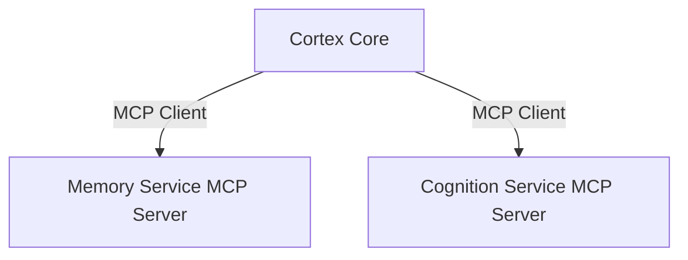

# Cortex Core Backend Services

This document details the MCP-based backend services that the Cortex Core communicates with. It covers the implementation of these services using FastMCP, their interfaces, and how they integrate with the core.

## Overview

The Cortex Core acts as an MCP client that communicates with several backend services:

1. **Memory Service**: Stores and retrieves user inputs and conversation history
2. **Cognition Service**: Processes context and provides relevant information

Each service implements the MCP server protocol using FastMCP and exposes tools and resources that the core can use.



## MCP Concepts

The Model Context Protocol (MCP) enables standardized communication between the Cortex Core (client) and backend services (servers):

- **Tools**: Executable functions that can perform operations and have side effects
- **Resources**: Data that can be accessed and read
- **Server**: An MCP server that exposes tools and resources

For our implementation, we'll use the `FastMCP` approach from the Python SDK which simplifies server creation.

## Memory Service

### Purpose

The Memory Service is responsible for:

1. Storing input from users (via the Cortex Core)
2. Providing access to stored history and context
3. Maintaining user-partitioned data storage

### Interface

#### Tools

1. **store_input**
   - **Purpose**: Store user input data
   - **Arguments**:
     - `user_id`: String - User identifier
     - `input_data`: Object - The input data to store
   - **Returns**: Object - Status of the operation

#### Resources

1. **history/{user_id}**
   - **Purpose**: Retrieve stored history for a user
   - **Parameters**:
     - `user_id`: String - User identifier
   - **Returns**: Object - Array of stored inputs

### Implementation

Here's a minimal implementation of the Memory Service using FastMCP:

```python
# memory_service.py
import os
import uuid
from datetime import datetime
from typing import Dict, List, Any
from mcp.server.fastmcp import FastMCP

# Initialize the MCP server
mcp = FastMCP("MemoryService")

# In-memory storage (dictionary by user_id)
memory_store: Dict[str, List[Dict[str, Any]]] = {}

@mcp.tool()
def store_input(user_id: str, input_data: Dict[str, Any]) -> Dict[str, Any]:
    """
    Store input data for a specific user.

    Args:
        user_id: The unique user identifier
        input_data: The input data to store

    Returns:
        Status object with operation result
    """
    # Create user store if it doesn't exist
    if user_id not in memory_store:
        memory_store[user_id] = []

    # Add timestamp if not present
    if "timestamp" not in input_data:
        input_data["timestamp"] = datetime.now().isoformat()

    # Add unique ID if not present
    if "id" not in input_data:
        input_data["id"] = str(uuid.uuid4())

    # Store the input
    memory_store[user_id].append(input_data)

    # Return status
    return {
        "status": "stored",
        "user_id": user_id,
        "item_id": input_data["id"]
    }

@mcp.resource("history/{user_id}")
def get_history(user_id: str) -> List[Dict[str, Any]]:
    """
    Get history for a specific user.

    Args:
        user_id: The unique user identifier

    Returns:
        List containing the user's history
    """
    # Get history (or empty list if not found)
    history = memory_store.get(user_id, [])

    # Return history
    return history

# Additional resource for getting a limited history
@mcp.resource("history/{user_id}/limit/{limit}")
def get_limited_history(user_id: str, limit: int) -> List[Dict[str, Any]]:
    """
    Get limited history for a specific user.

    Args:
        user_id: The unique user identifier
        limit: Maximum number of items to return

    Returns:
        List containing the user's limited history
    """
    # Get history (or empty list if not found)
    history = memory_store.get(user_id, [])

    # Apply limit (most recent items first)
    limited_history = sorted(
        history,
        key=lambda x: x.get("timestamp", ""),
        reverse=True
    )[:int(limit)]

    # Return limited history
    return limited_history

if __name__ == "__main__":
    # You can run this file directly for testing
    mcp.run()
```

### Storage Options

1. **In-Memory Storage**: For development and testing (shown above)
2. **SQLite Storage**: For simple persistent storage
3. **PostgreSQL Storage**: For production deployment

## Cognition Service

### Purpose

The Cognition Service is responsible for:

1. Processing and analyzing stored data
2. Providing relevant context based on user interactions
3. Generating insights from conversation history

### Interface

#### Tools

1. **get_context**
   - **Purpose**: Get relevant context for a user
   - **Arguments**:
     - `user_id`: String - User identifier
     - `query`: String (optional) - Context query
     - `limit`: Integer (optional) - Maximum items to return
   - **Returns**: Object - Relevant context

### Implementation

Here's a minimal implementation of the Cognition Service using FastMCP:

```python
# cognition_service.py
import os
import httpx
from typing import Dict, List, Any, Optional
from mcp.server.fastmcp import FastMCP

# Initialize the MCP server
mcp = FastMCP("CognitionService")

# Configuration
MEMORY_SERVICE_URL = os.environ.get("MEMORY_SERVICE_URL", "http://localhost:9000")

@mcp.tool()
async def get_context(
    user_id: str,
    query: Optional[str] = None,
    limit: Optional[int] = 10
) -> Dict[str, Any]:
    """
    Get relevant context for a user.

    Args:
        user_id: The unique user identifier
        query: Optional search query to filter context
        limit: Maximum number of items to return

    Returns:
        Object containing relevant context items
    """
    try:
        # For MVP, simply retrieve history from Memory Service
        async with httpx.AsyncClient() as client:
            # Use limit parameter if provided
            url = f"{MEMORY_SERVICE_URL}/resource/history/{user_id}/limit/{limit}"

            response = await client.get(url)
            response.raise_for_status()

            # Get history from response
            history = response.json()

            # For MVP, just return the history as context
            # In future versions, this would implement relevance sorting,
            # semantic search, etc.
            return {
                "context": history,
                "user_id": user_id,
                "query": query,
                "count": len(history)
            }
    except Exception as e:
        # Return empty context on error
        return {
            "context": [],
            "user_id": user_id,
            "query": query,
            "count": 0,
            "error": str(e)
        }

if __name__ == "__main__":
    # You can run this file directly for testing
    mcp.run()
```

### Future Enhancements

The initial Cognition Service is intentionally minimal. Future enhancements could include:

1. **Semantic Search**: Finding contextually relevant items beyond exact matches
2. **Summarization**: Generating summaries of conversation history
3. **Entity Extraction**: Identifying key entities in conversations
4. **Intent Recognition**: Understanding user intentions from history

## Integrating with the Cortex Core

### MCP Client Implementation

The Cortex Core connects to these services using MCP clients:

```python
# In Cortex Core
from mcp import ClientSession, types
from mcp.client.sse import sse_client

async def connect_to_memory_service(url: str):
    """Connect to the Memory Service via MCP"""
    async with sse_client(url) as (read, write):
        async with ClientSession(read, write) as session:
            # Initialize the connection
            await session.initialize()

            # Store input
            result = await session.call_tool(
                "store_input",
                arguments={
                    "user_id": "test-user",
                    "input_data": {"message": "Hello world"}
                }
            )

            # Get history
            history, mime_type = await session.read_resource("history/test-user")

            return history

async def connect_to_cognition_service(url: str):
    """Connect to the Cognition Service via MCP"""
    async with sse_client(url) as (read, write):
        async with ClientSession(read, write) as session:
            # Initialize the connection
            await session.initialize()

            # Get context
            context = await session.call_tool(
                "get_context",
                arguments={
                    "user_id": "test-user",
                    "limit": 10
                }
            )

            return context
```

### Service Client Classes

For the Cortex Core, it's helpful to wrap the raw MCP clients in service-specific classes:

```python
# memory_service_client.py
from mcp import ClientSession
from typing import Dict, List, Any

class MemoryServiceClient:
    def __init__(self, session: ClientSession):
        self.session = session

    async def store_input(self, user_id: str, input_data: Dict[str, Any]) -> Dict[str, Any]:
        """Store input data for user"""
        return await self.session.call_tool(
            "store_input",
            arguments={
                "user_id": user_id,
                "input_data": input_data
            }
        )

    async def get_history(self, user_id: str) -> List[Dict[str, Any]]:
        """Get history for user"""
        history, _ = await self.session.read_resource(f"history/{user_id}")
        return history

# cognition_service_client.py
from mcp import ClientSession
from typing import Dict, List, Any, Optional

class CognitionServiceClient:
    def __init__(self, session: ClientSession):
        self.session = session

    async def get_context(
        self,
        user_id: str,
        query: Optional[str] = None,
        limit: Optional[int] = 10
    ) -> Dict[str, Any]:
        """Get context for user"""
        return await self.session.call_tool(
            "get_context",
            arguments={
                "user_id": user_id,
                "query": query,
                "limit": limit
            }
        )
```

## Environment Variables

Each service should be configurable via environment variables:

**Memory Service**:

```env
PORT=9000
STORAGE_TYPE=memory  # 'memory', 'sqlite', or 'postgres'
DATABASE_URL=sqlite:///memory_service.db  # for sqlite or postgres
```

**Cognition Service**:

```env
PORT=9100
MEMORY_SERVICE_URL=http://localhost:9000
```

## Testing

### Unit Testing Memory Service

```python
import unittest
from unittest.mock import patch, MagicMock
import json
from memory_service import store_input, get_history

class TestMemoryService(unittest.TestCase):
    def setUp(self):
        # Clear memory store before each test
        global memory_store
        memory_store = {}

    async def test_store_input(self):
        # Test storing input
        result = await store_input("user1", {"message": "Hello"})

        # Verify result
        self.assertEqual(result["status"], "stored")
        self.assertEqual(result["user_id"], "user1")

        # Verify storage
        self.assertEqual(len(memory_store["user1"]), 1)
        self.assertEqual(memory_store["user1"][0]["message"], "Hello")

    async def test_get_history(self):
        # Store test data
        await store_input("user1", {"message": "Hello"})
        await store_input("user1", {"message": "World"})

        # Test retrieving history
        result = await get_history("user1")

        # Verify result
        self.assertEqual(len(result), 2)
        self.assertEqual(result[0]["message"], "Hello")
        self.assertEqual(result[1]["message"], "World")
```

### Integration Testing

```python
import pytest
from httpx import AsyncClient

@pytest.mark.asyncio
async def test_memory_service_integration():
    async with AsyncClient(base_url="http://localhost:9000") as client:
        # Store input
        response = await client.post(
            "/tool/store_input",
            json={
                "user_id": "test_user",
                "input_data": {"message": "Test message"}
            }
        )
        assert response.status_code == 200
        data = response.json()
        assert data["status"] == "stored"

        # Get history
        response = await client.get("/resource/history/test_user")
        assert response.status_code == 200
        data = response.json()
        assert len(data) == 1
        assert data[0]["message"] == "Test message"
```

## Running the Services

To run the Memory Service:

```bash
# Define environment variables
export PORT=9000
export STORAGE_TYPE=memory

# Run the service
python memory_service.py
```

To run the Cognition Service:

```bash
# Define environment variables
export PORT=9100
export MEMORY_SERVICE_URL=http://localhost:9000

# Run the service
python cognition_service.py
```

## Summary

The backend MCP services provide key functionality to the Cortex Core:

1. **Memory Service**: Stores and retrieves conversation history
2. **Cognition Service**: Provides context based on user history

By implementing these services as MCP servers using FastMCP, we maintain a consistent communication protocol while allowing for independent scaling and development. The initial implementations are intentionally minimal to support the MVP, with clear paths for future enhancement.
