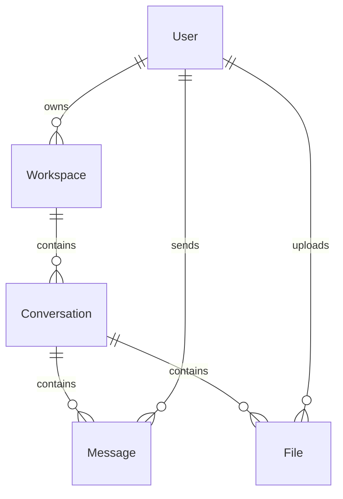

# Cortex Core Data Models

This document details the data models used in the Cortex Core system, their relationships, validation rules, and storage considerations. All models include a flexible `metadata` field to support experimentation without schema changes.

## Model Hierarchy

```
BaseModelWithMetadata
├── User
├── Workspace
├── Conversation
├── Message
└── File (optional)
```

## Base Model

All core data models extend from a base model that includes the `metadata` field:

```python
from pydantic import BaseModel, Field
from typing import Dict, Any

class BaseModelWithMetadata(BaseModel):
    """
    Base model with metadata field for storing experimental properties.
    """
    metadata: Dict[str, Any] = Field(
        default_factory=dict,
        description="Flexible metadata for experimental features"
    )
```

### Purpose of Metadata Field

The `metadata` field serves several important purposes:

1. **Experimentation**: Add new properties without changing the core schema
2. **Client-specific Data**: Store client-specific information without changing models
3. **Debug Information**: Include debug or trace data when needed
4. **Feature Flags**: Enable/disable experimental features per object

## User Model

Represents a user of the system.

```python
from pydantic import BaseModel, Field, EmailStr
from typing import Dict, Any

class User(BaseModelWithMetadata):
    """
    Represents a system user with B2C authentication.
    """
    user_id: str = Field(
        ...,  # Required field
        description="Unique user identifier from Azure B2C (oid claim)"
    )
    name: str = Field(
        ...,  # Required field
        min_length=1,
        max_length=100,
        description="User's full name"
    )
    email: str = Field(
        ...,  # Required field
        description="User's email address"
    )
```

### Validation Rules

- `user_id`: Required, should match Azure B2C object ID format
- `name`: Required, 1-100 characters
- `email`: Required, valid email format

### Storage Considerations

- Primary key: `user_id`
- Index on `email` for lookups

### Example JSON

```json
{
  "user_id": "550e8400-e29b-41d4-a716-446655440000",
  "name": "John Doe",
  "email": "john.doe@example.com",
  "metadata": {
    "preferred_language": "en-US",
    "theme": "dark"
  }
}
```

## Workspace Model

A top-level container that groups related conversations and files.

```python
import uuid
from pydantic import BaseModel, Field
from typing import Dict, Any

class Workspace(BaseModelWithMetadata):
    """
    Represents a workspace that contains conversations.
    """
    id: str = Field(
        default_factory=lambda: str(uuid.uuid4()),
        description="Unique workspace identifier"
    )
    name: str = Field(
        ...,  # Required field
        min_length=1,
        max_length=100,
        description="Workspace name"
    )
    description: str = Field(
        ...,  # Required field
        min_length=1,
        max_length=500,
        description="Workspace description"
    )
    owner_id: str = Field(
        ...,  # Required field
        description="User ID of the workspace owner"
    )
```

### Validation Rules

- `id`: UUID string, generated automatically if not provided
- `name`: Required, 1-100 characters
- `description`: Required, 1-500 characters
- `owner_id`: Required, valid user ID

### Storage Considerations

- Primary key: `id`
- Foreign key: `owner_id` references `User.user_id`
- Index on `owner_id` for listing workspaces by owner

### Example JSON

```json
{
  "id": "650e8400-e29b-41d4-a716-446655440111",
  "name": "Project X",
  "description": "Workspace for Project X development",
  "owner_id": "550e8400-e29b-41d4-a716-446655440000",
  "metadata": {
    "icon": "project",
    "color": "#4287f5"
  }
}
```

## Conversation Model

A group of messages on a specific topic within a workspace.

```python
import uuid
from pydantic import BaseModel, Field
from typing import Dict, Any, List

class Conversation(BaseModelWithMetadata):
    """
    Represents a conversation within a workspace.
    """
    id: str = Field(
        default_factory=lambda: str(uuid.uuid4()),
        description="Unique conversation identifier"
    )
    workspace_id: str = Field(
        ...,  # Required field
        description="ID of the parent workspace"
    )
    topic: str = Field(
        ...,  # Required field
        min_length=1,
        max_length=200,
        description="Conversation topic"
    )
    participant_ids: List[str] = Field(
        ...,  # Required field
        min_items=1,
        description="List of user IDs participating in the conversation"
    )
```

### Validation Rules

- `id`: UUID string, generated automatically if not provided
- `workspace_id`: Required, valid workspace ID
- `topic`: Required, 1-200 characters
- `participant_ids`: Required, at least one user ID

### Storage Considerations

- Primary key: `id`
- Foreign key: `workspace_id` references `Workspace.id`
- Index on `workspace_id` for listing conversations by workspace

### Example JSON

```json
{
  "id": "850e8400-e29b-41d4-a716-446655440333",
  "workspace_id": "650e8400-e29b-41d4-a716-446655440111",
  "topic": "Backend Development",
  "participant_ids": ["550e8400-e29b-41d4-a716-446655440000"],
  "metadata": {
    "icon": "code",
    "priority": "high"
  }
}
```

## Message Model

A single message within a conversation.

```python
import uuid
from datetime import datetime
from pydantic import BaseModel, Field
from typing import Dict, Any

class Message(BaseModelWithMetadata):
    """
    Represents a message within a conversation.
    """
    id: str = Field(
        default_factory=lambda: str(uuid.uuid4()),
        description="Unique message identifier"
    )
    conversation_id: str = Field(
        ...,  # Required field
        description="ID of the parent conversation"
    )
    sender_id: str = Field(
        ...,  # Required field
        description="User ID of the message sender"
    )
    content: str = Field(
        ...,  # Required field
        description="Message content"
    )
    timestamp: str = Field(
        default_factory=lambda: datetime.now().isoformat(),
        description="ISO 8601 timestamp of when the message was sent"
    )
```

### Validation Rules

- `id`: UUID string, generated automatically if not provided
- `conversation_id`: Required, valid conversation ID
- `sender_id`: Required, valid user ID
- `content`: Required, message content
- `timestamp`: ISO 8601 formatted timestamp, defaults to current time

### Storage Considerations

- Primary key: `id`
- Foreign key: `conversation_id` references `Conversation.id`
- Foreign key: `sender_id` references `User.user_id`
- Index on `conversation_id` for listing messages by conversation
- Index on `timestamp` for chronological ordering

### Example JSON

```json
{
  "id": "950e8400-e29b-41d4-a716-446655440444",
  "conversation_id": "850e8400-e29b-41d4-a716-446655440333",
  "sender_id": "550e8400-e29b-41d4-a716-446655440000",
  "content": "Hello, this is a message!",
  "timestamp": "2025-03-20T10:15:30Z",
  "metadata": {
    "client_id": "web-client",
    "read_status": "unread"
  }
}
```

## File Model (Optional)

Represents a file attachment within a conversation.

```python
import uuid
from datetime import datetime
from pydantic import BaseModel, Field
from typing import Dict, Any

class File(BaseModelWithMetadata):
    """
    Represents a file attachment in a conversation.
    """
    id: str = Field(
        default_factory=lambda: str(uuid.uuid4()),
        description="Unique file identifier"
    )
    conversation_id: str = Field(
        ...,  # Required field
        description="ID of the conversation this file belongs to"
    )
    file_name: str = Field(
        ...,  # Required field
        min_length=1,
        max_length=255,
        description="Name of the file"
    )
    file_url: str = Field(
        ...,  # Required field
        description="URL where the file content can be accessed"
    )
    uploaded_by: str = Field(
        ...,  # Required field
        description="User ID of the file uploader"
    )
    timestamp: str = Field(
        default_factory=lambda: datetime.now().isoformat(),
        description="ISO 8601 timestamp of when the file was uploaded"
    )
```

### Validation Rules

- `id`: UUID string, generated automatically if not provided
- `conversation_id`: Required, valid conversation ID
- `file_name`: Required, 1-255 characters
- `file_url`: Required, valid URL to file content
- `uploaded_by`: Required, valid user ID
- `timestamp`: ISO 8601 formatted timestamp, defaults to current time

### Storage Considerations

- Primary key: `id`
- Foreign key: `conversation_id` references `Conversation.id`
- Foreign key: `uploaded_by` references `User.user_id`
- Index on `conversation_id` for listing files by conversation

### Example JSON

```json
{
  "id": "a50e8400-e29b-41d4-a716-446655440555",
  "conversation_id": "850e8400-e29b-41d4-a716-446655440333",
  "file_name": "architecture.pdf",
  "file_url": "https://storage.example.com/files/architecture.pdf",
  "uploaded_by": "550e8400-e29b-41d4-a716-446655440000",
  "timestamp": "2025-03-20T10:20:30Z",
  "metadata": {
    "file_size": 1024000,
    "mime_type": "application/pdf"
  }
}
```

## Request/Response Models

In addition to the core data models, the API uses specialized request and response models:

### Workspace Creation

```python
class WorkspaceCreate(BaseModelWithMetadata):
    """
    Request model for workspace creation.
    """
    name: str = Field(
        ...,  # Required field
        min_length=1,
        max_length=100,
        description="Workspace name"
    )
    description: str = Field(
        ...,  # Required field
        min_length=1,
        max_length=500,
        description="Workspace description"
    )

class WorkspaceResponse(Workspace):
    """
    Response model for workspace operations.
    """
    pass
```

### Conversation Creation

```python
class ConversationCreate(BaseModelWithMetadata):
    """
    Request model for conversation creation.
    """
    workspace_id: str = Field(
        ...,  # Required field
        description="ID of the parent workspace"
    )
    topic: str = Field(
        ...,  # Required field
        min_length=1,
        max_length=200,
        description="Conversation topic"
    )
    participant_ids: List[str] = Field(
        default_factory=list,
        description="List of user IDs participating in the conversation"
    )

class ConversationResponse(Conversation):
    """
    Response model for conversation operations.
    """
    pass
```

## Storage Implementation

### In-Memory Storage (Development)

For development and testing, a simple in-memory implementation can be used:

```python
class InMemoryStorage:
    """
    Simple in-memory storage implementation.
    """
    def __init__(self):
        self.users = {}  # user_id -> User
        self.workspaces = {}  # id -> Workspace
        self.conversations = {}  # id -> Conversation
        self.messages = {}  # id -> Message
        self.files = {}  # id -> File

        # Indexes
        self.workspaces_by_owner = {}  # owner_id -> List[Workspace]
        self.conversations_by_workspace = {}  # workspace_id -> List[Conversation]
        self.messages_by_conversation = {}  # conversation_id -> List[Message]
        self.files_by_conversation = {}  # conversation_id -> List[File]
```

### Database Schema (Production)

For production, the models map to the following database schema using SQLAlchemy:

```python
from sqlalchemy import Column, String, ForeignKey, Text
from sqlalchemy.dialects.postgresql import UUID, JSONB, ARRAY
from sqlalchemy.ext.declarative import declarative_base

Base = declarative_base()

class User(Base):
    __tablename__ = "users"

    user_id = Column(String, primary_key=True)
    name = Column(String(100), nullable=False)
    email = Column(String(255), nullable=False, unique=True)
    metadata = Column(JSONB, default={})

class Workspace(Base):
    __tablename__ = "workspaces"

    id = Column(UUID, primary_key=True, default=uuid.uuid4)
    name = Column(String(100), nullable=False)
    description = Column(Text, nullable=False)
    owner_id = Column(String, ForeignKey("users.user_id"), nullable=False)
    metadata = Column(JSONB, default={})

    # Indexes
    __table_args__ = (
        Index("idx_workspace_owner", "owner_id"),
    )

class Conversation(Base):
    __tablename__ = "conversations"

    id = Column(UUID, primary_key=True, default=uuid.uuid4)
    workspace_id = Column(UUID, ForeignKey("workspaces.id"), nullable=False)
    topic = Column(String(200), nullable=False)
    participant_ids = Column(ARRAY(String), nullable=False)
    metadata = Column(JSONB, default={})

    # Indexes
    __table_args__ = (
        Index("idx_conversation_workspace", "workspace_id"),
    )

class Message(Base):
    __tablename__ = "messages"

    id = Column(UUID, primary_key=True, default=uuid.uuid4)
    conversation_id = Column(UUID, ForeignKey("conversations.id"), nullable=False)
    sender_id = Column(String, ForeignKey("users.user_id"), nullable=False)
    content = Column(Text, nullable=False)
    timestamp = Column(String, nullable=False)
    metadata = Column(JSONB, default={})

    # Indexes
    __table_args__ = (
        Index("idx_message_conversation", "conversation_id"),
        Index("idx_message_timestamp", "timestamp"),
    )

class File(Base):
    __tablename__ = "files"

    id = Column(UUID, primary_key=True, default=uuid.uuid4)
    conversation_id = Column(UUID, ForeignKey("conversations.id"), nullable=False)
    file_name = Column(String(255), nullable=False)
    file_url = Column(String(1024), nullable=False)
    uploaded_by = Column(String, ForeignKey("users.user_id"), nullable=False)
    timestamp = Column(String, nullable=False)
    metadata = Column(JSONB, default={})

    # Indexes
    __table_args__ = (
        Index("idx_file_conversation", "conversation_id"),
    )
```

## Domain Model and Repository Layers

To maintain proper separation of concerns, the system should implement:

### 1. Database Models (SQLAlchemy)

Represent the database schema and handle persistence.

### 2. Domain Models (Pydantic)

Represent business logic and validation rules.

### 3. API Models (Pydantic)

Represent request/response formats for the API.

### Repository Pattern

Implement a repository layer to abstract data access:

```python
class WorkspaceRepository:
    """
    Repository for workspace operations.
    """
    async def create(self, workspace: Workspace) -> Workspace:
        """Create a new workspace"""
        pass

    async def get_by_id(self, workspace_id: str) -> Optional[Workspace]:
        """Get workspace by ID"""
        pass

    async def list_by_owner(self, owner_id: str) -> List[Workspace]:
        """List workspaces by owner ID"""
        pass

    async def update(self, workspace: Workspace) -> Workspace:
        """Update an existing workspace"""
        pass

    async def delete(self, workspace_id: str) -> bool:
        """Delete a workspace"""
        pass
```

## Model Relationships



## Implementation Notes

1. **UUIDs for IDs**: Use UUIDs for all model IDs to:

   - Ensure uniqueness across distributed environments
   - Prevent enumeration attacks
   - Allow client-side ID generation when needed

2. **Metadata Field**: The `metadata` field should be implemented as JSONB for PostgreSQL:

   - Efficient storage and query capabilities
   - Support for indexing on specific metadata keys
   - Native JSON operations for querying

3. **Data Partitioning**: All data is partitioned by user:

   - Every record must be associated with a user explicitly
   - Queries should include user filtering (owner_id, participant_ids, etc.)
   - Prevents cross-tenant data access

4. **Validation**: Implement validation at multiple levels:

   - Pydantic models validate API input
   - Domain logic validates business rules
   - Database constraints enforce referential integrity

5. **Immutable IDs**: Once assigned, IDs should never change:
   - Use IDs in URLs and references
   - Update other fields as needed, but keep IDs stable
   - Maintain referential integrity
