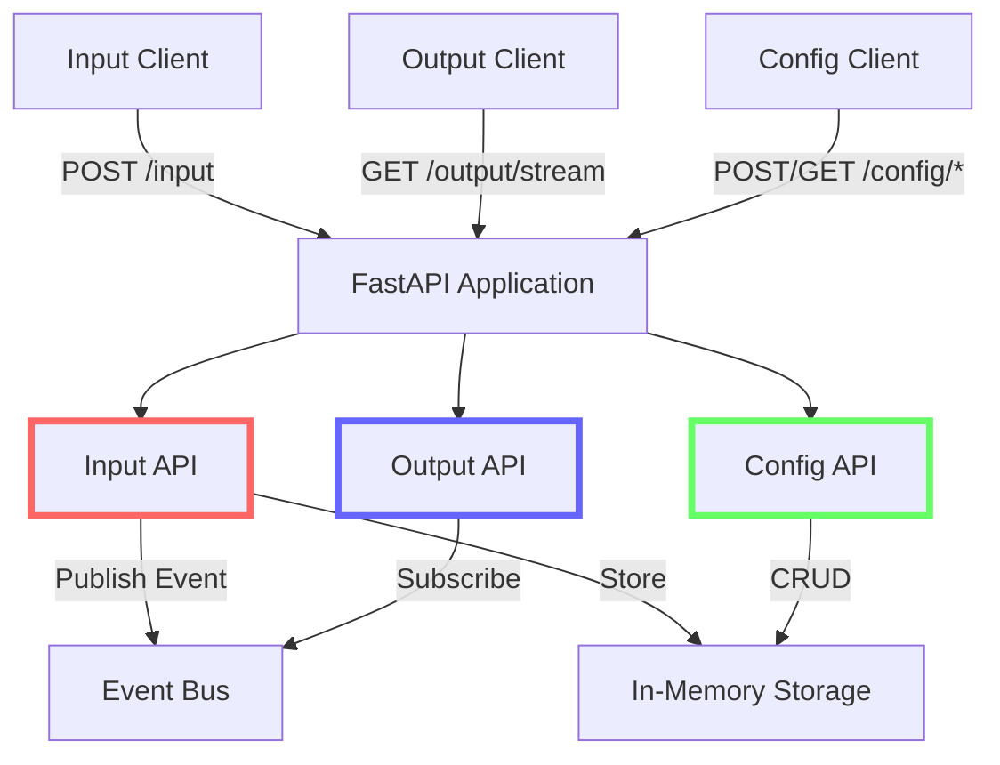
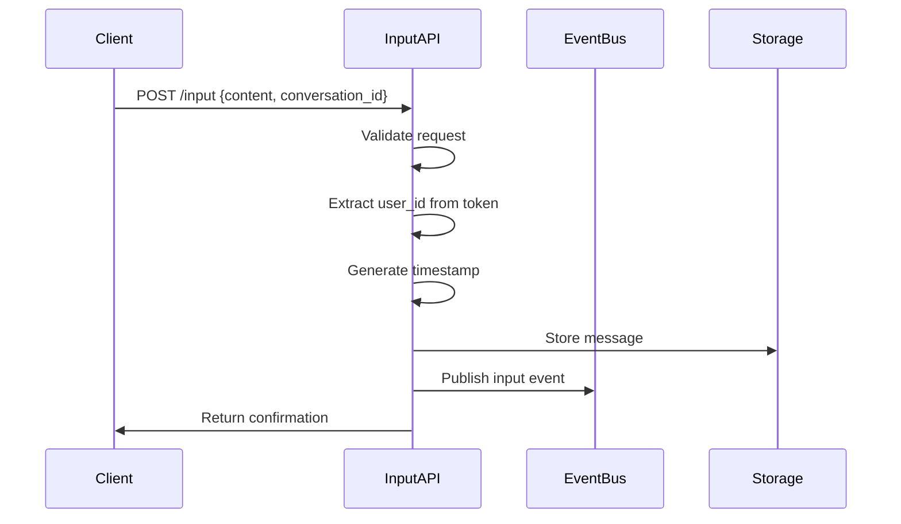
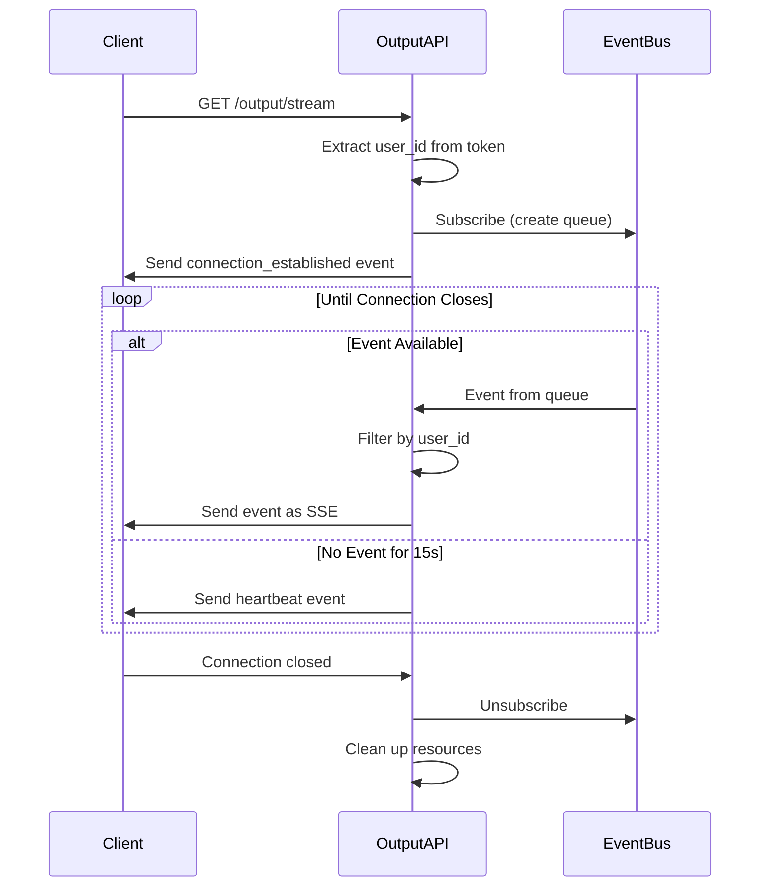

# API Endpoints Specification

## Overview

This document provides detailed specifications for the API endpoints implemented in Phase 1 of the Cortex Core system. It focuses on the implementation details, request/response formats, and integration patterns for the critical input and output endpoints, along with the supporting configuration endpoints.

Phase 1 implements the following API endpoints:

1. **Input Endpoint** (`/input`): Receives input from clients
2. **Output Stream Endpoint** (`/output/stream`): Streams output to clients using SSE
3. **Configuration Endpoints** (`/config/*`): Manages workspaces and conversations
4. **Authentication Endpoints** (`/auth/*`): Handles user authentication (covered in detail in AUTH_IMPLEMENTATION.md)

## API Endpoints Architecture



## Input Endpoint

The input endpoint is the primary entry point for client data into the Cortex Core system.

### Endpoint Specification

- **URL**: `/input`
- **Method**: `POST`
- **Auth Required**: Yes (JWT Bearer Token)
- **Content-Type**: `application/json`

### Request Format

```json
{
  "content": "Hello, Cortex!",
  "conversation_id": "850e8400-e29b-41d4-a716-446655440333",
  "metadata": {
    "client_id": "web-chat-client",
    "client_version": "1.0.0"
  }
}
```

#### Request Fields

| Field             | Type   | Required | Description                                                    |
| ----------------- | ------ | -------- | -------------------------------------------------------------- |
| `content`         | String | Yes      | The message content                                            |
| `conversation_id` | String | No       | The ID of the conversation (if omitted, defaults to "default") |
| `metadata`        | Object | No       | Optional metadata about the client and request                 |

### Response Format

```json
{
  "status": "received",
  "data": {
    "content": "Hello, Cortex!",
    "conversation_id": "850e8400-e29b-41d4-a716-446655440333",
    "timestamp": "2025-03-20T10:15:30Z",
    "metadata": {
      "client_id": "web-chat-client",
      "client_version": "1.0.0"
    }
  }
}
```

#### Response Fields

| Field            | Type   | Description                                      |
| ---------------- | ------ | ------------------------------------------------ |
| `status`         | String | Indicates if the input was received              |
| `data`           | Object | Echo of the received data with additional fields |
| `data.timestamp` | String | Server-assigned timestamp (ISO 8601)             |

### Implementation Details

```python
@router.post("/input", response_model=InputResponse)
async def receive_input(request: InputRequest, current_user: dict = Depends(get_current_user)):
    """
    Receive input from a client.

    Args:
        request: The input request
        current_user: The authenticated user

    Returns:
        Status response
    """
    user_id = current_user["user_id"]
    logger.info(f"Received input from user {user_id}")

    # Create a timestamp
    timestamp = datetime.now().isoformat()

    # Create event with user ID
    event = {
        "type": "input",
        "data": {
            "content": request.content,
            "conversation_id": request.conversation_id,
            "timestamp": timestamp,
        },
        "user_id": user_id,
        "timestamp": timestamp,
        "metadata": request.metadata
    }

    # Create and store message
    conversation_id = request.conversation_id or "default"
    message = Message(
        sender_id=user_id,
        content=request.content,
        conversation_id=conversation_id,
        timestamp=timestamp,
        metadata=request.metadata
    )
    storage.create_message(message)

    # Publish event to event bus
    await event_bus.publish(event)

    # Return response
    return InputResponse(
        status="received",
        data={
            "content": request.content,
            "conversation_id": conversation_id,
            "timestamp": timestamp,
            "metadata": request.metadata
        }
    )
```

### Error Handling

| Status Code | Description           | Cause                                              |
| ----------- | --------------------- | -------------------------------------------------- |
| 400         | Bad Request           | Invalid JSON or missing required fields            |
| 401         | Unauthorized          | Missing or invalid authentication token            |
| 422         | Unprocessable Entity  | Request validation failed (e.g., content too long) |
| 500         | Internal Server Error | Server-side error processing the request           |

### Input Endpoint Flow



### Key Implementation Considerations

1. **User Partitioning**: The user ID from authentication is essential for partitioning data
2. **Timestamping**: Server-assigned timestamps ensure consistency
3. **Default Conversation**: Using a default conversation ID when none is provided
4. **Event Publication**: Publishing to the event bus happens after storing in memory
5. **Response Timing**: Response is sent immediately after publishing, without waiting for subscribers to process

## Output Stream Endpoint

The output stream endpoint uses Server-Sent Events (SSE) to deliver real-time updates to clients.

### Endpoint Specification

- **URL**: `/output/stream`
- **Method**: `GET`
- **Auth Required**: Yes (JWT Bearer Token)
- **Accept**: `text/event-stream`
- **Response Type**: `text/event-stream` (Server-Sent Events)

### Response Format

```
data: {"type":"connection_established","user_id":"550e8400-e29b-41d4-a716-446655440000","timestamp":"2025-03-20T10:15:30Z"}

data: {"type":"input","data":{"content":"Hello, Cortex!","conversation_id":"850e8400-e29b-41d4-a716-446655440333","timestamp":"2025-03-20T10:15:32Z"},"user_id":"550e8400-e29b-41d4-a716-446655440000","timestamp":"2025-03-20T10:15:32Z"}

data: {"type":"heartbeat","timestamp":"2025-03-20T10:15:40Z"}
```

### Event Types

| Event Type               | Description                                 | Example                                                                                               |
| ------------------------ | ------------------------------------------- | ----------------------------------------------------------------------------------------------------- |
| `connection_established` | Sent when a connection is first established | `{"type":"connection_established","user_id":"user-123","timestamp":"2025-03-20T10:15:30Z"}`           |
| `input`                  | Input event echoed back to clients          | `{"type":"input","data":{"content":"Hello"},"user_id":"user-123","timestamp":"2025-03-20T10:15:32Z"}` |
| `heartbeat`              | Periodic event to keep connection alive     | `{"type":"heartbeat","timestamp":"2025-03-20T10:15:40Z"}`                                             |

### Implementation Details

```python
@router.get("/output/stream")
async def output_stream(request: Request, current_user: dict = Depends(get_current_user)):
    """
    Server-Sent Events (SSE) endpoint for streaming output to clients.

    Args:
        request: The HTTP request
        current_user: The authenticated user

    Returns:
        SSE streaming response
    """
    user_id = current_user["user_id"]
    logger.info(f"New SSE connection established for user {user_id}")

    # Create queue for this connection
    queue = asyncio.Queue()

    # Subscribe to event bus
    event_bus.subscribe(queue)

    async def event_generator():
        """Generate SSE events from the queue."""
        try:
            # Send initial connection established event
            connection_event = {
                "type": "connection_established",
                "user_id": user_id,
                "timestamp": datetime.now().isoformat()
            }
            yield f"data: {json.dumps(connection_event)}\n\n"

            # Track when the last heartbeat was sent
            last_heartbeat = datetime.now()
            heartbeat_interval = 30  # seconds

            while True:
                # Check if we need to send a heartbeat
                now = datetime.now()
                if (now - last_heartbeat).total_seconds() >= heartbeat_interval:
                    heartbeat_event = {
                        "type": "heartbeat",
                        "timestamp": now.isoformat()
                    }
                    yield f"data: {json.dumps(heartbeat_event)}\n\n"
                    last_heartbeat = now
                    continue

                # Wait for next event with timeout
                try:
                    # Wait for an event, but timeout before the heartbeat interval
                    event = await asyncio.wait_for(queue.get(), timeout=heartbeat_interval/2)

                    # Filter events for this user
                    if event.get("user_id") == user_id or event.get("type") == "heartbeat":
                        # Format as SSE event
                        yield f"data: {json.dumps(event)}\n\n"
                except asyncio.TimeoutError:
                    # No event received, continue and check heartbeat
                    continue

        except asyncio.CancelledError:
            # Client disconnected
            logger.info(f"SSE connection closed for user {user_id}")
            raise
        except Exception as e:
            logger.error(f"Error in SSE stream for user {user_id}: {e}")
            raise
        finally:
            # Always unsubscribe to prevent memory leaks
            event_bus.unsubscribe(queue)
            logger.info(f"Cleaned up SSE connection for user {user_id}")

    return StreamingResponse(
        event_generator(),
        media_type="text/event-stream"
    )
```

### SSE Connection Flow



### Key Implementation Considerations

#### 1. SSE Format

Server-Sent Events follow a specific text format:

```
data: {"event":"data"}\n\n
```

Key formatting rules:

- Each event starts with `data: `
- The event payload is typically JSON
- Each event ends with a double newline (`\n\n`)
- Events can have optional `id:`, `event:`, and `retry:` fields (not used in Phase 1)

#### 2. Connection Management

Critical aspects of SSE connection management:

- **Cleanup**: Always unsubscribe from the event bus when connections close
- **Error Handling**: Catch and handle exceptions properly
- **Resource Management**: Use try/finally to ensure cleanup
- **Heartbeats**: Implement heartbeats to keep connections alive
- **Timeout Handling**: Handle timeouts gracefully

#### 3. User Filtering

Events must be filtered by user ID to ensure data isolation:

```python
# Filter events for this user
if event.get("user_id") == user_id or event.get("type") == "heartbeat":
    # Send the event to this client
    yield f"data: {json.dumps(event)}\n\n"
```

#### 4. Handling Disconnections

When clients disconnect:

1. FastAPI raises `asyncio.CancelledError`
2. The exception is caught in the try/except block
3. The finally block ensures unsubscription happens
4. Resources are properly cleaned up

#### 5. Heartbeats

Heartbeats are essential for SSE connections:

- Prevent proxies from closing idle connections
- Allow clients to detect dropped connections
- Phase 1 uses a 30-second heartbeat interval
- Implementation includes timeout handling to ensure heartbeats are sent

#### 6. Performance Considerations

- Each SSE connection maintains an open HTTP connection
- Each connection has its own asyncio Queue
- FastAPI uses asynchronous handlers, allowing many concurrent connections
- Resource usage scales linearly with the number of connections

## Configuration Endpoints

Phase 1 includes basic configuration endpoints for workspace and conversation management.

### Workspace Endpoints

#### Create Workspace

- **URL**: `/config/workspace`
- **Method**: `POST`
- **Auth Required**: Yes (JWT Bearer Token)

**Request Format**:

```json
{
  "name": "Project X",
  "description": "Workspace for Project X development",
  "metadata": {
    "icon": "project",
    "color": "#4287f5"
  }
}
```

**Response Format**:

```json
{
  "status": "workspace created",
  "workspace": {
    "id": "650e8400-e29b-41d4-a716-446655440111",
    "name": "Project X",
    "description": "Workspace for Project X development",
    "owner_id": "550e8400-e29b-41d4-a716-446655440000",
    "metadata": {
      "icon": "project",
      "color": "#4287f5"
    }
  }
}
```

#### List Workspaces

- **URL**: `/config/workspace`
- **Method**: `GET`
- **Auth Required**: Yes (JWT Bearer Token)

**Response Format**:

```json
{
  "workspaces": [
    {
      "id": "650e8400-e29b-41d4-a716-446655440111",
      "name": "Project X",
      "description": "Workspace for Project X development",
      "owner_id": "550e8400-e29b-41d4-a716-446655440000",
      "metadata": {
        "icon": "project",
        "color": "#4287f5"
      }
    },
    {
      "id": "750e8400-e29b-41d4-a716-446655440222",
      "name": "Research",
      "description": "Research workspace",
      "owner_id": "550e8400-e29b-41d4-a716-446655440000",
      "metadata": {
        "icon": "books",
        "color": "#42f56f"
      }
    }
  ],
  "total": 2
}
```

### Conversation Endpoints

#### Create Conversation

- **URL**: `/config/conversation`
- **Method**: `POST`
- **Auth Required**: Yes (JWT Bearer Token)

**Request Format**:

```json
{
  "workspace_id": "650e8400-e29b-41d4-a716-446655440111",
  "topic": "Backend Development",
  "participant_ids": ["550e8400-e29b-41d4-a716-446655440000"],
  "metadata": {
    "icon": "code",
    "priority": "high"
  }
}
```

**Response Format**:

```json
{
  "status": "conversation created",
  "conversation": {
    "id": "850e8400-e29b-41d4-a716-446655440333",
    "workspace_id": "650e8400-e29b-41d4-a716-446655440111",
    "topic": "Backend Development",
    "participant_ids": ["550e8400-e29b-41d4-a716-446655440000"],
    "metadata": {
      "icon": "code",
      "priority": "high"
    }
  }
}
```

#### List Conversations

- **URL**: `/config/conversation`
- **Method**: `GET`
- **Auth Required**: Yes (JWT Bearer Token)
- **Query Parameters**: `workspace_id` (required)

**Response Format**:

```json
{
  "conversations": [
    {
      "id": "850e8400-e29b-41d4-a716-446655440333",
      "workspace_id": "650e8400-e29b-41d4-a716-446655440111",
      "topic": "Backend Development",
      "participant_ids": ["550e8400-e29b-41d4-a716-446655440000"],
      "metadata": {
        "icon": "code",
        "priority": "high"
      }
    },
    {
      "id": "950e8400-e29b-41d4-a716-446655440444",
      "workspace_id": "650e8400-e29b-41d4-a716-446655440111",
      "topic": "Frontend Development",
      "participant_ids": ["550e8400-e29b-41d4-a716-446655440000"],
      "metadata": {
        "icon": "web",
        "priority": "medium"
      }
    }
  ],
  "total": 2
}
```

## Client Integration

### Input Client Integration

#### JavaScript Example

```javascript
async function sendInput(content, conversationId, metadata = {}) {
  // Get the auth token
  const token = localStorage.getItem("token");

  if (!token) {
    throw new Error("Authentication required");
  }

  const response = await fetch("/input", {
    method: "POST",
    headers: {
      Authorization: `Bearer ${token}`,
      "Content-Type": "application/json",
    },
    body: JSON.stringify({
      content,
      conversation_id: conversationId,
      metadata,
    }),
  });

  if (!response.ok) {
    const error = await response.json();
    throw new Error(error.detail || "Failed to send input");
  }

  return response.json();
}
```

#### Python Example

```python
import requests

def send_input(token, content, conversation_id=None, metadata=None):
    """Send input to the Cortex Core API."""
    headers = {
        "Authorization": f"Bearer {token}",
        "Content-Type": "application/json"
    }

    data = {
        "content": content,
        "metadata": metadata or {}
    }

    if conversation_id:
        data["conversation_id"] = conversation_id

    response = requests.post(
        "http://localhost:8000/input",
        headers=headers,
        json=data
    )

    response.raise_for_status()
    return response.json()
```

### Output Client Integration

#### JavaScript SSE Client

```javascript
class CortexOutputClient {
  constructor(baseUrl = "") {
    this.baseUrl = baseUrl;
    this.eventSource = null;
    this.listeners = {
      message: [],
      error: [],
      open: [],
    };
  }

  connect(token) {
    if (this.eventSource) {
      this.disconnect();
    }

    // Create EventSource
    // Note: Browsers don't allow custom headers on EventSource
    // In production, token should be passed as a query parameter with appropriate security measures
    const url = new URL(
      `${this.baseUrl}/output/stream`,
      window.location.origin
    );
    url.searchParams.append("token", token);

    this.eventSource = new EventSource(url.toString());

    // Set up event handlers
    this.eventSource.onopen = (event) => {
      this._notifyListeners("open", event);
    };

    this.eventSource.onmessage = (event) => {
      try {
        const data = JSON.parse(event.data);
        this._notifyListeners("message", data);
      } catch (error) {
        console.error("Error parsing SSE message:", error);
      }
    };

    this.eventSource.onerror = (error) => {
      this._notifyListeners("error", error);

      // Auto-reconnect logic could be implemented here
      // For Phase 1, we'll disconnect on error
      this.disconnect();
    };
  }

  disconnect() {
    if (this.eventSource) {
      this.eventSource.close();
      this.eventSource = null;
    }
  }

  addEventListener(type, callback) {
    if (this.listeners[type]) {
      this.listeners[type].push(callback);
    }
  }

  removeEventListener(type, callback) {
    if (this.listeners[type]) {
      this.listeners[type] = this.listeners[type].filter(
        (cb) => cb !== callback
      );
    }
  }

  _notifyListeners(type, data) {
    if (this.listeners[type]) {
      this.listeners[type].forEach((callback) => {
        try {
          callback(data);
        } catch (error) {
          console.error(`Error in ${type} listener:`, error);
        }
      });
    }
  }
}
```

**Note on Browser SSE Limitations**: Browsers don't allow setting custom headers on EventSource connections. For production implementations, consider:

1. Using a proxy server that adds the auth header
2. Pass the token as a query parameter with appropriate security measures
3. Use libraries like `fetch-event-source` that support custom headers
4. Implement custom SSE clients for browser environments

#### Python SSE Client

```python
import json
import requests
import sseclient

class CortexOutputClient:
    """Client for the Cortex Core output stream."""

    def __init__(self, base_url="http://localhost:8000"):
        self.base_url = base_url
        self.client = None
        self.connection = None

    def connect(self, token):
        """Connect to the SSE stream."""
        headers = {"Authorization": f"Bearer {token}"}

        self.connection = requests.get(
            f"{self.base_url}/output/stream",
            headers=headers,
            stream=True
        )

        self.client = sseclient.SSEClient(self.connection)
        return self.client

    def listen(self, callback):
        """Listen for events and call the callback for each one."""
        if not self.client:
            raise RuntimeError("Not connected. Call connect() first.")

        for event in self.client.events():
            try:
                data = json.loads(event.data)
                callback(data)
            except json.JSONDecodeError:
                print(f"Error decoding event data: {event.data}")
            except Exception as e:
                print(f"Error processing event: {e}")

    def disconnect(self):
        """Disconnect from the SSE stream."""
        if self.connection:
            self.connection.close()
            self.connection = None
            self.client = None
```

## Testing API Endpoints

### Unit Testing Input Endpoint

```python
import pytest
from fastapi.testclient import TestClient
from app.main import app
from app.utils.auth import create_access_token

client = TestClient(app)

def get_auth_header(user_id="test-user", name="Test User", email="test@example.com"):
    """Create authentication header with test token."""
    token = create_access_token({
        "sub": email,
        "oid": user_id,
        "name": name,
        "email": email
    })
    return {"Authorization": f"Bearer {token}"}

def test_input_endpoint():
    """Test input endpoint."""
    headers = get_auth_header()
    response = client.post(
        "/input",
        json={"content": "Test message", "metadata": {}},
        headers=headers
    )
    assert response.status_code == 200
    data = response.json()
    assert data["status"] == "received"
    assert data["data"]["content"] == "Test message"
    assert "timestamp" in data["data"]

def test_input_endpoint_with_conversation():
    """Test input endpoint with conversation ID."""
    headers = get_auth_header()
    response = client.post(
        "/input",
        json={"content": "Test message", "conversation_id": "test-conversation", "metadata": {}},
        headers=headers
    )
    assert response.status_code == 200
    data = response.json()
    assert data["data"]["conversation_id"] == "test-conversation"

def test_input_endpoint_unauthorized():
    """Test input endpoint without authentication."""
    response = client.post(
        "/input",
        json={"content": "Test message", "metadata": {}}
    )
    assert response.status_code == 401

def test_input_endpoint_invalid_request():
    """Test input endpoint with invalid request."""
    headers = get_auth_header()
    response = client.post(
        "/input",
        json={"metadata": {}},  # Missing required content field
        headers=headers
    )
    assert response.status_code == 422  # Validation error
```

### Testing SSE Endpoint

Testing SSE endpoints is more complex since they maintain long-lived connections. Here's a test approach using `pytest-asyncio`:

```python
import pytest
import asyncio
import json
from fastapi.testclient import TestClient
from app.main import app
from app.utils.auth import create_access_token
from app.core.event_bus import event_bus

@pytest.mark.asyncio
async def test_sse_connection():
    """Test SSE connection and event delivery."""
    # Create a test token
    token = create_access_token({
        "sub": "test@example.com",
        "oid": "test-user-123",
        "name": "Test User",
        "email": "test@example.com"
    })

    # We can't easily test SSE with the TestClient directly
    # This is a simplified test that verifies the event publishing

    # Create a queue and subscribe to the event bus
    queue = asyncio.Queue()
    event_bus.subscribe(queue)

    try:
        # Publish a test event
        test_event = {
            "type": "test",
            "data": {"message": "test message"},
            "user_id": "test-user-123",
            "timestamp": "2023-01-01T00:00:00Z"
        }
        await event_bus.publish(test_event)

        # Verify the event was received by the queue
        received_event = await asyncio.wait_for(queue.get(), timeout=1.0)
        assert received_event == test_event

        # Since SSE filtering happens in the handler, verify that
        # events for other users are not filtered at the bus level
        other_user_event = {
            "type": "test",
            "data": {"message": "other user message"},
            "user_id": "other-user",
            "timestamp": "2023-01-01T00:00:00Z"
        }
        await event_bus.publish(other_user_event)

        # This event should also be received by the queue
        received_event = await asyncio.wait_for(queue.get(), timeout=1.0)
        assert received_event == other_user_event
    finally:
        # Clean up
        event_bus.unsubscribe(queue)
```

### Integration Testing Input to Output Flow

For true end-to-end testing, we need to test the flow from input to output:

```python
import pytest
import asyncio
import json
import httpx
from fastapi import FastAPI
from fastapi.testclient import TestClient
from app.main import app
from app.utils.auth import create_access_token

@pytest.mark.asyncio
async def test_input_to_output_flow():
    """Test the complete flow from input to output."""
    # This test requires running the application with asyncio
    # It's more complex to set up in pytest

    # Create test token
    token = create_access_token({
        "sub": "test@example.com",
        "oid": "test-user-123",
        "name": "Test User",
        "email": "test@example.com"
    })

    # Set up headers
    headers = {"Authorization": f"Bearer {token}"}

    # Use httpx for async requests
    async with httpx.AsyncClient(app=app, base_url="http://testserver") as client:
        # Start SSE connection in the background
        async def read_sse():
            received_events = []
            async with client.stream(
                "GET", "/output/stream", headers=headers
            ) as response:
                # Read SSE events
                async for line in response.aiter_lines():
                    if line.startswith('data: '):
                        data = json.loads(line[6:])  # Skip 'data: ' prefix
                        received_events.append(data)
                        # If we receive the input event, we're done
                        if data.get("type") == "input" and data.get("data", {}).get("content") == "Test message":
                            break
            return received_events

        # Start the SSE reader task
        sse_task = asyncio.create_task(read_sse())

        # Wait a bit for the connection to establish
        await asyncio.sleep(0.5)

        # Send test input
        response = await client.post(
            "/input",
            json={"content": "Test message", "metadata": {}},
            headers=headers
        )

        # Verify input response
        assert response.status_code == 200

        # Wait for the SSE events
        received_events = await sse_task

        # Verify we received the expected events
        # First should be connection_established
        assert received_events[0]["type"] == "connection_established"

        # One of the events should be our input event
        input_events = [e for e in received_events if e.get("type") == "input"]
        assert len(input_events) > 0
        assert input_events[0]["data"]["content"] == "Test message"
        assert input_events[0]["user_id"] == "test-user-123"
```

## Error Handling

### Error Response Format

All API errors follow a consistent format:

```json
{
  "detail": "Human-readable error message"
}
```

For validation errors, the format is more detailed:

```json
{
  "detail": [
    {
      "loc": ["body", "content"],
      "msg": "field required",
      "type": "value_error.missing"
    }
  ]
}
```

### Common Error Scenarios

| Endpoint               | Error Scenario      | Status Code | Response                                                                                      |
| ---------------------- | ------------------- | ----------- | --------------------------------------------------------------------------------------------- |
| `/input`               | Missing token       | 401         | `{"detail":"Not authenticated"}`                                                              |
| `/input`               | Invalid token       | 401         | `{"detail":"Invalid authentication credentials"}`                                             |
| `/input`               | Missing content     | 422         | `{"detail":[{"loc":["body","content"],"msg":"field required","type":"value_error.missing"}]}` |
| `/output/stream`       | Missing token       | 401         | `{"detail":"Not authenticated"}`                                                              |
| `/output/stream`       | Invalid token       | 401         | `{"detail":"Invalid authentication credentials"}`                                             |
| `/config/workspace`    | Missing name        | 422         | `{"detail":[{"loc":["body","name"],"msg":"field required","type":"value_error.missing"}]}`    |
| `/config/conversation` | Invalid workspace   | 404         | `{"detail":"Workspace not found"}`                                                            |
| `/config/conversation` | Unauthorized access | 403         | `{"detail":"Access denied"}`                                                                  |

### Implementing Custom Error Handlers

For Phase 1, we rely on FastAPI's built-in error handling. For custom errors, you can implement exception handlers:

```python
from fastapi import FastAPI, Request, status
from fastapi.responses import JSONResponse

app = FastAPI()

class CustomError(Exception):
    def __init__(self, code: str, message: str):
        self.code = code
        self.message = message

@app.exception_handler(CustomError)
async def custom_error_handler(request: Request, exc: CustomError):
    return JSONResponse(
        status_code=status.HTTP_400_BAD_REQUEST,
        content={
            "error": {
                "code": exc.code,
                "message": exc.message
            }
        }
    )
```

## API Security

### API-Specific Security Considerations

1. **Rate Limiting**: Not implemented in Phase 1, but consider adding in production
2. **Input Validation**: All inputs are validated using Pydantic models
3. **Content Limits**: Consider adding limits on content size in production
4. **SSE Connection Limits**: Consider limiting concurrent connections per user in production
5. **Request Tracing**: Add request IDs for tracing in production

### SQL Injection Protection

FastAPI with Pydantic provides protection against SQL injection by validating input types. In Phase 1, we use in-memory storage, but when moving to a database in future phases:

1. Use parameterized queries or ORMs like SQLAlchemy
2. Never concatenate user input into SQL strings
3. Validate input types with Pydantic models

## Client Considerations

### Input Client Best Practices

1. **Robust Error Handling**: Implement retry logic for transient errors
2. **Input Validation**: Validate inputs client-side before sending
3. **Rate Limiting**: Implement client-side throttling to prevent overloading
4. **Timeouts**: Set appropriate request timeouts
5. **Authentication**: Handle auth token renewal

### Output Client Best Practices

1. **Reconnection Logic**: Implement exponential backoff for reconnections
2. **Event Buffering**: Buffer events to handle UI updates smoothly
3. **Heartbeat Monitoring**: Monitor heartbeats to detect connection issues
4. **Connection Lifecycle**: Handle connect, disconnect, and error states
5. **Event Filtering**: Filter events by type at the client level as needed

### Mobile Considerations

Mobile clients need additional considerations:

1. **Battery Usage**: Minimize SSE connection time when app is in background
2. **Network Changes**: Handle network type changes and reconnect as needed
3. **Background Mode**: Use push notifications instead of SSE when in background
4. **Low Data Mode**: Implement data-saving options

## Performance Considerations

### API Endpoint Performance

1. **Asynchronous Processing**: All endpoints use FastAPI's async capabilities
2. **Connection Pooling**: Consider connection pooling for database in future phases
3. **Memory Usage**: Monitor memory usage with many SSE connections
4. **Event Bus Overload**: Handle high event rates with proper queue management
5. **Request Timeout**: Set appropriate timeouts for all operations

### SSE Connection Scaling

Server-Sent Events connections maintain an open HTTP connection, which has scaling implications:

1. **Connection Limits**: Web servers have connection limits
2. **Memory Usage**: Each connection consumes memory
3. **Process Model**: The asynchronous model helps but has limits
4. **Load Balancing**: Consider sticky sessions for load balancing
5. **Backpressure**: Implement backpressure mechanisms for high event rates

For Phase 1, these considerations are not critical, but keep them in mind for future phases.

## Conclusion

The API endpoints implemented in Phase 1 provide a solid foundation for the Cortex Core system:

1. **Input Processing**: Receive and process client input via `/input`
2. **Real-time Output**: Stream events to clients via `/output/stream` using SSE
3. **Configuration Management**: Manage workspaces and conversations
4. **Security**: JWT-based authentication and user partitioning

These endpoints enable the core functionality: receiving input from clients, processing it internally, and streaming output back to clients. The implementation is simple but complete, with proper error handling, security, and performance considerations.

Future phases will extend these endpoints with additional features, such as persistent storage, more sophisticated event handling, and integration with backend services.
