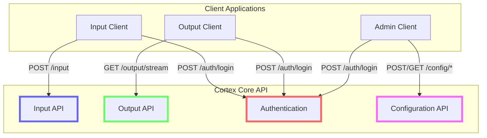

# Client Integration Guide

## Overview

This document provides comprehensive guidance for developers building client applications that integrate with the Cortex Core API. It includes detailed implementation examples, best practices, and platform-specific considerations for creating both input clients (which send data to the API) and output clients (which receive real-time updates).

Phase 1 of the Cortex Core API provides the following key endpoints for client integration:

1. **Authentication** (`/auth/login`): Obtain JWT tokens for API access
2. **Input** (`/input`): Send data to the system
3. **Output** (`/output/stream`): Receive real-time updates via Server-Sent Events (SSE)
4. **Configuration** (`/config/*`): Manage workspaces and conversations

## Client Integration Architecture



## Authentication Implementation

All client applications must implement authentication to access the API. The authentication flow is:

1. Send credentials to the `/auth/login` endpoint
2. Receive a JWT token
3. Include the token in all subsequent requests

### JavaScript Authentication Implementation

```javascript
/**
 * Authentication service for Cortex Core API
 */
class AuthService {
  constructor(apiBaseUrl) {
    this.apiBaseUrl = apiBaseUrl;
    this.token = localStorage.getItem("auth_token");
    this.tokenExpiry = localStorage.getItem("auth_token_expiry");
  }

  /**
   * Login with email and password
   * @param {string} email User email
   * @param {string} password User password
   * @returns {Promise<Object>} Auth result with token information
   */
  async login(email, password) {
    try {
      // Create form data (required format for OAuth2 password flow)
      const formData = new URLSearchParams();
      formData.append("username", email); // Note: API expects 'username' not 'email'
      formData.append("password", password);

      const response = await fetch(`${this.apiBaseUrl}/auth/login`, {
        method: "POST",
        headers: {
          "Content-Type": "application/x-www-form-urlencoded",
        },
        body: formData,
      });

      if (!response.ok) {
        throw new Error(
          `Authentication failed: ${response.status} ${response.statusText}`
        );
      }

      const data = await response.json();

      // Store the token and expiry
      this.token = data.access_token;

      // Calculate expiry time in milliseconds
      const expiryTime = Date.now() + data.expires_in * 1000;
      this.tokenExpiry = expiryTime;

      // Save to local storage (optional, with security considerations)
      localStorage.setItem("auth_token", this.token);
      localStorage.setItem("auth_token_expiry", this.tokenExpiry);

      return data;
    } catch (error) {
      console.error("Login error:", error);
      throw error;
    }
  }

  /**
   * Check if the current token is valid
   * @returns {boolean} True if token exists and is not expired
   */
  isAuthenticated() {
    if (!this.token || !this.tokenExpiry) {
      return false;
    }

    // Check if token is expired
    return Date.now() < parseInt(this.tokenExpiry);
  }

  /**
   * Get the authentication headers for API requests
   * @returns {Object} Headers object with Authorization
   * @throws {Error} If not authenticated
   */
  getAuthHeaders() {
    if (!this.isAuthenticated()) {
      throw new Error("Not authenticated");
    }

    return {
      Authorization: `Bearer ${this.token}`,
    };
  }

  /**
   * Verify the token is valid by checking with the API
   * @returns {Promise<Object>} User information if token is valid
   */
  async verifyToken() {
    try {
      if (!this.isAuthenticated()) {
        throw new Error("Not authenticated");
      }

      const response = await fetch(`${this.apiBaseUrl}/auth/verify`, {
        headers: this.getAuthHeaders(),
      });

      if (!response.ok) {
        // Token is invalid
        this.logout();
        throw new Error("Invalid token");
      }

      return await response.json();
    } catch (error) {
      console.error("Token verification error:", error);
      throw error;
    }
  }

  /**
   * Log out by clearing stored tokens
   */
  logout() {
    this.token = null;
    this.tokenExpiry = null;
    localStorage.removeItem("auth_token");
    localStorage.removeItem("auth_token_expiry");
  }
}
```

### Python Authentication Implementation

```python
import requests
import time
from typing import Dict, Any, Optional

class AuthService:
    """Authentication service for Cortex Core API."""

    def __init__(self, api_base_url: str):
        """
        Initialize the auth service.

        Args:
            api_base_url: Base URL for the API
        """
        self.api_base_url = api_base_url
        self.token: Optional[str] = None
        self.token_expiry: Optional[float] = None
        self.user_info: Optional[Dict[str, Any]] = None

    def login(self, email: str, password: str) -> Dict[str, Any]:
        """
        Log in with email and password.

        Args:
            email: User email
            password: User password

        Returns:
            Dict containing token and user information

        Raises:
            requests.HTTPError: If authentication fails
        """
        # Create form data (required format for OAuth2 password flow)
        form_data = {
            'username': email,  # Note: API expects 'username' not 'email'
            'password': password
        }

        response = requests.post(
            f"{self.api_base_url}/auth/login",
            data=form_data
        )

        # Raise exception if request failed
        response.raise_for_status()

        # Parse response data
        data = response.json()

        # Store token and expiry
        self.token = data['access_token']
        self.token_expiry = time.time() + data['expires_in']
        self.user_info = data['claims']

        return data

    def is_authenticated(self) -> bool:
        """
        Check if the current token is valid.

        Returns:
            True if token exists and is not expired
        """
        if not self.token or not self.token_expiry:
            return False

        # Check if token is expired
        return time.time() < self.token_expiry

    def get_auth_headers(self) -> Dict[str, str]:
        """
        Get the authentication headers for API requests.

        Returns:
            Headers dict with Authorization

        Raises:
            ValueError: If not authenticated
        """
        if not self.is_authenticated():
            raise ValueError("Not authenticated")

        return {
            'Authorization': f'Bearer {self.token}'
        }

    def verify_token(self) -> Dict[str, Any]:
        """
        Verify the token is valid by checking with the API.

        Returns:
            User information if token is valid

        Raises:
            requests.HTTPError: If token verification fails
        """
        if not self.is_authenticated():
            raise ValueError("Not authenticated")

        response = requests.get(
            f"{self.api_base_url}/auth/verify",
            headers=self.get_auth_headers()
        )

        # Raise exception if request failed
        response.raise_for_status()

        return response.json()

    def logout(self) -> None:
        """Log out by clearing stored tokens."""
        self.token = None
        self.token_expiry = None
        self.user_info = None
```

### Authentication Security Considerations

1. **Token Storage**:

   - For web applications, consider using HTTP-only cookies instead of localStorage
   - For mobile applications, use secure storage mechanisms (Keychain for iOS, KeyStore for Android)
   - For desktop applications, use encrypted storage

2. **Token Refresh**:

   - Implement token refresh logic if tokens expire during a session
   - Consider using a background timer to refresh tokens before expiration

3. **HTTPS Required**:
   - Always use HTTPS for API communication
   - Verify SSL certificates in production

## Input Client Implementation

Input clients send data to the Cortex Core API via the `/input` endpoint.

### JavaScript Input Client

```javascript
/**
 * Input service for Cortex Core API
 */
class InputService {
  constructor(apiBaseUrl, authService) {
    this.apiBaseUrl = apiBaseUrl;
    this.authService = authService;
  }

  /**
   * Send input to the API
   * @param {string} content Message content
   * @param {string} conversationId Optional conversation ID
   * @param {Object} metadata Optional metadata
   * @returns {Promise<Object>} Response data
   */
  async sendInput(content, conversationId = null, metadata = {}) {
    try {
      // Ensure user is authenticated
      if (!this.authService.isAuthenticated()) {
        throw new Error("Authentication required");
      }

      // Prepare payload
      const payload = {
        content: content,
        metadata: metadata,
      };

      // Add conversation ID if provided
      if (conversationId) {
        payload.conversation_id = conversationId;
      }

      // Send request
      const response = await fetch(`${this.apiBaseUrl}/input`, {
        method: "POST",
        headers: {
          "Content-Type": "application/json",
          ...this.authService.getAuthHeaders(),
        },
        body: JSON.stringify(payload),
      });

      if (!response.ok) {
        // Handle error response
        const errorData = await response.json();
        throw new Error(
          `Input failed: ${response.status} - ${
            errorData.detail || response.statusText
          }`
        );
      }

      // Return successful response
      return await response.json();
    } catch (error) {
      console.error("Input error:", error);
      throw error;
    }
  }

  /**
   * Send input with retry logic
   * @param {string} content Message content
   * @param {string} conversationId Optional conversation ID
   * @param {Object} metadata Optional metadata
   * @param {number} maxRetries Maximum number of retry attempts
   * @param {number} baseDelay Base delay in milliseconds
   * @returns {Promise<Object>} Response data
   */
  async sendInputWithRetry(
    content,
    conversationId = null,
    metadata = {},
    maxRetries = 3,
    baseDelay = 1000
  ) {
    let lastError;

    // Try sending the input with exponential backoff
    for (let attempt = 0; attempt <= maxRetries; attempt++) {
      try {
        return await this.sendInput(content, conversationId, metadata);
      } catch (error) {
        lastError = error;

        // Don't retry if error is authentication-related or 4xx (except 429)
        if (
          error.message.includes("Authentication required") ||
          (error.message.includes("Input failed: 4") &&
            !error.message.includes("Input failed: 429"))
        ) {
          throw error;
        }

        // If this was the last attempt, don't delay
        if (attempt === maxRetries) {
          break;
        }

        // Calculate exponential backoff delay
        const delay = baseDelay * Math.pow(2, attempt);

        // Wait before the next attempt
        await new Promise((resolve) => setTimeout(resolve, delay));
      }
    }

    // If we reached here, all attempts failed
    throw lastError;
  }
}
```

### Python Input Client

```python
import requests
import time
import random
from typing import Dict, Any, Optional, Union

class InputService:
    """Input service for Cortex Core API."""

    def __init__(self, api_base_url: str, auth_service):
        """
        Initialize the input service.

        Args:
            api_base_url: Base URL for the API
            auth_service: Authentication service instance
        """
        self.api_base_url = api_base_url
        self.auth_service = auth_service

    def send_input(
        self,
        content: str,
        conversation_id: Optional[str] = None,
        metadata: Optional[Dict[str, Any]] = None
    ) -> Dict[str, Any]:
        """
        Send input to the API.

        Args:
            content: Message content
            conversation_id: Optional conversation ID
            metadata: Optional metadata

        Returns:
            API response data

        Raises:
            requests.HTTPError: If request fails
            ValueError: If not authenticated
        """
        # Ensure user is authenticated
        if not self.auth_service.is_authenticated():
            raise ValueError("Authentication required")

        # Prepare payload
        payload = {
            "content": content,
            "metadata": metadata or {}
        }

        # Add conversation ID if provided
        if conversation_id:
            payload["conversation_id"] = conversation_id

        # Send request
        response = requests.post(
            f"{self.api_base_url}/input",
            json=payload,
            headers=self.auth_service.get_auth_headers()
        )

        # Raise exception if request failed
        response.raise_for_status()

        return response.json()

    def send_input_with_retry(
        self,
        content: str,
        conversation_id: Optional[str] = None,
        metadata: Optional[Dict[str, Any]] = None,
        max_retries: int = 3,
        base_delay: float = 1.0,
        jitter: float = 0.1
    ) -> Dict[str, Any]:
        """
        Send input with retry logic.

        Args:
            content: Message content
            conversation_id: Optional conversation ID
            metadata: Optional metadata
            max_retries: Maximum number of retry attempts
            base_delay: Base delay in seconds
            jitter: Random jitter multiplier range

        Returns:
            API response data

        Raises:
            requests.HTTPError: If all retry attempts fail
            ValueError: If not authenticated
        """
        last_exception = None

        # Try sending the input with exponential backoff
        for attempt in range(max_retries + 1):
            try:
                return self.send_input(content, conversation_id, metadata)
            except (requests.HTTPError, requests.ConnectionError) as e:
                last_exception = e

                # Don't retry if error is 4xx (except 429)
                if isinstance(e, requests.HTTPError) and 400 <= e.response.status_code < 500 and e.response.status_code != 429:
                    raise

                # If this was the last attempt, don't delay
                if attempt == max_retries:
                    break

                # Calculate exponential backoff delay with jitter
                delay = base_delay * (2 ** attempt)
                delay = delay * (1 + random.uniform(-jitter, jitter))

                # Wait before the next attempt
                time.sleep(delay)

        # If we reached here, all attempts failed
        if last_exception:
            raise last_exception

        # This should never happen but satisfies type checking
        raise RuntimeError("Unexpected error in retry logic")
```

### Input Best Practices

1. **Input Validation**:

   - Validate inputs client-side before sending
   - Check content length and format
   - Sanitize user input appropriately

2. **Error Handling**:

   - Implement retry logic for transient errors
   - Use exponential backoff for retries
   - Distinguish between retryable and non-retryable errors

3. **Context Management**:

   - Track conversation context
   - Include appropriate conversation IDs
   - Maintain conversation state locally if needed

4. **Metadata Usage**:

   - Include client information (version, platform) in metadata
   - Add timestamps for client-side events
   - Consider adding user session information

5. **Offline Handling**:
   - Queue inputs when offline
   - Implement background sync
   - Provide user feedback about connection state

## Output Client Implementation

Output clients receive real-time updates from the Cortex Core API via the Server-Sent Events (SSE) protocol.

### JavaScript SSE Client

```javascript
/**
 * Output service for Cortex Core API using Server-Sent Events
 */
class OutputService {
  constructor(apiBaseUrl, authService) {
    this.apiBaseUrl = apiBaseUrl;
    this.authService = authService;
    this.eventSource = null;
    this.listeners = new Map();
    this.connectionStatus = "disconnected";
    this.reconnectAttempt = 0;
    this.maxReconnectAttempts = 10;
    this.reconnectTimeoutId = null;

    // Bind methods to preserve 'this' context
    this.connect = this.connect.bind(this);
    this.disconnect = this.disconnect.bind(this);
    this._onMessage = this._onMessage.bind(this);
    this._onError = this._onError.bind(this);
    this._reconnect = this._reconnect.bind(this);
  }

  /**
   * Connect to the SSE stream
   * @returns {Promise<void>} Resolves when connected
   */
  connect() {
    return new Promise((resolve, reject) => {
      // Prevent multiple connections
      if (this.eventSource && this.connectionStatus === "connected") {
        resolve();
        return;
      }

      // Ensure user is authenticated
      if (!this.authService.isAuthenticated()) {
        reject(new Error("Authentication required"));
        return;
      }

      try {
        // Close any existing connection
        this.disconnect();

        // Set status to connecting
        this.connectionStatus = "connecting";
        this._notifyListeners("connectionChange", { status: "connecting" });

        // Create a new EventSource with token in headers
        // NOTE: Browsers don't allow custom headers in EventSource
        // There are two options:
        // 1. Pass token in URL (less secure)
        // 2. Use a library like fetch-event-source (more secure)

        // Option 1: URL parameter approach (not recommended for production)
        const token = this.authService.token;
        this.eventSource = new EventSource(
          `${this.apiBaseUrl}/output/stream?token=${token}`
        );

        // Set up event handlers
        this.eventSource.onopen = () => {
          this.connectionStatus = "connected";
          this.reconnectAttempt = 0; // Reset reconnect counter on successful connection
          this._notifyListeners("connectionChange", { status: "connected" });
          resolve();
        };

        this.eventSource.onmessage = this._onMessage;
        this.eventSource.onerror = (error) => {
          this._onError(error);
          // Only reject the promise if we're still connecting
          if (this.connectionStatus === "connecting") {
            reject(error);
          }
        };
      } catch (error) {
        this.connectionStatus = "disconnected";
        this._notifyListeners("connectionChange", {
          status: "disconnected",
          error: error,
        });
        reject(error);
      }
    });
  }

  /**
   * Use fetch-event-source for better security and control
   * This is the recommended approach for production
   * @returns {Promise<void>} Resolves when connected
   */
  async connectWithFetchEventSource() {
    // Ensure user is authenticated
    if (!this.authService.isAuthenticated()) {
      throw new Error("Authentication required");
    }

    // Disconnect any existing connection
    this.disconnect();

    // Set status to connecting
    this.connectionStatus = "connecting";
    this._notifyListeners("connectionChange", { status: "connecting" });

    try {
      // Import fetch-event-source (should be installed in your project)
      // npm install @microsoft/fetch-event-source
      const { fetchEventSource } = await import(
        "@microsoft/fetch-event-source"
      );

      // Start the connection
      await fetchEventSource(`${this.apiBaseUrl}/output/stream`, {
        method: "GET",
        headers: this.authService.getAuthHeaders(),
        openWhenHidden: true, // Continue connection when tab is not visible

        onopen: async (response) => {
          if (response.ok) {
            this.connectionStatus = "connected";
            this.reconnectAttempt = 0; // Reset reconnect counter
            this._notifyListeners("connectionChange", { status: "connected" });
          } else {
            throw new Error(
              `Failed to connect: ${response.status} ${response.statusText}`
            );
          }
        },

        onmessage: (event) => {
          this._onMessage(event);
        },

        onerror: (error) => {
          this._onError(error);
          // Returning a non-error value allows the client to attempt to reconnect
          return new Error("Connection error");
        },

        onclose: () => {
          this.connectionStatus = "disconnected";
          this._notifyListeners("connectionChange", { status: "disconnected" });
          // Automatic reconnection is handled by fetch-event-source
        },
      });
    } catch (error) {
      this.connectionStatus = "disconnected";
      this._notifyListeners("connectionChange", {
        status: "disconnected",
        error: error,
      });
      throw error;
    }
  }

  /**
   * Disconnect from the SSE stream
   */
  disconnect() {
    // Clear any pending reconnect timeout
    if (this.reconnectTimeoutId) {
      clearTimeout(this.reconnectTimeoutId);
      this.reconnectTimeoutId = null;
    }

    // Close the event source if it exists
    if (this.eventSource) {
      this.eventSource.close();
      this.eventSource = null;
    }

    // Update status
    if (this.connectionStatus !== "disconnected") {
      this.connectionStatus = "disconnected";
      this._notifyListeners("connectionChange", { status: "disconnected" });
    }
  }

  /**
   * Add event listener
   * @param {string} eventType Event type to listen for ('message', 'error', etc.)
   * @param {Function} callback Callback function
   */
  addEventListener(eventType, callback) {
    if (!this.listeners.has(eventType)) {
      this.listeners.set(eventType, new Set());
    }

    this.listeners.get(eventType).add(callback);
  }

  /**
   * Remove event listener
   * @param {string} eventType Event type
   * @param {Function} callback Callback function to remove
   */
  removeEventListener(eventType, callback) {
    const eventListeners = this.listeners.get(eventType);
    if (eventListeners) {
      eventListeners.delete(callback);
    }
  }

  /**
   * Private: Handle SSE message event
   * @param {MessageEvent} event The SSE message event
   */
  _onMessage(event) {
    try {
      // Parse event data as JSON
      const data = JSON.parse(event.data);

      // Notify all message listeners
      this._notifyListeners("message", data);

      // Notify specific event type listeners (e.g., 'input', 'heartbeat')
      if (data.type) {
        this._notifyListeners(data.type, data);
      }
    } catch (error) {
      console.error("Error parsing event data:", error);
    }
  }

  /**
   * Private: Handle SSE error event
   * @param {Event} error The SSE error event
   */
  _onError(error) {
    // Update connection status
    const prevStatus = this.connectionStatus;
    this.connectionStatus = "error";

    // Build error object
    const errorObj = {
      status: "error",
      error: error,
      timestamp: new Date().toISOString(),
    };

    // Notify listeners
    this._notifyListeners("error", errorObj);
    this._notifyListeners("connectionChange", errorObj);

    // If we were previously connected, attempt to reconnect
    if (prevStatus === "connected") {
      this._reconnect();
    }
  }

  /**
   * Private: Attempt to reconnect with exponential backoff
   */
  _reconnect() {
    // Clear any existing reconnect timeout
    if (this.reconnectTimeoutId) {
      clearTimeout(this.reconnectTimeoutId);
      this.reconnectTimeoutId = null;
    }

    // Check if we've exceeded max attempts
    if (this.reconnectAttempt >= this.maxReconnectAttempts) {
      this.connectionStatus = "disconnected";
      this._notifyListeners("connectionChange", {
        status: "disconnected",
        error: new Error("Max reconnect attempts exceeded"),
      });
      return;
    }

    // Update status
    this.connectionStatus = "reconnecting";
    this._notifyListeners("connectionChange", {
      status: "reconnecting",
      attempt: this.reconnectAttempt + 1,
      maxAttempts: this.maxReconnectAttempts,
    });

    // Calculate backoff delay: 2^attempt * 1000ms + random jitter
    const baseDelay = Math.pow(2, this.reconnectAttempt) * 1000;
    const jitter = Math.random() * 1000;
    const delay = baseDelay + jitter;

    // Set timeout for reconnection
    this.reconnectTimeoutId = setTimeout(() => {
      this.reconnectAttempt++;
      this.connect().catch((error) => {
        console.error("Reconnection failed:", error);
        this._reconnect();
      });
    }, delay);
  }

  /**
   * Private: Notify all registered listeners for an event type
   * @param {string} eventType Event type
   * @param {Object} data Event data
   */
  _notifyListeners(eventType, data) {
    const eventListeners = this.listeners.get(eventType);
    if (eventListeners) {
      eventListeners.forEach((callback) => {
        try {
          callback(data);
        } catch (error) {
          console.error(`Error in ${eventType} listener:`, error);
        }
      });
    }
  }

  /**
   * Get current connection status
   * @returns {string} Status: 'connected', 'connecting', 'reconnecting', 'error', 'disconnected'
   */
  getStatus() {
    return this.connectionStatus;
  }
}
```

### Python SSE Client

```python
import json
import time
import random
import threading
import queue
from typing import Dict, Any, Optional, Callable, List, Set, Union
import sseclient
import requests

class OutputService:
    """Output service for Cortex Core API using Server-Sent Events."""

    def __init__(self, api_base_url: str, auth_service):
        """
        Initialize the output service.

        Args:
            api_base_url: Base URL for the API
            auth_service: Authentication service instance
        """
        self.api_base_url = api_base_url
        self.auth_service = auth_service
        self.client = None
        self.connection = None
        self.thread = None
        self.running = False
        self.connection_status = 'disconnected'
        self.reconnect_attempt = 0
        self.max_reconnect_attempts = 10
        self.listeners: Dict[str, Set[Callable]] = {}
        self.event_queue = queue.Queue()
        self.processor_thread = None

    def connect(self) -> None:
        """
        Connect to the SSE stream.

        Raises:
            ValueError: If not authenticated
            requests.RequestException: If connection fails
        """
        # Prevent multiple connections
        if self.running:
            return

        # Ensure user is authenticated
        if not self.auth_service.is_authenticated():
            raise ValueError("Authentication required")

        # Disconnect any existing connection
        self.disconnect()

        # Set status to connecting
        self.connection_status = 'connecting'
        self._notify_listeners('connectionChange', {'status': 'connecting'})

        # Start event processor thread
        self.running = True
        self.processor_thread = threading.Thread(target=self._process_events)
        self.processor_thread.daemon = True
        self.processor_thread.start()

        # Start connection thread
        self.thread = threading.Thread(target=self._connect_and_listen)
        self.thread.daemon = True
        self.thread.start()

    def _connect_and_listen(self) -> None:
        """Background thread to establish and maintain SSE connection."""
        try:
            # Make the SSE request
            self.connection = requests.get(
                f"{self.api_base_url}/output/stream",
                headers=self.auth_service.get_auth_headers(),
                stream=True
            )

            # Ensure successful connection
            self.connection.raise_for_status()

            # Create SSE client
            self.client = sseclient.SSEClient(self.connection)

            # Update status
            self.connection_status = 'connected'
            self.reconnect_attempt = 0  # Reset reconnect counter
            self._notify_listeners('connectionChange', {'status': 'connected'})

            # Process events
            for event in self.client.events():
                if not self.running:
                    break

                try:
                    # Parse event data
                    data = json.loads(event.data)

                    # Add to event queue for processing
                    self.event_queue.put(('message', data))

                    # Also queue by event type if available
                    if 'type' in data:
                        self.event_queue.put((data['type'], data))
                except json.JSONDecodeError as e:
                    print(f"Error parsing event data: {e}")

        except requests.RequestException as e:
            # Handle connection error
            self.connection_status = 'error'
            error_obj = {
                'status': 'error',
                'error': str(e),
                'timestamp': time.strftime('%Y-%m-%dT%H:%M:%SZ', time.gmtime())
            }
            self._notify_listeners('error', error_obj)
            self._notify_listeners('connectionChange', error_obj)

            # Attempt to reconnect if appropriate
            if self.running:
                self._reconnect()

        finally:
            # Clean up if thread is still running
            if self.running and self.connection:
                self.connection.close()

    def _process_events(self) -> None:
        """Background thread to process events from the queue."""
        while self.running:
            try:
                # Get the next event with a timeout
                event_type, data = self.event_queue.get(timeout=0.1)

                # Notify listeners
                self._notify_listeners(event_type, data)

                # Mark as done
                self.event_queue.task_done()

            except queue.Empty:
                # No events, just continue
                continue

            except Exception as e:
                print(f"Error processing event: {e}")

    def _reconnect(self) -> None:
        """Attempt to reconnect with exponential backoff."""
        # Check if we've exceeded max attempts
        if self.reconnect_attempt >= self.max_reconnect_attempts:
            self.connection_status = 'disconnected'
            self._notify_listeners('connectionChange', {
                'status': 'disconnected',
                'error': 'Max reconnect attempts exceeded'
            })
            return

        # Update status
        self.connection_status = 'reconnecting'
        self._notify_listeners('connectionChange', {
            'status': 'reconnecting',
            'attempt': self.reconnect_attempt + 1,
            'maxAttempts': self.max_reconnect_attempts
        })

        # Calculate backoff delay: 2^attempt * 1.0s + random jitter
        base_delay = 2 ** self.reconnect_attempt
        jitter = random.random()
        delay = base_delay + jitter

        # Sleep before reconnecting
        time.sleep(delay)

        # Increment attempt counter
        self.reconnect_attempt += 1

        # Attempt reconnection in a new thread
        if self.running:
            thread = threading.Thread(target=self._connect_and_listen)
            thread.daemon = True
            thread.start()

    def disconnect(self) -> None:
        """Disconnect from the SSE stream."""
        # Stop the threads
        self.running = False

        # Close the connection if it exists
        if self.connection:
            self.connection.close()
            self.connection = None

        # Wait for threads to end
        if self.thread and self.thread.is_alive():
            self.thread.join(timeout=1.0)

        if self.processor_thread and self.processor_thread.is_alive():
            self.processor_thread.join(timeout=1.0)

        # Update status
        if self.connection_status != 'disconnected':
            self.connection_status = 'disconnected'
            self._notify_listeners('connectionChange', {'status': 'disconnected'})

    def add_event_listener(self, event_type: str, callback: Callable) -> None:
        """
        Add event listener.

        Args:
            event_type: Event type to listen for ('message', 'error', etc.)
            callback: Callback function
        """
        if event_type not in self.listeners:
            self.listeners[event_type] = set()

        self.listeners[event_type].add(callback)

    def remove_event_listener(self, event_type: str, callback: Callable) -> None:
        """
        Remove event listener.

        Args:
            event_type: Event type
            callback: Callback function to remove
        """
        if event_type in self.listeners:
            self.listeners[event_type].discard(callback)

    def _notify_listeners(self, event_type: str, data: Dict[str, Any]) -> None:
        """
        Notify all registered listeners for an event type.

        Args:
            event_type: Event type
            data: Event data
        """
        if event_type in self.listeners:
            for callback in list(self.listeners[event_type]):
                try:
                    callback(data)
                except Exception as e:
                    print(f"Error in {event_type} listener: {e}")

    def get_status(self) -> str:
        """
        Get current connection status.

        Returns:
            Status: 'connected', 'connecting', 'reconnecting', 'error', 'disconnected'
        """
        return self.connection_status
```

### SSE Client Usage Example

```javascript
// Create services
const apiBaseUrl = "http://localhost:8000";
const authService = new AuthService(apiBaseUrl);
const outputService = new OutputService(apiBaseUrl, authService);

// Add event listeners
outputService.addEventListener("message", (event) => {
  console.log("Received message:", event);
});

outputService.addEventListener("input", (event) => {
  console.log("Received input event:", event);
  // Display message in UI
  displayMessage(event.data);
});

outputService.addEventListener("connectionChange", (status) => {
  console.log("Connection status changed:", status);
  // Update UI based on connection status
  updateConnectionStatus(status.status);
});

// Connect after authentication
authService
  .login("user@example.com", "password123")
  .then(() => outputService.connect())
  .then(() => console.log("Connected to output stream"))
  .catch((error) => console.error("Connection error:", error));

// Properly handle page unload
window.addEventListener("beforeunload", () => {
  outputService.disconnect();
});
```

### SSE Best Practices

1. **Connection Management**:

   - Implement reconnection with exponential backoff
   - Handle network changes gracefully (especially for mobile)
   - Clean up connections when app is backgrounded or closed

2. **Event Handling**:

   - Filter events by user ID and type
   - Implement event buffering for UI updates
   - Handle out-of-order events appropriately

3. **Error Handling**:

   - Distinguish between different error types
   - Provide user feedback about connection state
   - Log connection issues for debugging

4. **Performance Considerations**:

   - Minimize UI updates during high event volumes
   - Implement event batching if necessary
   - Consider disconnecting when app is inactive

5. **Testing**:
   - Test connection and reconnection scenarios
   - Test with various network conditions
   - Verify proper event processing and display

## Configuration Endpoints Client

Configuration endpoints manage workspaces and conversations.

### JavaScript Configuration Client

```javascript
/**
 * Configuration service for Cortex Core API
 */
class ConfigService {
  constructor(apiBaseUrl, authService) {
    this.apiBaseUrl = apiBaseUrl;
    this.authService = authService;
  }

  /**
   * Create a new workspace
   * @param {string} name Workspace name
   * @param {string} description Workspace description
   * @param {Object} metadata Optional metadata
   * @returns {Promise<Object>} Created workspace
   */
  async createWorkspace(name, description, metadata = {}) {
    try {
      // Ensure user is authenticated
      if (!this.authService.isAuthenticated()) {
        throw new Error("Authentication required");
      }

      // Validate inputs
      if (!name || typeof name !== "string") {
        throw new Error("Workspace name is required");
      }

      if (!description || typeof description !== "string") {
        throw new Error("Workspace description is required");
      }

      // Prepare payload
      const payload = {
        name,
        description,
        metadata,
      };

      // Send request
      const response = await fetch(`${this.apiBaseUrl}/config/workspace`, {
        method: "POST",
        headers: {
          "Content-Type": "application/json",
          ...this.authService.getAuthHeaders(),
        },
        body: JSON.stringify(payload),
      });

      if (!response.ok) {
        const errorData = await response.json();
        throw new Error(
          `Failed to create workspace: ${response.status} - ${
            errorData.detail || response.statusText
          }`
        );
      }

      // Return workspace data
      const data = await response.json();
      return data.workspace;
    } catch (error) {
      console.error("Create workspace error:", error);
      throw error;
    }
  }

  /**
   * List workspaces
   * @returns {Promise<Array>} List of workspaces
   */
  async listWorkspaces() {
    try {
      // Ensure user is authenticated
      if (!this.authService.isAuthenticated()) {
        throw new Error("Authentication required");
      }

      // Send request
      const response = await fetch(`${this.apiBaseUrl}/config/workspace`, {
        headers: this.authService.getAuthHeaders(),
      });

      if (!response.ok) {
        const errorData = await response.json();
        throw new Error(
          `Failed to list workspaces: ${response.status} - ${
            errorData.detail || response.statusText
          }`
        );
      }

      // Return workspaces
      const data = await response.json();
      return data.workspaces;
    } catch (error) {
      console.error("List workspaces error:", error);
      throw error;
    }
  }

  /**
   * Create a new conversation in a workspace
   * @param {string} workspaceId Workspace ID
   * @param {string} topic Conversation topic
   * @param {Array<string>} participantIds Optional list of participant user IDs
   * @param {Object} metadata Optional metadata
   * @returns {Promise<Object>} Created conversation
   */
  async createConversation(
    workspaceId,
    topic,
    participantIds = [],
    metadata = {}
  ) {
    try {
      // Ensure user is authenticated
      if (!this.authService.isAuthenticated()) {
        throw new Error("Authentication required");
      }

      // Validate inputs
      if (!workspaceId || typeof workspaceId !== "string") {
        throw new Error("Workspace ID is required");
      }

      if (!topic || typeof topic !== "string") {
        throw new Error("Conversation topic is required");
      }

      // Prepare payload
      const payload = {
        workspace_id: workspaceId,
        topic,
        participant_ids: participantIds,
        metadata,
      };

      // Send request
      const response = await fetch(`${this.apiBaseUrl}/config/conversation`, {
        method: "POST",
        headers: {
          "Content-Type": "application/json",
          ...this.authService.getAuthHeaders(),
        },
        body: JSON.stringify(payload),
      });

      if (!response.ok) {
        const errorData = await response.json();
        throw new Error(
          `Failed to create conversation: ${response.status} - ${
            errorData.detail || response.statusText
          }`
        );
      }

      // Return conversation data
      const data = await response.json();
      return data.conversation;
    } catch (error) {
      console.error("Create conversation error:", error);
      throw error;
    }
  }

  /**
   * List conversations in a workspace
   * @param {string} workspaceId Workspace ID
   * @returns {Promise<Array>} List of conversations
   */
  async listConversations(workspaceId) {
    try {
      // Ensure user is authenticated
      if (!this.authService.isAuthenticated()) {
        throw new Error("Authentication required");
      }

      // Validate inputs
      if (!workspaceId || typeof workspaceId !== "string") {
        throw new Error("Workspace ID is required");
      }

      // Send request
      const response = await fetch(
        `${
          this.apiBaseUrl
        }/config/conversation?workspace_id=${encodeURIComponent(workspaceId)}`,
        {
          headers: this.authService.getAuthHeaders(),
        }
      );

      if (!response.ok) {
        const errorData = await response.json();
        throw new Error(
          `Failed to list conversations: ${response.status} - ${
            errorData.detail || response.statusText
          }`
        );
      }

      // Return conversations
      const data = await response.json();
      return data.conversations;
    } catch (error) {
      console.error("List conversations error:", error);
      throw error;
    }
  }
}
```

### Configuration Client Best Practices

1. **Input Validation**:

   - Validate inputs before sending to API
   - Enforce name length limits client-side
   - Provide helpful error messages

2. **Caching**:

   - Cache workspace and conversation lists
   - Implement optimistic updates
   - Use appropriate cache invalidation strategies

3. **User Experience**:
   - Show loading states during API calls
   - Provide feedback for successful operations
   - Handle errors gracefully with user-friendly messages

## Complete Client Integration Examples

### Web Application Integration

Below is a complete example of a simple web application that integrates with the Cortex Core API:

```html
<!DOCTYPE html>
<html lang="en">
  <head>
    <meta charset="UTF-8" />
    <meta name="viewport" content="width=device-width, initial-scale=1.0" />
    <title>Cortex Core Client</title>
    <style>
      body {
        font-family: Arial, sans-serif;
        max-width: 800px;
        margin: 0 auto;
        padding: 20px;
      }
      .message {
        padding: 10px;
        margin: 5px 0;
        border-radius: 5px;
      }
      .incoming {
        background-color: #f1f1f1;
        margin-right: 25%;
      }
      .outgoing {
        background-color: #dcf8c6;
        margin-left: 25%;
      }
      .message-input {
        display: flex;
        gap: 10px;
        margin-top: 20px;
      }
      .message-input input {
        flex: 1;
        padding: 10px;
      }
      .message-input button {
        padding: 10px 20px;
      }
      .status {
        font-size: 12px;
        color: #666;
        font-style: italic;
      }
      .container {
        display: flex;
        gap: 20px;
      }
      .sidebar {
        width: 200px;
      }
      .content {
        flex: 1;
      }
      .messages {
        height: 400px;
        overflow-y: auto;
        border: 1px solid #ddd;
        padding: 10px;
        margin-bottom: 10px;
      }
      .workspace-item,
      .conversation-item {
        cursor: pointer;
        padding: 5px;
      }
      .workspace-item:hover,
      .conversation-item:hover {
        background-color: #f1f1f1;
      }
      .active {
        background-color: #e1e1e1;
      }
      .hidden {
        display: none;
      }
      .login-panel {
        max-width: 300px;
        margin: 100px auto;
      }
    </style>
  </head>
  <body>
    <!-- Login Panel -->
    <div id="loginPanel" class="login-panel">
      <h2>Login</h2>
      <div>
        <input
          type="email"
          id="email"
          placeholder="Email"
          value="user@example.com"
        />
      </div>
      <div style="margin-top: 10px;">
        <input
          type="password"
          id="password"
          placeholder="Password"
          value="password123"
        />
      </div>
      <div style="margin-top: 20px;">
        <button id="loginButton">Login</button>
      </div>
      <div id="loginError" style="color: red; margin-top: 10px;"></div>
    </div>

    <!-- Main Application (hidden until logged in) -->
    <div id="appPanel" class="hidden">
      <h1>Cortex Core Client</h1>
      <div class="status">
        <span id="connectionStatus">Disconnected</span>
        <button id="connectButton">Connect</button>
        <button id="disconnectButton">Disconnect</button>
        <button id="logoutButton">Logout</button>
      </div>
      <div class="container">
        <div class="sidebar">
          <h2>Workspaces</h2>
          <div id="workspaceList"></div>
          <div style="margin-top: 10px;">
            <button id="newWorkspaceButton">New Workspace</button>
          </div>

          <h2>Conversations</h2>
          <div id="conversationList"></div>
          <div style="margin-top: 10px;">
            <button id="newConversationButton">New Conversation</button>
          </div>
        </div>
        <div class="content">
          <h2 id="currentConversation">No Conversation Selected</h2>
          <div class="messages" id="messageList"></div>
          <div class="message-input">
            <input
              type="text"
              id="messageInput"
              placeholder="Type a message..."
            />
            <button id="sendButton">Send</button>
          </div>
        </div>
      </div>
    </div>

    <script>
      // API Services
      class AuthService {
        constructor(apiBaseUrl) {
          this.apiBaseUrl = apiBaseUrl;
          this.token = localStorage.getItem("auth_token");
          this.tokenExpiry = localStorage.getItem("auth_token_expiry");
        }

        async login(email, password) {
          try {
            const formData = new URLSearchParams();
            formData.append("username", email);
            formData.append("password", password);

            const response = await fetch(`${this.apiBaseUrl}/auth/login`, {
              method: "POST",
              headers: {
                "Content-Type": "application/x-www-form-urlencoded",
              },
              body: formData,
            });

            if (!response.ok) {
              throw new Error(
                `Authentication failed: ${response.status} ${response.statusText}`
              );
            }

            const data = await response.json();

            this.token = data.access_token;
            this.tokenExpiry = Date.now() + data.expires_in * 1000;

            localStorage.setItem("auth_token", this.token);
            localStorage.setItem("auth_token_expiry", this.tokenExpiry);

            return data;
          } catch (error) {
            console.error("Login error:", error);
            throw error;
          }
        }

        isAuthenticated() {
          if (!this.token || !this.tokenExpiry) {
            return false;
          }

          return Date.now() < parseInt(this.tokenExpiry);
        }

        getAuthHeaders() {
          if (!this.isAuthenticated()) {
            throw new Error("Not authenticated");
          }

          return {
            Authorization: `Bearer ${this.token}`,
          };
        }

        logout() {
          this.token = null;
          this.tokenExpiry = null;
          localStorage.removeItem("auth_token");
          localStorage.removeItem("auth_token_expiry");
        }
      }

      class InputService {
        constructor(apiBaseUrl, authService) {
          this.apiBaseUrl = apiBaseUrl;
          this.authService = authService;
        }

        async sendInput(content, conversationId = null, metadata = {}) {
          try {
            if (!this.authService.isAuthenticated()) {
              throw new Error("Authentication required");
            }

            const payload = {
              content: content,
              metadata: metadata,
            };

            if (conversationId) {
              payload.conversation_id = conversationId;
            }

            const response = await fetch(`${this.apiBaseUrl}/input`, {
              method: "POST",
              headers: {
                "Content-Type": "application/json",
                ...this.authService.getAuthHeaders(),
              },
              body: JSON.stringify(payload),
            });

            if (!response.ok) {
              const errorData = await response.json();
              throw new Error(
                `Input failed: ${response.status} - ${
                  errorData.detail || response.statusText
                }`
              );
            }

            return await response.json();
          } catch (error) {
            console.error("Input error:", error);
            throw error;
          }
        }
      }

      class OutputService {
        constructor(apiBaseUrl, authService) {
          this.apiBaseUrl = apiBaseUrl;
          this.authService = authService;
          this.eventSource = null;
          this.listeners = new Map();
          this.connectionStatus = "disconnected";
        }

        connect() {
          return new Promise((resolve, reject) => {
            if (this.eventSource) {
              this.disconnect();
            }

            if (!this.authService.isAuthenticated()) {
              reject(new Error("Authentication required"));
              return;
            }

            try {
              this.connectionStatus = "connecting";
              this._notifyListeners("connectionChange", {
                status: "connecting",
              });

              // For demo purposes, using URL parameter - not recommended for production
              const token = this.authService.token;
              this.eventSource = new EventSource(
                `${this.apiBaseUrl}/output/stream?token=${token}`
              );

              this.eventSource.onopen = () => {
                this.connectionStatus = "connected";
                this._notifyListeners("connectionChange", {
                  status: "connected",
                });
                resolve();
              };

              this.eventSource.onmessage = (event) => {
                try {
                  const data = JSON.parse(event.data);
                  this._notifyListeners("message", data);

                  if (data.type) {
                    this._notifyListeners(data.type, data);
                  }
                } catch (error) {
                  console.error("Error parsing event data:", error);
                }
              };

              this.eventSource.onerror = (error) => {
                this.connectionStatus = "error";
                this._notifyListeners("error", {
                  status: "error",
                  error: error,
                });
                this._notifyListeners("connectionChange", {
                  status: "error",
                  error: error,
                });

                if (this.connectionStatus === "connecting") {
                  reject(error);
                }

                // Simple reconnect
                setTimeout(() => {
                  if (this.connectionStatus === "error") {
                    this.connect().catch((e) =>
                      console.error("Reconnection failed:", e)
                    );
                  }
                }, 3000);
              };
            } catch (error) {
              this.connectionStatus = "disconnected";
              this._notifyListeners("connectionChange", {
                status: "disconnected",
                error: error,
              });
              reject(error);
            }
          });
        }

        disconnect() {
          if (this.eventSource) {
            this.eventSource.close();
            this.eventSource = null;
          }

          if (this.connectionStatus !== "disconnected") {
            this.connectionStatus = "disconnected";
            this._notifyListeners("connectionChange", {
              status: "disconnected",
            });
          }
        }

        addEventListener(eventType, callback) {
          if (!this.listeners.has(eventType)) {
            this.listeners.set(eventType, new Set());
          }

          this.listeners.get(eventType).add(callback);
        }

        removeEventListener(eventType, callback) {
          const eventListeners = this.listeners.get(eventType);
          if (eventListeners) {
            eventListeners.delete(callback);
          }
        }

        _notifyListeners(eventType, data) {
          const eventListeners = this.listeners.get(eventType);
          if (eventListeners) {
            eventListeners.forEach((callback) => {
              try {
                callback(data);
              } catch (error) {
                console.error(`Error in ${eventType} listener:`, error);
              }
            });
          }
        }

        getStatus() {
          return this.connectionStatus;
        }
      }

      class ConfigService {
        constructor(apiBaseUrl, authService) {
          this.apiBaseUrl = apiBaseUrl;
          this.authService = authService;
        }

        async createWorkspace(name, description, metadata = {}) {
          try {
            if (!this.authService.isAuthenticated()) {
              throw new Error("Authentication required");
            }

            const payload = {
              name,
              description,
              metadata,
            };

            const response = await fetch(
              `${this.apiBaseUrl}/config/workspace`,
              {
                method: "POST",
                headers: {
                  "Content-Type": "application/json",
                  ...this.authService.getAuthHeaders(),
                },
                body: JSON.stringify(payload),
              }
            );

            if (!response.ok) {
              const errorData = await response.json();
              throw new Error(
                `Failed to create workspace: ${response.status} - ${
                  errorData.detail || response.statusText
                }`
              );
            }

            const data = await response.json();
            return data.workspace;
          } catch (error) {
            console.error("Create workspace error:", error);
            throw error;
          }
        }

        async listWorkspaces() {
          try {
            if (!this.authService.isAuthenticated()) {
              throw new Error("Authentication required");
            }

            const response = await fetch(
              `${this.apiBaseUrl}/config/workspace`,
              {
                headers: this.authService.getAuthHeaders(),
              }
            );

            if (!response.ok) {
              const errorData = await response.json();
              throw new Error(
                `Failed to list workspaces: ${response.status} - ${
                  errorData.detail || response.statusText
                }`
              );
            }

            const data = await response.json();
            return data.workspaces;
          } catch (error) {
            console.error("List workspaces error:", error);
            throw error;
          }
        }

        async createConversation(
          workspaceId,
          topic,
          participantIds = [],
          metadata = {}
        ) {
          try {
            if (!this.authService.isAuthenticated()) {
              throw new Error("Authentication required");
            }

            const payload = {
              workspace_id: workspaceId,
              topic,
              participant_ids: participantIds,
              metadata,
            };

            const response = await fetch(
              `${this.apiBaseUrl}/config/conversation`,
              {
                method: "POST",
                headers: {
                  "Content-Type": "application/json",
                  ...this.authService.getAuthHeaders(),
                },
                body: JSON.stringify(payload),
              }
            );

            if (!response.ok) {
              const errorData = await response.json();
              throw new Error(
                `Failed to create conversation: ${response.status} - ${
                  errorData.detail || response.statusText
                }`
              );
            }

            const data = await response.json();
            return data.conversation;
          } catch (error) {
            console.error("Create conversation error:", error);
            throw error;
          }
        }

        async listConversations(workspaceId) {
          try {
            if (!this.authService.isAuthenticated()) {
              throw new Error("Authentication required");
            }

            const response = await fetch(
              `${
                this.apiBaseUrl
              }/config/conversation?workspace_id=${encodeURIComponent(
                workspaceId
              )}`,
              {
                headers: this.authService.getAuthHeaders(),
              }
            );

            if (!response.ok) {
              const errorData = await response.json();
              throw new Error(
                `Failed to list conversations: ${response.status} - ${
                  errorData.detail || response.statusText
                }`
              );
            }

            const data = await response.json();
            return data.conversations;
          } catch (error) {
            console.error("List conversations error:", error);
            throw error;
          }
        }
      }

      // Application Logic
      const apiBaseUrl = "http://localhost:8000";
      const authService = new AuthService(apiBaseUrl);
      const inputService = new InputService(apiBaseUrl, authService);
      const outputService = new OutputService(apiBaseUrl, authService);
      const configService = new ConfigService(apiBaseUrl, authService);

      // App state
      let currentWorkspace = null;
      let currentConversation = null;
      let workspaceList = [];
      let conversationList = [];

      // DOM elements
      const loginPanel = document.getElementById("loginPanel");
      const appPanel = document.getElementById("appPanel");
      const loginButton = document.getElementById("loginButton");
      const loginError = document.getElementById("loginError");
      const emailInput = document.getElementById("email");
      const passwordInput = document.getElementById("password");
      const connectionStatus = document.getElementById("connectionStatus");
      const connectButton = document.getElementById("connectButton");
      const disconnectButton = document.getElementById("disconnectButton");
      const logoutButton = document.getElementById("logoutButton");
      const workspaceListElem = document.getElementById("workspaceList");
      const conversationListElem = document.getElementById("conversationList");
      const messageListElem = document.getElementById("messageList");
      const messageInput = document.getElementById("messageInput");
      const sendButton = document.getElementById("sendButton");
      const currentConversationElem = document.getElementById(
        "currentConversation"
      );
      const newWorkspaceButton = document.getElementById("newWorkspaceButton");
      const newConversationButton = document.getElementById(
        "newConversationButton"
      );

      // Initialize app
      function initApp() {
        // Check if user is already authenticated
        if (authService.isAuthenticated()) {
          showApp();
          loadWorkspaces();
        } else {
          showLogin();
        }

        // Set up event listeners
        loginButton.addEventListener("click", handleLogin);
        connectButton.addEventListener("click", handleConnect);
        disconnectButton.addEventListener("click", handleDisconnect);
        logoutButton.addEventListener("click", handleLogout);
        sendButton.addEventListener("click", handleSendMessage);
        messageInput.addEventListener("keypress", (e) => {
          if (e.key === "Enter") {
            handleSendMessage();
          }
        });
        newWorkspaceButton.addEventListener("click", handleNewWorkspace);
        newConversationButton.addEventListener("click", handleNewConversation);

        // Set up SSE event listeners
        outputService.addEventListener("message", handleMessage);
        outputService.addEventListener("input", handleInputEvent);
        outputService.addEventListener(
          "connectionChange",
          handleConnectionChange
        );
      }

      // Event handlers
      async function handleLogin() {
        const email = emailInput.value.trim();
        const password = passwordInput.value.trim();

        if (!email || !password) {
          loginError.textContent = "Email and password are required";
          return;
        }

        try {
          loginError.textContent = "Logging in...";
          await authService.login(email, password);
          loginError.textContent = "";
          showApp();
          loadWorkspaces();
        } catch (error) {
          loginError.textContent = `Login failed: ${error.message}`;
        }
      }

      async function handleConnect() {
        try {
          connectionStatus.textContent = "Connecting...";
          await outputService.connect();
          connectionStatus.textContent = "Connected";
          updateConnectionButtons();
        } catch (error) {
          connectionStatus.textContent = `Connection failed: ${error.message}`;
        }
      }

      function handleDisconnect() {
        outputService.disconnect();
        connectionStatus.textContent = "Disconnected";
        updateConnectionButtons();
      }

      function handleLogout() {
        outputService.disconnect();
        authService.logout();
        showLogin();
      }

      async function handleSendMessage() {
        const content = messageInput.value.trim();

        if (!content) {
          return;
        }

        if (!currentConversation) {
          alert("Please select a conversation first");
          return;
        }

        try {
          // Clear input immediately for better UX
          messageInput.value = "";

          // Display outgoing message
          displayMessage(
            {
              content,
              sender_id: "me", // This is a local reference, not the actual user ID
              timestamp: new Date().toISOString(),
            },
            "outgoing"
          );

          // Send to server
          await inputService.sendInput(content, currentConversation.id);
        } catch (error) {
          alert(`Failed to send message: ${error.message}`);
          // Restore message if sending failed
          messageInput.value = content;
        }
      }

      async function handleNewWorkspace() {
        const name = prompt("Enter workspace name:");
        if (!name) return;

        const description = prompt("Enter workspace description:");
        if (!description) return;

        try {
          await configService.createWorkspace(name, description);
          await loadWorkspaces();
        } catch (error) {
          alert(`Failed to create workspace: ${error.message}`);
        }
      }

      async function handleNewConversation() {
        if (!currentWorkspace) {
          alert("Please select a workspace first");
          return;
        }

        const topic = prompt("Enter conversation topic:");
        if (!topic) return;

        try {
          await configService.createConversation(currentWorkspace.id, topic);
          await loadConversations(currentWorkspace.id);
        } catch (error) {
          alert(`Failed to create conversation: ${error.message}`);
        }
      }

      // Message handling
      function handleMessage(data) {
        console.log("Received message:", data);
      }

      function handleInputEvent(data) {
        console.log("Received input event:", data);

        // Only display messages for the current conversation
        if (
          currentConversation &&
          data.data &&
          data.data.conversation_id === currentConversation.id
        ) {
          displayMessage(
            {
              content: data.data.content,
              sender_id: data.user_id,
              timestamp: data.data.timestamp,
            },
            "incoming"
          );
        }
      }

      function handleConnectionChange(status) {
        console.log("Connection status changed:", status);
        connectionStatus.textContent =
          status.status.charAt(0).toUpperCase() + status.status.slice(1);
        updateConnectionButtons();
      }

      // UI helpers
      function showLogin() {
        loginPanel.classList.remove("hidden");
        appPanel.classList.add("hidden");
      }

      function showApp() {
        loginPanel.classList.add("hidden");
        appPanel.classList.remove("hidden");
        updateConnectionButtons();
      }

      function updateConnectionButtons() {
        const status = outputService.getStatus();

        if (status === "connected" || status === "connecting") {
          connectButton.disabled = true;
          disconnectButton.disabled = false;
        } else {
          connectButton.disabled = false;
          disconnectButton.disabled = true;
        }
      }

      function displayMessage(message, type) {
        const messageElem = document.createElement("div");
        messageElem.classList.add("message");
        messageElem.classList.add(type);

        const date = new Date(message.timestamp);
        const timeStr = date.toLocaleTimeString();

        messageElem.innerHTML = `
                <div>${message.content}</div>
                <div style="font-size: 10px; text-align: right;">${timeStr}</div>
            `;

        messageListElem.appendChild(messageElem);
        messageListElem.scrollTop = messageListElem.scrollHeight;
      }

      // Data loading
      async function loadWorkspaces() {
        try {
          workspaceList = await configService.listWorkspaces();
          renderWorkspaceList();

          // Select first workspace if available
          if (workspaceList.length > 0 && !currentWorkspace) {
            selectWorkspace(workspaceList[0]);
          }
        } catch (error) {
          console.error("Failed to load workspaces:", error);
        }
      }

      async function loadConversations(workspaceId) {
        try {
          conversationList = await configService.listConversations(workspaceId);
          renderConversationList();

          // Select first conversation if available
          if (conversationList.length > 0 && !currentConversation) {
            selectConversation(conversationList[0]);
          }
        } catch (error) {
          console.error("Failed to load conversations:", error);
        }
      }

      // UI Rendering
      function renderWorkspaceList() {
        workspaceListElem.innerHTML = "";

        workspaceList.forEach((workspace) => {
          const elem = document.createElement("div");
          elem.classList.add("workspace-item");

          if (currentWorkspace && workspace.id === currentWorkspace.id) {
            elem.classList.add("active");
          }

          elem.textContent = workspace.name;
          elem.addEventListener("click", () => selectWorkspace(workspace));

          workspaceListElem.appendChild(elem);
        });
      }

      function renderConversationList() {
        conversationListElem.innerHTML = "";

        conversationList.forEach((conversation) => {
          const elem = document.createElement("div");
          elem.classList.add("conversation-item");

          if (
            currentConversation &&
            conversation.id === currentConversation.id
          ) {
            elem.classList.add("active");
          }

          elem.textContent = conversation.topic;
          elem.addEventListener("click", () =>
            selectConversation(conversation)
          );

          conversationListElem.appendChild(elem);
        });
      }

      // Selection handlers
      function selectWorkspace(workspace) {
        currentWorkspace = workspace;
        renderWorkspaceList();
        loadConversations(workspace.id);
      }

      function selectConversation(conversation) {
        currentConversation = conversation;
        renderConversationList();
        currentConversationElem.textContent = conversation.topic;
        messageListElem.innerHTML = "";
      }

      // Initialize app
      initApp();
    </script>
  </body>
</html>
```

### Mobile Application Integration (React Native)

Here's a simplified React Native example for integrating with the Cortex Core API:

```javascript
// App.js
import React, { useState, useEffect, useRef } from "react";
import {
  StyleSheet,
  Text,
  View,
  TextInput,
  Button,
  FlatList,
  TouchableOpacity,
  SafeAreaView,
} from "react-native";
import { NativeEventEmitter, NativeModules } from "react-native";
import RNEventSource from "react-native-event-source";

// API Base URL
const API_BASE_URL = "http://10.0.2.2:8000"; // For Android emulator, use localhost IP for iOS

// Authentication Service
class AuthService {
  constructor() {
    this.token = null;
    this.tokenExpiry = null;
  }

  async login(email, password) {
    try {
      const formData = new FormData();
      formData.append("username", email);
      formData.append("password", password);

      const response = await fetch(`${API_BASE_URL}/auth/login`, {
        method: "POST",
        body: formData,
      });

      if (!response.ok) {
        const errorText = await response.text();
        throw new Error(`Login failed: ${response.status} ${errorText}`);
      }

      const data = await response.json();

      this.token = data.access_token;
      this.tokenExpiry = Date.now() + data.expires_in * 1000;

      return data;
    } catch (error) {
      console.error("Login error:", error);
      throw error;
    }
  }

  isAuthenticated() {
    return this.token && this.tokenExpiry && Date.now() < this.tokenExpiry;
  }

  getAuthHeaders() {
    if (!this.isAuthenticated()) {
      throw new Error("Not authenticated");
    }

    return {
      Authorization: `Bearer ${this.token}`,
    };
  }

  logout() {
    this.token = null;
    this.tokenExpiry = null;
  }
}

// Input Service
class InputService {
  constructor(authService) {
    this.authService = authService;
  }

  async sendInput(content, conversationId = null, metadata = {}) {
    try {
      if (!this.authService.isAuthenticated()) {
        throw new Error("Authentication required");
      }

      const payload = {
        content,
        metadata,
      };

      if (conversationId) {
        payload.conversation_id = conversationId;
      }

      const response = await fetch(`${API_BASE_URL}/input`, {
        method: "POST",
        headers: {
          "Content-Type": "application/json",
          ...this.authService.getAuthHeaders(),
        },
        body: JSON.stringify(payload),
      });

      if (!response.ok) {
        const errorText = await response.text();
        throw new Error(`Send input failed: ${response.status} ${errorText}`);
      }

      return await response.json();
    } catch (error) {
      console.error("Send input error:", error);
      throw error;
    }
  }
}

// Output Service with React Native EventSource
class OutputService {
  constructor(authService) {
    this.authService = authService;
    this.eventSource = null;
    this.listeners = {};
    this.connectionStatus = "disconnected";
  }

  connect() {
    // Prevent multiple connections
    if (this.eventSource) {
      this.disconnect();
    }

    // Ensure authentication
    if (!this.authService.isAuthenticated()) {
      throw new Error("Authentication required");
    }

    // Update status
    this.connectionStatus = "connecting";
    this._notifyListeners("connectionChange", { status: "connecting" });

    try {
      // Create event source with authorization header
      const headers = this.authService.getAuthHeaders();
      this.eventSource = new RNEventSource(`${API_BASE_URL}/output/stream`, {
        headers,
        heartbeatTimeout: 90000, // 90 seconds (server sends heartbeat every 30s)
      });

      // Listen for events
      this.eventSource.addEventListener("message", (event) => {
        try {
          const data = JSON.parse(event.data);
          this._notifyListeners("message", data);

          if (data.type) {
            this._notifyListeners(data.type, data);
          }
        } catch (error) {
          console.error("Error parsing event data:", error);
        }
      });

      // Listen for open events
      this.eventSource.addEventListener("open", () => {
        this.connectionStatus = "connected";
        this._notifyListeners("connectionChange", { status: "connected" });
      });

      // Listen for error events
      this.eventSource.addEventListener("error", (error) => {
        this.connectionStatus = "error";
        this._notifyListeners("error", {
          status: "error",
          error: error,
        });
        this._notifyListeners("connectionChange", {
          status: "error",
          error: error,
        });

        // Simple reconnect
        setTimeout(() => {
          if (this.connectionStatus === "error") {
            try {
              this.connect();
            } catch (e) {
              console.error("Reconnection failed:", e);
            }
          }
        }, 3000);
      });
    } catch (error) {
      this.connectionStatus = "disconnected";
      this._notifyListeners("connectionChange", {
        status: "disconnected",
        error: error,
      });
      throw error;
    }
  }

  disconnect() {
    if (this.eventSource) {
      this.eventSource.close();
      this.eventSource = null;
    }

    if (this.connectionStatus !== "disconnected") {
      this.connectionStatus = "disconnected";
      this._notifyListeners("connectionChange", { status: "disconnected" });
    }
  }

  addEventListener(eventType, callback) {
    if (!this.listeners[eventType]) {
      this.listeners[eventType] = [];
    }

    this.listeners[eventType].push(callback);
  }

  removeEventListener(eventType, callback) {
    if (this.listeners[eventType]) {
      this.listeners[eventType] = this.listeners[eventType].filter(
        (cb) => cb !== callback
      );
    }
  }

  _notifyListeners(eventType, data) {
    const eventListeners = this.listeners[eventType];
    if (eventListeners) {
      eventListeners.forEach((callback) => {
        try {
          callback(data);
        } catch (error) {
          console.error(`Error in ${eventType} listener:`, error);
        }
      });
    }
  }

  getStatus() {
    return this.connectionStatus;
  }
}

// Create services
const authService = new AuthService();
const inputService = new InputService(authService);
const outputService = new OutputService(authService);

// React Native App
export default function App() {
  const [authenticated, setAuthenticated] = useState(false);
  const [email, setEmail] = useState("user@example.com");
  const [password, setPassword] = useState("password123");
  const [message, setMessage] = useState("");
  const [messages, setMessages] = useState([]);
  const [connectionStatus, setConnectionStatus] = useState("disconnected");
  const [error, setError] = useState("");
  const [conversationId, setConversationId] = useState("default");

  // Listen for events
  useEffect(() => {
    // Handle connection changes
    const handleConnectionChange = (status) => {
      console.log("Connection status:", status);
      setConnectionStatus(status.status);
    };

    // Handle input events
    const handleInputEvent = (event) => {
      console.log("Input event:", event);
      if (event.data) {
        setMessages((prevMessages) => [
          ...prevMessages,
          {
            id: Math.random().toString(),
            content: event.data.content,
            sender: event.user_id,
            timestamp: event.data.timestamp,
            type: "incoming",
          },
        ]);
      }
    };

    // Add event listeners
    outputService.addEventListener("connectionChange", handleConnectionChange);
    outputService.addEventListener("input", handleInputEvent);

    // Clean up on unmount
    return () => {
      outputService.removeEventListener(
        "connectionChange",
        handleConnectionChange
      );
      outputService.removeEventListener("input", handleInputEvent);
      outputService.disconnect();
    };
  }, []);

  // Handle login
  const handleLogin = async () => {
    try {
      setError("");
      await authService.login(email, password);
      setAuthenticated(true);

      // Connect to output stream
      try {
        outputService.connect();
      } catch (e) {
        console.error("Connection error:", e);
      }
    } catch (error) {
      setError(`Login failed: ${error.message}`);
    }
  };

  // Handle logout
  const handleLogout = () => {
    outputService.disconnect();
    authService.logout();
    setAuthenticated(false);
    setMessages([]);
  };

  // Handle sending messages
  const handleSendMessage = async () => {
    if (!message.trim()) return;

    try {
      // Add message to list
      const newMessage = {
        id: Math.random().toString(),
        content: message,
        sender: "me",
        timestamp: new Date().toISOString(),
        type: "outgoing",
      };

      setMessages((prevMessages) => [...prevMessages, newMessage]);

      // Clear input
      setMessage("");

      // Send to server
      await inputService.sendInput(message, conversationId);
    } catch (error) {
      setError(`Failed to send: ${error.message}`);
    }
  };

  // Login screen
  if (!authenticated) {
    return (
      <SafeAreaView style={styles.container}>
        <View style={styles.loginContainer}>
          <Text style={styles.title}>Cortex Core Client</Text>

          <TextInput
            style={styles.input}
            placeholder="Email"
            value={email}
            onChangeText={setEmail}
            autoCapitalize="none"
          />

          <TextInput
            style={styles.input}
            placeholder="Password"
            value={password}
            onChangeText={setPassword}
            secureTextEntry
          />

          <Button title="Login" onPress={handleLogin} />

          {error ? <Text style={styles.error}>{error}</Text> : null}
        </View>
      </SafeAreaView>
    );
  }

  // Main chat screen
  return (
    <SafeAreaView style={styles.container}>
      <View style={styles.header}>
        <Text style={styles.title}>Cortex Core Chat</Text>
        <Text style={styles.status}>Status: {connectionStatus}</Text>
        <Button title="Logout" onPress={handleLogout} />
      </View>

      <FlatList
        style={styles.messageList}
        data={messages}
        keyExtractor={(item) => item.id}
        renderItem={({ item }) => (
          <View
            style={[
              styles.message,
              item.type === "outgoing" ? styles.outgoing : styles.incoming,
            ]}
          >
            <Text>{item.content}</Text>
            <Text style={styles.timestamp}>
              {new Date(item.timestamp).toLocaleTimeString()}
            </Text>
          </View>
        )}
      />

      <View style={styles.inputContainer}>
        <TextInput
          style={styles.messageInput}
          placeholder="Type a message..."
          value={message}
          onChangeText={setMessage}
        />
        <Button title="Send" onPress={handleSendMessage} />
      </View>

      {error ? <Text style={styles.error}>{error}</Text> : null}
    </SafeAreaView>
  );
}

const styles = StyleSheet.create({
  container: {
    flex: 1,
    backgroundColor: "#fff",
    padding: 10,
  },
  loginContainer: {
    flex: 1,
    justifyContent: "center",
    padding: 20,
  },
  header: {
    padding: 10,
    borderBottomWidth: 1,
    borderBottomColor: "#ccc",
  },
  title: {
    fontSize: 20,
    fontWeight: "bold",
    marginBottom: 10,
  },
  status: {
    fontSize: 12,
    color: "#666",
    marginBottom: 10,
  },
  input: {
    height: 40,
    borderWidth: 1,
    borderColor: "#ccc",
    borderRadius: 5,
    marginBottom: 15,
    paddingHorizontal: 10,
  },
  messageList: {
    flex: 1,
  },
  message: {
    padding: 10,
    margin: 5,
    borderRadius: 10,
    maxWidth: "80%",
  },
  incoming: {
    backgroundColor: "#f1f1f1",
    alignSelf: "flex-start",
  },
  outgoing: {
    backgroundColor: "#dcf8c6",
    alignSelf: "flex-end",
  },
  timestamp: {
    fontSize: 10,
    color: "#666",
    alignSelf: "flex-end",
  },
  inputContainer: {
    flexDirection: "row",
    padding: 10,
  },
  messageInput: {
    flex: 1,
    height: 40,
    borderWidth: 1,
    borderColor: "#ccc",
    borderRadius: 20,
    paddingHorizontal: 15,
    marginRight: 10,
  },
  error: {
    color: "red",
    marginTop: 10,
  },
});
```

## Platform-Specific Considerations

### Web Applications

1. **SSE Implementation**:

   - Browser EventSource doesn't support custom headers
   - Use fetch-event-source library for better control
   - Handle reconnection manually

2. **Authentication**:

   - Consider HTTP-only cookies for better security
   - Implement token refresh for long sessions
   - Use secure storage for tokens

3. **Offline Support**:

   - Implement IndexedDB for message persistence
   - Queue outgoing messages when offline
   - Sync when connection is restored

4. **Progressive Web App (PWA)**:
   - Implement service workers for offline support
   - Add manifest for installation
   - Use push notifications for updates when app is closed

### Mobile Applications

1. **Native SSE Libraries**:

   - Use platform-specific SSE libraries:
     - iOS: NSURLSession with EventSource
     - Android: OkHttp EventSource
     - React Native: react-native-event-source

2. **Background Mode**:

   - iOS: Implement background tasks
   - Android: Use foreground services for long-running connections
   - React Native: react-native-background-fetch

3. **Battery Optimization**:

   - Disconnect SSE when app is in background
   - Use push notifications instead of SSE for background updates
   - Implement reconnection when app is foregrounded

4. **Network Changes**:
   - Monitor network connectivity changes
   - Automatically reconnect when network changes
   - Implement intelligent retry with exponential backoff

### Desktop Applications

1. **Electron/Desktop Applications**:

   - Use Node.js SSE libraries
   - Implement background threads for SSE connections
   - Use IPC for communication between main and renderer processes

2. **Persistence**:

   - Use local databases for message storage
   - Implement sync mechanism for offline operation
   - Handle application startup/shutdown cleanly

3. **System Integration**:
   - Implement native notifications
   - Add dock/taskbar badge updates
   - Handle system sleep/wake events

## Security Best Practices

1. **Token Handling**:

   - Store tokens securely (HTTP-only cookies, secure storage)
   - Never store in local storage for production
   - Implement proper token refresh

2. **SSL/TLS**:

   - Always use HTTPS
   - Verify certificates
   - Implement certificate pinning for mobile apps

3. **Input Validation**:

   - Validate and sanitize user input
   - Implement proper character encoding
   - Use content security policies

4. **Secure Dependencies**:

   - Keep libraries updated
   - Use dependency scanners
   - Audit your code regularly

5. **Error Handling**:
   - Don't expose sensitive information in errors
   - Log errors securely
   - Provide user-friendly error messages

## Testing Client Integration

### Testing Authentication

```javascript
// Example Jest test for authentication
import AuthService from "../services/AuthService";

// Mock fetch
global.fetch = jest.fn();

describe("AuthService", () => {
  let authService;

  beforeEach(() => {
    authService = new AuthService("http://api.example.com");
    jest.clearAllMocks();
  });

  test("login should authenticate user and store token", async () => {
    // Mock successful response
    const mockResponse = {
      ok: true,
      json: jest.fn().mockResolvedValue({
        access_token: "test-token",
        token_type: "bearer",
        expires_in: 86400,
        claims: {
          oid: "user-123",
          name: "Test User",
          email: "test@example.com",
        },
      }),
    };
    global.fetch.mockResolvedValue(mockResponse);

    // Call login
    const result = await authService.login("test@example.com", "password123");

    // Check that fetch was called correctly
    expect(global.fetch).toHaveBeenCalledWith(
      "http://api.example.com/auth/login",
      expect.objectContaining({
        method: "POST",
        body: expect.any(URLSearchParams),
      })
    );

    // Check the payload
    const fetchCall = global.fetch.mock.calls[0];
    const formData = fetchCall[1].body;
    expect(formData.get("username")).toBe("test@example.com");
    expect(formData.get("password")).toBe("password123");

    // Check token is stored
    expect(authService.token).toBe("test-token");
    expect(authService.isAuthenticated()).toBe(true);

    // Check result
    expect(result.access_token).toBe("test-token");
  });

  test("login should handle authentication failure", async () => {
    // Mock failed response
    const mockResponse = {
      ok: false,
      status: 401,
      statusText: "Unauthorized",
      json: jest.fn().mockRejectedValue(new Error("Invalid JSON")),
    };
    global.fetch.mockResolvedValue(mockResponse);

    // Call login and expect it to fail
    await expect(
      authService.login("test@example.com", "wrong-password")
    ).rejects.toThrow("Authentication failed");

    // Check token is not stored
    expect(authService.token).toBeNull();
    expect(authService.isAuthenticated()).toBe(false);
  });
});
```

### Testing Input Client

```javascript
// Example Jest test for input service
import InputService from "../services/InputService";

// Mock auth service
const mockAuthService = {
  isAuthenticated: jest.fn(),
  getAuthHeaders: jest.fn(),
};

// Mock fetch
global.fetch = jest.fn();

describe("InputService", () => {
  let inputService;

  beforeEach(() => {
    inputService = new InputService("http://api.example.com", mockAuthService);
    jest.clearAllMocks();

    // Default to authenticated
    mockAuthService.isAuthenticated.mockReturnValue(true);
    mockAuthService.getAuthHeaders.mockReturnValue({
      Authorization: "Bearer test-token",
    });
  });

  test("sendInput should send data to API", async () => {
    // Mock successful response
    const mockResponse = {
      ok: true,
      json: jest.fn().mockResolvedValue({
        status: "received",
        data: {
          content: "Test message",
          conversation_id: "test-conversation",
          timestamp: "2023-01-01T00:00:00Z",
        },
      }),
    };
    global.fetch.mockResolvedValue(mockResponse);

    // Call sendInput
    const result = await inputService.sendInput(
      "Test message",
      "test-conversation",
      { test: true }
    );

    // Check that fetch was called correctly
    expect(global.fetch).toHaveBeenCalledWith(
      "http://api.example.com/input",
      expect.objectContaining({
        method: "POST",
        headers: expect.objectContaining({
          Authorization: "Bearer test-token",
          "Content-Type": "application/json",
        }),
        body: expect.any(String),
      })
    );

    // Check the payload
    const fetchCall = global.fetch.mock.calls[0];
    const payload = JSON.parse(fetchCall[1].body);
    expect(payload).toEqual({
      content: "Test message",
      conversation_id: "test-conversation",
      metadata: { test: true },
    });

    // Check result
    expect(result.status).toBe("received");
    expect(result.data.content).toBe("Test message");
  });

  test("sendInput should throw error when not authenticated", async () => {
    // Mock not authenticated
    mockAuthService.isAuthenticated.mockReturnValue(false);

    // Call sendInput and expect it to fail
    await expect(inputService.sendInput("Test message")).rejects.toThrow(
      "Authentication required"
    );

    // Check that fetch was not called
    expect(global.fetch).not.toHaveBeenCalled();
  });
});
```

### Testing Output Client

Testing SSE clients is more challenging due to the long-lived connections. Here's an approach using mock event sources:

```javascript
// Example Jest test for output service
import OutputService from "../services/OutputService";

// Mock auth service
const mockAuthService = {
  isAuthenticated: jest.fn(),
  getAuthHeaders: jest.fn(),
  token: "test-token",
};

// Mock event source
class MockEventSource {
  constructor(url) {
    this.url = url;
    this.onmessage = null;
    this.onopen = null;
    this.onerror = null;

    // Call onopen after a short delay
    setTimeout(() => {
      if (this.onopen) this.onopen(new Event("open"));
    }, 10);
  }

  // Method to simulate receiving a message
  simulateMessage(data) {
    if (this.onmessage) {
      const event = new Event("message");
      event.data = JSON.stringify(data);
      this.onmessage(event);
    }
  }

  // Method to simulate an error
  simulateError(error) {
    if (this.onerror) {
      const event = new Event("error");
      event.error = error;
      this.onerror(event);
    }
  }

  // Close method
  close() {
    // Cleanup
  }
}

// Replace global EventSource with mock
global.EventSource = MockEventSource;

describe("OutputService", () => {
  let outputService;
  let mockEventSource;

  beforeEach(() => {
    outputService = new OutputService(
      "http://api.example.com",
      mockAuthService
    );
    jest.clearAllMocks();

    // Default to authenticated
    mockAuthService.isAuthenticated.mockReturnValue(true);
    mockAuthService.getAuthHeaders.mockReturnValue({
      Authorization: "Bearer test-token",
    });

    // Spy on EventSource constructor
    jest.spyOn(global, "EventSource");
  });

  test("connect should establish SSE connection", async () => {
    // Set up event listeners
    const messageHandler = jest.fn();
    const connectionHandler = jest.fn();
    outputService.addEventListener("message", messageHandler);
    outputService.addEventListener("connectionChange", connectionHandler);

    // Connect
    const connectPromise = outputService.connect();

    // Get the mock event source
    expect(global.EventSource).toHaveBeenCalledWith(
      "http://api.example.com/output/stream?token=test-token"
    );
    mockEventSource = global.EventSource.mock.instances[0];

    // Wait for connection to establish
    await connectPromise;

    // Check connection status
    expect(outputService.getStatus()).toBe("connected");
    expect(connectionHandler).toHaveBeenCalledWith({ status: "connected" });

    // Simulate receiving a message
    const testMessage = {
      type: "input",
      data: { content: "Test message" },
      user_id: "test-user",
    };
    mockEventSource.simulateMessage(testMessage);

    // Check that message handler was called
    expect(messageHandler).toHaveBeenCalledWith(testMessage);
  });

  test("disconnect should close the connection", async () => {
    // Connect first
    await outputService.connect();
    mockEventSource = global.EventSource.mock.instances[0];

    // Spy on close method
    jest.spyOn(mockEventSource, "close");

    // Add listener for connection change
    const connectionHandler = jest.fn();
    outputService.addEventListener("connectionChange", connectionHandler);

    // Disconnect
    outputService.disconnect();

    // Check that close was called
    expect(mockEventSource.close).toHaveBeenCalled();

    // Check connection status
    expect(outputService.getStatus()).toBe("disconnected");
    expect(connectionHandler).toHaveBeenCalledWith({ status: "disconnected" });
  });
});
```

## Performance Optimization

### Optimizing SSE Connections

1. **Batching Updates**:

   ```javascript
   // Instead of updating UI on every event:
   outputService.addEventListener("input", (event) => {
     renderMessage(event.data); // Immediate render - can cause performance issues
   });

   // Use batching:
   const pendingMessages = [];
   let renderTimer = null;

   outputService.addEventListener("input", (event) => {
     pendingMessages.push(event.data);

     if (!renderTimer) {
       renderTimer = setTimeout(() => {
         renderMessages(pendingMessages);
         pendingMessages.length = 0;
         renderTimer = null;
       }, 100); // Batch updates every 100ms
     }
   });
   ```

2. **Throttling Connection Attempts**:

   ```javascript
   // Implement exponential backoff with max retries
   function reconnectWithBackoff(attempt = 0, maxAttempts = 10) {
     if (attempt >= maxAttempts) {
       console.error("Max reconnection attempts reached");
       return;
     }

     const delay = Math.min(1000 * Math.pow(2, attempt), 30000); // Cap at 30 seconds
     console.log(
       `Reconnecting in ${delay}ms (attempt ${attempt + 1}/${maxAttempts})`
     );

     setTimeout(() => {
       try {
         outputService.connect().catch((error) => {
           console.error("Reconnection failed:", error);
           reconnectWithBackoff(attempt + 1, maxAttempts);
         });
       } catch (error) {
         console.error("Reconnection failed:", error);
         reconnectWithBackoff(attempt + 1, maxAttempts);
       }
     }, delay);
   }
   ```

3. **Optimizing Event Filtering**:
   ```javascript
   // Filter events on the client side
   outputService.addEventListener("message", (event) => {
     // Only process events for current conversation
     if (
       event.type === "input" &&
       event.data &&
       event.data.conversation_id === currentConversationId
     ) {
       // Process event
       renderMessage(event.data);
     }
   });
   ```

### Optimizing Input Operations

1. **Debouncing Input**:

   ```javascript
   // Debounce function
   function debounce(func, wait) {
     let timeout;
     return function (...args) {
       const context = this;
       clearTimeout(timeout);
       timeout = setTimeout(() => func.apply(context, args), wait);
     };
   }

   // Debounced typing indicator
   const sendTypingStatus = debounce(async (isTyping) => {
     try {
       await api.sendTypingStatus(conversationId, isTyping);
     } catch (error) {
       console.error("Failed to send typing status:", error);
     }
   }, 500);

   // Use in input handler
   messageInput.addEventListener("input", () => {
     sendTypingStatus(true);
   });
   ```

2. **Optimistic Updates**:

   ```javascript
   async function sendMessage(content) {
     // Generate temporary ID
     const tempId = `temp-${Date.now()}`;

     // Add message to UI immediately
     addMessageToUI({
       id: tempId,
       content,
       pending: true,
       timestamp: new Date().toISOString(),
     });

     try {
       // Send to server
       const result = await inputService.sendInput(content, conversationId);

       // Update UI with server response
       updateMessageInUI(tempId, {
         id: result.data.id || tempId,
         content,
         pending: false,
         timestamp: result.data.timestamp,
       });
     } catch (error) {
       // Mark as failed
       updateMessageInUI(tempId, {
         error: true,
         errorMessage: error.message,
       });

       // Show retry button
       showRetryButton(tempId, () => sendMessage(content));
     }
   }
   ```

## Offline Support

### Implementing Message Queue

```javascript
class MessageQueue {
  constructor(inputService, storageKey = "message_queue") {
    this.inputService = inputService;
    this.storageKey = storageKey;
    this.queue = this.loadQueue();
    this.processing = false;

    // Process queue when online
    window.addEventListener("online", () => this.processQueue());
  }

  // Load queue from storage
  loadQueue() {
    const stored = localStorage.getItem(this.storageKey);
    return stored ? JSON.parse(stored) : [];
  }

  // Save queue to storage
  saveQueue() {
    localStorage.setItem(this.storageKey, JSON.stringify(this.queue));
  }

  // Add message to queue
  addMessage(content, conversationId, metadata = {}) {
    this.queue.push({
      content,
      conversation_id: conversationId,
      metadata,
      added: Date.now(),
    });

    this.saveQueue();

    // Process queue if online
    if (navigator.onLine) {
      this.processQueue();
    }

    return {
      queued: true,
      queueLength: this.queue.length,
    };
  }

  // Process the queue
  async processQueue() {
    // Prevent concurrent processing
    if (this.processing) return;

    this.processing = true;

    try {
      // Process messages in order
      while (this.queue.length > 0 && navigator.onLine) {
        const message = this.queue[0];

        try {
          // Try to send the message
          await this.inputService.sendInput(
            message.content,
            message.conversation_id,
            message.metadata
          );

          // Remove from queue if successful
          this.queue.shift();
          this.saveQueue();
        } catch (error) {
          console.error("Failed to send queued message:", error);

          // Stop processing on auth errors
          if (
            error.message.includes("Authentication required") ||
            error.message.includes("401")
          ) {
            break;
          }

          // For other errors, wait and retry
          await new Promise((resolve) => setTimeout(resolve, 5000));
        }
      }
    } finally {
      this.processing = false;
    }
  }

  // Get queue status
  getStatus() {
    return {
      queueLength: this.queue.length,
      processing: this.processing,
    };
  }
}
```

### Usage Example

```javascript
// Create message queue
const messageQueue = new MessageQueue(inputService);

// Send message with offline support
async function sendMessage(content, conversationId) {
  // Check if online
  if (navigator.onLine) {
    try {
      return await inputService.sendInput(content, conversationId);
    } catch (error) {
      // If sending failed, add to queue
      console.warn("Failed to send message, queueing:", error);
      return messageQueue.addMessage(content, conversationId);
    }
  } else {
    // Offline, add to queue
    return messageQueue.addMessage(content, conversationId);
  }
}
```

## Advanced Integration Patterns

### Typed Interfaces with TypeScript

```typescript
// Authentication types
interface AuthCredentials {
  email: string;
  password: string;
}

interface AuthToken {
  access_token: string;
  token_type: string;
  expires_in: number;
  claims: {
    oid: string;
    name: string;
    email: string;
  };
}

// Input types
interface InputRequest {
  content: string;
  conversation_id?: string;
  metadata?: Record<string, any>;
}

interface InputResponse {
  status: string;
  data: {
    content: string;
    conversation_id: string;
    timestamp: string;
    metadata: Record<string, any>;
  };
}

// Event types
interface BaseEvent {
  type: string;
  user_id: string;
  timestamp: string;
  metadata?: Record<string, any>;
}

interface InputEvent extends BaseEvent {
  type: "input";
  data: {
    content: string;
    conversation_id: string;
    timestamp: string;
  };
}

interface HeartbeatEvent extends BaseEvent {
  type: "heartbeat";
}

interface ConnectionEvent {
  status:
    | "connected"
    | "connecting"
    | "disconnected"
    | "error"
    | "reconnecting";
  error?: any;
}

// Typed service interfaces
interface AuthService {
  login(email: string, password: string): Promise<AuthToken>;
  isAuthenticated(): boolean;
  getAuthHeaders(): Record<string, string>;
  logout(): void;
}

interface InputService {
  sendInput(
    content: string,
    conversationId?: string,
    metadata?: Record<string, any>
  ): Promise<InputResponse>;
}

interface OutputService {
  connect(): Promise<void>;
  disconnect(): void;
  addEventListener(eventType: string, callback: (data: any) => void): void;
  removeEventListener(eventType: string, callback: (data: any) => void): void;
  getStatus(): string;
}
```

### Reactive Pattern with RxJS

```typescript
import { Observable, Subject, throwError, timer, of } from "rxjs";
import {
  map,
  catchError,
  retryWhen,
  mergeMap,
  filter,
  tap,
} from "rxjs/operators";

class RxOutputService {
  private eventSource: EventSource | null = null;
  private events$ = new Subject<any>();
  private connectionStatus$ = new Subject<ConnectionEvent>();
  private status: string = "disconnected";

  constructor(private apiBaseUrl: string, private authService: AuthService) {}

  // Connect to SSE stream
  connect(): Observable<ConnectionEvent> {
    // Return error if not authenticated
    if (!this.authService.isAuthenticated()) {
      return throwError(() => new Error("Authentication required"));
    }

    // Update status
    this.status = "connecting";
    this.connectionStatus$.next({ status: "connecting" });

    // Close existing connection
    this.disconnect();

    // Create new EventSource (with URL param approach for demo)
    const token = this.authService.token;
    this.eventSource = new EventSource(
      `${this.apiBaseUrl}/output/stream?token=${token}`
    );

    // Set up event listeners
    this.eventSource.onopen = () => {
      this.status = "connected";
      this.connectionStatus$.next({ status: "connected" });
    };

    this.eventSource.onmessage = (event) => {
      try {
        const data = JSON.parse(event.data);
        this.events$.next(data);
      } catch (error) {
        console.error("Error parsing event data:", error);
      }
    };

    this.eventSource.onerror = (error) => {
      this.status = "error";
      this.connectionStatus$.next({
        status: "error",
        error,
      });

      // Auto reconnect with exponential backoff
      this.reconnect();
    };

    return this.connectionStatus$.asObservable();
  }

  // Disconnect from SSE stream
  disconnect(): void {
    if (this.eventSource) {
      this.eventSource.close();
      this.eventSource = null;
    }

    if (this.status !== "disconnected") {
      this.status = "disconnected";
      this.connectionStatus$.next({ status: "disconnected" });
    }
  }

  // Reconnect with exponential backoff
  private reconnect(attempt: number = 0, maxAttempts: number = 5): void {
    const baseDelay = 1000; // 1 second
    const maxDelay = 30000; // 30 seconds
    const delay = Math.min(baseDelay * Math.pow(2, attempt), maxDelay);

    if (attempt < maxAttempts) {
      this.status = "reconnecting";
      this.connectionStatus$.next({
        status: "reconnecting",
        attempt: attempt + 1,
        maxAttempts,
      });

      // Try to reconnect after delay
      timer(delay).subscribe(() => {
        this.connect().subscribe();
      });
    } else {
      // Max attempts reached
      this.status = "disconnected";
      this.connectionStatus$.next({
        status: "disconnected",
        error: new Error("Max reconnection attempts reached"),
      });
    }
  }

  // Get all events
  getEvents(): Observable<any> {
    return this.events$.asObservable();
  }

  // Get events by type
  getEventsByType(eventType: string): Observable<any> {
    return this.events$.pipe(filter((event) => event.type === eventType));
  }

  // Get events for specific user
  getEventsByUser(userId: string): Observable<any> {
    return this.events$.pipe(filter((event) => event.user_id === userId));
  }

  // Get connection status
  getConnectionStatus(): Observable<ConnectionEvent> {
    return this.connectionStatus$.asObservable();
  }

  // Get current status
  getCurrentStatus(): string {
    return this.status;
  }
}
```

### Usage Example

```typescript
// Create services
const authService = new AuthService(apiBaseUrl);
const rxOutputService = new RxOutputService(apiBaseUrl, authService);

// Subscribe to connection status
rxOutputService.getConnectionStatus().subscribe(status => {
  console.log('Connection status changed:', status);
  updateUIConnectionStatus(status.status);
});

// Subscribe to input events
rxOutputService.getEventsByType('input').subscribe(event => {
  console.log('Received input event:', event);
  displayMessage(event.data);
});

// Connect to SSE stream after login
authService.login('user@example.com', 'password123')
  .then(() => rxOutputService.connect().subscribe())
  .catch(error => console.error('Login failed:', error));

// Clean up on component destroy
ngOnDestroy() {
  rxOutputService.disconnect();
}
```

## Conclusion

The Cortex Core API provides a robust foundation for building real-time applications with its input/output pattern and configuration management. By following the implementation patterns and best practices outlined in this guide, client developers can create reliable, efficient, and secure applications that integrate seamlessly with the API.

Key takeaways:

1. **Authentication**: Implement secure JWT token handling with proper token storage and refresh mechanisms.

2. **Input Client**: Create robust input clients with proper error handling, retry logic, and offline support.

3. **Output Client**: Implement SSE clients with reconnection logic, event filtering, and resource cleanup.

4. **Configuration**: Leverage the configuration endpoints for workspace and conversation management.

5. **Performance**: Apply optimization techniques such as batching, debouncing, and offline queuing.

6. **Testing**: Establish comprehensive testing strategies for reliable client behavior.

7. **Platform Adaptation**: Adapt the general patterns to specific platforms (web, mobile, desktop) with appropriate considerations.

Client integration is a critical aspect of the Cortex Core system. By implementing clients according to these guidelines, developers can create applications that provide a seamless and responsive user experience while maintaining the security and data partitioning requirements of the system.
