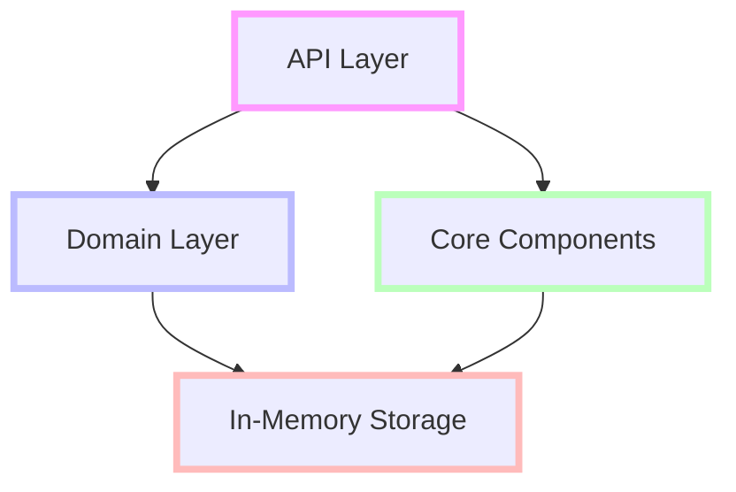
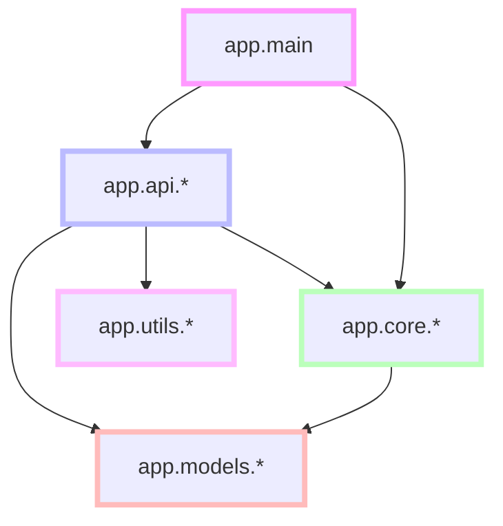

# Project Structure

## Overview

This document provides a comprehensive guide to the organization, structure, and architecture of the Cortex Core Phase 1 implementation. It covers the directory structure, module responsibilities, import patterns, coding conventions, and configuration files that form the foundation of the project.

The Cortex Core follows a modular, layered architecture with clear separation of concerns. Understanding this structure is essential for effectively navigating, maintaining, and extending the codebase.

## Directory Structure

The project follows this top-level directory structure:

```
cortex-core/
├── app/                    # Main application code
│   ├── api/                # API endpoints
│   ├── core/               # Core components
│   ├── models/             # Data models
│   │   ├── api/            # API request/response models
│   │   └── domain/         # Domain models
│   ├── utils/              # Utility functions
│   └── main.py             # Application entry point
├── tests/                  # Test suite
│   ├── unit/               # Unit tests
│   ├── integration/        # Integration tests
│   └── e2e/                # End-to-end tests
├── .env.example            # Example environment variables
├── requirements.txt        # Project dependencies
├── README.md               # Project documentation
└── .gitignore              # Git ignore file
```

## Architectural Layers

The codebase is organized into distinct architectural layers, each with specific responsibilities:



1. **API Layer**: Handles HTTP requests/responses and input/output transformations
2. **Domain Layer**: Defines the business models and validation rules
3. **Core Components**: Provides the event bus and other shared functionality
4. **In-Memory Storage**: Manages data persistence (will be replaced in future phases)

## Detailed Directory Structure

### Application Root (`app/`)

```
app/
├── __init__.py             # Package initialization
├── main.py                 # Application entry point
├── api/                    # API endpoints
│   ├── __init__.py
│   ├── auth.py             # Authentication endpoints
│   ├── input.py            # Input endpoint
│   ├── output.py           # Output streaming endpoint
│   └── config.py           # Configuration endpoints
├── core/                   # Core components
│   ├── __init__.py
│   ├── event_bus.py        # Event bus implementation
│   └── storage.py          # In-memory storage
├── models/                 # Data models
│   ├── __init__.py
│   ├── base.py             # Base models with metadata
│   ├── api/                # API models
│   │   ├── __init__.py
│   │   ├── request.py      # Request models
│   │   └── response.py     # Response models
│   └── domain.py           # Domain models
└── utils/                  # Utility functions
    ├── __init__.py
    └── auth.py             # Authentication utilities
```

### Test Suite (`tests/`)

```
tests/
├── __init__.py
├── conftest.py             # Shared test fixtures
├── unit/                   # Unit tests
│   ├── __init__.py
│   ├── test_models.py      # Test data models
│   ├── test_auth.py        # Test authentication
│   ├── test_event_bus.py   # Test event bus
│   └── test_storage.py     # Test in-memory storage
├── integration/            # Integration tests
│   ├── __init__.py
│   ├── test_api_auth.py    # Test auth endpoints
│   ├── test_api_input.py   # Test input endpoint
│   ├── test_api_output.py  # Test output endpoint
│   └── test_api_config.py  # Test config endpoints
└── e2e/                    # End-to-end tests
    ├── __init__.py
    └── test_flows.py       # Test complete flows
```

## Module Responsibilities

Each module in the project has clearly defined responsibilities to maintain separation of concerns and code organization.

### Main Application (`app/main.py`)

**Responsibilities**:

- Initialize FastAPI application
- Configure middleware (CORS, authentication)
- Register API routers
- Set up event handlers
- Handle application startup/shutdown

**Key Components**:

- FastAPI application instance
- Middleware configuration
- Router registration
- Startup/shutdown event handlers

**Example**:

```python
from fastapi import FastAPI
from fastapi.middleware.cors import CORSMiddleware
import logging
import os
from dotenv import load_dotenv

from app.api import auth, input, output, config
from app.core.event_bus import event_bus

# Load environment variables
load_dotenv()

# Configure logging
logging.basicConfig(
    level=getattr(logging, os.getenv("LOG_LEVEL", "INFO")),
    format="%(asctime)s - %(name)s - %(levelname)s - %(message)s",
)
logger = logging.getLogger(__name__)

# Create FastAPI app
app = FastAPI(title="Cortex Core")

# Add CORS middleware
app.add_middleware(
    CORSMiddleware,
    allow_origins=os.getenv("ALLOW_ORIGINS", "*").split(","),
    allow_credentials=True,
    allow_methods=["*"],
    allow_headers=["*"],
)

# Include routers
app.include_router(auth.router)
app.include_router(input.router)
app.include_router(output.router)
app.include_router(config.router)

# Root endpoint
@app.get("/", tags=["status"])
async def root():
    """API status endpoint."""
    return {"status": "online", "service": "Cortex Core"}

# Shutdown event
@app.on_event("shutdown")
async def shutdown_event():
    """Shutdown event handler."""
    logger.info("Application shutting down")
    await event_bus.shutdown()
```

### API Modules (`app/api/`)

**Responsibilities**:

- Define API endpoints and routes
- Validate input data
- Transform data between API and domain models
- Handle HTTP responses and errors
- Apply authentication

**Module Structure**:

- Each API module defines a FastAPI router
- Endpoints are grouped by functionality
- Authentication is applied using dependencies
- Responses use standardized models

**Example Router**:

```python
from fastapi import APIRouter, Depends, HTTPException

router = APIRouter(prefix="/config", tags=["config"])

@router.post("/workspace", response_model=WorkspaceResponse)
async def create_workspace(
    request: WorkspaceCreate,
    current_user: dict = Depends(get_current_user)
):
    """
    Create a new workspace.
    """
    user_id = current_user["user_id"]

    # Create a workspace domain model
    workspace = Workspace(
        name=request.name,
        description=request.description,
        owner_id=user_id,
        metadata=request.metadata
    )

    # Store the workspace
    workspace_dict = storage.create_workspace(workspace)

    # Return API response model
    return WorkspaceResponse(
        status="workspace created",
        workspace=Workspace(**workspace_dict)
    )
```

### Core Components (`app/core/`)

**Responsibilities**:

- Provide core functionality used across the application
- Implement the event bus for internal communication
- Manage data storage (in-memory for Phase 1)
- Handle shared business logic

**Key Components**:

- Event Bus (`event_bus.py`): Manages internal event distribution
- In-Memory Storage (`storage.py`): Provides data persistence

**Example - Event Bus**:

```python
import asyncio
import logging
from typing import Dict, List, Any, Set

logger = logging.getLogger(__name__)

class EventBus:
    """
    Simple in-memory event bus for internal communication.
    """
    def __init__(self):
        self.subscribers: List[asyncio.Queue] = []
        self._active_tasks: Set[asyncio.Task] = set()

    def subscribe(self, queue: asyncio.Queue) -> None:
        """Register a queue to receive events."""
        self.subscribers.append(queue)
        logger.debug(f"Subscribed new queue. Total subscribers: {len(self.subscribers)}")

    async def publish(self, event: Dict[str, Any]) -> None:
        """Publish an event to all subscribers."""
        for queue in self.subscribers:
            try:
                await queue.put(event)
            except Exception as e:
                logger.error(f"Failed to publish event to subscriber: {e}")

        logger.debug(f"Published event: {event.get('type')} to {len(self.subscribers)} subscribers")

    def unsubscribe(self, queue: asyncio.Queue) -> None:
        """Unregister a queue from receiving events."""
        if queue in self.subscribers:
            self.subscribers.remove(queue)
            logger.debug(f"Unsubscribed queue. Remaining subscribers: {len(self.subscribers)}")

    async def shutdown(self) -> None:
        """Shutdown the event bus."""
        # Cancel all active tasks
        for task in self._active_tasks:
            task.cancel()

        # Wait for all tasks to complete
        if self._active_tasks:
            await asyncio.gather(*self._active_tasks, return_exceptions=True)

        # Clear subscribers
        self.subscribers.clear()
        logger.info("Event bus shut down")

# Global event bus instance
event_bus = EventBus()
```

### Data Models (`app/models/`)

**Responsibilities**:

- Define data structures and validation rules
- Provide base models with common functionality
- Separate domain models from API models
- Support serialization/deserialization

**Key Components**:

- Base Models: Common functionality for all models
- Domain Models: Core business entities
- API Models: Request/response structures

**Example - Base Model**:

```python
from pydantic import BaseModel, Field
from typing import Dict, Any

class BaseModelWithMetadata(BaseModel):
    """
    Base model with metadata field for storing extra information such as
    experimental flags or debug data.
    """
    metadata: Dict[str, Any] = Field(default_factory=dict)
```

**Example - Domain Model**:

```python
import uuid
from datetime import datetime
from pydantic import BaseModel, Field
from typing import List
from .base import BaseModelWithMetadata

class Workspace(BaseModelWithMetadata):
    """Workspace model."""
    id: str = Field(default_factory=lambda: str(uuid.uuid4()))
    name: str
    description: str
    owner_id: str
```

**Example - API Model**:

```python
from pydantic import BaseModel, Field
from typing import Dict, Any
from ..base import BaseModelWithMetadata

class WorkspaceCreate(BaseModelWithMetadata):
    """Request to create a workspace."""
    name: str = Field(..., min_length=1, max_length=100, description="Workspace name")
    description: str = Field(..., min_length=1, max_length=500, description="Workspace description")
```

### Utilities (`app/utils/`)

**Responsibilities**:

- Provide helper functions and utilities
- Implement authentication mechanisms
- Supply shared functionality across the application

**Key Components**:

- Authentication utilities (`auth.py`): JWT token handling

**Example - Authentication Utilities**:

```python
import os
from datetime import datetime, timedelta
from typing import Dict, Any, Optional

from fastapi import Depends, HTTPException, status
from fastapi.security import OAuth2PasswordBearer
from jose import JWTError, jwt
from pydantic import BaseModel

# Configuration
SECRET_KEY = os.getenv("JWT_SECRET_KEY", "devsecretkey")
ALGORITHM = "HS256"
ACCESS_TOKEN_EXPIRE_MINUTES = 1440  # 24 hours

oauth2_scheme = OAuth2PasswordBearer(tokenUrl="auth/login")

def create_access_token(data: Dict[str, Any], expires_delta: Optional[timedelta] = None) -> str:
    """Create a JWT access token."""
    to_encode = data.copy()
    expire = datetime.utcnow() + (expires_delta or timedelta(minutes=ACCESS_TOKEN_EXPIRE_MINUTES))
    to_encode.update({"exp": expire})
    return jwt.encode(to_encode, SECRET_KEY, algorithm=ALGORITHM)

async def get_current_user(token: str = Depends(oauth2_scheme)) -> Dict[str, Any]:
    """Validate the JWT token and extract user data."""
    credentials_exception = HTTPException(
        status_code=status.HTTP_401_UNAUTHORIZED,
        detail="Invalid authentication credentials",
        headers={"WWW-Authenticate": "Bearer"},
    )

    try:
        payload = jwt.decode(token, SECRET_KEY, algorithms=[ALGORITHM])
        user_id = payload.get("oid")
        name = payload.get("name")
        email = payload.get("email")

        if user_id is None:
            raise credentials_exception

        return {"user_id": user_id, "name": name, "email": email}
    except JWTError:
        raise credentials_exception
```

## Import Patterns

The project follows specific import patterns to maintain clear dependencies and avoid circular imports.

### Import Structure

1. **Standard Library Imports**: Python standard library modules
2. **Third-Party Imports**: External library dependencies
3. **Application Imports**: Internal application modules

Each section should be separated by a blank line, and imports should be alphabetized within each section.

### Import Examples

```python
# Standard library imports
import asyncio
import json
import logging
import os
from datetime import datetime, timedelta
from typing import Dict, List, Any, Optional, Set

# Third-party imports
from fastapi import APIRouter, Depends, FastAPI, HTTPException, Request, status
from fastapi.middleware.cors import CORSMiddleware
from fastapi.responses import JSONResponse, StreamingResponse
from fastapi.security import OAuth2PasswordBearer, OAuth2PasswordRequestForm
from jose import JWTError, jwt
from pydantic import BaseModel, Field

# Application imports
from app.core.event_bus import event_bus
from app.core.storage import storage
from app.models.api.request import WorkspaceCreate
from app.models.api.response import WorkspaceResponse
from app.models.domain import Workspace
from app.utils.auth import get_current_user
```

### Relative vs. Absolute Imports

- Prefer absolute imports for clarity and to avoid confusion
- Use relative imports only for imports within the same package
- Always use explicit imports (avoid wildcard imports like `from module import *`)

**Absolute Import Example**:

```python
from app.models.domain import User, Workspace
from app.utils.auth import get_current_user
```

**Relative Import Example** (only for modules in the same package):

```python
from .base import BaseModelWithMetadata
from ..utils.auth import get_current_user
```

## Dependency Management

### Module Dependencies

The project follows a clear dependency structure to prevent circular dependencies:



### Dependency Rules

1. **Main Module**: Can import from any other module
2. **API Modules**: Can import models, utils, and core components
3. **Core Modules**: Can import models but not API modules
4. **Model Modules**: Should not import from API or core modules
5. **Utility Modules**: Should be mostly self-contained

### Singleton Pattern

The project uses the singleton pattern for shared resources:

```python
# Global event bus instance
event_bus = EventBus()

# Global storage instance
storage = InMemoryStorage()
```

These global instances are imported where needed, ensuring a single instance is shared across the application.

## Code Organization Principles

### Function and Class Structure

Each function and class should follow this organization:

1. **Docstring**: Describe purpose and behavior
2. **Constants/Attributes**: Define constants and class attributes
3. **Initialization**: Initialize objects, set up state
4. **Public Methods**: Methods intended for external use
5. **Private Methods**: Internal implementation details (prefixed with `_`)
6. **Helper Methods**: Small, reusable utility methods

**Example**:

```python
class MessageProcessor:
    """
    Processes messages and applies transformations.

    This class handles message validation, transformation, and routing.
    """
    # Constants
    MAX_MESSAGE_SIZE = 10000
    VALID_TYPES = ["text", "image", "file"]

    def __init__(self, event_bus):
        """Initialize the message processor."""
        self.event_bus = event_bus
        self.processed_count = 0

    def process_message(self, message: dict) -> dict:
        """
        Process a message and return the transformed result.

        Args:
            message: The message to process

        Returns:
            The processed message

        Raises:
            ValueError: If the message is invalid
        """
        # Validate the message
        self._validate_message(message)

        # Transform the message
        transformed = self._transform_message(message)

        # Update processed count
        self.processed_count += 1

        return transformed

    def _validate_message(self, message: dict) -> None:
        """
        Validate the message structure.

        Args:
            message: The message to validate

        Raises:
            ValueError: If the message is invalid
        """
        if not message.get("content"):
            raise ValueError("Message must have content")

        if len(message["content"]) > self.MAX_MESSAGE_SIZE:
            raise ValueError(f"Message content exceeds maximum size of {self.MAX_MESSAGE_SIZE}")

        if message.get("type") not in self.VALID_TYPES:
            raise ValueError(f"Message type must be one of {self.VALID_TYPES}")

    def _transform_message(self, message: dict) -> dict:
        """
        Transform the message.

        Args:
            message: The message to transform

        Returns:
            The transformed message
        """
        # Create a copy of the message
        result = message.copy()

        # Add timestamp if not present
        if "timestamp" not in result:
            result["timestamp"] = datetime.now().isoformat()

        # Add processed flag
        result["processed"] = True

        return result
```

### API Endpoint Structure

API endpoints should follow this structure:

1. **Route Definition**: Define the route and HTTP method
2. **Docstring**: Describe the endpoint purpose and behavior
3. **Request Validation**: Validate input data
4. **Authentication/Authorization**: Check user permissions
5. **Business Logic**: Process the request
6. **Response Formatting**: Format the response

**Example**:

```python
@router.post("/workspace", response_model=WorkspaceResponse)
async def create_workspace(
    request: WorkspaceCreate,
    current_user: dict = Depends(get_current_user)
):
    """
    Create a new workspace.

    Args:
        request: The workspace creation request
        current_user: The authenticated user

    Returns:
        The created workspace

    Raises:
        HTTPException: If the workspace could not be created
    """
    # Extract user ID from authentication
    user_id = current_user["user_id"]

    try:
        # Create workspace model
        workspace = Workspace(
            name=request.name,
            description=request.description,
            owner_id=user_id,
            metadata=request.metadata
        )

        # Store workspace
        workspace_dict = storage.create_workspace(workspace)

        # Return response
        return WorkspaceResponse(
            status="workspace created",
            workspace=Workspace(**workspace_dict)
        )
    except Exception as e:
        logger.error(f"Failed to create workspace: {e}")
        raise HTTPException(
            status_code=500,
            detail="Failed to create workspace"
        )
```

## Naming Conventions

### Python Naming Conventions

The project follows PEP 8 naming conventions:

- **Modules**: Lowercase with underscores (`event_bus.py`)
- **Packages**: Lowercase without underscores (`app`)
- **Classes**: CapWords/PascalCase (`EventBus`)
- **Functions/Methods**: Lowercase with underscores (`publish_event`)
- **Variables**: Lowercase with underscores (`event_data`)
- **Constants**: Uppercase with underscores (`MAX_RETRIES`)
- **Private Members**: Prefixed with underscore (`_private_method`)

### Specific Naming Rules

- **API Router Variables**: Named `router`
- **Model Fields**: Lowercase with underscores
- **Event Types**: Lowercase with underscores (`input`, `output`, `heartbeat`)
- **Environment Variables**: Uppercase with underscores (`JWT_SECRET_KEY`)

### File Naming Conventions

- **Python Files**: Lowercase with underscores (`event_bus.py`)
- **Test Files**: Prefixed with `test_` (`test_event_bus.py`)
- **Configuration Files**: Lowercase with appropriate extension (`.env`, `.gitignore`)

## Testing Structure

### Test Organization

Tests are organized by type and module:

- **Unit Tests**: Test individual functions and classes
- **Integration Tests**: Test interactions between components
- **End-to-End Tests**: Test complete flows

### Test Naming

Test files and functions use clear naming:

- **Test Files**: `test_[module].py`
- **Test Functions**: `test_[function]_[scenario]`

**Example**:

```python
# test_event_bus.py
def test_publish_event_to_subscriber():
    """Test that events are published to subscribers."""

def test_unsubscribe_removes_queue():
    """Test that unsubscribe removes the queue from subscribers."""
```

### Test Fixtures

Test fixtures are defined in `conftest.py`:

```python
# conftest.py
import pytest
import asyncio
from app.core.event_bus import EventBus

@pytest.fixture
def event_bus():
    """Return a fresh event bus instance for testing."""
    return EventBus()

@pytest.fixture
async def event_queue():
    """Return an asyncio queue for testing event subscriptions."""
    return asyncio.Queue()
```

## Configuration Management

### Environment Variables

The project uses environment variables for configuration, defined in `.env`:

```
# Core configuration
PORT=8000
ENV=development
LOG_LEVEL=INFO

# Auth configuration
JWT_SECRET_KEY=your-secret-key-here
JWT_ALGORITHM=HS256
JWT_EXPIRATION_HOURS=24

# CORS settings
ALLOW_ORIGINS=*
```

### Loading Environment Variables

Environment variables are loaded at application startup:

```python
from dotenv import load_dotenv

# Load environment variables from .env file
load_dotenv()

# Access environment variables
port = int(os.getenv("PORT", 8000))
jwt_secret = os.getenv("JWT_SECRET_KEY", "devsecretkey")
```

## Documentation

### Code Documentation

All code should include docstrings in the Google style:

```python
def create_access_token(data: Dict[str, Any], expires_delta: Optional[timedelta] = None) -> str:
    """
    Create a JWT access token.

    Args:
        data: The data to encode in the token
        expires_delta: Optional expiration time override

    Returns:
        JWT token string
    """
```

### Type Hints

All functions and methods should include type hints:

```python
def subscribe(self, queue: asyncio.Queue) -> None:
    """Register a queue to receive events."""
```

### README and Documentation Files

Project-level documentation is provided in Markdown files:

- **README.md**: Project overview, setup instructions
- **ARCHITECTURE.md**: System architecture and design
- **IMPLEMENTATION_GUIDE.md**: Implementation details and guidelines
- **TESTING_STRATEGY.md**: Testing approach and practices

## Development Workflow

### Running the Application

The application can be run with:

```bash
# Run with default configuration
python -m app.main

# Run with custom port
PORT=9000 python -m app.main

# Run with custom configuration
ENV=production JWT_SECRET_KEY=production-key python -m app.main
```

### Running Tests

Tests can be run with pytest:

```bash
# Run all tests
pytest

# Run unit tests only
pytest tests/unit/

# Run tests for a specific module
pytest tests/unit/test_event_bus.py

# Run tests with coverage report
pytest --cov=app
```

## Evolution Path for Future Phases

While Phase 1 focuses on a minimal, in-memory implementation, the project structure is designed to support future phases:

### Phase 2: Persistence

- Storage implementation will be replaced with database repositories
- Model validation will be enhanced
- File structure remains largely the same

### Phase 3: MCP Integration

- New directories for MCP clients and services
- Core components will be extended, not replaced
- API remains stable with enhanced functionality

### Phase 4: Distributed Services

- Service discovery and management components
- Enhanced logging and monitoring
- Configuration management for distributed services

### Phase 5: Production Hardening

- Security enhancements
- Performance optimization
- Deployment configuration

## Conclusion

The project structure for Cortex Core Phase 1 follows a clean, modular organization with clear separation of concerns. This structure provides a solid foundation for the current implementation while allowing for future growth and enhancement.

Key takeaways:

1. **Clear Organization**: Well-defined modules with specific responsibilities
2. **Layered Architecture**: Clean separation between API, domain, and core components
3. **Consistent Patterns**: Uniform naming, importing, and coding conventions
4. **Testability**: Structured testing approach with proper isolation
5. **Scalability**: Design that accommodates future enhancements

By following this structure, developers can easily navigate, understand, and extend the codebase while maintaining its architectural integrity.
