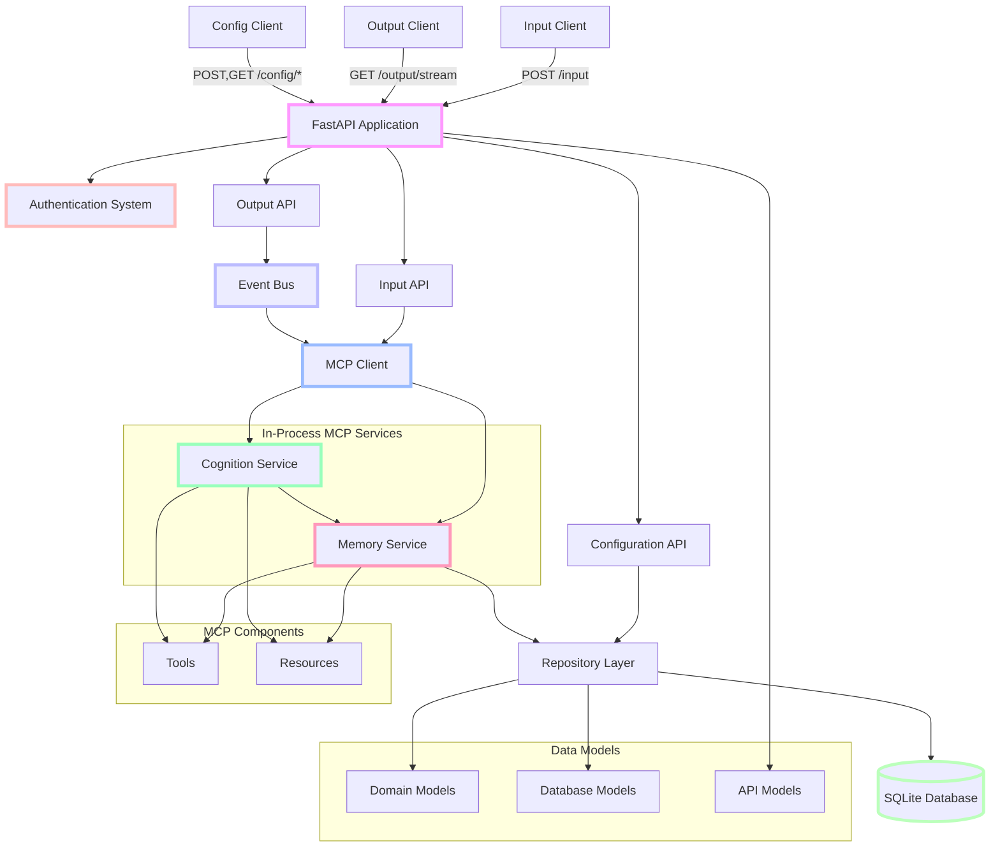

# Cortex Core Phase 3: MCP Protocol and Service Architecture

## Project Overview

Phase 3 introduces the Model Context Protocol (MCP) architecture with in-process service implementations. Building on the SQLite persistence and configuration API from Phase 2, this phase establishes clear service boundaries and communication patterns while keeping everything within a single process for simplicity. This approach sets the foundation for the distributed services in Phase 4 while maintaining the system's current functionality.

This phase focuses on implementing the MCP client within the core application, creating in-process Memory and Cognition services, and establishing the tool/resource pattern that defines the MCP architecture. These changes reshape the internal architecture while maintaining backward compatibility with existing clients.

## Goals of Phase 3

1. **Introduce MCP Architecture**: Establish the Model Context Protocol design pattern
2. **Implement In-Process Services**: Create Memory and Cognition services within the application process
3. **Establish Service Boundaries**: Define clear service interfaces and responsibilities
4. **Create MCP Client**: Build a client that communicates with MCP services
5. **Define Standard Tools and Resources**: Implement a consistent tool/resource pattern
6. **Maintain Backward Compatibility**: Ensure existing client applications continue to work
7. **Prepare for Distribution**: Set the foundation for fully distributed services in Phase 4

## System Architecture - Phase 3



### Phase 3 Components

1. **MCP Client** (New)

   - Interface for communicating with MCP services
   - Tool calling functionality
   - Resource retrieval capability
   - In-process implementation initially
   - Designed to be network-capable in the future

2. **Memory Service** (New)

   - Responsible for storing and retrieving data
   - Implements the MCP server interface
   - Provides tools for storage operations
   - Exposes resources for data retrieval
   - Communicates with repository layer

3. **Cognition Service** (New)

   - Responsible for processing and analyzing data
   - Implements the MCP server interface
   - Provides tools for context generation
   - Retrieves data from Memory Service as needed
   - Processes information to provide insights

4. **Tools and Resources** (New)

   - Standard patterns for service functionality
   - Tools: Executable functions with side effects
   - Resources: Data that can be accessed and read
   - Clear interface definitions
   - Consistent naming and parameter conventions

5. **FastAPI Application** (Existing)

   - Updated to use MCP client for operations
   - Maintains existing endpoints for backward compatibility
   - Routes appropriate requests to MCP services

6. **Input/Output APIs** (Existing)

   - Modified to work with MCP services
   - Maintained backward compatibility for clients
   - Routing through MCP client where appropriate

7. **Event Bus** (Existing)

   - Integrated with MCP client for event distribution
   - Maintained functionality for SSE connections
   - Enhanced to work with service architecture

8. **Repository Layer** (Existing)

   - Used by Memory Service for data access
   - Maintained SQLite integration from Phase 2
   - Possibly enhanced for service-specific needs

9. **Authentication System** (Existing)
   - Unchanged from Phase 2
   - Used across all components

## What's Included in Phase 3

- ✅ Complete MCP client implementation for in-process services
- ✅ Memory Service with tools for data storage and retrieval
- ✅ Cognition Service with tools for context generation
- ✅ Tool and resource definition patterns
- ✅ Integration between services and existing components
- ✅ Service discovery mechanism (simplified for in-process)
- ✅ Updated input processing flow using services
- ✅ Integration with existing event bus
- ✅ Enhanced testing for service components
- ✅ Documentation for MCP architecture and patterns

## What's Explicitly NOT Included in Phase 3

- ❌ Network-based service communication (reserved for Phase 4)
- ❌ Standalone service processes (reserved for Phase 4)
- ❌ Complex service discovery (simplified in this phase)
- ❌ Advanced error recovery for service communication
- ❌ Service scaling capabilities
- ❌ Container-based deployments
- ❌ Load balancing between services
- ❌ Complex service mesh features
- ❌ High availability configurations
- ❌ Feature-rich domain expert services

## Success Criteria for Phase 3

Phase 3 is considered successfully completed when:

1. The MCP client can successfully communicate with in-process services
2. Memory Service properly stores and retrieves data
3. Cognition Service correctly processes information
4. Existing functionality (input, output, configuration) continues to work
5. Phase 1 and Phase 2 clients continue to work without modification
6. Service boundaries are clearly defined and enforced
7. All tests pass with the new service architecture
8. The system architecture is ready for distribution in Phase 4

## Key Implementation Principles for Phase 3

1. **In-Process First**: Keep services within the same process until the architecture is proven
2. **Clean Service Boundaries**: Define clear interfaces between components that will scale to distributed implementations
3. **Standard Patterns**: Establish consistent patterns for tools and resources
4. **Interface Stability**: Design interfaces that will remain stable when distributed
5. **Minimal Service Communication**: Design services to minimize cross-service communication
6. **End-to-End First**: Focus on complete workflows before optimizing individual components
7. **Forward Compatibility**: Design with future distributed implementation in mind
8. **Simplified Discovery**: Use direct service registration for in-process services
9. **Limited Scope**: Focus on essential tools and resources, avoiding unnecessary complexity
10. **Pragmatic Implementation**: Implement just enough to prove the architecture works

## Phase 3 Data Flow

1. **Input Processing Flow with Services**:

   ```
   Client → POST /input + JWT → Input API → MCP Client →
   Memory Service Tool:store_input → Repository Layer → SQLite Database
   ```

2. **Context Generation Flow**:

   ```
   Client → POST /input + JWT → Input API → MCP Client →
   Cognition Service Tool:get_context →
   Memory Service Resource:history → Repository Layer →
   Context Data → Response
   ```

3. **Output Flow with Services**:
   ```
   Client → GET /output/stream + JWT → Output API → SSE Connection →
   Event Bus → MCP Client → Memory Service Resource:history →
   Filtered Events → Client
   ```

## Critical Implementation Details

### MCP Client Implementation

The MCP client provides a standardized interface for communicating with services implementing the Model Context Protocol.

Key details:

- In-process implementation for Phase 3, network-ready for Phase 4
- Tool calling functionality with standardized parameter passing
- Resource retrieval with URI-based addressing
- Support for initializing connections to services
- Error handling for service communication

**MCP Client Interface Example**:

```python
class McpClient:
    async def connect(self) -> None:
        """Connect to MCP server"""
        pass

    async def call_tool(self, name: str, arguments: dict) -> dict:
        """Call a tool on the MCP server"""
        pass

    async def get_resource(self, uri: str) -> dict:
        """Get a resource from the MCP server"""
        pass

    async def close(self) -> None:
        """Close the connection"""
        pass
```

The in-process implementation directly calls service methods, while the future network implementation will use HTTP and SSE.

### Memory Service Implementation

The Memory Service is responsible for storing and retrieving data, implementing the MCP server interface with tools and resources.

Key details:

- Implements the MCP server interface
- Provides tools for data storage operations
- Exposes resources for data retrieval
- Communicates with the repository layer for persistence
- User-partitioned data access

**Memory Service Tools Example**:

```python
@mcp.tool()
async def store_input(user_id: str, input_data: dict) -> dict:
    """
    Store input data for a specific user.

    Args:
        user_id: The unique user identifier
        input_data: The input data to store

    Returns:
        Status object with operation result
    """
    # Implementation using repository layer
    pass
```

**Memory Service Resources Example**:

```python
@mcp.resource("history/{user_id}")
async def get_history(user_id: str) -> list:
    """
    Get history for a specific user.

    Args:
        user_id: The unique user identifier

    Returns:
        List containing the user's history
    """
    # Implementation using repository layer
    pass
```

### Cognition Service Implementation

The Cognition Service is responsible for processing and analyzing data, implementing the MCP server interface.

Key details:

- Implements the MCP server interface
- Provides tools for context generation and analysis
- Communicates with the Memory Service for data retrieval
- Processes information to provide insights
- Maintains stateless operation for future scaling

**Cognition Service Tools Example**:

```python
@mcp.tool()
async def get_context(user_id: str, query: str = None, limit: int = 10) -> dict:
    """
    Get relevant context for a user.

    Args:
        user_id: The unique user identifier
        query: Optional search query to filter context
        limit: Maximum number of items to return

    Returns:
        Object containing relevant context items
    """
    # Implementation using Memory Service
    pass
```

### Tool and Resource Pattern

The MCP architecture is built around the concepts of tools and resources, which provide a standardized way to interact with services.

Key details:

- **Tools**: Executable functions that can perform operations with side effects

  - Called with named arguments
  - Return structured data
  - Can modify system state
  - Used for operations like storing data or generating content

- **Resources**: Data that can be accessed and read
  - Addressed using URI-style paths
  - Return structured data
  - Read-only (no side effects)
  - Used for retrieving data like history or context

**Tool Definition Pattern**:

```python
@mcp.tool()
async def tool_name(param1: type, param2: type = default_value) -> dict:
    """
    Tool description.

    Args:
        param1: Description of param1
        param2: Description of param2

    Returns:
        Description of return value
    """
    # Implementation
    pass
```

**Resource Definition Pattern**:

```python
@mcp.resource("resource/path/{parameter}")
async def resource_name(parameter: type) -> dict:
    """
    Resource description.

    Args:
        parameter: Description of parameter

    Returns:
        Description of return value
    """
    # Implementation
    pass
```

### Service Discovery

In Phase 3, service discovery is simplified since all services run in-process.

Key details:

- Direct registration of services with the MCP client
- Service name-based routing
- Simple mapping from service names to implementation classes
- Foundational patterns that will expand in Phase 4
- No network service discovery needed yet

**Service Registration Example**:

```python
# Initialize services
memory_service = MemoryService(repository_manager)
cognition_service = CognitionService()

# Register services with MCP client manager
mcp_client_manager = McpClientManager()
mcp_client_manager.register_service("memory", memory_service)
mcp_client_manager.register_service("cognition", cognition_service)

# Get client for a specific service
memory_client = mcp_client_manager.get_client("memory")
cognition_client = mcp_client_manager.get_client("cognition")
```

## Integration with Client Applications

Phase 3 maintains backward compatibility with Phase 1 and Phase 2 clients while enabling new internal capabilities.

### For External Clients

- No changes required for existing clients
- Same input, output, and configuration endpoints continue to work
- Same authentication mechanism is maintained
- Same event formats for SSE connections
- Same request/response formats for all endpoints

### For Service Developers

New guidance for developers wanting to create MCP-compatible services:

1. **Tool Implementation**:

   - Follow the standard tool definition pattern
   - Use proper parameter typing and validation
   - Return structured responses
   - Provide comprehensive documentation
   - Handle errors appropriately

2. **Resource Implementation**:

   - Follow the standard resource definition pattern
   - Use intuitive resource paths with parameters
   - Return structured data
   - Implement proper access control
   - Handle errors appropriately

3. **Service Interface**:

   - Implement the MCP server interface
   - Register tools and resources properly
   - Maintain stateless operation where possible
   - Document dependencies and requirements
   - Follow consistent naming conventions

4. **Testing Approach**:
   - Test tools individually with various inputs
   - Test resources with different parameters
   - Verify access control works correctly
   - Test error conditions and recovery
   - Create integration tests with other services

## Common Pitfalls and Challenges

Be aware of these common implementation challenges specific to Phase 3:

1. **Service Boundary Violations**:

   - Bypassing the MCP interface for direct calls
   - Sharing state between services inappropriately
   - Tight coupling between services
   - Inconsistent interface design

2. **Tool/Resource Design Issues**:

   - Inconsistent naming conventions
   - Poor parameter design
   - Inadequate documentation
   - Mixing tool and resource responsibilities
   - Excessive cross-service communication

3. **In-Process Service Challenges**:

   - Shared memory leading to subtle bugs
   - Assuming in-process behavior that won't work distributed
   - Missing serialization considerations
   - Inadequate error handling
   - Ignoring future network constraints

4. **MCP Client Implementation Issues**:

   - Inconsistent error handling
   - Poor connection management
   - Inadequate timeout handling
   - Missing retry logic
   - Synchronous code in async functions

5. **Backward Compatibility Challenges**:
   - Breaking existing endpoints
   - Changing event formats
   - Modifying authentication requirements
   - Altering expected response formats
   - Changing error handling behavior

## Validating Your Implementation

To ensure your Phase 3 implementation is correct:

1. **Service Interface Testing**:

   - Verify each tool works as expected with various inputs
   - Test resources with different parameters
   - Verify error handling for invalid inputs
   - Test access control and user partitioning

2. **End-to-End Flow Testing**:

   - Test the complete input flow through services
   - Verify context generation works correctly
   - Test output flow with the new service architecture
   - Ensure proper event delivery to clients

3. **Backward Compatibility Testing**:

   - Verify Phase 1 and Phase 2 clients work without modification
   - Test all existing endpoints with the new architecture
   - Ensure event formats remain consistent
   - Verify error responses maintain the same format

4. **Service Boundary Testing**:
   - Verify services only communicate through proper interfaces
   - Test service isolation and independence
   - Ensure proper data partitioning between users
   - Verify services handle errors appropriately

## Phase 3 in the Overall Project Timeline

Phase 3 builds on Phase 2 and prepares for Phase 4:

1. Phase 1: Functional Input/Output System with In-Memory Storage
2. Phase 2: Configuration API & Basic Persistence
3. **Phase 3: MCP Protocol and Service Architecture** (current phase)
4. Phase 4: Distributed Services
5. Phase 5: Production Hardening

## Developer Environment

Phase 3 requires the following additions to the Phase 2 environment:

- FastMCP Python SDK (for MCP implementation)
- Additional testing tools for service testing

Additional environment variables:

```
# Service configuration
MEMORY_SERVICE_ENABLED=true
COGNITION_SERVICE_ENABLED=true
```

## Implementation Approach

The recommended implementation sequence for Phase 3 is:

1. **MCP Client Design**

   - Define the MCP client interface
   - Create the in-process implementation
   - Implement tool calling functionality
   - Add resource retrieval capability
   - Create service registration mechanism

2. **Memory Service Implementation**

   - Define the service interface
   - Implement tools for data storage
   - Create resources for data retrieval
   - Integrate with repository layer
   - Add proper error handling

3. **Cognition Service Implementation**

   - Define the service interface
   - Implement context generation tools
   - Create integration with Memory Service
   - Add analytic capabilities
   - Implement error handling

4. **Integration with Existing Components**

   - Update input API to use Memory Service
   - Modify event bus to work with services
   - Ensure configuration API continues to work
   - Maintain backward compatibility
   - Update error handling for service integration

5. **Service Discovery Mechanism**

   - Implement simple service registration
   - Create service name resolution
   - Add service initialization on startup
   - Implement graceful shutdown
   - Add service health checking

6. **Testing Framework**

   - Create service-specific test utilities
   - Implement tool and resource testing
   - Create integration tests for services
   - Test end-to-end flows
   - Verify backward compatibility

7. **Documentation**
   - Document MCP architecture
   - Create tool and resource catalogs
   - Update implementation guides
   - Document service interfaces
   - Create examples for service developers

At each step, verify that the implementation works as expected before moving on, focusing on complete functional paths rather than perfect components.

## Conclusion

Phase 3 introduces the Model Context Protocol architecture with in-process service implementations, establishing the foundation for the fully distributed system in Phase 4. By implementing Memory and Cognition services within the application process, this phase proves the service architecture while maintaining backward compatibility with existing clients.

The focus remains on pragmatic implementation and ruthless simplicity, creating just enough structure to validate the architecture without unnecessary complexity. This approach enables a smooth transition to distributed services in the next phase while preserving all existing functionality.

The subsequent documentation will provide detailed specifications for the MCP client, service implementations, tool and resource patterns, and integration guidance.
