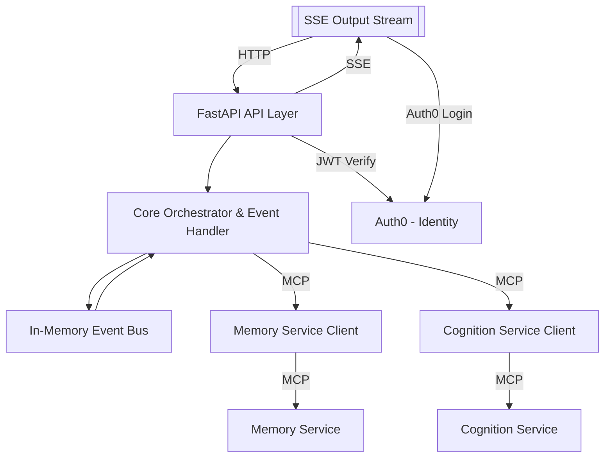

# Cortex Core MVP – Project Structure and Initial Setup Guide

## Overview

This guide describes how to scaffold the initial project structure for the Cortex Core MVP. Cortex Core is the central orchestrator that connects **frontend clients** (which send and receive messages) with the **intelligent backend services** (Memory Service, Cognition Service, etc.) that actually handle data storage and AI processing. In this initial setup, we will create a clean and minimal codebase layout without implementing full functionality. The goal is to set up all the modules and packages needed for the MVP, with each component defined but only as simple placeholders. This lets different parts of the system be built in parallel later, while ensuring the overall architecture is in place and easy to understand.

**Key goals of this step:**

- Establish the core package structure (API layer, core logic, models, backend integrations, utilities).
- Create a FastAPI application with a basic health-check endpoint to verify the server runs.
- Include empty classes, functions, and routers with docstrings that outline their purpose (but without actual logic yet).
- Keep the design extremely simple and aligned with the project’s minimalist philosophy – no extra code or dependencies beyond FastAPI and Uvicorn.

By the end of this setup, we will have a runnable FastAPI app (accessible via a health check) and a code organization that reflects the overall architecture of Cortex Core. All further development (adding data models, endpoints, event handling, etc.) will build on this foundation.

### High-Level Architecture

Below is a high-level architecture diagram of Cortex Core and its main components. It shows how the API layer, core logic, and backend services will interact once the system is built out. At this stage, we are only scaffolding these pieces (they will mostly be empty), but it's important to see how they fit together:



_Diagram: The Cortex Core FastAPI API receives requests from a client. The core orchestrator logic uses an internal event bus to coordinate tasks. It communicates with external services (Memory, Cognition) via the Model Context Protocol (MCP) using client libraries. Responses are sent back to clients through a Server-Sent Events (SSE) stream. Authentication is handled by Auth0 (JWT tokens in requests)._

## Implementation Philosophy and Approach

We will follow the Cortex platform’s implementation principles closely while setting up the project:

- **Ruthless Simplicity:** Implement only what is needed right now in the simplest way. Every file and line of code should serve a clear purpose. We avoid any premature optimization or abstraction. For example, if a feature or layer isn't necessary for the initial use cases, we will not include it at this stage.

- **Direct Integration (No Wrappers):** We use well-known libraries and services as-is, without writing indirection layers around them. FastAPI will be used directly to define web API endpoints (no custom web framework on top of it), and Uvicorn will run the server as the ASGI runtime. We won’t create generic “framework” classes around these; we'll just call them in the intended way. This keeps the code straightforward and leverages the robustness of these libraries.

- **Separation of Concerns:** Each module in the project has a single, clear responsibility. The code is organized so that the API layer only handles HTTP and validation, the core orchestrator handles event flow and coordination, the backend clients only talk to their respective external service, etc. There is no global shared state or unnecessary coupling between components – they interact through well-defined interfaces (function calls, events, or external APIs). This makes the system easier to develop and maintain.

- **Present-Moment Implementation:** We focus on the requirements of the MVP and do not implement features “just in case” they might be needed later. Unused or speculative code is omitted. For example, we will not add complex configuration management or multi-user support until those are actually needed. This keeps the initial codebase lean and easier to understand.

Additionally, we strictly uphold integration boundaries and recommended usage patterns for key technologies in the Cortex platform. This means:

- **FastAPI as the Web Framework:** We use FastAPI in the normal way – declaring `APIRouter` instances and endpoint functions with decorators. We do not wrap FastAPI in any custom classes or modify its request/response handling; the API layer remains a thin wrapper that delegates to core logic. FastAPI’s built-in features (like automatic JSON validation via Pydantic models, dependency injection, and exception handling) will be utilized directly in later steps.

- **Uvicorn as the Server:** We will use Uvicorn to run the app (either via the command line or by calling `uvicorn.run` in code). No custom server loop or threaded server is written – we trust Uvicorn to serve our FastAPI app efficiently. This keeps deployment simple and standard.

- **FastMCP for Service Communication:** When the core needs to communicate with backend services (Memory, Cognition), it will use the FastMCP client library provided by the platform. We will not create a new protocol or complex wrapper for these calls. In this initial setup, we’ll just lay a placeholder for these clients. In a later iteration, those placeholders will be implemented by calling FastMCP methods to reach the external services.

- **Pydantic and Pydantic-AI for Data Models:** We plan to use Pydantic to define data models for request/response bodies and domain objects, and possibly **pydantic-ai** to structure and validate LLM outputs. At this stage, we won’t add those dependencies or models yet – but the structure is designed with the expectation that Pydantic models will be used for input validation and output formatting (ensuring the assistant’s responses have a defined schema). This avoids writing custom validation logic; instead we’ll rely on these libraries to enforce data contracts.

- **Auth0 for Authentication:** User authentication and identity is handled via Auth0. Our API will expect a JWT in the Authorization header of requests. We won’t implement our own user management or password handling. In this setup, we include a placeholder for JWT verification (which will later use Auth0’s public keys to validate tokens). The idea is to trust Auth0 as the identity provider and keep our auth-related code minimal (just token verification and extracting user info).

By adhering to these principles, we ensure the initial codebase is clean, simple, and aligned with the overall architecture vision. Now let's outline the project structure and create the necessary files.

## Project Structure

We will organize the code into the following packages and modules:

- **`app/`** – The application package. This will contain the FastAPI application startup code (in `main.py`) and act as the root package for the project. (Making `app` a package allows us to use absolute imports like `app.api` in our code.) The `app` directory will include all other sub-packages listed below, as well as an `__init__.py` to mark it as a package.

- **`api/`** – API router modules for different endpoint groups. Each submodule here corresponds to a set of endpoints:

  - `api/auth.py` will handle authentication-related endpoints (e.g., login or token verification endpoints).
  - `api/input.py` will handle incoming user input (e.g. a POST endpoint for user messages).
  - `api/output.py` will handle output streaming endpoints (e.g. a GET SSE endpoint for clients to receive responses).
  - `api/config.py` will handle configuration or miscellaneous endpoints (for example, retrieving app config or settings).
    All these modules will define FastAPI routers (`APIRouter`) and endpoint stubs.

- **`core/`** – Core orchestration logic and internal event handling. This is where the main conversation processing flow will live.

  - `core/event_bus.py` will define an in-memory event bus for publish/subscribe communication inside the app (used to decouple input events from output processing).
  - `core/response_handler.py` will define the response handling logic (the component that listens for new input events on the event bus and orchestrates calls to the memory and cognition services, and then publishes outputs). For now it will be a placeholder async function or class.
    (Later, additional core modules might be added, like an orchestrator or LLM integration, but for now we create just these two as the primary core components.)

- **`models/`** – Data models for domain objects and API schemas. We will leave this mostly empty for now (just an `__init__.py` as a placeholder). In the next phases, we’ll add Pydantic models here for users, messages, etc., and also any request/response schemas needed for the API. Keeping models separate ensures a clean separation between data definitions and business logic.

- **`backend/`** – Integrations with external backend services (Memory, Cognition, etc.). This will contain client code that communicates with the separate microservices:

  - `backend/memory_client.py` will be a stub for interacting with the Memory Service (storing and retrieving conversation state via MCP).
  - `backend/cognition_client.py` will be a stub for interacting with the Cognition Service (for performing analysis or generating LLM responses via MCP).
    In future steps, these will use the FastMCP library to send requests to the respective services. For now, we just define their interface (methods) as placeholders.

- **`utils/`** – Utility functions and helpers. For now, we will include an `utils/auth.py` with a placeholder for JWT verification logic. This could also house any other small helper (not tied to a specific module) in the future. Keeping Auth0-related helper separate from the API logic will make things cleaner.

Each directory will contain an `__init__.py` file (which can be empty or contain a short docstring) so that Python recognizes the directory as a package. Below is what the basic project structure will look like:

```
app/
├── __init__.py
├── main.py
├── api/
│   ├── __init__.py
│   ├── auth.py
│   ├── input.py
│   ├── output.py
│   └── config.py
├── core/
│   ├── __init__.py
│   ├── event_bus.py
│   └── response_handler.py
├── models/
│   └── __init__.py
├── backend/
│   ├── __init__.py
│   ├── memory_client.py
│   └── cognition_client.py
└── utils/
    ├── __init__.py
    └── auth.py
```

Now we will create each of these files with the minimal content needed. The code blocks below show the contents of each file. You can follow along and create each file in your development environment accordingly.

### Application Setup (FastAPI App Entry Point)

First, create the main application file that will initialize FastAPI and include the router modules. This will be `app/main.py`. It sets up the FastAPI app, includes all the routers from the `api` package, and defines a simple health check endpoint.

**File: `app/main.py`**

```python
from fastapi import FastAPI
# Import routers from the API submodules
from app.api import auth, input, output, config

app = FastAPI(title="Cortex Core MVP")

# Include API routers (stubs) into the main app
app.include_router(auth.router)
app.include_router(input.router)
app.include_router(output.router)
app.include_router(config.router)

@app.get("/health", tags=["system"])
async def health_check():
    """Health check endpoint to verify that the service is running."""
    return {"status": "ok"}

if __name__ == "__main__":
    # This block allows running the app directly for testing/development.
    import uvicorn
    uvicorn.run(app, host="0.0.0.0", port=8000)
```

**Explanation:** We create a FastAPI app instance and then include routers from our `api` modules (`auth`, `input`, `output`, `config`). Each of those modules defines an `APIRouter` which will register endpoints under specific prefixes (as we'll see below). By including them, we effectively mount those endpoint groups into the app. The `health_check` endpoint is defined at the root (GET `/health`) and simply returns a JSON indicating the service is up. This endpoint requires no authentication and can be used by load balancers or monitoring systems to check the app's status.

At the bottom, we have a typical `if __name__ == "__main__":` block which runs the app using Uvicorn. This allows the developer (or AI agent) to execute the module directly (e.g. `python app/main.py`) for quick tests. In a production setting, you might run Uvicorn via command line (`uvicorn app.main:app`), but having this in code can be convenient for an AI assistant or during development. We ensure to use Uvicorn as the ASGI server, following the standard practice (no custom server code).

### API Router Modules

Next, we create the API submodules in the `api/` package. Each submodule defines an `APIRouter` and one or more endpoint functions. At this stage, these endpoints will not contain real business logic – they will just return simple placeholder responses (or nothing at all) to indicate where things will happen. Each function has a docstring explaining its intended purpose to guide future implementation.

**File: `app/api/auth.py`**

```python
from fastapi import APIRouter

router = APIRouter(prefix="/auth", tags=["auth"])

@router.post("/login")
async def login():
    """Authenticate a user and return a JWT (placeholder implementation)."""
    # In a future step, this will verify user credentials and issue a JWT via Auth0
    return {"token": "dummy-token"}
```

_Auth Router:_ Defines routes under `/auth`. Here we include a `POST /auth/login` endpoint stub. In the real implementation (to be done in the Auth integration step), this might authenticate a user (perhaps via Auth0 or a development stub) and return a JWT. For now, it just returns a dummy token string to indicate success. By tagging it with `"auth"`, we label the group of endpoints (useful for documentation or future grouping).

**File: `app/api/input.py`**

```python
from fastapi import APIRouter

router = APIRouter(prefix="/input", tags=["input"])

@router.post("/")
async def receive_input():
    """Receive a user message (conversation input). Currently a placeholder."""
    # In the future, this will publish the message to the core event bus and return an ack
    return {"status": "received", "message": "Input received (dummy response)"}
```

_Input Router:_ Defines routes under `/input`. The main endpoint here is `POST /input/` which is intended to receive user messages. In a full implementation, this function would validate the input (likely a JSON body with a message and maybe conversation ID), possibly store the message via the Memory service, and then publish an event to the `EventBus` for the core to process. It would quickly return an acknowledgment response. For now, we simply return a dummy JSON confirming the input was received. This stub allows us to test that the routing works.

**File: `app/api/output.py`**

```python
from fastapi import APIRouter, HTTPException

router = APIRouter(prefix="/output", tags=["output"])

@router.get("/stream")
async def stream_output():
    """Open a Server-Sent Events stream for outputs. Not implemented yet."""
    # In the future, this will create an SSE stream to send events to the client
    # For now, indicate that it's not implemented.
    raise HTTPException(status_code=501, detail="Output streaming not implemented")
```

_Output Router:_ Defines routes under `/output`. The key endpoint we anticipate is `GET /output/stream`, which in the MVP will upgrade to a Server-Sent Events connection. Clients will connect to this to receive a stream of output events (like the assistant’s responses) in real-time. Setting up SSE involves returning a StreamingResponse and iterating over events, which we will implement later. At this stage, we simply have the function raise an HTTP 501 Not Implemented error, to clearly signal that this functionality is a placeholder. The docstring notes the intended behavior (opening an SSE stream). This setup ensures that the route is wired up, even if it doesn't do much yet, so we can integrate it when the core logic is ready.

**File: `app/api/config.py`**

```python
from fastapi import APIRouter

router = APIRouter(prefix="/config", tags=["config"])

# Placeholder for configuration-related endpoints (e.g., get/set configurations).
# No endpoints implemented yet.
```

_Config Router:_ Defines routes under `/config`. This module is reserved for any configuration or miscellaneous endpoints, such as retrieving application settings, listing available configurations, or perhaps a health detail endpoint. In the MVP, configuration management will likely be minimal or not needed initially, so we leave this as a stub. We create the router with prefix `/config` so that future endpoints can be added easily. Right now, it has no actual routes defined; it's effectively a placeholder. (Including it in the app won’t cause any issues – it simply means `/config` path exists but returns 404 for any specific sub-path since none are defined yet.)

With these four modules in `api/`, we have sketched out all the primary API endpoints that the Cortex Core will expose (auth, input, output, config). Each is minimal, but the names and structure make it clear what their roles are. The FastAPI app in `main.py` includes these routers, which means if you run the app now, you could hit the `/auth/login`, `/input/`, etc., and get the dummy responses or 501 error as coded. This confirms that the routing is set up correctly, even though actual logic is still to be added.

### Core Modules (Event Bus and Response Handler)

Next, we set up the core internal logic components in the `core/` package. This is the heart of the system where incoming messages will be processed and turned into outgoing responses. We create two main stubs: one for the event bus and one for the response handling orchestrator. These will allow the API and backend parts to connect through a common interface.

**File: `app/core/event_bus.py`**

```python
from typing import Callable, Dict, List

class EventBus:
    """In-memory publish/subscribe event bus for internal communication."""
    def __init__(self):
        """Initialize the event bus with no subscribers."""
        # Dictionary mapping event types to lists of subscriber callback functions
        self.subscribers: Dict[str, List[Callable]] = {}

    def subscribe(self, event_type: str, handler: Callable):
        """Subscribe a handler function to a given event type."""
        if event_type not in self.subscribers:
            self.subscribers[event_type] = []
        self.subscribers[event_type].append(handler)

    def publish(self, event_type: str, event_data: dict):
        """Publish an event to all subscribers of that event type."""
        # For simplicity, call subscribers synchronously (in future, may be async)
        if event_type in self.subscribers:
            for handler in self.subscribers[event_type]:
                try:
                    handler(event_data)
                except Exception as e:
                    # In a real implementation, log the error and continue
                    print(f"Error in event handler for {event_type}: {e}")
```

_Event Bus:_ We define a simple `EventBus` class that manages subscribers and events. The design is minimal: subscribers are stored in a dict keyed by `event_type`, each value a list of handler callables. The `subscribe` method allows components (like the response handler or others) to register for certain events (e.g., "input_received" or "output_ready"). The `publish` method invokes all handlers for a given event type immediately. (In a fully async context, we might make this `async` and use `await` or queue events, but to keep it simple, this stub uses a direct call and just catches exceptions to avoid any one handler crashing the bus.) This class will likely be instantiated as a singleton in the app (for example, on startup) and used to coordinate between the input endpoint and the response handler. The docstring and comments indicate how it’s meant to work. We’re not adding any complex features like event filtering, threading, or persistence – just a bare-bones pub/sub mechanism as envisioned by the architecture.

**File: `app/core/response_handler.py`**

```python
import asyncio

# (We might import EventBus and backend clients here in a full implementation)
# from app.core.event_bus import EventBus
# from app.backend.memory_client import MemoryClient
# from app.backend.cognition_client import CognitionClient

async def run_response_handler():
    """
    Background task that processes input events and produces output events.
    Subscribes to the EventBus and orchestrates calls to memory and cognition services.
    """
    # In a future step, this function will be started as a background task (e.g., on startup).
    # It will subscribe to input events on the EventBus, and for each event:
    # 1. Retrieve conversation context via MemoryClient.
    # 2. Invoke CognitionClient to get an AI-generated response.
    # 3. Publish an output event (which will be sent to clients via SSE).
    # For now, we just simulate an idle loop (no actual event processing yet).
    while True:
        await asyncio.sleep(1)
```

_Response Handler:_ We define an asynchronous function `run_response_handler` which will act as the core orchestrator loop. In later development, this would likely be launched as a background task when the app starts (for example, using `asyncio.create_task` in a startup event handler). The function is meant to subscribe to the event bus for new input events. When an input event is received, it will coordinate a sequence of actions: store or confirm the message in memory, fetch recent context from the Memory service, call the Cognition service to get a response, and then publish an output event (which the output SSE endpoint will push to the client). We outline these steps in the comments to make the plan explicit. For now, the function simply runs an infinite loop with a sleep – effectively doing nothing – since we have no events to handle yet. The loop is just a placeholder to indicate continuous running. The docstring summarizes the purpose of this handler. We also note that normally we would import the `EventBus`, `MemoryClient`, and `CognitionClient` to use them here, but since this is not implemented yet, those imports are commented out to avoid errors in this initial skeleton.

Later on, when implementing this, we will likely adjust the event bus to be async-friendly (perhaps each subscriber is called as a Task) and this loop to actually await events or use an async queue. But those details are left out for now to keep things simple.

With `EventBus` and `run_response_handler` in place, our core package has the essential pieces for internal orchestration. The API will publish events to the `EventBus` (for example, when an input comes in), and the `run_response_handler` will catch those and do the heavy lifting. This separation ensures the API request can return quickly (after publishing) and the rest happens asynchronously.

### Backend Service Clients (Memory & Cognition)

The `backend/` package will contain stubs for interacting with external services. These are the components that use the **FastMCP** protocol to communicate with the Memory and Cognition microservices. At this stage, we create client classes with method signatures that outline what they will do. We do not implement any actual network calls or MCP logic yet – that will come when we integrate the real services. The goal is to define a clear interface so the core logic knows what to expect from these clients.

**File: `app/backend/memory_client.py`**

```python
class MemoryClient:
    """
    Client for the Memory Service.
    Provides methods to store and retrieve conversation state via MCP.
    """
    def __init__(self):
        """Initialize connection or client setup for Memory Service (placeholder)."""
        # In a real scenario, we might establish an MCP connection here.
        pass

    async def store_message(self, user_id: str, conversation_id: str, content: str):
        """
        Store a new message in the memory service.
        (Placeholder implementation – in future, call FastMCP to store the message.)
        """
        # This would send the message data to the Memory service to be saved.
        return True

    async def get_recent_messages(self, user_id: str, conversation_id: str, limit: int = 10):
        """
        Retrieve recent messages from the memory service for context.
        Returns a list of messages (most recent first).
        (Placeholder implementation.)
        """
        # This would query the Memory service via MCP for the latest messages.
        return []
```

_MemoryClient:_ This class will handle persistence and retrieval of conversation data by communicating with the Memory microservice. We anticipate two primary operations: storing a new message (when a user sends a message, so it’s recorded in memory) and fetching recent messages (to provide context to the AI for generating a response). In the stub above, `store_message` and `get_recent_messages` are async methods that currently do nothing except return a dummy result (`True` for store, an empty list for get). The docstrings explain what these will eventually do. The `__init__` might handle any setup needed for connecting to the service (for instance, initializing an MCP client or auth tokens), but for now it’s just a placeholder `pass`. By defining this interface, the core response handler can be written to use `MemoryClient` without worrying about its internals.

**File: `app/backend/cognition_client.py`**

```python
class CognitionClient:
    """
    Client for the Cognition Service (LLM and analysis).
    Provides methods to analyze input and generate responses via MCP.
    """
    def __init__(self):
        """Initialize connection or client setup for Cognition Service (placeholder)."""
        # In a real scenario, we might initialize an MCP client or API wrapper here.
        pass

    async def generate_reply(self, user_id: str, conversation_id: str, message: str):
        """
        Send a user message to the Cognition service and get a generated reply.
        (Placeholder implementation – in future, call FastMCP or LLM API to get a response.)
        """
        # This would send the message (and possibly context) to the Cognition service.
        # The Cognition service would run the AI model and return a reply.
        return "This is a placeholder response."
```

_CognitionClient:_ This class will handle invoking the cognitive capabilities (likely an LLM or some logic) to generate a response to a user’s input. We provide a method `generate_reply` that would take the user and conversation identifiers and the new message content, and return a reply string (or a more structured result) from the Cognition service. For now, it just returns a static placeholder string. The docstring indicates its purpose. Like MemoryClient, the constructor does nothing yet but is where one might set up an MCP client connection to the Cognition service. In the future, this method might call an SDK provided by the Cognition service or an HTTP endpoint, but all that complexity is deferred. We just ensure the core can call `CognitionClient.generate_reply(...)` when it needs to, and expect a result.

By stubbing out `MemoryClient` and `CognitionClient`, we make it clear how the core logic will interface with these services. The core won’t need to know how the calls are implemented; it will just use these classes. This aligns with our separation of concerns: the core orchestrator doesn’t contain knowledge of HTTP or network details for these services, it just calls a method. And by planning to use FastMCP in these clients, we stick to the platform’s recommended integration method (instead of, say, directly hitting a database or other backdoor).

### Utility Module (Auth Helper)

Finally, we include a small utility for Auth0 integration in the `utils/` package. This is to prepare for JWT authentication. In FastAPI, verifying a JWT on each request often involves a dependency function that checks the token. We’ll eventually implement that, but for now we provide a placeholder function in `utils/auth.py` that can be expanded later.

**File: `app/utils/auth.py`**

```python
def verify_jwt(token: str):
    """
    Verify a JWT using Auth0's public keys and return the decoded token claims.
    (Placeholder implementation.)
    """
    # In a future step, this will decode and verify the JWT using jwks from Auth0.
    # For now, we'll just simulate that the token is valid if it exists.
    if not token:
        raise ValueError("No token provided")
    # Dummy behavior: return a fake claims dict
    return {"sub": "user|123456", "name": "Demo User"}
```

_Auth Utility:_ The `verify_jwt` function is a stand-in for actual JWT verification. In practice, this would use a library (or Auth0’s provided tools) to fetch the JSON Web Key Set (JWKS) and verify the signature of the token, then return the token’s claims (like user id, etc.). We’re not including Auth0’s SDK or `python-jose` now, so the function simply checks that a token string is present and then returns a dummy claims dictionary. This ensures that if we start hooking this into our endpoints, we have something to call. For example, later we might use this in a FastAPI dependency to get the current user. The dummy return includes a fake `sub` (subject) which mimics Auth0’s user ID format, and a name. This is just for testing — it should be replaced with real verification logic in the auth integration step.

Even though this util is not used yet in our endpoints (because we haven’t required auth on them in this initial scaffold), having the function here signals how we plan to do auth. It’s part of being explicit about each piece of the platform integration. When we do integrate Auth0, we’ll swap this out for a proper implementation.

### Package Initialization Files (`__init__.py`)

As mentioned, each directory (`api`, `core`, `models`, `backend`, `utils`, and the top-level `app`) contains an `__init__.py`. These can be empty, but for clarity we can include a short docstring in each. For example:

**File: `app/__init__.py`**

```python
"""Cortex Core application package."""
```

This marks the `app` directory as a Python package and provides a description. Similarly, you might add in each sub-package’s `__init__.py` a one-line comment or docstring about that package (e.g., `"""API endpoints package."""` in `api/__init__.py`, etc.). This is optional; the main requirement is that the file exists. For now, the content of these files does not affect functionality – they just make imports possible and can carry package-level documentation.

With all these files created, the basic skeleton of the project is complete. To recap, we have established the module structure that reflects the architecture: the API layer is separated from core logic, which is separated from external service clients, and auth utilities and models are in their own places. There is no circular dependency or overlapping responsibility. Every component is minimal.

## Running and Verifying the Setup

At this point, we should verify that the application runs and the health check endpoint responds. Make sure you have **FastAPI** and **Uvicorn** installed in your environment (e.g., `pip install fastapi uvicorn`). Since we have not added other dependencies, those two are the only ones needed to run the server.

You can start the FastAPI server with Uvicorn. From the project root directory, run:

```bash
uvicorn app.main:app --reload --port 8000
```

This tells Uvicorn to run the `app` object in the `app/main.py` module. The `--reload` flag is useful during development to auto-reload on code changes. The server should start up, and you’ll see log output indicating Uvicorn is running.

**Test the Health Check:** Open a browser or use curl to access the health endpoint: `http://localhost:8000/health`. You should receive a response like:

```json
{ "status": "ok" }
```

This confirms that the FastAPI app is up and our routing is working. The dummy endpoints we added can also be tested similarly:

- `POST http://localhost:8000/input` will return a JSON `{"status": "received", "message": "Input received (dummy response)"}`.
- `GET http://localhost:8000/output/stream` will return a 501 Not Implemented error with our custom message.
- `POST http://localhost:8000/auth/login` will return `{"token": "dummy-token"}`.
- `GET http://localhost:8000/config` currently returns a 404 (since no route is defined under `/config` yet).

These responses are expected given our placeholder implementations. They demonstrate that the routing and structure are in place.

**Code Quality Check:** Even though this is just scaffolding, it's worth noting that our design follows the intended architecture:

- We did not create any unnecessary abstraction or wrapper around FastAPI; the endpoints are straightforward.
- There’s a clear path to integrate Auth0 (via the `verify_jwt` util and the auth router) without mixing auth logic into unrelated parts.
- The event bus and handler are ready to be fleshed out in isolation, and the API already knows to publish events (as per the plan in comments).
- If another developer or AI picks up one of the subsequent mini-projects (like implementing the event bus logic or the data models), they can jump right into the respective module without having to untangle monolithic code.

In summary, we have a well-organized starting point for Cortex Core. From here, subsequent steps will involve implementing the domain models (`models/`), the Auth0 JWT verification (`utils/auth.py` and securing endpoints), the actual input/output logic (using the event bus, memory, and cognition clients), and so on. Each of those can be done in their own module, thanks to the clean separation we established.

---

_This guide provides a complete scaffold for the project structure. With this in place, the next development tasks can focus on adding functionality to each part (while preserving the simplicity and clarity we've started with). The result will be a maintainable and understandable codebase for the Cortex Core MVP._
