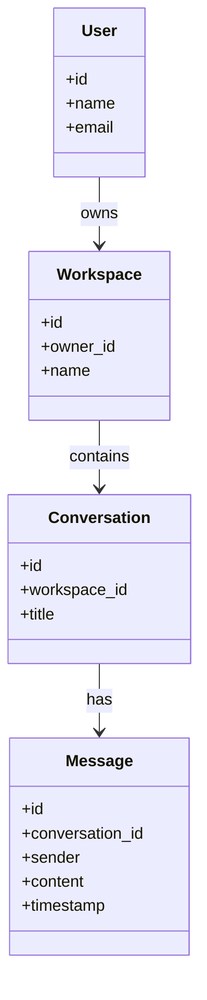

# Cortex Core MVP – Domain and API Data Models Guide

## Overview

This guide covers the implementation of **Domain Models** and **API Schemas** for the Cortex Core MVP. In this step, we define all the key data models using Pydantic, adhering to the project’s **ruthless simplicity** and **separation of concerns**. The goal is to clearly outline the data structures that will be used internally (domain models) and at the API layer (request/response schemas) without adding anything beyond what the MVP needs. We focus on only the essential fields for each model (no extra attributes or premature abstractions) and ensure each model serves a single clear purpose. By the end of this step, we will have a minimal set of Pydantic models that act as the “source of truth” for data shapes in the system, providing type safety and clarity for subsequent development.

**Key goals of this step:**

- Define Pydantic **domain models** for core entities – **User**, **Workspace**, **Conversation**, and **Message** – each with only the essential fields required for now (e.g. unique IDs, names/titles, references, timestamps). These models live in a central `models/` directory and will be reusable across the core application and services.
- Define Pydantic **API request/response schemas** for key endpoints that need input validation or specialized output. This includes models like `LoginRequest` (for authentication input), `WorkspaceCreateRequest` / `ConversationCreateRequest` (for configuration endpoints), and `InputMessage` (for sending a chat message). These schemas are used **only** in the API layer to validate incoming data and shape outgoing responses.
- Include support for **structured LLM outputs** using *pydantic-ai*. Define future-facing models such as `ToolRequest` and `FinalAnswer` that represent the AI assistant’s structured response formats (e.g. a request to use a tool, or a final answer string). These will help parse and validate AI outputs in later steps. We include them now to make the expected LLM output schema explicit, even though they will be used in a later orchestration component.
- **Enforce separation of concerns:** Domain models vs. API schemas are strictly separated. Domain models represent core data and should not depend on the API layer. API schemas are used at the HTTP boundary and should not leak into internal business logic. This keeps each layer modular and interchangeable. In practice, this means internal code will use domain models, and FastAPI endpoints will convert/compose to domain models from incoming API schemas (and vice versa for outgoing data).
- Keep everything **minimal and focused on MVP needs**. We do not add any fields or models that aren’t needed for the basic functionality. Every model, field, and class should have a clear, immediate purpose in the current use-cases (sending a message, creating a workspace, etc.). We avoid any “future-proof” fields or overly general abstractions. The guiding question is *“Do we need this now?”* – if not, leave it out. This ensures the code stays lean and easy to understand.

By defining these models now, we create a solid foundation of data contracts. This will make implementing the API endpoints and core logic easier, as all parts of the system will reference the same consistent data shapes. The models will also help with automatic JSON validation (via FastAPI integration with Pydantic) and provide clear documentation for what data is expected or returned by each component.

## Domain Models (Pydantic)

Domain models are Pydantic `BaseModel` classes that encapsulate the core entities in our system. They are used internally by the core orchestrator and related services (like memory storage) to represent data in a structured way. These models are **pure data containers** – they typically include attributes and simple default behaviors (via Pydantic), but no business logic methods. By keeping them simple, we ensure they can be easily shared across different parts of the system (or even different services) without pulling in unwanted dependencies. All fields that are required for correct operation are made non-optional (no `None` defaults unless truly optional) to avoid unnecessary null-checks later on.

We will create the following domain models in the `models/` directory (for example, in a file like `models/domain_models.py`):

### User

Represents a user of the system (the person interacting with the AI). In our MVP context, user data is mainly provided by the Auth0 JWT token, but we define a model to carry the basic user info through the system.

Essential fields for `User` model:

- **id** (`str`): Unique identifier for the user. This could be an Auth0 user ID or a UUID/string that uniquely identifies the user in our system.
- **name** (`str`): The user's display name or username. (For MVP, this might come from the token or be left as a placeholder if not used heavily.)
- **email** (`str`): The user’s email address. This helps identify the user and could be used for login or profile display. It’s included as a primary contact/identifier field and is expected from Auth0 token claims.

All fields are required and non-nullable. We are **not** adding additional profile info (no address, avatar, etc.) since it's not needed for the core chat functionality. The `User` model is primarily used to attach user identity to other objects (like Workspaces or messages) and to return basic info in auth-related responses.

### Workspace

Represents a workspace or context container owned by a user. A workspace could be thought of as an environment or project under which conversations happen. For example, a user might have separate workspaces for different projects or topics. For the MVP, a workspace is simply a grouping mechanism and has an owner (the user who created it).

Essential fields for `Workspace` model:

- **id** (`str`): Unique identifier for the workspace.
- **owner_id** (`str`): The user ID of the owner/creator of the workspace. This associates the workspace with a `User`. It should match a `User.id` value. (We store just the ID here to keep the model simple and avoid nested objects; the actual `User` object can be retrieved or referenced by this ID when needed.)
- **name** (`str`): A human-friendly name for the workspace. This could be a title or label to identify the workspace (e.g., "Project Alpha" or "Personal Workspace"). It’s required for creation and kept minimal (just a string).

All fields are required. We assume a workspace is always created by a valid user (so `owner_id` will always point to an existing user). We are not including any description or settings in the workspace model for MVP – just a name and an owner link.

### Conversation

Represents a conversation (chat thread) within a workspace. A conversation contains a sequence of messages back-and-forth between the user and the AI assistant. In the MVP, conversations help scope the AI’s context (e.g., each conversation could have its own history of messages and possibly its own AI memory).

Essential fields for `Conversation` model:

- **id** (`str`): Unique identifier for the conversation.
- **workspace_id** (`str`): Reference to the `Workspace` this conversation belongs to. This should match a `Workspace.id`. It ties the conversation to its context and implicitly to the user via the workspace’s owner.
- **title** (`str`, optional): An optional title or topic name for the conversation. This can be a short description like "Q&A about pricing model" to help the user identify the conversation. This field is not strictly required for the conversation to function – if not provided, the conversation can be left untitled or a default can be used. (By default, we might set it to `None` or an empty string.)

All other possible fields (like conversation settings, participant list, etc.) are omitted for simplicity. We consider a conversation as a simple container of messages. The **title** is the only optional field; if provided it’s stored, if not, it's just `None` and the conversation might be displayed without a title. We do not include a direct reference to the user here because the user can be inferred through the workspace (enforcing the separation: user → workspace → conversation).

### Message

Represents a single message in a conversation. This can be either a user message or an AI assistant message. In the MVP flow, when a user sends a message, it will be stored as a `Message` object (with sender = user), and when the AI responds, that will be another `Message` (with sender = assistant). Messages are primarily stored/retrieved via the Memory Service, but the core will use this model to represent them.

Essential fields for `Message` model:

- **id** (`str`): Unique identifier for the message.
- **conversation_id** (`str`): Reference to the `Conversation` this message belongs to (matches a `Conversation.id`). This connects the message to a conversation thread.
- **sender** (`str`): Who sent the message. For MVP, we define two allowed sender types: `"user"` or `"assistant"`. A user’s messages will have sender `"user"` (and implicitly tie to the user who owns the conversation), while the AI’s replies will use `"assistant"`. This could also be modeled as an enum or boolean flag, but a simple string is sufficient here. (We assume only these two roles in a conversation for now, no other participants).
- **content** (`str`): The text content of the message. This is the actual message text the user sent or the assistant’s reply content. It’s required and expected to be non-empty.
- **timestamp** (`datetime`): The time when the message was created/sent. This helps order messages and can be used for record-keeping. We will capture this at message creation time. (It can be a Python `datetime` object; when sending via API, it will likely be serialized to an ISO string. For MVP, we won’t worry about time zones beyond storing ISO UTC or similar.)

All fields above are required (except we won’t require `title` on conversation or anything like that for messages). The `timestamp` will be set when a message is created; we might set `default_factory=datetime.utcnow` in Pydantic if we want to auto-populate it, or we can set it explicitly in code. The `sender` field is kept as a simple string for now (no complex user reference for the assistant). We do not include any read/unread status, attachments, or other metadata in the Message model – keeping it to the bare minimum needed to relay conversation text.

#### Domain Models Code Example

Below is a code example of how these domain models might be defined using Pydantic. They all inherit from `BaseModel` and use basic Python type hints for fields. Each model is kept in the `models` directory, likely grouped together (they can all reside in one file or be split into a couple of small files if desired, e.g., one for user/workspace and one for convo/message). The key is that they are defined once and used throughout the core code for consistency:

```python
from pydantic import BaseModel
from typing import Optional
from datetime import datetime

class User(BaseModel):
    id: str
    name: str
    email: str

class Workspace(BaseModel):
    id: str
    owner_id: str  # references User.id
    name: str

class Conversation(BaseModel):
    id: str
    workspace_id: str  # references Workspace.id
    title: Optional[str] = None

class Message(BaseModel):
    id: str
    conversation_id: str  # references Conversation.id
    sender: str           # "user" or "assistant"
    content: str
    timestamp: datetime
```

*(In an actual implementation, you might also configure `orm_mode = True` in the Pydantic model Config if these are to be used with an ORM, but since our MVP likely uses in-memory or simple storage via services, we omit ORM specifics. The field types are straightforward; `id` fields are strings here for generality, but could be UUID types or ints depending on how IDs are generated. We stick to `str` to avoid over-complicating ID generation for now.)*

## Domain Model Relationships

To understand how the domain entities relate to each other, the following diagram shows the relationships between **User**, **Workspace**, **Conversation**, and **Message**:



*Diagram: Domain model relationships in Cortex Core.* **Users** own one or more **Workspaces** (a workspace’s `owner_id` points to a User). Each **Workspace** can contain multiple **Conversations** (indicated by `workspace_id` in Conversation). Each **Conversation** has a sequence of **Messages** (`conversation_id` on Message links back to the conversation). The arrow labels indicate the direction of association: e.g., a User "owns" Workspaces; a Workspace "contains" Conversations; a Conversation "has" Messages. This structure keeps data organized: by knowing a User, we find their Workspaces, then the Conversations in a workspace, then the Messages in a conversation. It also ensures separation: for example, a Message doesn’t directly reference a User, only the conversation, making the chain of ownership clear and allowing each model to remain focused on its own data.

## API Schemas (Request/Response Models)

While the domain models define the core data structures, the **API layer** will use separate Pydantic models (schemas) for incoming request bodies and outgoing responses. These schemas ensure that the data provided by clients is valid and properly typed, and they shape the data returned to clients. By isolating API-specific models, we maintain flexibility to change internal representations without affecting external contracts (and vice versa). However, for the MVP, the API schemas will closely mirror the domain models in most cases, since we are not adding any extra processing or transformation. The main difference is contextual: API models are only used within the FastAPI route handlers (for parsing input or formatting output), and the core logic will deal with domain models.

We will create these Pydantic schema classes also in the `models/` directory (for example, in a file like `models/api_schemas.py`). They can import and reuse the domain models if appropriate, or define fields explicitly. **Important:** API schemas should be considered part of the **API layer only** – they might reuse domain model fields or even embed domain models, but other parts of the system (services, event handlers, etc.) should not be dealing with API-specific classes.

Key API schemas for the MVP include:

### Authentication Schemas

- **LoginRequest** – The body for a login/authentication request (if we implement a dev login endpoint). This would include the user’s credentials. For example:
  - `email` (`str`): The user’s email (used as login identifier).
  - `password` (`str`): The user’s password.

  In the context of Auth0, we might not use this in production (since Auth0 handles the login UI/flow), but for a testing stub or local development, a simple login endpoint can use this schema to accept credentials and issue a token.

- **LoginResponse** – The response returned upon a successful login. For simplicity, we can return a JSON with the issued JWT token and some basic user info. Fields might include:
  - `token` (`str`): The JWT token that the client should use for authenticated requests (e.g., `Authorization: Bearer ...`).
  - `id` (`str`): The user’s ID (for reference).
  - `name` (`str`): The user’s name.
  - `email` (`str`): The user’s email.

  (We include the user fields so the client knows who is logged in, without having to decode the token on their own. Essentially this duplicates what the `User` domain model holds, but it’s delivered via the login response for convenience. We could also nest a `user` object in the response, but flattening it keeps it simple and avoids an extra level of JSON.)

- **AuthUser (User Info)** – For endpoints that need to return the current user’s profile (like a `GET /auth/verify` endpoint that just confirms the token and returns user info), we can reuse the same fields as the `User` model. We might not need a separate class at all here; instead, we can directly return a `User` domain model instance as the response (FastAPI will serialize it). If we want to keep the API schema strictly separate, we could define an `AuthUser` schema identical to `User` (id, name, email). In practice, duplicating it isn’t necessary right now because it’s the same data – so reusing `User` for response is acceptable for MVP. The key is not to confuse the layers: the `User` Pydantic model is part of domain, but since it’s a Pydantic model, it can serve as a response schema too.

*(For MVP simplicity, we will likely rely on Auth0’s JWT validation for auth and might not even need a login endpoint (since login is handled by Auth0’s UI). The `POST /auth/login` is optional and might be used only for development convenience. If we skip implementing it, the above schemas are defined but might not be heavily used. They’re documented here for completeness and possible use in testing scenarios.)*

### Workspace and Conversation Schemas (Configuration)

These schemas correspond to the “config” endpoints that allow clients to create and list workspaces or conversations. They ensure the input has what we need and provide output in a structured way. For MVP, these endpoints back a simple in-memory implementation (not a full database).

- **WorkspaceCreateRequest** – The body to create a new workspace. Likely contains:
  - `name` (`str`): The desired name of the workspace.

  The user doesn’t supply an `id` or `owner_id` here – the system will assign a new ID and tie it to the current user (from the auth token). We keep this request minimal: just a name.

- **ConversationCreateRequest** – The body to create a new conversation. Possible fields:
  - `workspace_id` (`str`): The ID of the workspace in which to create the conversation. (If the system has a notion of a “default” workspace and this is omitted, we might assume the conversation goes into a default workspace for that user. But to keep it explicit, we’ll require a workspace_id in the request for now, since the client should know where they want the conversation.)
  - `title` (`Optional[str]`): An optional title for the conversation. The client may provide a title immediately. If not provided, we can create the conversation with `title=None` or a placeholder. This field is optional in the schema with a default of `None`.

  The response to creating a conversation will be the newly created Conversation’s data (id and any fields). We do not need a separate `ConversationCreateResponse` class if it’s identical to the `Conversation` domain model; we can just return a `Conversation` Pydantic model. Similarly, listing conversations (GET /config/conversations) can return a list of `Conversation` models for that workspace.

- **WorkspaceListResponse / ConversationListResponse** – We likely won’t explicitly define these as classes. For listing, FastAPI can return e.g. `List[Workspace]` or `List[Conversation]` using the domain models, and it will generate the JSON accordingly. If needed, we could wrap it in a response schema (e.g., `{ workspaces: [...] }`), but that’s unnecessary complexity for MVP. We can respond directly with a JSON array of workspaces or conversations using the domain model schemas.

- **WorkspaceCreateResponse** – Not explicitly needed as a separate schema; the API endpoint can return the `Workspace` domain model of the newly created workspace. The fields in that response would be `id`, `owner_id`, `name`. (If we wanted to hide `owner_id` from the client, we might use a different schema without it, but given that the client is the owner themselves, it’s not a sensitive field. It could be useful for the client to have the owner_id to confirm the association or if they share data in future. So returning the domain model directly is fine.)

Overall, for **config endpoints** the approach is: simple request models for creation (to validate input), and direct use of domain models for output (to avoid duplication). All logic of assigning the current user as owner, generating IDs, etc., will happen in the endpoint or a service function – outside these models.

### Chat Message Schema

- **InputMessage** – This is the schema for the chat input endpoint (`POST /input`), which is a critical part of the core workflow. It represents a user’s message being sent into the system. Fields:
  - `content` (`str`): The text of the user's message to the AI.
  - `conversation_id` (`Optional[str]`): The ID of the conversation this message belongs to. This tells the core which conversation context to use. In a multi-conversation system, the client should provide this. If not provided, the API may default to a "primary" or only conversation for that user (to support a simpler single-conversation scenario). In the schema we’ll make this optional to allow flexibility: if it’s missing, the endpoint will have logic to handle it (either reject or assume default). For MVP, we likely will assume a default conversation if not given (as noted in the design).

  These two fields are all we need for the input. We deliberately do **not** include things like userId (we get user identity from the auth token, not from the request body) or timestamp (the server will set the timestamp). The simplicity here means the client just provides message text (and context identifier), and everything else is implicit. The `InputMessage` Pydantic model will automatically validate that `content` is a string and `conversation_id` if provided is a string.

- **Output Messages** – The actual AI responses are streamed via SSE, not returned in the HTTP response to the input. So we don’t have a typical response model for `POST /input` that contains the assistant’s answer. Instead, `POST /input` will return an acknowledgment (likely a status message or just HTTP 202). We might define a small acknowledgment schema if we want a JSON body like `{"status": "received"}`. For now, a simple approach is to return a 200/202 with a basic message. If we want to formalize it, we could use a schema:
  - `MessageAck` with field `status: str` or `message_id: str` (if we want to return the new message’s ID).

  However, this might be overkill; a plain JSON or even empty response could suffice. If including, it would be minimal (and can be defined inline in the endpoint rather than a global schema).

In summary, the API schemas cover all places where the API interacts with external input/output:
- Auth: credentials in, token+profile out.
- Config: workspace/conversation names in, objects out.
- Chat: message content in, acknowledgment out (and streaming out-of-band responses).

All validation beyond basic type checking is handled by these schemas (e.g., Pydantic will ensure `content` is provided and is a string, etc., and automatically generate error responses if the input is invalid). We intentionally avoid writing custom validation logic so as not to reinvent what Pydantic gives us for free.

#### API Schemas Code Example

Below is an example of how the API models might be defined. We assume these will be placed in a separate module (like `models/api_schemas.py`). Note that we can import our domain models for reuse when appropriate. For instance, we might use the `User` model for an authenticated user response, or embed domain models in response schemas to avoid duplication. The code is illustrative:

```python
from pydantic import BaseModel
from typing import Optional, List
# Import domain models to reuse in responses if needed
from models.domain_models import User, Conversation, Workspace

# Authentication request & response
class LoginRequest(BaseModel):
    email: str
    password: str

class LoginResponse(BaseModel):
    token: str
    # Include user info in the response. We can either embed the User model or just repeat fields.
    user: User   # embedding the domain User model for convenience
    # Alternatively, we could do:
    # id: str
    # name: str
    # email: str

# An example protected endpoint response schema for verifying auth (could reuse User directly)
# For simplicity, we might not need a new class; using User or a subset is fine.

# Workspace and Conversation creation
class WorkspaceCreateRequest(BaseModel):
    name: str

# We will return a Workspace (domain model) on creation, so no separate response schema here.

class ConversationCreateRequest(BaseModel):
    workspace_id: str
    title: Optional[str] = None

# Similarly, return a Conversation domain model on success.

# Chat message input
class InputMessage(BaseModel):
    content: str
    conversation_id: Optional[str] = None
```

A few notes on the above code:

- `LoginResponse.user: User` demonstrates reuse of the domain `User` model. This means when we return a `LoginResponse`, it will contain a nested user object with `id`, `name`, `email`. Pydantic will automatically translate the `User` model to a dict. This is a convenient way to avoid defining an `AuthUser` schema identical to `User`. It does, however, couple the response to the domain model structure. In MVP, this is acceptable and keeps things simple. If we wanted to decouple it, we’d define the fields manually or use a separate `UserOut` schema.
- `WorkspaceCreateRequest` and `ConversationCreateRequest` only include the necessary inputs. Notice we don’t take `id` or `owner_id` for workspace – those are derived internally. For conversation, we require a `workspace_id` (so the API knows where to put the conversation) rather than inferring it implicitly, which keeps the client’s intent explicit.
- `InputMessage` has an optional `conversation_id`. If this is `None` and our system supports a default conversation, the endpoint will substitute the appropriate ID (likely the ID of a "default" conversation or it might create a new conversation implicitly if one doesn’t exist – but such logic would be defined in the endpoint or service, not in the model).

Because these are Pydantic models, FastAPI will automatically generate documentation (OpenAPI schema) for them. All fields are simple types, and we’re not doing anything like regex validation or custom validators – staying aligned with **“use Pydantic directly”**. This makes our interfaces very transparent and minimal.

## Structured LLM Output Models (Future Integration)

In later stages of the Cortex Core (specifically in the conversation orchestration and response handling), we plan to incorporate **structured outputs from the LLM**. This means we want the AI assistant to sometimes return a response in a JSON/schema format (instead of just raw text) so that the core can interpret actions or requests. To prepare for that, we define a couple of Pydantic models that represent the two main structured outcomes from the AI:
1. A request for using a tool (e.g., asking the Memory service for data, or calling another function).
2. A final answer to be sent back to the user.

By defining these now, we make the expected format explicit and can even use these models in prompts or output parsing logic. We might use **pydantic-ai** (a utility that integrates Pydantic with LLM output parsing) to directly validate LLM outputs against these models. Essentially, we will prompt the LLM to respond in a way that can be parsed into one of these models (JSON with specific fields). If the output parses into a `ToolRequest`, the orchestrator knows the AI wants to use a tool; if it parses into a `FinalAnswer`, the orchestrator knows the AI is giving the final answer to the user.

The two models we will use are:

- **ToolRequest** – represents an AI request to invoke an external tool or service. Fields:
  - `tool` (`str`): The name or identifier of the tool the AI wants to use. For example, it could be `"memory_search"` or `"calculator"`, depending on what tools we support. The value here will tell the orchestrator which service or function to call.
  - `args` (`dict`): The arguments for that tool. This would be a JSON object containing whatever parameters the tool requires. For a memory search tool, for instance, `args` might have a query string or an ID. We keep it as a generic dictionary since different tools will have different expected arguments. (In the future, we could make this more type-safe by having sub-models per tool, but for MVP a freeform dict is sufficient and flexible.)

- **FinalAnswer** – represents the AI’s final answer to be delivered to the user (with no further action needed). Field:
  - `answer` (`str`): The answer or response text that should be sent to the user. This is typically a cleaned, user-friendly message that the assistant has decided to provide as the conclusion of its reasoning.

We keep these models extremely simple. Just one or two fields each. They cover the two primary outcomes of the AI reasoning loop: do something (use a tool) or say something (give answer). We are *not* adding other fields like `thoughts` or `confidence` or multi-step action chains – those can be added later if needed. MVP assumes a single step: the AI either answers directly or asks for a single tool action at a time.

These models will likely be used internally by the orchestrator. For example, after getting a raw response from the LLM, we can attempt to parse it as `ToolRequest` or `FinalAnswer`. If parsing succeeds in one of them, we know which branch to take. If not, the format is unexpected (which shouldn’t happen if the prompting is correct). The pydantic-ai library can facilitate this by letting the LLM output directly conform to these models (through a combination of prompt instructions and post-processing).

We place these structured output models in our `models/` directory as well (perhaps in a file like `models/llm_outputs.py` or alongside domain models if we consider them part of the core domain of the AI conversation). They are not exposed via the API; they are purely for internal use between the LLM and the core logic. They are defined here in the data models step to ensure the format is agreed upon system-wide.

#### LLM Output Models Code Example

```python
from pydantic import BaseModel
from typing import Dict, Any

class ToolRequest(BaseModel):
    tool: str
    args: Dict[str, Any]

class FinalAnswer(BaseModel):
    answer: str
```

This snippet shows the definitions:
- `ToolRequest` expects a string `tool` name and an `args` dictionary (with string keys and values of any JSON-serializable type). We use a broad type `Dict[str, Any]` to allow flexibility in what arguments a tool can receive. In usage, we might further validate contents of `args` after parsing, depending on the tool.
- `FinalAnswer` has just an `answer` field for the response text.

Both are Pydantic models, so if we get a JSON string from the LLM, we can do something like `ToolRequest.parse_raw(json_str)` to validate it. In integration with pydantic-ai, we might even instruct the LLM to output in a JSON block that corresponds to one of these models.

Again, **simplicity is key**: we define exactly what we need and no more. If later we find the AI needs to provide additional info (say a `source` for an answer, or multiple tool requests in sequence), we can extend or adjust the models then. For now, these two cover the basic interactive AI behavior for the MVP.

## Separation of Concerns and Usage

With all models defined, it’s important to reiterate how they should be used in the system to maintain clean architecture:

- The **domain models** (`User`, `Workspace`, `Conversation`, `Message`, and the LLM output models) are meant to be used throughout the core logic and any internal services. For example, when the Memory Service client returns conversation data, it could deserialize it into `Message` or `Conversation` objects. The core orchestrator will likely deal with `Message` objects as it processes input and prepares output. These models should also be used in events (e.g., an event on the Event Bus carrying a `Message` or carrying a structured `ToolRequest` for processing). Domain models should *not* be tied to how the data is delivered via HTTP or stored in a database – they are pure representations of the concepts.
- The **API schemas** (`LoginRequest`, `LoginResponse`, `WorkspaceCreateRequest`, `ConversationCreateRequest`, `InputMessage`, etc.) are used only in the FastAPI route functions. When a request comes in, FastAPI will create an instance of the appropriate Pydantic model (e.g., `InputMessage`) from the JSON body. The handler can then extract the data and, for example, construct a `Message` domain object or call a service with basic Python types. Likewise, when sending a response, the handler can return a Pydantic object (domain or API schema) which FastAPI will serialize to JSON. Outside of these moments, we don’t use the API schemas. For instance, the orchestrator or event bus shouldn’t be passing around an `InputMessage` object; it would use a `Message` domain model or a dict with needed fields. This prevents any HTTP-specific or validation-specific constructs from creeping into the core logic.

We have avoided any kind of elaborate inheritance or abstraction in the models. Each model is defined explicitly. There’s no base class like `BaseDomainModel` or mixins for timestamps – because we don’t need them right now. If in the future many models share common fields, we might refactor then, but at this stage adding such abstraction would be premature. The philosophy is that **a little duplication is fine if it means keeping things straightforward**. For example, both Workspace and Conversation have an `id` field, but we won’t introduce a parent class for “identifiable” objects just for that; it would add complexity without significant benefit for MVP.

Finally, because these models are all Pydantic, they naturally integrate with FastAPI and other systems. They enforce type correctness (e.g., if someone accidentally passes an int for a name, Pydantic will raise an error), and they provide a clear source of documentation (via model class definitions) for what data our system expects. This clarity will help both human developers and AI assistants working on the project to quickly grasp the data flow.

## Conclusion

At this point, the **Cortex Core MVP** has a well-defined set of data models that act as the schema for all important data structures: users, workspaces, conversations, messages, API inputs/outputs, and even the AI’s structured outputs. We made sure every model is as simple as possible, containing only the fields absolutely needed. We also maintained a strict layering: the internal domain models vs. the external API contracts are separated to allow each to evolve independently. This setup ensures that as we proceed to implement the API endpoints and core logic, we can rely on these models for validation and consistency, reducing the chance of errors and making the code more readable.

Moving forward, the next steps (such as implementing authentication, the event bus, and the message processing logic) will utilize these models. For example, the authentication layer will produce a `User` from a token, the `/input` endpoint will accept an `InputMessage` and turn it into a `Message` event, the orchestrator will output a `FinalAnswer` or `ToolRequest` model which then gets turned into either an API response or triggers a tool invocation. Because we’ve kept everything minimal and clearly defined, each of those steps can be implemented in isolation but still fit together seamlessly – exactly what we want in a well-architected MVP.

