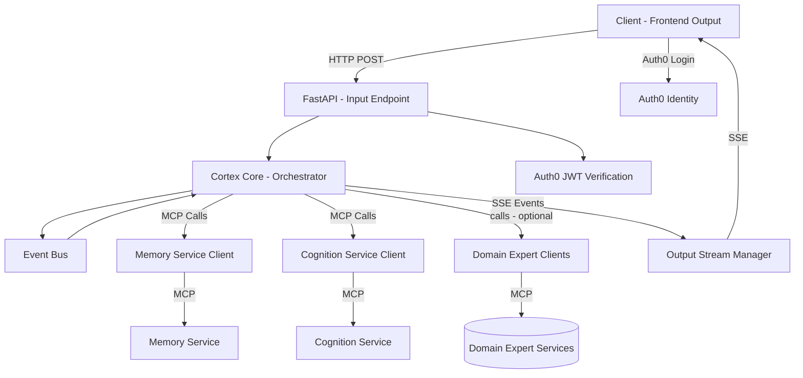
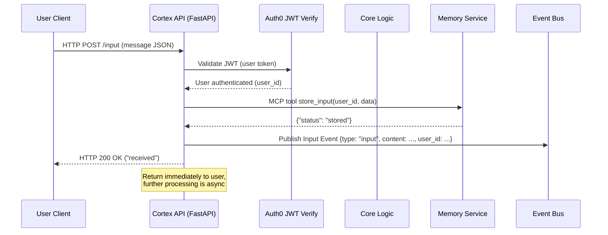
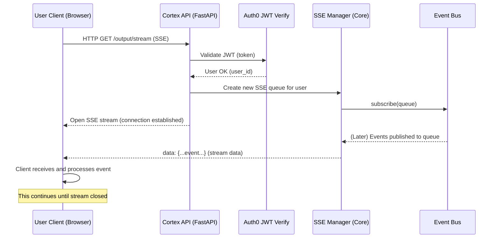
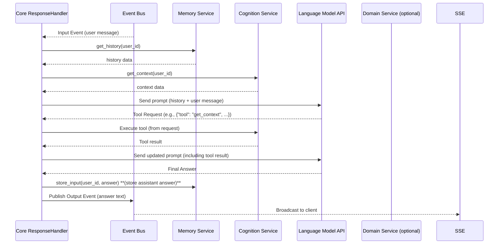

# Cortex Core MVP – Architecture & Design

## Overview and Guiding Philosophy

The Cortex Core MVP is designed with a **ruthless focus on simplicity and clarity**. Every component and decision follows the Cortex Platform’s Zen-like implementation philosophy: build only what is needed **now**, in the simplest way that could possibly work. We avoid premature abstractions, embrace straightforward designs, and trust that a simple, working system can evolve as needed. The codebase is in **pre-production**, so we prioritize clean design over backward compatibility – no legacy burden or future-proofing beyond current requirements.

Key philosophical principles guiding this design:

- **Keep it Simple (KISS)** – Each component does one job with minimal code and zero fluff. If a feature isn’t necessary for the MVP’s core use cases, it’s left out.
- **Present-Moment Execution** – Solve today’s problems without guessing tomorrow’s. We implement only what current use cases demand, enabling rapid change as real needs emerge.
- **Clarity Over Cleverness** – Readability and obviousness in code and architecture trump sophisticated patterns. If a solution can be explained in plain terms, that’s the approach we choose.
- **Trust but Verify** – We lean on well-known libraries and services (FastAPI, FastMCP, Auth0, etc.) directly, rather than wrapping them in heavy indirection. We trust these tools to do their job but include basic error handling and logging to catch issues in practice.
- **Isolation of Concerns** – Each module (API, event handling, backend service client, etc.) is siloed with clear interfaces. No global shared state or hidden couplings: components interact only through defined contracts (function calls, event messages, or external protocols).

Following these principles ensures a single mid-level engineer or AI agent can implement the system end-to-end without getting bogged down in complexity. **No component is over-engineered** – we’d rather have a simple solution that we understand fully than a general one that handles hypothetical edge cases. Remember: _code not written has no bugs_, and it’s always easier to add complexity later if needed than to remove it early on.

## Developer Mindset and Approach

To successfully build this MVP, the engineer (human or AI) should adopt a mindset of **pragmatic execution**. We recommend the following approach:

- **Vertical Slice Implementation**: Tackle one full end-to-end scenario at a time. For example, implement a basic input-to-output message flow completely (client input → core → simple response) before adding multiple conversation support or complex tools. This ensures we always have a working system that can be demonstrated and tested.
- **Iterate in Small Increments**: Use the 80/20 rule – implement the 20% of functionality that delivers 80% of the value first. It’s better to have one fully working feature than several half-finished ones. After each small increment, test it in a realistic way (send actual requests, simulate a conversation) to validate the approach.
- **Question Necessity Continuously**: For each feature or line of code, ask “Do we need this right now?” If the answer is “not absolutely,” defer it. Avoid “just in case” code. This keeps the codebase lean and focused.
- **Embrace Refactoring**: Since we have no backward compatibility constraints, feel free to refactor early and often as patterns emerge. If the first implementation of a component is naive but works, that’s fine – we can refine it once we see it in action. Do not complicate it upfront for theoretical future use.
- **Direct Integration**: Integrate with third-party SDKs and services directly and simply. Use libraries as intended with minimal wrappers. For example, call the FastMCP SDK methods directly for service communication, use Pydantic models directly for validation, and use Auth0’s standard JWT validation flow. We avoid building custom frameworks around these.
- **Fail Fast and Visibly**: During development, it’s better for the system to throw a clear error (with logs explaining what went wrong) than to silently proceed with bad data. Implement basic error checks and use assertions or exceptions liberally for conditions that “should never happen.” This will surface issues early.
- **Testing as Design Feedback**: Build with testability in mind. Each component should be simple enough to test in isolation (unit tests for models and utilities) and the entire flow should be verifiable with integration tests or manual testing using the API. Aim to test the critical path (a user sending a message and getting a response) as soon as that path is implemented, then expand coverage to edge cases.

Keep these guiding practices in mind while reading the design. The following sections describe the architecture and components in detail, with an eye toward how to implement them in the simplest possible way. When in doubt, refer back to these principles and opt for the solution that is easiest to understand.

## High-Level Architecture

Cortex Core is the central hub that connects **dumb clients** (which just send/receive messages) with the **intelligent backend services** (which handle memory, cognition, and language model responses). The system is structured into loosely coupled components that communicate through well-defined interfaces. At a high level, the architecture consists of:

- **FastAPI Web Service (Cortex Core API)** – Accepts input from clients via HTTP and provides output via Server-Sent Events (SSE). This is the main entry point for user interactions.
- **Event Bus** – An in-memory publish/subscribe mechanism inside the core that decouples incoming messages from outgoing responses. It ensures components like the response processor and SSE broadcaster can react to events without tight coupling.
- **MCP Client Manager** – Cortex Core’s integration point for backend services using the **Model Context Protocol (MCP)**. The core uses an MCP client (via the FastMCP SDK) to call tools on external services like the Memory Service and Cognition Service.
- **Memory Service (MCP Server)** – A backend service responsible for storing conversation data (messages, history) for each user. The core communicates with it via MCP to store new inputs and retrieve conversation history or other memory resources.
- **Cognition Service (MCP Server)** – A backend service that provides contextual processing or analysis (for example, fetching relevant information or performing computations based on the conversation). In the MVP, this service is minimal and can even be stubbed; it’s included to show how additional domain logic can be isolated behind the MCP interface.
- **Domain Expert Services (MCP Servers, optional)** – Placeholders for future specialized services (like code execution, external knowledge bases, etc.). These follow the same pattern as Memory and Cognition services. For MVP, they are not implemented; the architecture reserves the interface for them, and if needed they can be represented with mock responses.
- **LLM Integration (Language Model Adapter)** – The logic within Cortex Core that interacts with a large language model (LLM) to generate responses. This uses an LLM provider’s SDK or API (OpenAI, etc.) possibly wrapped with **pydantic-ai** to validate and structure the model’s output. It is what actually produces the intelligent answer or tool requests based on the conversation.
- **Authentication & Identity (Auth0)** – Cortex Core does not manage users itself but relies on Auth0 for identity. All client requests carry a JWT issued by Auth0. The core verifies this JWT (using Auth0’s public keys) and uses the token’s claims (especially the user’s unique **sub** ID) to scope data and actions. This provides secure, stateless authentication.

Below is a simplified diagram of the Cortex Core MVP architecture and its main components:



_(If viewing this document in a Markdown renderer with Mermaid support, the diagram above illustrates the data flow. Otherwise, refer to the textual description of components.)_

In this architecture, **no two backend services communicate directly** – all integration happens through the Cortex Core using the MCP client. The event bus inside Cortex Core is the linchpin that links incoming inputs to the asynchronous processing and eventually to outgoing events.

The design ensures **statelessness and isolation**:

- The FastAPI layer is stateless; it authenticates each request and passes data inward.
- Each backend service (Memory, Cognition, etc.) is isolated – it doesn’t know about others or about the web API. They only know how to handle MCP tool calls that Cortex Core sends.
- The core orchestrator (Core Logic) contains the minimal coordination logic, but it doesn’t hard-code knowledge of conversation context or advanced analysis – it delegates those to the Memory and Cognition services respectively.
- Data is partitioned by user (using the Auth0 user ID as the key) at every layer. This means all operations include a user identifier to segregate data (important for multi-user support and security).

Next, we break down each component and its responsibilities, interfaces, and design decisions.

## FastAPI Service Interface (API Layer)

The Cortex Core exposes a RESTful API for clients (such as web or mobile frontends) to interact with. We use **FastAPI** for implementing these endpoints in an asynchronous manner. The API layer’s job is to authenticate requests, perform basic validation, and then hand off to the core logic.

**Endpoints and Routes:**

- **`POST /input`** – Accepts a user’s input/message. This is the main ingress for conversation content. The request body is JSON, typically containing at least a `"message"` field (the user’s message text) and any metadata. On success, returns a simple JSON acknowledgment (`{"status": "received", ...}`) immediately. This endpoint requires a valid Auth0 JWT in the `Authorization` header.
- **`GET /output/stream`** – Upgrades to a Server-Sent Events connection. Clients connect here to receive streaming responses (events) from the system. This endpoint also requires a valid JWT. It does not “complete” in the HTTP sense; instead it keeps the connection open and pushes events as they come. Each event is sent as a line of `data: ...` in SSE format containing a JSON payload (described in Output section).
- **`POST /auth/login`** – (For development/testing) Accepts user credentials and returns a JWT. In production this is handled by Auth0’s hosted login, but for our MVP we may provide a dummy login to get a token for testing. This is the only endpoint that does not require an existing token.
- **`GET /auth/verify`** – A protected test endpoint that simply verifies and returns the current user’s info (decoded from the JWT) to ensure authentication is working.
- **`POST /config/workspace`** – Creates a new workspace (a logical grouping of conversations) for the authenticated user. Request body includes workspace details (e.g., name). Response returns the created workspace object.
- **`GET /config/workspace`** – Lists all workspaces for the authenticated user (with optional pagination query params).
- **`POST /config/conversation`** – Creates a new conversation under a specified workspace.
- **`GET /config/conversation`** – Lists conversations in a given workspace.

_Rationale:_ The **Input** and **Output** endpoints form the core messaging interface – input is one-way (client to server) via HTTP POST, and output is one-way (server to client) via SSE. This separation ensures a clear flow and keeps things simple (no bidirectional WebSockets needed). The **Auth** and **Config** endpoints support auxiliary needs: authentication and organizing conversation data.

**Authentication & Authorization:** We integrate Auth0 for identity:

- All protected endpoints use a dependency (e.g., `Depends(get_current_user)`) to automatically verify the JWT. The `get_current_user` function will parse the `Authorization: Bearer <token>` header, verify the token’s signature and claims, and return a user context.
- For development or initial testing, `get_current_user` can use a simplified verification (HS256 with a local secret, or even bypass if we trust the tester). For production, it should use Auth0’s public key (JWKS) to verify RS256 tokens. The token’s `sub` claim is used as the unique user ID, and we expect `iss` (issuer) and `aud` (audience) to match our Auth0 configuration.
- No session state is stored in the server; each request is authenticated anew. This stateless approach aligns with simplicity and scalability.

**Request Validation:** We use **Pydantic** models to define the expected structure of requests and responses whenever applicable. For example, the workspace creation may use a `WorkspaceCreate` Pydantic model to validate fields like `name` (required, non-empty). This provides immediate feedback with clear error messages if a client sends invalid data (FastAPI will auto-generate a 422 response with details, which we can map to a 400 if desired). By leveraging Pydantic (and by extension, **pydantic-ai** for LLM outputs as discussed later), we maintain structured data contracts without writing a lot of manual validation code.

**Output Streaming Implementation:** The `/output/stream` endpoint uses FastAPI’s `StreamingResponse` to push events. Internally, when a client connects:

1. The endpoint verifies the JWT and identifies the user.
2. It creates a new `asyncio.Queue` specific to this connection.
3. It **subscribes** this queue to the central Event Bus (so the queue will receive all events published).
4. It then returns a `StreamingResponse` that iterates over an `event_generator` async generator. The generator pulls events from the queue and yields them in SSE format.
5. Each event is a Python dict published to the bus; we filter inside the generator so that only events relevant to that user are sent. For example, we check `if event.get("user_id") == user_id` before yielding it. This ensures one user’s SSE feed only contains their own messages or system broadcasts meant for them.
6. We also handle client disconnect: if the client closes the connection, the generator will exit (raising `asyncio.CancelledError`), at which point we catch it and **unsubscribe** the queue from the Event Bus to avoid memory leaks.
7. We keep things lightweight – no special heartbeat other than perhaps a periodic no-op yield to keep the connection alive if needed (SSE generally can send comment lines or just wait; we might not need a heartbeat if events are frequent or browser default behavior covers it).

This API layer is intentionally minimal: **no heavy business logic** lives here. It delegates actual work (like processing the content of an input message, or generating an output event) to the core logic and other components. The FastAPI app essentially is a thin wrapper that: authenticates, parses JSON into Pydantic models, and triggers the appropriate internal function or publishes an event.

Error handling in the API is straightforward:

- If authentication fails or a token is missing, FastAPI will return a 401 automatically from `get_current_user`.
- If validation fails (malformed JSON or missing required fields), FastAPI/Pydantic returns a 422 or we can map it to a 400 with a clear message like “Invalid request payload”.
- We catch unhandled exceptions at the endpoint level and log them, returning a 500 response with a generic error message (we don’t expose internals to the client).
- Because the core logic is event-driven and asynchronous, the `/input` endpoint does **not wait** for an LLM response. It only ensures the input was accepted and stored, then returns `200 OK`. Any errors in downstream processing will be delivered via the SSE channel or logged, not as part of the input request/response cycle. This keeps the input API snappy and resilient.

In summary, the API layer provides a clean, stateless interface: clients can only send data in one way and receive data in one way, always with proper auth. It is fully isolated from the rest of the system except for publishing events and calling a few utility functions. This makes it easy to modify or extend (e.g., adding a new endpoint) without side effects.

## Internal Event Bus

**Role:** The Event Bus is an in-process communication mechanism that decouples producers and consumers of events within the core. The main use in our MVP is to connect the **input handling** with the **response generation** and **output streaming** asynchronously. When a user message comes in, an event is published to the bus; separate handlers (like the LLM response handler and any SSE connections) receive that event and act on it.

**Design:** We implement the Event Bus as a simple publish/subscribe utility:

- It maintains a list of subscribers, where each subscriber is an `asyncio.Queue` (or any async queue-like object) that events can be put into.
- It provides methods: `subscribe(queue)`, `unsubscribe(queue)`, and `publish(event)`.
- `subscribe` adds a subscriber’s queue to the list. `unsubscribe` removes it.
- `publish(event)` iterates over all current subscribers and does an `await queue.put(event)` for each. We do this in a straightforward loop. If a queue is full or blocked, we catch exceptions and log them, but generally we assume these queues are always ready to receive (since the consumers are reading at roughly the pace events are produced).
- There is no complex routing logic – **every event goes to every subscriber** by default. It’s up to subscribers to filter events if they only care about certain types or users. This drastically simplifies the bus implementation at the cost of a tiny bit of wasted work (subscribers ignoring events not meant for them, which is fine for MVP scale).
- The bus does not persist events. If no subscriber is listening at the moment, publishing an event effectively just drops it (or no-ops). This is acceptable because in our flow, by the time we publish output events, we expect SSE subscribers to be there, and for input events, the response handler is subscribed from startup. We’re not doing mission-critical guaranteed delivery in MVP – it’s real-time messaging.
- The bus lives as a singleton object in the application (e.g., created at app startup). It can be a simple global instance or attached to the `app.state` in FastAPI for easy access in endpoints and other modules.

**Event Format:** We use a consistent, simple structure for events (as Python dictionaries). For example:

```json
{
  "type": "input", // or "output", "system", etc.
  "user_id": "abc123", // the Auth0 user ID this event is associated with
  "conversation_id": "...", // ID of the conversation context
  "content": "Hello", // content of the message (for input) or response (for output)
  "timestamp": "2025-03-21T23:59:59Z" // ISO timestamp when event was created
}
```

Additional fields can be included as needed (e.g., `tool` or `error` indicators), but we keep the schema flat and readable. We don’t define a rigid schema in code for events beyond using Pydantic for certain parts if convenient – since events are internal, flexibility is okay, but maintaining a consistent shape helps debugging.

**Flow Integration:** Here’s how the event bus fits into the overall message flow:

- When a `POST /input` request comes in, after validating and perhaps storing the message, the API handler creates an event dictionary for the user’s message (type `"input"`, with the content and IDs) and calls `event_bus.publish(input_event)`. This kicks off downstream processing but does not wait for it.
- A **ResponseHandler** (detailed later) is running in the background. On startup, it subscribed to the Event Bus with its own queue. It continuously polls that queue. When it receives the input event, it knows to start processing the LLM response for that input.
- Meanwhile, any SSE **Output connections** have queues subscribed. They will also receive the input event, but likely they will ignore it because the SSE generator filters events by type (the SSE feed might only forward `"output"` type events to the client, unless we choose to send echoes or acknowledgments).
- When the ResponseHandler eventually produces an answer or other events (like intermediate tool results or a final answer), it will publish those as `"output"` events via the bus. Each SSE subscriber will get it, filter by user, and then send it to the respective client.
- If multiple clients are connected (e.g., user has two devices), each has its own queue and will get the event, but since the user_id matches, both could receive the event. That’s acceptable and actually desired for multi-device scenarios.
- If no SSE client is connected at that moment, the output event is effectively dropped after going through the bus (since no queue might be listening). This is fine for now – typically the frontend will connect to SSE quickly after sending input. If needed, we can buffer the last message in memory to deliver to a late-joining client, but MVP does not require that complexity.

**Threading and Concurrency:** Because we’re using `asyncio` and FastAPI’s event loop, the Event Bus operations are async but single-threaded (unless we explicitly create threads, which we do not here). The publish loop awaits each queue put, which ensures that if one slow consumer can clog others a bit. However, given our controlled environment (one response handler and a few SSE connections), this is not an issue. We avoid adding locks or fancy concurrent structures – the default async behavior is sufficient.

**Logging and Error Handling:** The bus will log an error if pushing to a subscriber fails (for example, if a queue is closed or not reading). This helps to debug if, say, an SSE connection drops without unsubscribing properly. Other than logging, the bus does not take any recovery action on errors, keeping it simple. In practice, unsubscribing on disconnect (as we do) prevents most such errors.

In summary, the Event Bus is a trivial but crucial piece: it glues the input to output pipeline in an **asynchronous, decoupled way**. By subscribing components to event streams, we keep them independent – the input endpoint doesn’t need to know what happens next, and the output logic doesn’t need to be directly invoked by the input. This adheres to our philosophy of minimal coupling.

## Model Context Protocol (MCP) Integration

A core requirement of the Cortex platform is to integrate with backend services (like Memory and Cognition) using the **Model Context Protocol (MCP)**. MCP standardizes how services expose _tools_ (actions that can be invoked) and _resources_ (data that can be fetched) in a unified way. We use the **FastMCP SDK** for Python to manage these interactions with minimal custom code.

**MCP Client Manager in Cortex Core:** Within the core, we implement a lightweight **McpClient** component (or one per service) that handles connecting to an MCP server and calling its tools. This component will:

- Establish a connection to the MCP service over an EventSource (SSE) channel. FastMCP’s client utilities can be given the service endpoint (e.g., `http://localhost:9000` for Memory Service) and will handle the details of opening a persistent connection.
- Provide methods to call remote tools. For example, `memory_client.call_tool("store_input", {...})` or `cognition_client.call_tool("get_context", {...})`. Under the hood, FastMCP will send the request over the SSE channel and await the response.
- Optionally provide resource access if needed (FastMCP might allow fetching resources via some similar call or a specific method).
- Manage reconnection or errors in a basic way: if a call fails due to connection issues, we log an error, attempt to reconnect, and optionally retry the call once. We do not implement a complex retry or circuit breaker – just a single reconnect and retry to handle transient issues. If it still fails, we propagate the error up (which would ultimately result in an error event to the user or a logged failure).

The MCP client is essentially a **thin wrapper** around FastMCP’s functionalities. We don’t wrap every detail; we mainly ensure the connection is opened (perhaps on startup or on first use) and then directly use FastMCP’s async calls. This keeps things straightforward and avoids reinventing the wheel.

**Memory Service Tools:** The Memory Service (running as an MCP server) exposes at least:

- **Tool: `store_input(user_id: str, input_data: dict) -> dict`** – Stores a given user message or data in the memory store. Returns a status (for example, `{"status": "stored", "id": "<message-id>"}` or similar). The core will call this whenever a new user message comes in. The `input_data` could contain the message text and any metadata (timestamp, etc.), and the service will attach an ID and store it.
- **Resource: `history/{user_id}`** – A resource endpoint to retrieve the conversation history (list of past messages) for a user. In FastMCP, resources can often be accessed via a URL-like pattern. The core might use a method like `memory_client.get_resource("history/USER123")` to get that data. The Memory Service returns a structure like `{"history": [ ... messages ... ], "user_id": USER123}`.

**Cognition Service Tools:** The Cognition Service for MVP might have:

- **Tool: `get_context(user_id: str, query: Optional[str], limit: Optional[int]) -> dict`** – Returns some contextual information or analysis for the user’s conversation. In MVP, we implement this by simply calling the Memory Service to get recent history (as a proxy for context) and returning it. Essentially, it might call an internal HTTP client to Memory’s resource. The result might be `{"context": [ ...messages... ], "user_id": USER123, "count": N}`. This demonstrates the pattern of one service using another in a trivial way, but importantly, the Cortex Core itself doesn’t do that context logic – it just calls `cognition_client.call_tool("get_context", {"user_id": ..., "limit": 10})` and trusts the service.

Both Memory and Cognition services are designed to be **replaceable** or extensible. They run as separate processes (in production) or could even be started as async tasks in the same process for development (to avoid network overhead). For MVP, we can run them in-process to reduce moving parts: for example, import the memory service code into the core and start it on a separate event loop thread or just call its functions directly via a stub. However, to stick to the intended architecture, it’s better to treat them as if they were external – using the MCP client even if it connects locally – so that when we later separate them, the core code doesn’t change.

**Domain Expert Services:** The design allows additional MCP services to be plugged in similarly. For instance, if we had a “CalculationService” or a “KnowledgeBaseService”, we would:

- Assign it a service name and URL.
- Implement some tools/resources on that service.
- Instantiate another `McpClient` in Cortex Core to connect to it.
- When the LLM decides to use that service (perhaps via a tool invocation), the core will route the request through the appropriate client.

For the MVP, we **mock or stub these**: We might not actually implement any domain expert service, but we plan for them. If the LLM tries to call a tool that isn’t implemented, the ResponseHandler can handle that gracefully (e.g., log “Tool not available” and send an error message event back to the user stating that capability is not available). This way, the absence of those services doesn’t break the system, it just results in a controlled error path.

**Security Note:** Because all service calls go through MCP and are initiated by Cortex Core (which is a trusted backend environment), we don’t need to expose the Memory/Cognition services to the public. They can be bound to localhost or a private network. Also, each call includes the `user_id` so the service can enforce partitioning (though in MVP, services trust the core to pass correct user IDs). In a more secure setup, services might validate a service token or ensure requests come from core, but for simplicity we assume a closed environment.

**Error Handling in MCP Integration:** If a call to a service fails (e.g., service down or times out):

- The `McpClient.call_tool` will raise an exception. We catch it in the ResponseHandler logic. For a transient failure, we may attempt one reconnection within `call_tool` itself (the MCP client can check `if not connected: connect()` or even reconnect on error).
- If after a retry it still fails, we propagate an error event. The user will get a response like “System error, please try again later” or similar via SSE. Meanwhile, we log the exception with details (service name, tool name, error message).
- We do not hang the conversation; we treat it as a failure of that query only. The user can send another message; maybe the next one will work if the service comes back.
- Because simplicity is key, we won’t implement a queue or background retry logic for failed tool calls in MVP. The onus is on the user or higher-level logic to reissue the request if needed.

In summary, MCP integration in Cortex Core is achieved with minimal code: basically configuring the FastMCP clients and invoking remote procedures as needed. This design choice (using MCP for inter-service comms) preserves the **architectural integrity** (all services speak one protocol) but we implement it in the most straightforward way possible here, relying on the provided SDK to handle heavy lifting.

## Memory Service (Backend)

_(Note: The Memory and Cognition services are described here for completeness of design, though they are separate components. A single engineer can implement these as well, either as part of the same repository or separate ones. They should be simple enough to run alongside the core during development.)_

**Purpose:** The Memory Service persistently stores all conversation data for users. It is essentially the “database” for chat history, abstracted behind an MCP interface. By isolating this in a service, the core doesn’t need direct database code or knowledge of how data is stored. This aligns with the goal of component isolation and also allows memory to scale or be replaced independently.

**Data Model:** Each message typically has fields like an ID, conversation ID, sender (user or assistant), content, timestamp, and perhaps a metadata blob. The Memory Service can choose how to store these. For MVP, we can use an in-memory Python dictionary keyed by user (and conversation) to accumulate messages. This is volatile (if service restarts, data is lost), but acceptable for initial development and testing. Optionally, by Phase 2 of development, we might introduce a simple SQLite or file-based persistence in the Memory Service to keep data between runs.

**Interfaces Exposed (via MCP tools/resources):**

- `store_input(user_id: str, input_data: dict) -> dict`: Stores a new message or input for the user. In MVP, `input_data` will contain at least `content` (the message text). The service implementation will:
  - If this user (or user’s conversation) doesn’t exist in storage yet, initialize a list.
  - Ensure the `input_data` has an `id` (generate a UUID if not provided) and a `timestamp` (generate now if not provided).
  - Append the message to the user’s message list (or to the appropriate conversation list, if we structure it that way).
  - Possibly enforce a max history length (not needed now, but could be considered).
  - Return a simple confirmation, e.g., `{"status": "stored", "message_id": "...", "timestamp": "..."} `. The core might not use this return for anything critical except logging.
- `get_history(user_id: str, conversation_id: Optional[str] = None) -> dict`: Retrieves stored messages. If conversation IDs are used, it filters to that conversation. Otherwise, it returns the user’s entire message history (which could be segmented by conversation on the client side). For MVP, we can assume one default conversation per user to simplify.
  - The service will look up the list of messages for that user (and conversation if given).
  - Return something like `{"history": [ {...msg1}, {...msg2}, ... ]}`. We might include the user_id or conversation_id in the response for completeness.
- (Potentially a `clear_history` or other admin tool could exist, but not needed for MVP.)

**Implementation:** We will implement Memory Service using the FastMCP library in Python:

- Initialize a FastMCP server instance (e.g., `mcp = FastMCP("MemoryService")`).
- Decorate Python functions with `@mcp.tool()` or `@mcp.resource()` to expose them. As shown in our earlier code snippet, a few functions can cover storing and retrieving.
- Use a simple Python data structure (e.g., `memory_store: Dict[str, List[dict]]` in memory) for storage. This means the data is not shared beyond this process, which is fine.
- Run the service. If running as a separate process, this might be started on port 9000 (for example) and listen for MCP client connections.

**Siloing and Trust:** The Memory Service does not authenticate calls in MVP – we assume calls come from Cortex Core which is already authenticating the user. The `user_id` passed in is taken as truth. This is acceptable in a contained environment. Later, we could secure this channel by requiring the core to present a service token or by validating that the `user_id` matches a known format, but we keep it simple now.

**Error Handling:** The Memory service functions should handle errors gracefully:

- If a `store_input` call is made with invalid data (missing content), we could return an error dict or raise an exception. For MVP, since core controls the input, we ensure to always send proper data, so this shouldn’t happen.
- If `get_history` is called for a user ID that doesn’t exist yet, we simply return an empty history (`{"history": [], "user_id": X}`) rather than an error.
- Any unexpected exception inside the service would propagate through MCP back to core as an error. We’ll see that as an exception in the core’s call (which we can log and handle). So each tool function in the service can be wrapped in try/except to catch issues and return an error message in the result instead of throwing, for a more controlled behavior.

**Observability:** We include basic logging in the service (just printing or logging to console when a store or retrieve happens, with user id and message count). This can help when running in a dev console to see that it’s being invoked as expected. There’s no external monitoring on the service in MVP.

The Memory Service is intentionally minimal – essentially a glorified list handler. This aligns with our approach: **do the simplest thing** that provides the needed functionality. This service, though trivial now, establishes the pattern for how the core interacts with stateful memory. We can later swap the internals for a database-backed implementation without changing how the core calls `store_input` or `get_history`.

## Cognition Service (Backend)

**Purpose:** The Cognition Service provides higher-level processing and context that goes beyond raw memory. Think of it as an **assistant to the assistant** – it can analyze the conversation, perform searches, or compute relevant data that helps the LLM answer better. In the MVP, we keep this service extremely simple to adhere to present needs.

**MVP Functionality:** For now, the Cognition Service might simply fetch the user’s recent history from Memory and return it as “context.” This doesn’t add much beyond what the Memory service already offers, but it sets up the scaffold for more complex operations in the future (like semantic search of past conversations, summarization, etc.). We include it mainly to demonstrate the multi-service architecture and to have a place to put any conversation analysis if needed.

**Interfaces Exposed:**

- `get_context(user_id: str, query: Optional[str] = None, limit: Optional[int] = 10) -> dict`: This tool takes a user ID and optionally a query or hint of what context is needed, plus a limit for how many items to return. It returns a context object which could include relevant messages or information.
  - In MVP, the implementation will ignore `query` (or perhaps use it in a naive way) and simply retrieve the last `limit` messages from the Memory Service for that user.
  - It could call Memory’s HTTP API or use an MCP resource if Memory service also exposes history as a resource (which we assumed it does). To avoid complicating MCP calls within MCP, we might implement cognition’s retrieval by making an HTTP GET to the Memory service’s REST endpoint for history (since the Memory service can also be started with an HTTP interface by FastMCP). Alternatively, we could have the core just call Memory itself and bypass cognition in MVP. But let’s assume we demonstrate chaining: Cognition gets context by calling Memory.
  - It returns, for example: `{"context": [ {...message1}, {...message2}, ... ], "user_id": "abc123", "count": N}`.
- We might add other dummy tools like `analyze_sentiment` or `extract_entities` in the future; for now they are not needed.

**Implementation:** Similar to Memory, use FastMCP in the cognition service process:

- `mcp = FastMCP("CognitionService")`
- Define `get_context` function as above and decorate with `@mcp.tool()`.
- Within `get_context`, implement minimal logic:
  ```python
  async def get_context(user_id: str, query: str = None, limit: int = 10):
      try:
          # Call memory service to get history (limit N)
          url = f"{MEMORY_SERVICE_URL}/resource/history/{user_id}?limit={limit}"
          async with httpx.AsyncClient() as client:
              resp = await client.get(url)
              resp.raise_for_status()
              data = resp.json()  # expect {"history": [...], "user_id": ...}
          return {"context": data.get("history", []), "user_id": user_id, "count": len(data.get("history", []))}
      except Exception as e:
          return {"context": [], "user_id": user_id, "error": str(e), "count": 0}
  ```
  This example uses an HTTP call to the Memory service. If Memory service doesn’t expose a separate HTTP endpoint, we could instead have the core supply the history to cognition – but that breaks the independence. Alternatively, run cognition and memory in the same process and directly share data. However, that also breaks the service isolation principle. So for MVP simplicity, enabling Memory’s resource endpoint or a quick HTTP call is fine (this does introduce dependency on Memory’s HTTP interface, but since they are both our services, it’s acceptable).
- The above code demonstrates that cognition is basically wrapping memory’s data with perhaps some filtering or transformation. Real enhancements can replace the internals later.

**Use in Core:** Cortex Core will call `cognition_client.call_tool("get_context", {"user_id": uid, "query": maybe_user_question})` when it wants additional context to feed the LLM. For example, if the LLM prompt is getting too large, the core might ask cognition for only the most relevant pieces.

**Stubbing Option:** If implementing the actual call is overkill, we could stub the cognition service by simply returning the last few messages passed. In fact, the ResponseHandler could skip calling cognition at all for MVP and just rely on memory. But it’s included to show the pattern. If time is short for an initial build, one could implement `get_context` to just call memory’s `get_history` logic directly (if memory is in-process), effectively making cognition a pass-through. That’s fine as a placeholder.

**Logging:** Cognition service should log what it’s doing (e.g., “Received get_context for user X, returning N messages”). If it encounters an error (like cannot reach memory), it logs that error and returns an empty context with an error field as shown.

The Cognition service, while trivial in MVP, reinforces the **separation of concerns**: anything that looks like analysis or search is not embedded in the core logic or the LLM prompt builder – it’s an external capability accessed via a formal interface. This keeps the core focused just on orchestrating calls and merging results. It also means in the future we can scale out cognition tasks or improve them without touching core logic.

## Core Logic: Orchestration and Response Handling

At the heart of Cortex Core is the orchestration logic that ties everything together: receiving an input event, invoking the right services (memory, cognition, possibly others), interacting with the LLM, and producing output events. We often refer to this as the **Response Handler** or core workflow.

This component is essentially an async loop (or set of tasks) that reacts to events and uses all the pieces we defined (MCP clients, etc.) to fulfill the user’s request (which is: user sends a message, system returns a response).

**Steps in Processing a User Message:**

1. **Receive Input Event:** The process begins when the Event Bus yields an `"input"` event (from the `/input` endpoint’s publish). The event contains at least `user_id`, `conversation_id`, and `content` (the user’s message text). The Response Handler, which subscribed to the Event Bus, pulls this event from its queue.
2. **Store Message (Memory):** Although the API already stored the input in memory before publishing, the Response Handler may ensure it’s stored (to handle any sequence issues). In MVP we have duplication: the input endpoint did `memory_client.store_input`, so memory is up to date. The Response Handler might skip storing to avoid double-writing. We design it such that the input endpoint has already persisted the message to Memory Service _synchronously_. This way, by the time we handle the event, the message is definitely in memory. This approach ensures durability of the message (we don’t want to compute a response without saving the user’s query).
3. **Retrieve Conversation Context:** The Response Handler then fetches context needed for the LLM:
   - It calls the Memory Service to get the recent history of the conversation (e.g., last 10 messages). This will include the user’s latest message just stored, plus prior user and assistant messages.
   - It may call the Cognition Service to get any supplemental context. For example, if the system supports external knowledge, cognition might fetch relevant info. In MVP, this step can be optional or combined with memory (since cognition just mirrors memory data right now). For future-proofing the design, we include the call, but handle the case where the Cognition Service might just return empty or identical data.
   - The result of these calls is a set of data we’ll use to construct the prompt for the LLM. We keep these calls simple and sequential (first memory, then cognition) to maintain clarity. (If performance becomes an issue, they could be done in parallel since they are independent, but in MVP that’s unnecessary complexity.)
4. **Prepare LLM Prompt:** Now we assemble the list of messages to send to the LLM. Most modern LLM APIs (OpenAI, etc.) expect a conversation history in the format of messages with roles (system, user, assistant). We create a list like:
   - A **system message** (optional) that contains overarching instructions for the assistant. We might load this from an environment variable or config (`SYSTEM_PROMPT`). For MVP, this could be a simple guideline like “You are Cortex, an AI assistant. Be concise and helpful.” or even left blank. Including a system prompt can help steer the LLM behavior but we keep it configurable and minimal.
   - **Conversation history**: We take the messages from memory (which likely include alternating user and assistant messages). We append them in order to the prompt list. If the history is large, we might truncate to the last N messages to fit context windows.
   - The **latest user message**: Ensure the user’s new message is the last in the prompt with role “user”. (It should already be last if memory returned history including it; but if memory didn’t for some reason, we append it separately.)
     The final `messages` list might look like: `[{"role": "system", "content": "..."}, {"role": "user", "content": "Hi"}, {"role": "assistant", "content": "Hello, how can I help?"}, {"role": "user", "content": "<new question>"}]`.
     We avoid complex prompt engineering here – just a straightforward assembly of context. No fancy few-shot examples beyond actual history, no dynamic instruction fiddling. Simplicity is key.
5. **Call LLM for Response:** Using the **LLM Adapter**, we send this message list to the chosen LLM model. The LLM Adapter could be a thin wrapper over an SDK call (for example, using OpenAI’s Python SDK `openai.ChatCompletion.create(...)` or an HTTP call to the model endpoint). We need the LLM to generate a response. We also enable **streaming** if the model/SDK supports it, so we can stream partial output.
   - The LLM call is done asynchronously. We might use `await openai.ChatCompletion.acreate(messages=messages, stream=True)` for example, and iterate over the incoming partial chunks.
   - For MVP, using one of the well-known providers (OpenAI/Anthropic) is fine. If none is available, we could use a stub or a very simple local model for testing. However, typically we will integrate an actual model at this point to have a working MVP.
   - We include minimal error handling: if the model call fails (network error, API error), we catch the exception. We will handle errors after this step separately.
6. **Detect Tool Use in LLM Response:** One requirement is that the LLM might not give a final answer immediately; it could request to use a tool (like call an API, use memory, etc.) to gather more info. How do we detect that? We have a few strategies:
   - **Simple approach**: We could parse the LLM’s text for a special format. For instance, we might instruct the LLM (via system prompt or by convention) to respond with a JSON like `{"tool": "<tool_name>", "tool_args": { ... }}` if it wants to use a tool instead of answering. We can then check if the output is parseable JSON and has a “tool” key.
   - **Pydantic-AI approach**: We leverage **pydantic-ai** to define an expected output schema for the LLM. For example, define a Pydantic model `ToolRequest` with fields `tool: str` and `args: dict`, and another model `FinalAnswer` with field `answer: str`. We then prompt the LLM in a way that it tries to fill one of those schemas. Pydantic-AI can help validate the model. Essentially, after receiving the LLM’s first output, we attempt to parse it into `ToolRequest`. If that succeeds (i.e., the LLM output was structured as such), we know it’s asking for a tool. If not, we treat it as a final answer. Using pydantic in this loop makes the tool invocation detection more robust than brittle string matching.
   - For MVP, we can also do something even simpler: look for a special marker in the output (e.g., the output starts with “[TOOL]”). But to keep things structured and future-proof, using Pydantic to enforce a JSON structure is a clean solution.
   - **Assumption**: We have to instruct the LLM about this. Possibly, the system message or initial part of the assistant prompt includes: “If you need to use a tool, respond **only** with a JSON of the form `{"tool": "...", "args": {...}}`. Otherwise, provide the answer.” This primes the model to follow our format. This technique is aligned with “structured LLM output” and pydantic-ai principles.
7. **Tool Execution Loop:** If we detected that the LLM wants to use a tool:
   - Extract the tool name and arguments from the LLM’s response (already structured if JSON). For example, it might say `{"tool": "get_context", "args": {"query": "weather"}}`.
   - Determine which service or function to call. In our design, Memory and Cognition services have known tool names. If the tool name matches something in Memory service (like `"store_input"` or `"get_history"`), or Cognition service (`"get_context"`), we route accordingly via the respective MCP client. If it’s not recognized, we handle it as an error (unknown tool).
   - Call the tool using the MCP client: e.g., `result = await cognition_client.call_tool("get_context", {"user_id": uid, "query": "weather"})`.
   - Once we get the result (say the result is some data), we insert that into the conversation context. Typically, we treat the tool’s result as if the assistant had “spoken” it, or as an observation. One way is to craft a new message in the prompt like: `assistant: (Tool result here)` or `system: <data>`. But a common pattern is:
     - Provide the tool output to the LLM as a next message with role `assistant` or `system`. For example: after the LLM requested a tool, we call tool, then we append a message: `{"role": "assistant", "content": "Tool result: <the result JSON or text>"}` and then ask the LLM again.
     - Another approach is to not return to the LLM immediately; some frameworks format it as: `{"role": "system", "content": "<tool_output>"}` to differentiate it. Simplicity: we can just include the raw result as if the assistant said it (since the assistant did effectively produce that via the tool).
   - Then we call the LLM again with the updated message list, expecting now it will use that info and give a final answer.
   - This loop repeats in case the LLM requests multiple tool usages in sequence (which can happen, though likely rare in simple scenarios). We continue until the LLM returns a response that is not a tool request (i.e., a final answer).
   - We should guard against infinite loops or too many iterations: for MVP, maybe allow up to 3 tool uses in a single turn to avoid runaway cycles.
   - All intermediate steps are logged for traceability (e.g., “LLM requested tool X, calling service...” and “Tool X result: {...}”). If any tool call fails (error from the service), we break out and treat it as an error to the user.
8. **Produce Final Answer:** Once the LLM provides a normal answer (not a tool request), we consider that the assistant’s response to the user. This answer is typically text that we will send back via SSE. Before sending, we may also store the assistant’s answer in the Memory Service (so that the conversation history is complete). Indeed, we should call `memory_client.call_tool("store_input", ...)` or a separate `store_output` if defined (or reuse `store_input` but with a role flag).
   - We can extend `store_input` to accept a `role` in the data (user or assistant), or simply differentiate by metadata. For simplicity, we might just call `store_input` again with the assistant’s content but include `sender_id = "assistant"` or a flag. The Memory service can store assistant messages too as part of history.
   - Storing the assistant’s reply is important if we want the next user query to have this context. So even MVP should do it.
   - This storage is done asynchronously; if it fails it’s not catastrophic for the user’s current experience (they got an answer), but it will affect continuity. We log any error here and possibly could retry or mark the conversation that persistence failed.
9. **Publishing Output Events:** As the final answer is being generated, we stream it out. There are two ways:
   - **Token streaming:** If using an LLM API that supports streaming, we can publish partial output as events. For example, as each chunk of text comes in, create an event like `{"type": "output", "content": "<partial>", "user_id": ...}` and `event_bus.publish` it. The SSE clients will receive a series of events that, when concatenated, form the full answer. We might set a flag in the event to indicate if it’s the last chunk or not, or simply send a special event when done. However, SSE doesn’t guarantee order beyond the inherent order, so as long as we publish in sequence, the client receives them in sequence.
   - **Whole message:** Alternatively, wait until the entire answer is ready, then publish one event with the complete answer content. This is simpler to implement. The downside is a longer delay before the user sees anything. Given MVP’s simplicity mantra, it’s acceptable to do whole-message output first. If using streaming is not too hard, we can implement it to improve UX (since FastAPI SSE example already yields chunk by chunk).
   - We will at least structure the code to handle streaming, because it’s only slightly more code and demonstrates the incremental approach. The Response Handler can iterate through the model’s stream and for each chunk, do `event_bus.publish({"type": "output", "content": chunk_text, "user_id": uid, "conversation_id": cid, "timestamp": now})`. The SSE connection will forward these.
   - Marking end of answer: We could rely on SSE client side (it might know the stream ended when connection closes, but we keep connection open for multiple messages). Instead, perhaps we send a special event like `{"type": "done", ...}` after final output, or simply nothing and let the frontend infer that next user prompt is expected. For MVP, not sending a "done" event is okay; the client can allow the user to input again after they get the final chunk. We will document that SSE stream can be long-lived through multiple QA turns.
10. **Completing the Cycle:** The input event has been handled fully once the final answer is out. The Response Handler then goes back to waiting for the next input event. Each input triggers a separate execution of this flow. If multiple inputs come in concurrently (like two different users at same time), our design can handle it: each input event carries a user_id, and our single Response Handler might actually process them sequentially since it’s one queue. That could be a bottleneck if many users. As an MVP, one response handler coroutine is okay. In future, we might run separate tasks or multiple handlers partitioned by user or conversation to handle parallelism. Not needed now due to limited scope of one engineer building it.

**Structured Output with Pydantic:** As mentioned, we integrate **pydantic-ai** concepts to maintain structured interactions. Concretely:

- Define Pydantic models for possible LLM outputs. Example:

  ```python
  class ToolRequest(BaseModel):
      tool: str
      args: Dict[str, Any]

  class FinalAnswer(BaseModel):
      answer: str
  ```

- After the LLM yields a message (which might be a chunk or a full message string), try to parse it:
  ```python
  text = received_text.strip()
  if text and text[0] == '{':
      # Possibly a JSON output
      try:
          req = ToolRequest.parse_raw(text)
          tool_name = req.tool
          tool_args = req.args
          # Detected tool usage
      except Exception:
          # Not a ToolRequest, treat as answer
          answer_text = text
      }
  else:
      answer_text = text
  ```
  In practice, we might incorporate this parsing in the loop that reads from the LLM, or instruct the LLM to output a full JSON or a full answer distinctly. Pydantic helps by validating types (ensuring tool is a string, etc.).
- We will adjust prompting to encourage the LLM to clearly separate a tool request from any answer text (perhaps by responding with JSON only for tool requests). The simpler we keep the format, the easier to parse reliably.
- This structured approach is beneficial for testing: we can simulate LLM outputs by feeding known JSON to ensure the loop does the right thing, and we can validate that the final answer is indeed just plain text to send out.

**Logging and Observability in Core Logic:** This portion of the system will generate a lot of runtime information, which we will log for debugging and performance tracking:

- Log at INFO level when an input event is received and being processed (include user and conversation IDs).
- Log each call to Memory and Cognition (e.g., “Fetching history for user X, got N messages”).
- Log the prompt constructed for the LLM (maybe at DEBUG level, since it could be large, but it’s useful to see what we sent out).
- Log the decision points: “LLM requested tool Y with args {...}” or “LLM returned final answer directly.”
- Log each tool invocation and outcome: “Calling tool Y on service Z... success” or error.
- If using streaming, log a message when streaming starts and ends, and possibly how long it took.
- Timing metrics: we can capture the time when we start processing an event and when we finish. If we log these with timestamps (or use a simple timer), we can later compute how long each message took to answer, which is a key performance metric. Even without fancy monitoring, having those timings in logs helps identify slow parts (like “LLM took 2.3s to respond”).
- If any error occurs (exception thrown), catch it and log an ERROR with stack trace (this is crucial for diagnosing issues).

We ensure logs are human-readable and to the point. Example log lines:

```
INFO [Core] Received input event: user=abc123 conversation=conv1 content="What is the weather?"
INFO [Core] Stored user message to memory (id=..., timestamp=...)
INFO [Core] Retrieved 5 messages from memory for user abc123
INFO [Core] Prompting LLM (OpenAI gpt-3.5) with 7 messages (system+history+user)
INFO [Core] LLM requested tool "get_context" with args={"query": "weather"}
INFO [Core] Calling CognitionService.get_context for user abc123
INFO [Core] Tool get_context result: {context: [...], count: 2}
INFO [Core] Resuming LLM with tool result incorporated
INFO [Core] LLM returned final answer (length 42 tokens)
INFO [Core] Published output event for user abc123 conversation conv1
DEBUG[Timing] Total response time: 1.8s (LLM: 1.5s, Tools: 0.2s, Overhead: 0.1s)
```

This kind of logging not only helps the developer see what’s happening step by step, but also acts as rudimentary observability for the running system. For MVP, printing to console or using Python’s `logging` module to log to stdout is fine. We don’t set up external log aggregation.

**Error Handling to Client:** If at any point the process fails (say the memory service is down or the LLM throws an error):

- The Response Handler should catch the exception.
- It should publish an `"output"` event that indicates an error to the user. Possibly the content could be `"Sorry, an error occurred while processing your request."` or something user-friendly. And maybe a field `{"error": true}` in the event.
- This ensures the user isn’t left hanging with no response. The SSE client will get this error event and can display it.
- Log the error with details (stack trace for devs, but user gets a generic message).
- Then safely continue to the next event (the faulty event is considered done).

By containing each step in try/except and by not letting exceptions propagate uncaught in the event loop, we ensure one user’s error doesn’t crash the whole core. FastAPI’s exception handlers and the fact that our loop is within a task help with that (but we still code defensively).

Finally, it’s worth noting that this entire orchestration, while described in many steps here, should be implementable in a single module (`response_handler.py`) with a clear logical flow (roughly linear, maybe with a `while tool_requested:` loop inside). We avoid splitting it into too many classes or patterns. It can be a single class or even just a set of functions using shared state (like references to the memory_client, cognition_client, etc.). Clarity and linearity of this logic is crucial – another developer or AI agent should be able to read the code and follow the steps as they correspond to this description.

## Data Models and Storage

While much of the “state” of the system is handled by the Memory Service, we define core data models to ensure consistency and to use for validation. The models are based on Pydantic and reflect the main entities in the system: User, Workspace, Conversation, Message, and (optionally) File attachments.

Key models and their purpose:

- **User:** Represents an end user (primarily identified by Auth0’s `sub`). Fields might include `user_id`, `name`, `email`, and a metadata dictionary. This might not be heavily used in the core code (since Auth0 handles user data), but we keep it for completeness (and the Config endpoints might return user info).
- **Workspace:** A logical grouping of conversations. Fields: `id` (UUID), `name`, `description`, `owner_id` (the user who owns it), plus metadata. This is used by the workspace config endpoints.
- **Conversation:** Represents a chat session within a workspace. Fields: `id` (UUID), `workspace_id`, `title` (optional short description), etc. For MVP, conversation might just be implicitly created by sending messages; but we have endpoints to explicitly create/list them if clients want to implement UI for switching conversations.
- **Message:** A chat message. Fields: `id` (UUID), `conversation_id`, `sender_id` (could be user’s ID or a special “assistant” ID), `content` (the text), `timestamp`. We include `metadata` to allow extra info (like message type, whether it’s a tool output, etc.) without schema changes.
- **File (optional):** A model for file attachments in messages, if needed (not core to MVP unless we plan an upload feature). It would have an `id`, `conversation_id`, `file_name`, `file_url`, `uploaded_by`, `timestamp`, etc. We mention it for completeness but it’s not actively used in our flows here.

All these models likely inherit from a `BaseModelWithMetadata` which has that `metadata: Dict[str, Any]` field. This allows storing arbitrary extra data (which is useful for experimentation or forwards compatibility) without breaking the contract or requiring migrations.

For **storage** of these, in MVP we are mostly using in-memory structures:

- The Memory Service stores Messages (and maybe Conversations) in memory. We might not implement persistent storage for workspaces and conversations either, except in memory or a simple JSON file.
- If needed, a SQLite database can back the Memory Service to store messages and conversation info. We’d use SQLAlchemy or even raw SQL, but that introduces complexity that might not be needed initially. Instead, even workspaces and conversation lists can be stored in a Python dict or list keyed by user for the short term.
- Because one engineer can handle setting up a database if needed, we outline that as an extension: by Phase 2, swap out in-memory with SQLite for persistence. But again, this does not change the interface; it’s an internal detail of the service and repository layer.

**Data Partitioning:** We strictly partition data by user. Every model instance is associated with a user (directly or via workspace which has an owner). This is enforced at the application logic level (e.g., when listing conversations, we only return those where `owner_id == current_user_id`). It’s also inherent in the memory service storing messages per user. This ensures that even if two users have colliding IDs in different systems, our system won’t mix their data because Auth0 `sub` is global unique per our Auth0 domain.

**Validation and Serialization:** By using Pydantic models:

- When an API request comes in (like create workspace), FastAPI can directly parse it into a `WorkspaceCreate` model, which will validate required fields and constraints (like name length).
- When returning responses, we use Pydantic models (or dictionaries from models) to ensure consistency in fields. This also makes it easy to include/exclude certain fields systematically (Pydantic model `.dict()` method respects `include`/`exclude` sets).
- The Pydantic models also help to define what the shape of data in events or in memory should be. For example, our Message model can be used (or at least referenced) when building event payloads for SSE.

**Metadata usage:** Because we expect to involve AI and potentially domain-specific info, the metadata field on models is handy. E.g., we could store `metadata={"tool": "weather_api"}` on a message that was the result of a tool call, or store conversation-level metadata like the “topic” or “language preference”. We won’t overuse this in MVP, but it’s there to avoid adding formal fields for every new experiment.

Overall, data modeling in this design is kept minimal – just enough structure to uniquely identify and relate things (users, workspaces, conversations, messages). The flows we implement do not heavily depend on these beyond IDs because much logic is delegated out (Memory service uses conversation_id and user_id, etc.). This again showcases simplicity: rather than, say, implementing complex ORM logic in the core, we push data concerns to the Memory service (or future persistence layer) and keep the core focused on orchestrating high-level interactions.

## Logging, Error Handling, and Observability

Even in an MVP, having insight into the system’s behavior is important. We integrate logging and basic observability from the start, but in a minimalist way consistent with our philosophy.

**Logging**:

- We use Python’s built-in `logging` module configured to output to console. We might set a global log level (INFO by default, DEBUG optional).
- Each major component (API, EventBus, MCP client, ResponseHandler, Services) will log events. We can use separate logger names (e.g., `logger = logging.getLogger("cortex.api")` etc.) or a common logger with contextual messages.
- We log all errors (with stack trace if available) to assist debugging. During development, seeing stack traces is okay; in a production mode, we might tone it down to just error messages.
- We log key normal events as described earlier in the Response Handler: receiving input, calling services, sending output. This acts as a trace of the conversation processing. It’s extremely useful if something goes wrong or performance is slow, to pinpoint where.
- We include unique identifiers in logs when possible (user_id, conversation_id, message_id) to correlate log lines belonging to the same flow. This is a poor-man’s tracing.
- Example: when an SSE connection is opened or closed, log that (with user id) so we know when clients connect/disconnect.

**Error Handling**:

- At the API boundary, we handle expected errors by returning appropriate HTTP responses (401, 400, etc.). These have been outlined in the API section.
- Unexpected exceptions in endpoints are caught by FastAPI’s global exception handler by default (which returns 500). We can customize an exception handler to return a JSON error with a trace id or something, but MVP can stick to the default or a simple message.
- In the event processing and service calls, we wrap calls in try/except:
  - For example, in ResponseHandler around `llm_adapter.generate()`, around `mcp_client.call_tool()`, etc. Each catch logs the error.
  - After logging, we then create a safe fallback behavior. The fallback is usually to inform the user of the error through an output event. This ensures the system fails gracefully rather than hanging. We might have an event like `{"type": "output", "content": "[Sorry, an error occurred]", "user_id": uid, "error": true}`.
  - We could also choose to differentiate system vs assistant messages in outputs. Perhaps mark error messages as from system. But for simplicity, treating it as just an assistant message that conveys error is fine.
- We avoid overly broad catches; we try to catch specific exceptions where appropriate (like network errors vs logic errors). However, to be safe, a broad catch-all at the top of the event handling loop ensures no exception escapes uncaught.

**Observability & Metrics**:

- **Event Logging**: We keep a log of events published on the Event Bus, if debugging requires. Since events themselves are ephemeral, logging them at publish time (with content summary) can help. But be careful not to log sensitive content in production. MVP can log the whole event for ease.
- **Timing Metrics**: For each message processed, we can measure:
  - How long the memory service call took.
  - How long the cognition call took.
  - How long the LLM took (possibly time from request to first byte and to last token).
  - We can simply note timestamps at certain checkpoints and compute differences. For example:
    ```python
    start = time.time()
    # call LLM
    end = time.time()
    logger.info(f"LLM response time: {end - start:.2f}s")
    ```
  - We may aggregate a total handling time as in the earlier example.
- **Throughput/Usage**: We might log each request to a file or DB for later analysis, but that’s not needed initially. Instead, if needed, one can glean usage from logs (e.g., count how many input events were processed).
- **Monitoring**: In MVP, we don’t integrate external monitoring systems. But the simplicity of our logs means hooking in something like Logstash or Application Insights later would be straightforward. We have clear, structured log messages that could be scraped. But again, YAGNI – not building it now.

**Testing and Debugging Aids**:

- We include enough logging so that running the system locally and stepping through a scenario is transparent. If something goes wrong (no output comes, etc.), the logs should give hints whether the event was published, whether the LLM responded, etc.
- We can include a debug mode (controlled by an environment variable) to increase verbosity or even to use dummy responses (for example, an environment flag `USE_FAKE_LLM` could short-circuit the LLM call and just echo back the user’s message for testing. This kind of toggle is useful if LLM integration isn’t ready or if running tests without hitting the API).
- Observability in development also comes from being able to run the system interactively. We ensure our design doesn’t preclude running the FastAPI app and then calling internal functions manually in an interactive shell for debugging if needed.

In summary, while the Cortex Core MVP is minimal, it is not a black box – robust logging at each key point turns the running system into its own form of documentation. This aligns with making problems **obvious and diagnosable** (one of our philosophy points). An engineer should be able to run the system with DEBUG logs on and practically see the decision-making path for each message in real-time. That greatly reduces friction in development and later troubleshooting.

## Security and Isolation Considerations

Even an MVP must uphold basic security and isolation:

- **Authentication**: We strictly enforce Auth0 JWT validation on all user actions. There is no bypass except when explicitly running in a test mode. This ensures only authenticated users can interact, and their identity is known for data partitioning.
- **Authorization**: At MVP, all authenticated users can perform actions on their own data. We don’t have role-based permissions or cross-user access. The design naturally scopes data by user. For admin or multi-user scenarios in a conversation, those are out of scope for now (one user per workspace concept for MVP).
- **Data Isolation**: The separation of Memory per user and including `user_id` on every event, message, and database record is intentional. We silo each user’s data. There is no sharing unless we explicitly implement a feature for that.
- **External Service Calls**: When the Cognition service (or future services) call out to external APIs (e.g., an HTTP call to fetch something), that’s a potential security boundary. In MVP, cognition calling memory is within our own network. If we integrate something like a third-party API (say weather API), we would treat that carefully (keys in env variables, etc.). Not needed yet.
- **Secrets Management**: The Auth0 secrets (client ID, secret, domain) and any API keys (for LLM, etc.) are loaded from environment variables, not hard-coded. The design document notes where environment variables are expected (e.g., `AUTH0_DOMAIN`, `OPENAI_API_KEY`). We instruct the engineer to use a `.env` file or similar for local dev, and proper secret injection for production.
- **CORS & Network**: If the client is a web app on a different domain, we will configure FastAPI’s CORS middleware to allow the frontend origin. This is a one-liner in FastAPI (for MVP, open CORS might be okay during development). We mention this just so it’s not overlooked when hooking up a real frontend.
- **Resource Cleanup**: Since we are dealing with async and long-lived connections, ensure to clean up on shutdown. FastAPI can trigger an event on shutdown where we close MCP client connections gracefully (call `await mcp_client.close()` on each service client to close SSE connections). Also close any open file or DB handles. For SSE, connections terminate when the server stops anyway.
- **Dependency Isolation**: Each service (Memory, Cognition) and the core run as separate processes (or at least logically separate). This prevents any one service’s failure from crashing others. For dev, we might run them in threads or tasks to simplify, but the architecture calls for isolation. Also, each could be deployed in its own container in the future.

## Component Interface Contracts Summary

To ensure clarity on how components talk to each other, here is a summary of interface contracts and data exchanged:

- **API -> Core (Input)**: HTTP POST `/input` with JSON body. Contract: arbitrary JSON allowed, but usually `{"message": "...", "metadata": {...}}`. Authentication: required. Response: 200 with `{"status": "received", "data": <echo of input>}`. (This tells the client the message was accepted; the real response comes via SSE.)
- **Core -> Event Bus (Publish)**: Python dict event, e.g., `{"type": "input", "user_id": ..., "conversation_id": ..., "content": "Hello"}`. The bus contract is just that events are dicts; no further schema enforced by code.
- **Event Bus -> Subscribers**: Queue of events. The contract is that subscribers must handle whatever events come or filter themselves.
- **Core -> Memory Service (MCP)**: Tool call `store_input(user_id, input_data)`. Contract: input_data should contain at least `content` (str). Returns a dict with confirmation. Also Resource call `get_history(user_id)` returns `{"history": [message...], "user_id": ...}`. These are implemented via FastMCP (so likely as SSE JSON messages over the wire). We assume FastMCP handles serialization (likely JSON).
- **Core -> Cognition Service (MCP)**: Tool call `get_context(user_id, query?, limit?)`. Returns context dict. Also via FastMCP transport. We define that `query` can be omitted or None and `limit` defaults if not provided (our implementation should handle that).
- **Core -> LLM Provider**: Likely HTTP call to provider’s API. We use their SDK or HTTP client. The contract here is provided by the provider (e.g., OpenAI expects certain fields). We format our messages according to it. The important contract on our side: we provide a list of messages, we get either a streaming or full response. If streaming, each chunk has part of content; if full, one content string.
- **LLM -> Core (via output)**: The model’s output text. We decide on the convention that if it’s a tool request, it will be formatted as JSON that can parse into our `ToolRequest`. Otherwise, it’s free-form text for the user.
- **Core -> Event Bus (Output)**: Similar to input events but type `"output"`. Contains at least `content` and `user_id`, plus maybe a flag if it’s an error or end-of-stream. This goes to SSE.
- **Event Bus -> SSE**: SSE client gets events as text lines beginning with `data: ` prefix. The JSON we put in becomes text in the SSE payload. Contract: client must parse that JSON. We ensure every SSE event data is a self-contained JSON object (no multi-line JSON).
- **API (SSE) -> Client**: The SSE stream itself. Clients see events in the form:
  ```
  data: {"type": "output", "content": "Hello user", "user_id": "...", "timestamp": "..."}
  ```
  They should handle multiple such lines. We might not use SSE event names or IDs, just default event type. The contract to clients is simply: listen for messages, parse JSON, stop when connection closes or error event received.

This summary doubles as a checklist for an engineer to implement or verify each interface.

## Diagrams of Key Flows

To solidify understanding, here are sequence diagrams of the primary flows in the system:

**1. Input Processing Flow** – shows how a user message travels from the client, through core, to memory:



**2. Output Streaming Flow** – shows how the SSE connection is established and used:



**3. Conversation Processing Flow** – illustrates the internal steps from input event to final output, including a tool use example:



_(In the above, the Domain Service participant is shown dotted to indicate it might not be invoked in this specific scenario but is available if the tool was for a domain expert.)_

These diagrams emphasize the simplicity in each interaction: linear request-response patterns or publish-subscribe notifications. There’s no complex branching or multi-party coordination beyond what’s shown; everything goes through core as a mediator.

## Execution Plan for Implementation

This design is made to be **executable by a single developer or AI agent**. To implement this step-by-step:

1. **Setup the Project Structure:** Create a Python FastAPI project (as outlined in the Implementation Guide). Organize modules for API, core logic, models, and service clients. This provides a scaffold that mirrors our architecture sections.
2. **Implement the Models:** Define Pydantic models for User, Workspace, Conversation, Message, etc., in a `models/domain.py`. Keep them simple and include only the fields needed. Also define Pydantic request/response schemas in `models/api.py` for things like login request, workspace creation request, etc.
3. **Implement Authentication Utility:** In `utils/auth.py`, configure the Auth0 JWT verification:
   - Possibly use `python-jose` or `authlib` to decode JWT. Initially, you can hard-code a dummy secret for HS256 tokens for dev.
   - Provide `get_current_user` dependency that returns a dict or model of user info (user_id, name, email).
   - Make sure this checks token expiration and signature.
   - Load Auth0 JWKS in production mode (PyJWKClient as per the architecture snippet) to validate RS256.
4. **Build FastAPI Endpoints:** In `api/auth.py`, `api/input.py`, `api/output.py`, `api/config.py`, implement the endpoints:
   - `POST /input`: Use the `get_current_user` dependency to get user info. Accept input JSON (you can simply take `data: dict` or define a Pydantic model for input if you want to enforce a structure). Publish event to Event Bus and call Memory service to store input. Return ack.
   - `GET /output/stream`: Use `get_current_user`. Create queue, subscribe, and return `StreamingResponse` as described.
   - Auth endpoints: For `login`, if implementing, verify email/password (could be stubbed: accept any fixed credential for testing) and return a signed JWT (use a test secret or Auth0’s resource owner password flow if possible). For `verify`, just return the user context from the token.
   - Config endpoints: Implement simple in-memory store for workspace and conversation definitions. E.g., keep a dict mapping user->workspaces (list), each workspace->conversations. In MVP, these can be ephemeral. The endpoints just manipulate those and return data. This allows the frontend (if any) to create new conversation contexts. It’s not critical to the chat function, but included as part of completeness.
5. **Event Bus Implementation:** In `core/event_bus.py`, implement the EventBus class as described. Instantiate a global `event_bus = EventBus()` either in that module or in a startup event in FastAPI.
6. **MCP Client Implementation:** In `core/mcp_client.py`, implement an MCP client class or just simple functions to call tools:
   - Use the `fastmcp` package (you’ll need to install it) to create connections. If FastMCP has an awaitable connect method, do that at startup. Or you can initiate on first call.
   - Provide a method for each service you have: e.g., `memory_client = McpClient("http://localhost:9000", "MemoryService")` and similarly for cognition. Or incorporate service name in calls.
   - Simplest approach: after starting FastAPI (maybe in `main.py` startup event), run an async task to connect both Memory and Cognition clients. Then you have a connected client to use in handler.
   - If connection fails at startup, log and proceed (the first call will retry connect).
   - Ensure call_tool simply uses the `FastMCP` client’s call method. If `fastmcp` uses an asynchronous generator for SSE communication, follow their usage examples.
7. **Memory and Cognition Service (MCP Servers):** Under a `backend/` directory, implement `memory_service.py` and `cognition_service.py`:
   - Memory: as per design, with an in-memory list/dict. Use `@mcp.tool` on store and maybe `@mcp.resource` on history (if FastMCP supports resource annotation).
   - Cognition: implement get_context. Use httpx or if you prefer a direct memory call (if memory is in same process), but better simulate an HTTP call to illustrate realistic behavior.
   - You can run these as separate processes or threads. For development simplicity, you might also consider launching them in background threads when the core app starts (so that everything is in one process for now). But separate processes ensure isolation. You can use `uvicorn` or even simple `if __name__ == "__main__": mcp.run(port=9100)` to start them.
   - It’s fine to implement minimal CLI to run them for testing (like `python backend/memory_service.py` runs it).
   - These services can be kept extremely simple, no advanced error handling needed beyond try/except around their operations.
8. **Response Handler (Orchestrator):** In `core/response_handler.py`, implement a class or function that subscribes to EventBus and processes events:
   - Perhaps create a background task on app startup that calls an async function `run_response_handler()`. This function will subscribe to the bus, then enter an infinite loop: `while True: event = await queue.get(); handle_event(event)`.
   - Inside `handle_event(event)`: check if `event["type"] == "input"` then process as described (calls to memory, cognition, LLM, etc.). If event type is something else and you want to handle it (maybe later system events), you can switch on type, but for MVP likely only input events are handled by this.
   - Implement the tool loop: detect tool usage in LLM output. You can stub the detection initially (like none) just to get a single-turn working, then add the JSON detection logic once the basic flow works.
   - Use the `memory_client` and `cognition_client` in this handler via references or import (since they might be initialized globally).
   - Use an LLM SDK: e.g., OpenAI. Configure API key via env var. Or, for a closed environment, implement a dummy LLM function that returns a hardcoded response for known questions, to simulate (useful for testing offline).
   - Ensure the Response Handler publishes output events for the SSE to pick up. For first iteration, you might just do one output event with a canned response (to test end-to-end). Then integrate actual LLM.
   - Include try/except around the whole event handling so that one faulty event doesn’t break the loop.
9. **Startup and Integration:** Tie it all together in `app/main.py`:
   - Create FastAPI app.
   - Include router or endpoints from the `api` modules.
   - In a startup event (using `@app.on_event("startup")`), launch the Memory and Cognition service if needed (maybe skip if you run them separately). Also connect MCP clients to those services.
   - Also in startup, start the background task for Response Handler. You can use `asyncio.create_task(response_handler.run())`.
   - If needed, in a shutdown event, properly close connections (MCP, etc.).
   - Run Uvicorn or Hypercorn to serve the app (if running as script).
10. **Testing Manually:** With the system running:
    - Obtain or create a JWT (if you implemented login, use it; if not, perhaps disable auth for local testing or use a dummy token that `get_current_user` accepts).
    - Use curl or a REST client to POST to `/input` with a message. See that you get 200 response.
    - Connect to `/output/stream` (this is easier with a specialized client or writing a small Python SSE listener, or simply open the URL in a browser and watch network traffic).
    - Ensure that after posting input, an output event eventually is received.
    - Test invalid token: ensure /input returns 401.
    - Test config endpoints: create a workspace, list it, etc.
    - Iterate on any bugs, and use logs to verify each step (memory stored, LLM called, etc., as expected).
11. **Automated Tests:** Write a few basic tests (pytest) for critical pieces:
    - A test for the EventBus (subscribe two queues, publish an event, ensure both get it and filtering works in consumer).
    - A test for Auth util (given a known token, does get_current_user decode it correctly? Possibly use a test token generated with the same secret).
    - A test hitting the FastAPI endpoints with a test client (httpx AsyncClient) verifying a full round: post input, then simulate reading one output event. This might be tricky to do synchronously; one approach is to poll some state or have ResponseHandler set a flag for test. Alternatively, run the ResponseHandler in test as a regular function call (simulate event directly rather than via SSE).
    - Given time constraints, focus on integration tests that run the app with dependencies overridden (FastAPI’s dependency override can bypass actual Auth0 and actual external calls, e.g., supply a dummy memory client that just returns preset data for a known user).
    - The tests also ensure that our design indeed can be executed as expected by one person.

Throughout development, recall the principles: if something seems complex to implement, step back and ask if there’s a simpler way that achieves the same result. For example, if parsing the LLM JSON is tricky, perhaps constrain the problem by using a simpler prompt or even skipping multi-step in the first iteration. We can always add nuance once the straightforward path is confirmed working.

## Conclusion

This design document has detailed the architecture, components, and interactions of the Cortex Core MVP. Every aspect is crafted for **maximum clarity and immediate implementability** rather than theoretical perfection. By following this as the single source of truth, a developer or an AI agent should be able to build the system in small increments, verifying at each step that the behavior matches expectations.

We’ve integrated the necessary third-party services:

- **Auth0** for secure identity management (with JWT verification).
- **FastMCP** for standardized backend service communication (Memory, Cognition, etc.).
- **Pydantic & Pydantic-AI** for data validation and structured AI outputs, ensuring reliability in how we handle model responses.

Each module stands on its own (APIs, Event Bus, MCP clients, services, etc.), allowing focused development and testing. The components communicate through narrow interfaces – HTTP requests, event messages, MCP calls – which are all documented here. This not only makes the system easier to reason about but also easier to maintain or replace parts of (e.g., swap out the LLM provider, or move memory service to a real database) without affecting the rest.

In building this MVP, the engineer should continuously refer back to the **Implementation Philosophy**: keep things simple, get the core working, log generously, handle errors gracefully, and avoid speculative complexity. By doing so, we will deliver a working Cortex Core that is both **minimal and robust**, forming a solid foundation for future enhancements. The end result will be a platform where a user can send a message and receive an AI-generated response with tool assistance, all through a clean and well-structured system.
