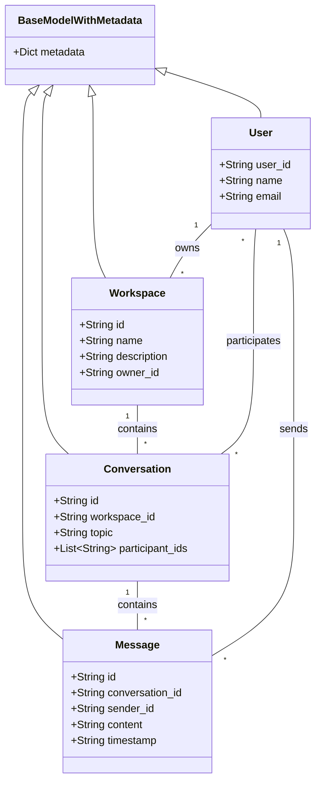

# Data Models Specification

## Overview

This document provides detailed specifications for the data models implemented in Phase 1 of the Cortex Core system. It focuses on the domain models, validation rules, relationships, and in-memory storage patterns that form the foundation of the system.

Phase 1 implements an in-memory data model architecture with built-in extensibility through flexible metadata fields. This approach enables rapid development while establishing patterns that will scale to persistent storage in future phases.

## Data Model Architecture



## Base Model with Metadata

All domain models extend from a base model that includes a flexible `metadata` field. This pattern allows for experimentation and extension without changing the core schema.

### BaseModelWithMetadata

```python
from pydantic import BaseModel, Field
from typing import Dict, Any

class BaseModelWithMetadata(BaseModel):
    """
    Base model with metadata field for storing extra information such as
    experimental flags or debug data.
    """
    metadata: Dict[str, Any] = Field(default_factory=dict)
```

#### Key Aspects

1. **Flexible Extension**: The metadata field allows adding properties without schema changes
2. **Default Empty**: Default is an empty dictionary for minimal overhead
3. **Type Flexibility**: `Any` type allows storing different data types in metadata
4. **Pydantic Integration**: Compatible with Pydantic's validation system

#### Metadata Field Usage Patterns

The metadata field serves several important purposes:

1. **Client Customization**: Store client-specific preferences and settings

   ```json
   {
     "metadata": {
       "theme": "dark",
       "font_size": 14,
       "notifications_enabled": true
     }
   }
   ```

2. **Feature Flags**: Enable or disable experimental features

   ```json
   {
     "metadata": {
       "experimental_ai_enabled": true,
       "beta_features": ["smart_suggestions", "voice_input"]
     }
   }
   ```

3. **Debugging Information**: Include diagnostic data

   ```json
   {
     "metadata": {
       "client_version": "1.2.3",
       "client_platform": "web",
       "request_id": "req-123456"
     }
   }
   ```

4. **Extensions**: Add features without schema changes
   ```json
   {
     "metadata": {
       "icon": "project",
       "color": "#4287f5",
       "tags": ["important", "active"]
     }
   }
   ```

#### Best Practices

1. **Nested Structure**: Use nested dictionaries for organization
2. **Naming Conventions**: Use clear, descriptive keys
3. **Value Types**: Prefer simple types (string, number, boolean, arrays)
4. **Documentation**: Document metadata fields in API documentation
5. **Validation**: Validate critical metadata fields at the application level

## Domain Models

### User Model

The User model represents a system user with authentication information.

```python
from pydantic import BaseModel, Field
from typing import Dict, Any
from .base import BaseModelWithMetadata

class User(BaseModelWithMetadata):
    """System user model."""
    user_id: str
    name: str
    email: str
```

#### Field Specifications

| Field      | Type   | Required | Description                    | Validation Rules                                             |
| ---------- | ------ | -------- | ------------------------------ | ------------------------------------------------------------ |
| `user_id`  | String | Yes      | Unique identifier for the user | Non-empty string, UUID format (from Azure B2C's `oid` claim) |
| `name`     | String | Yes      | User's display name            | Non-empty string, 1-100 characters                           |
| `email`    | String | Yes      | User's email address           | Valid email format                                           |
| `metadata` | Object | No       | Additional user information    | Any JSON object                                              |

#### Usage Context

The User model is primarily used for:

1. **Authentication Context**: Storing user information from JWT tokens
2. **Data Ownership**: Associating resources with their owners
3. **User Filtering**: Filtering data by user ID for privacy

#### Example Instance

```json
{
  "user_id": "550e8400-e29b-41d4-a716-446655440000",
  "name": "John Doe",
  "email": "john.doe@example.com",
  "metadata": {
    "preferred_language": "en-US",
    "account_created": "2023-06-15T10:30:00Z",
    "roles": ["user"]
  }
}
```

### Workspace Model

The Workspace model represents a top-level organizational container for conversations.

```python
import uuid
from pydantic import BaseModel, Field
from typing import Dict, Any
from .base import BaseModelWithMetadata

class Workspace(BaseModelWithMetadata):
    """Workspace model."""
    id: str = Field(default_factory=lambda: str(uuid.uuid4()))
    name: str
    description: str
    owner_id: str
```

#### Field Specifications

| Field         | Type   | Required | Description                         | Validation Rules                            |
| ------------- | ------ | -------- | ----------------------------------- | ------------------------------------------- |
| `id`          | String | Auto     | Unique identifier for the workspace | UUID format, auto-generated if not provided |
| `name`        | String | Yes      | Workspace name                      | Non-empty string, 1-100 characters          |
| `description` | String | Yes      | Workspace description               | Non-empty string, 1-500 characters          |
| `owner_id`    | String | Yes      | User ID of the workspace owner      | Must match an existing user's user_id       |
| `metadata`    | Object | No       | Additional workspace information    | Any JSON object                             |

#### Validation Logic

```python
# Example validator for name length
@validator('name')
def name_must_be_valid_length(cls, v):
    if len(v) < 1 or len(v) > 100:
        raise ValueError('name must be between 1 and 100 characters')
    return v

# Example validator for owner_id
@validator('owner_id')
def owner_must_exist(cls, v, values):
    # In Phase 1, this would check the in-memory user store
    # In future phases, this would query the database
    if not user_exists(v):
        raise ValueError('owner must be an existing user')
    return v
```

#### Usage Context

The Workspace model is used for:

1. **Resource Organization**: Grouping related conversations
2. **Access Control**: Managing permissions through ownership
3. **User Partitioning**: Isolating data between users

#### Example Instance

```json
{
  "id": "650e8400-e29b-41d4-a716-446655440111",
  "name": "Project X",
  "description": "Workspace for Project X development",
  "owner_id": "550e8400-e29b-41d4-a716-446655440000",
  "metadata": {
    "icon": "project",
    "color": "#4287f5",
    "created_at": "2023-06-15T10:30:00Z"
  }
}
```

### Conversation Model

The Conversation model represents a collection of messages on a specific topic within a workspace.

```python
import uuid
from pydantic import BaseModel, Field
from typing import Dict, Any, List
from .base import BaseModelWithMetadata

class Conversation(BaseModelWithMetadata):
    """Conversation model."""
    id: str = Field(default_factory=lambda: str(uuid.uuid4()))
    workspace_id: str
    topic: str
    participant_ids: List[str]
```

#### Field Specifications

| Field             | Type            | Required | Description                                      | Validation Rules                            |
| ----------------- | --------------- | -------- | ------------------------------------------------ | ------------------------------------------- |
| `id`              | String          | Auto     | Unique identifier for the conversation           | UUID format, auto-generated if not provided |
| `workspace_id`    | String          | Yes      | ID of the parent workspace                       | Must match an existing workspace ID         |
| `topic`           | String          | Yes      | Conversation topic                               | Non-empty string, 1-200 characters          |
| `participant_ids` | Array of String | Yes      | List of user IDs who can access the conversation | Must contain at least one user ID           |
| `metadata`        | Object          | No       | Additional conversation information              | Any JSON object                             |

#### Validation Logic

```python
# Example validator for topic length
@validator('topic')
def topic_must_be_valid_length(cls, v):
    if len(v) < 1 or len(v) > 200:
        raise ValueError('topic must be between 1 and 200 characters')
    return v

# Example validator for workspace_id
@validator('workspace_id')
def workspace_must_exist(cls, v):
    # In Phase 1, this would check the in-memory workspace store
    # In future phases, this would query the database
    if not workspace_exists(v):
        raise ValueError('workspace must exist')
    return v

# Example validator for participant_ids
@validator('participant_ids')
def participants_must_not_be_empty(cls, v):
    if not v:
        raise ValueError('conversation must have at least one participant')
    return v
```

#### Usage Context

The Conversation model is used for:

1. **Message Organization**: Grouping related messages
2. **Access Control**: Managing who can participate in discussions
3. **Topic Focus**: Maintaining conversation context

#### Example Instance

```json
{
  "id": "850e8400-e29b-41d4-a716-446655440333",
  "workspace_id": "650e8400-e29b-41d4-a716-446655440111",
  "topic": "Backend Development",
  "participant_ids": ["550e8400-e29b-41d4-a716-446655440000"],
  "metadata": {
    "icon": "code",
    "priority": "high",
    "created_at": "2023-06-16T14:20:00Z"
  }
}
```

### Message Model

The Message model represents a single message within a conversation.

```python
import uuid
from datetime import datetime
from pydantic import BaseModel, Field
from typing import Dict, Any
from .base import BaseModelWithMetadata

class Message(BaseModelWithMetadata):
    """Message model."""
    id: str = Field(default_factory=lambda: str(uuid.uuid4()))
    conversation_id: str
    sender_id: str
    content: str
    timestamp: str = Field(default_factory=lambda: datetime.now().isoformat())
```

#### Field Specifications

| Field             | Type   | Required | Description                       | Validation Rules                            |
| ----------------- | ------ | -------- | --------------------------------- | ------------------------------------------- |
| `id`              | String | Auto     | Unique identifier for the message | UUID format, auto-generated if not provided |
| `conversation_id` | String | Yes      | ID of the parent conversation     | Must match an existing conversation ID      |
| `sender_id`       | String | Yes      | User ID of the message sender     | Must match an existing user ID              |
| `content`         | String | Yes      | Message content                   | Non-empty string                            |
| `timestamp`       | String | Auto     | When the message was sent         | ISO 8601 format, defaults to current time   |
| `metadata`        | Object | No       | Additional message information    | Any JSON object                             |

#### Validation Logic

```python
# Example validator for content
@validator('content')
def content_must_not_be_empty(cls, v):
    if not v.strip():
        raise ValueError('content must not be empty')
    return v

# Example validator for conversation_id
@validator('conversation_id')
def conversation_must_exist(cls, v):
    # In Phase 1, this would check the in-memory conversation store
    # In future phases, this would query the database
    if not conversation_exists(v):
        raise ValueError('conversation must exist')
    return v

# Example validator for timestamp format
@validator('timestamp')
def timestamp_must_be_iso_format(cls, v):
    try:
        datetime.fromisoformat(v.replace('Z', '+00:00'))
    except ValueError:
        raise ValueError('timestamp must be in ISO 8601 format')
    return v
```

#### Usage Context

The Message model is used for:

1. **Communication**: Storing conversation content
2. **Chronology**: Maintaining message order with timestamps
3. **Attribution**: Tracking who sent each message

#### Example Instance

```json
{
  "id": "950e8400-e29b-41d4-a716-446655440444",
  "conversation_id": "850e8400-e29b-41d4-a716-446655440333",
  "sender_id": "550e8400-e29b-41d4-a716-446655440000",
  "content": "Hello, this is a message!",
  "timestamp": "2023-06-16T14:25:30Z",
  "metadata": {
    "client_id": "web-client",
    "client_version": "1.0.0",
    "read_status": "unread"
  }
}
```

## API Models

API models are separate from domain models and serve as the interface for API requests and responses. This separation keeps the API contract stable even as internal domain models evolve.

### Request Models

#### LoginRequest

```python
from pydantic import BaseModel, Field

class LoginRequest(BaseModel):
    """Login request model."""
    email: str = Field(..., description="User email")
    password: str = Field(..., description="User password")
```

#### InputRequest

```python
from pydantic import BaseModel, Field
from typing import Dict, Any, Optional
from ..base import BaseModelWithMetadata

class InputRequest(BaseModelWithMetadata):
    """Input data from clients."""
    content: str = Field(..., description="Message content")
    conversation_id: Optional[str] = Field(None, description="Conversation ID")
```

#### WorkspaceCreate

```python
from pydantic import BaseModel, Field
from typing import Dict, Any
from ..base import BaseModelWithMetadata

class WorkspaceCreate(BaseModelWithMetadata):
    """Request to create a workspace."""
    name: str = Field(..., min_length=1, max_length=100, description="Workspace name")
    description: str = Field(..., min_length=1, max_length=500, description="Workspace description")
```

#### ConversationCreate

```python
from pydantic import BaseModel, Field
from typing import Dict, Any, List
from ..base import BaseModelWithMetadata

class ConversationCreate(BaseModelWithMetadata):
    """Request to create a conversation."""
    workspace_id: str = Field(..., description="ID of the parent workspace")
    topic: str = Field(..., min_length=1, max_length=200, description="Conversation topic")
    participant_ids: List[str] = Field(default_factory=list, description="List of user IDs")
```

### Response Models

#### LoginResponse

```python
from pydantic import BaseModel, Field
from typing import Dict, Any

class LoginResponse(BaseModel):
    """Login response model."""
    access_token: str = Field(..., description="JWT access token")
    token_type: str = Field(..., description="Token type")
    expires_in: int = Field(..., description="Token expiration in seconds")
    claims: Dict[str, Any] = Field(..., description="User claims")
```

#### InputResponse

```python
from pydantic import BaseModel, Field
from typing import Dict, Any

class InputResponse(BaseModel):
    """Input response model."""
    status: str = Field(..., description="Status of the operation")
    data: Dict[str, Any] = Field(..., description="Echoed input data")
```

#### WorkspaceResponse

```python
from pydantic import BaseModel, Field
from typing import Dict, Any
from ..domain import Workspace

class WorkspaceResponse(BaseModel):
    """Workspace response model."""
    status: str = Field(..., description="Status of the operation")
    workspace: Workspace = Field(..., description="Created workspace")
```

#### ConversationResponse

```python
from pydantic import BaseModel, Field
from typing import Dict, Any
from ..domain import Conversation

class ConversationResponse(BaseModel):
    """Conversation response model."""
    status: str = Field(..., description="Status of the operation")
    conversation: Conversation = Field(..., description="Created conversation")
```

## Model Relationships

The data models form a hierarchical relationship structure:

1. **User to Workspace**: One-to-many relationship (a user can own multiple workspaces)

   ```python
   # Relationship enforced by owner_id field in Workspace
   workspace.owner_id == user.user_id
   ```

2. **Workspace to Conversation**: One-to-many relationship (a workspace contains multiple conversations)

   ```python
   # Relationship enforced by workspace_id field in Conversation
   conversation.workspace_id == workspace.id
   ```

3. **Conversation to Message**: One-to-many relationship (a conversation contains multiple messages)

   ```python
   # Relationship enforced by conversation_id field in Message
   message.conversation_id == conversation.id
   ```

4. **User to Message**: One-to-many relationship (a user sends multiple messages)

   ```python
   # Relationship enforced by sender_id field in Message
   message.sender_id == user.user_id
   ```

5. **User to Conversation**: Many-to-many relationship (users participate in multiple conversations)
   ```python
   # Relationship enforced by participant_ids list in Conversation
   user.user_id in conversation.participant_ids
   ```

### Relationship Integrity

In Phase 1 with in-memory storage, relationship integrity is maintained at the application level:

```python
# Example: Ensuring a conversation belongs to the specified workspace
def validate_conversation_workspace(conversation_id, workspace_id):
    conversation = storage.get_conversation(conversation_id)
    if not conversation:
        raise ValueError("Conversation not found")
    if conversation["workspace_id"] != workspace_id:
        raise ValueError("Conversation does not belong to specified workspace")
```

In future phases with database storage, these relationships will be enforced with foreign key constraints.

## In-Memory Storage Implementation

Phase 1 uses a simple in-memory storage implementation with dictionaries for each model type.

```python
class InMemoryStorage:
    """
    Simple in-memory storage for development use.
    """
    def __init__(self):
        self.users: Dict[str, Dict[str, Any]] = {}
        self.workspaces: Dict[str, Dict[str, Any]] = {}
        self.conversations: Dict[str, Dict[str, Any]] = {}
        self.messages: Dict[str, Dict[str, Any]] = {}
```

### Storage Operations

Each model type has corresponding CRUD operations:

#### User Operations

```python
def get_user(self, user_id: str) -> Optional[Dict[str, Any]]:
    """Get user by ID."""
    return self.users.get(user_id)

def create_user(self, user: User) -> Dict[str, Any]:
    """Create a new user."""
    user_dict = user.model_dump()
    self.users[user.user_id] = user_dict
    return user_dict
```

#### Workspace Operations

```python
def create_workspace(self, workspace: Workspace) -> Dict[str, Any]:
    """Create a new workspace."""
    workspace_dict = workspace.model_dump()
    self.workspaces[workspace.id] = workspace_dict
    return workspace_dict

def get_workspace(self, workspace_id: str) -> Optional[Dict[str, Any]]:
    """Get workspace by ID."""
    return self.workspaces.get(workspace_id)

def list_workspaces(self, owner_id: str) -> List[Dict[str, Any]]:
    """List workspaces by owner ID."""
    return [
        workspace for workspace in self.workspaces.values()
        if workspace["owner_id"] == owner_id
    ]
```

#### Conversation Operations

```python
def create_conversation(self, conversation: Conversation) -> Dict[str, Any]:
    """Create a new conversation."""
    conversation_dict = conversation.model_dump()
    self.conversations[conversation.id] = conversation_dict
    return conversation_dict

def get_conversation(self, conversation_id: str) -> Optional[Dict[str, Any]]:
    """Get conversation by ID."""
    return self.conversations.get(conversation_id)

def list_conversations(self, workspace_id: str) -> List[Dict[str, Any]]:
    """List conversations by workspace ID."""
    return [
        conversation for conversation in self.conversations.values()
        if conversation["workspace_id"] == workspace_id
    ]
```

#### Message Operations

```python
def create_message(self, message: Message) -> Dict[str, Any]:
    """Create a new message."""
    message_dict = message.model_dump()
    self.messages[message.id] = message_dict
    return message_dict

def get_message(self, message_id: str) -> Optional[Dict[str, Any]]:
    """Get message by ID."""
    return self.messages.get(message_id)

def list_messages(self, conversation_id: str) -> List[Dict[str, Any]]:
    """List messages by conversation ID."""
    return [
        message for message in self.messages.values()
        if message["conversation_id"] == conversation_id
    ]
```

### Storage Usage Pattern

The in-memory storage is used throughout the application with a singleton pattern:

```python
# Singleton instance
storage = InMemoryStorage()
```

### Thread Safety Considerations

The in-memory storage implementation in Phase 1 is not thread-safe:

```python
# Creating a workspace
workspace = Workspace(
    name="Project X",
    description="Workspace for Project X development",
    owner_id=user_id
)
storage.create_workspace(workspace)

# Race condition can occur if two threads modify self.workspaces simultaneously
```

For Phase 1, this is acceptable since FastAPI's async model reduces the likelihood of race conditions. In future phases with persistent storage, proper transaction handling will be implemented.

## Data Partitioning

### User-Based Partitioning

All data in the system is partitioned by user ID to ensure proper isolation:

```python
# List workspaces for a user
user_workspaces = [
    workspace for workspace in storage.workspaces.values()
    if workspace["owner_id"] == user_id
]

# List messages in a conversation, filtered by user access
def list_messages_for_user(conversation_id: str, user_id: str) -> List[Dict[str, Any]]:
    # First check if user has access to the conversation
    conversation = storage.get_conversation(conversation_id)
    if not conversation:
        raise ValueError("Conversation not found")

    if user_id not in conversation["participant_ids"]:
        raise ValueError("User does not have access to this conversation")

    # If user has access, return messages
    return storage.list_messages(conversation_id)
```

### Access Control Patterns

Access control is implemented at multiple levels:

1. **Workspace Level**: Only the owner can manage the workspace

   ```python
   # Check if user owns the workspace
   workspace = storage.get_workspace(workspace_id)
   if workspace["owner_id"] != user_id:
       raise HTTPException(status_code=403, detail="Access denied")
   ```

2. **Conversation Level**: Only participants can access a conversation

   ```python
   # Check if user is a participant in the conversation
   conversation = storage.get_conversation(conversation_id)
   if user_id not in conversation["participant_ids"]:
       raise HTTPException(status_code=403, detail="Access denied")
   ```

3. **Event Level**: Events are filtered by user_id in the SSE stream
   ```python
   # Filter events by user ID
   if event.get("user_id") == user_id:
       # Send event to this user
       yield f"data: {json.dumps(event)}\n\n"
   ```

## API Model Transformations

### Domain to API Transformation

Domain models are often transformed to API response models:

```python
# Create a workspace
workspace = Workspace(
    name=request.name,
    description=request.description,
    owner_id=user_id,
    metadata=request.metadata
)
workspace_dict = storage.create_workspace(workspace)

# Transform to API response
response = WorkspaceResponse(
    status="workspace created",
    workspace=Workspace(**workspace_dict)
)
```

### API to Domain Transformation

API request models are transformed to domain models:

```python
# Transform request to domain model
workspace = Workspace(
    name=request.name,
    description=request.description,
    owner_id=user_id,
    metadata=request.metadata
)
```

## Schema Extension Patterns

### Adding New Fields

When adding new fields to the schema, consider these options:

1. **Use the Metadata Field**: For experimental or optional fields

   ```python
   # Adding a color field to a workspace via metadata
   workspace = Workspace(
       name="Project X",
       description="Development workspace",
       owner_id=user_id,
       metadata={"color": "#4287f5"}
   )
   ```

2. **Extend the Model**: For required fields (in future phases)
   ```python
   # Future extension: Adding a color field directly
   class WorkspaceExtended(Workspace):
       color: Optional[str] = None
   ```

### Backwards Compatibility

Maintain backwards compatibility when extending schemas:

1. **Optional Fields**: New fields should be optional with defaults

   ```python
   class User(BaseModelWithMetadata):
       user_id: str
       name: str
       email: str
       profile_image: Optional[str] = None  # New optional field
   ```

2. **Metadata for Experimentation**: Use metadata before promoting to schema

   ```python
   # Step 1: Add to metadata
   user.metadata["profile_image"] = "https://example.com/image.jpg"

   # Step 2 (future): Promote to schema field once stable
   class User(BaseModelWithMetadata):
       user_id: str
       name: str
       email: str
       profile_image: Optional[str] = None
   ```

## Testing Data Models

### Unit Testing Models

```python
import pytest
from app.models.domain import User, Workspace, Conversation, Message

def test_user_model():
    """Test User model creation and validation."""
    # Create valid user
    user = User(
        user_id="test-123",
        name="Test User",
        email="test@example.com"
    )

    # Verify fields
    assert user.user_id == "test-123"
    assert user.name == "Test User"
    assert user.email == "test@example.com"
    assert user.metadata == {}

    # Test with metadata
    user_with_metadata = User(
        user_id="test-456",
        name="Another User",
        email="another@example.com",
        metadata={"role": "admin"}
    )

    assert user_with_metadata.metadata["role"] == "admin"

def test_workspace_model():
    """Test Workspace model creation and validation."""
    # Create workspace
    workspace = Workspace(
        name="Test Workspace",
        description="A test workspace",
        owner_id="user-123"
    )

    # Verify fields
    assert workspace.name == "Test Workspace"
    assert workspace.description == "A test workspace"
    assert workspace.owner_id == "user-123"

    # Verify ID generation
    assert workspace.id is not None
    assert isinstance(workspace.id, str)
```

### Testing Relationships

```python
def test_model_relationships():
    """Test relationships between models."""
    # Create user
    user = User(
        user_id="user-123",
        name="Test User",
        email="test@example.com"
    )

    # Create workspace owned by user
    workspace = Workspace(
        id="workspace-123",
        name="Test Workspace",
        description="A test workspace",
        owner_id=user.user_id
    )

    # Create conversation in workspace
    conversation = Conversation(
        id="conversation-123",
        workspace_id=workspace.id,
        topic="Test Conversation",
        participant_ids=[user.user_id]
    )

    # Create message in conversation
    message = Message(
        id="message-123",
        conversation_id=conversation.id,
        sender_id=user.user_id,
        content="Hello, world!"
    )

    # Verify relationships
    assert workspace.owner_id == user.user_id
    assert conversation.workspace_id == workspace.id
    assert message.conversation_id == conversation.id
    assert message.sender_id == user.user_id
    assert user.user_id in conversation.participant_ids
```

## Future Database Considerations

While Phase 1 uses in-memory storage, future phases will implement persistent storage. Here's a preview of the database schema design:

### SQLAlchemy Models (Future)

```python
from sqlalchemy import Column, String, ForeignKey, Text, Table
from sqlalchemy.ext.declarative import declarative_base
from sqlalchemy.dialects.postgresql import JSONB, UUID, ARRAY
from sqlalchemy.orm import relationship

Base = declarative_base()

class User(Base):
    __tablename__ = "users"

    user_id = Column(String, primary_key=True)
    name = Column(String(100), nullable=False)
    email = Column(String(255), nullable=False, unique=True)
    metadata = Column(JSONB, default={})

    # Relationships
    workspaces = relationship("Workspace", back_populates="owner")
    messages = relationship("Message", back_populates="sender")

class Workspace(Base):
    __tablename__ = "workspaces"

    id = Column(UUID, primary_key=True)
    name = Column(String(100), nullable=False)
    description = Column(Text, nullable=False)
    owner_id = Column(String, ForeignKey("users.user_id"), nullable=False)
    metadata = Column(JSONB, default={})

    # Relationships
    owner = relationship("User", back_populates="workspaces")
    conversations = relationship("Conversation", back_populates="workspace")

class Conversation(Base):
    __tablename__ = "conversations"

    id = Column(UUID, primary_key=True)
    workspace_id = Column(UUID, ForeignKey("workspaces.id"), nullable=False)
    topic = Column(String(200), nullable=False)
    participant_ids = Column(ARRAY(String), nullable=False)
    metadata = Column(JSONB, default={})

    # Relationships
    workspace = relationship("Workspace", back_populates="conversations")
    messages = relationship("Message", back_populates="conversation")

class Message(Base):
    __tablename__ = "messages"

    id = Column(UUID, primary_key=True)
    conversation_id = Column(UUID, ForeignKey("conversations.id"), nullable=False)
    sender_id = Column(String, ForeignKey("users.user_id"), nullable=False)
    content = Column(Text, nullable=False)
    timestamp = Column(String, nullable=False)
    metadata = Column(JSONB, default={})

    # Relationships
    conversation = relationship("Conversation", back_populates="messages")
    sender = relationship("User", back_populates="messages")
```

### Migration Strategy

When migrating from in-memory to persistent storage:

1. **Model Consistency**: Keep domain models identical for seamless transition
2. **Repository Pattern**: Implement repository interfaces to abstract storage
3. **Incremental Migration**: Migrate one model at a time to reduce risk
4. **Data Transfer**: Create scripts to transfer in-memory data to database
5. **Testing**: Comprehensive testing of both implementations in parallel

## Best Practices for Data Model Usage

### Creating Instances

```python
# Use named parameters for clarity
user = User(
    user_id="user-123",
    name="Test User",
    email="test@example.com"
)

# Let default values handle optional fields
workspace = Workspace(
    name="Project X",
    description="Development workspace",
    owner_id=user_id
    # metadata will default to {}
)

# Use the metadata field for extensions
workspace = Workspace(
    name="Project X",
    description="Development workspace",
    owner_id=user_id,
    metadata={
        "color": "#4287f5",
        "icon": "project",
        "priority": "high"
    }
)
```

### Handling Relationships

```python
# Creating related objects
workspace = Workspace(
    name="Project X",
    description="Development workspace",
    owner_id=user_id
)
workspace_dict = storage.create_workspace(workspace)

# Refer to parent by ID
conversation = Conversation(
    workspace_id=workspace.id,
    topic="Backend Development",
    participant_ids=[user_id]
)
conversation_dict = storage.create_conversation(conversation)

# Refer to parent and sender by ID
message = Message(
    conversation_id=conversation.id,
    sender_id=user_id,
    content="Hello, team!"
)
message_dict = storage.create_message(message)
```

### Validation and Error Handling

```python
# Validating models
try:
    user = User(
        user_id="user-123",
        name="Test User",
        email="invalid-email"  # Invalid email format
    )
except ValidationError as e:
    print(f"Validation error: {e}")
    # Handle validation error

# Validating relationships
def get_conversation(conversation_id: str, user_id: str):
    conversation = storage.get_conversation(conversation_id)
    if not conversation:
        raise HTTPException(status_code=404, detail="Conversation not found")

    # Check access permission
    if user_id not in conversation["participant_ids"]:
        raise HTTPException(status_code=403, detail="Access denied")

    return conversation
```

## Conclusion

The data models in Phase 1 establish a solid foundation for the Cortex Core system:

1. **Extensible Base Model**: The `BaseModelWithMetadata` pattern enables experimentation and extension
2. **Clear Domain Models**: User, Workspace, Conversation, and Message models define the core entities
3. **API Models**: Separate models for API requests and responses maintain a clean contract
4. **In-Memory Storage**: Simple dictionary-based storage for rapid development
5. **Data Partitioning**: Proper user isolation through consistent data partitioning
6. **Future Considerations**: Clear path to persistent storage in future phases

These models provide a flexible yet structured approach that can evolve with the system while maintaining backward compatibility.
