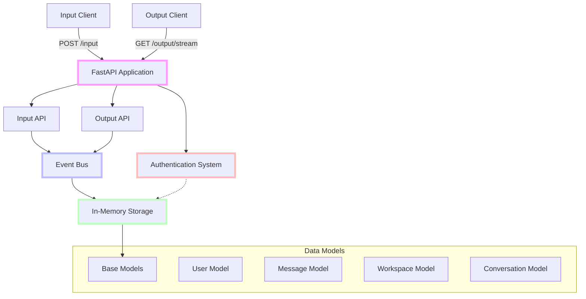

## Integration with Client Applications

A key goal of Phase 1 is to enable other developers to build client applications immediately. Here's what client developers need to know:

### For Input Client Developers

1. **Authentication**:

   - Obtain a JWT token via POST to `/auth/login`
   - Include the token in all requests as `Authorization: Bearer {token}`

2. **Sending Input**:

   - POST to `/input` endpoint
   - Include properly formatted JSON payload
   - Handle 200 OK responses for success
   - Handle error responses (400, 401, 500)

3. **Expected Format**:
   ```json
   {
     "content": "Hello, Cortex!",
     "conversation_id": "850e8400-e29b-41d4-a716-446655440333",
     "metadata": {
       "client_id": "web-chat-client",
       "client_version": "1.0.0"
     }
   }
   ```

### For Output Client Developers

1. **Authentication**:

   - Obtain a JWT token via POST to `/auth/login`
   - Include the token in all requests as `Authorization: Bearer {token}`

2. **Receiving Output**:

   - Connect to GET `/output/stream`
   - Parse Server-Sent Events (SSE) format
   - Filter events by type if needed
   - Implement reconnection logic
   - Handle heartbeat events (every 30 seconds)

3. **Event Format Example**:

   ```
   data: {"type": "output", "content": "Hello, user!", "user_id": "550e8400-e29b-41d4-a716-446655440000", "timestamp": "2025-03-20T10:16:00Z"}

   data: {"type": "typing", "is_typing": true, "user_id": "550e8400-e29b-41d4-a716-446655440000", "timestamp": "2025-03-20T10:16:00Z"}
   ```

Client developers should be directed to the `CLIENT_INTEGRATION.md` document for more detailed examples and code snippets.## Common Pitfalls and Challenges

Be aware of these common implementation challenges:

1. **Memory Leaks in SSE Implementation**:

   - Failing to unsubscribe from the Event Bus when clients disconnect
   - Not cleaning up resources in finally blocks
   - Forgetting to handle CancelledError exceptions

2. **Asyncio Challenges**:

   - Using blocking operations in async code
   - Not handling task cancellations properly
   - Creating tasks without tracking them for cleanup
   - Mixing sync and async code incorrectly

3. **Authentication Issues**:

   - Inconsistent use of user IDs across the system
   - Missing token validation on protected endpoints
   - Improper error handling for invalid tokens

4. **Event Bus Challenges**:

   - Blocking the event bus with slow consumers
   - Not properly filtering events by user ID
   - Missing error handling in event processing

5. **Resource Management**:
   - Not cleaning up background tasks on shutdown
   - Resource leaks with long-lived connections
   - Missing proper shutdown procedures for the application

## Validating Your Implementation

To ensure your Phase 1 implementation is correct:

1. **Functional Testing**:

   - Create and authenticate a test user
   - Send data through the input endpoint
   - Verify the same data appears in the output stream
   - Test with multiple simultaneous users
   - Verify data is properly partitioned (users only see their own data)

2. **Resource Testing**:

   - Run the application for an extended period
   - Monitor memory usage to ensure it remains stable
   - Test repeated connections and disconnections
   - Verify no resource leaks occur

3. **Error Testing**:

   - Test with invalid authentication tokens
   - Test with malformed input data
   - Test with invalid requests
   - Verify appropriate error responses

4. **Performance Check**:
   - Ensure the application can handle at least 100 simultaneous connections
   - Verify event delivery has acceptable latency (< 200ms)
   - Test with larger message payloads
   - No need for extensive performance optimization in Phase 1# Cortex Core Phase 1: Functional Input/Output System

## Project Overview

Cortex Core is a centralized API service that manages communication between input clients (which send data) and output clients (which receive processed data). It's designed as a modular, extensible platform that will eventually integrate with various backend services for memory storage, cognition, and domain-specific processing.

Phase 1 focuses on building a minimal but **complete and functional** implementation of the input/output flow with in-memory storage. This enables other developers to immediately start building and testing client applications while subsequent phases add more sophisticated features.

## Goals of Phase 1

1. **Establish Core Architecture**: Create the foundational application structure and communication patterns
2. **Enable End-to-End Flow**: Implement a working message flow from input clients to output clients
3. **Implement Authentication**: Provide a simplified but secure JWT-based authentication system
4. **Create In-Memory Storage**: Build a non-persistent but functional data storage system
5. **Support Multiple Users**: Ensure proper partitioning of data by user ID
6. **Define Stable API Contracts**: Establish API contracts that will remain stable in future phases

## System Architecture - Phase 1



### Phase 1 Components

1. **FastAPI Application**

   - Main application entry point
   - API endpoint routing
   - Authentication middleware
   - Error handling

2. **Input API**

   - `/input` endpoint for receiving client data
   - Request validation
   - User authentication and context extraction
   - Event publication to the Event Bus

3. **Output API**

   - `/output/stream` endpoint using Server-Sent Events (SSE)
   - User-specific event filtering
   - Connection management
   - Heartbeat mechanism

4. **Event Bus**

   - In-memory message bus
   - Subscription management
   - Event publishing
   - Event filtering

5. **Authentication System**

   - JWT token generation
   - Token validation
   - User context extraction
   - Authorization header processing

6. **In-Memory Storage**

   - User data storage
   - Message history tracking
   - User partitioning

7. **Data Models**
   - Base models with metadata
   - User model
   - Message model
   - Workspace model (minimal implementation)
   - Conversation model (minimal implementation)

## What's Included in Phase 1

- ✅ Complete FastAPI application structure
- ✅ JWT-based authentication system
- ✅ Input endpoint for receiving data
- ✅ Output endpoint using Server-Sent Events
- ✅ In-memory Event Bus implementation
- ✅ In-memory data storage
- ✅ User partitioning for data
- ✅ Basic workspace and conversation management
- ✅ Error handling and logging
- ✅ Unit and integration tests
- ✅ Development environment configuration

## What's Explicitly NOT Included in Phase 1

- ❌ Persistent storage (SQL, NoSQL)
- ❌ Azure B2C integration
- ❌ MCP (Model Context Protocol) client and services
- ❌ Memory Service integration
- ❌ Cognition Service integration
- ❌ Domain Expert integration
- ❌ External service discovery
- ❌ Advanced error recovery mechanisms
- ❌ Production deployment configuration

## Success Criteria for Phase 1

Phase 1 is considered successfully completed when:

1. A user can authenticate using JWT and receive a valid token
2. An authenticated user can send data to the input endpoint
3. The same user can connect to the output endpoint and receive their data
4. Multiple users can use the system simultaneously with proper data isolation
5. All tests pass (unit, integration, and end-to-end)
6. Other developers can build client applications against the API
7. The system can run continuously without resource leaks

## Key Implementation Principles for Phase 1

1. **End-to-End First**: Focus on getting a complete flow working before adding sophistication
2. **Ruthless Simplicity**: Keep everything as simple as possible while still being functional
3. **No Future-Proofing**: Build what's needed now, not what might be needed later
4. **Proper Boundaries**: Maintain clear separation between components
5. **User Partitioning**: All data must be properly partitioned by user ID
6. **Clean Interfaces**: APIs should be clean, consistent, and well-documented
7. **No Premature Optimization**: Focus on correctness first, optimization later
8. **Testability**: All components should be easily testable
9. **Resource Management**: Properly clean up resources, especially for long-lived connections
10. **Error Visibility**: Make errors obvious and diagnosable

## Phase 1 Data Flow

1. **Authentication Flow**:

   ```
   Client → POST /auth/login → Authentication System → JWT Token → Client
   ```

2. **Input Flow**:

   ```
   Client → POST /input + JWT → Input API → Event Bus → In-Memory Storage
   ```

3. **Output Flow**:
   ```
   Client → GET /output/stream + JWT → Output API → SSE Connection →
   Event Bus Subscription → Filtered Events → Client
   ```

## Critical Implementation Details

### Authentication System

The authentication system in Phase 1 uses JWT (JSON Web Tokens) for simplicity and statelessness. While eventual integration with Azure B2C is planned for later phases, the Phase 1 implementation uses a local secret key and simplified user management.

Key details:

- Tokens include `user_id`, `name`, and `email` claims
- Token expiration is set to 24 hours
- Authentication uses the standard `Authorization: Bearer {token}` header
- User IDs must be used consistently for data partitioning

**JWT Token Structure Example**:

```json
{
  "sub": "user@example.com",
  "oid": "550e8400-e29b-41d4-a716-446655440000",
  "name": "John Doe",
  "email": "user@example.com",
  "exp": 1616239022,
  "iat": 1616152622
}
```

The `oid` claim is used as the `user_id` throughout the system and **must** be used to partition all data.

### Event Bus

The Event Bus is the central communication mechanism within the Cortex Core. In Phase 1, it's implemented as a simple in-memory system using asyncio queues. Later phases will enhance this with more sophisticated features.

Key details:

- Events must include `user_id` for proper filtering
- All subscribers receive all events (filtering happens at the consumer level)
- Events have a standard format with `type`, `data`, `user_id`, and `timestamp`
- Subscribers are managed through asyncio Queues

**Standard Event Format Example**:

```json
{
  "type": "input",
  "data": {
    "message": "Hello, Cortex!",
    "conversation_id": "850e8400-e29b-41d4-a716-446655440333"
  },
  "user_id": "550e8400-e29b-41d4-a716-446655440000",
  "timestamp": "2025-03-20T10:15:30Z",
  "metadata": {
    "client_id": "web-chat-client",
    "client_version": "1.0.0"
  }
}
```

Common event types include:

- `input`: New input received from a client
- `output`: Output to be sent to clients
- `typing`: Typing indicator status changes
- `heartbeat`: Regular connection health check
- `error`: Error notifications

### Server-Sent Events (SSE)

The output mechanism uses Server-Sent Events (SSE) rather than WebSockets. This is a deliberate architectural choice that will remain consistent throughout all phases.

Key details:

- SSE connections must filter events by `user_id`
- Connections must be properly cleaned up when clients disconnect
- A heartbeat mechanism must be implemented to keep connections alive (every 30 seconds)
- The SSE endpoint must handle reconnection scenarios

**Important Implementation Considerations**:

- Always unsubscribe from the Event Bus when a client disconnects to prevent memory leaks
- Handle asyncio.CancelledError to detect client disconnections
- Each SSE connection should have its own asyncio.Queue
- Use `try/finally` blocks to ensure proper cleanup even when errors occur
- Set an appropriate Content-Type header: `text/event-stream`
- Format events properly with `data:` prefix and double newlines: `data: {...}\n\n`

### In-Memory Storage

Phase 1 uses in-memory storage for simplicity. This will be replaced with persistent storage in later phases, but the interface should remain consistent.

Key details:

- All data must be partitioned by `user_id`
- The storage system should be thread-safe
- Data structures should mimic what will eventually be stored in a database
- No assumption of persistence between application restarts

## Phase 1 in the Overall Project Timeline

Phase 1 is the foundation for all subsequent phases:

1. **Phase 1**: Functional Input/Output System with In-Memory Storage
2. Phase 2: Configuration API & Basic Persistence
3. Phase 3: MCP Protocol and Service Architecture
4. Phase 4: Distributed Services
5. Phase 5: Production Hardening

Each phase builds upon the previous without requiring substantial rewrites.

## Developer Environment

Phase 1 requires:

- Python 3.10+
- FastAPI 0.96.0+
- Uvicorn 0.22.0+
- Pydantic 2.0.0+
- Python-jose 3.3.0+
- Python-multipart 0.0.6+
- Httpx 0.24.1+

A complete `requirements.txt` file will be provided in the implementation guide.

### Environment Variables

The application should be configurable through environment variables:

```
# Core configuration
PORT=8000
ENV=development
LOG_LEVEL=INFO

# Auth configuration (JWT)
JWT_SECRET_KEY=your-secret-key-here
JWT_ALGORITHM=HS256
JWT_EXPIRATION_HOURS=24

# CORS settings (for development)
ALLOW_ORIGINS=*
```

For development, these can be placed in a `.env` file that's loaded at startup.

## Implementation Approach

The recommended implementation sequence for Phase 1 is:

1. **Project Structure and FastAPI Setup**

   - Create directory structure
   - Set up basic FastAPI application
   - Configure environment variables
   - Implement logging

2. **Authentication System**

   - Implement JWT token generation
   - Create token validation logic
   - Set up FastAPI dependencies for auth
   - Create login endpoint

3. **Data Models and Storage**

   - Implement base models with metadata
   - Create user model
   - Create message model
   - Implement in-memory storage

4. **Event Bus**

   - Create event bus implementation
   - Implement subscription mechanism
   - Set up event publishing
   - Add event filtering

5. **Input API**

   - Implement input endpoint
   - Add request validation
   - Connect to event bus
   - Add error handling

6. **Output API with SSE**

   - Implement SSE endpoint
   - Connect to event bus
   - Add user filtering
   - Implement heartbeat mechanism
   - Add connection cleanup

7. **Basic Workspace/Conversation Management**

   - Add minimal workspace model
   - Add conversation model
   - Implement basic management endpoints

8. **Testing**

   - Implement unit tests
   - Add integration tests
   - Create end-to-end tests
   - Set up test fixtures

9. **Documentation**
   - Add API documentation with Swagger/OpenAPI
   - Write code comments
   - Create README

At each step, verify that the implementation works as expected before moving on. This incremental approach minimizes debugging complexity and ensures a solid foundation for each subsequent step.

## Conclusion

Phase 1 focuses on building a minimal but complete implementation that enables end-to-end functionality. This approach allows other developers to start building client applications immediately while providing a solid foundation for future phases.

The subsequent documentation will provide detailed specifications for each component, as well as implementation guidance, testing strategies, and integration examples.
