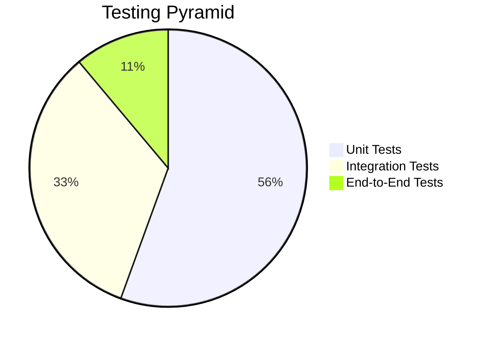

# Testing Strategy

## Overview

This document outlines the comprehensive testing strategy for Phase 1 of the Cortex Core system. It provides guidelines, frameworks, and practical approaches to ensure the system is thoroughly tested while maintaining a balance between test coverage and development velocity.

In Phase 1, testing is particularly critical as it establishes the foundation for the entire system. The testing approach prioritizes:

1. **End-to-end verification**: Ensuring complete workflows function correctly
2. **Component isolation**: Testing individual components in isolation
3. **Error handling**: Verifying the system handles errors gracefully
4. **Resource management**: Confirming resources are properly cleaned up
5. **Security boundaries**: Validating proper user data isolation

## Testing Pyramid

The testing strategy follows a modified testing pyramid approach:



This balanced approach ensures:

1. **Solid Foundation**: Comprehensive unit tests verify individual components
2. **System Integrity**: Integration tests verify component interactions
3. **User Flows**: End-to-end tests validate complete user journeys

## Test Categories

### Unit Tests

Unit tests focus on testing individual functions, classes, and modules in isolation.

**Primary Focus Areas**:

- Domain models and validation
- Utility functions
- Core business logic
- Individual API endpoint handlers (without dependencies)
- Event bus core functionality

**Key Characteristics**:

- Fast execution (milliseconds)
- No external dependencies
- High isolation
- Comprehensive coverage
- Targeted assertions

### Integration Tests

Integration tests verify that multiple components work together correctly.

**Primary Focus Areas**:

- API endpoints with authentication
- Event bus with subscribers
- Storage with model validation
- Multiple handlers in sequence

**Key Characteristics**:

- Medium execution speed (milliseconds to seconds)
- Limited external dependencies (may use in-memory databases)
- Focus on component interfaces
- Verify correct interaction patterns

### End-to-End Tests

End-to-end tests validate complete user flows from start to finish.

**Primary Focus Areas**:

- Input to output flow
- Authentication flow
- Workspace and conversation management
- Error scenarios and edge cases

**Key Characteristics**:

- Slower execution (seconds)
- Test entire system together
- Focus on user-facing behavior
- Validate complete workflows

## Testing Tools and Framework

### Primary Testing Tools

1. **pytest**: Core testing framework
2. **pytest-asyncio**: Testing async functionality
3. **pytest-cov**: Measuring test coverage
4. **httpx**: Testing HTTP endpoints
5. **FastAPI TestClient**: Testing FastAPI applications

### Testing Framework Setup

Create a robust testing setup with the following structure:

```
tests/
├── conftest.py                 # Shared test fixtures and configuration
├── unit/                       # Unit tests
│   ├── test_models.py          # Test data models
│   ├── test_auth.py            # Test authentication utilities
│   ├── test_event_bus.py       # Test event bus in isolation
│   └── test_storage.py         # Test in-memory storage
├── integration/                # Integration tests
│   ├── test_api_auth.py        # Test API with authentication
│   ├── test_api_input.py       # Test input endpoint
│   ├── test_api_output.py      # Test output endpoint
│   └── test_api_config.py      # Test configuration endpoints
└── e2e/                        # End-to-end tests
    ├── test_input_output.py    # Test input to output flow
    └── test_workspaces.py      # Test workspace management flow
```

### Key Test Fixture Setup

Create a comprehensive `conftest.py` with shared fixtures:

```python
import pytest
import asyncio
from fastapi.testclient import TestClient
from httpx import AsyncClient

from app.main import app
from app.utils.auth import create_access_token
from app.core.event_bus import EventBus
from app.core.storage import InMemoryStorage

# Application fixtures

@pytest.fixture
def test_app():
    """Return the FastAPI app for testing."""
    return app

@pytest.fixture
def client(test_app):
    """Return a TestClient for the FastAPI app."""
    return TestClient(test_app)

@pytest.fixture
async def async_client(test_app):
    """Return an AsyncClient for the FastAPI app."""
    async with AsyncClient(app=test_app, base_url="http://test") as client:
        yield client

# Authentication fixtures

@pytest.fixture
def test_user():
    """Return a test user."""
    return {
        "user_id": "test-user-id",
        "name": "Test User",
        "email": "test@example.com"
    }

@pytest.fixture
def auth_token(test_user):
    """Create a test authentication token."""
    return create_access_token({
        "sub": test_user["email"],
        "oid": test_user["user_id"],
        "name": test_user["name"],
        "email": test_user["email"]
    })

@pytest.fixture
def auth_headers(auth_token):
    """Return authorization headers with test token."""
    return {"Authorization": f"Bearer {auth_token}"}

# Core component fixtures

@pytest.fixture
def event_bus():
    """Return a clean instance of EventBus for testing."""
    bus = EventBus()
    yield bus
    # Clean up any subscriptions
    bus.subscribers.clear()

@pytest.fixture
def storage():
    """Return a clean instance of InMemoryStorage for testing."""
    return InMemoryStorage()

# Test data fixtures

@pytest.fixture
def test_workspace(test_user):
    """Return a test workspace."""
    return {
        "id": "test-workspace-id",
        "name": "Test Workspace",
        "description": "Test workspace description",
        "owner_id": test_user["user_id"],
        "metadata": {}
    }

@pytest.fixture
def test_conversation(test_workspace, test_user):
    """Return a test conversation."""
    return {
        "id": "test-conversation-id",
        "workspace_id": test_workspace["id"],
        "topic": "Test Conversation",
        "participant_ids": [test_user["user_id"]],
        "metadata": {}
    }

@pytest.fixture
def test_message(test_conversation, test_user):
    """Return a test message."""
    return {
        "id": "test-message-id",
        "conversation_id": test_conversation["id"],
        "sender_id": test_user["user_id"],
        "content": "Test message content",
        "timestamp": "2023-01-01T00:00:00Z",
        "metadata": {}
    }
```

## Unit Testing Approaches

### Testing Domain Models

```python
import pytest
from pydantic import ValidationError
from app.models.domain import User, Workspace, Conversation, Message

def test_user_model_validation():
    """Test User model validation."""
    # Valid user
    user = User(
        user_id="test-user-id",
        name="Test User",
        email="test@example.com"
    )
    assert user.user_id == "test-user-id"
    assert user.name == "Test User"
    assert user.email == "test@example.com"

    # Invalid email
    with pytest.raises(ValidationError):
        User(
            user_id="test-user-id",
            name="Test User",
            email="invalid-email"
        )

    # Missing required field
    with pytest.raises(ValidationError):
        User(
            user_id="test-user-id",
            name="Test User"
            # missing email
        )
```

### Testing Utility Functions

```python
import pytest
from datetime import datetime, timedelta
from jose import jwt
from app.utils.auth import create_access_token, get_current_user

def test_create_access_token():
    """Test JWT token creation."""
    # Test data
    test_data = {
        "sub": "test@example.com",
        "oid": "test-user-id",
        "name": "Test User",
        "email": "test@example.com"
    }

    # Create token
    token = create_access_token(test_data)

    # Verify token
    decoded = jwt.decode(
        token,
        "dev-secret-key-change-in-production",  # Test secret key
        algorithms=["HS256"]
    )

    # Check claims
    assert decoded["sub"] == test_data["sub"]
    assert decoded["oid"] == test_data["oid"]
    assert decoded["name"] == test_data["name"]
    assert decoded["email"] == test_data["email"]
    assert "exp" in decoded  # Should have expiration

    # Test custom expiration
    custom_expiry = timedelta(minutes=30)
    token = create_access_token(test_data, custom_expiry)
    decoded = jwt.decode(
        token,
        "dev-secret-key-change-in-production",
        algorithms=["HS256"]
    )

    # Verify expiration time is approximately 30 minutes from now
    exp_time = datetime.fromtimestamp(decoded["exp"])
    now = datetime.utcnow()
    assert abs((exp_time - now).total_seconds() - 1800) < 10  # Within 10 seconds of 30 minutes
```

### Testing Event Bus Core Functionality

```python
import pytest
import asyncio
from app.core.event_bus import EventBus

@pytest.mark.asyncio
async def test_event_bus_subscribe_unsubscribe():
    """Test EventBus subscribe and unsubscribe."""
    bus = EventBus()
    queue = asyncio.Queue()

    # Subscribe
    bus.subscribe(queue)
    assert queue in bus.subscribers

    # Unsubscribe
    bus.unsubscribe(queue)
    assert queue not in bus.subscribers

@pytest.mark.asyncio
async def test_event_bus_publish():
    """Test EventBus publish."""
    bus = EventBus()
    queue = asyncio.Queue()
    bus.subscribe(queue)

    # Test event
    test_event = {
        "type": "test",
        "data": {"message": "hello"},
        "user_id": "test-user",
        "timestamp": "2023-01-01T00:00:00Z"
    }

    # Publish event
    await bus.publish(test_event)

    # Get event from queue
    received = await asyncio.wait_for(queue.get(), timeout=1.0)

    # Verify event
    assert received == test_event

@pytest.mark.asyncio
async def test_event_bus_exception_handling():
    """Test EventBus handles exceptions during publish."""
    bus = EventBus()

    # Create a queue that raises an exception when put is called
    bad_queue = asyncio.Queue()
    original_put = bad_queue.put

    async def put_that_raises(*args, **kwargs):
        raise RuntimeError("Test exception")

    bad_queue.put = put_that_raises
    bus.subscribe(bad_queue)

    # Also add a normal queue
    good_queue = asyncio.Queue()
    bus.subscribe(good_queue)

    # Test event
    test_event = {
        "type": "test",
        "data": {"message": "hello"},
        "user_id": "test-user",
        "timestamp": "2023-01-01T00:00:00Z"
    }

    # Publish event - should not raise an exception
    await bus.publish(test_event)

    # Good queue should still receive the event
    received = await asyncio.wait_for(good_queue.get(), timeout=1.0)
    assert received == test_event

    # Restore original put method
    bad_queue.put = original_put
```

### Testing In-Memory Storage

```python
import pytest
from app.models.domain import User, Workspace, Conversation, Message
from app.core.storage import InMemoryStorage

def test_storage_user_operations():
    """Test user operations in InMemoryStorage."""
    storage = InMemoryStorage()

    # Create user
    user = User(
        user_id="test-user-id",
        name="Test User",
        email="test@example.com"
    )

    # Store user
    user_dict = storage.create_user(user)

    # Verify storage
    assert user.user_id in storage.users
    assert storage.users[user.user_id] == user_dict

    # Get user
    retrieved = storage.get_user(user.user_id)
    assert retrieved == user_dict

    # Get non-existent user
    assert storage.get_user("non-existent") is None

def test_storage_workspace_operations():
    """Test workspace operations in InMemoryStorage."""
    storage = InMemoryStorage()

    # Create workspace
    workspace = Workspace(
        id="test-workspace-id",
        name="Test Workspace",
        description="Test workspace description",
        owner_id="test-user-id"
    )

    # Store workspace
    workspace_dict = storage.create_workspace(workspace)

    # Verify storage
    assert workspace.id in storage.workspaces
    assert storage.workspaces[workspace.id] == workspace_dict

    # Get workspace
    retrieved = storage.get_workspace(workspace.id)
    assert retrieved == workspace_dict

    # List workspaces by owner
    workspaces = storage.list_workspaces(workspace.owner_id)
    assert len(workspaces) == 1
    assert workspaces[0] == workspace_dict

    # List workspaces for non-existent owner
    assert len(storage.list_workspaces("non-existent")) == 0
```

## Integration Testing Approaches

### Testing API with Authentication

```python
import pytest
from fastapi.testclient import TestClient
from app.main import app
from app.utils.auth import create_access_token

def test_protected_endpoint_with_valid_token():
    """Test a protected endpoint with a valid token."""
    client = TestClient(app)

    # Create a valid token
    token = create_access_token({
        "sub": "test@example.com",
        "oid": "test-user-id",
        "name": "Test User",
        "email": "test@example.com"
    })

    # Set auth header
    headers = {"Authorization": f"Bearer {token}"}

    # Call protected endpoint
    response = client.get("/auth/verify", headers=headers)

    # Verify response
    assert response.status_code == 200
    user_data = response.json()
    assert user_data["user_id"] == "test-user-id"
    assert user_data["name"] == "Test User"
    assert user_data["email"] == "test@example.com"

def test_protected_endpoint_with_invalid_token():
    """Test a protected endpoint with an invalid token."""
    client = TestClient(app)

    # Invalid token
    headers = {"Authorization": "Bearer invalid.token.here"}

    # Call protected endpoint
    response = client.get("/auth/verify", headers=headers)

    # Verify response
    assert response.status_code == 401
    assert "detail" in response.json()

def test_protected_endpoint_without_token():
    """Test a protected endpoint without a token."""
    client = TestClient(app)

    # Call protected endpoint without token
    response = client.get("/auth/verify")

    # Verify response
    assert response.status_code == 401
    assert "detail" in response.json()
```

### Testing Input Endpoint

```python
import pytest
from fastapi.testclient import TestClient
from app.main import app
from app.utils.auth import create_access_token
from app.core.storage import storage

def test_input_endpoint_success(auth_headers):
    """Test successful input endpoint request."""
    client = TestClient(app)

    # Test data
    input_data = {
        "content": "Test message",
        "conversation_id": "test-conversation-id",
        "metadata": {
            "client_id": "test-client",
            "client_version": "1.0.0"
        }
    }

    # Send request
    response = client.post("/input", json=input_data, headers=auth_headers)

    # Verify response
    assert response.status_code == 200
    data = response.json()
    assert data["status"] == "received"
    assert data["data"]["content"] == input_data["content"]
    assert data["data"]["conversation_id"] == input_data["conversation_id"]
    assert "timestamp" in data["data"]

    # Verify message was stored
    # Find message by content (simplified approach for testing)
    stored_messages = [
        msg for msg in storage.messages.values()
        if msg["content"] == input_data["content"]
    ]
    assert len(stored_messages) > 0
    stored_msg = stored_messages[0]
    assert stored_msg["conversation_id"] == input_data["conversation_id"]
    assert stored_msg["content"] == input_data["content"]
```

### Testing API Request Validation

```python
import pytest
from fastapi.testclient import TestClient
from app.main import app

def test_input_endpoint_validation(auth_headers):
    """Test input endpoint validation."""
    client = TestClient(app)

    # Missing required field
    response = client.post(
        "/input",
        json={"metadata": {}},  # Missing content
        headers=auth_headers
    )
    assert response.status_code == 422

    # Invalid field type
    response = client.post(
        "/input",
        json={"content": 123, "metadata": {}},  # content should be string
        headers=auth_headers
    )
    assert response.status_code == 422

    # Extra fields
    response = client.post(
        "/input",
        json={
            "content": "Test message",
            "metadata": {},
            "extra_field": "This should be allowed"  # Extra fields should be allowed
        },
        headers=auth_headers
    )
    assert response.status_code == 200  # Pydantic ignores extra fields by default
```

## End-to-End Testing Approaches

### Testing Input to Output Flow

Testing the complete flow from input to output is challenging due to the asynchronous nature of SSE. Here's a complete approach using `pytest-asyncio`:

```python
import pytest
import asyncio
import json
from httpx import AsyncClient

@pytest.mark.asyncio
async def test_input_to_output_flow(auth_token):
    """Test the complete flow from input to output."""
    headers = {"Authorization": f"Bearer {auth_token}"}

    # Create an async client that doesn't follow redirects
    async with AsyncClient(app=app, base_url="http://test", follow_redirects=False) as client:
        # Step 1: Start an SSE connection in background
        sse_task = asyncio.create_task(
            client.stream("GET", "/output/stream", headers=headers)
        )

        # Wait for connection to establish
        await asyncio.sleep(0.1)

        # Step 2: Send input
        input_data = {
            "content": f"Test message {asyncio.current_task().get_name()}",
            "metadata": {"test": True}
        }
        response = await client.post("/input", json=input_data, headers=headers)
        assert response.status_code == 200

        # Step 3: Collect and verify SSE events
        events = []
        try:
            # Get the stream response
            sse_response = await asyncio.wait_for(sse_task, timeout=0.5)

            # Read events for a short time (adjust timeout as needed)
            timeout = asyncio.create_task(asyncio.sleep(1))

            async for line in sse_response.aiter_lines():
                if timeout.done():
                    break

                if line.startswith("data: "):
                    # Parse SSE event
                    event_data = json.loads(line[6:])  # Skip "data: " prefix
                    events.append(event_data)

                    # If we see our input message, we're done
                    if (event_data.get("type") == "input" and
                        event_data.get("data", {}).get("content") == input_data["content"]):
                        break
        finally:
            # Clean up
            if not timeout.done():
                timeout.cancel()

            if not sse_response.is_closed:
                await sse_response.aclose()

        # Verify we got the expected events
        connection_events = [e for e in events if e.get("type") == "connection_established"]
        assert len(connection_events) > 0

        input_events = [
            e for e in events
            if e.get("type") == "input" and e.get("data", {}).get("content") == input_data["content"]
        ]
        assert len(input_events) > 0

        # Verify user_id filtering is applied
        assert all(
            e.get("user_id") == json.loads(auth_token.split('.')[1])["oid"]
            for e in events
            if "user_id" in e
        )
```

### Testing Workspace Management Flow

```python
import pytest
from fastapi.testclient import TestClient
from app.main import app

def test_workspace_management_flow(auth_headers):
    """Test the complete workspace and conversation management flow."""
    client = TestClient(app)

    # Step 1: Create a workspace
    workspace_data = {
        "name": "Test Flow Workspace",
        "description": "A workspace for testing the complete flow",
        "metadata": {"test": True}
    }

    response = client.post("/config/workspace", json=workspace_data, headers=auth_headers)
    assert response.status_code == 200
    workspace = response.json()["workspace"]
    workspace_id = workspace["id"]

    # Step 2: Verify workspace was created
    response = client.get("/config/workspace", headers=auth_headers)
    assert response.status_code == 200
    workspaces = response.json()["workspaces"]
    assert any(w["id"] == workspace_id for w in workspaces)

    # Step 3: Create a conversation in the workspace
    conversation_data = {
        "workspace_id": workspace_id,
        "topic": "Test Flow Conversation",
        "metadata": {"test": True}
    }

    response = client.post("/config/conversation", json=conversation_data, headers=auth_headers)
    assert response.status_code == 200
    conversation = response.json()["conversation"]
    conversation_id = conversation["id"]

    # Step 4: Verify conversation was created
    response = client.get(f"/config/conversation?workspace_id={workspace_id}", headers=auth_headers)
    assert response.status_code == 200
    conversations = response.json()["conversations"]
    assert any(c["id"] == conversation_id for c in conversations)

    # Step 5: Send a message to the conversation
    message_data = {
        "content": "Test message in flow",
        "conversation_id": conversation_id,
        "metadata": {"test": True}
    }

    response = client.post("/input", json=message_data, headers=auth_headers)
    assert response.status_code == 200
    assert response.json()["data"]["conversation_id"] == conversation_id
```

## Testing for Security and Data Isolation

### Testing User Data Partitioning

```python
import pytest
from fastapi.testclient import TestClient
from app.main import app
from app.utils.auth import create_access_token

def test_data_isolation_workspaces():
    """Test that users can only see their own workspaces."""
    client = TestClient(app)

    # Create tokens for two different users
    user1_token = create_access_token({
        "sub": "user1@example.com",
        "oid": "user-1",
        "name": "User One",
        "email": "user1@example.com"
    })

    user2_token = create_access_token({
        "sub": "user2@example.com",
        "oid": "user-2",
        "name": "User Two",
        "email": "user2@example.com"
    })

    user1_headers = {"Authorization": f"Bearer {user1_token}"}
    user2_headers = {"Authorization": f"Bearer {user2_token}"}

    # Step 1: User 1 creates a workspace
    workspace_data = {
        "name": "User 1 Workspace",
        "description": "Workspace owned by User 1",
        "metadata": {}
    }

    response = client.post("/config/workspace", json=workspace_data, headers=user1_headers)
    assert response.status_code == 200
    workspace = response.json()["workspace"]

    # Step 2: User 1 can see their workspace
    response = client.get("/config/workspace", headers=user1_headers)
    assert response.status_code == 200
    workspaces = response.json()["workspaces"]
    assert any(w["id"] == workspace["id"] for w in workspaces)

    # Step 3: User 2 cannot see User 1's workspace
    response = client.get("/config/workspace", headers=user2_headers)
    assert response.status_code == 200
    workspaces = response.json()["workspaces"]
    assert not any(w["id"] == workspace["id"] for w in workspaces)
```

### Testing Access Control

```python
import pytest
from fastapi.testclient import TestClient
from app.main import app
from app.utils.auth import create_access_token

def test_conversation_access_control():
    """Test that only participants can access conversations."""
    client = TestClient(app)

    # Create tokens for two different users
    user1_token = create_access_token({
        "sub": "user1@example.com",
        "oid": "user-1",
        "name": "User One",
        "email": "user1@example.com"
    })

    user2_token = create_access_token({
        "sub": "user2@example.com",
        "oid": "user-2",
        "name": "User Two",
        "email": "user2@example.com"
    })

    user1_headers = {"Authorization": f"Bearer {user1_token}"}
    user2_headers = {"Authorization": f"Bearer {user2_token}"}

    # Step 1: User 1 creates a workspace
    workspace_data = {
        "name": "Access Control Test",
        "description": "Testing workspace",
        "metadata": {}
    }

    response = client.post("/config/workspace", json=workspace_data, headers=user1_headers)
    assert response.status_code == 200
    workspace = response.json()["workspace"]

    # Step 2: User 1 creates a conversation with only themselves as participant
    conversation_data = {
        "workspace_id": workspace["id"],
        "topic": "Private Conversation",
        "participant_ids": ["user-1"],
        "metadata": {}
    }

    response = client.post("/config/conversation", json=conversation_data, headers=user1_headers)
    assert response.status_code == 200
    conversation = response.json()["conversation"]

    # Step 3: User 2 tries to access the conversation - should be forbidden
    response = client.get(f"/config/conversation?workspace_id={workspace['id']}", headers=user2_headers)
    assert response.status_code == 403  # Access denied
```

## Testing Error Handling

### Testing Endpoint Error Responses

```python
import pytest
from fastapi.testclient import TestClient
from app.main import app

def test_error_handling_invalid_input(auth_headers):
    """Test error handling for invalid input."""
    client = TestClient(app)

    # Test invalid JSON
    response = client.post(
        "/input",
        content="not-json",
        headers={**auth_headers, "Content-Type": "application/json"}
    )
    assert response.status_code == 422

    # Test missing required field
    response = client.post(
        "/input",
        json={"metadata": {}},  # Missing content
        headers=auth_headers
    )
    assert response.status_code == 422

    # Test invalid conversation
    response = client.get(
        "/config/conversation?workspace_id=non-existent",
        headers=auth_headers
    )
    assert response.status_code in [403, 404]  # Either forbidden or not found
```

### Testing Exception Handling

```python
import pytest
from unittest.mock import patch
from fastapi.testclient import TestClient
from app.main import app

def test_internal_server_error_handling(auth_headers):
    """Test handling of internal server errors."""
    client = TestClient(app)

    # Use a patch to force an internal error
    with patch("app.core.storage.storage.get_workspace", side_effect=Exception("Test exception")):
        response = client.get(
            "/config/conversation?workspace_id=any-id",
            headers=auth_headers
        )

        # Should return 500 Internal Server Error
        assert response.status_code == 500
        assert "detail" in response.json()
```

## Testing Asyncio Components

### Testing Resource Cleanup

```python
import pytest
import asyncio
import gc
import weakref
from app.core.event_bus import EventBus

@pytest.mark.asyncio
async def test_event_bus_resource_cleanup():
    """Test that EventBus properly cleans up resources."""
    bus = EventBus()

    # Create and track references to 10 queues
    queues = []
    queue_refs = []

    for _ in range(10):
        queue = asyncio.Queue()
        queues.append(queue)
        queue_refs.append(weakref.ref(queue))
        bus.subscribe(queue)

    # Verify all queues are subscribed
    assert len(bus.subscribers) == 10

    # Unsubscribe all queues
    for queue in queues:
        bus.unsubscribe(queue)

    # Clear strong references to queues
    queues.clear()

    # Force garbage collection
    gc.collect()

    # Check weak references to see if objects were garbage collected
    live_queues = sum(1 for ref in queue_refs if ref() is not None)
    assert live_queues == 0, f"{live_queues} queues were not garbage collected"
```

### Testing Cancellation Handling

```python
import pytest
import asyncio
from app.core.event_bus import EventBus

@pytest.mark.asyncio
async def test_event_bus_task_cancellation():
    """Test EventBus handles task cancellations properly."""
    bus = EventBus()
    queue = asyncio.Queue()
    bus.subscribe(queue)

    # Create a background task
    async def background_task():
        try:
            while True:
                await asyncio.sleep(0.1)
        except asyncio.CancelledError:
            # Should properly clean up
            raise

    task = bus.create_background_task(background_task())

    # Verify task is in active_tasks
    assert task in bus._active_tasks

    # Cancel task
    task.cancel()

    # Wait for task to complete (should not hang)
    with pytest.raises(asyncio.CancelledError):
        await task

    # Verify task was removed from active_tasks
    assert task not in bus._active_tasks
```

## Testing for Performance

While detailed performance testing is not a priority for Phase 1, basic performance checks can ensure the system behaves well under expected loads.

```python
import pytest
import time
import asyncio
from fastapi.testclient import TestClient
from app.main import app

def test_input_endpoint_performance(auth_headers):
    """Test input endpoint performance for multiple requests."""
    client = TestClient(app)

    # Testing: 100 requests should complete in under 2 seconds
    start_time = time.time()

    for i in range(100):
        input_data = {
            "content": f"Test message {i}",
            "metadata": {"test": True}
        }

        response = client.post("/input", json=input_data, headers=auth_headers)
        assert response.status_code == 200

    end_time = time.time()
    elapsed = end_time - start_time

    # For Phase 1, 100 requests should take well under 2 seconds
    assert elapsed < 2.0, f"Performance test failed: {elapsed:.2f} seconds for 100 requests"
```

## Testing with Mocks and Stubs

### Mocking Storage

```python
import pytest
from unittest.mock import patch, MagicMock
from fastapi.testclient import TestClient
from app.main import app

def test_api_with_mocked_storage(auth_headers):
    """Test API using a mocked storage."""
    client = TestClient(app)

    # Create mock workspace
    mock_workspace = {
        "id": "mock-workspace-id",
        "name": "Mocked Workspace",
        "description": "A mocked workspace",
        "owner_id": "test-user-id",
        "metadata": {}
    }

    # Mock storage.list_workspaces to return our mock workspace
    with patch("app.core.storage.storage.list_workspaces") as mock_list:
        mock_list.return_value = [mock_workspace]

        # Call the API
        response = client.get("/config/workspace", headers=auth_headers)

        # Verify response
        assert response.status_code == 200
        data = response.json()
        assert len(data["workspaces"]) == 1
        assert data["workspaces"][0]["id"] == "mock-workspace-id"

        # Verify mock was called with correct user_id
        mock_list.assert_called_once()
        assert mock_list.call_args[0][0] == "test-user-id"
```

### Testing with Dependency Overrides

```python
import pytest
from unittest.mock import MagicMock
from fastapi.testclient import TestClient
from app.main import app
from app.utils.auth import get_current_user

def test_api_with_dependency_override():
    """Test API using FastAPI dependency overrides."""
    client = TestClient(app)

    # Create a mock user
    mock_user = {
        "user_id": "override-user",
        "name": "Override User",
        "email": "override@example.com"
    }

    # Override the get_current_user dependency
    async def override_get_current_user():
        return mock_user

    app.dependency_overrides[get_current_user] = override_get_current_user

    try:
        # Call a protected endpoint - no auth header needed now
        response = client.get("/auth/verify")

        # Verify response
        assert response.status_code == 200
        assert response.json()["user_id"] == "override-user"
    finally:
        # Remove the override
        app.dependency_overrides.clear()
```

## Test Coverage Analysis

### Coverage Configuration

Create a `.coveragerc` file:

```ini
[run]
source = app
omit =
    */tests/*
    */venv/*
    */__pycache__/*
    */migrations/*

[report]
exclude_lines =
    pragma: no cover
    def __repr__
    raise NotImplementedError
    if __name__ == .__main__.:
    pass
    raise ImportError
```

### Running Tests with Coverage

```bash
# Run tests with coverage
python -m pytest --cov=app

# Generate HTML report
python -m pytest --cov=app --cov-report=html
```

### Coverage Targets

For Phase 1, the following coverage targets are recommended:

- **Unit Test Coverage**: 80% or higher
- **Integration Test Coverage**: 70% or higher
- **End-to-End Coverage**: 60% or higher
- **Overall Coverage**: 75% or higher

Coverage should focus on critical paths and error handling, not just line coverage.

## Test-Driven Development Approach

For Phase 1, a modified TDD approach is recommended:

1. **Write Minimal Tests First**: Start with basic tests covering essential functionality
2. **Implement Features**: Develop features to pass the tests
3. **Enhance Tests**: Add more comprehensive tests covering edge cases
4. **Refine Implementation**: Improve implementation to address edge cases
5. **Add Integration Tests**: Verify components work together correctly
6. **End-to-End Validation**: Ensure complete workflow functions properly

This approach balances the benefits of TDD with the need for rapid initial development.

## Continuous Integration Setup

### Basic CI Configuration (GitHub Actions)

```yaml
# .github/workflows/test.yml
name: Tests

on:
  push:
    branches: [main]
  pull_request:
    branches: [main]

jobs:
  test:
    runs-on: ubuntu-latest

    steps:
      - uses: actions/checkout@v2

      - name: Set up Python
        uses: actions/setup-python@v2
        with:
          python-version: 3.10

      - name: Install dependencies
        run: |
          python -m pip install --upgrade pip
          pip install -r requirements.txt
          pip install pytest pytest-asyncio pytest-cov

      - name: Run tests
        run: |
          python -m pytest --cov=app --cov-report=xml

      - name: Upload coverage
        uses: codecov/codecov-action@v2
        with:
          file: ./coverage.xml
          fail_ci_if_error: false
```

## Testing During Development

### Red-Green-Refactor Cycle

1. **Red**: Write tests that fail
2. **Green**: Implement code to make tests pass
3. **Refactor**: Improve code while keeping tests passing

### Running Tests During Development

```bash
# Run all tests
python -m pytest

# Run specific test file
python -m pytest tests/unit/test_event_bus.py

# Run specific test function
python -m pytest tests/unit/test_event_bus.py::test_event_bus_publish

# Run with output
python -m pytest -v

# Run with output and stop on first failure
python -m pytest -vxs
```

### Test Watch Mode

For continuous test execution during development, use pytest-watch:

```bash
pip install pytest-watch
ptw
```

## Test Documentation Standards

Each test should:

1. **Have a clear docstring** explaining what is being tested
2. **Follow a consistent naming convention**: `test_[component]_[function]_[scenario]`
3. **Use descriptive variable names** that explain their purpose
4. **Include clear assertions** with messages explaining failures
5. **Use comments** to explain complex test logic

Example:

```python
def test_event_bus_publish_to_multiple_subscribers():
    """
    Test that the EventBus correctly publishes events to multiple subscribers.
    Verifies that each subscribed queue receives the event independently.
    """
    # Setup test environment
    bus = EventBus()
    queue1 = asyncio.Queue()
    queue2 = asyncio.Queue()

    # Subscribe both queues
    bus.subscribe(queue1)
    bus.subscribe(queue2)

    # Create test event
    test_event = {
        "type": "test",
        "data": {"message": "hello"},
        "user_id": "test-user",
        "timestamp": "2023-01-01T00:00:00Z"
    }

    # Publish the event
    await bus.publish(test_event)

    # Verify both queues received the event
    received1 = await asyncio.wait_for(queue1.get(), timeout=1.0)
    received2 = await asyncio.wait_for(queue2.get(), timeout=1.0)

    assert received1 == test_event, "Queue 1 did not receive the correct event"
    assert received2 == test_event, "Queue 2 did not receive the correct event"
    assert queue1.empty(), "Queue 1 received extra events"
    assert queue2.empty(), "Queue 2 received extra events"
```

## Test Maintenance

### Signs of Test Debt

1. **Brittle tests**: Tests that break with minor code changes
2. **Slow tests**: Tests that take too long to execute
3. **Overlapping tests**: Multiple tests covering the same functionality
4. **Complex test setup**: Tests with excessive setup requirements
5. **Limited assertions**: Tests that don't verify important behavior

### Test Refactoring Strategies

1. **Extract test fixtures**: Move common setup to fixtures
2. **Improve test isolation**: Ensure tests don't affect each other
3. **Separate slow tests**: Mark long-running tests for separate execution
4. **Consolidate overlapping tests**: Combine redundant tests
5. **Enhance assert messages**: Add clear explanations for failures

## Conclusion

The testing strategy for Phase 1 of the Cortex Core system balances thorough testing with development velocity. By focusing on the right mix of unit, integration, and end-to-end tests, it ensures the system functions correctly while maintaining code quality.

Key takeaways:

1. **Comprehensive Test Coverage**: Test all critical components and user flows
2. **Asyncio Testing**: Special attention to testing asynchronous code
3. **Security Validation**: Verify user data isolation and access control
4. **Resource Management**: Confirm proper cleanup of resources
5. **Performance Basics**: Ensure acceptable performance under expected loads

Implementing this testing strategy will create a solid foundation for future phases while enabling confident iteration on the current implementation.
