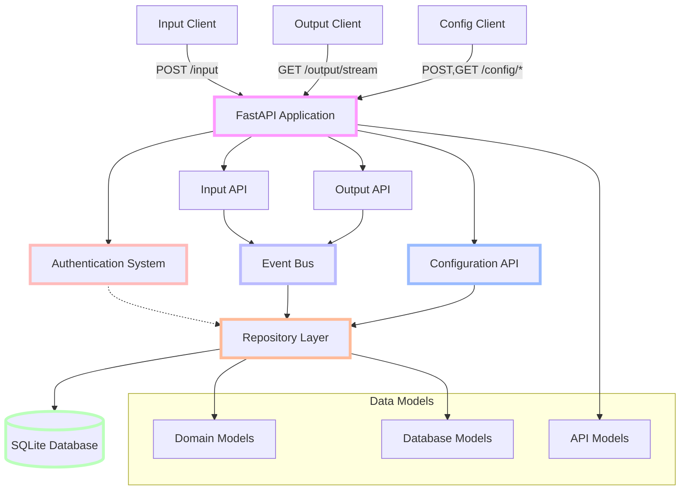

# Cortex Core Phase 2: Configuration API & Basic Persistence

## Project Overview

Building on the functional input/output system established in Phase 1, Phase 2 adds workspace/conversation management capabilities and introduces basic persistence with SQLite. This phase maintains the core simplicity while providing essential organization and data durability to support more realistic client applications.

Phase 2 enhances the system by adding configuration endpoints for workspace and conversation management, implementing a simple file-based persistence layer, improving error handling, and extending the authentication system. These additions enable client developers to build more sophisticated applications with persistent data while maintaining backward compatibility with Phase 1 functionality.

## Goals of Phase 2

1. **Add Configuration Endpoints**: Create endpoints for workspace and conversation management
2. **Implement Basic Persistence**: Replace in-memory storage with SQLite for simple durability
3. **Enhance Error Handling**: Implement consistent error handling across all endpoints
4. **Improve Authentication**: Extend the authentication system with enhanced validation
5. **Maintain Backward Compatibility**: Ensure existing Phase 1 clients continue to work
6. **Enable More Realistic Applications**: Support multi-conversation workflows with persistence

## System Architecture - Phase 2



### Phase 2 Components

1. **Configuration API** (New)

   - `/config/workspace` endpoints for workspace management
   - `/config/conversation` endpoints for conversation management
   - Validation for configuration requests
   - Pagination for list endpoints
   - User-based access control

2. **Repository Layer** (New)

   - Abstraction for data access operations
   - SQLite-specific implementations
   - Transaction management
   - Domain model mapping

3. **SQLite Database** (New)

   - File-based persistence
   - Simple schema with essential tables
   - Single database file for development simplicity
   - Transaction support

4. **Enhanced Error Handling** (Improved)

   - Consistent error response format
   - Detailed error messages
   - Proper HTTP status codes
   - Validation error handling

5. **FastAPI Application** (Existing)

   - Extended with configuration endpoints
   - Enhanced middleware
   - Improved exception handling

6. **Input API** (Existing)

   - Updated to use repository layer
   - Maintained backward compatibility

7. **Output API** (Existing)

   - Updated to use repository layer
   - Maintained backward compatibility

8. **Event Bus** (Existing)

   - Maintained as-is from Phase 1
   - Possible minor enhancements for reliability

9. **Authentication System** (Existing)
   - Enhanced validation
   - Maintained backward compatibility
   - Improved error messages

## What's Included in Phase 2

- ✅ Complete workspace management endpoints (create, list, update, delete)
- ✅ Complete conversation management endpoints (create, list, update, delete)
- ✅ SQLite persistence for all data models
- ✅ Repository pattern implementation
- ✅ Enhanced error handling and validation
- ✅ Basic pagination for list endpoints
- ✅ Transaction management for data consistency
- ✅ Database initialization and schema management
- ✅ Updated tests for persistence and configuration
- ✅ In-memory SQLite for testing
- ✅ Basic user access control for resources

## What's Explicitly NOT Included in Phase 2

- ❌ Advanced database features (complex joins, triggers, etc.)
- ❌ PostgreSQL implementation (reserved for Phase 5)
- ❌ Complex permissions or role-based access control
- ❌ Advanced pagination or filtering
- ❌ Database migration framework
- ❌ Azure B2C integration (reserved for Phase 5)
- ❌ MCP (Model Context Protocol) implementation (reserved for Phase 3)
- ❌ Complex data transformation or views
- ❌ Caching layer
- ❌ Multi-database support

## Success Criteria for Phase 2

Phase 2 is considered successfully completed when:

1. A user can create, list, update, and delete workspaces
2. A user can create, list, update, and delete conversations within workspaces
3. All data persists between application restarts
4. Phase 1 clients continue to work without modification
5. Users can only access their own workspaces and conversations
6. Error handling is consistent and informative
7. All tests pass with the SQLite implementation
8. The system maintains data integrity across operations

## Key Implementation Principles for Phase 2

1. **Simplicity Over Sophistication**: Keep the database schema as simple as possible
2. **File-Based Simplicity**: Use a single SQLite file for straightforward development
3. **Direct Repository Implementation**: Implement repositories without unnecessary abstraction layers
4. **Start Minimal**: Begin with essential tables and relationships only
5. **Pragmatic Storage**: Use TEXT/JSON fields where appropriate to avoid excessive normalization
6. **Clear Boundaries**: Maintain separation between database models and domain models
7. **User Partitioning**: Continue strict data partitioning by user ID
8. **Transaction Safety**: Use transactions appropriately for data consistency
9. **Testability**: Ensure all components remain easily testable
10. **Future-Ready Simplicity**: Design with future PostgreSQL migration in mind but without over-engineering

## Phase 2 Data Flow

1. **Workspace Management Flow**:

   ```
   Client → POST/GET/PUT/DELETE /config/workspace + JWT →
   Configuration API → Repository Layer → SQLite Database
   ```

2. **Conversation Management Flow**:

   ```
   Client → POST/GET/PUT/DELETE /config/conversation + JWT →
   Configuration API → Repository Layer → SQLite Database
   ```

3. **Updated Input Flow**:

   ```
   Client → POST /input + JWT → Input API → Event Bus →
   Repository Layer → SQLite Database
   ```

4. **Updated Output Flow**:
   ```
   Client → GET /output/stream + JWT → Output API → SSE Connection →
   Event Bus Subscription → Repository Layer → Filtered Events → Client
   ```

## Critical Implementation Details

### Repository Pattern Implementation

The repository pattern provides a clean separation between the data access logic and the business logic, while simplifying the future migration to PostgreSQL in Phase 5.

Key details:

- Each entity type (User, Workspace, Conversation, Message) has its own repository
- Repositories handle all CRUD operations for their entity type
- Domain models (Pydantic) are used for business logic
- Database models (SQLAlchemy) are used for persistence
- Repositories handle the mapping between domain and database models

**Repository Interface Example**:

```python
class WorkspaceRepository:
    """Repository for workspace operations."""

    async def create(self, workspace: Workspace) -> Workspace:
        """Create a new workspace."""
        pass

    async def get_by_id(self, workspace_id: str, owner_id: str) -> Optional[Workspace]:
        """Get workspace by ID for a specific owner."""
        pass

    async def list_by_owner(self, owner_id: str,
                            limit: int = 100, offset: int = 0) -> List[Workspace]:
        """List workspaces for a specific owner."""
        pass

    async def update(self, workspace: Workspace) -> Workspace:
        """Update an existing workspace."""
        pass

    async def delete(self, workspace_id: str, owner_id: str) -> bool:
        """Delete a workspace."""
        pass
```

Repositories should be implemented directly with minimal abstraction layers, focusing on the practical needs of the current phase.

### SQLite Implementation

SQLite provides a simple, file-based persistence solution that requires minimal setup while offering most features needed for this phase.

Key details:

- Single database file for simplicity (`cortex.db`)
- SQLAlchemy for ORM capabilities
- Async support with `sqlalchemy.ext.asyncio`
- Connection pooling for efficiency
- Transaction support for data consistency
- Simple schema focused on current needs

**Database Models Example**:

```python
from sqlalchemy import Column, String, ForeignKey, Table, MetaData
from sqlalchemy.ext.declarative import declarative_base

Base = declarative_base()

class User(Base):
    __tablename__ = "users"

    user_id = Column(String, primary_key=True)
    name = Column(String, nullable=False)
    email = Column(String, nullable=False, unique=True)
    # Store metadata as JSON string
    metadata = Column(String, default="{}")

class Workspace(Base):
    __tablename__ = "workspaces"

    id = Column(String, primary_key=True)
    name = Column(String, nullable=False)
    description = Column(String, nullable=False)
    owner_id = Column(String, ForeignKey("users.user_id"), nullable=False)
    # Store metadata as JSON string
    metadata = Column(String, default="{}")
```

The schema should focus on essential fields and relationships, using TEXT fields for JSON data where appropriate to avoid over-normalization in this phase.

### Configuration API

The Configuration API provides endpoints for managing workspaces and conversations, enabling client applications to organize messages into appropriate contexts.

Key details:

- RESTful endpoint design
- Consistent naming conventions
- Proper validation with detailed error messages
- User-based access control (users only access their own resources)
- Basic pagination for list endpoints

**Workspace Endpoints**:

- `POST /config/workspace`: Create a new workspace
- `GET /config/workspace`: List workspaces for current user
- `GET /config/workspace/{id}`: Get a specific workspace
- `PUT /config/workspace/{id}`: Update a workspace
- `DELETE /config/workspace/{id}`: Delete a workspace

**Conversation Endpoints**:

- `POST /config/conversation`: Create a new conversation
- `GET /config/conversation?workspace_id={id}`: List conversations in a workspace
- `GET /config/conversation/{id}`: Get a specific conversation
- `PUT /config/conversation/{id}`: Update a conversation
- `DELETE /config/conversation/{id}`: Delete a conversation

### Error Handling Enhancements

Phase 2 introduces a more consistent and detailed error handling approach to provide better feedback to client applications.

Key details:

- Consistent error response format across all endpoints
- Appropriate HTTP status codes for different error conditions
- Detailed validation error messages
- Error codes for programmatic handling by clients

**Standard Error Response Format**:

```json
{
  "error": {
    "code": "validation_error",
    "message": "Invalid workspace data",
    "details": {
      "name": "Field is required"
    }
  }
}
```

Common error codes include:

- `validation_error`: Request data validation failed
- `not_found`: Resource not found
- `unauthorized`: Authentication failed
- `forbidden`: Permission denied
- `conflict`: Resource already exists
- `database_error`: Database operation failed
- `internal_error`: Server error

## Integration with Client Applications

Phase 2 maintains backward compatibility with Phase 1 clients while enabling new capabilities for configuration clients.

### For Configuration Client Developers

1. **Authentication**:

   - Obtain a JWT token via POST to `/auth/login`
   - Include the token in all requests as `Authorization: Bearer {token}`

2. **Workspace Management**:

   - Create: POST to `/config/workspace`
   - List: GET to `/config/workspace`
   - Get: GET to `/config/workspace/{id}`
   - Update: PUT to `/config/workspace/{id}`
   - Delete: DELETE to `/config/workspace/{id}`

3. **Conversation Management**:

   - Create: POST to `/config/conversation`
   - List: GET to `/config/conversation?workspace_id={id}`
   - Get: GET to `/config/conversation/{id}`
   - Update: PUT to `/config/conversation/{id}`
   - Delete: DELETE to `/config/conversation/{id}`

4. **Request/Response Formats**:

   **Create Workspace Request**:

   ```json
   {
     "name": "Project X",
     "description": "Workspace for Project X development",
     "metadata": {
       "icon": "project",
       "color": "#4287f5"
     }
   }
   ```

   **Create Workspace Response**:

   ```json
   {
     "status": "workspace created",
     "workspace": {
       "id": "650e8400-e29b-41d4-a716-446655440111",
       "name": "Project X",
       "description": "Workspace for Project X development",
       "owner_id": "550e8400-e29b-41d4-a716-446655440000",
       "metadata": {
         "icon": "project",
         "color": "#4287f5"
       }
     }
   }
   ```

   **Create Conversation Request**:

   ```json
   {
     "workspace_id": "650e8400-e29b-41d4-a716-446655440111",
     "topic": "Backend Development",
     "participant_ids": ["550e8400-e29b-41d4-a716-446655440000"],
     "metadata": {
       "icon": "code",
       "priority": "high"
     }
   }
   ```

   **List Workspaces Response**:

   ```json
   {
     "workspaces": [
       {
         "id": "650e8400-e29b-41d4-a716-446655440111",
         "name": "Project X",
         "description": "Workspace for Project X development",
         "owner_id": "550e8400-e29b-41d4-a716-446655440000",
         "metadata": {
           "icon": "project",
           "color": "#4287f5"
         }
       }
     ],
     "total": 1
   }
   ```

Client developers should be directed to the `CONFIG_API_SPECIFICATION.md` document for more detailed examples and code snippets.

## Common Pitfalls and Challenges

Be aware of these common implementation challenges specific to Phase 2:

1. **SQLite Concurrency Limitations**:

   - SQLite has limited concurrency support
   - Use proper connection pooling
   - Be aware of "database is locked" errors
   - Keep transactions short and focused

2. **Repository Pattern Mistakes**:

   - Leaking database models to business logic
   - Not handling database errors properly
   - Missing transaction management
   - Improper mapping between domain and database models

3. **JSON Handling in SQLite**:

   - SQLite stores JSON as TEXT
   - Proper serialization/deserialization is required
   - Validation of JSON structure before storage
   - Handling empty or null JSON values

4. **Pagination Implementation**:

   - Inefficient pagination with large datasets
   - Missing limit/offset validation
   - Inconsistent pagination parameters
   - Not returning total count for UIs

5. **SQLAlchemy Async Usage**:

   - Mixing sync and async operations
   - Not closing connections properly
   - Missing proper exception handling
   - Using blocking operations in async code

6. **Data Migration Challenges**:
   - Missing schema initialization on first run
   - Handling existing in-memory data during transition
   - Ensuring data consistency during migration
   - Backward compatibility with existing clients

## Validating Your Implementation

To ensure your Phase 2 implementation is correct:

1. **Configuration API Testing**:

   - Create, retrieve, update, and delete workspaces
   - Create, retrieve, update, and delete conversations
   - Test pagination with different limits
   - Verify error responses for invalid inputs
   - Test access control (users can only access their own resources)

2. **Persistence Testing**:

   - Restart the application and verify data persists
   - Test concurrent operations on the database
   - Verify transaction rollback on errors
   - Test with larger datasets to ensure performance

3. **Backward Compatibility Testing**:

   - Verify Phase 1 clients still work without modification
   - Test input/output flow with the new persistence layer
   - Ensure event delivery works as before
   - Verify user partitioning is maintained

4. **Error Handling Testing**:
   - Test validation errors with invalid inputs
   - Test not found errors with non-existent resources
   - Test permission errors with unauthorized access attempts
   - Verify consistent error response format across endpoints
   - Test database error handling

## Phase 2 in the Overall Project Timeline

Phase 2 builds on Phase 1 and sets the foundation for future phases:

1. Phase 1: Functional Input/Output System with In-Memory Storage
2. **Phase 2: Configuration API & Basic Persistence** (current phase)
3. Phase 3: MCP Protocol and Service Architecture
4. Phase 4: Distributed Services
5. Phase 5: Production Hardening

## Developer Environment

Phase 2 requires the following additions to the Phase 1 environment:

- SQLAlchemy 2.0.0+
- aiosqlite 0.17.0+
- alembic 1.8.0+ (optional, for migrations)

Additional environment variables:

```
# Database configuration
DATABASE_URL=sqlite:///./cortex.db
```

## Implementation Approach

The recommended implementation sequence for Phase 2 is:

1. **Database Setup**

   - Configure SQLAlchemy
   - Create database models
   - Implement connection management
   - Set up schema initialization

2. **Repository Layer**

   - Create base repository interface
   - Implement entity-specific repositories
   - Add transaction support
   - Implement domain model mapping

3. **Update Existing Components**

   - Modify input API to use repositories
   - Update output API for repository integration
   - Adapt event bus to work with persistence
   - Maintain backward compatibility

4. **Configuration API**

   - Implement workspace endpoints
   - Create conversation endpoints
   - Add validation and error handling
   - Implement access control

5. **Error Handling Enhancements**

   - Create consistent error response format
   - Implement validation error handling
   - Add database error handling
   - Update API error responses

6. **Data Migration**

   - Create migration strategy from in-memory
   - Implement one-time migration logic
   - Test data consistency after migration

7. **Testing**

   - Update existing tests for persistence
   - Add configuration API tests
   - Test error handling scenarios
   - Verify backward compatibility

8. **Documentation**
   - Update API documentation
   - Document database schema
   - Create configuration API examples
   - Document error responses

At each step, verify that the implementation works as expected before moving on, maintaining the incremental approach established in Phase 1.

## Conclusion

Phase 2 takes the functional core established in Phase 1 and adds essential organization and persistence capabilities. By implementing a configuration API and SQLite storage, the system now supports more realistic applications with persistent data across restarts.

The focus remains on ruthless simplicity and pragmatic implementation, keeping the database schema straightforward and avoiding unnecessary complexity. This approach enables client developers to build more sophisticated applications while maintaining the clean architecture established in Phase 1.

The subsequent documentation will provide detailed specifications for the repository pattern, SQLite implementation, configuration API endpoints, and data model enhancements.
