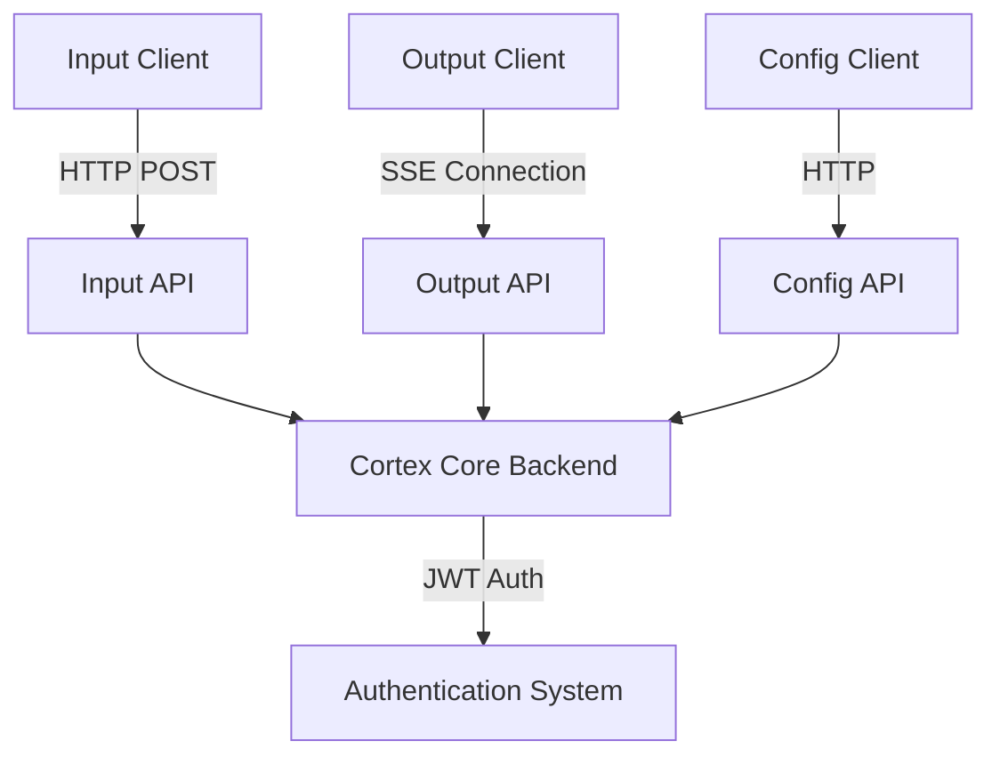
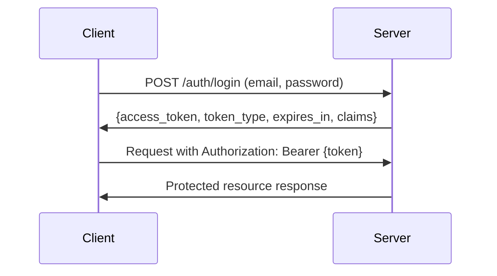

# Client Integration Guide

## Overview

This document provides a comprehensive guide for developing client applications that integrate with the Cortex Core system in Phase 3. It covers all aspects of client development including authentication, sending input, receiving output, managing workspaces/conversations, and handling errors.

Cortex Core uses a REST API with Server-Sent Events (SSE) for real-time updates, providing a straightforward integration path for various client types. This guide includes detailed examples in JavaScript/TypeScript and Python to help you quickly develop clients that work seamlessly with the system.

## Client Types

The Cortex Core system supports three primary client types:

1. **Input Clients**: Send user input to the system (text, commands, data)
2. **Output Clients**: Receive system responses via Server-Sent Events (SSE)
3. **Configuration Clients**: Manage workspaces, conversations, and settings

A complete client application typically implements all three types, but you can also create specialized clients that focus on specific functionality.

## System Architecture Overview

From a client perspective, the Cortex Core architecture looks like this:



The client interacts with these main endpoints:

- **Authentication**: `/auth/login` and `/auth/verify`
- **Input**: `/input`
- **Output**: `/output/stream`
- **Configuration**: `/config/workspace` and `/config/conversation`

## Authentication

### Authentication Flow

All clients must authenticate using JWT (JSON Web Tokens):



### Authentication in JavaScript/TypeScript

```typescript
// auth.ts
import axios from "axios";

// Base URL for all API calls
const API_BASE_URL = "http://localhost:8000";

// Store token in localStorage or memory (memory safer for SPA)
let authToken: string | null = null;
let tokenExpiry: number | null = null;

/**
 * Login to the Cortex Core API and obtain a JWT token
 */
export async function login(email: string, password: string): Promise<boolean> {
  try {
    // Create form data (API expects form data, not JSON)
    const formData = new URLSearchParams();
    formData.append("username", email); // Note: API expects 'username' field
    formData.append("password", password);

    const response = await axios.post(`${API_BASE_URL}/auth/login`, formData, {
      headers: {
        "Content-Type": "application/x-www-form-urlencoded",
      },
    });

    // Store token and expiry
    authToken = response.data.access_token;
    tokenExpiry = Date.now() + response.data.expires_in * 1000;

    return true;
  } catch (error) {
    console.error("Login failed:", error);
    return false;
  }
}

/**
 * Get the authentication header for API requests
 */
export function getAuthHeader(): { Authorization: string } | undefined {
  // Check if token exists and is not expired
  if (authToken && tokenExpiry && Date.now() < tokenExpiry) {
    return { Authorization: `Bearer ${authToken}` };
  }

  // Token is missing or expired
  return undefined;
}

/**
 * Verify if the current token is valid
 */
export async function verifyToken(): Promise<boolean> {
  // Check if we have a token
  const authHeader = getAuthHeader();
  if (!authHeader) {
    return false;
  }

  try {
    // Call verify endpoint
    const response = await axios.get(`${API_BASE_URL}/auth/verify`, {
      headers: authHeader,
    });

    // If we get here, token is valid
    return true;
  } catch (error) {
    // Token is invalid
    authToken = null;
    tokenExpiry = null;
    return false;
  }
}

/**
 * Logout by removing stored token
 */
export function logout(): void {
  authToken = null;
  tokenExpiry = null;
}
```

### Authentication in Python

```python
import requests
import time
from typing import Dict, Optional, Tuple

class CortexAuth:
    """Authentication helper for Cortex Core API."""

    def __init__(self, api_base_url: str = "http://localhost:8000"):
        """Initialize the auth helper."""
        self.api_base_url = api_base_url
        self.token = None
        self.token_expiry = None

    def login(self, email: str, password: str) -> bool:
        """
        Login to the Cortex Core API and obtain a JWT token.

        Args:
            email: User email
            password: User password

        Returns:
            True if login successful, False otherwise
        """
        try:
            # Create form data (API expects form data, not JSON)
            data = {
                'username': email,  # Note: API expects 'username' field
                'password': password
            }

            # Make login request
            response = requests.post(
                f"{self.api_base_url}/auth/login",
                data=data
            )

            # Check if request was successful
            response.raise_for_status()

            # Parse response
            auth_data = response.json()

            # Store token and expiry
            self.token = auth_data['access_token']
            self.token_expiry = time.time() + auth_data['expires_in']

            return True
        except Exception as e:
            print(f"Login failed: {e}")
            return False

    def get_auth_header(self) -> Optional[Dict[str, str]]:
        """
        Get the authentication header for API requests.

        Returns:
            Auth header dict if token is valid, None otherwise
        """
        # Check if token exists and is not expired
        if self.token and self.token_expiry and time.time() < self.token_expiry:
            return {'Authorization': f"Bearer {self.token}"}

        # Token is missing or expired
        return None

    async def verify_token(self) -> bool:
        """
        Verify if the current token is valid.

        Returns:
            True if token is valid, False otherwise
        """
        # Check if we have a token
        auth_header = self.get_auth_header()
        if not auth_header:
            return False

        try:
            # Call verify endpoint
            response = requests.get(
                f"{self.api_base_url}/auth/verify",
                headers=auth_header
            )

            # Check if request was successful
            response.raise_for_status()

            # If we get here, token is valid
            return True
        except Exception:
            # Token is invalid
            self.token = None
            self.token_expiry = None
            return False

    def logout(self) -> None:
        """Logout by removing stored token."""
        self.token = None
        self.token_expiry = None
```

## Sending Input

### Input Endpoint Overview

The input endpoint accepts user input and forwards it to the appropriate services:

- **URL**: `/input`
- **Method**: `POST`
- **Auth Required**: Yes (JWT Bearer Token)
- **Content-Type**: `application/json`

### Input Request Format

```json
{
  "content": "User message or content",
  "conversation_id": "850e8400-e29b-41d4-a716-446655440333",
  "timestamp": "2023-01-01T12:00:00Z",
  "metadata": {
    "client_id": "web-client",
    "client_version": "1.0.0"
  }
}
```

Key fields:

- `content`: The actual user input (required)
- `conversation_id`: ID of the conversation (optional in Phase 3, but recommended)
- `timestamp`: ISO-8601 formatted timestamp (optional, server will add if missing)
- `metadata`: Additional client information (optional)

### Input in JavaScript/TypeScript

```typescript
// input.ts
import axios from "axios";
import { getAuthHeader } from "./auth";

const API_BASE_URL = "http://localhost:8000";

/**
 * Interface for the input data
 */
interface InputData {
  content: string;
  conversation_id?: string;
  timestamp?: string;
  metadata?: Record<string, any>;
}

/**
 * Send input to the Cortex Core API
 */
export async function sendInput(input: InputData): Promise<any> {
  // Get auth header, throw if not authenticated
  const authHeader = getAuthHeader();
  if (!authHeader) {
    throw new Error("Not authenticated");
  }

  try {
    // Send input to API
    const response = await axios.post(`${API_BASE_URL}/input`, input, {
      headers: { ...authHeader, "Content-Type": "application/json" },
    });

    return response.data;
  } catch (error) {
    console.error("Error sending input:", error);
    throw error;
  }
}

/**
 * Convenience function for sending a text message
 */
export async function sendMessage(
  content: string,
  conversationId?: string
): Promise<any> {
  // Create input data
  const inputData: InputData = {
    content,
    ...(conversationId && { conversation_id: conversationId }),
    timestamp: new Date().toISOString(),
    metadata: {
      client_id: "typescript-client",
      client_version: "1.0.0",
    },
  };

  // Send input
  return sendInput(inputData);
}
```

### Input in Python

```python
import requests
import json
from datetime import datetime
from typing import Dict, Any, Optional

class CortexInput:
    """Input client for Cortex Core API."""

    def __init__(self, auth, api_base_url: str = "http://localhost:8000"):
        """
        Initialize the input client.

        Args:
            auth: CortexAuth instance
            api_base_url: Base URL for the API
        """
        self.auth = auth
        self.api_base_url = api_base_url

    def send_input(self, input_data: Dict[str, Any]) -> Dict[str, Any]:
        """
        Send input to the Cortex Core API.

        Args:
            input_data: Input data dictionary

        Returns:
            API response data

        Raises:
            Exception: If not authenticated or request fails
        """
        # Get auth header, throw if not authenticated
        auth_header = self.auth.get_auth_header()
        if not auth_header:
            raise Exception("Not authenticated")

        try:
            # Send input to API
            response = requests.post(
                f"{self.api_base_url}/input",
                json=input_data,
                headers={**auth_header, 'Content-Type': 'application/json'}
            )

            # Check if request was successful
            response.raise_for_status()

            # Return response data
            return response.json()
        except Exception as e:
            print(f"Error sending input: {e}")
            raise

    def send_message(
        self,
        content: str,
        conversation_id: Optional[str] = None
    ) -> Dict[str, Any]:
        """
        Convenience function for sending a text message.

        Args:
            content: Message content
            conversation_id: Optional conversation ID

        Returns:
            API response data
        """
        # Create input data
        input_data = {
            "content": content,
            "timestamp": datetime.now().isoformat(),
            "metadata": {
                "client_id": "python-client",
                "client_version": "1.0.0"
            }
        }

        # Add conversation_id if provided
        if conversation_id:
            input_data["conversation_id"] = conversation_id

        # Send input
        return self.send_input(input_data)
```

## Receiving Output

### Output Stream Overview

The output stream endpoint provides real-time updates using Server-Sent Events (SSE):

- **URL**: `/output/stream`
- **Method**: `GET`
- **Auth Required**: Yes (JWT Bearer Token)
- **Response Type**: `text/event-stream` (SSE)

### Event Types

The output stream sends events with the following types:

1. **Output Event**: `{"type": "output", "content": "Text content", ...}`
2. **Typing Indicator**: `{"type": "typing", "is_typing": true, ...}`
3. **Error Event**: `{"type": "error", "message": "Error message", ...}`
4. **Heartbeat**: `{"type": "heartbeat", "timestamp": "2023-01-01T12:00:00Z"}`

### SSE Client in JavaScript/TypeScript

```typescript
// output.ts
import { getAuthHeader } from "./auth";

const API_BASE_URL = "http://localhost:8000";

/**
 * Interface for event handlers
 */
interface EventHandlers {
  onOutput?: (content: string, data: any) => void;
  onTyping?: (isTyping: boolean, data: any) => void;
  onError?: (message: string, data: any) => void;
  onHeartbeat?: (timestamp: string) => void;
  onOpen?: () => void;
  onClose?: () => void;
  onReconnect?: () => void;
}

/**
 * Output stream client for Server-Sent Events
 */
export class OutputStreamClient {
  private eventSource: EventSource | null = null;
  private reconnectAttempts = 0;
  private maxReconnectAttempts = 5;
  private reconnectDelay = 1000; // Start with 1 second
  private lastEventTime = 0;
  private heartbeatInterval = 90000; // 90 seconds
  private heartbeatCheckInterval: any = null;
  private handlers: EventHandlers;

  /**
   * Create an output stream client
   */
  constructor(handlers: EventHandlers) {
    this.handlers = handlers;
  }

  /**
   * Connect to the output stream
   */
  connect(): boolean {
    // Get auth header, return false if not authenticated
    const authHeader = getAuthHeader();
    if (!authHeader) {
      console.error("Cannot connect: Not authenticated");
      return false;
    }

    try {
      // Check if EventSource is available (browser-only)
      if (typeof EventSource === "undefined") {
        console.error("SSE not supported by this environment");
        return false;
      }

      // Clean up existing connection if any
      this.disconnect();

      // Create URL with auth token
      const authToken = authHeader.Authorization.replace("Bearer ", "");
      const url = `${API_BASE_URL}/output/stream?token=${encodeURIComponent(
        authToken
      )}`;

      // Create new EventSource
      this.eventSource = new EventSource(url);

      // Set up event handlers
      this.eventSource.onopen = this.handleOpen.bind(this);
      this.eventSource.onerror = this.handleError.bind(this);
      this.eventSource.onmessage = this.handleMessage.bind(this);

      // Set up heartbeat check
      this.startHeartbeatCheck();

      return true;
    } catch (error) {
      console.error("Error connecting to output stream:", error);
      return false;
    }
  }

  /**
   * Disconnect from the output stream
   */
  disconnect(): void {
    if (this.eventSource) {
      this.eventSource.close();
      this.eventSource = null;
    }

    if (this.heartbeatCheckInterval) {
      clearInterval(this.heartbeatCheckInterval);
      this.heartbeatCheckInterval = null;
    }

    this.reconnectAttempts = 0;
  }

  /**
   * Handle connection open
   */
  private handleOpen(event: Event): void {
    console.log("Connected to output stream");
    this.reconnectAttempts = 0;
    this.lastEventTime = Date.now();

    if (this.handlers.onOpen) {
      this.handlers.onOpen();
    }
  }

  /**
   * Handle connection error
   */
  private handleError(event: Event): void {
    // Attempt to reconnect
    if (this.eventSource) {
      this.eventSource.close();
      this.eventSource = null;

      if (this.reconnectAttempts < this.maxReconnectAttempts) {
        // Exponential backoff for reconnect
        const delay = this.reconnectDelay * Math.pow(2, this.reconnectAttempts);
        console.log(
          `Reconnecting after ${delay}ms (attempt ${
            this.reconnectAttempts + 1
          }/${this.maxReconnectAttempts})`
        );

        setTimeout(() => {
          this.reconnectAttempts++;

          if (this.handlers.onReconnect) {
            this.handlers.onReconnect();
          }

          this.connect();
        }, delay);
      } else {
        console.error("Max reconnect attempts reached");

        if (this.handlers.onClose) {
          this.handlers.onClose();
        }
      }
    }
  }

  /**
   * Handle incoming message
   */
  private handleMessage(event: MessageEvent): void {
    try {
      // Update last event time
      this.lastEventTime = Date.now();

      // Parse event data
      const data = JSON.parse(event.data);

      // Handle different event types
      switch (data.type) {
        case "output":
          if (this.handlers.onOutput) {
            this.handlers.onOutput(data.data?.content || "", data);
          }
          break;

        case "typing":
          if (this.handlers.onTyping) {
            this.handlers.onTyping(data.data?.is_typing || false, data);
          }
          break;

        case "error":
          if (this.handlers.onError) {
            this.handlers.onError(data.data?.message || "Unknown error", data);
          }
          break;

        case "heartbeat":
          if (this.handlers.onHeartbeat) {
            this.handlers.onHeartbeat(data.timestamp || "");
          }
          break;

        default:
          console.log("Unknown event type:", data.type);
      }
    } catch (error) {
      console.error("Error handling message:", error);
    }
  }

  /**
   * Start heartbeat check interval
   */
  private startHeartbeatCheck(): void {
    if (this.heartbeatCheckInterval) {
      clearInterval(this.heartbeatCheckInterval);
    }

    this.lastEventTime = Date.now();

    // Check for missing heartbeats every 30 seconds
    this.heartbeatCheckInterval = setInterval(() => {
      const now = Date.now();
      const timeSinceLastEvent = now - this.lastEventTime;

      // If no events for more than heartbeat interval, reconnect
      if (timeSinceLastEvent > this.heartbeatInterval) {
        console.warn(
          `No events received for ${timeSinceLastEvent}ms, reconnecting`
        );

        if (this.eventSource) {
          this.eventSource.close();
          this.eventSource = null;
        }

        this.connect();
      }
    }, 30000);
  }
}
```

### SSE Client in Python

```python
import json
import time
import threading
import sseclient
import requests
from typing import Dict, Any, Callable, Optional

class OutputStreamClient:
    """Output stream client for Server-Sent Events."""

    def __init__(
        self,
        auth,
        api_base_url: str = "http://localhost:8000",
        on_output: Optional[Callable[[str, Dict[str, Any]], None]] = None,
        on_typing: Optional[Callable[[bool, Dict[str, Any]], None]] = None,
        on_error: Optional[Callable[[str, Dict[str, Any]], None]] = None,
        on_heartbeat: Optional[Callable[[str], None]] = None,
        on_open: Optional[Callable[[], None]] = None,
        on_close: Optional[Callable[[], None]] = None,
        on_reconnect: Optional[Callable[[], None]] = None
    ):
        """
        Initialize the output stream client.

        Args:
            auth: CortexAuth instance
            api_base_url: Base URL for the API
            on_output: Callback for output events
            on_typing: Callback for typing events
            on_error: Callback for error events
            on_heartbeat: Callback for heartbeat events
            on_open: Callback when connection opens
            on_close: Callback when connection closes
            on_reconnect: Callback when reconnecting
        """
        self.auth = auth
        self.api_base_url = api_base_url
        self.on_output = on_output
        self.on_typing = on_typing
        self.on_error = on_error
        self.on_heartbeat = on_heartbeat
        self.on_open = on_open
        self.on_close = on_close
        self.on_reconnect = on_reconnect

        self.client = None
        self.thread = None
        self.running = False
        self.reconnect_attempts = 0
        self.max_reconnect_attempts = 5
        self.reconnect_delay = 1  # Start with 1 second
        self.last_event_time = 0
        self.heartbeat_interval = 90  # 90 seconds

    def connect(self) -> bool:
        """
        Connect to the output stream.

        Returns:
            True if connection initiated, False otherwise
        """
        # Get auth header, return false if not authenticated
        auth_header = self.auth.get_auth_header()
        if not auth_header:
            print("Cannot connect: Not authenticated")
            return False

        try:
            # Clean up existing connection if any
            self.disconnect()

            # Set running flag
            self.running = True

            # Start client in a separate thread
            self.thread = threading.Thread(target=self._run_client)
            self.thread.daemon = True
            self.thread.start()

            return True
        except Exception as e:
            print(f"Error connecting to output stream: {e}")
            return False

    def disconnect(self) -> None:
        """Disconnect from the output stream."""
        self.running = False

        if self.thread and self.thread.is_alive():
            self.thread.join(timeout=1.0)

        self.client = None
        self.thread = None
        self.reconnect_attempts = 0

    def _run_client(self) -> None:
        """Run the SSE client (in a separate thread)."""
        while self.running:
            try:
                # Get fresh auth header
                auth_header = self.auth.get_auth_header()
                if not auth_header:
                    print("Authentication lost, stopping client")
                    self.running = False
                    break

                # Create SSE request
                response = requests.get(
                    f"{self.api_base_url}/output/stream",
                    headers=auth_header,
                    stream=True
                )

                # Handle connection open
                if response.status_code == 200:
                    self.last_event_time = time.time()
                    self.reconnect_attempts = 0

                    if self.on_open:
                        self.on_open()

                # Create SSE client
                self.client = sseclient.SSEClient(response)

                # Process events
                for event in self.client.events():
                    if not self.running:
                        break

                    # Update last event time
                    self.last_event_time = time.time()

                    # Parse event data
                    data = json.loads(event.data)

                    # Handle different event types
                    if data.get("type") == "output" and self.on_output:
                        content = data.get("data", {}).get("content", "")
                        self.on_output(content, data)

                    elif data.get("type") == "typing" and self.on_typing:
                        is_typing = data.get("data", {}).get("is_typing", False)
                        self.on_typing(is_typing, data)

                    elif data.get("type") == "error" and self.on_error:
                        message = data.get("data", {}).get("message", "Unknown error")
                        self.on_error(message, data)

                    elif data.get("type") == "heartbeat" and self.on_heartbeat:
                        timestamp = data.get("timestamp", "")
                        self.on_heartbeat(timestamp)

                    # Check for heartbeat timeout
                    now = time.time()
                    if now - self.last_event_time > self.heartbeat_interval:
                        print(f"No events received for {now - self.last_event_time}s, reconnecting")
                        break

            except Exception as e:
                print(f"Error in SSE client: {e}")

                # Handle reconnection
                if self.running and self.reconnect_attempts < self.max_reconnect_attempts:
                    # Exponential backoff for reconnect
                    delay = self.reconnect_delay * (2 ** self.reconnect_attempts)
                    print(f"Reconnecting after {delay}s (attempt {self.reconnect_attempts + 1}/{self.max_reconnect_attempts})")

                    # Wait for delay
                    for _ in range(int(delay * 10)):
                        if not self.running:
                            break
                        time.sleep(0.1)

                    self.reconnect_attempts += 1

                    if self.on_reconnect:
                        self.on_reconnect()
                else:
                    print("Max reconnect attempts reached")
                    self.running = False

                    if self.on_close:
                        self.on_close()

        # Clean up
        self.client = None
```

### Example Usage of SSE Client

#### JavaScript/TypeScript Example

```typescript
// app.ts
import { login, logout } from "./auth";
import { sendMessage } from "./input";
import { OutputStreamClient } from "./output";

// Create output stream client
const outputClient = new OutputStreamClient({
  onOutput: (content, data) => {
    console.log("Output received:", content);
    // Update UI with content
    document.getElementById("output").innerHTML += `<p>${content}</p>`;
  },
  onTyping: (isTyping, data) => {
    console.log("Typing status:", isTyping);
    // Show typing indicator
    document.getElementById("typing").style.display = isTyping
      ? "block"
      : "none";
  },
  onError: (message, data) => {
    console.error("Error event:", message);
    // Show error message
    document.getElementById(
      "errors"
    ).innerHTML += `<p class="error">${message}</p>`;
  },
  onOpen: () => {
    console.log("Connected to output stream");
    // Update connection status
    document.getElementById("status").textContent = "Connected";
  },
  onClose: () => {
    console.log("Disconnected from output stream");
    // Update connection status
    document.getElementById("status").textContent = "Disconnected";
  },
});

// Login and connect
async function init() {
  const loggedIn = await login("user@example.com", "password123");

  if (loggedIn) {
    // Connect to output stream
    outputClient.connect();

    // Enable send button
    document.getElementById("send-btn").disabled = false;
  } else {
    alert("Login failed");
  }
}

// Send a message
async function sendUserMessage() {
  const input = document.getElementById("message-input") as HTMLInputElement;
  const content = input.value.trim();

  if (content) {
    try {
      // Display user message in UI
      document.getElementById(
        "output"
      ).innerHTML += `<p class="user-message">${content}</p>`;

      // Send message to API
      await sendMessage(content);

      // Clear input
      input.value = "";
    } catch (error) {
      console.error("Error sending message:", error);
      alert("Failed to send message");
    }
  }
}

// Initialize on page load
document.addEventListener("DOMContentLoaded", init);

// Handle send button click
document.getElementById("send-btn").addEventListener("click", sendUserMessage);

// Handle input keypress (Enter)
document.getElementById("message-input").addEventListener("keypress", (e) => {
  if (e.key === "Enter") {
    sendUserMessage();
  }
});

// Handle disconnect button
document.getElementById("disconnect-btn").addEventListener("click", () => {
  outputClient.disconnect();
  logout();
  document.getElementById("status").textContent = "Disconnected";
  document.getElementById("send-btn").disabled = true;
});
```

#### Python Example

```python
import time
from cortex_auth import CortexAuth
from cortex_input import CortexInput
from cortex_output import OutputStreamClient

# Create auth client
auth = CortexAuth(api_base_url="http://localhost:8000")

# Create input client
input_client = CortexInput(auth)

# Callback functions for output events
def on_output(content, data):
    print(f"Output: {content}")

def on_typing(is_typing, data):
    print(f"Typing: {is_typing}")

def on_error(message, data):
    print(f"Error: {message}")

def on_open():
    print("Connected to output stream")

def on_close():
    print("Disconnected from output stream")

# Create output client
output_client = OutputStreamClient(
    auth,
    on_output=on_output,
    on_typing=on_typing,
    on_error=on_error,
    on_open=on_open,
    on_close=on_close
)

# Login and connect
if auth.login("user@example.com", "password123"):
    print("Login successful")

    # Connect to output stream
    output_client.connect()

    try:
        # Send a test message
        print("Sending message...")
        response = input_client.send_message("Hello, Cortex!")
        print(f"Response: {response}")

        # Keep the connection open for a while
        print("Waiting for responses (30 seconds)...")
        time.sleep(30)
    except KeyboardInterrupt:
        print("Interrupted by user")
    finally:
        # Disconnect
        output_client.disconnect()
else:
    print("Login failed")
```

## Managing Workspaces and Conversations

### Workspace Management

Workspaces are containers for conversations and provide organizational structure.

#### Creating a Workspace

```typescript
// config.ts
import axios from "axios";
import { getAuthHeader } from "./auth";

const API_BASE_URL = "http://localhost:8000";

/**
 * Create a new workspace
 */
export async function createWorkspace(
  name: string,
  description: string
): Promise<any> {
  // Get auth header, throw if not authenticated
  const authHeader = getAuthHeader();
  if (!authHeader) {
    throw new Error("Not authenticated");
  }

  try {
    // Create workspace
    const response = await axios.post(
      `${API_BASE_URL}/config/workspace`,
      { name, description },
      { headers: { ...authHeader, "Content-Type": "application/json" } }
    );

    return response.data;
  } catch (error) {
    console.error("Error creating workspace:", error);
    throw error;
  }
}

/**
 * List all workspaces
 */
export async function listWorkspaces(): Promise<any> {
  // Get auth header, throw if not authenticated
  const authHeader = getAuthHeader();
  if (!authHeader) {
    throw new Error("Not authenticated");
  }

  try {
    // Get workspaces
    const response = await axios.get(`${API_BASE_URL}/config/workspace`, {
      headers: authHeader,
    });

    return response.data;
  } catch (error) {
    console.error("Error listing workspaces:", error);
    throw error;
  }
}
```

#### Creating a Conversation

```typescript
/**
 * Create a new conversation
 */
export async function createConversation(
  workspaceId: string,
  topic: string
): Promise<any> {
  // Get auth header, throw if not authenticated
  const authHeader = getAuthHeader();
  if (!authHeader) {
    throw new Error("Not authenticated");
  }

  try {
    // Create conversation
    const response = await axios.post(
      `${API_BASE_URL}/config/conversation`,
      { workspace_id: workspaceId, topic },
      { headers: { ...authHeader, "Content-Type": "application/json" } }
    );

    return response.data;
  } catch (error) {
    console.error("Error creating conversation:", error);
    throw error;
  }
}

/**
 * List conversations in a workspace
 */
export async function listConversations(workspaceId: string): Promise<any> {
  // Get auth header, throw if not authenticated
  const authHeader = getAuthHeader();
  if (!authHeader) {
    throw new Error("Not authenticated");
  }

  try {
    // Get conversations
    const response = await axios.get(
      `${API_BASE_URL}/config/conversation?workspace_id=${workspaceId}`,
      { headers: authHeader }
    );

    return response.data;
  } catch (error) {
    console.error("Error listing conversations:", error);
    throw error;
  }
}
```

### Python Implementation for Configuration

```python
import requests
from typing import Dict, Any

class CortexConfig:
    """Configuration client for Cortex Core API."""

    def __init__(self, auth, api_base_url: str = "http://localhost:8000"):
        """
        Initialize the configuration client.

        Args:
            auth: CortexAuth instance
            api_base_url: Base URL for the API
        """
        self.auth = auth
        self.api_base_url = api_base_url

    def create_workspace(self, name: str, description: str) -> Dict[str, Any]:
        """
        Create a new workspace.

        Args:
            name: Workspace name
            description: Workspace description

        Returns:
            API response data

        Raises:
            Exception: If not authenticated or request fails
        """
        # Get auth header, throw if not authenticated
        auth_header = self.auth.get_auth_header()
        if not auth_header:
            raise Exception("Not authenticated")

        try:
            # Create workspace
            response = requests.post(
                f"{self.api_base_url}/config/workspace",
                json={"name": name, "description": description},
                headers={**auth_header, 'Content-Type': 'application/json'}
            )

            # Check if request was successful
            response.raise_for_status()

            # Return response data
            return response.json()
        except Exception as e:
            print(f"Error creating workspace: {e}")
            raise

    def list_workspaces(self) -> Dict[str, Any]:
        """
        List all workspaces.

        Returns:
            API response data

        Raises:
            Exception: If not authenticated or request fails
        """
        # Get auth header, throw if not authenticated
        auth_header = self.auth.get_auth_header()
        if not auth_header:
            raise Exception("Not authenticated")

        try:
            # Get workspaces
            response = requests.get(
                f"{self.api_base_url}/config/workspace",
                headers=auth_header
            )

            # Check if request was successful
            response.raise_for_status()

            # Return response data
            return response.json()
        except Exception as e:
            print(f"Error listing workspaces: {e}")
            raise

    def create_conversation(self, workspace_id: str, topic: str) -> Dict[str, Any]:
        """
        Create a new conversation.

        Args:
            workspace_id: Workspace ID
            topic: Conversation topic

        Returns:
            API response data

        Raises:
            Exception: If not authenticated or request fails
        """
        # Get auth header, throw if not authenticated
        auth_header = self.auth.get_auth_header()
        if not auth_header:
            raise Exception("Not authenticated")

        try:
            # Create conversation
            response = requests.post(
                f"{self.api_base_url}/config/conversation",
                json={"workspace_id": workspace_id, "topic": topic},
                headers={**auth_header, 'Content-Type': 'application/json'}
            )

            # Check if request was successful
            response.raise_for_status()

            # Return response data
            return response.json()
        except Exception as e:
            print(f"Error creating conversation: {e}")
            raise

    def list_conversations(self, workspace_id: str) -> Dict[str, Any]:
        """
        List conversations in a workspace.

        Args:
            workspace_id: Workspace ID

        Returns:
            API response data

        Raises:
            Exception: If not authenticated or request fails
        """
        # Get auth header, throw if not authenticated
        auth_header = self.auth.get_auth_header()
        if not auth_header:
            raise Exception("Not authenticated")

        try:
            # Get conversations
            response = requests.get(
                f"{self.api_base_url}/config/conversation?workspace_id={workspace_id}",
                headers=auth_header
            )

            # Check if request was successful
            response.raise_for_status()

            # Return response data
            return response.json()
        except Exception as e:
            print(f"Error listing conversations: {e}")
            raise
```

## Error Handling

### Common Error Types

1. **Authentication Errors**: JWT token issues
2. **Validation Errors**: Invalid input formats
3. **Resource Errors**: Missing resources (workspace, conversation)
4. **Server Errors**: Internal server issues

### Error Response Format

All error responses follow a consistent format:

```json
{
  "error": {
    "code": "error_code",
    "message": "Human-readable error message",
    "details": {
      "field_name": "Specific error for this field"
    }
  }
}
```

### Client-Side Error Handling

```typescript
// error.ts
/**
 * Standard error class for Cortex API errors
 */
export class CortexError extends Error {
  code: string;
  details?: any;
  status?: number;

  constructor(message: string, code: string, details?: any, status?: number) {
    super(message);
    this.name = "CortexError";
    this.code = code;
    this.details = details;
    this.status = status;
  }
}

/**
 * Parse error from API response
 */
export function parseApiError(error: any): CortexError {
  try {
    // Extract response data if available
    const response = error.response;

    if (response && response.data && response.data.error) {
      // Standard API error format
      const apiError = response.data.error;
      return new CortexError(
        apiError.message || "Unknown API error",
        apiError.code || "unknown_error",
        apiError.details,
        response.status
      );
    } else if (response) {
      // Non-standard error with response
      return new CortexError(
        "API request failed",
        "api_error",
        null,
        response.status
      );
    } else if (error.message && error.message.includes("Network Error")) {
      // Network error
      return new CortexError(
        "Network error, please check your connection",
        "network_error",
        null
      );
    } else {
      // Other error
      return new CortexError(
        error.message || "Unknown error",
        "unknown_error",
        null
      );
    }
  } catch (e) {
    // Error parsing error
    return new CortexError(
      "An unexpected error occurred",
      "unknown_error",
      null
    );
  }
}

/**
 * Wrap API calls with error handling
 */
export async function apiCall<T>(apiFunction: () => Promise<T>): Promise<T> {
  try {
    return await apiFunction();
  } catch (error) {
    throw parseApiError(error);
  }
}
```

### Using Error Handling

```typescript
import { apiCall, CortexError } from "./error";
import { sendMessage } from "./input";

async function sendMessageWithErrorHandling(content: string): Promise<void> {
  try {
    // Wrap API call with error handling
    const result = await apiCall(() => sendMessage(content));
    console.log("Message sent successfully:", result);
  } catch (error) {
    if (error instanceof CortexError) {
      // Handle specific error types
      switch (error.code) {
        case "unauthorized":
        case "invalid_token":
          console.error("Authentication error:", error.message);
          // Redirect to login
          window.location.href = "/login";
          break;

        case "validation_error":
          console.error("Validation error:", error.message);
          // Show validation error to user
          alert(`Please fix your input: ${error.message}`);
          break;

        case "network_error":
          console.error("Network error:", error.message);
          // Show network error to user
          alert("Connection problem, please check your internet connection");
          break;

        default:
          console.error("API error:", error.message);
          // Show generic error to user
          alert(`An error occurred: ${error.message}`);
      }
    } else {
      // Handle unknown errors
      console.error("Unknown error:", error);
      alert("An unexpected error occurred");
    }
  }
}
```

## Best Practices

### Authentication

1. **Token Management**

   - Store tokens securely (memory for SPA, HTTP-only cookies for server-rendered apps)
   - Monitor token expiration and refresh as needed
   - Clear tokens on logout

2. **Error Handling**
   - Handle 401 errors by redirecting to login
   - Implement proper error handling for auth failures

### Input/Output

1. **Rate Limiting**

   - Implement client-side rate limiting to prevent flooding the API
   - Add debounce for user inputs

2. **Reconnection Strategy**

   - Implement exponential backoff for SSE reconnections
   - Limit maximum reconnection attempts
   - Monitor connection health with heartbeats

3. **Event Processing**
   - Process events asynchronously to avoid blocking the UI
   - Implement proper error handling for event processing
   - Use a queue for event processing if needed

### Workspaces/Conversations

1. **Caching**

   - Cache workspace and conversation lists
   - Invalidate cache on changes
   - Implement optimistic updates for better UX

2. **Pagination**
   - Handle pagination for large lists
   - Implement infinite scrolling or paging controls

### General

1. **Progressive Enhancement**

   - Implement fallbacks for browsers without SSE support
   - Handle offline scenarios gracefully

2. **Logging**

   - Implement structured logging on the client
   - Include correlation IDs for tracking requests
   - Don't log sensitive information

3. **Testing**
   - Test all client functionality with mock responses
   - Test error scenarios and edge cases
   - Test connection issues and recovery

## Examples of Complete Client Applications

### Simple TypeScript Chat Client

[See the GitHub repository for a complete TypeScript chat client example](https://github.com/example/cortex-ts-client)

Key components:

- Authentication management with token storage
- Input/output handling with SSE
- Workspace and conversation management
- Error handling and recovery
- Simple UI with chat interface

### Python Command-Line Client

[See the GitHub repository for a complete Python command-line client example](https://github.com/example/cortex-python-client)

Key components:

- Authentication with config file storage
- Input/output handling with SSE
- Command-line interface for interacting with the system
- Error handling and logging
- Support for workspaces and conversations

## Client SDK Packages

For easier integration, consider using these official SDK packages:

### JavaScript/TypeScript SDK

```bash
# Install using npm
npm install cortex-core-client

# Install using yarn
yarn add cortex-core-client
```

### Python SDK

```bash
# Install using pip
pip install cortex-core-client
```

## Troubleshooting

### Common Issues and Solutions

1. **Authentication Failures**

   - **Issue**: 401 Unauthorized errors
   - **Solution**: Check token expiration and refresh token if needed

2. **Connection Drops**

   - **Issue**: SSE connection drops frequently
   - **Solution**: Implement proper reconnection strategy with backoff

3. **Event Processing Errors**

   - **Issue**: Errors when processing SSE events
   - **Solution**: Add proper try/catch and error handling in event handlers

4. **Rate Limiting**

   - **Issue**: 429 Too Many Requests errors
   - **Solution**: Implement client-side rate limiting and exponential backoff

5. **Browser Compatibility**
   - **Issue**: SSE not working in older browsers
   - **Solution**: Use polyfills or fallback to polling

## Performance Considerations

### Client-Side Optimizations

1. **Message Batching**

   - Batch multiple messages when appropriate
   - Use a debounce for rapid user inputs

2. **Connection Management**

   - Close SSE connections when not in use
   - Reconnect when the window regains focus

3. **Data Caching**

   - Cache conversation history
   - Cache workspace and conversation lists

4. **Lazy Loading**
   - Load conversation history in chunks
   - Implement infinite scrolling for long conversations

## Security Considerations

### Token Handling

1. **Token Storage**

   - SPA: Store in memory (variables)
   - Server-rendered: Use HTTP-only cookies
   - Mobile: Use secure storage APIs

2. **Token Transmission**
   - Always use HTTPS
   - Send token in Authorization header
   - Don't include in URLs (except for SSE connections)

### Data Privacy

1. **Sensitive Data**

   - Don't log sensitive information
   - Clear data when user logs out
   - Implement proper data sanitization

2. **User Consent**
   - Get user consent for data storage
   - Provide clear privacy information
   - Allow users to delete their data

## Conclusion

This guide has provided a comprehensive overview of integrating client applications with the Cortex Core system in Phase 3. By following these patterns and best practices, you can create robust, efficient, and user-friendly clients that leverage the full capabilities of the system.

Key takeaways:

1. **Authentication**: Implement proper JWT authentication with token management
2. **Input/Output**: Use the input API and SSE for real-time communication
3. **Configuration**: Manage workspaces and conversations with the configuration API
4. **Error Handling**: Implement robust error handling and recovery
5. **Best Practices**: Follow best practices for security, performance, and reliability

For additional support, refer to the official SDK documentation or reach out to the development team.
