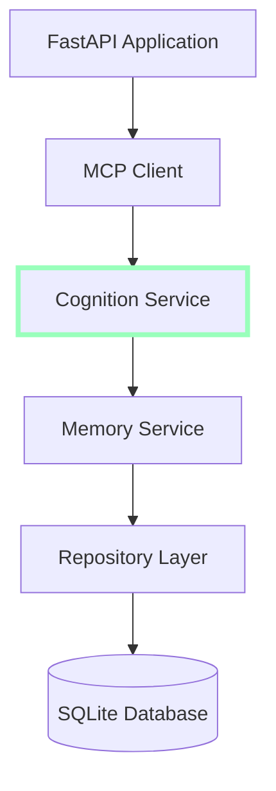

# Cognition Service Specification

## Overview

The Cognition Service is a critical component of the Cortex Core architecture introduced in Phase 3. It implements the Model Context Protocol (MCP) server interface and is responsible for processing, analyzing, and deriving insights from user data. The service acts as the "brain" of the system, providing contextually relevant information to enhance user interactions.

In Phase 3, the Cognition Service is implemented as an in-process service within the Cortex Core application. It communicates with the Memory Service to retrieve user data and processes this information to provide relevant context and insights. The design establishes clear boundaries that will facilitate the transition to a fully distributed implementation in Phase 4.

## Purpose and Responsibilities

The Cognition Service has the following core responsibilities:

1. **Context Generation**: Retrieve and assemble relevant context based on user history and queries
2. **Information Processing**: Analyze stored data to derive insights and connections
3. **Query Handling**: Process specific queries to find relevant information
4. **MCP Interface Implementation**: Expose functionality through standard MCP tools and resources
5. **Stateless Operation**: Maintain stateless design for future scalability

## System Context

The Cognition Service fits into the overall Cortex Core architecture as follows:



### Key Interactions

1. **Input Flow**:

   - API receives input from clients
   - Input is processed by the Cognition Service to generate context
   - Context is used to enhance response generation

2. **Context Retrieval Flow**:
   - MCP Client calls Cognition Service tools
   - Cognition Service retrieves data from Memory Service
   - Cognition Service processes data and returns context
   - Context is used for response generation

## MCP Interface Definition

The Cognition Service implements the MCP server interface, exposing functionality through tools and resources:

### Tools

1. **get_context**: Retrieves relevant context for a user

```python
@mcp.tool()
async def get_context(
    user_id: str,
    query: Optional[str] = None,
    limit: Optional[int] = 10,
    recency_weight: Optional[float] = 0.5
) -> Dict[str, Any]:
    """
    Get relevant context for a user based on their history and optional query.

    Args:
        user_id: The unique user identifier
        query: Optional search query to filter context
        limit: Maximum number of items to return (default: 10)
        recency_weight: Weight to apply to recency in ranking (0-1, default: 0.5)

    Returns:
        Dictionary containing:
        - context: List of context items
        - user_id: The user ID
        - query: The original query (if provided)
        - count: Number of context items returned
    """
```

2. **analyze_conversation**: Analyzes conversation history for patterns and insights

```python
@mcp.tool()
async def analyze_conversation(
    user_id: str,
    conversation_id: str,
    analysis_type: Optional[str] = "summary"
) -> Dict[str, Any]:
    """
    Analyze a conversation for patterns and insights.

    Args:
        user_id: The unique user identifier
        conversation_id: The conversation ID to analyze
        analysis_type: Type of analysis to perform (summary, topics, sentiment)

    Returns:
        Dictionary containing analysis results:
        - type: Analysis type performed
        - results: Analysis output
        - conversation_id: The conversation ID
    """
```

3. **search_history**: Searches user history for specific terms or patterns

```python
@mcp.tool()
async def search_history(
    user_id: str,
    query: str,
    limit: Optional[int] = 10,
    include_conversations: Optional[bool] = True
) -> Dict[str, Any]:
    """
    Search user history for specific terms or patterns.

    Args:
        user_id: The unique user identifier
        query: Search query string
        limit: Maximum number of results to return (default: 10)
        include_conversations: Whether to include conversation data (default: True)

    Returns:
        Dictionary containing:
        - results: List of matching items
        - count: Number of results returned
        - query: The original query
    """
```

## Implementation Details

### Core Components

The Cognition Service consists of the following core components:

1. **MCP Server Implementation**: Implements the MCP server interface
2. **Context Generator**: Generates relevant context from user history
3. **Search Processor**: Handles search queries against user history
4. **Analysis Engine**: Processes conversation data for insights

### Service Implementation

```python
from typing import Dict, List, Any, Optional
from mcp.server.fastmcp import FastMCP
from datetime import datetime
import httpx
import logging
import os

logger = logging.getLogger(__name__)

class CognitionService:
    """
    Cognition Service implementation using the MCP server interface.
    """
    def __init__(self, memory_service_url: str = None):
        """
        Initialize the Cognition Service.

        Args:
            memory_service_url: URL of the Memory Service (for Phase 4)
                                In Phase 3, this is not used as services
                                are in-process
        """
        self.memory_service_url = memory_service_url or os.environ.get(
            "MEMORY_SERVICE_URL", "http://localhost:9000"
        )
        self.mcp = FastMCP("CognitionService")
        self._register_tools()

    def _register_tools(self):
        """Register MCP tools with the server."""
        self.mcp.tool()(self.get_context)
        self.mcp.tool()(self.analyze_conversation)
        self.mcp.tool()(self.search_history)

    async def get_context(
        self,
        user_id: str,
        query: Optional[str] = None,
        limit: Optional[int] = 10,
        recency_weight: Optional[float] = 0.5
    ) -> Dict[str, Any]:
        """Implementation of get_context tool"""
        # Implementation details described below

    async def analyze_conversation(
        self,
        user_id: str,
        conversation_id: str,
        analysis_type: Optional[str] = "summary"
    ) -> Dict[str, Any]:
        """Implementation of analyze_conversation tool"""
        # Implementation details described below

    async def search_history(
        self,
        user_id: str,
        query: str,
        limit: Optional[int] = 10,
        include_conversations: Optional[bool] = True
    ) -> Dict[str, Any]:
        """Implementation of search_history tool"""
        # Implementation details described below

    async def run(self, port: int = 9100):
        """Run the MCP server on the specified port."""
        await self.mcp.run(host="0.0.0.0", port=port)
```

### Data Retrieval from Memory Service

The Cognition Service retrieves data from the Memory Service using its MCP client:

```python
async def _get_history_from_memory(
    self, user_id: str, limit: Optional[int] = None
) -> List[Dict[str, Any]]:
    """
    Get history for a user from the Memory Service.

    Args:
        user_id: The user ID
        limit: Optional limit on number of items to retrieve

    Returns:
        List of history items
    """
    try:
        # In Phase 3, use direct service access
        # In Phase 4, this will use network-based MCP client
        if hasattr(self, 'memory_service'):
            # In-process access for Phase 3
            if limit:
                history = await self.memory_service.get_limited_history(user_id, limit)
            else:
                history = await self.memory_service.get_history(user_id)
            return history
        else:
            # Network access for Phase 4
            async with httpx.AsyncClient() as client:
                url = f"{self.memory_service_url}/resource/history/{user_id}"
                if limit:
                    url += f"/limit/{limit}"

                response = await client.get(url)
                response.raise_for_status()
                return response.json()
    except Exception as e:
        logger.error(f"Error retrieving history for user {user_id}: {e}")
        return []
```

### Tool Implementation Details

#### get_context Implementation

```python
async def get_context(
    self,
    user_id: str,
    query: Optional[str] = None,
    limit: Optional[int] = 10,
    recency_weight: Optional[float] = 0.5
) -> Dict[str, Any]:
    """
    Get relevant context for a user based on their history and optional query.

    Args:
        user_id: The unique user identifier
        query: Optional search query to filter context
        limit: Maximum number of items to return
        recency_weight: Weight to apply to recency in ranking (0-1)

    Returns:
        Dictionary containing context information
    """
    try:
        # Retrieve user history from Memory Service
        history = await self._get_history_from_memory(user_id, limit=limit*2)

        # If no history, return empty context
        if not history:
            return {
                "context": [],
                "user_id": user_id,
                "query": query,
                "count": 0
            }

        # Process and rank items
        ranked_items = self._rank_context_items(history, query, recency_weight)

        # Limit results
        context_items = ranked_items[:limit]

        return {
            "context": context_items,
            "user_id": user_id,
            "query": query,
            "count": len(context_items)
        }
    except Exception as e:
        logger.error(f"Error generating context for user {user_id}: {e}")
        return {
            "context": [],
            "user_id": user_id,
            "query": query,
            "count": 0,
            "error": str(e)
        }
```

#### Context Ranking Implementation

```python
def _rank_context_items(
    self,
    items: List[Dict[str, Any]],
    query: Optional[str],
    recency_weight: float
) -> List[Dict[str, Any]]:
    """
    Rank context items based on relevance and recency.

    Args:
        items: History items to rank
        query: Optional query to rank against
        recency_weight: Weight for recency (0-1)

    Returns:
        Ranked list of items
    """
    # Convert timestamps to datetime objects
    for item in items:
        if "timestamp" in item:
            try:
                item["_datetime"] = datetime.fromisoformat(
                    item["timestamp"].replace("Z", "+00:00")
                )
            except (ValueError, TypeError):
                # If timestamp can't be parsed, use current time
                item["_datetime"] = datetime.now()
        else:
            item["_datetime"] = datetime.now()

    # Sort by recency (newest first)
    items_by_recency = sorted(
        items,
        key=lambda x: x.get("_datetime", datetime.min),
        reverse=True
    )

    # If query provided, calculate relevance
    if query:
        for item in items:
            # Simple relevance calculation
            item["_relevance"] = self._calculate_relevance(item, query)

        # Sort by combined score
        ranked_items = sorted(
            items,
            key=lambda x: (
                (1 - recency_weight) * x.get("_relevance", 0) +
                recency_weight * (1.0 - items_by_recency.index(x) / len(items))
            ),
            reverse=True
        )
    else:
        # If no query, sort by recency only
        ranked_items = items_by_recency

    # Remove temporary ranking fields
    for item in ranked_items:
        if "_datetime" in item:
            del item["_datetime"]
        if "_relevance" in item:
            del item["_relevance"]

    return ranked_items
```

#### Relevance Calculation

```python
def _calculate_relevance(self, item: Dict[str, Any], query: str) -> float:
    """
    Calculate relevance score for an item against a query.

    Args:
        item: The history item
        query: The search query

    Returns:
        Relevance score (0-1)
    """
    query_terms = query.lower().split()

    # Search in item content
    content = ""
    if "content" in item:
        content = item["content"].lower()
    elif "message" in item:
        content = item["message"].lower()
    elif "data" in item and isinstance(item["data"], dict):
        if "content" in item["data"]:
            content = item["data"]["content"].lower()
        elif "message" in item["data"]:
            content = item["data"]["message"].lower()

    # Simple term matching for Phase 3
    # This can be enhanced with semantic search in future phases
    matches = sum(1 for term in query_terms if term in content)
    if not query_terms:
        return 0.0

    # Return proportion of matching terms
    return matches / len(query_terms)
```

#### analyze_conversation Implementation

```python
async def analyze_conversation(
    self,
    user_id: str,
    conversation_id: str,
    analysis_type: Optional[str] = "summary"
) -> Dict[str, Any]:
    """
    Analyze a conversation for patterns and insights.

    Args:
        user_id: The unique user identifier
        conversation_id: The conversation ID to analyze
        analysis_type: Type of analysis to perform

    Returns:
        Dictionary containing analysis results
    """
    try:
        # Get conversation history from Memory Service
        history = await self._get_history_from_memory(user_id)

        # Filter for the specific conversation
        conversation_items = [
            item for item in history
            if (
                (item.get("conversation_id") == conversation_id) or
                (
                    "data" in item and
                    isinstance(item["data"], dict) and
                    item["data"].get("conversation_id") == conversation_id
                )
            )
        ]

        if not conversation_items:
            return {
                "type": analysis_type,
                "results": {},
                "conversation_id": conversation_id,
                "error": "Conversation not found"
            }

        # Perform requested analysis
        if analysis_type == "summary":
            results = self._generate_conversation_summary(conversation_items)
        elif analysis_type == "topics":
            results = self._extract_conversation_topics(conversation_items)
        elif analysis_type == "sentiment":
            results = self._analyze_conversation_sentiment(conversation_items)
        else:
            return {
                "type": analysis_type,
                "results": {},
                "conversation_id": conversation_id,
                "error": f"Unknown analysis type: {analysis_type}"
            }

        return {
            "type": analysis_type,
            "results": results,
            "conversation_id": conversation_id
        }
    except Exception as e:
        logger.error(f"Error analyzing conversation {conversation_id}: {e}")
        return {
            "type": analysis_type,
            "results": {},
            "conversation_id": conversation_id,
            "error": str(e)
        }
```

#### search_history Implementation

```python
async def search_history(
    self,
    user_id: str,
    query: str,
    limit: Optional[int] = 10,
    include_conversations: Optional[bool] = True
) -> Dict[str, Any]:
    """
    Search user history for specific terms or patterns.

    Args:
        user_id: The unique user identifier
        query: Search query string
        limit: Maximum number of results to return
        include_conversations: Whether to include conversation data

    Returns:
        Dictionary containing search results
    """
    try:
        # Get user history from Memory Service
        history = await self._get_history_from_memory(user_id)

        # Perform search
        results = []
        query_terms = query.lower().split()

        for item in history:
            # Extract content from various possible locations
            content = ""
            if "content" in item:
                content = item["content"].lower()
            elif "message" in item:
                content = item["message"].lower()
            elif "data" in item and isinstance(item["data"], dict):
                if "content" in item["data"]:
                    content = item["data"]["content"].lower()
                elif "message" in item["data"]:
                    content = item["data"]["message"].lower()

            # Check if any query term matches
            if any(term in content for term in query_terms):
                # If including conversations, add conversation data
                if include_conversations and "conversation_id" in item:
                    conversation_id = item["conversation_id"]
                    item["_conversation_data"] = self._get_conversation_metadata(
                        history, conversation_id
                    )

                results.append(item)

        # Sort by relevance
        scored_results = [
            (item, self._calculate_relevance(item, query))
            for item in results
        ]
        scored_results.sort(key=lambda x: x[1], reverse=True)

        # Limit results
        limited_results = [item for item, score in scored_results[:limit]]

        return {
            "results": limited_results,
            "count": len(limited_results),
            "query": query
        }
    except Exception as e:
        logger.error(f"Error searching history for user {user_id}: {e}")
        return {
            "results": [],
            "count": 0,
            "query": query,
            "error": str(e)
        }
```

## Service Integration

### Setting Up the Cognition Service

The Cognition Service should be set up and integrated in the FastAPI application's startup:

```python
# In app/main.py or similar startup file

# Initialize services
memory_service = MemoryService(repository_manager)
cognition_service = CognitionService()

# In Phase 3, provide direct access to Memory Service
cognition_service.memory_service = memory_service

# Create MCP clients
memory_client = McpClient(memory_service, "memory")
cognition_client = McpClient(cognition_service, "cognition")

# Register clients with manager
mcp_client_manager = McpClientManager()
mcp_client_manager.register_client("memory", memory_client)
mcp_client_manager.register_client("cognition", cognition_client)

# Add to FastAPI app state for access in endpoints
app.state.mcp_client_manager = mcp_client_manager
app.state.memory_service = memory_service
app.state.cognition_service = cognition_service
```

### Using the Cognition Service in API Endpoints

```python
@router.post("/analyze")
async def analyze_input(
    request: AnalyzeRequest,
    current_user: dict = Depends(get_current_user)
):
    """Analyze input with Cognition Service."""
    user_id = current_user["user_id"]

    # Get MCP client
    mcp_client_manager = request.app.state.mcp_client_manager
    cognition_client = mcp_client_manager.get_client("cognition")

    # Call the tool
    context = await cognition_client.call_tool(
        "get_context",
        {
            "user_id": user_id,
            "query": request.content,
            "limit": 5
        }
    )

    # Use context in response
    return {
        "context": context,
        "analyzed_content": request.content
    }
```

## Error Handling

The Cognition Service implements robust error handling:

1. **Tool-Level Error Handling**: Each tool catches exceptions and returns informative error messages
2. **Input Validation**: Tools validate input parameters before processing
3. **Graceful Degradation**: If Memory Service is unavailable, returns empty results instead of failing
4. **Error Reporting**: Detailed error logging for debugging
5. **User-Friendly Errors**: Error messages suitable for client consumption

### Error Response Format

All error responses follow a consistent format:

```json
{
  "error": "Error message describing what went wrong",
  "type": "The operation type that failed",
  "user_id": "The user ID from the request"
}
```

### Example Error Handling Strategy

```python
async def get_context(self, user_id: str, query: Optional[str] = None, limit: Optional[int] = 10):
    """Get context for a user."""
    try:
        # Validate input
        if not user_id:
            return {"error": "user_id is required", "context": []}

        if limit is not None and (not isinstance(limit, int) or limit <= 0):
            return {"error": "limit must be a positive integer", "context": []}

        # Process request
        # ...
    except MemoryServiceError as e:
        # Handle Memory Service specific errors
        logger.error(f"Memory Service error in get_context: {e}")
        return {
            "error": f"Memory Service error: {str(e)}",
            "context": [],
            "user_id": user_id
        }
    except Exception as e:
        # Handle unexpected errors
        logger.exception(f"Unexpected error in get_context: {e}")
        return {
            "error": f"Internal error: {str(e)}",
            "context": [],
            "user_id": user_id
        }
```

## Testing Strategy

### Unit Testing

Unit tests should cover individual components of the Cognition Service:

1. **Tool Function Tests**: Test each tool function with various inputs
2. **Helper Method Tests**: Test internal helper methods
3. **Error Handling Tests**: Test error scenarios and responses

### Integration Testing

Integration tests should verify interaction with other components:

1. **Memory Service Integration**: Test interaction with Memory Service
2. **MCP Client Interaction**: Test proper tool calling via MCP client
3. **API Endpoint Integration**: Test API endpoints that use Cognition Service

### Example Unit Test

```python
import pytest
from unittest.mock import AsyncMock, MagicMock, patch
from datetime import datetime
from app.services.cognition_service import CognitionService

@pytest.mark.asyncio
async def test_get_context():
    """Test the get_context tool."""
    # Setup
    cognition_service = CognitionService()

    # Mock the _get_history_from_memory method
    mock_history = [
        {
            "type": "input",
            "data": {"content": "Hello world", "conversation_id": "conv1"},
            "user_id": "test-user",
            "timestamp": "2023-01-01T12:00:00Z"
        },
        {
            "type": "output",
            "data": {"content": "Hi there", "conversation_id": "conv1"},
            "user_id": "test-user",
            "timestamp": "2023-01-01T12:01:00Z"
        }
    ]

    cognition_service._get_history_from_memory = AsyncMock(return_value=mock_history)

    # Test with no query
    result = await cognition_service.get_context("test-user")

    # Verify
    assert result["user_id"] == "test-user"
    assert result["count"] == 2
    assert len(result["context"]) == 2

    # Test with query
    result = await cognition_service.get_context("test-user", query="world")

    # Verify query results
    assert result["user_id"] == "test-user"
    assert result["query"] == "world"
    assert result["count"] > 0

    # Test error handling
    cognition_service._get_history_from_memory = AsyncMock(side_effect=Exception("Test error"))
    result = await cognition_service.get_context("test-user")

    # Verify error response
    assert "error" in result
    assert result["count"] == 0
```

### Example Integration Test

```python
import pytest
from httpx import AsyncClient
from app.main import app

@pytest.mark.asyncio
async def test_cognition_integration():
    """Test Cognition Service integration with the API."""
    async with AsyncClient(app=app, base_url="http://test") as client:
        # Create test token
        token = create_access_token({
            "sub": "test@example.com",
            "oid": "test-user-123",
            "name": "Test User",
            "email": "test@example.com"
        })

        # Set auth header
        headers = {"Authorization": f"Bearer {token}"}

        # Test analyze endpoint
        response = await client.post(
            "/analyze",
            json={"content": "Test query"},
            headers=headers
        )

        # Verify response
        assert response.status_code == 200
        data = response.json()
        assert "context" in data
        assert data["analyzed_content"] == "Test query"
```

## Performance Considerations

### Memory Usage

1. **Stateless Design**: The service doesn't maintain state between requests
2. **Efficient Data Processing**: Processes only necessary data
3. **Pagination**: Uses limits to avoid processing too much data at once

### Processing Efficiency

1. **Early Filtering**: Filters data as early as possible in the pipeline
2. **Lazy Evaluation**: Only processes data when needed
3. **Efficient Algorithms**: Uses efficient algorithms for ranking and relevance

### Potential Optimizations

For larger datasets, future optimization opportunities include:

1. **Caching**: Add caching for frequently accessed data
2. **Indexing**: Implement better indexing for faster retrieval
3. **Parallelization**: Process multiple operations in parallel
4. **Vectorization**: Add vector embeddings for better semantic search
5. **Stream Processing**: Implement streaming for large result sets

## Common Challenges and Solutions

### Challenge 1: Memory Service Unavailability

**Problem**: The Memory Service is unavailable or returns an error.

**Solution**:

- Implement robust error handling
- Return empty results instead of failing
- Log detailed error information for debugging
- Implement retry logic with backoff

### Challenge 2: Large History Datasets

**Problem**: User has a large history dataset, causing performance issues.

**Solution**:

- Implement pagination and limits
- Process data in batches
- Use efficient filtering early in the pipeline
- Consider adding specialized indexes in future phases

### Challenge 3: Query Complexity

**Problem**: Complex queries may be slow to process.

**Solution**:

- Start with simple term-based matching
- Add complexity incrementally
- Consider adding timeouts for long-running operations
- Add monitoring to identify slow queries

### Challenge 4: Maintaining Service Boundaries

**Problem**: Preserving clean service boundaries during implementation.

**Solution**:

- Clearly define and document the MCP interface
- Use dependency injection for service integration
- Avoid direct access to repositories from Cognition Service
- Always go through Memory Service for data access

## Future Extensions (Phase 4 and Beyond)

In Phase 4, the Cognition Service will be moved to a standalone service with network-based communication. The following enhancements may be added:

1. **Advanced Semantic Search**: Implement vector embeddings for better search
2. **Machine Learning Models**: Add ML models for improved insights
3. **Streaming Results**: Implement streaming for large result sets
4. **Specialized Indexes**: Add specialized indexes for better performance
5. **Distributed Processing**: Scale processing across multiple instances

## Running the Cognition Service

### As Part of the Core Application (Phase 3)

In Phase 3, the Cognition Service runs as part of the core application:

```python
# In app/main.py
memory_service = MemoryService(repository_manager)
cognition_service = CognitionService()

# In-process configuration
cognition_service.memory_service = memory_service

# Add to FastAPI app state
app.state.memory_service = memory_service
app.state.cognition_service = cognition_service
```

### As a Standalone Service (Phase 4)

In Phase 4, the Cognition Service will run as a standalone service:

```python
# In cognition_service.py
import asyncio

async def main():
    memory_service_url = os.environ.get("MEMORY_SERVICE_URL", "http://memory-service:9000")
    port = int(os.environ.get("PORT", "9100"))

    cognition_service = CognitionService(memory_service_url=memory_service_url)
    await cognition_service.run(port=port)

if __name__ == "__main__":
    asyncio.run(main())
```

## Conclusion

The Cognition Service plays a critical role in the Cortex Core architecture, providing contextually relevant information derived from user data. In Phase 3, it's implemented as an in-process service with clear boundaries that will facilitate the transition to a distributed implementation in Phase 4.

The service follows the MCP architecture, providing standardized tools for context generation, conversation analysis, and history search. It maintains a stateless design for future scalability and implements robust error handling for reliability.

By following this specification, a mid-level engineer should be able to successfully implement the Cognition Service as part of Phase 3 of the Cortex Core project.
