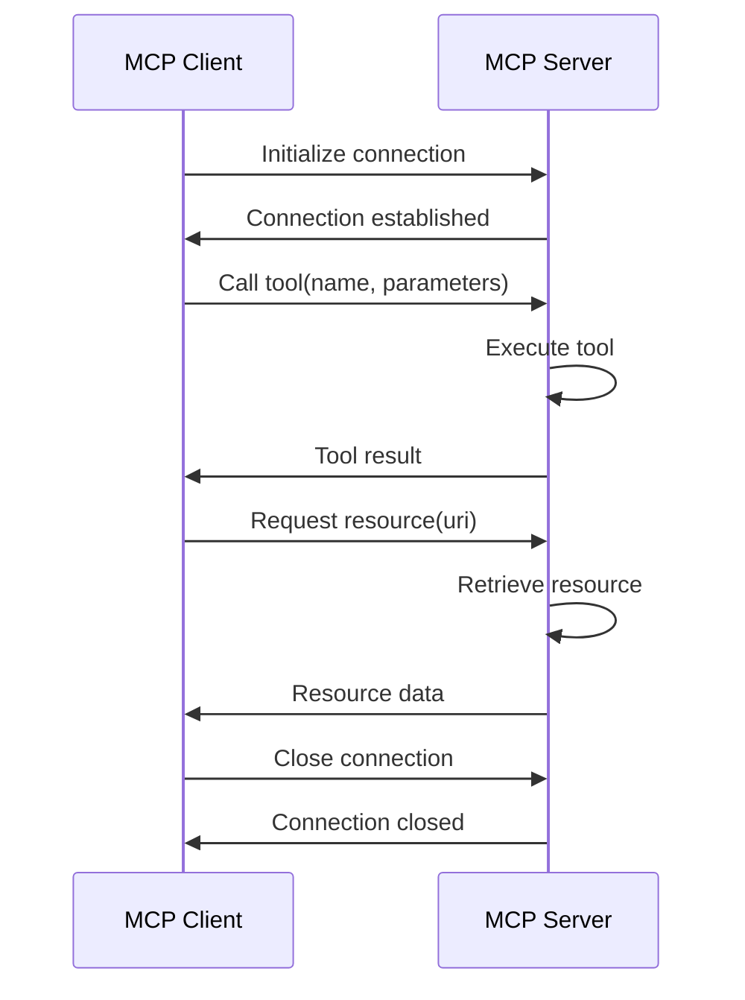

# Model Context Protocol (MCP) Architecture

## Overview

The Model Context Protocol (MCP) is a foundational architectural pattern for the Cortex Core system that enables standardized communication between components. MCP establishes a clear client-server protocol built around the concepts of **tools** and **resources**. This document provides a comprehensive explanation of the MCP architecture, its core concepts, implementation patterns, and how it's used within the Cortex Core system.

In Phase 3, we implement MCP as an in-process architecture, setting the foundation for the distributed services that will come in Phase 4. This approach allows us to establish service boundaries and interface contracts while maintaining the simplicity of in-process communication.

## Core MCP Concepts

### Key Terminology

1. **MCP Server**: A component that exposes tools and resources for other components to use
2. **MCP Client**: A component that connects to MCP servers and uses their tools and resources
3. **Tool**: An executable function that can be called on the server, potentially having side effects
4. **Resource**: A data endpoint that can be accessed on the server, typically read-only
5. **Service**: An MCP server that provides specific domain functionality (e.g., Memory, Cognition)

### Tools vs Resources

The distinction between tools and resources is fundamental to the MCP architecture:

| Feature             | Tool                                              | Resource                                           |
| ------------------- | ------------------------------------------------- | -------------------------------------------------- |
| **Purpose**         | Execute actions with side effects                 | Access data                                        |
| **Operation**       | Active (verbs)                                    | Passive (nouns)                                    |
| **Calling Pattern** | Call with named parameters                        | Retrieve with URI/path                             |
| **Side Effects**    | Yes (can modify state)                            | No (read-only)                                     |
| **Typical Use**     | Store data, process information, generate context | Retrieve history, access configuration, get status |
| **Examples**        | `store_input`, `generate_context`, `analyze_text` | `/history/{user_id}`, `/context/{conversation_id}` |

### MCP Server-Client Relationship



### Communication Flow

1. **Client Initialization**: MCP client establishes a connection to the server
2. **Tool Execution**:
   - Client calls a tool with name and parameters
   - Server executes the tool
   - Server returns the result to the client
3. **Resource Access**:
   - Client requests a resource by URI
   - Server retrieves the resource data
   - Server returns the data to the client
4. **Connection Termination**: Client closes the connection when done

## MCP Client Interface

The MCP client provides a standardized interface for communicating with MCP servers:

```python
class McpClient:
    """Client for communicating with MCP servers."""

    async def connect(self) -> None:
        """
        Connect to the MCP server.

        Raises:
            ConnectionError: If unable to connect to the server
        """
        pass

    async def call_tool(self, name: str, arguments: dict) -> dict:
        """
        Call a tool on the MCP server.

        Args:
            name: The name of the tool to call
            arguments: Dictionary of arguments for the tool

        Returns:
            Tool execution result

        Raises:
            ToolNotFoundError: If the tool does not exist
            ToolExecutionError: If the tool execution fails
            ConnectionError: If the connection to the server is lost
        """
        pass

    async def get_resource(self, uri: str) -> dict:
        """
        Get a resource from the MCP server.

        Args:
            uri: The URI of the resource to get

        Returns:
            Resource data

        Raises:
            ResourceNotFoundError: If the resource does not exist
            ResourceAccessError: If the resource access fails
            ConnectionError: If the connection to the server is lost
        """
        pass

    async def close(self) -> None:
        """
        Close the connection to the MCP server.

        Raises:
            ConnectionError: If an error occurs while closing the connection
        """
        pass
```

## MCP Server Interface

The MCP server interface defines how tools and resources are exposed:

```python
class McpServer:
    """Server for exposing tools and resources to MCP clients."""

    def register_tool(self, name: str, func: Callable) -> None:
        """
        Register a tool with the server.

        Args:
            name: The name of the tool
            func: The function to execute when the tool is called
        """
        pass

    def register_resource(self, uri: str, func: Callable) -> None:
        """
        Register a resource with the server.

        Args:
            uri: The URI of the resource
            func: The function to execute when the resource is accessed
        """
        pass

    async def initialize(self) -> None:
        """
        Initialize the server.

        Raises:
            ServerInitializationError: If server initialization fails
        """
        pass

    async def shutdown(self) -> None:
        """
        Shutdown the server.

        Raises:
            ServerShutdownError: If server shutdown fails
        """
        pass
```

## Tool and Resource Implementation

### Tool Implementation Pattern

Tools are implemented as functions with type hints and decorators:

```python
from fastmcp import FastMCP

# Initialize MCP server
mcp = FastMCP("ServiceName")

@mcp.tool()
async def store_input(user_id: str, input_data: dict) -> dict:
    """
    Store input data for a specific user.

    Args:
        user_id: The unique user identifier
        input_data: The input data to store

    Returns:
        Status object with operation result
    """
    # Implementation logic here

    # Return result
    return {
        "status": "stored",
        "user_id": user_id,
        "item_id": input_data.get("id", "unknown")
    }
```

### Resource Implementation Pattern

Resources are implemented with URI templates:

```python
@mcp.resource("history/{user_id}")
async def get_history(user_id: str) -> list:
    """
    Get history for a specific user.

    Args:
        user_id: The unique user identifier

    Returns:
        List containing the user's history
    """
    # Implementation logic here

    # Return result
    return history_items
```

### Parameter Validation

The MCP framework automatically validates parameters based on type hints:

```python
@mcp.tool()
async def calculate_summary(
    text: str,
    max_length: int = 100,
    include_metadata: bool = False
) -> dict:
    """
    Calculate a summary of the provided text.

    Args:
        text: The text to summarize
        max_length: Maximum length of the summary
        include_metadata: Whether to include metadata in the result

    Returns:
        Summary result with optional metadata
    """
    # If text is not a string, max_length is not an int, or include_metadata is
    # not a bool, the framework will automatically reject the call

    # Implementation logic here

    # Return result
    return {
        "summary": summary,
        "original_length": len(text),
        "summary_length": len(summary),
        "metadata": metadata if include_metadata else None
    }
```

## In-Process MCP Implementation

For Phase 3, MCP is implemented as an in-process architecture with direct function calls.

### InProcessMcpClient Implementation

```python
class InProcessMcpClient(McpClient):
    """In-process implementation of MCP client."""

    def __init__(self, server_instance: Any):
        """
        Initialize the in-process MCP client.

        Args:
            server_instance: The server instance to connect to
        """
        self.server = server_instance
        self.connected = False

    async def connect(self) -> None:
        """
        Connect to the in-process MCP server.

        This is a no-op for in-process clients.
        """
        self.connected = True

    async def call_tool(self, name: str, arguments: dict) -> dict:
        """
        Call a tool on the in-process MCP server.

        Args:
            name: The name of the tool to call
            arguments: Dictionary of arguments for the tool

        Returns:
            Tool execution result
        """
        if not self.connected:
            await self.connect()

        if not hasattr(self.server, name):
            raise ToolNotFoundError(f"Tool '{name}' not found on server")

        tool_func = getattr(self.server, name)

        try:
            result = await tool_func(**arguments)
            return result
        except Exception as e:
            raise ToolExecutionError(f"Error executing tool '{name}': {str(e)}")

    async def get_resource(self, uri: str) -> dict:
        """
        Get a resource from the in-process MCP server.

        Args:
            uri: The URI of the resource to get

        Returns:
            Resource data
        """
        if not self.connected:
            await self.connect()

        # Parse URI to extract resource name and parameters
        # For example, "history/user123" would extract "history" and "user123"
        parts = uri.split("/")
        resource_name = parts[0]
        parameters = parts[1:]

        if not hasattr(self.server, f"get_{resource_name}"):
            raise ResourceNotFoundError(f"Resource '{resource_name}' not found on server")

        resource_func = getattr(self.server, f"get_{resource_name}")

        try:
            result = await resource_func(*parameters)
            return result
        except Exception as e:
            raise ResourceAccessError(f"Error accessing resource '{uri}': {str(e)}")

    async def close(self) -> None:
        """
        Close the connection to the in-process MCP server.

        This is a no-op for in-process clients.
        """
        self.connected = False
```

### FastMCP Implementation

The `FastMCP` class is a simplified implementation of the MCP server that provides decorators for tools and resources:

```python
class FastMCP:
    """Fast implementation of MCP server."""

    def __init__(self, service_name: str):
        """
        Initialize the FastMCP server.

        Args:
            service_name: The name of the service
        """
        self.service_name = service_name
        self.tools = {}
        self.resources = {}

    def tool(self):
        """
        Decorator for registering a tool.

        Returns:
            Decorated function
        """
        def decorator(func):
            # Register the tool
            self.tools[func.__name__] = func
            return func
        return decorator

    def resource(self, uri_template: str):
        """
        Decorator for registering a resource.

        Args:
            uri_template: The URI template for the resource

        Returns:
            Decorated function
        """
        def decorator(func):
            # Register the resource
            self.resources[uri_template] = func
            return func
        return decorator

    def run(self, host: str = "localhost", port: int = 8000):
        """
        Run the MCP server.

        For in-process implementation, this is a no-op.

        Args:
            host: The host to bind to
            port: The port to listen on
        """
        pass
```

## MCP Service Registry

The MCP Service Registry manages the registration and discovery of MCP services:

```python
class McpServiceRegistry:
    """Registry for MCP services."""

    def __init__(self):
        """Initialize the MCP service registry."""
        self.services = {}
        self.clients = {}

    def register_service(self, name: str, service_instance: Any) -> None:
        """
        Register an MCP service.

        Args:
            name: The name of the service
            service_instance: The service instance
        """
        self.services[name] = service_instance

    def get_client(self, service_name: str) -> McpClient:
        """
        Get an MCP client for a registered service.

        Args:
            service_name: The name of the service

        Returns:
            MCP client for the service

        Raises:
            ServiceNotFoundError: If the service is not registered
        """
        if service_name not in self.services:
            raise ServiceNotFoundError(f"Service '{service_name}' not registered")

        if service_name not in self.clients:
            # Create a new client for the service
            service = self.services[service_name]
            client = InProcessMcpClient(service)
            self.clients[service_name] = client

        return self.clients[service_name]

    async def initialize_all(self) -> None:
        """
        Initialize all registered services.

        Raises:
            ServiceInitializationError: If service initialization fails
        """
        for name, service in self.services.items():
            try:
                if hasattr(service, "initialize"):
                    await service.initialize()
            except Exception as e:
                raise ServiceInitializationError(f"Error initializing service '{name}': {str(e)}")

    async def shutdown_all(self) -> None:
        """
        Shutdown all registered services.

        Raises:
            ServiceShutdownError: If service shutdown fails
        """
        for name, service in self.services.items():
            try:
                if hasattr(service, "shutdown"):
                    await service.shutdown()
            except Exception as e:
                raise ServiceShutdownError(f"Error shutting down service '{name}': {str(e)}")

        # Close all clients
        for name, client in self.clients.items():
            try:
                await client.close()
            except Exception as e:
                pass  # Ignore client closing errors during shutdown

        # Clear all registrations
        self.services.clear()
        self.clients.clear()
```

## Memory Service Implementation

The Memory Service is an MCP server that provides tools and resources for storing and retrieving data:

```python
from fastmcp import FastMCP
from typing import Dict, List, Any
from datetime import datetime
import uuid

class MemoryService:
    """
    MCP service for memory operations.

    This service provides tools and resources for storing and retrieving data.
    """

    def __init__(self, repository_manager):
        """
        Initialize the Memory Service.

        Args:
            repository_manager: The repository manager for data access
        """
        self.repository_manager = repository_manager
        self.mcp = FastMCP("Memory")
        self._register_tools_and_resources()

    def _register_tools_and_resources(self):
        """Register all tools and resources with the MCP server."""
        # This is an internal method to wire up the decorators
        pass

    @FastMCP.tool()
    async def store_input(self, user_id: str, input_data: Dict[str, Any]) -> Dict[str, Any]:
        """
        Store input data for a specific user.

        Args:
            user_id: The unique user identifier
            input_data: The input data to store

        Returns:
            Status object with operation result
        """
        # Add ID if not present
        if "id" not in input_data:
            input_data["id"] = str(uuid.uuid4())

        # Add timestamp if not present
        if "timestamp" not in input_data:
            input_data["timestamp"] = datetime.now().isoformat()

        # Get the appropriate repository
        repository = self.repository_manager.get_repository("messages")

        # Store the input
        try:
            stored_id = await repository.create({
                "user_id": user_id,
                "content": input_data.get("content", ""),
                "conversation_id": input_data.get("conversation_id"),
                "timestamp": input_data["timestamp"],
                "metadata": input_data.get("metadata", {})
            })

            return {
                "status": "stored",
                "user_id": user_id,
                "item_id": stored_id
            }
        except Exception as e:
            return {
                "status": "error",
                "user_id": user_id,
                "error": str(e)
            }

    @FastMCP.resource("history/{user_id}")
    async def get_history(self, user_id: str) -> List[Dict[str, Any]]:
        """
        Get history for a specific user.

        Args:
            user_id: The unique user identifier

        Returns:
            List containing the user's history
        """
        # Get the appropriate repository
        repository = self.repository_manager.get_repository("messages")

        # Retrieve history
        try:
            history = await repository.find_many({"user_id": user_id})
            return history
        except Exception as e:
            return []

    @FastMCP.resource("history/{user_id}/limit/{limit}")
    async def get_limited_history(self, user_id: str, limit: str) -> List[Dict[str, Any]]:
        """
        Get limited history for a specific user.

        Args:
            user_id: The unique user identifier
            limit: Maximum number of items to return

        Returns:
            List containing the user's limited history
        """
        # Get the appropriate repository
        repository = self.repository_manager.get_repository("messages")

        # Retrieve limited history
        try:
            history = await repository.find_many(
                {"user_id": user_id},
                limit=int(limit),
                sort=[("timestamp", -1)]
            )
            return history
        except Exception as e:
            return []

    @FastMCP.resource("conversation/{conversation_id}")
    async def get_conversation(self, conversation_id: str) -> List[Dict[str, Any]]:
        """
        Get all messages for a specific conversation.

        Args:
            conversation_id: The unique conversation identifier

        Returns:
            List containing the conversation messages
        """
        # Get the appropriate repository
        repository = self.repository_manager.get_repository("messages")

        # Retrieve conversation messages
        try:
            messages = await repository.find_many({"conversation_id": conversation_id})
            return messages
        except Exception as e:
            return []

    async def initialize(self) -> None:
        """Initialize the Memory Service."""
        # Any startup tasks can be performed here
        pass

    async def shutdown(self) -> None:
        """Shutdown the Memory Service."""
        # Any cleanup tasks can be performed here
        pass
```

## Cognition Service Implementation

The Cognition Service is an MCP server that provides tools for processing and analyzing data:

```python
from fastmcp import FastMCP
from typing import Dict, List, Any, Optional
import httpx

class CognitionService:
    """
    MCP service for cognition operations.

    This service provides tools for processing and analyzing data.
    """

    def __init__(self, memory_client=None):
        """
        Initialize the Cognition Service.

        Args:
            memory_client: Optional MCP client for the Memory Service
        """
        self.memory_client = memory_client
        self.mcp = FastMCP("Cognition")
        self._register_tools()

    def _register_tools(self):
        """Register all tools with the MCP server."""
        # This is an internal method to wire up the decorators
        pass

    @FastMCP.tool()
    async def get_context(
        self,
        user_id: str,
        query: Optional[str] = None,
        limit: Optional[int] = 10
    ) -> Dict[str, Any]:
        """
        Get relevant context for a user.

        Args:
            user_id: The unique user identifier
            query: Optional search query to filter context
            limit: Maximum number of items to return

        Returns:
            Object containing relevant context items
        """
        try:
            # Get the user's history from the Memory Service
            if self.memory_client:
                history = await self.memory_client.get_resource(f"history/{user_id}/limit/{limit}")
            else:
                # Fallback if no memory client is provided
                history = []

            # In a real implementation, this would do more sophisticated processing
            # to find relevant context based on the query

            # For Phase 3, we'll just return the history as context
            return {
                "context": history,
                "user_id": user_id,
                "query": query,
                "count": len(history)
            }
        except Exception as e:
            return {
                "context": [],
                "user_id": user_id,
                "query": query,
                "count": 0,
                "error": str(e)
            }

    @FastMCP.tool()
    async def analyze_sentiment(self, text: str) -> Dict[str, Any]:
        """
        Analyze the sentiment of the provided text.

        Args:
            text: The text to analyze

        Returns:
            Sentiment analysis result
        """
        # This is a simple placeholder implementation
        # In a real implementation, this would use a proper sentiment analysis model

        # Count positive and negative words as a simple proxy
        positive_words = ["good", "great", "excellent", "amazing", "wonderful", "happy", "pleased"]
        negative_words = ["bad", "terrible", "awful", "horrible", "sad", "angry", "disappointed"]

        text_lower = text.lower()
        positive_count = sum(1 for word in positive_words if word in text_lower)
        negative_count = sum(1 for word in negative_words if word in text_lower)

        # Calculate sentiment score (-1 to 1)
        total = positive_count + negative_count
        score = 0 if total == 0 else (positive_count - negative_count) / total

        return {
            "sentiment": "positive" if score > 0 else "negative" if score < 0 else "neutral",
            "score": score,
            "positive_count": positive_count,
            "negative_count": negative_count
        }

    async def initialize(self) -> None:
        """Initialize the Cognition Service."""
        # Any startup tasks can be performed here
        pass

    async def shutdown(self) -> None:
        """Shutdown the Cognition Service."""
        # Any cleanup tasks can be performed here
        pass
```

## Error Handling in MCP

### MCP Exceptions

```python
class McpError(Exception):
    """Base class for all MCP exceptions."""
    pass

class ConnectionError(McpError):
    """Error connecting to MCP server."""
    pass

class ToolNotFoundError(McpError):
    """Tool not found on MCP server."""
    pass

class ToolExecutionError(McpError):
    """Error executing tool on MCP server."""
    pass

class ResourceNotFoundError(McpError):
    """Resource not found on MCP server."""
    pass

class ResourceAccessError(McpError):
    """Error accessing resource on MCP server."""
    pass

class ServiceNotFoundError(McpError):
    """Service not found in registry."""
    pass

class ServiceInitializationError(McpError):
    """Error initializing service."""
    pass

class ServiceShutdownError(McpError):
    """Error shutting down service."""
    pass
```

### Error Handling Patterns

#### Client-Side Error Handling

```python
async def call_with_retry(client, tool_name, arguments, max_retries=3):
    """
    Call a tool with retry logic.

    Args:
        client: The MCP client
        tool_name: The name of the tool to call
        arguments: Arguments for the tool
        max_retries: Maximum number of retries

    Returns:
        Tool execution result

    Raises:
        ToolExecutionError: If all retries fail
    """
    retries = 0
    last_error = None

    while retries < max_retries:
        try:
            return await client.call_tool(tool_name, arguments)
        except (ConnectionError, ToolExecutionError) as e:
            # These errors can be retried
            last_error = e
            retries += 1

            # Exponential backoff
            await asyncio.sleep(2 ** retries * 0.1)
        except ToolNotFoundError as e:
            # Tool not found is a permanent error, don't retry
            raise e

    # All retries failed
    raise ToolExecutionError(f"Failed after {max_retries} retries: {last_error}")
```

#### Server-Side Error Handling

```python
@mcp.tool()
async def safe_operation(data: dict) -> dict:
    """
    Perform an operation with proper error handling.

    Args:
        data: The data to process

    Returns:
        Operation result
    """
    try:
        # Validate input
        if not data:
            return {
                "status": "error",
                "error": "Empty data provided"
            }

        # Process data
        result = process_data(data)

        # Return success
        return {
            "status": "success",
            "result": result
        }
    except ValueError as e:
        # Validation error
        return {
            "status": "error",
            "error": f"Validation error: {str(e)}"
        }
    except Exception as e:
        # Unexpected error
        logging.exception("Error in safe_operation")
        return {
            "status": "error",
            "error": f"Internal error: {str(e)}"
        }
```

## Integration with FastAPI

### MCP Service Registration

```python
from fastapi import FastAPI
from app.core.mcp import McpServiceRegistry
from app.services.memory import MemoryService
from app.services.cognition import CognitionService

app = FastAPI()

# Create service registry
service_registry = McpServiceRegistry()

@app.on_event("startup")
async def startup_event():
    """Startup event handler."""
    # Initialize repository manager
    from app.core.repository import RepositoryManager
    repository_manager = RepositoryManager()

    # Create and register services
    memory_service = MemoryService(repository_manager)
    service_registry.register_service("memory", memory_service)

    # Get memory client
    memory_client = service_registry.get_client("memory")

    # Create cognition service with memory client
    cognition_service = CognitionService(memory_client)
    service_registry.register_service("cognition", cognition_service)

    # Initialize all services
    await service_registry.initialize_all()

@app.on_event("shutdown")
async def shutdown_event():
    """Shutdown event handler."""
    # Shutdown all services
    await service_registry.shutdown_all()
```

### Using MCP Client in API Endpoints

```python
@router.post("/input", response_model=InputResponse)
async def receive_input(
    request: InputRequest,
    current_user: dict = Depends(get_current_user)
):
    """
    Receive input from a dumb input client.

    Args:
        request: The input request
        current_user: The authenticated user

    Returns:
        Status response
    """
    user_id = current_user["user_id"]

    # Create input data
    input_data = {
        "content": request.content,
        "conversation_id": request.conversation_id,
        "timestamp": datetime.now().isoformat(),
        "metadata": request.metadata
    }

    # Use Memory Service to store input
    memory_client = service_registry.get_client("memory")
    try:
        result = await memory_client.call_tool("store_input", {
            "user_id": user_id,
            "input_data": input_data
        })
    except Exception as e:
        result = {"status": "error", "error": str(e)}

    # Create event for the event bus
    event = {
        "type": "input",
        "data": input_data,
        "user_id": user_id,
        "timestamp": input_data["timestamp"]
    }

    # Publish event
    await event_bus.publish(event)

    # Return response
    return InputResponse(
        status="received" if result.get("status") == "stored" else "error",
        data=input_data
    )
```

## Testing MCP Components

### Testing MCP Clients

```python
import pytest
from unittest.mock import AsyncMock, MagicMock
from app.core.mcp import InProcessMcpClient, ToolNotFoundError

class TestMcpClient:
    """Tests for the MCP client."""

    def test_init(self):
        """Test client initialization."""
        server_mock = MagicMock()
        client = InProcessMcpClient(server_mock)
        assert client.server == server_mock
        assert not client.connected

    @pytest.mark.asyncio
    async def test_connect(self):
        """Test client connection."""
        server_mock = MagicMock()
        client = InProcessMcpClient(server_mock)

        await client.connect()
        assert client.connected

    @pytest.mark.asyncio
    async def test_call_tool_success(self):
        """Test successful tool call."""
        server_mock = MagicMock()
        server_mock.test_tool = AsyncMock(return_value={"result": "success"})

        client = InProcessMcpClient(server_mock)
        await client.connect()

        result = await client.call_tool("test_tool", {"param": "value"})

        server_mock.test_tool.assert_called_once_with(param="value")
        assert result == {"result": "success"}

    @pytest.mark.asyncio
    async def test_call_tool_not_found(self):
        """Test tool not found error."""
        server_mock = MagicMock()
        # No test_tool attribute on the server

        client = InProcessMcpClient(server_mock)
        await client.connect()

        with pytest.raises(ToolNotFoundError):
            await client.call_tool("test_tool", {"param": "value"})

    @pytest.mark.asyncio
    async def test_get_resource_success(self):
        """Test successful resource access."""
        server_mock = MagicMock()
        server_mock.get_test = AsyncMock(return_value={"data": "value"})

        client = InProcessMcpClient(server_mock)
        await client.connect()

        result = await client.get_resource("test/param")

        server_mock.get_test.assert_called_once_with("param")
        assert result == {"data": "value"}
```

### Testing MCP Services

````python
import pytest
from unittest.mock import AsyncMock, MagicMock
from app.services.memory import MemoryService

class TestMemoryService:
    """Tests for the Memory Service."""

    @pytest.fixture
    def repository_manager_mock(self):
        """Create a mock repository manager."""
        manager = MagicMock()
        repository_mock = MagicMock()
        manager.get_repository.return_value = repository_mock
        return manager, repository_mock

    def test_init(self, repository_manager_mock):
        """Test service initialization."""
        manager, _ = repository_manager_mock
        service = MemoryService(manager)
        assert service.repository_manager == manager

    @pytest.mark.asyncio
    async def test_store_input(self, repository_manager_mock):
        """Test store_input tool."""
        manager, repository = repository_manager_mock
        repository.create = AsyncMock(return_value="new_id")

        service = MemoryService(manager)
        result = await service.store_input("user123", {
            "content": "Hello",
            "conversation_id": "conv123",
            "metadata": {"source": "test"}
        })

        # Verify repository was called
        manager.get_repository.assert_called_once_with("messages")
        repository.create.assert_called_once()

        # Verify the call arguments
        call_args = repository.create.call_args[0][0]
        assert call_args["user_id"] == "user123"
        assert call_args["content"] == "Hello"
        assert call_args["conversation_id"] == "conv123"
        assert "timestamp" in call_args

        # Verify result
        assert result["status"] == "stored"
        assert result["user_id"] == "user123"
        assert result["item_id"] == "new_id"

    @pytest.mark.asyncio
    async def test_get_history(self, repository_manager_mock):
        """Test get_history resource."""
        manager, repository = repository_manager_mock
        history_data = [{"id": "msg1"}, {"id": "msg2"}]
        repository.find_many = AsyncMock(return_value=history_data)

        service = MemoryService(manager)
        result = await service.get_history("user123")

        # Verify repository was called
        manager.get_repository.assert_called_once_with("messages")
        repository.find_many.assert_called_once_with({"user_id": "user123"})

        # Verify result
        assert result == history_data

    @pytest.mark.asyncio
    async def test_get_limited_history(self, repository_manager_mock):
        """Test get_limited_history resource."""
        manager, repository = repository_manager_mock
        history_data = [{"id": "msg1"}]
        repository.find_many = AsyncMock(return_value=history_data)

        service = MemoryService(manager)
        result = await service.get_limited_history("user123", "1")

        # Verify repository was called
        manager.get_repository.assert_called_once_with("messages")
        repository.find_many.assert_called_once_with(
            {"user_id": "user123"},
            limit=1,
            sort=[("timestamp", -1)]
        )

        # Verify result
        assert result == history_data

class TestCognitionService:
    """Tests for the Cognition Service."""

    @pytest.fixture
    def memory_client_mock(self):
        """Create a mock memory client."""
        client = MagicMock()
        client.get_resource = AsyncMock()
        return client

    def test_init(self):
        """Test service initialization."""
        service = CognitionService()
        assert service.memory_client is None

        memory_client = MagicMock()
        service = CognitionService(memory_client)
        assert service.memory_client == memory_client

    @pytest.mark.asyncio
    async def test_get_context_with_memory(self, memory_client_mock):
        """Test get_context tool with memory client."""
        history_data = [{"id": "msg1"}, {"id": "msg2"}]
        memory_client_mock.get_resource.return_value = history_data

        service = CognitionService(memory_client_mock)
        result = await service.get_context("user123", "test query", 5)

        # Verify memory client was called
        memory_client_mock.get_resource.assert_called_once_with("history/user123/limit/5")

        # Verify result
        assert result["context"] == history_data
        assert result["user_id"] == "user123"
        assert result["query"] == "test query"
        assert result["count"] == 2

    @pytest.mark.asyncio
    async def test_get_context_without_memory(self):
        """Test get_context tool without memory client."""
        service = CognitionService()  # No memory client
        result = await service.get_context("user123")

        # Verify fallback behavior
        assert result["context"] == []
        assert result["user_id"] == "user123"
        assert result["count"] == 0

    @pytest.mark.asyncio
    async def test_analyze_sentiment_positive(self):
        """Test analyze_sentiment tool with positive text."""
        service = CognitionService()
        result = await service.analyze_sentiment("I am very happy with this great product!")

        # Verify sentiment detection
        assert result["sentiment"] == "positive"
        assert result["score"] > 0
        assert result["positive_count"] > 0

    @pytest.mark.asyncio
    async def test_analyze_sentiment_negative(self):
        """Test analyze_sentiment tool with negative text."""
        service = CognitionService()
        result = await service.analyze_sentiment("This is terrible and I am disappointed.")

        # Verify sentiment detection
        assert result["sentiment"] == "negative"
        assert result["score"] < 0
        assert result["negative_count"] > 0

## MCP Service Integration

To ensure MCP services work together effectively, follow these integration guidelines:

### 1. Service Dependencies

When a service depends on another service, inject the client rather than creating direct dependencies:

```python
# Good: Inject the memory client
def __init__(self, memory_client):
    self.memory_client = memory_client

# Bad: Create direct dependency
def __init__(self):
    self.memory_service = MemoryService()
````

### 2. Service Initialization Order

When services depend on each other, ensure they are initialized in the correct order:

```python
# 1. Create services with no dependencies
memory_service = MemoryService(repository_manager)
service_registry.register_service("memory", memory_service)

# 2. Get clients for dependencies
memory_client = service_registry.get_client("memory")

# 3. Create services with dependencies
cognition_service = CognitionService(memory_client)
service_registry.register_service("cognition", cognition_service)

# 4. Initialize all services
await service_registry.initialize_all()
```

### 3. Error Propagation

Handle errors at the appropriate level and avoid error cascading between services:

```python
@mcp.tool()
async def get_context(self, user_id: str) -> Dict[str, Any]:
    try:
        # Call dependent service
        history = await self.memory_client.get_resource(f"history/{user_id}")

        # Process history
        return {
            "context": history,
            "user_id": user_id,
            "count": len(history)
        }
    except ResourceNotFoundError:
        # Handle specific errors
        return {
            "context": [],
            "user_id": user_id,
            "count": 0,
            "error": "History not found"
        }
    except Exception as e:
        # Handle unexpected errors
        logging.exception("Error getting context")
        return {
            "context": [],
            "user_id": user_id,
            "count": 0,
            "error": f"Internal error: {str(e)}"
        }
```

### 4. Resource Referencing

Use consistent patterns for resource URIs:

```python
# Good: Clear path structure
history = await client.get_resource(f"history/{user_id}")

# Good: Path parameters
messages = await client.get_resource(f"conversation/{conversation_id}/messages")

# Bad: Inconsistent structure
data = await client.get_resource(f"get-user-data?id={user_id}")
```

### 5. Tool Naming

Use clear, action-oriented names for tools:

```python
# Good: Verb-noun format
await client.call_tool("store_input", {...})
await client.call_tool("analyze_sentiment", {...})

# Bad: Unclear names
await client.call_tool("input_handler", {...})
await client.call_tool("sentiment", {...})
```

## Transitioning to Phase 4

In Phase 3, MCP is implemented as an in-process architecture. Phase 4 will move to a distributed architecture with network communication. Here's how the architecture will evolve:

### In-Process (Phase 3) vs. Network-Based (Phase 4)

| Component             | Phase 3 (In-Process)  | Phase 4 (Network-Based)                 |
| --------------------- | --------------------- | --------------------------------------- |
| **MCP Client**        | Direct function calls | HTTP/SSE over network                   |
| **Service Discovery** | In-memory registry    | Service registry with network discovery |
| **Tool Calls**        | Function invocation   | API calls with serialization            |
| **Resource Access**   | Direct access         | HTTP GET requests                       |
| **Error Handling**    | Exception passing     | HTTP status codes and error bodies      |
| **Performance**       | Fast in-process calls | Network latency and connection handling |

### Forward Compatibility

To ensure a smooth transition to Phase 4, follow these guidelines in Phase 3:

1. **Serialize All Data**: Even though in-process, use JSON-serializable data structures
2. **Handle Connection State**: Implement proper connection management
3. **Respect Service Boundaries**: Don't rely on shared memory or process state
4. **Use Asynchronous Patterns**: Design for eventual consistency
5. **Implement Timeout Handling**: Simulate network timeouts
6. **Prepare for Partitioning**: Ensure data is properly partitioned by user
7. **Document Dependencies**: Clearly define service dependencies
8. **Implement Health Checks**: Prepare for service monitoring

### Example: Forward-Compatible Implementation

```python
# Phase 3: In-process but forward-compatible
async def call_tool(self, name: str, arguments: dict) -> dict:
    if not self.connected:
        await self.connect()

    # Convert arguments to JSON and back to simulate serialization
    serialized_args = json.loads(json.dumps(arguments))

    # Implement timeout
    try:
        async with asyncio.timeout(5):  # 5-second timeout
            tool_func = getattr(self.server, name)
            result = await tool_func(**serialized_args)

            # Convert result to JSON and back to simulate serialization
            return json.loads(json.dumps(result))
    except asyncio.TimeoutError:
        raise ToolExecutionError(f"Tool execution timed out: {name}")
```

## Best Practices

### 1. Tool Design Guidelines

Design tools with these principles in mind:

1. **Single Responsibility**: Each tool should do one thing well
2. **Clear Parameters**: Use descriptive parameter names with types
3. **Reasonable Defaults**: Provide sensible default values where appropriate
4. **Comprehensive Documentation**: Document purpose, parameters, and return values
5. **Error Handling**: Return structured error responses
6. **Idempotency**: Design tools to be safely retried
7. **Validation**: Validate inputs before processing
8. **Security**: Enforce access control and data partitioning

### 2. Resource Design Guidelines

Design resources with these principles in mind:

1. **Clear URI Structure**: Use intuitive, hierarchical paths
2. **Consistent Parameters**: Use consistent parameter placement
3. **Focused Scope**: Return only what's needed
4. **Filter Support**: Allow filtering by relevant criteria
5. **Pagination**: Support limiting and pagination for large responses
6. **Security**: Enforce access control and data partitioning
7. **Caching Guidance**: Document cacheability
8. **Performance**: Optimize for efficient retrieval

### 3. Service Design Guidelines

Design services with these principles in mind:

1. **Bounded Context**: Clear responsibility boundary
2. **Minimal Dependencies**: Reduce dependencies between services
3. **Stateless Operation**: Avoid service-level state
4. **Data Ownership**: Clear ownership of data
5. **Interface Stability**: Maintain backward compatibility
6. **Proper Initialization**: Handle startup dependencies
7. **Graceful Shutdown**: Release resources properly
8. **Observability**: Support logging and monitoring

### 4. Client Usage Guidelines

Use MCP clients with these principles in mind:

1. **Connection Management**: Open and close properly
2. **Error Handling**: Handle client-side errors
3. **Retry Logic**: Implement appropriate retries
4. **Timeout Handling**: Set and respect timeouts
5. **Resource Cleanup**: Release resources when done
6. **Batching**: Batch calls when appropriate
7. **Fallback Strategies**: Have fallbacks for failures
8. **Logging**: Log important client operations

## Common Pitfalls and Solutions

### Pitfall 1: Circular Dependencies

**Problem**: Services depend on each other, creating circular initialization issues.

**Solution**:

- Use dependency injection
- Implement lazy loading of dependencies
- Restructure services to eliminate cycles

### Pitfall 2: Too Many Service Calls

**Problem**: Excessive back-and-forth between services.

**Solution**:

- Design coarser-grained interfaces
- Return complete data in fewer calls
- Implement efficient batching

### Pitfall 3: Shared State

**Problem**: Services share memory or state, breaking isolation.

**Solution**:

- Enforce strict boundaries
- Pass all needed data in parameters
- Use message-based communication

### Pitfall 4: Error Propagation

**Problem**: Errors cascade through service calls, causing widespread failures.

**Solution**:

- Handle errors at appropriate levels
- Return graceful fallbacks
- Implement circuit breakers

### Pitfall 5: Inconsistent Interfaces

**Problem**: Services use different patterns for similar operations.

**Solution**:

- Establish consistent naming conventions
- Create standard parameter patterns
- Document and enforce interface guidelines

## Debugging MCP Issues

### 1. Client-Side Debugging

Log client operations:

```python
async def debug_tool_call(client, tool_name, arguments):
    """Debug a tool call."""
    try:
        print(f"Calling tool: {tool_name}")
        print(f"Arguments: {json.dumps(arguments, indent=2)}")

        start_time = time.time()
        result = await client.call_tool(tool_name, arguments)
        elapsed = time.time() - start_time

        print(f"Result: {json.dumps(result, indent=2)}")
        print(f"Time: {elapsed:.3f} seconds")

        return result
    except Exception as e:
        print(f"Error: {str(e)}")
        raise
```

### 2. Server-Side Debugging

Log tool execution:

```python
@mcp.tool()
async def store_input(self, user_id: str, input_data: Dict[str, Any]) -> Dict[str, Any]:
    """Store input data for a specific user."""
    print(f"Store input called for user: {user_id}")
    print(f"Input data: {json.dumps(input_data, indent=2)}")

    # Implementation

    print(f"Result: {json.dumps(result, indent=2)}")
    return result
```

### 3. Common Debugging Scenarios

#### Connection Issues

```python
async def debug_connection(service_name):
    """Debug connection to a service."""
    try:
        print(f"Getting client for service: {service_name}")
        client = service_registry.get_client(service_name)

        print(f"Connecting to service: {service_name}")
        await client.connect()

        print(f"Connected to service: {service_name}")
        return client
    except Exception as e:
        print(f"Connection error: {str(e)}")
        raise
```

#### Tool Execution Issues

```python
async def debug_tool_execution(service_name, tool_name, arguments):
    """Debug tool execution on a service."""
    try:
        client = service_registry.get_client(service_name)

        # Try with minimal arguments first
        print(f"Testing minimal tool call")
        await client.call_tool(tool_name, {})

        # Try with actual arguments
        print(f"Testing actual tool call")
        result = await client.call_tool(tool_name, arguments)

        return result
    except Exception as e:
        print(f"Tool execution error: {str(e)}")

        # Check if tool exists
        if not hasattr(service_registry.services[service_name], tool_name):
            print(f"Tool '{tool_name}' does not exist on service '{service_name}'")

        # Check argument types
        for arg_name, arg_value in arguments.items():
            print(f"Argument '{arg_name}' has type {type(arg_value)}")

        raise
```

## Conclusion

The Model Context Protocol (MCP) architecture provides a standardized way for components to communicate within the Cortex Core system. In Phase 3, this architecture is implemented as an in-process pattern with direct function calls, setting the foundation for the distributed services in Phase 4.

Key takeaways:

1. **Tools and Resources**: The core concepts of executable functions and accessible data
2. **Service Boundaries**: Clear separation between services with defined interfaces
3. **In-Process Implementation**: Simplified implementation for Phase 3
4. **Forward Compatibility**: Design patterns that will work in distributed environments
5. **Best Practices**: Guidelines for effective MCP implementation

By following the patterns and practices in this document, you'll be able to implement the MCP architecture for Phase 3 and prepare for the transition to distributed services in Phase 4.

Remember that the goal of Phase 3 is to establish the architecture and validate it within a single process before moving to a fully distributed implementation. Focus on getting the interfaces right, establishing clear service boundaries, and ensuring the system works end-to-end with the new architecture.
