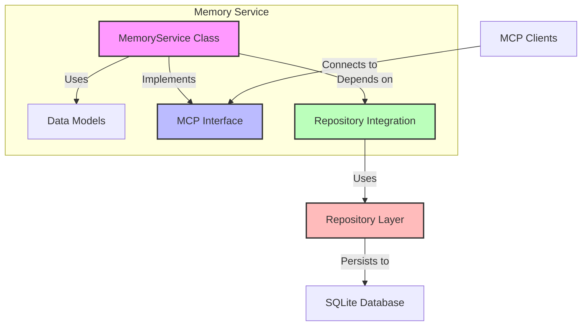

# Memory Service Specification

## Overview

The Memory Service is a core component of the Cortex Core system that provides persistence and retrieval of conversation data and user interactions. In Phase 3, the Memory Service is implemented as an in-process MCP service, setting the foundation for the distributed service in Phase 4.

This specification provides comprehensive details on how to implement the Memory Service, including its responsibilities, interfaces, tools and resources, data models, and integration with existing components.

## Service Responsibilities

The Memory Service has the following key responsibilities:

1. **Data Storage**: Store various types of data, including user inputs, conversation history, and system messages
2. **Data Retrieval**: Provide access to stored data through standardized resource patterns
3. **Data Persistence**: Interface with the repository layer to ensure data is properly persisted
4. **User Partitioning**: Enforce strict data partitioning by user ID for security and privacy
5. **Conversation Management**: Organize messages within conversations
6. **Efficient Access Patterns**: Support optimized querying patterns (e.g., limiting, sorting, filtering)

## Service Architecture

The Memory Service follows the Model Context Protocol (MCP) architecture with these components:

1. **Service Class**: The `MemoryService` class implementing MCP tools and resources
2. **Repository Integration**: Connection to the repository layer from Phase 2
3. **MCP Interface**: Tools and resources exposed through the MCP protocol
4. **Data Models**: Internal data structures for memory operations



## Dependencies

The Memory Service has the following dependencies:

1. **Repository Manager**: Provides access to data repositories from Phase 2
2. **SQLite Database**: The underlying storage mechanism (via repositories)
3. **MCP Framework**: For exposing tools and resources via the MCP protocol
4. **Logging**: For operational monitoring and debugging

## Service Initialization

The Memory Service must implement proper initialization to ensure it's ready to handle requests:

```python
async def initialize(self) -> None:
    """
    Initialize the Memory Service.

    This is called when the service is first connected to.
    """
    if self.initialized:
        return

    logger.info("Initializing Memory Service...")

    # Verify repository access
    try:
        # Test access to required repositories
        message_repo = self.repository_manager.get_repository("messages")
        workspace_repo = self.repository_manager.get_repository("workspaces")
        conversation_repo = self.repository_manager.get_repository("conversations")

        logger.info("Repository access verified")
    except Exception as e:
        logger.error(f"Failed to access repositories: {e}")
        raise

    # Set initialized flag
    self.initialized = True
    logger.info("Memory Service initialized")
```

## Service Shutdown

The service should implement a clean shutdown process:

```python
async def shutdown(self) -> None:
    """
    Shutdown the Memory Service.

    This is called when the application is shutting down.
    """
    if not self.initialized:
        return

    logger.info("Shutting down Memory Service...")

    # Perform any cleanup operations here
    # (In the in-process implementation, this may be minimal)

    # Clear initialized flag
    self.initialized = False
    logger.info("Memory Service shut down")
```

## MCP Tools

The Memory Service exposes the following tools via the MCP protocol:

### 1. `store_input`

Stores input data from a user into the repository.

**Signature**:

```python
@memory_mcp.tool()
async def store_input(self, user_id: str, input_data: Dict[str, Any]) -> Dict[str, Any]:
    """
    Store input data for a specific user.

    Args:
        user_id: The unique user identifier
        input_data: The input data to store

    Returns:
        Status object with operation result
    """
```

**Input Parameters**:

| Parameter    | Type           | Description                    | Required | Validation       |
| ------------ | -------------- | ------------------------------ | -------- | ---------------- |
| `user_id`    | str            | Unique identifier for the user | Yes      | Non-empty string |
| `input_data` | Dict[str, Any] | The data to store              | Yes      | Valid dictionary |

**Required Fields in `input_data`**:

| Field             | Type           | Description            | Required | Default      |
| ----------------- | -------------- | ---------------------- | -------- | ------------ |
| `content`         | str            | The message content    | Yes      | N/A          |
| `conversation_id` | str            | ID of the conversation | No       | `None`       |
| `timestamp`       | str            | ISO 8601 timestamp     | No       | Current time |
| `metadata`        | Dict[str, Any] | Additional metadata    | No       | `{}`         |

**Return Value**:

| Field     | Type | Description                                 |
| --------- | ---- | ------------------------------------------- |
| `status`  | str  | `"stored"` on success, `"error"` on failure |
| `user_id` | str  | The user ID from the request                |
| `item_id` | str  | ID of the stored item (on success)          |
| `error`   | str  | Error message (on failure)                  |

**Example Success Response**:

```json
{
  "status": "stored",
  "user_id": "user123",
  "item_id": "msg456"
}
```

**Example Error Response**:

```json
{
  "status": "error",
  "user_id": "user123",
  "error": "Failed to store input: database connection error"
}
```

**Implementation Requirements**:

1. Generate a UUID for the input if `id` is not provided in `input_data`
2. Add a timestamp if not provided in `input_data`
3. Get the messages repository from the repository manager
4. Create a message document with the user ID, content, and other fields
5. Store the document in the repository
6. Return a success response with the stored item ID
7. Handle errors and return appropriate error responses

**Detailed Implementation**:

```python
@memory_mcp.tool()
async def store_input(self, user_id: str, input_data: Dict[str, Any]) -> Dict[str, Any]:
    """
    Store input data for a specific user.

    Args:
        user_id: The unique user identifier
        input_data: The input data to store

    Returns:
        Status object with operation result
    """
    try:
        # Validate user_id
        if not user_id:
            return {
                "status": "error",
                "user_id": "",
                "error": "User ID is required"
            }

        # Validate input_data
        if not input_data:
            return {
                "status": "error",
                "user_id": user_id,
                "error": "Input data is required"
            }

        # Add ID if not present
        if "id" not in input_data:
            input_data["id"] = str(uuid.uuid4())

        # Add timestamp if not present
        if "timestamp" not in input_data:
            input_data["timestamp"] = datetime.now().isoformat()

        # Get the appropriate repository
        message_repo = self.repository_manager.get_repository("messages")

        # Create the message data
        message_data = {
            "user_id": user_id,
            "content": input_data.get("content", ""),
            "conversation_id": input_data.get("conversation_id"),
            "timestamp": input_data["timestamp"],
            "metadata": input_data.get("metadata", {})
        }

        # Store the input
        message_id = await message_repo.create(message_data)

        logger.info(f"Stored input for user {user_id}: {message_id}")

        # Return success status
        return {
            "status": "stored",
            "user_id": user_id,
            "item_id": message_id
        }
    except Exception as e:
        logger.error(f"Error storing input for user {user_id}: {e}")

        # Return error status
        return {
            "status": "error",
            "user_id": user_id,
            "error": str(e)
        }
```

### 2. `update_message`

Updates an existing message in the repository.

**Signature**:

```python
@memory_mcp.tool()
async def update_message(
    self,
    user_id: str,
    message_id: str,
    updates: Dict[str, Any]
) -> Dict[str, Any]:
    """
    Update an existing message.

    Args:
        user_id: The unique user identifier
        message_id: The ID of the message to update
        updates: The fields to update

    Returns:
        Status object with operation result
    """
```

**Input Parameters**:

| Parameter    | Type           | Description                    | Required | Validation       |
| ------------ | -------------- | ------------------------------ | -------- | ---------------- |
| `user_id`    | str            | Unique identifier for the user | Yes      | Non-empty string |
| `message_id` | str            | ID of the message to update    | Yes      | Non-empty string |
| `updates`    | Dict[str, Any] | Fields to update               | Yes      | Valid dictionary |

**Allowed Update Fields**:

| Field      | Type           | Description         | Constraints      |
| ---------- | -------------- | ------------------- | ---------------- |
| `content`  | str            | The message content | Non-empty string |
| `metadata` | Dict[str, Any] | Additional metadata | Valid dictionary |

**Return Value**:

| Field        | Type | Description                                  |
| ------------ | ---- | -------------------------------------------- |
| `status`     | str  | `"updated"` on success, `"error"` on failure |
| `user_id`    | str  | The user ID from the request                 |
| `message_id` | str  | ID of the updated message                    |
| `error`      | str  | Error message (on failure)                   |

**Example Success Response**:

```json
{
  "status": "updated",
  "user_id": "user123",
  "message_id": "msg456"
}
```

**Example Error Response**:

```json
{
  "status": "error",
  "user_id": "user123",
  "message_id": "msg456",
  "error": "Message not found"
}
```

**Implementation Requirements**:

1. Get the messages repository from the repository manager
2. Verify the message exists and belongs to the user
3. Apply the updates to the message
4. Return a success response with the message ID
5. Handle errors and return appropriate error responses

**Detailed Implementation**:

```python
@memory_mcp.tool()
async def update_message(
    self,
    user_id: str,
    message_id: str,
    updates: Dict[str, Any]
) -> Dict[str, Any]:
    """
    Update an existing message.

    Args:
        user_id: The unique user identifier
        message_id: The ID of the message to update
        updates: The fields to update

    Returns:
        Status object with operation result
    """
    try:
        # Validate parameters
        if not user_id or not message_id or not updates:
            return {
                "status": "error",
                "user_id": user_id,
                "message_id": message_id,
                "error": "User ID, message ID, and updates are required"
            }

        # Get the messages repository
        message_repo = self.repository_manager.get_repository("messages")

        # Find the message
        message = await message_repo.find_one({
            "id": message_id,
            "user_id": user_id
        })

        if not message:
            return {
                "status": "error",
                "user_id": user_id,
                "message_id": message_id,
                "error": "Message not found or access denied"
            }

        # Create update object with only allowed fields
        update_data = {}

        if "content" in updates:
            update_data["content"] = updates["content"]

        if "metadata" in updates:
            # Merge existing metadata with updates
            metadata = {
                **(message.get("metadata") or {}),
                **updates["metadata"]
            }
            update_data["metadata"] = metadata

        # Add update timestamp
        update_data["updated_at"] = datetime.now().isoformat()

        # Update the message
        updated = await message_repo.update(
            {"id": message_id, "user_id": user_id},
            {"$set": update_data}
        )

        if updated:
            logger.info(f"Updated message {message_id} for user {user_id}")
            return {
                "status": "updated",
                "user_id": user_id,
                "message_id": message_id
            }
        else:
            return {
                "status": "error",
                "user_id": user_id,
                "message_id": message_id,
                "error": "Failed to update message"
            }
    except Exception as e:
        logger.error(f"Error updating message {message_id} for user {user_id}: {e}")

        return {
            "status": "error",
            "user_id": user_id,
            "message_id": message_id,
            "error": str(e)
        }
```

### 3. `delete_message`

Deletes a message from the repository.

**Signature**:

```python
@memory_mcp.tool()
async def delete_message(self, user_id: str, message_id: str) -> Dict[str, Any]:
    """
    Delete a message.

    Args:
        user_id: The unique user identifier
        message_id: The ID of the message to delete

    Returns:
        Status object with operation result
    """
```

**Input Parameters**:

| Parameter    | Type | Description                    | Required | Validation       |
| ------------ | ---- | ------------------------------ | -------- | ---------------- |
| `user_id`    | str  | Unique identifier for the user | Yes      | Non-empty string |
| `message_id` | str  | ID of the message to delete    | Yes      | Non-empty string |

**Return Value**:

| Field        | Type | Description                                  |
| ------------ | ---- | -------------------------------------------- |
| `status`     | str  | `"deleted"` on success, `"error"` on failure |
| `user_id`    | str  | The user ID from the request                 |
| `message_id` | str  | ID of the deleted message                    |
| `error`      | str  | Error message (on failure)                   |

**Example Success Response**:

```json
{
  "status": "deleted",
  "user_id": "user123",
  "message_id": "msg456"
}
```

**Example Error Response**:

```json
{
  "status": "error",
  "user_id": "user123",
  "message_id": "msg456",
  "error": "Message not found"
}
```

**Implementation Requirements**:

1. Get the messages repository from the repository manager
2. Verify the message exists and belongs to the user
3. Delete the message from the repository
4. Return a success response with the message ID
5. Handle errors and return appropriate error responses

**Detailed Implementation**:

```python
@memory_mcp.tool()
async def delete_message(self, user_id: str, message_id: str) -> Dict[str, Any]:
    """
    Delete a message.

    Args:
        user_id: The unique user identifier
        message_id: The ID of the message to delete

    Returns:
        Status object with operation result
    """
    try:
        # Validate parameters
        if not user_id or not message_id:
            return {
                "status": "error",
                "user_id": user_id,
                "message_id": message_id,
                "error": "User ID and message ID are required"
            }

        # Get the messages repository
        message_repo = self.repository_manager.get_repository("messages")

        # Delete the message
        deleted = await message_repo.delete_one({
            "id": message_id,
            "user_id": user_id
        })

        if deleted:
            logger.info(f"Deleted message {message_id} for user {user_id}")
            return {
                "status": "deleted",
                "user_id": user_id,
                "message_id": message_id
            }
        else:
            return {
                "status": "error",
                "user_id": user_id,
                "message_id": message_id,
                "error": "Message not found or access denied"
            }
    except Exception as e:
        logger.error(f"Error deleting message {message_id} for user {user_id}: {e}")

        return {
            "status": "error",
            "user_id": user_id,
            "message_id": message_id,
            "error": str(e)
        }
```

## MCP Resources

The Memory Service exposes the following resources via the MCP protocol:

### 1. `history/{user_id}`

Retrieves the complete history for a user.

**Signature**:

```python
@memory_mcp.resource("history/{user_id}")
async def get_history(self, user_id: str) -> List[Dict[str, Any]]:
    """
    Get history for a specific user.

    Args:
        user_id: The unique user identifier

    Returns:
        List containing the user's history
    """
```

**Parameters**:

| Parameter | Type | Description                    | Required | Source   |
| --------- | ---- | ------------------------------ | -------- | -------- |
| `user_id` | str  | Unique identifier for the user | Yes      | URI path |

**Return Value**:
A list of message objects.

**Example Response**:

```json
[
  {
    "id": "msg123",
    "user_id": "user456",
    "content": "Hello, world!",
    "conversation_id": "conv789",
    "timestamp": "2023-01-01T12:00:00Z",
    "metadata": {
      "source": "web-client"
    }
  },
  {
    "id": "msg124",
    "user_id": "user456",
    "content": "How are you today?",
    "conversation_id": "conv789",
    "timestamp": "2023-01-01T12:01:00Z",
    "metadata": {
      "source": "web-client"
    }
  }
]
```

**Implementation Requirements**:

1. Get the messages repository from the repository manager
2. Query for all messages associated with the user
3. Return the list of messages
4. Handle errors and return an empty list on failure

**Detailed Implementation**:

```python
@memory_mcp.resource("history/{user_id}")
async def get_history(self, user_id: str) -> List[Dict[str, Any]]:
    """
    Get history for a specific user.

    Args:
        user_id: The unique user identifier

    Returns:
        List containing the user's history
    """
    try:
        # Validate user_id
        if not user_id:
            logger.error("Empty user ID provided to get_history")
            return []

        # Get the messages repository
        message_repo = self.repository_manager.get_repository("messages")

        # Find all messages for the user
        messages = await message_repo.find_many(
            {"user_id": user_id},
            sort=[("timestamp", 1)]  # Sort by timestamp ascending
        )

        logger.info(f"Retrieved history for user {user_id}: {len(messages)} messages")
        return messages
    except Exception as e:
        logger.error(f"Error retrieving history for user {user_id}: {e}")
        return []
```

### 2. `history/{user_id}/limit/{limit}`

Retrieves a limited number of the most recent messages for a user.

**Signature**:

```python
@memory_mcp.resource("history/{user_id}/limit/{limit}")
async def get_limited_history(self, user_id: str, limit: str) -> List[Dict[str, Any]]:
    """
    Get limited history for a specific user.

    Args:
        user_id: The unique user identifier
        limit: Maximum number of items to return (as string)

    Returns:
        List containing the user's limited history
    """
```

**Parameters**:

| Parameter | Type | Description                          | Required | Source   |
| --------- | ---- | ------------------------------------ | -------- | -------- |
| `user_id` | str  | Unique identifier for the user       | Yes      | URI path |
| `limit`   | str  | Maximum number of messages to return | Yes      | URI path |

**Return Value**:
A list of message objects, with a maximum length of `limit`.

**Example Response**:

```json
[
  {
    "id": "msg125",
    "user_id": "user456",
    "content": "What's the weather today?",
    "conversation_id": "conv789",
    "timestamp": "2023-01-01T12:05:00Z",
    "metadata": {
      "source": "web-client"
    }
  },
  {
    "id": "msg124",
    "user_id": "user456",
    "content": "How are you today?",
    "conversation_id": "conv789",
    "timestamp": "2023-01-01T12:01:00Z",
    "metadata": {
      "source": "web-client"
    }
  }
]
```

**Implementation Requirements**:

1. Convert the `limit` parameter from string to integer
2. Get the messages repository from the repository manager
3. Query for messages associated with the user, limited to the specified number
4. Sort by timestamp in descending order to get the most recent messages
5. Return the list of messages
6. Handle errors and return an empty list on failure

**Detailed Implementation**:

```python
@memory_mcp.resource("history/{user_id}/limit/{limit}")
async def get_limited_history(self, user_id: str, limit: str) -> List[Dict[str, Any]]:
    """
    Get limited history for a specific user.

    Args:
        user_id: The unique user identifier
        limit: Maximum number of items to return (as string)

    Returns:
        List containing the user's limited history
    """
    try:
        # Validate user_id
        if not user_id:
            logger.error("Empty user ID provided to get_limited_history")
            return []

        # Convert limit to integer
        try:
            limit_int = int(limit)
            if limit_int <= 0:
                raise ValueError("Limit must be positive")
        except ValueError as e:
            logger.error(f"Invalid limit parameter: {e}")
            limit_int = 10  # Default limit

        # Get the messages repository
        message_repo = self.repository_manager.get_repository("messages")

        # Find messages for the user with limit
        messages = await message_repo.find_many(
            {"user_id": user_id},
            limit=limit_int,
            sort=[("timestamp", -1)]  # Sort by timestamp descending
        )

        logger.info(f"Retrieved limited history for user {user_id}: {len(messages)} messages (limit {limit})")
        return messages
    except Exception as e:
        logger.error(f"Error retrieving limited history for user {user_id}: {e}")
        return []
```

### 3. `conversation/{conversation_id}`

Retrieves all messages for a specific conversation.

**Signature**:

```python
@memory_mcp.resource("conversation/{conversation_id}")
async def get_conversation(self, conversation_id: str) -> List[Dict[str, Any]]:
    """
    Get messages for a specific conversation.

    Args:
        conversation_id: The unique conversation identifier

    Returns:
        List containing the conversation messages
    """
```

**Parameters**:

| Parameter         | Type | Description                            | Required | Source   |
| ----------------- | ---- | -------------------------------------- | -------- | -------- |
| `conversation_id` | str  | Unique identifier for the conversation | Yes      | URI path |

**Return Value**:
A list of message objects for the conversation.

**Example Response**:

```json
[
  {
    "id": "msg123",
    "user_id": "user456",
    "content": "Hello, world!",
    "conversation_id": "conv789",
    "timestamp": "2023-01-01T12:00:00Z",
    "metadata": {
      "source": "web-client"
    }
  },
  {
    "id": "msg124",
    "user_id": "user456",
    "content": "How are you today?",
    "conversation_id": "conv789",
    "timestamp": "2023-01-01T12:01:00Z",
    "metadata": {
      "source": "web-client"
    }
  }
]
```

**Implementation Requirements**:

1. Get the messages repository from the repository manager
2. Query for all messages associated with the conversation
3. Sort by timestamp in ascending order for chronological display
4. Return the list of messages
5. Handle errors and return an empty list on failure

**Detailed Implementation**:

```python
@memory_mcp.resource("conversation/{conversation_id}")
async def get_conversation(self, conversation_id: str) -> List[Dict[str, Any]]:
    """
    Get messages for a specific conversation.

    Args:
        conversation_id: The unique conversation identifier

    Returns:
        List containing the conversation messages
    """
    try:
        # Validate conversation_id
        if not conversation_id:
            logger.error("Empty conversation ID provided to get_conversation")
            return []

        # Get the messages repository
        message_repo = self.repository_manager.get_repository("messages")

        # Find all messages for the conversation
        messages = await message_repo.find_many(
            {"conversation_id": conversation_id},
            sort=[("timestamp", 1)]  # Sort by timestamp ascending
        )

        logger.info(f"Retrieved conversation {conversation_id}: {len(messages)} messages")
        return messages
    except Exception as e:
        logger.error(f"Error retrieving conversation {conversation_id}: {e}")
        return []
```

### 4. `conversation/{conversation_id}/user/{user_id}`

Retrieves all messages for a specific conversation, filtered by user.

**Signature**:

```python
@memory_mcp.resource("conversation/{conversation_id}/user/{user_id}")
async def get_conversation_for_user(self, conversation_id: str, user_id: str) -> List[Dict[str, Any]]:
    """
    Get messages for a specific conversation and user.

    Args:
        conversation_id: The unique conversation identifier
        user_id: The unique user identifier

    Returns:
        List containing the conversation messages for the user
    """
```

**Parameters**:

| Parameter         | Type | Description                            | Required | Source   |
| ----------------- | ---- | -------------------------------------- | -------- | -------- |
| `conversation_id` | str  | Unique identifier for the conversation | Yes      | URI path |
| `user_id`         | str  | Unique identifier for the user         | Yes      | URI path |

**Return Value**:
A list of message objects for the conversation, filtered by user.

**Example Response**:

```json
[
  {
    "id": "msg123",
    "user_id": "user456",
    "content": "Hello, world!",
    "conversation_id": "conv789",
    "timestamp": "2023-01-01T12:00:00Z",
    "metadata": {
      "source": "web-client"
    }
  },
  {
    "id": "msg124",
    "user_id": "user456",
    "content": "How are you today?",
    "conversation_id": "conv789",
    "timestamp": "2023-01-01T12:01:00Z",
    "metadata": {
      "source": "web-client"
    }
  }
]
```

**Implementation Requirements**:

1. Get the messages repository from the repository manager
2. Query for messages that match both the conversation ID and user ID
3. Sort by timestamp in ascending order for chronological display
4. Return the list of messages
5. Handle errors and return an empty list on failure

**Detailed Implementation**:

```python
@memory_mcp.resource("conversation/{conversation_id}/user/{user_id}")
async def get_conversation_for_user(self, conversation_id: str, user_id: str) -> List[Dict[str, Any]]:
    """
    Get messages for a specific conversation and user.

    Args:
        conversation_id: The unique conversation identifier
        user_id: The unique user identifier

    Returns:
        List containing the conversation messages for the user
    """
    try:
        # Validate parameters
        if not conversation_id or not user_id:
            logger.error("Empty conversation ID or user ID provided to get_conversation_for_user")
            return []

        # Get the messages repository
        message_repo = self.repository_manager.get_repository("messages")

        # Find messages for the conversation and user
        messages = await message_repo.find_many(
            {
                "conversation_id": conversation_id,
                "user_id": user_id
            },
            sort=[("timestamp", 1)]  # Sort by timestamp ascending
        )

        logger.info(f"Retrieved conversation {conversation_id} for user {user_id}: {len(messages)} messages")
        return messages
    except Exception as e:
        logger.error(f"Error retrieving conversation {conversation_id} for user {user_id}: {e}")
        return []
```

### 5. `message/{message_id}`

Retrieves a single message by its ID.

**Signature**:

```python
@memory_mcp.resource("message/{message_id}")
async def get_message(self, message_id: str) -> Optional[Dict[str, Any]]:
    """
    Get a specific message by ID.

    Args:
        message_id: The unique message identifier

    Returns:
        The message or None if not found
    """
```

**Parameters**:

| Parameter    | Type | Description                       | Required | Source   |
| ------------ | ---- | --------------------------------- | -------- | -------- |
| `message_id` | str  | Unique identifier for the message | Yes      | URI path |

**Return Value**:
The message object if found, or `None` if not found.

**Example Response**:

```json
{
  "id": "msg123",
  "user_id": "user456",
  "content": "Hello, world!",
  "conversation_id": "conv789",
  "timestamp": "2023-01-01T12:00:00Z",
  "metadata": {
    "source": "web-client"
  }
}
```

**Implementation Requirements**:

1. Get the messages repository from the repository manager
2. Query for the message with the specified ID
3. Return the message if found, or `None` if not found
4. Handle errors and return `None` on failure

**Detailed Implementation**:

```python
@memory_mcp.resource("message/{message_id}")
async def get_message(self, message_id: str) -> Optional[Dict[str, Any]]:
    """
    Get a specific message by ID.

    Args:
        message_id: The unique message identifier

    Returns:
        The message or None if not found
    """
    try:
        # Validate message_id
        if not message_id:
            logger.error("Empty message ID provided to get_message")
            return None

        # Get the messages repository
        message_repo = self.repository_manager.get_repository("messages")

        # Find the message
        message = await message_repo.find_one({"id": message_id})

        if message:
            logger.info(f"Retrieved message {message_id}")
        else:
            logger.info(f"Message {message_id} not found")

        return message
    except Exception as e:
        logger.error(f"Error retrieving message {message_id}: {e}")
        return None
```

## Complete Memory Service Implementation

Here's a complete implementation of the Memory Service:

```python
# app/services/memory.py

import logging
import uuid
from datetime import datetime
from typing import Dict, List, Any, Optional

from app.core.mcp.decorators import FastMCP
from app.core.repository import RepositoryManager

logger = logging.getLogger(__name__)

# Create FastMCP instance for the Memory Service
memory_mcp = FastMCP("Memory")

@memory_mcp.implements
class MemoryService:
    """
    MCP service for memory operations.

    This service provides tools and resources for storing and retrieving data.
    """

    def __init__(self, repository_manager: RepositoryManager):
        """
        Initialize the Memory Service.

        Args:
            repository_manager: The repository manager for data access
        """
        self.repository_manager = repository_manager
        self.initialized = False
        logger.info("Memory service created")

    async def initialize(self) -> None:
        """
        Initialize the Memory Service.

        This is called when the service is first connected to.
        """
        if self.initialized:
            return

        logger.info("Initializing Memory Service...")

        # Verify repository access
        try:
            # Test access to required repositories
            message_repo = self.repository_manager.get_repository("messages")
            workspace_repo = self.repository_manager.get_repository("workspaces")
            conversation_repo = self.repository_manager.get_repository("conversations")

            logger.info("Repository access verified")
        except Exception as e:
            logger.error(f"Failed to access repositories: {e}")
            raise

        # Set initialized flag
        self.initialized = True
        logger.info("Memory Service initialized")

    async def shutdown(self) -> None:
        """
        Shutdown the Memory Service.

        This is called when the application is shutting down.
        """
        if not self.initialized:
            return

        logger.info("Shutting down Memory Service...")

        # Perform any cleanup operations here
        # (In the in-process implementation, this may be minimal)

        # Clear initialized flag
        self.initialized = False
        logger.info("Memory Service shut down")

    @memory_mcp.tool()
    async def store_input(self, user_id: str, input_data: Dict[str, Any]) -> Dict[str, Any]:
        """
        Store input data for a specific user.

        Args:
            user_id: The unique user identifier
            input_data: The input data to store

        Returns:
            Status object with operation result
        """
        try:
            # Validate user_id
            if not user_id:
                return {
                    "status": "error",
                    "user_id": "",
                    "error": "User ID is required"
                }

            # Validate input_data
            if not input_data:
                return {
                    "status": "error",
                    "user_id": user_id,
                    "error": "Input data is required"
                }

            # Add ID if not present
            if "id" not in input_data:
                input_data["id"] = str(uuid.uuid4())

            # Add timestamp if not present
            if "timestamp" not in input_data:
                input_data["timestamp"] = datetime.now().isoformat()

            # Get the appropriate repository
            message_repo = self.repository_manager.get_repository("messages")

            # Create the message data
            message_data = {
                "user_id": user_id,
                "content": input_data.get("content", ""),
                "conversation_id": input_data.get("conversation_id"),
                "timestamp": input_data["timestamp"],
                "metadata": input_data.get("metadata", {})
            }

            # Store the input
            message_id = await message_repo.create(message_data)

            logger.info(f"Stored input for user {user_id}: {message_id}")

            # Return success status
            return {
                "status": "stored",
                "user_id": user_id,
                "item_id": message_id
            }
        except Exception as e:
            logger.error(f"Error storing input for user {user_id}: {e}")

            # Return error status
            return {
                "status": "error",
                "user_id": user_id,
                "error": str(e)
            }

    @memory_mcp.tool()
    async def update_message(
        self,
        user_id: str,
        message_id: str,
        updates: Dict[str, Any]
    ) -> Dict[str, Any]:
        """
        Update an existing message.

        Args:
            user_id: The unique user identifier
            message_id: The ID of the message to update
            updates: The fields to update

        Returns:
            Status object with operation result
        """
        try:
            # Validate parameters
            if not user_id or not message_id or not updates:
                return {
                    "status": "error",
                    "user_id": user_id,
                    "message_id": message_id,
                    "error": "User ID, message ID, and updates are required"
                }

            # Get the messages repository
            message_repo = self.repository_manager.get_repository("messages")

            # Find the message
            message = await message_repo.find_one({
                "id": message_id,
                "user_id": user_id
            })

            if not message:
                return {
                    "status": "error",
                    "user_id": user_id,
                    "message_id": message_id,
                    "error": "Message not found or access denied"
                }

            # Create update object with only allowed fields
            update_data = {}

            if "content" in updates:
                update_data["content"] = updates["content"]

            if "metadata" in updates:
                # Merge existing metadata with updates
                metadata = {
                    **(message.get("metadata") or {}),
                    **updates["metadata"]
                }
                update_data["metadata"] = metadata

            # Add update timestamp
            update_data["updated_at"] = datetime.now().isoformat()

            # Update the message
            updated = await message_repo.update(
                {"id": message_id, "user_id": user_id},
                {"$set": update_data}
            )

            if updated:
                logger.info(f"Updated message {message_id} for user {user_id}")
                return {
                    "status": "updated",
                    "user_id": user_id,
                    "message_id": message_id
                }
            else:
                return {
                    "status": "error",
                    "user_id": user_id,
                    "message_id": message_id,
                    "error": "Failed to update message"
                }
        except Exception as e:
            logger.error(f"Error updating message {message_id} for user {user_id}: {e}")

            return {
                "status": "error",
                "user_id": user_id,
                "message_id": message_id,
                "error": str(e)
            }

    @memory_mcp.tool()
    async def delete_message(self, user_id: str, message_id: str) -> Dict[str, Any]:
        """
        Delete a message.

        Args:
            user_id: The unique user identifier
            message_id: The ID of the message to delete

        Returns:
            Status object with operation result
        """
        try:
            # Validate parameters
            if not user_id or not message_id:
                return {
                    "status": "error",
                    "user_id": user_id,
                    "message_id": message_id,
                    "error": "User ID and message ID are required"
                }

            # Get the messages repository
            message_repo = self.repository_manager.get_repository("messages")

            # Delete the message
            deleted = await message_repo.delete_one({
                "id": message_id,
                "user_id": user_id
            })

            if deleted:
                logger.info(f"Deleted message {message_id} for user {user_id}")
                return {
                    "status": "deleted",
                    "user_id": user_id,
                    "message_id": message_id
                }
            else:
                return {
                    "status": "error",
                    "user_id": user_id,
                    "message_id": message_id,
                    "error": "Message not found or access denied"
                }
        except Exception as e:
            logger.error(f"Error deleting message {message_id} for user {user_id}: {e}")

            return {
                "status": "error",
                "user_id": user_id,
                "message_id": message_id,
                "error": str(e)
            }

    @memory_mcp.resource("history/{user_id}")
    async def get_history(self, user_id: str) -> List[Dict[str, Any]]:
        """
        Get history for a specific user.

        Args:
            user_id: The unique user identifier

        Returns:
            List containing the user's history
        """
        try:
            # Validate user_id
            if not user_id:
                logger.error("Empty user ID provided to get_history")
                return []

            # Get the messages repository
            message_repo = self.repository_manager.get_repository("messages")

            # Find all messages for the user
            messages = await message_repo.find_many(
                {"user_id": user_id},
                sort=[("timestamp", 1)]  # Sort by timestamp ascending
            )

            logger.info(f"Retrieved history for user {user_id}: {len(messages)} messages")
            return messages
        except Exception as e:
            logger.error(f"Error retrieving history for user {user_id}: {e}")
            return []

    @memory_mcp.resource("history/{user_id}/limit/{limit}")
    async def get_limited_history(self, user_id: str, limit: str) -> List[Dict[str, Any]]:
        """
        Get limited history for a specific user.

        Args:
            user_id: The unique user identifier
            limit: Maximum number of items to return (as string)

        Returns:
            List containing the user's limited history
        """
        try:
            # Validate user_id
            if not user_id:
                logger.error("Empty user ID provided to get_limited_history")
                return []

            # Convert limit to integer
            try:
                limit_int = int(limit)
                if limit_int <= 0:
                    raise ValueError("Limit must be positive")
            except ValueError as e:
                logger.error(f"Invalid limit parameter: {e}")
                limit_int = 10  # Default limit

            # Get the messages repository
            message_repo = self.repository_manager.get_repository("messages")

            # Find messages for the user with limit
            messages = await message_repo.find_many(
                {"user_id": user_id},
                limit=limit_int,
                sort=[("timestamp", -1)]  # Sort by timestamp descending
            )

            logger.info(f"Retrieved limited history for user {user_id}: {len(messages)} messages (limit {limit})")
            return messages
        except Exception as e:
            logger.error(f"Error retrieving limited history for user {user_id}: {e}")
            return []

    @memory_mcp.resource("conversation/{conversation_id}")
    async def get_conversation(self, conversation_id: str) -> List[Dict[str, Any]]:
        """
        Get messages for a specific conversation.

        Args:
            conversation_id: The unique conversation identifier

        Returns:
            List containing the conversation messages
        """
        try:
            # Validate conversation_id
            if not conversation_id:
                logger.error("Empty conversation ID provided to get_conversation")
                return []

            # Get the messages repository
            message_repo = self.repository_manager.get_repository("messages")

            # Find all messages for the conversation
            messages = await message_repo.find_many(
                {"conversation_id": conversation_id},
                sort=[("timestamp", 1)]  # Sort by timestamp ascending
            )

            logger.info(f"Retrieved conversation {conversation_id}: {len(messages)} messages")
            return messages
        except Exception as e:
            logger.error(f"Error retrieving conversation {conversation_id}: {e}")
            return []

    @memory_mcp.resource("conversation/{conversation_id}/user/{user_id}")
    async def get_conversation_for_user(self, conversation_id: str, user_id: str) -> List[Dict[str, Any]]:
        """
        Get messages for a specific conversation and user.

        Args:
            conversation_id: The unique conversation identifier
            user_id: The unique user identifier

        Returns:
            List containing the conversation messages for the user
        """
        try:
            # Validate parameters
            if not conversation_id or not user_id:
                logger.error("Empty conversation ID or user ID provided to get_conversation_for_user")
                return []

            # Get the messages repository
            message_repo = self.repository_manager.get_repository("messages")

            # Find messages for the conversation and user
            messages = await message_repo.find_many(
                {
                    "conversation_id": conversation_id,
                    "user_id": user_id
                },
                sort=[("timestamp", 1)]  # Sort by timestamp ascending
            )

            logger.info(f"Retrieved conversation {conversation_id} for user {user_id}: {len(messages)} messages")
            return messages
        except Exception as e:
            logger.error(f"Error retrieving conversation {conversation_id} for user {user_id}: {e}")
            return []

    @memory_mcp.resource("message/{message_id}")
    async def get_message(self, message_id: str) -> Optional[Dict[str, Any]]:
        """
        Get a specific message by ID.

        Args:
            message_id: The unique message identifier

        Returns:
            The message or None if not found
        """
        try:
            # Validate message_id
            if not message_id:
                logger.error("Empty message ID provided to get_message")
                return None

            # Get the messages repository
            message_repo = self.repository_manager.get_repository("messages")

            # Find the message
            message = await message_repo.find_one({"id": message_id})

            if message:
                logger.info(f"Retrieved message {message_id}")
            else:
                logger.info(f"Message {message_id} not found")

            return message
        except Exception as e:
            logger.error(f"Error retrieving message {message_id}: {e}")
            return None
```

## Repository Layer Integration

The Memory Service relies on the repository layer implemented in Phase 2, which provides the following functionality:

### Repository Manager

The `RepositoryManager` class is responsible for managing access to repositories:

```python
# app/core/repository.py

class RepositoryManager:
    """
    Manager for repository instances.
    """

    def __init__(self):
        """Initialize the repository manager."""
        self.repositories = {}

    async def initialize(self) -> None:
        """Initialize the repository manager."""
        pass

    def get_repository(self, name: str) -> 'Repository':
        """
        Get a repository by name.

        Args:
            name: The name of the repository

        Returns:
            The repository instance

        Raises:
            ValueError: If the repository does not exist
        """
        if name not in self.repositories:
            # Create the repository on demand
            if name == "messages":
                self.repositories[name] = MessageRepository()
            elif name == "workspaces":
                self.repositories[name] = WorkspaceRepository()
            elif name == "conversations":
                self.repositories[name] = ConversationRepository()
            else:
                raise ValueError(f"Unknown repository: {name}")

        return self.repositories[name]
```

### Repository Interface

Each repository implements the `Repository` interface:

```python
class Repository:
    """
    Abstract base class for repositories.
    """

    async def create(self, data: Dict[str, Any]) -> str:
        """
        Create a new item.

        Args:
            data: The item data

        Returns:
            The ID of the created item
        """
        pass

    async def find_one(self, query: Dict[str, Any]) -> Optional[Dict[str, Any]]:
        """
        Find a single item matching the query.

        Args:
            query: The query criteria

        Returns:
            The matching item or None if not found
        """
        pass

    async def find_many(
        self,
        query: Dict[str, Any],
        limit: Optional[int] = None,
        sort: Optional[List[Tuple[str, int]]] = None
    ) -> List[Dict[str, Any]]:
        """
        Find multiple items matching the query.

        Args:
            query: The query criteria
            limit: Optional maximum number of items to return
            sort: Optional sort criteria (list of (field, direction) tuples)

        Returns:
            List of matching items
        """
        pass

    async def update(
        self,
        query: Dict[str, Any],
        update: Dict[str, Any]
    ) -> bool:
        """
        Update items matching the query.

        Args:
            query: The query criteria
            update: The update operations

        Returns:
            True if any items were updated, False otherwise
        """
        pass

    async def delete_one(self, query: Dict[str, Any]) -> bool:
        """
        Delete a single item matching the query.

        Args:
            query: The query criteria

        Returns:
            True if an item was deleted, False otherwise
        """
        pass
```

## Error Handling

The Memory Service implements a robust error handling strategy:

1. **Error Detection and Logging**: All exceptions are caught, logged, and handled appropriately
2. **Error Response Format**: Tool errors use a consistent format with `status`, `error`, and context fields
3. **Graceful Degradation**: Resources return empty lists or `None` on error to prevent cascade failures
4. **Parameter Validation**: All parameters are validated before use to prevent errors
5. **Repository Error Handling**: Repository errors are caught and handled without crashing the service

### Error Response Examples

For tools:

```json
{
  "status": "error",
  "user_id": "user123",
  "error": "Database connection failed"
}
```

For resources, simply return an empty result:

```json
[]
```

## Performance Considerations

The Memory Service is designed for optimal performance:

1. **Selective Loading**: Resources like `get_limited_history` support pagination to reduce payload size
2. **Indexed Queries**: Queries use fields that should be indexed in the repository layer
3. **Sorting Optimization**: Sort orders match expected repository indexes
4. **Minimal Processing**: Data is passed through with minimal transformation to reduce overhead
5. **Efficient Filtering**: Filters are applied at the database level, not in code
6. **Error Short-Circuiting**: Validation errors return immediately without database queries

## Integration with Cortex Core

To integrate the Memory Service with the Cortex Core:

1. **Service Registration**:

```python
# app/main.py

@app.on_event("startup")
async def startup_event():
    """Application startup event handler."""
    # Initialize repository manager
    repository_manager = RepositoryManager()
    await repository_manager.initialize()

    # Create and register Memory Service
    memory_service = MemoryService(repository_manager)
    service_registry.register_service("memory", memory_service)
```

2. **Client Usage**:

```python
# Example in app/api/input.py

# Get Memory client
memory_client = service_registry.get_client("memory")

# Store input
result = await memory_client.call_tool("store_input", {
    "user_id": user_id,
    "input_data": input_data
})

# Check result
if result.get("status") == "stored":
    logger.info(f"Input stored successfully: {result.get('item_id')}")
else:
    logger.error(f"Failed to store input: {result.get('error')}")
```

## Testing the Memory Service

### Unit Tests

```python
# tests/unit/services/test_memory_service.py

import pytest
from unittest.mock import AsyncMock, MagicMock
from app.services.memory import MemoryService

class TestMemoryService:
    """Tests for the Memory Service."""

    @pytest.fixture
    def mock_repository_manager(self):
        """Create a mock repository manager."""
        manager = MagicMock()

        # Create mock repositories
        message_repo = MagicMock()
        workspace_repo = MagicMock()
        conversation_repo = MagicMock()

        # Set up repository manager to return the mock repositories
        manager.get_repository = MagicMock(side_effect=lambda name: {
            "messages": message_repo,
            "workspaces": workspace_repo,
            "conversations": conversation_repo
        }.get(name))

        return manager, message_repo, workspace_repo, conversation_repo

    @pytest.mark.asyncio
    async def test_initialize(self, mock_repository_manager):
        """Test service initialization."""
        manager, _, _, _ = mock_repository_manager
        service = MemoryService(manager)

        await service.initialize()

        assert service.initialized
        assert manager.get_repository.call_count == 3

    @pytest.mark.asyncio
    async def test_store_input(self, mock_repository_manager):
        """Test storing input."""
        manager, message_repo, _, _ = mock_repository_manager
        message_repo.create = AsyncMock(return_value="message_id")

        service = MemoryService(manager)
        await service.initialize()

        # Test with valid input
        result = await service.store_input("user123", {
            "content": "Hello, world!",
            "conversation_id": "conv456",
            "metadata": {"source": "test"}
        })

        # Verify repository was called
        manager.get_repository.assert_called_with("messages")
        message_repo.create.assert_called_once()

        # Verify the message data
        call_args = message_repo.create.call_args[0][0]
        assert call_args["user_id"] == "user123"
        assert call_args["content"] == "Hello, world!"
        assert call_args["conversation_id"] == "conv456"
        assert call_args["metadata"] == {"source": "test"}
        assert "timestamp" in call_args

        # Verify the result
        assert result["status"] == "stored"
        assert result["user_id"] == "user123"
        assert result["item_id"] == "message_id"

    @pytest.mark.asyncio
    async def test_store_input_missing_user_id(self, mock_repository_manager):
        """Test storing input with missing user ID."""
        manager, message_repo, _, _ = mock_repository_manager
        service = MemoryService(manager)
        await service.initialize()

        # Test with missing user ID
        result = await service.store_input("", {
            "content": "Hello, world!"
        })

        # Verify error response
        assert result["status"] == "error"
        assert "User ID is required" in result["error"]

        # Verify repository was not called
        message_repo.create.assert_not_called()

    @pytest.mark.asyncio
    async def test_store_input_repository_error(self, mock_repository_manager):
        """Test handling repository errors when storing input."""
        manager, message_repo, _, _ = mock_repository_manager
        message_repo.create = AsyncMock(side_effect=Exception("Database error"))

        service = MemoryService(manager)
        await service.initialize()

        # Test with valid input but repository error
        result = await service.store_input("user123", {
            "content": "Hello, world!"
        })

        # Verify error response
        assert result["status"] == "error"
        assert result["user_id"] == "user123"
        assert "Database error" in result["error"]

    @pytest.mark.asyncio
    async def test_update_message(self, mock_repository_manager):
        """Test updating a message."""
        manager, message_repo, _, _ = mock_repository_manager
        message_repo.find_one = AsyncMock(return_value={
            "id": "msg123",
            "user_id": "user456",
            "content": "Original content",
            "metadata": {"key": "value"}
        })
        message_repo.update = AsyncMock(return_value=True)

        service = MemoryService(manager)
        await service.initialize()

        # Test with valid update
        result = await service.update_message(
            "user456",
            "msg123",
            {"content": "Updated content"}
        )

        # Verify repository calls
        message_repo.find_one.assert_called_once()
        message_repo.update.assert_called_once()

        # Verify the update data
        update_args = message_repo.update.call_args[0]
        assert update_args[0] == {"id": "msg123", "user_id": "user456"}
        assert update_args[1]["$set"]["content"] == "Updated content"
        assert "updated_at" in update_args[1]["$set"]

        # Verify the result
        assert result["status"] == "updated"
        assert result["user_id"] == "user456"
        assert result["message_id"] == "msg123"

    @pytest.mark.asyncio
    async def test_update_message_not_found(self, mock_repository_manager):
        """Test updating a non-existent message."""
        manager, message_repo, _, _ = mock_repository_manager
        message_repo.find_one = AsyncMock(return_value=None)

        service = MemoryService(manager)
        await service.initialize()

        # Test with non-existent message
        result = await service.update_message(
            "user456",
            "nonexistent",
            {"content": "Updated content"}
        )

        # Verify error response
        assert result["status"] == "error"
        assert result["user_id"] == "user456"
        assert result["message_id"] == "nonexistent"
        assert "Message not found" in result["error"]

    @pytest.mark.asyncio
    async def test_delete_message(self, mock_repository_manager):
        """Test deleting a message."""
        manager, message_repo, _, _ = mock_repository_manager
        message_repo.delete_one = AsyncMock(return_value=True)

        service = MemoryService(manager)
        await service.initialize()

        # Test with valid delete
        result = await service.delete_message("user456", "msg123")

        # Verify repository call
        message_repo.delete_one.assert_called_once_with({
            "id": "msg123",
            "user_id": "user456"
        })

        # Verify the result
        assert result["status"] == "deleted"
        assert result["user_id"] == "user456"
        assert result["message_id"] == "msg123"

    @pytest.mark.asyncio
    async def test_delete_message_not_found(self, mock_repository_manager):
        """Test deleting a non-existent message."""
        manager, message_repo, _, _ = mock_repository_manager
        message_repo.delete_one = AsyncMock(return_value=False)

        service = MemoryService(manager)
        await service.initialize()

        # Test with non-existent message
        result = await service.delete_message("user456", "nonexistent")

        # Verify error response
        assert result["status"] == "error"
        assert result["user_id"] == "user456"
        assert result["message_id"] == "nonexistent"
        assert "Message not found" in result["error"]

    @pytest.mark.asyncio
    async def test_get_history(self, mock_repository_manager):
        """Test getting user history."""
        manager, message_repo, _, _ = mock_repository_manager
        history = [
            {"id": "msg1", "content": "Message 1"},
            {"id": "msg2", "content": "Message 2"}
        ]
        message_repo.find_many = AsyncMock(return_value=history)

        service = MemoryService(manager)
        await service.initialize()

        # Test getting history
        result = await service.get_history("user456")

        # Verify repository call
        message_repo.find_many.assert_called_once_with(
            {"user_id": "user456"},
            sort=[("timestamp", 1)]
        )

        # Verify the result
        assert result == history

    @pytest.mark.asyncio
    async def test_get_limited_history(self, mock_repository_manager):
        """Test getting limited user history."""
        manager, message_repo, _, _ = mock_repository_manager
        history = [
            {"id": "msg1", "content": "Message 1"},
            {"id": "msg2", "content": "Message 2"}
        ]
        message_repo.find_many = AsyncMock(return_value=history)

        service = MemoryService(manager)
        await service.initialize()

        # Test getting limited history
        result = await service.get_limited_history("user456", "5")

        # Verify repository call
        message_repo.find_many.assert_called_once_with(
            {"user_id": "user456"},
            limit=5,
            sort=[("timestamp", -1)]
        )

        # Verify the result
        assert result == history

    @pytest.mark.asyncio
    async def test_get_conversation(self, mock_repository_manager):
        """Test getting conversation messages."""
        manager, message_repo, _, _ = mock_repository_manager
        messages = [
            {"id": "msg1", "content": "Message 1"},
            {"id": "msg2", "content": "Message 2"}
        ]
        message_repo.find_many = AsyncMock(return_value=messages)

        service = MemoryService(manager)
        await service.initialize()

        # Test getting conversation
        result = await service.get_conversation("conv123")

        # Verify repository call
        message_repo.find_many.assert_called_once_with(
            {"conversation_id": "conv123"},
            sort=[("timestamp", 1)]
        )

        # Verify the result
        assert result == messages

    @pytest.mark.asyncio
    async def test_get_conversation_for_user(self, mock_repository_manager):
        """Test getting conversation messages for a specific user."""
        manager, message_repo, _, _ = mock_repository_manager
        messages = [
            {"id": "msg1", "content": "Message 1"},
            {"id": "msg2", "content": "Message 2"}
        ]
        message_repo.find_many = AsyncMock(return_value=messages)

        service = MemoryService(manager)
        await service.initialize()

        # Test getting conversation for user
        result = await service.get_conversation_for_user("conv123", "user456")

        # Verify repository call
        message_repo.find_many.assert_called_once_with(
            {
                "conversation_id": "conv123",
                "user_id": "user456"
            },
            sort=[("timestamp", 1)]
        )

        # Verify the result
        assert result == messages

    @pytest.mark.asyncio
    async def test_get_message(self, mock_repository_manager):
        """Test getting a specific message."""
        manager, message_repo, _, _ = mock_repository_manager
        message = {"id": "msg123", "content": "Test message"}
        message_repo.find_one = AsyncMock(return_value=message)

        service = MemoryService(manager)
        await service.initialize()

        # Test getting message
        result = await service.get_message("msg123")

        # Verify repository call
        message_repo.find_one.assert_called_once_with({"id": "msg123"})

        # Verify the result
        assert result == message

    @pytest.mark.asyncio
    async def test_get_message_not_found(self, mock_repository_manager):
        """Test getting a non-existent message."""
        manager, message_repo, _, _ = mock_repository_manager
        message_repo.find_one = AsyncMock(return_value=None)

        service = MemoryService(manager)
        await service.initialize()

        # Test getting non-existent message
        result = await service.get_message("nonexistent")

        # Verify the result
        assert result is None
```

### Integration Tests

```python
# tests/integration/test_memory_service_integration.py

import pytest
from unittest.mock import AsyncMock, MagicMock

from app.core.mcp.registry import McpServiceRegistry
from app.services.memory import MemoryService

class TestMemoryServiceIntegration:
    """Integration tests for the Memory Service."""

    @pytest.fixture
    async def setup_service_registry(self):
        """Set up a service registry with the Memory Service."""
        # Create a repository manager with mock repositories
        repo_manager = MagicMock()
        message_repo = MagicMock()
        repo_manager.get_repository = MagicMock(return_value=message_repo)

        # Configure message repository
        message_repo.create = AsyncMock(return_value="message_id")
        message_repo.find_many = AsyncMock(return_value=[
            {
                "id": "msg1",
                "user_id": "user123",
                "content": "Test message 1",
                "conversation_id": "conv456",
                "timestamp": "2023-01-01T00:00:00Z"
            },
            {
                "id": "msg2",
                "user_id": "user123",
                "content": "Test message 2",
                "conversation_id": "conv456",
                "timestamp": "2023-01-01T00:01:00Z"
            }
        ])
        message_repo.find_one = AsyncMock(return_value={
            "id": "msg1",
            "user_id": "user123",
            "content": "Test message 1",
            "conversation_id": "conv456",
            "timestamp": "2023-01-01T00:00:00Z"
        })
        message_repo.update = AsyncMock(return_value=True)
        message_repo.delete_one = AsyncMock(return_value=True)

        # Create the registry
        registry = McpServiceRegistry()

        # Create and register the Memory Service
        memory_service = MemoryService(repo_manager)
        registry.register_service("memory", memory_service)

        # Initialize all services
        await registry.initialize_all()

        # Return the registry and repository
        yield registry, message_repo

        # Clean up
        await registry.shutdown_all()

    @pytest.mark.asyncio
    async def test_store_and_retrieve(self, setup_service_registry):
        """Test storing and retrieving data through the MCP client."""
        # Get the registry and repository
        registry, message_repo = setup_service_registry

        # Get the Memory Service client
        memory_client = registry.get_client("memory")

        # Store input
        store_result = await memory_client.call_tool("store_input", {
            "user_id": "user123",
            "input_data": {
                "content": "Hello, world!",
                "conversation_id": "conv456",
                "metadata": {"source": "test"}
            }
        })

        # Verify store result
        assert store_result["status"] == "stored"
        assert store_result["user_id"] == "user123"
        assert store_result["item_id"] == "message_id"

        # Verify repository call
        message_repo.create.assert_called_once()
        call_args = message_repo.create.call_args[0][0]
        assert call_args["user_id"] == "user123"
        assert call_args["content"] == "Hello, world!"
        assert call_args["conversation_id"] == "conv456"
        assert call_args["metadata"] == {"source": "test"}

        # Get history
        history = await memory_client.get_resource("history/user123")

        # Verify history
        assert len(history) == 2
        assert history[0]["id"] == "msg1"
        assert history[1]["id"] == "msg2"

        # Verify repository call
        message_repo.find_many.assert_called_with(
            {"user_id": "user123"},
            sort=[("timestamp", 1)]
        )

    @pytest.mark.asyncio
    async def test_update_and_delete(self, setup_service_registry):
        """Test updating and deleting messages through the MCP client."""
        # Get the registry and repository
        registry, message_repo = setup_service_registry

        # Get the Memory Service client
        memory_client = registry.get_client("memory")

        # Update message
        update_result = await memory_client.call_tool("update_message", {
            "user_id": "user123",
            "message_id": "msg1",
            "updates": {
                "content": "Updated content",
                "metadata": {"updated": True}
            }
        })

        # Verify update result
        assert update_result["status"] == "updated"
        assert update_result["user_id"] == "user123"
        assert update_result["message_id"] == "msg1"

        # Verify repository calls
        message_repo.find_one.assert_called_once()
        message_repo.update.assert_called_once()

        # Delete message
        delete_result = await memory_client.call_tool("delete_message", {
            "user_id": "user123",
            "message_id": "msg1"
        })

        # Verify delete result
        assert delete_result["status"] == "deleted"
        assert delete_result["user_id"] == "user123"
        assert delete_result["message_id"] == "msg1"

        # Verify repository call
        message_repo.delete_one.assert_called_once_with({
            "id": "msg1",
            "user_id": "user123"
        })

    @pytest.mark.asyncio
    async def test_get_conversation_resources(self, setup_service_registry):
        """Test accessing conversation resources through the MCP client."""
        # Get the registry and repository
        registry, message_repo = setup_service_registry

        # Get the Memory Service client
        memory_client = registry.get_client("memory")

        # Get conversation
        conversation = await memory_client.get_resource("conversation/conv456")

        # Verify conversation
        assert len(conversation) == 2
        assert conversation[0]["id"] == "msg1"
        assert conversation[1]["id"] == "msg2"

        # Verify repository call
        message_repo.find_many.assert_called_with(
            {"conversation_id": "conv456"},
            sort=[("timestamp", 1)]
        )

        # Get conversation for user
        user_conversation = await memory_client.get_resource("conversation/conv456/user/user123")

        # Verify user conversation
        assert len(user_conversation) == 2
        assert user_conversation[0]["id"] == "msg1"
        assert user_conversation[1]["id"] == "msg2"

        # Verify repository call
        message_repo.find_many.assert_called_with(
            {
                "conversation_id": "conv456",
                "user_id": "user123"
            },
            sort=[("timestamp", 1)]
        )
```

## Common Problems and Solutions

### 1. Repository Not Found

**Problem**: Error when accessing a repository that doesn't exist.

**Solution**: Ensure the repository name matches one of the implemented repositories (messages, workspaces, conversations).

```python
# Problem: Using an unknown repository
message_repo = self.repository_manager.get_repository("unknown_repo")  # Error!

# Solution: Use a known repository name
message_repo = self.repository_manager.get_repository("messages")
```

### 2. Invalid Query Parameters

**Problem**: Repository query fails due to invalid parameters.

**Solution**: Ensure all query parameters use the correct field names and types.

```python
# Problem: Using incorrect field name
messages = await message_repo.find_many({"userId": user_id})  # Error!

# Solution: Use correct field name
messages = await message_repo.find_many({"user_id": user_id})
```

### 3. Missing Required Fields

**Problem**: Create operation fails due to missing required fields.

**Solution**: Ensure all required fields are provided in the data.

```python
# Problem: Missing required field
message_data = {
    "user_id": user_id,
    # Missing "content" field
    "conversation_id": conversation_id
}

# Solution: Include all required fields
message_data = {
    "user_id": user_id,
    "content": content,  # Add missing field
    "conversation_id": conversation_id
}
```

### 4. Incorrect Resource URI

**Problem**: Resource not found due to incorrect URI format.

**Solution**: Ensure the resource URI matches the expected format exactly.

```python
# Problem: Incorrect URI format
history = await client.get_resource("get_history/user123")  # Error!

# Solution: Use correct URI format
history = await client.get_resource("history/user123")
```

### 5. Data Ownership Verification

**Problem**: Update or delete operation fails because the user doesn't own the data.

**Solution**: Always include user_id in update and delete queries to enforce ownership.

```python
# Problem: Missing user_id in query
await message_repo.update(
    {"id": message_id},  # Missing user_id
    {"$set": updates}
)

# Solution: Include user_id in query
await message_repo.update(
    {"id": message_id, "user_id": user_id},  # Add user_id
    {"$set": updates}
)
```

## Preparing for Phase 4

The Memory Service implementation in Phase 3 is designed to facilitate the transition to the distributed architecture in Phase 4:

1. **Clean Service Boundaries**: The service has well-defined boundaries with explicit tools and resources
2. **Serializable Data**: All data passed through the service is JSON-serializable
3. **Error Handling**: Comprehensive error handling prepares for network-related failures
4. **Stateless Design**: The service maintains minimal state, making it suitable for distributed deployment
5. **User Partitioning**: Strict user partitioning enables data sharding in the future
6. **Forward Compatibility**: The interface is designed to work in both in-process and distributed contexts

## Conclusion

This specification provides a comprehensive guide to implementing the Memory Service in Phase 3 of the Cortex Core project. By following this specification, you can create a robust, well-tested service that provides reliable persistence and retrieval of conversation data through the MCP protocol.

Key takeaways:

1. **Service Responsibilities**: The Memory Service manages persistence and retrieval of conversation data
2. **MCP Interface**: The service exposes tools and resources following the MCP protocol
3. **Repository Integration**: The service relies on the repository layer from Phase 2
4. **Error Handling**: Comprehensive error handling ensures reliability
5. **Performance Considerations**: The implementation is optimized for performance
6. **Testing**: Thorough testing validates the implementation

By implementing the Memory Service as specified, you will establish a critical component of the Cortex Core system that sets the foundation for the distributed architecture in Phase 4.
