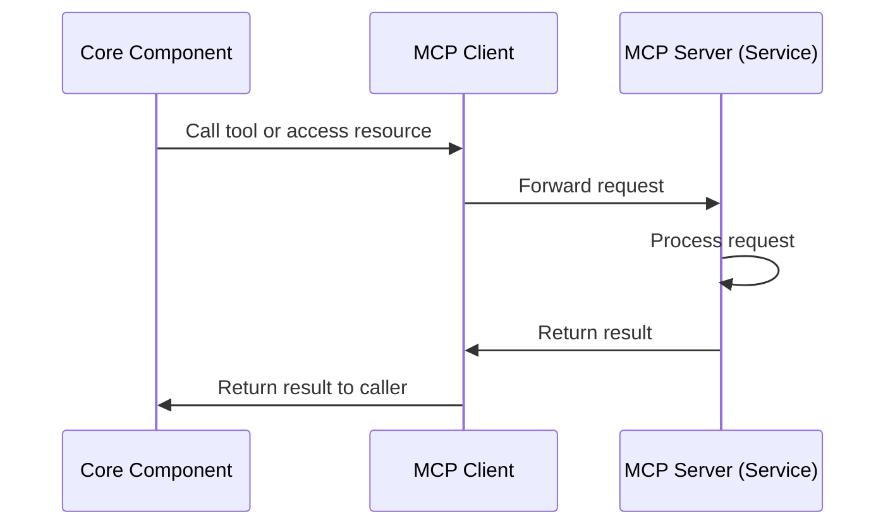

# Service Communication

## Overview

This document details the communication patterns between the Cortex Core application and MCP services in Phase 3. It covers the implementation of the MCP client, routing mechanisms, error handling, state management, debugging, and logging for service communication.

In Phase 3, services are implemented in-process within the main application, but are designed with clear boundaries to facilitate the transition to distributed services in Phase 4. This document focuses on how components communicate with each other while maintaining these boundaries, even when running in the same process.

## Model Context Protocol (MCP) Communication Model

### Core Concepts

The Model Context Protocol (MCP) defines a standardized way for different components to communicate:

1. **Tools**: Functions that components can call to perform operations
2. **Resources**: Data that components can access via URI-style paths
3. **Clients**: Components that call tools and access resources
4. **Servers**: Components that provide tools and resources

This protocol enables a consistent interface regardless of whether components are running in the same process or distributed across multiple machines.

### Communication Flow



## In-Process vs. Network-Based Communication

### Phase 3: In-Process Communication

In Phase 3, all services run within the same process as the core application:

- Services are instantiated as objects within the application
- Communication uses direct method calls
- No serialization/deserialization is required
- Services operate within the same memory space
- Shared event loop for all async operations

```python
# In-process service instantiation
memory_service = MemoryService(repository_manager)
cognition_service = CognitionService()

# In-process client instantiation
memory_client = McpClient(memory_service, "memory")
cognition_client = McpClient(cognition_service, "cognition")
```

### Phase 4: Network-Based Communication

Phase 4 will transition to network-based communication:

- Services run as separate processes
- Communication uses HTTP and SSE over the network
- Requires serialization/deserialization
- Services operate in separate memory spaces
- Independent event loops for each service

The Phase 3 implementation is designed to make this transition as smooth as possible by enforcing clear boundaries between components, even when they're running in the same process.

## MCP Client Implementation

The MCP client provides a consistent interface for communicating with services, regardless of whether they're in-process or network-based.

### McpClient Class

```python
import asyncio
import logging
from typing import Dict, Any, Optional, Tuple

logger = logging.getLogger(__name__)

class McpClient:
    """
    Client for communicating with MCP-compatible services.

    In Phase 3, this is an in-process implementation that directly
    calls service methods. In Phase 4, this will be replaced with
    a network-based implementation.
    """

    def __init__(self, service: Any, service_name: str):
        """
        Initialize the MCP client.

        Args:
            service: The service instance (for in-process implementation)
            service_name: Name of the service for logging and identification
        """
        self.service = service
        self.service_name = service_name
        self.connected = True  # Always connected for in-process

    async def initialize(self) -> None:
        """
        Initialize the connection to the service.

        For in-process implementation, this is a no-op as the service
        is already available.
        """
        logger.debug(f"Initializing connection to {self.service_name} service")
        # No initialization needed for in-process implementation

    async def call_tool(self, name: str, arguments: Dict[str, Any]) -> Dict[str, Any]:
        """
        Call a tool on the service.

        Args:
            name: Name of the tool to call
            arguments: Arguments to pass to the tool

        Returns:
            Result from the tool

        Raises:
            ToolNotFoundError: If the tool doesn't exist
            ToolExecutionError: If the tool execution fails
        """
        logger.debug(f"Calling tool {name} on {self.service_name} service with arguments: {arguments}")

        try:
            # Check if the service has the requested tool
            if not hasattr(self.service, name):
                raise ToolNotFoundError(f"Tool {name} not found on {self.service_name} service")

            # Get the tool method
            tool_method = getattr(self.service, name)

            # Call the tool with the provided arguments
            result = await tool_method(**arguments)

            logger.debug(f"Tool {name} returned: {result}")
            return result
        except ToolNotFoundError:
            # Re-raise tool not found errors
            raise
        except Exception as e:
            # Wrap other exceptions in ToolExecutionError
            logger.error(f"Error calling tool {name} on {self.service_name} service: {e}")
            raise ToolExecutionError(f"Error executing tool {name}: {str(e)}")

    async def get_resource(self, uri: str) -> Tuple[Any, Optional[str]]:
        """
        Get a resource from the service.

        Args:
            uri: URI-style path to the resource

        Returns:
            Tuple of (resource content, mime type)

        Raises:
            ResourceNotFoundError: If the resource doesn't exist
            ResourceAccessError: If accessing the resource fails
        """
        logger.debug(f"Accessing resource {uri} on {self.service_name} service")

        try:
            # Parse URI to extract resource name and parameters
            parts = uri.strip('/').split('/')
            resource_name = parts[0]

            # Check if the service has a resource handler for this URI
            handler_name = f"get_resource_{resource_name}"
            if not hasattr(self.service, handler_name):
                raise ResourceNotFoundError(f"Resource {resource_name} not found on {self.service_name} service")

            # Get the resource handler method
            handler = getattr(self.service, handler_name)

            # Call the handler with the URI parts (excluding the resource name)
            result = await handler(*parts[1:])

            # For in-process implementation, assume JSON mime type
            # In Phase 4, the service will provide the actual mime type
            mime_type = "application/json"

            logger.debug(f"Resource {uri} returned content of type {mime_type}")
            return result, mime_type
        except ResourceNotFoundError:
            # Re-raise resource not found errors
            raise
        except Exception as e:
            # Wrap other exceptions in ResourceAccessError
            logger.error(f"Error accessing resource {uri} on {self.service_name} service: {e}")
            raise ResourceAccessError(f"Error accessing resource {uri}: {str(e)}")

    async def close(self) -> None:
        """
        Close the connection to the service.

        For in-process implementation, this is a no-op as there's
        no actual connection to close.
        """
        logger.debug(f"Closing connection to {self.service_name} service")
        self.connected = False
        # No cleanup needed for in-process implementation
```

### MCP Client Manager

The MCP Client Manager provides a central registry for managing MCP clients and service access:

```python
class McpClientManager:
    """
    Manager for MCP clients, providing a single point of access
    for all services.
    """

    def __init__(self):
        """Initialize the MCP client manager."""
        self.clients = {}

    def register_client(self, service_name: str, client: McpClient) -> None:
        """
        Register an MCP client with the manager.

        Args:
            service_name: Name of the service
            client: MCP client instance
        """
        self.clients[service_name] = client
        logger.debug(f"Registered client for {service_name} service")

    def get_client(self, service_name: str) -> McpClient:
        """
        Get an MCP client by service name.

        Args:
            service_name: Name of the service

        Returns:
            MCP client for the requested service

        Raises:
            ServiceNotFoundError: If no client is registered for the service
        """
        if service_name not in self.clients:
            raise ServiceNotFoundError(f"No client registered for {service_name} service")

        return self.clients[service_name]

    async def close_all(self) -> None:
        """Close all MCP clients."""
        for service_name, client in self.clients.items():
            logger.debug(f"Closing client for {service_name} service")
            await client.close()
```

### Custom Exceptions

Define custom exceptions for MCP client errors:

```python
class ToolNotFoundError(Exception):
    """Raised when a requested tool doesn't exist on a service."""
    pass

class ToolExecutionError(Exception):
    """Raised when executing a tool fails."""
    pass

class ResourceNotFoundError(Exception):
    """Raised when a requested resource doesn't exist on a service."""
    pass

class ResourceAccessError(Exception):
    """Raised when accessing a resource fails."""
    pass

class ServiceNotFoundError(Exception):
    """Raised when no client is registered for a requested service."""
    pass
```

## Service Communication Patterns

### Direct Tool Calls

The most common pattern is directly calling a tool on a service:

```python
async def process_user_input(user_id: str, input_data: Dict[str, Any]) -> Dict[str, Any]:
    """Process user input and generate a response."""
    # Get MCP client for Memory Service
    memory_client = mcp_client_manager.get_client("memory")

    # Store input in Memory Service
    await memory_client.call_tool(
        "store_input",
        {
            "user_id": user_id,
            "input_data": input_data
        }
    )

    # Get MCP client for Cognition Service
    cognition_client = mcp_client_manager.get_client("cognition")

    # Get context from Cognition Service
    context = await cognition_client.call_tool(
        "get_context",
        {
            "user_id": user_id,
            "query": input_data.get("content", ""),
            "limit": 5
        }
    )

    # Use context to generate response
    # ...

    return response
```

### Resource Access

Resources are accessed using URI-style paths:

```python
async def get_user_history(user_id: str, limit: int = 10) -> List[Dict[str, Any]]:
    """Get history for a user."""
    # Get MCP client for Memory Service
    memory_client = mcp_client_manager.get_client("memory")

    # Get history resource with limit parameter
    history, _ = await memory_client.get_resource(f"history/{user_id}/limit/{limit}")

    return history
```

### Chained Service Calls

Services can call other services (e.g., Cognition Service calling Memory Service):

```python
# In Cognition Service
async def get_context(self, user_id: str, query: Optional[str] = None, limit: Optional[int] = 10) -> Dict[str, Any]:
    """Get context for a user."""
    # Get history from Memory Service
    memory_client = self.mcp_client_manager.get_client("memory")
    history, _ = await memory_client.get_resource(f"history/{user_id}/limit/{limit*2}")

    # Process history to generate context
    # ...

    return context
```

### Event-Based Communication

Services can also communicate via the event bus:

```python
# In API endpoint
@app.post("/input")
async def receive_input(input_data: Dict[str, Any], current_user: dict = Depends(get_current_user)):
    """Receive input from client."""
    # Create event
    event = {
        "type": "input",
        "data": input_data,
        "user_id": current_user["user_id"],
        "timestamp": datetime.now().isoformat()
    }

    # Publish event to event bus
    await event_bus.publish(event)

    # Process input directly
    # ...

    return {"status": "received"}

# In an event handler
async def handle_input_events():
    """Handle input events from the event bus."""
    queue = asyncio.Queue()
    event_bus.subscribe(queue)

    try:
        while True:
            event = await queue.get()

            if event["type"] == "input":
                # Process input event
                user_id = event["user_id"]
                input_data = event["data"]

                # Get MCP client for Memory Service
                memory_client = mcp_client_manager.get_client("memory")

                # Store input in Memory Service
                await memory_client.call_tool(
                    "store_input",
                    {
                        "user_id": user_id,
                        "input_data": input_data
                    }
                )
    except asyncio.CancelledError:
        # Unsubscribe when cancelled
        event_bus.unsubscribe(queue)
        raise
```

## Routing Service Requests

### Service Discovery

In Phase 3, service discovery is implemented via the MCP Client Manager:

```python
# Initialize services
memory_service = MemoryService(repository_manager)
cognition_service = CognitionService()

# Create MCP clients
memory_client = McpClient(memory_service, "memory")
cognition_client = McpClient(cognition_service, "cognition")

# Register clients with manager
mcp_client_manager = McpClientManager()
mcp_client_manager.register_client("memory", memory_client)
mcp_client_manager.register_client("cognition", cognition_client)

# Add to FastAPI app state for access in endpoints
app.state.mcp_client_manager = mcp_client_manager
```

### Accessing Services in API Endpoints

```python
@app.post("/analyze")
async def analyze_input(
    request: AnalyzeRequest,
    current_user: dict = Depends(get_current_user)
):
    """Analyze input with Cognition Service."""
    user_id = current_user["user_id"]

    # Get MCP client manager from app state
    mcp_client_manager = request.app.state.mcp_client_manager

    # Get MCP client for Cognition Service
    cognition_client = mcp_client_manager.get_client("cognition")

    # Call the tool
    context = await cognition_client.call_tool(
        "get_context",
        {
            "user_id": user_id,
            "query": request.content,
            "limit": 5
        }
    )

    # Use context in response
    return {
        "context": context,
        "analyzed_content": request.content
    }
```

### Accessing Services from Background Tasks

```python
async def scheduled_task():
    """Scheduled task that accesses services."""
    # Get MCP client manager
    mcp_client_manager = app.state.mcp_client_manager

    # Get MCP client for Cognition Service
    cognition_client = mcp_client_manager.get_client("cognition")

    # Call the tool
    # ...
```

## Error Handling and Recovery

### Error Categories

Service communication errors fall into several categories:

1. **Service Not Found**: The requested service doesn't exist
2. **Tool Not Found**: The requested tool doesn't exist on the service
3. **Resource Not Found**: The requested resource doesn't exist on the service
4. **Tool Execution Error**: The tool execution failed
5. **Resource Access Error**: Accessing the resource failed
6. **Connection Error**: Failed to connect to the service (Phase 4)
7. **Timeout Error**: Request timed out (Phase 4)

### Handling Errors

Handle errors according to their category:

```python
try:
    # Get MCP client
    client = mcp_client_manager.get_client("memory")

    # Call tool
    result = await client.call_tool("store_input", {"user_id": user_id, "input_data": input_data})

    # Process result
    # ...
except ServiceNotFoundError as e:
    # Service doesn't exist
    logger.error(f"Service not found: {e}")
    # Provide meaningful error response to client
    return {"error": "Service unavailable", "details": str(e)}
except ToolNotFoundError as e:
    # Tool doesn't exist
    logger.error(f"Tool not found: {e}")
    # Provide meaningful error response to client
    return {"error": "Requested operation not supported", "details": str(e)}
except ToolExecutionError as e:
    # Tool execution failed
    logger.error(f"Tool execution failed: {e}")
    # Provide meaningful error response to client
    return {"error": "Operation failed", "details": str(e)}
except Exception as e:
    # Unexpected error
    logger.exception(f"Unexpected error: {e}")
    # Provide generic error response to client
    return {"error": "Internal server error"}
```

### Error Response Format

All error responses should follow a consistent format:

```json
{
  "error": "Short error message",
  "details": "Detailed error information",
  "request_id": "Unique request identifier for tracking"
}
```

### Retry Logic

For Phase 3, retries are less critical since services are in-process, but it's good practice to implement retry logic for non-deterministic errors:

```python
async def call_with_retry(
    client: McpClient,
    tool_name: str,
    arguments: Dict[str, Any],
    max_retries: int = 3,
    retry_delay: float = 0.1
) -> Dict[str, Any]:
    """
    Call a tool with retry logic.

    Args:
        client: MCP client
        tool_name: Name of the tool to call
        arguments: Arguments to pass to the tool
        max_retries: Maximum number of retries
        retry_delay: Delay between retries in seconds

    Returns:
        Result from the tool

    Raises:
        ToolExecutionError: If all retries fail
    """
    retries = 0
    last_error = None

    while retries <= max_retries:
        try:
            return await client.call_tool(tool_name, arguments)
        except ToolExecutionError as e:
            last_error = e
            retries += 1

            if retries <= max_retries:
                # Wait before retrying
                await asyncio.sleep(retry_delay * (2 ** (retries - 1)))  # Exponential backoff
            else:
                # Max retries reached, re-raise the last error
                logger.error(f"Max retries reached for tool {tool_name}: {last_error}")
                raise
        except (ToolNotFoundError, ServiceNotFoundError):
            # Don't retry for these errors
            raise
```

## Timeout Management

### Default Timeouts

In Phase 3, timeouts are less critical since services are in-process, but it's good practice to implement timeouts for long-running operations:

```python
async def call_with_timeout(
    client: McpClient,
    tool_name: str,
    arguments: Dict[str, Any],
    timeout: float = 5.0
) -> Dict[str, Any]:
    """
    Call a tool with a timeout.

    Args:
        client: MCP client
        tool_name: Name of the tool to call
        arguments: Arguments to pass to the tool
        timeout: Timeout in seconds

    Returns:
        Result from the tool

    Raises:
        asyncio.TimeoutError: If the call times out
    """
    try:
        return await asyncio.wait_for(
            client.call_tool(tool_name, arguments),
            timeout=timeout
        )
    except asyncio.TimeoutError:
        logger.error(f"Timeout calling tool {tool_name} after {timeout} seconds")
        raise TimeoutError(f"Operation timed out after {timeout} seconds")
```

### Configurable Timeouts

Allow configuring timeouts based on the operation:

```python
# Tool-specific timeouts
TOOL_TIMEOUTS = {
    "store_input": 2.0,  # 2 seconds
    "get_context": 5.0,  # 5 seconds
    "analyze_conversation": 10.0,  # 10 seconds
    "default": 5.0  # Default timeout
}

async def call_tool_with_appropriate_timeout(
    client: McpClient,
    tool_name: str,
    arguments: Dict[str, Any]
) -> Dict[str, Any]:
    """Call a tool with the appropriate timeout."""
    timeout = TOOL_TIMEOUTS.get(tool_name, TOOL_TIMEOUTS["default"])
    return await call_with_timeout(client, tool_name, arguments, timeout)
```

## State Management

### Stateless Services

MCP services should be designed to be stateless whenever possible:

1. **No Instance Variables**: Don't store state in instance variables that change between requests
2. **No Shared Mutable State**: Don't rely on shared mutable state between requests
3. **Idempotent Operations**: Design operations to be idempotent when possible
4. **Explicit Dependencies**: Pass all required data explicitly rather than relying on service state

### Managing Shared Resources

When services need to share resources, use explicit resource management:

```python
class Service:
    """Base class for services with shared resources."""

    def __init__(self, resource_manager):
        """
        Initialize the service.

        Args:
            resource_manager: Shared resource manager
        """
        self.resource_manager = resource_manager

    async def get_resource(self, resource_id: str) -> Any:
        """
        Get a resource by ID.

        Args:
            resource_id: Resource identifier

        Returns:
            The requested resource
        """
        return await self.resource_manager.get_resource(resource_id)
```

### Connection Management

In Phase 3, connections are in-process and don't require special management. In Phase 4, connection management will be more important:

```python
class ConnectionManager:
    """Manager for service connections."""

    def __init__(self):
        """Initialize the connection manager."""
        self.connections = {}

    async def get_connection(self, service_name: str) -> Any:
        """
        Get a connection to a service.

        Args:
            service_name: Name of the service

        Returns:
            Connection to the service
        """
        if service_name not in self.connections or not self.connections[service_name].is_active():
            self.connections[service_name] = await self._create_connection(service_name)

        return self.connections[service_name]

    async def _create_connection(self, service_name: str) -> Any:
        """Create a new connection to a service."""
        # In Phase 3, this would just instantiate the service
        # In Phase 4, this would establish a network connection
        # ...
```

## Debugging and Troubleshooting

### Logging Service Calls

Include detailed logging for service communication:

```python
async def call_tool(self, name: str, arguments: Dict[str, Any]) -> Dict[str, Any]:
    """Call a tool on a service."""
    request_id = str(uuid.uuid4())

    logger.debug(
        f"Calling tool {name} on {self.service_name} service "
        f"(request_id: {request_id})"
    )
    logger.debug(f"Arguments: {arguments}")

    try:
        result = await self._call_tool_internal(name, arguments)

        logger.debug(
            f"Tool {name} on {self.service_name} service returned successfully "
            f"(request_id: {request_id})"
        )
        return result
    except Exception as e:
        logger.error(
            f"Error calling tool {name} on {self.service_name} service: {e} "
            f"(request_id: {request_id})"
        )
        raise
```

### Tracing Service Calls

Use correlation IDs to trace requests through the system:

```python
async def process_request(request_id: str, user_id: str, input_data: Dict[str, Any]) -> Dict[str, Any]:
    """Process a request with tracing."""
    # Set up tracing context
    trace_context = {
        "request_id": request_id,
        "user_id": user_id
    }

    # Log the start of processing
    logger.info(f"Starting request processing (request_id: {request_id})")

    try:
        # Call services with trace context
        memory_client = mcp_client_manager.get_client("memory")
        cognition_client = mcp_client_manager.get_client("cognition")

        # Include trace context in tool calls
        await memory_client.call_tool(
            "store_input",
            {
                "user_id": user_id,
                "input_data": input_data,
                "trace_context": trace_context
            }
        )

        context = await cognition_client.call_tool(
            "get_context",
            {
                "user_id": user_id,
                "query": input_data.get("content", ""),
                "limit": 5,
                "trace_context": trace_context
            }
        )

        # Log the completion of processing
        logger.info(f"Completed request processing (request_id: {request_id})")

        return {"context": context, "trace_id": request_id}
    except Exception as e:
        # Log the error with trace context
        logger.error(f"Error processing request (request_id: {request_id}): {e}")
        raise
```

### Debugging Tools

Implement endpoints for debugging service communication:

```python
@app.get("/debug/service/{service_name}")
async def debug_service(service_name: str, current_user: dict = Depends(get_admin_user)):
    """Debug endpoint for service information."""
    try:
        # Get MCP client
        client = mcp_client_manager.get_client(service_name)

        # Get service info
        service_info = {
            "service_name": service_name,
            "connected": client.connected,
            # Add more service information as needed
        }

        return service_info
    except Exception as e:
        return {"error": str(e)}
```

## Testing Service Communication

### Unit Testing

Unit test service communication components:

```python
import pytest
from unittest.mock import AsyncMock, MagicMock

@pytest.mark.asyncio
async def test_mcp_client():
    """Test MCP client functionality."""
    # Create mock service
    mock_service = MagicMock()
    mock_service.test_tool = AsyncMock(return_value={"result": "success"})

    # Create MCP client
    client = McpClient(mock_service, "test_service")

    # Call tool
    result = await client.call_tool("test_tool", {"arg": "value"})

    # Verify result
    assert result == {"result": "success"}

    # Verify tool was called with correct arguments
    mock_service.test_tool.assert_called_once_with(arg="value")
```

### Integration Testing

Integration test communication between services:

```python
@pytest.mark.asyncio
async def test_service_integration():
    """Test integration between services."""
    # Create real services
    memory_service = MemoryService(repository_manager)
    cognition_service = CognitionService()

    # Create MCP clients
    memory_client = McpClient(memory_service, "memory")
    cognition_client = McpClient(cognition_service, "cognition")

    # Register clients with manager
    mcp_client_manager = McpClientManager()
    mcp_client_manager.register_client("memory", memory_client)
    mcp_client_manager.register_client("cognition", cognition_client)

    # Set up cognition service to use memory service
    cognition_service.memory_service = memory_service

    # Test communication flow
    # 1. Store input in memory service
    await memory_client.call_tool(
        "store_input",
        {
            "user_id": "test_user",
            "input_data": {"content": "Test input"}
        }
    )

    # 2. Get context from cognition service
    context = await cognition_client.call_tool(
        "get_context",
        {
            "user_id": "test_user",
            "query": "Test input",
            "limit": 5
        }
    )

    # Verify context
    assert context["user_id"] == "test_user"
    assert context["count"] > 0
    assert len(context["context"]) > 0
```

### Mocking Services

Mock services for testing components that use them:

```python
@pytest.mark.asyncio
async def test_with_mock_services():
    """Test using mock services."""
    # Create mock clients
    mock_memory_client = MagicMock()
    mock_memory_client.call_tool = AsyncMock(return_value={"status": "stored"})

    mock_cognition_client = MagicMock()
    mock_cognition_client.call_tool = AsyncMock(return_value={"context": [], "count": 0})

    # Create mock client manager
    mock_client_manager = MagicMock()
    mock_client_manager.get_client = MagicMock(side_effect=lambda service_name:
        mock_memory_client if service_name == "memory" else mock_cognition_client
    )

    # Test component that uses services
    processor = InputProcessor(mock_client_manager)
    result = await processor.process_input("test_user", {"content": "Test input"})

    # Verify service interactions
    mock_memory_client.call_tool.assert_called_once()
    mock_cognition_client.call_tool.assert_called_once()
```

## Common Challenges and Solutions

### Challenge 1: Service Boundaries

**Problem**: Maintaining clear service boundaries in an in-process implementation.

**Solution**:

- Always interact with services through the MCP client
- Never access service implementation details directly
- Define clear interfaces for all services
- Use dependency injection for service integration

```python
# Good: Using MCP client
result = await memory_client.call_tool("store_input", {"user_id": user_id, "input_data": input_data})

# Bad: Accessing service implementation directly
result = await memory_service.store_input(user_id, input_data)
```

### Challenge 2: Error Propagation

**Problem**: Properly propagating and handling errors from services.

**Solution**:

- Use custom exceptions for different error types
- Wrap service errors with context
- Provide meaningful error messages
- Include correlation IDs for tracing

```python
try:
    result = await memory_client.call_tool("store_input", {"user_id": user_id, "input_data": input_data})
except ToolExecutionError as e:
    # Wrap with context
    raise ServiceOperationError(f"Failed to store input: {e}", correlation_id=request_id)
```

### Challenge 3: Async Flow Control

**Problem**: Managing async flow control with multiple service calls.

**Solution**:

- Use `asyncio.gather` for parallel calls
- Use sequential calls when order matters
- Handle exceptions properly in both cases

```python
# Parallel calls
memory_result, context = await asyncio.gather(
    memory_client.call_tool("store_input", {"user_id": user_id, "input_data": input_data}),
    cognition_client.call_tool("get_context", {"user_id": user_id, "query": query})
)

# Sequential calls with dependency
memory_result = await memory_client.call_tool("store_input", {"user_id": user_id, "input_data": input_data})
context = await cognition_client.call_tool("get_context", {"user_id": user_id, "query": query})
```

### Challenge 4: Service Discovery

**Problem**: Accessing the right service at the right time.

**Solution**:

- Use a central registry (MCP Client Manager)
- Initialize services at startup
- Handle missing services gracefully
- Use semantic service names

```python
try:
    client = mcp_client_manager.get_client("memory")
except ServiceNotFoundError:
    # Handle missing service
    logger.error("Memory service not available")
    return {"error": "Service unavailable"}
```

### Challenge 5: Testing

**Problem**: Testing components that interact with services.

**Solution**:

- Use dependency injection for testability
- Create mock services for unit tests
- Use real services for integration tests
- Use fixtures for test setup

```python
class InputProcessor:
    """Process input with service integration."""

    def __init__(self, mcp_client_manager):
        """
        Initialize the processor.

        Args:
            mcp_client_manager: MCP client manager
        """
        self.mcp_client_manager = mcp_client_manager

    async def process_input(self, user_id: str, input_data: Dict[str, Any]) -> Dict[str, Any]:
        """Process input with services."""
        # Get clients
        memory_client = self.mcp_client_manager.get_client("memory")
        cognition_client = self.mcp_client_manager.get_client("cognition")

        # Use services
        # ...
```

## Preparing for Phase 4

Phase 3 is designed to set the foundation for the distributed services in Phase 4. Here are key considerations for ensuring a smooth transition:

### Maintain Clean Interfaces

Ensure service interfaces are clean and well-defined:

- Document all tools and resources
- Define clear input/output contracts
- Avoid dependencies on in-process behavior
- Handle errors consistently

### Avoid In-Process Assumptions

Avoid assumptions that only work in-process:

- Don't rely on shared memory
- Don't pass non-serializable objects
- Don't assume synchronous behavior
- Don't rely on reference equality

### Prepare for Serialization

Ensure all data can be serialized for network transmission:

- Use simple, serializable data types
- Avoid custom objects without serialization support
- Validate input/output contracts
- Test with JSON serialization

### Plan for Distributed Error Handling

Consider how errors will be handled in a distributed environment:

- Define error categories
- Implement retry logic
- Prepare for network errors
- Consider timeout handling

## Conclusion

Service communication in Phase 3 establishes the foundation for the distributed architecture in Phase 4. By implementing the Model Context Protocol (MCP) with in-process services, we create clear boundaries and communication patterns that will facilitate the transition to network-based services.

The key components of this architecture are:

1. **MCP Client**: Provides a consistent interface for communicating with services
2. **Service Implementations**: Implement the MCP server interface with tools and resources
3. **Client Manager**: Manages service discovery and access
4. **Error Handling**: Provides robust error handling and recovery
5. **Testing Utilities**: Facilitates testing service communication

By following the patterns and guidelines in this document, you can implement service communication that meets the requirements of Phase 3 while preparing for the distributed architecture in Phase 4.
