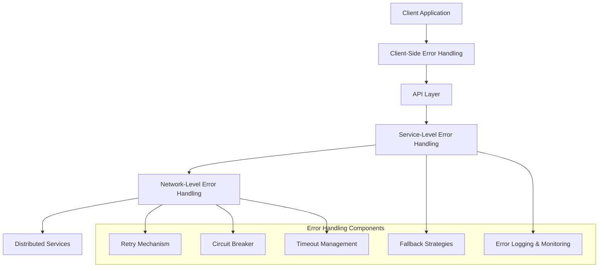

# Distributed Error Handling

## Overview

This document provides comprehensive guidance for implementing error handling in the distributed services architecture introduced in Phase 4 of the Cortex Core. It covers error categories, handling strategies, implementation patterns, and testing approaches specific to distributed systems.

In a distributed architecture, error handling is significantly more complex than in a monolithic system. Network failures, service unavailability, partial failures, and timeouts introduce a new class of errors that must be properly handled to ensure system resilience and reliability.

The goal of the distributed error handling system is to:

1. **Detect errors** quickly and accurately
2. **Contain failures** to prevent cascading effects
3. **Recover gracefully** when possible
4. **Degrade functionality** rather than fail completely
5. **Provide meaningful information** for diagnosis
6. **Maintain data consistency** across service boundaries

This document focuses on pragmatic, straightforward approaches that balance error handling with implementation simplicity, following the core philosophy of the Cortex Platform.

## Error Categories in Distributed Systems

In a distributed system, errors can be categorized into several types, each requiring different handling strategies:

### 1. Network Failures

Network failures occur when services cannot communicate due to network issues.

**Examples:**

- Connection refused
- Connection reset
- DNS resolution failure
- Network timeouts
- SSL/TLS handshake failures

**Handling Strategy:**

- Retry with backoff
- Circuit breaking to prevent cascade failures
- Default responses or cached data when appropriate

### 2. Service Unavailability

Service unavailability occurs when a dependent service is not operational.

**Examples:**

- Service not started
- Service crash or restart
- Deployment in progress
- Resource exhaustion (CPU, memory, connections)

**Handling Strategy:**

- Circuit breaking
- Fallback mechanisms
- Degraded functionality
- Clear user feedback

### 3. Timeout Errors

Timeout errors occur when a service takes too long to respond.

**Examples:**

- Request timeout
- Connection timeout
- Read/write timeout
- Service processing timeout

**Handling Strategy:**

- Configurable timeout thresholds
- Cancellation propagation
- Retry with increased timeout when appropriate
- Logging slow operations

### 4. Data Consistency Errors

Data consistency errors occur when data becomes inconsistent across services.

**Examples:**

- Partial updates
- Race conditions
- Conflicting changes
- Missing related data

**Handling Strategy:**

- Idempotent operations
- Consistency checks
- Reconciliation processes
- Conflict resolution strategies

### 5. Resource Exhaustion

Resource exhaustion occurs when a service runs out of critical resources.

**Examples:**

- Connection pool exhaustion
- Memory limits
- Thread pool exhaustion
- Rate limiting or throttling

**Handling Strategy:**

- Resource pooling
- Backpressure mechanisms
- Graceful degradation
- Proactive scaling

### 6. Protocol Errors

Protocol errors occur when services cannot understand each other's messages.

**Examples:**

- Serialization/deserialization errors
- Incompatible versions
- Missing required fields
- Invalid message format

**Handling Strategy:**

- Schema validation
- Versioned interfaces
- Backward compatibility
- Graceful handling of unknown fields

## Error Handling Architecture

The error handling architecture for Cortex Core's distributed system consists of several layers, each with specific responsibilities:



### 1. Network-Level Error Handling

The network level handles low-level communication errors between services:

- Connection establishment/teardown
- Request/response transmission
- Protocol-specific errors
- Timeouts and retries

### 2. Service-Level Error Handling

The service level handles errors related to service behavior:

- Business logic errors
- Service availability
- Data validation
- Resource management

### 3. API-Level Error Handling

The API level handles errors related to client interactions:

- Input validation
- Authentication/authorization errors
- Rate limiting
- Response formatting

### 4. Client-Side Error Handling

The client side handles errors from the perspective of client applications:

- User feedback
- Retry strategies
- Offline operation
- Graceful degradation

## Core Error Handling Components

### 1. Retry Mechanism

The retry mechanism automatically retries failed operations with configurable policies.

#### Interface

```python
class RetryConfig:
    """Configuration for retry behavior."""

    def __init__(
        self,
        max_retries: int = 3,
        initial_backoff_ms: int = 100,
        max_backoff_ms: int = 10000,
        backoff_multiplier: float = 2.0,
        retriable_errors: List[Type[Exception]] = None
    ):
        """
        Initialize retry configuration.

        Args:
            max_retries: Maximum number of retry attempts
            initial_backoff_ms: Initial backoff time in milliseconds
            max_backoff_ms: Maximum backoff time in milliseconds
            backoff_multiplier: Multiplier for exponential backoff
            retriable_errors: List of exception types that should be retried
        """
        self.max_retries = max_retries
        self.initial_backoff_ms = initial_backoff_ms
        self.max_backoff_ms = max_backoff_ms
        self.backoff_multiplier = backoff_multiplier
        self.retriable_errors = retriable_errors or [
            TimeoutError,
            ConnectionError,
            httpx.ReadTimeout,
            httpx.ConnectTimeout,
            httpx.HTTPStatusError
        ]
```

#### Implementation

```python
async def with_retry(
    func: Callable[..., Awaitable[T]],
    *args,
    retry_config: RetryConfig = None,
    **kwargs
) -> T:
    """
    Execute a function with retry logic.

    Args:
        func: Async function to execute
        *args: Positional arguments for the function
        retry_config: Retry configuration
        **kwargs: Keyword arguments for the function

    Returns:
        Result of the function

    Raises:
        Exception: If all retries fail
    """
    # Use default config if not provided
    config = retry_config or RetryConfig()

    # Initialize attempt counter and last error
    attempts = 0
    last_error = None

    # Initial backoff time
    backoff_ms = config.initial_backoff_ms

    # Keep trying until we exceed max retries
    while attempts <= config.max_retries:
        try:
            # Attempt to execute the function
            return await func(*args, **kwargs)
        except Exception as e:
            # Check if this error type should be retried
            if not any(isinstance(e, err_type) for err_type in config.retriable_errors):
                # Non-retriable error, re-raise immediately
                raise

            # Record the error and increment attempts
            last_error = e
            attempts += 1

            # If we've exceeded max retries, re-raise the last error
            if attempts > config.max_retries:
                break

            # Calculate jitter (random value between 0 and backoff_ms * 0.1)
            jitter_ms = random.randint(0, int(backoff_ms * 0.1))

            # Log retry attempt
            logger.warning(
                f"Retrying after error: {e}. "
                f"Attempt {attempts}/{config.max_retries} in {backoff_ms + jitter_ms}ms"
            )

            # Wait before retrying (with jitter to prevent thundering herd)
            await asyncio.sleep((backoff_ms + jitter_ms) / 1000)

            # Increase backoff for next attempt (exponential backoff)
            backoff_ms = min(
                backoff_ms * config.backoff_multiplier,
                config.max_backoff_ms
            )

    # If we got here, all retries failed
    raise last_error
```

#### Usage Example

```python
async def call_memory_service(user_id: str) -> Dict[str, Any]:
    """Call Memory Service with retry."""
    async def _make_call():
        async with httpx.AsyncClient() as client:
            response = await client.get(
                f"{MEMORY_SERVICE_URL}/resource/history/{user_id}",
                timeout=5.0
            )
            response.raise_for_status()
            return response.json()

    # Custom retry configuration
    retry_config = RetryConfig(
        max_retries=5,
        initial_backoff_ms=200,
        retriable_errors=[
            httpx.ReadTimeout,
            httpx.ConnectTimeout,
            httpx.HTTPStatusError
        ]
    )

    return await with_retry(_make_call, retry_config=retry_config)
```

### 2. Circuit Breaker

The circuit breaker prevents repeated calls to failing services, allowing them time to recover.

#### States

1. **CLOSED**: Normal operation - requests pass through
2. **OPEN**: Service is failing - requests are short-circuited
3. **HALF_OPEN**: Testing if service has recovered - limited requests pass through

#### Interface

```python
class CircuitBreakerConfig:
    """Configuration for circuit breaker behavior."""

    def __init__(
        self,
        failure_threshold: int = 5,
        recovery_time_ms: int = 30000,
        half_open_max_calls: int = 3,
        tracked_errors: List[Type[Exception]] = None
    ):
        """
        Initialize circuit breaker configuration.

        Args:
            failure_threshold: Number of failures before opening circuit
            recovery_time_ms: Time in milliseconds before attempting recovery
            half_open_max_calls: Maximum calls in half-open state
            tracked_errors: List of exception types that count as failures
        """
        self.failure_threshold = failure_threshold
        self.recovery_time_ms = recovery_time_ms
        self.half_open_max_calls = half_open_max_calls
        self.tracked_errors = tracked_errors or [
            Exception  # By default, track all exceptions
        ]
```

#### Implementation

```python
class CircuitBreaker:
    """
    Circuit breaker implementation to prevent repeated calls to failing services.
    """

    def __init__(self, name: str, config: CircuitBreakerConfig = None):
        """
        Initialize circuit breaker.

        Args:
            name: Name of the circuit breaker (for logging/metrics)
            config: Circuit breaker configuration
        """
        self.name = name
        self.config = config or CircuitBreakerConfig()

        # State variables
        self._state = "CLOSED"
        self._failure_count = 0
        self._last_failure_time = 0
        self._half_open_calls = 0
        self._lock = asyncio.Lock()  # For thread safety

    async def execute(self, func: Callable[..., Awaitable[T]], *args, **kwargs) -> T:
        """
        Execute a function with circuit breaker protection.

        Args:
            func: Async function to execute
            *args: Positional arguments for the function
            **kwargs: Keyword arguments for the function

        Returns:
            Result of the function

        Raises:
            CircuitOpenError: If circuit is open
            Exception: If function execution fails
        """
        async with self._lock:
            # Check if circuit is open
            if self._state == "OPEN":
                # Check if recovery time has elapsed
                if time.time() * 1000 - self._last_failure_time > self.config.recovery_time_ms:
                    # Move to half-open state
                    logger.info(f"Circuit {self.name}: Moving from OPEN to HALF_OPEN state")
                    self._state = "HALF_OPEN"
                    self._half_open_calls = 0
                else:
                    # Circuit is still open
                    raise CircuitOpenError(
                        f"Circuit {self.name} is OPEN. "
                        f"Next retry in {self._get_remaining_recovery_time_ms()}ms"
                    )

            # In half-open state, check if we've reached max calls
            if self._state == "HALF_OPEN" and self._half_open_calls >= self.config.half_open_max_calls:
                raise CircuitOpenError(
                    f"Circuit {self.name} is HALF_OPEN and at max calls. "
                    f"Try again later"
                )

            # Increment half-open calls if applicable
            if self._state == "HALF_OPEN":
                self._half_open_calls += 1

        try:
            # Execute the function
            result = await func(*args, **kwargs)

            # Success - update circuit state
            async with self._lock:
                if self._state == "HALF_OPEN":
                    # Successful call in half-open state - close circuit
                    logger.info(f"Circuit {self.name}: Moving from HALF_OPEN to CLOSED state")
                    self._state = "CLOSED"

                # Reset failure count on success
                self._failure_count = 0

            return result

        except Exception as e:
            # Check if this error type is tracked
            if not any(isinstance(e, err_type) for err_type in self.config.tracked_errors):
                # Untracked error type - don't affect circuit state
                raise

            # Failure - update circuit state
            async with self._lock:
                self._failure_count += 1
                self._last_failure_time = time.time() * 1000

                # Check if we should open the circuit
                if self._state == "CLOSED" and self._failure_count >= self.config.failure_threshold:
                    logger.warning(
                        f"Circuit {self.name}: Moving from CLOSED to OPEN state after "
                        f"{self._failure_count} failures"
                    )
                    self._state = "OPEN"

                # In half-open state, immediately reopen on failure
                if self._state == "HALF_OPEN":
                    logger.warning(
                        f"Circuit {self.name}: Moving from HALF_OPEN back to OPEN state due to failure"
                    )
                    self._state = "OPEN"

            # Re-raise the exception
            raise

    def _get_remaining_recovery_time_ms(self) -> int:
        """Calculate remaining recovery time in milliseconds."""
        elapsed_ms = time.time() * 1000 - self._last_failure_time
        return max(0, self.config.recovery_time_ms - elapsed_ms)
```

#### CircuitOpenError

```python
class CircuitOpenError(Exception):
    """Exception raised when a circuit breaker is open."""

    def __init__(self, message: str):
        self.message = message
        super().__init__(self.message)
```

#### Usage Example

```python
# Create circuit breakers for each service
memory_circuit = CircuitBreaker("memory_service")
cognition_circuit = CircuitBreaker("cognition_service")

async def get_user_history(user_id: str) -> List[Dict[str, Any]]:
    """Get user history with circuit breaker protection."""
    async def _call_service():
        async with httpx.AsyncClient() as client:
            response = await client.get(
                f"{MEMORY_SERVICE_URL}/resource/history/{user_id}",
                timeout=5.0
            )
            response.raise_for_status()
            return response.json()

    try:
        # Execute with circuit breaker
        return await memory_circuit.execute(_call_service)
    except CircuitOpenError as e:
        # Circuit is open, return fallback
        logger.warning(f"Circuit open for Memory Service: {e}")
        return []
    except Exception as e:
        # Other error, log and re-raise
        logger.error(f"Error calling Memory Service: {e}")
        raise
```

### 3. Timeout Management

Timeout management ensures operations complete within expected time frames or fail gracefully.

#### Interface

```python
class TimeoutConfig:
    """Configuration for timeout behavior."""

    def __init__(
        self,
        connect_timeout_ms: int = 1000,
        read_timeout_ms: int = 5000,
        write_timeout_ms: int = 5000,
        pool_timeout_ms: int = 500,
        total_timeout_ms: int = 10000
    ):
        """
        Initialize timeout configuration.

        Args:
            connect_timeout_ms: Connection establishment timeout in milliseconds
            read_timeout_ms: Read operation timeout in milliseconds
            write_timeout_ms: Write operation timeout in milliseconds
            pool_timeout_ms: Connection pool acquisition timeout in milliseconds
            total_timeout_ms: Overall operation timeout in milliseconds
        """
        self.connect_timeout_ms = connect_timeout_ms
        self.read_timeout_ms = read_timeout_ms
        self.write_timeout_ms = write_timeout_ms
        self.pool_timeout_ms = pool_timeout_ms
        self.total_timeout_ms = total_timeout_ms
```

#### Implementation

```python
async def with_timeout(
    func: Callable[..., Awaitable[T]],
    timeout_ms: int,
    *args,
    **kwargs
) -> T:
    """
    Execute a function with a timeout.

    Args:
        func: Async function to execute
        timeout_ms: Timeout in milliseconds
        *args: Positional arguments for the function
        **kwargs: Keyword arguments for the function

    Returns:
        Result of the function

    Raises:
        asyncio.TimeoutError: If the operation times out
        Exception: If function execution fails
    """
    # Convert milliseconds to seconds for asyncio
    timeout_sec = timeout_ms / 1000

    # Create task
    task = asyncio.create_task(func(*args, **kwargs))

    try:
        # Wait for task with timeout
        return await asyncio.wait_for(task, timeout=timeout_sec)
    except asyncio.TimeoutError:
        # Task timed out, attempt to cancel it
        task.cancel()

        # Wait a short time for cancellation to propagate
        try:
            await asyncio.wait_for(task, timeout=0.1)
        except (asyncio.TimeoutError, asyncio.CancelledError):
            pass

        # Raise the timeout error
        raise
```

#### Usage with httpx

```python
async def call_service_with_timeout(url: str, timeout_config: TimeoutConfig) -> Dict[str, Any]:
    """Call a service with timeout configuration."""
    # Create httpx timeout object
    timeout = httpx.Timeout(
        connect=timeout_config.connect_timeout_ms / 1000,
        read=timeout_config.read_timeout_ms / 1000,
        write=timeout_config.write_timeout_ms / 1000,
        pool=timeout_config.pool_timeout_ms / 1000
    )

    # Function to call with overall timeout
    async def _make_call():
        async with httpx.AsyncClient(timeout=timeout) as client:
            response = await client.get(url)
            response.raise_for_status()
            return response.json()

    # Execute with overall timeout
    return await with_timeout(_make_call, timeout_config.total_timeout_ms)
```

### 4. Fallback Strategies

Fallback strategies provide alternative responses when services are unavailable.

#### Types of Fallbacks

1. **Static Fallback**: Return predefined data
2. **Cached Fallback**: Return cached previous responses
3. **Degraded Fallback**: Return simplified or partial data
4. **Alternative Service**: Call an alternative service or endpoint
5. **Computed Fallback**: Generate fallback data based on context

#### Implementation

```python
class FallbackStrategy:
    """Base fallback strategy interface."""

    async def get_fallback(self, context: Dict[str, Any]) -> Any:
        """
        Get fallback data for a failed operation.

        Args:
            context: Context information for the fallback

        Returns:
            Fallback data
        """
        raise NotImplementedError("Subclasses must implement get_fallback")

class StaticFallback(FallbackStrategy):
    """Return static predefined data."""

    def __init__(self, fallback_data: Any):
        """
        Initialize with static fallback data.

        Args:
            fallback_data: Data to return as fallback
        """
        self.fallback_data = fallback_data

    async def get_fallback(self, context: Dict[str, Any]) -> Any:
        """Return the static fallback data."""
        return self.fallback_data

class CachedFallback(FallbackStrategy):
    """Return cached previous responses."""

    def __init__(self, cache_key_func: Callable[[Dict[str, Any]], str], cache: Dict[str, Any] = None):
        """
        Initialize with cache configuration.

        Args:
            cache_key_func: Function to generate cache key from context
            cache: Optional existing cache dictionary
        """
        self.cache_key_func = cache_key_func
        self.cache = cache or {}

    async def get_fallback(self, context: Dict[str, Any]) -> Any:
        """Return cached data if available."""
        cache_key = self.cache_key_func(context)
        if cache_key in self.cache:
            return self.cache[cache_key]
        return None

    def update_cache(self, context: Dict[str, Any], data: Any) -> None:
        """Update cache with new data."""
        cache_key = self.cache_key_func(context)
        self.cache[cache_key] = data

class ComputedFallback(FallbackStrategy):
    """Generate fallback data based on context."""

    def __init__(self, compute_func: Callable[[Dict[str, Any]], Awaitable[Any]]):
        """
        Initialize with compute function.

        Args:
            compute_func: Async function to compute fallback data from context
        """
        self.compute_func = compute_func

    async def get_fallback(self, context: Dict[str, Any]) -> Any:
        """Compute and return fallback data."""
        return await self.compute_func(context)
```

#### Usage Example

```python
# Create fallback strategies
empty_history_fallback = StaticFallback([])
cached_history = CachedFallback(lambda ctx: f"history:{ctx['user_id']}")

async def get_user_history_with_fallback(user_id: str) -> List[Dict[str, Any]]:
    """Get user history with fallback strategy."""
    context = {"user_id": user_id}

    try:
        # Try to get from service
        result = await call_memory_service(user_id)

        # Update cache on success
        cached_history.update_cache(context, result)

        return result
    except CircuitOpenError:
        # Circuit is open, try cached fallback
        cached_result = await cached_history.get_fallback(context)
        if cached_result is not None:
            logger.info(f"Using cached history for user {user_id}")
            return cached_result

        # No cache, use empty fallback
        logger.info(f"Using empty history fallback for user {user_id}")
        return await empty_history_fallback.get_fallback(context)
    except Exception as e:
        # Other error, log and use fallback
        logger.error(f"Error getting history for user {user_id}: {e}")
        return await empty_history_fallback.get_fallback(context)
```

### 5. Error Logging and Monitoring

Error logging and monitoring provide visibility into system health and errors.

#### Log Levels

- **DEBUG**: Detailed information, typically of interest only when diagnosing problems
- **INFO**: Confirmation that things are working as expected
- **WARNING**: Indication that something unexpected happened, but processing continues
- **ERROR**: Due to a more serious problem, some processing couldn't be performed
- **CRITICAL**: Serious error, indicating that the program itself may be unable to continue

#### Structured Logging

```python
def log_error(
    error: Exception,
    context: Dict[str, Any],
    level: str = "ERROR",
    include_traceback: bool = True
) -> None:
    """
    Log an error with structured context information.

    Args:
        error: The exception to log
        context: Additional context information
        level: Log level (DEBUG, INFO, WARNING, ERROR, CRITICAL)
        include_traceback: Whether to include traceback information
    """
    # Determine logger method based on level
    log_func = getattr(logger, level.lower())

    # Basic error information
    error_info = {
        "error_type": error.__class__.__name__,
        "error_message": str(error),
        "timestamp": datetime.datetime.utcnow().isoformat(),
    }

    # Add traceback if requested
    if include_traceback:
        error_info["traceback"] = traceback.format_exc()

    # Merge with context
    log_data = {**error_info, **context}

    # Log the structured data
    log_func(f"Error: {error}", extra={"structured": log_data})
```

#### Service Health Metrics

```python
class ServiceHealthMetrics:
    """Collect and report service health metrics."""

    def __init__(self, service_name: str):
        """
        Initialize service health metrics.

        Args:
            service_name: Name of the service
        """
        self.service_name = service_name
        self.request_count = 0
        self.error_count = 0
        self.success_count = 0
        self.response_times = []
        self.circuit_open_count = 0
        self.retry_count = 0
        self.timeout_count = 0

    def record_request(self) -> None:
        """Record a request to the service."""
        self.request_count += 1

    def record_success(self, response_time_ms: float) -> None:
        """Record a successful request."""
        self.success_count += 1
        self.response_times.append(response_time_ms)

    def record_error(self, error: Exception) -> None:
        """Record an error request."""
        self.error_count += 1

        # Categorize specific error types
        if isinstance(error, CircuitOpenError):
            self.circuit_open_count += 1
        elif isinstance(error, asyncio.TimeoutError):
            self.timeout_count += 1

    def record_retry(self) -> None:
        """Record a retry attempt."""
        self.retry_count += 1

    def get_metrics(self) -> Dict[str, Any]:
        """Get current metrics."""
        return {
            "service_name": self.service_name,
            "request_count": self.request_count,
            "success_count": self.success_count,
            "error_count": self.error_count,
            "success_rate": self.success_count / max(1, self.request_count),
            "avg_response_time_ms": sum(self.response_times) / max(1, len(self.response_times)),
            "circuit_open_count": self.circuit_open_count,
            "retry_count": self.retry_count,
            "timeout_count": self.timeout_count
        }
```

#### Health Check Endpoints

```python
# Service health check endpoint
@app.get("/health")
async def health_check():
    """
    Service health check endpoint.

    Returns:
        Health status information
    """
    # Get service metrics
    service_metrics = health_monitor.get_metrics()

    # Check database connectivity
    db_healthy = await check_database_connection()

    # Check dependent services health
    memory_healthy = await check_memory_service_health()
    cognition_healthy = await check_cognition_service_health()

    # Determine overall health
    is_healthy = db_healthy and memory_healthy and cognition_healthy

    # Response status code based on health
    status_code = 200 if is_healthy else 503

    return JSONResponse(
        status_code=status_code,
        content={
            "status": "healthy" if is_healthy else "unhealthy",
            "database": "healthy" if db_healthy else "unhealthy",
            "dependent_services": {
                "memory": "healthy" if memory_healthy else "unhealthy",
                "cognition": "healthy" if cognition_healthy else "unhealthy"
            },
            "metrics": service_metrics,
            "timestamp": datetime.datetime.utcnow().isoformat()
        }
    )
```

## Error Handling in Network MCP Client

The Network MCP Client is a critical component that handles communication between services. It requires robust error handling to maintain system resilience.

### Primary Error Scenarios

1. **Connection Establishment**: Failures when establishing connections to services
2. **Tool Calls**: Errors during request/response interactions
3. **Resource Streaming**: Failures in SSE connections for streaming resources
4. **Service Discovery**: Errors resolving service endpoints
5. **Message Processing**: Serialization/deserialization failures

### Implementation

```python
class NetworkMcpClient:
    """
    Network MCP client for communication with distributed services.
    """

    def __init__(
        self,
        service_discovery: ServiceDiscovery,
        retry_config: RetryConfig = None,
        timeout_config: TimeoutConfig = None
    ):
        """
        Initialize network MCP client.

        Args:
            service_discovery: Service discovery mechanism
            retry_config: Retry configuration
            timeout_config: Timeout configuration
        """
        self.service_discovery = service_discovery
        self.retry_config = retry_config or RetryConfig()
        self.timeout_config = timeout_config or TimeoutConfig()

        # Create circuit breakers for each service
        self.circuit_breakers = {}

        # Service health metrics
        self.service_metrics = {}

    def _get_circuit_breaker(self, service_name: str) -> CircuitBreaker:
        """Get or create circuit breaker for a service."""
        if service_name not in self.circuit_breakers:
            self.circuit_breakers[service_name] = CircuitBreaker(service_name)
        return self.circuit_breakers[service_name]

    def _get_metrics(self, service_name: str) -> ServiceHealthMetrics:
        """Get or create metrics for a service."""
        if service_name not in self.service_metrics:
            self.service_metrics[service_name] = ServiceHealthMetrics(service_name)
        return self.service_metrics[service_name]

    async def call_tool(
        self,
        service_name: str,
        tool_name: str,
        arguments: Dict[str, Any]
    ) -> Dict[str, Any]:
        """
        Call a tool on a remote service.

        Args:
            service_name: Name of the service
            tool_name: Name of the tool to call
            arguments: Tool arguments

        Returns:
            Tool result

        Raises:
            ServiceNotFoundError: If service cannot be resolved
            CircuitOpenError: If circuit breaker is open
            ToolCallError: If tool call fails
        """
        # Get metrics for this service
        metrics = self._get_metrics(service_name)
        metrics.record_request()

        start_time = time.time()

        try:
            # Resolve service endpoint
            service_url = await self.service_discovery.resolve(service_name)
            if not service_url:
                raise ServiceNotFoundError(f"Service {service_name} not found")

            # Get circuit breaker for this service
            circuit_breaker = self._get_circuit_breaker(service_name)

            # Function to execute the tool call
            async def _execute_tool_call():
                # Create timeout configuration for httpx
                timeout = httpx.Timeout(
                    connect=self.timeout_config.connect_timeout_ms / 1000,
                    read=self.timeout_config.read_timeout_ms / 1000,
                    write=self.timeout_config.write_timeout_ms / 1000,
                    pool=self.timeout_config.pool_timeout_ms / 1000
                )

                # Make HTTP request to tool endpoint
                async with httpx.AsyncClient(timeout=timeout) as client:
                    response = await client.post(
                        f"{service_url}/tool/{tool_name}",
                        json=arguments
                    )

                    # Raise exception for HTTP errors
                    response.raise_for_status()

                    # Parse and return response
                    return response.json()

            # Execute with circuit breaker, retry, and timeout
            result = await circuit_breaker.execute(
                lambda: with_retry(
                    lambda: with_timeout(
                        _execute_tool_call,
                        self.timeout_config.total_timeout_ms
                    ),
                    retry_config=self.retry_config
                )
            )

            # Record success
            metrics.record_success(time.time() - start_time)

            return result

        except Exception as e:
            # Record error
            metrics.record_error(e)

            # Log detailed error
            log_error(e, {
                "service_name": service_name,
                "tool_name": tool_name,
                "arguments": arguments,
                "elapsed_ms": (time.time() - start_time) * 1000
            })

            # Re-raise with more context
            if isinstance(e, CircuitOpenError):
                raise
            elif isinstance(e, asyncio.TimeoutError):
                raise ToolCallError(f"Timeout calling {service_name}.{tool_name}")
            elif isinstance(e, httpx.HTTPStatusError):
                raise ToolCallError(f"HTTP error calling {service_name}.{tool_name}: {e}")
            elif isinstance(e, httpx.ConnectError):
                raise ToolCallError(f"Connection error to {service_name}: {e}")
            else:
                raise ToolCallError(f"Error calling {service_name}.{tool_name}: {e}")

    async def get_resource(
        self,
        service_name: str,
        resource_path: str
    ) -> AsyncIterable[Dict[str, Any]]:
        """
        Get a streaming resource from a remote service.

        Args:
            service_name: Name of the service
            resource_path: Resource path

        Yields:
            Resource data

        Raises:
            ServiceNotFoundError: If service cannot be resolved
            CircuitOpenError: If circuit breaker is open
            ResourceStreamError: If resource streaming fails
        """
        # Get metrics for this service
        metrics = self._get_metrics(service_name)
        metrics.record_request()

        start_time = time.time()

        try:
            # Resolve service endpoint
            service_url = await self.service_discovery.resolve(service_name)
            if not service_url:
                raise ServiceNotFoundError(f"Service {service_name} not found")

            # Get circuit breaker for this service
            circuit_breaker = self._get_circuit_breaker(service_name)

            # Function to connect to resource stream
            async def _connect_resource_stream():
                # Create timeout for initial connection
                timeout = httpx.Timeout(
                    connect=self.timeout_config.connect_timeout_ms / 1000,
                    read=None,  # No read timeout for streaming
                    write=self.timeout_config.write_timeout_ms / 1000,
                    pool=self.timeout_config.pool_timeout_ms / 1000
                )

                # Create HTTP client
                client = httpx.AsyncClient(timeout=timeout)

                try:
                    # Create streaming request
                    stream = await client.stream(
                        "GET",
                        f"{service_url}/resource/{resource_path}"
                    )

                    # Check response status
                    if stream.status_code != 200:
                        # Error response, raise exception
                        error_text = await stream.aread()
                        raise httpx.HTTPStatusError(
                            f"HTTP error {stream.status_code}",
                            request=stream.request,
                            response=stream
                        )

                    return stream
                except Exception:
                    # Ensure client is closed on error
                    await client.aclose()
                    raise

            # Connect to stream with circuit breaker
            stream = await circuit_breaker.execute(_connect_resource_stream)

            try:
                # Process SSE events
                async for line in stream.aiter_lines():
                    if line.startswith("data: "):
                        try:
                            # Parse SSE data as JSON
                            data = json.loads(line[6:])
                            yield data
                        except json.JSONDecodeError as e:
                            logger.warning(f"Invalid JSON in SSE: {e}")
            finally:
                # Always close the stream when done
                await stream.aclose()

            # Record success
            metrics.record_success(time.time() - start_time)

        except Exception as e:
            # Record error
            metrics.record_error(e)

            # Log detailed error
            log_error(e, {
                "service_name": service_name,
                "resource_path": resource_path,
                "elapsed_ms": (time.time() - start_time) * 1000
            })

            # Re-raise with more context
            if isinstance(e, CircuitOpenError):
                raise
            elif isinstance(e, asyncio.TimeoutError):
                raise ResourceStreamError(f"Timeout connecting to {service_name}.{resource_path}")
            elif isinstance(e, httpx.HTTPStatusError):
                raise ResourceStreamError(f"HTTP error from {service_name}.{resource_path}: {e}")
            elif isinstance(e, httpx.ConnectError):
                raise ResourceStreamError(f"Connection error to {service_name}: {e}")
            else:
                raise ResourceStreamError(f"Error streaming {service_name}.{resource_path}: {e}")
```

### Custom Error Types

```python
class ToolCallError(Exception):
    """Error calling a remote tool."""

    def __init__(self, message: str):
        self.message = message
        super().__init__(self.message)

class ResourceStreamError(Exception):
    """Error streaming a remote resource."""

    def __init__(self, message: str):
        self.message = message
        super().__init__(self.message)

class ServiceNotFoundError(Exception):
    """Error resolving a service."""

    def __init__(self, message: str):
        self.message = message
        super().__init__(self.message)
```

## Service-Specific Error Handling

### Memory Service Error Handling

The Memory Service requires specific error handling for database operations and data consistency.

#### Database Error Handling

```python
async def store_input_with_error_handling(user_id: str, input_data: Dict[str, Any]) -> Dict[str, Any]:
    """
    Store input data with comprehensive error handling.

    Args:
        user_id: User ID
        input_data: Input data to store

    Returns:
        Status response

    Raises:
        DatabaseConnectionError: If database connection fails
        DatabaseOperationError: If database operation fails
        ValidationError: If input data is invalid
    """
    try:
        # Validate input data
        await validate_input_data(input_data)

        # Generate ID if not present
        if "id" not in input_data:
            input_data["id"] = str(uuid.uuid4())

        # Add timestamp if not present
        if "timestamp" not in input_data:
            input_data["timestamp"] = datetime.datetime.utcnow().isoformat()

        try:
            # Get database connection
            db = await get_db_connection()

            # Start transaction
            async with db.transaction():
                # Store input data
                result = await db.execute(
                    """
                    INSERT INTO user_inputs (id, user_id, content, timestamp, metadata)
                    VALUES (:id, :user_id, :content, :timestamp, :metadata)
                    """,
                    {
                        "id": input_data["id"],
                        "user_id": user_id,
                        "content": input_data.get("content", ""),
                        "timestamp": input_data["timestamp"],
                        "metadata": json.dumps(input_data.get("metadata", {}))
                    }
                )

                # Check if insert was successful
                if result.rowcount != 1:
                    raise DatabaseOperationError("Failed to insert input data")

                # Return success response
                return {
                    "status": "stored",
                    "user_id": user_id,
                    "item_id": input_data["id"]
                }

        except asyncpg.PostgresError as e:
            # Handle specific database errors
            if isinstance(e, asyncpg.UndefinedTableError):
                # Table doesn't exist, handle schema creation
                logger.error(f"Table doesn't exist: {e}")
                raise DatabaseSchemaError("Database schema is not initialized")
            elif isinstance(e, asyncpg.UniqueViolationError):
                # Duplicate key, handle idempotent operation
                logger.warning(f"Duplicate key for input ID {input_data['id']}")
                return {
                    "status": "already_exists",
                    "user_id": user_id,
                    "item_id": input_data["id"]
                }
            elif isinstance(e, asyncpg.ConnectionDoesNotExistError):
                # Connection issue, handle reconnection
                logger.error(f"Database connection error: {e}")
                await reconnect_database()
                raise DatabaseConnectionError("Database connection failed")
            else:
                # Other database error
                logger.error(f"Database error: {e}")
                raise DatabaseOperationError(f"Database operation failed: {e}")

    except ValidationError as e:
        # Input validation error
        logger.warning(f"Input validation error: {e}")
        raise
    except (DatabaseConnectionError, DatabaseOperationError, DatabaseSchemaError) as e:
        # Database errors, log and re-raise
        logger.error(f"Database error in store_input: {e}")
        raise
    except Exception as e:
        # Unexpected error
        logger.error(f"Unexpected error in store_input: {e}")
        raise MemoryServiceError(f"Failed to store input: {e}")
```

#### Memory Service Health Check

```python
@app.get("/health")
async def memory_service_health():
    """
    Memory Service health check endpoint.

    Returns:
        Health status information
    """
    health_info = {
        "service": "memory",
        "status": "healthy",
        "timestamp": datetime.datetime.utcnow().isoformat(),
        "checks": {}
    }

    # Check database connectivity
    try:
        db = await get_db_connection()
        await db.execute("SELECT 1")
        health_info["checks"]["database"] = "healthy"
    except Exception as e:
        health_info["status"] = "unhealthy"
        health_info["checks"]["database"] = f"unhealthy: {type(e).__name__}"

    # Check storage capacity
    try:
        storage_info = await get_storage_info()
        health_info["checks"]["storage"] = {
            "status": "healthy" if storage_info["percent_used"] < 90 else "warning",
            "percent_used": storage_info["percent_used"]
        }

        if storage_info["percent_used"] >= 90:
            health_info["status"] = "warning"
    except Exception as e:
        health_info["status"] = "warning"
        health_info["checks"]["storage"] = f"check failed: {type(e).__name__}"

    # Return appropriate status code
    status_code = 200 if health_info["status"] == "healthy" else (
        503 if health_info["status"] == "unhealthy" else 200
    )

    return JSONResponse(content=health_info, status_code=status_code)
```

### Cognition Service Error Handling

The Cognition Service requires error handling for context generation and external service dependencies.

#### Context Generation Error Handling

```python
async def get_context_with_error_handling(
    user_id: str,
    query: Optional[str] = None,
    limit: Optional[int] = 10
) -> Dict[str, Any]:
    """
    Get context with comprehensive error handling.

    Args:
        user_id: User ID
        query: Optional search query
        limit: Maximum number of items to return

    Returns:
        Context data

    Raises:
        MemoryServiceError: If Memory Service call fails
        ContextGenerationError: If context generation fails
    """
    # Create empty context structure
    context = {
        "user_id": user_id,
        "query": query,
        "context": [],
        "count": 0
    }

    try:
        # Create Memory Service client
        memory_client = MemoryServiceClient()

        try:
            # Try to get history from Memory Service
            history = await memory_client.get_history(user_id, limit)

            # Process history based on query
            if query and history:
                # Apply query filter (simplified)
                filtered_history = [
                    item for item in history
                    if query.lower() in json.dumps(item).lower()
                ]
                context["context"] = filtered_history
                context["count"] = len(filtered_history)
            else:
                # No query, return all history
                context["context"] = history
                context["count"] = len(history)

        except CircuitOpenError as e:
            # Memory Service circuit is open
            logger.warning(f"Memory Service circuit open: {e}")
            context["error"] = "memory_service_unavailable"
            # Return empty context

        except ResourceStreamError as e:
            # Memory Service resource error
            logger.error(f"Memory Service resource error: {e}")
            context["error"] = "memory_service_error"
            # Return empty context

        # Apply any additional context processing
        if context["context"]:
            try:
                # Enrich context with additional information
                await enrich_context(context)
            except Exception as e:
                # Enrichment failed, but we still have basic context
                logger.warning(f"Context enrichment failed: {e}")
                context["enrichment_error"] = str(e)

        return context

    except Exception as e:
        # Unexpected error
        logger.error(f"Unexpected error in get_context: {e}")
        raise ContextGenerationError(f"Failed to generate context: {e}")
```

#### Cognition Service Health Check

```python
@app.get("/health")
async def cognition_service_health():
    """
    Cognition Service health check endpoint.

    Returns:
        Health status information
    """
    health_info = {
        "service": "cognition",
        "status": "healthy",
        "timestamp": datetime.datetime.utcnow().isoformat(),
        "checks": {}
    }

    # Check Memory Service connectivity
    try:
        memory_client = MemoryServiceClient()
        await memory_client.health_check()
        health_info["checks"]["memory_service"] = "healthy"
    except Exception as e:
        health_info["status"] = "warning"
        health_info["checks"]["memory_service"] = f"unhealthy: {type(e).__name__}"

    # Check model availability (if applicable)
    try:
        model_info = await check_model_availability()
        health_info["checks"]["model"] = {
            "status": "healthy",
            "version": model_info["version"]
        }
    except Exception as e:
        health_info["status"] = "unhealthy"
        health_info["checks"]["model"] = f"unhealthy: {type(e).__name__}"

    # Return appropriate status code
    status_code = 200 if health_info["status"] == "healthy" else (
        503 if health_info["status"] == "unhealthy" else 200
    )

    return JSONResponse(content=health_info, status_code=status_code)
```

## Client-Side Error Handling

Client applications need to handle errors from distributed services gracefully.

### Input Endpoint Error Handling

```python
@router.post("/input", response_model=InputResponse)
async def receive_input(
    request: InputRequest,
    current_user: dict = Depends(get_current_user),
    background_tasks: BackgroundTasks = None
):
    """
    Receive input from a client with error handling.

    Args:
        request: The input request
        current_user: The authenticated user
        background_tasks: Optional background tasks

    Returns:
        Status response
    """
    user_id = current_user["user_id"]

    # Create event with user ID
    event = {
        "type": "input",
        "data": request.dict(),
        "user_id": user_id,
        "metadata": request.metadata
    }

    # Publish event to event bus
    try:
        await event_bus.publish(event)
    except Exception as e:
        logger.error(f"Failed to publish event: {e}")
        # Continue even if event bus publish fails

    try:
        # Create Network MCP client
        mcp_client = NetworkMcpClient(service_discovery)

        # Store input in Memory Service
        await mcp_client.call_tool(
            "memory",
            "store_input",
            {
                "user_id": user_id,
                "input_data": request.dict()
            }
        )

        # Return success response
        return InputResponse(
            status="received",
            data=request.dict()
        )

    except CircuitOpenError as e:
        # Memory Service circuit is open
        logger.warning(f"Memory Service circuit open: {e}")

        # Return success response but indicate storage issue
        return InputResponse(
            status="received_not_stored",
            data=request.dict()
        )

    except (ToolCallError, ServiceNotFoundError) as e:
        # Memory Service error
        logger.error(f"Memory Service error: {e}")

        # Add to background task to retry later if background_tasks is provided
        if background_tasks:
            background_tasks.add_task(
                retry_store_input,
                user_id=user_id,
                input_data=request.dict()
            )

        # Return success response but indicate storage issue
        return InputResponse(
            status="received_storage_pending",
            data=request.dict()
        )

    except Exception as e:
        # Unexpected error
        logger.error(f"Unexpected error in receive_input: {e}")

        # Return error response
        raise HTTPException(
            status_code=500,
            detail=f"Failed to process input: {type(e).__name__}"
        )
```

### Output Streaming Error Handling

```python
@router.get("/output/stream")
async def output_stream(
    request: Request,
    current_user: dict = Depends(get_current_user)
):
    """
    Server-Sent Events (SSE) endpoint with error handling.

    Args:
        request: The HTTP request
        current_user: The authenticated user

    Returns:
        SSE streaming response
    """
    user_id = current_user["user_id"]

    # Create queue for this connection
    queue = asyncio.Queue()

    # Subscribe to event bus
    event_bus.subscribe(queue)

    async def event_generator():
        """Generate SSE events from the queue with error handling."""
        try:
            # Send initial connection established event
            connection_id = str(uuid.uuid4())
            yield f"data: {json.dumps({'type': 'connection_established', 'connection_id': connection_id, 'timestamp': datetime.datetime.utcnow().isoformat()})}\n\n"

            # Start heartbeat task
            heartbeat_task = asyncio.create_task(send_heartbeats(queue))

            try:
                while True:
                    # Wait for next event with timeout
                    try:
                        event = await asyncio.wait_for(queue.get(), timeout=30)
                    except asyncio.TimeoutError:
                        # Timeout waiting for event, send heartbeat
                        event = {
                            "type": "heartbeat",
                            "timestamp": datetime.datetime.utcnow().isoformat()
                        }

                    # Filter events for this user
                    if event.get("type") == "heartbeat" or event.get("user_id") == user_id:
                        # Format as SSE event
                        yield f"data: {json.dumps(event)}\n\n"

                    # Small delay to prevent CPU hogging
                    await asyncio.sleep(0.01)
            finally:
                # Cancel heartbeat task
                heartbeat_task.cancel()
                try:
                    await heartbeat_task
                except asyncio.CancelledError:
                    pass

        except asyncio.CancelledError:
            # Client disconnected
            logger.debug(f"Client disconnected: {user_id}")
            raise
        except Exception as e:
            # Unexpected error
            logger.error(f"Error in SSE stream: {e}")
            # Send error event
            error_event = {
                "type": "error",
                "message": "Stream error",
                "user_id": user_id,
                "timestamp": datetime.datetime.utcnow().isoformat()
            }
            yield f"data: {json.dumps(error_event)}\n\n"
            raise
        finally:
            # Always unsubscribe to prevent memory leaks
            event_bus.unsubscribe(queue)

    return StreamingResponse(
        event_generator(),
        media_type="text/event-stream"
    )

async def send_heartbeats(queue: asyncio.Queue):
    """Send heartbeat events periodically."""
    while True:
        await asyncio.sleep(30)  # Send heartbeat every 30 seconds
        await queue.put({
            "type": "heartbeat",
            "timestamp": datetime.datetime.utcnow().isoformat()
        })
```

## Testing Error Scenarios

Testing error handling is crucial to ensure the system behaves correctly under failure conditions.

### Unit Testing Error Handling

```python
import pytest
import httpx
import asyncio
from unittest.mock import AsyncMock, patch, MagicMock

@pytest.mark.asyncio
async def test_retry_mechanism():
    """Test retry mechanism with temporary failures."""
    # Mock function that fails twice then succeeds
    mock_func = AsyncMock()
    mock_func.side_effect = [
        ConnectionError("Temporary failure"),
        httpx.ReadTimeout("Read timeout"),
        "Success"
    ]

    # Create retry config
    retry_config = RetryConfig(
        max_retries=3,
        initial_backoff_ms=10,  # Short backoff for testing
        max_backoff_ms=100
    )

    # Execute with retry
    result = await with_retry(mock_func, retry_config=retry_config)

    # Verify function was called three times
    assert mock_func.call_count == 3

    # Verify result
    assert result == "Success"

@pytest.mark.asyncio
async def test_circuit_breaker_open():
    """Test circuit breaker opens after failures."""
    # Create circuit breaker
    circuit = CircuitBreaker("test", CircuitBreakerConfig(failure_threshold=2))

    # Mock function that always fails
    mock_func = AsyncMock(side_effect=Exception("Service failure"))

    # First attempt - should throw but keep circuit closed
    with pytest.raises(Exception):
        await circuit.execute(mock_func)

    # Second attempt - should throw and open the circuit
    with pytest.raises(Exception):
        await circuit.execute(mock_func)

    # Third attempt - should throw CircuitOpenError
    with pytest.raises(CircuitOpenError):
        await circuit.execute(mock_func)

@pytest.mark.asyncio
async def test_timeout_mechanism():
    """Test timeout mechanism."""
    # Create a function that sleeps longer than timeout
    async def slow_function():
        await asyncio.sleep(0.5)
        return "Done"

    # Execute with timeout
    with pytest.raises(asyncio.TimeoutError):
        await with_timeout(slow_function, 100)  # 100ms timeout
```

### Integration Testing Error Handling

```python
@pytest.mark.asyncio
async def test_memory_service_unavailability():
    """Test behavior when Memory Service is unavailable."""
    # Create NetworkMcpClient with mocked service discovery
    mock_discovery = AsyncMock()
    mock_discovery.resolve.return_value = "http://localhost:9999"  # Non-existent endpoint

    client = NetworkMcpClient(mock_discovery)

    # First attempt should raise ToolCallError
    with pytest.raises(ToolCallError):
        await client.call_tool("memory", "store_input", {"user_id": "test", "input_data": {}})

    # After multiple failures, should raise CircuitOpenError
    for _ in range(5):
        with pytest.raises(Exception):
            await client.call_tool("memory", "store_input", {"user_id": "test", "input_data": {}})

    # Now should be in open state
    with pytest.raises(CircuitOpenError):
        await client.call_tool("memory", "store_input", {"user_id": "test", "input_data": {}})

@pytest.mark.asyncio
async def test_input_endpoint_resilience():
    """Test input endpoint handles service failures."""
    # Create test client
    client = TestClient(app)

    # Mock authentication
    auth_header = {"Authorization": f"Bearer {create_test_token()}"}

    # Mock NetworkMcpClient to throw exception
    with patch("app.core.network_mcp_client.NetworkMcpClient.call_tool") as mock_call_tool:
        mock_call_tool.side_effect = ToolCallError("Service unavailable")

        # Call input endpoint
        response = client.post(
            "/input",
            json={"content": "Test message"},
            headers=auth_header
        )

        # Verify response indicates storage issue but accepted input
        assert response.status_code == 200
        assert response.json()["status"] == "received_storage_pending"
```

### End-to-End Testing with Failures

```python
@pytest.mark.e2e
def test_system_resilience():
    """Test the entire system's resilience to service failures."""
    # Start only Cognition Service but not Memory Service
    start_cognition_service()

    try:
        # Create test client
        client = TestClient(app)

        # Mock authentication
        auth_header = {"Authorization": f"Bearer {create_test_token()}"}

        # Call input endpoint
        response = client.post(
            "/input",
            json={"content": "Test message"},
            headers=auth_header
        )

        # Verify response indicates storage issue but accepted input
        assert response.status_code == 200
        assert response.json()["status"] in ["received_not_stored", "received_storage_pending"]

        # Start Memory Service
        start_memory_service()

        # Wait for circuit breaker to transition to half-open
        time.sleep(31)  # Default recovery time is 30 seconds

        # Call input endpoint again
        response = client.post(
            "/input",
            json={"content": "Another test message"},
            headers=auth_header
        )

        # Verify normal operation resumed
        assert response.status_code == 200
        assert response.json()["status"] == "received"
    finally:
        # Clean up
        stop_cognition_service()
        stop_memory_service()
```

## Common Error Patterns and Recovery Strategies

### 1. Service Unavailability Pattern

When a service is completely unavailable:

1. **Circuit Breaking**: Prevent repeated calls to the failing service
2. **Fallback Data**: Provide alternative responses when possible
3. **Degraded Functionality**: Continue with limited capabilities
4. **Retries with Backoff**: Periodically attempt reconnection
5. **User Feedback**: Inform users of temporary limitations

#### Example Implementation

```python
async def get_context_with_fallback(user_id: str):
    """Get context with fallback for service unavailability."""
    try:
        # Try primary method
        return await cognition_client.get_context(user_id)
    except CircuitOpenError:
        # Service unavailable, use fallback
        logger.warning(f"Cognition Service unavailable, using fallback for user {user_id}")
        return {
            "context": [],
            "user_id": user_id,
            "count": 0,
            "fallback": True
        }
```

### 2. Partial Failure Pattern

When part of the system fails but others continue working:

1. **Independent Operations**: Design components to work independently
2. **Graceful Degradation**: Continue with reduced functionality
3. **Feature Flags**: Disable affected features temporarily
4. **Asynchronous Processing**: Queue operations for later execution
5. **Partial Results**: Return incomplete data with clear indication

#### Example Implementation

```python
async def get_user_dashboard(user_id: str):
    """Get user dashboard with partial failure handling."""
    # Initialize empty dashboard
    dashboard = {
        "user_id": user_id,
        "sections": {},
        "errors": []
    }

    # Get user profile (critical)
    try:
        dashboard["user"] = await get_user_profile(user_id)
    except Exception as e:
        # Critical failure, cannot continue
        logger.error(f"Failed to get user profile: {e}")
        raise HTTPException(status_code=500, detail="Failed to load user profile")

    # Get user history (non-critical)
    try:
        dashboard["sections"]["history"] = await get_user_history(user_id)
    except Exception as e:
        logger.warning(f"Failed to get user history: {e}")
        dashboard["sections"]["history"] = []
        dashboard["errors"].append("history_unavailable")

    # Get recommendations (non-critical)
    try:
        dashboard["sections"]["recommendations"] = await get_recommendations(user_id)
    except Exception as e:
        logger.warning(f"Failed to get recommendations: {e}")
        dashboard["sections"]["recommendations"] = []
        dashboard["errors"].append("recommendations_unavailable")

    return dashboard
```

### 3. Data Consistency Recovery Pattern

When data becomes inconsistent across services:

1. **Idempotent Operations**: Design operations to be safely repeatable
2. **Eventual Consistency**: Accept temporary inconsistency
3. **Reconciliation Jobs**: Periodically fix inconsistencies
4. **Audit Trails**: Record operations for later verification
5. **Compensating Actions**: Perform corrective operations when needed

#### Example Implementation

```python
async def ensure_data_consistency():
    """Scheduled job to ensure data consistency across services."""
    # Get all users
    users = await get_all_users()

    for user_id in users:
        # Get user data from memory service
        memory_data = await memory_client.get_history(user_id)

        # Get user data from cognition service
        cognition_data = await cognition_client.get_user_data(user_id)

        # Check for inconsistencies
        if not check_consistency(memory_data, cognition_data):
            logger.warning(f"Data inconsistency detected for user {user_id}")

            # Perform reconciliation
            await reconcile_user_data(user_id, memory_data, cognition_data)
```

## Best Practices

### 1. Error Classification

```python
def classify_error(error: Exception) -> str:
    """
    Classify an error for appropriate handling.

    Args:
        error: The exception to classify

    Returns:
        Error classification
    """
    if isinstance(error, (asyncio.TimeoutError, httpx.TimeoutException)):
        return "timeout"
    elif isinstance(error, (ConnectionError, httpx.ConnectError)):
        return "connection"
    elif isinstance(error, CircuitOpenError):
        return "circuit_open"
    elif isinstance(error, httpx.HTTPStatusError):
        if error.response.status_code >= 500:
            return "server_error"
        elif error.response.status_code == 429:
            return "rate_limited"
        elif error.response.status_code >= 400:
            return "client_error"
        else:
            return "http_error"
    elif isinstance(error, (json.JSONDecodeError, ValueError)):
        return "data_error"
    else:
        return "unknown"
```

### 2. Error Response Structure

```python
def create_error_response(
    error: Exception,
    error_code: str,
    status_code: int = 500,
    user_message: str = None
) -> JSONResponse:
    """
    Create a consistent error response.

    Args:
        error: The exception
        error_code: Error code for API clients
        status_code: HTTP status code
        user_message: Optional user-friendly message

    Returns:
        JSON response with error details
    """
    # Create error response body
    response_body = {
        "error": {
            "code": error_code,
            "message": user_message or str(error),
            "type": error.__class__.__name__,
            "request_id": request_id.get() if hasattr(request_id, "get") else None,
            "timestamp": datetime.datetime.utcnow().isoformat()
        }
    }

    # Return JSON response
    return JSONResponse(
        status_code=status_code,
        content=response_body
    )
```

### 3. Configuration-Driven Error Handling

```python
# Error handling configuration
ERROR_HANDLING_CONFIG = {
    "retry": {
        "memory_service": {
            "max_retries": 3,
            "initial_backoff_ms": 100,
            "max_backoff_ms": 5000,
            "backoff_multiplier": 2.0,
            "retriable_errors": ["timeout", "connection", "server_error"]
        },
        "cognition_service": {
            "max_retries": 2,
            "initial_backoff_ms": 200,
            "max_backoff_ms": 2000,
            "backoff_multiplier": 1.5,
            "retriable_errors": ["timeout", "connection", "server_error"]
        }
    },
    "circuit_breaker": {
        "memory_service": {
            "failure_threshold": 5,
            "recovery_time_ms": 30000,
            "half_open_max_calls": 3
        },
        "cognition_service": {
            "failure_threshold": 3,
            "recovery_time_ms": 15000,
            "half_open_max_calls": 2
        }
    },
    "timeout": {
        "memory_service": {
            "connect_timeout_ms": 1000,
            "read_timeout_ms": 5000,
            "write_timeout_ms": 5000,
            "total_timeout_ms": 10000
        },
        "cognition_service": {
            "connect_timeout_ms": 1000,
            "read_timeout_ms": 10000,
            "write_timeout_ms": 5000,
            "total_timeout_ms": 15000
        }
    }
}
```

### 4. Centralized Error Handler

```python
@app.exception_handler(Exception)
async def global_exception_handler(request: Request, exc: Exception):
    """
    Global exception handler for all unhandled exceptions.

    Args:
        request: The request that caused the exception
        exc: The exception

    Returns:
        Error response
    """
    # Classify error
    error_type = classify_error(exc)

    # Get request ID
    request_id = request.headers.get("X-Request-ID", str(uuid.uuid4()))

    # Log error with context
    log_error(
        exc,
        {
            "request_id": request_id,
            "url": str(request.url),
            "method": request.method,
            "client": request.client.host if request.client else None,
            "error_type": error_type
        }
    )

    # Select appropriate status code
    if isinstance(exc, HTTPException):
        status_code = exc.status_code
    elif error_type == "timeout":
        status_code = 504  # Gateway Timeout
    elif error_type == "connection":
        status_code = 503  # Service Unavailable
    elif error_type == "circuit_open":
        status_code = 503  # Service Unavailable
    elif error_type == "rate_limited":
        status_code = 429  # Too Many Requests
    elif error_type == "client_error":
        status_code = 400  # Bad Request
    else:
        status_code = 500  # Internal Server Error

    # Create user-friendly message
    if error_type == "timeout":
        user_message = "The request timed out. Please try again later."
    elif error_type in ["connection", "circuit_open"]:
        user_message = "The service is temporarily unavailable. Please try again later."
    elif error_type == "rate_limited":
        user_message = "Too many requests. Please try again later."
    elif isinstance(exc, HTTPException):
        user_message = exc.detail
    else:
        user_message = "An unexpected error occurred."

    # Return error response
    return create_error_response(
        exc,
        error_code=error_type,
        status_code=status_code,
        user_message=user_message
    )
```

## Conclusion

Proper error handling in a distributed system is critical for resilience, reliability, and user experience. By implementing the patterns and strategies described in this document, the Cortex Core system will be able to handle various failure scenarios gracefully, maintain data consistency, and provide meaningful feedback to users and developers.

Key takeaways:

1. **Use Multiple Layers**: Implement error handling at all levels of the system
2. **Accept Failures**: Design for failure as a normal part of distributed operation
3. **Implement Resilience Patterns**: Retry, circuit breaking, fallbacks, and timeouts
4. **Maintain Consistency**: Ensure data remains consistent across services
5. **Provide Visibility**: Comprehensive logging and monitoring for troubleshooting
6. **Test Failures**: Regularly test failure scenarios to ensure proper handling
7. **Graceful Degradation**: Continue with reduced functionality rather than complete failure
8. **Centralized Configuration**: Use configuration-driven error handling for consistency
9. **User-Friendly Feedback**: Provide clear, actionable error messages to users

By following these guidelines, the distributed Cortex Core system will continue operating effectively even when individual components fail, providing a robust platform for client applications.
