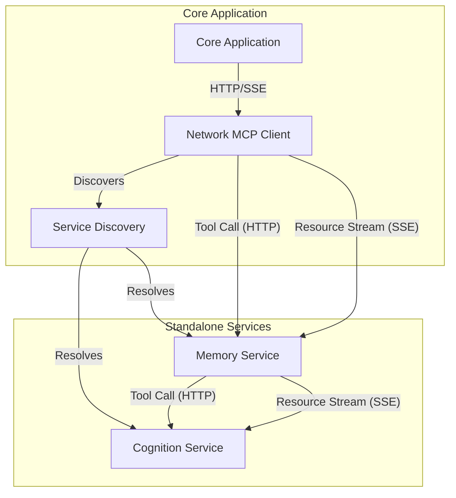

# Distributed MCP Architecture

## Overview

The Distributed MCP Architecture is the cornerstone of Phase 4, transforming the Cortex Core from an in-process system to a truly distributed system. This document provides a comprehensive explanation of how the Model Context Protocol (MCP) works in a distributed environment, detailing the communication patterns, protocols, error handling, and implementation specifics needed to build a robust distributed system.

In this architecture, services exist as independent processes that communicate over the network using HTTP and Server-Sent Events (SSE). Each service exposes a consistent MCP interface consisting of tools (function calls) and resources (data streams), with clear boundaries that enable independent scaling and development.

## Core Architectural Principles

The Distributed MCP Architecture adheres to these guiding principles:

1. **Service Independence**: Each service is a separate process with its own lifecycle
2. **Protocol Consistency**: The same MCP protocol is used regardless of deployment topology
3. **Clean Interfaces**: Services expose tools and resources with well-defined contracts
4. **Network Resilience**: Communication includes retry logic, connection management, and error handling
5. **Direct Communication**: Services communicate directly without middleware or message brokers
6. **Simple Discovery**: Service discovery uses a straightforward registry without complex dependencies

## Architectural Components



### Component Responsibilities

1. **Network MCP Client**

   - Makes HTTP requests to call tools on services
   - Establishes SSE connections to access resource streams
   - Manages connections, retries, and error handling
   - Serializes/deserializes requests and responses

2. **Service Discovery**

   - Maintains registry of available services and their endpoints
   - Resolves service names to network endpoints
   - Tracks service health and availability
   - Updates when services join or leave the system

3. **MCP Service**
   - Exposes HTTP endpoints for tool calls
   - Provides SSE endpoints for resource streams
   - Implements health check endpoint
   - Manages its own resources and lifecycle

## Network Protocol

The MCP protocol is implemented over HTTP and SSE for distributed services:

### HTTP for Tool Calls

Tool calls are implemented as HTTP POST requests to endpoints following this pattern:

```
POST /tool/{tool_name}
Content-Type: application/json

{
  "arguments": {
    "arg1": "value1",
    "arg2": "value2"
  }
}
```

Responses are JSON objects containing the tool's result:

```
HTTP/1.1 200 OK
Content-Type: application/json

{
  "result": {
    "key1": "value1",
    "key2": "value2"
  }
}
```

### SSE for Resource Streams

Resources are accessed via Server-Sent Events (SSE) connections to endpoints following this pattern:

```
GET /resource/{resource_path}
Accept: text/event-stream
```

The server responds with an SSE stream:

```
HTTP/1.1 200 OK
Content-Type: text/event-stream
Transfer-Encoding: chunked

data: {"key1":"value1","key2":"value2"}

data: {"key1":"updated1","key2":"updated2"}
```

### Headers and Metadata

Each request includes standard headers for authentication and tracing:

```
Authorization: Bearer {jwt_token}
X-Request-ID: {unique_request_id}
X-Trace-ID: {trace_id}
```

### Content Types

The MCP protocol uses these content types:

- `application/json` for request and response bodies in tool calls
- `text/event-stream` for SSE resource streams

## Message Format Specification

### Tool Call Request

```json
{
  "arguments": {
    "arg1": "value1",
    "arg2": "value2",
    "complex_arg": {
      "nested_key": "nested_value",
      "array_key": [1, 2, 3]
    }
  }
}
```

### Tool Call Response

```json
{
  "result": {
    "key1": "value1",
    "key2": "value2",
    "complex_result": {
      "nested_key": "nested_value",
      "array_key": [1, 2, 3]
    }
  }
}
```

### Tool Error Response

```json
{
  "error": {
    "code": "error_code",
    "message": "Detailed error message",
    "details": {
      "specific_key": "specific_value"
    }
  }
}
```

### SSE Event Format

```
data: {"key1":"value1","key2":"value2"}
```

## Network MCP Client Implementation

### Class Structure

```python
class NetworkMcpClient:
    """
    Client for communicating with MCP services over the network.
    """
    def __init__(self, service_discovery):
        """
        Initialize the network MCP client.

        Args:
            service_discovery: The service discovery instance
        """
        self.service_discovery = service_discovery
        self.connection_pool = {}
        self.client = httpx.AsyncClient()

    async def call_tool(self, service_name: str, tool_name: str, arguments: dict) -> dict:
        """
        Call a tool on a remote MCP service.

        Args:
            service_name: Name of the target service
            tool_name: Name of the tool to call
            arguments: Arguments to pass to the tool

        Returns:
            The tool's result

        Raises:
            ServiceNotFoundError: If the service cannot be found
            ServiceUnavailableError: If the service is unavailable
            ToolCallError: If the tool call fails
        """
        # Resolve service endpoint
        endpoint = await self.service_discovery.resolve(service_name)
        if not endpoint:
            raise ServiceNotFoundError(f"Service {service_name} not found")

        # Build full URL
        url = f"{endpoint}/tool/{tool_name}"

        # Prepare request
        request_body = {"arguments": arguments}

        try:
            # Make HTTP request
            response = await self.client.post(
                url,
                json=request_body,
                timeout=10.0  # 10 second timeout
            )

            # Handle response
            if response.status_code == 200:
                return response.json()
            else:
                # Parse error response
                error_data = response.json().get("error", {})
                raise ToolCallError(
                    f"Tool call failed: {error_data.get('message', 'Unknown error')}",
                    code=error_data.get("code"),
                    details=error_data.get("details")
                )

        except httpx.TimeoutException:
            raise ServiceUnavailableError(f"Service {service_name} timed out")
        except httpx.ConnectError:
            raise ServiceUnavailableError(f"Service {service_name} connection failed")
        except httpx.HTTPStatusError as e:
            raise ToolCallError(f"Tool call failed: {str(e)}")
        except Exception as e:
            raise ToolCallError(f"Tool call failed: {str(e)}")

    async def read_resource(self, service_name: str, resource_path: str):
        """
        Read a resource stream from a remote MCP service.

        Args:
            service_name: Name of the target service
            resource_path: Path to the resource

        Returns:
            An async generator yielding resource data

        Raises:
            ServiceNotFoundError: If the service cannot be found
            ServiceUnavailableError: If the service is unavailable
            ResourceStreamError: If the resource stream fails
        """
        # Resolve service endpoint
        endpoint = await self.service_discovery.resolve(service_name)
        if not endpoint:
            raise ServiceNotFoundError(f"Service {service_name} not found")

        # Build full URL
        url = f"{endpoint}/resource/{resource_path}"

        try:
            # Create SSE connection
            async with self.client.stream("GET", url, timeout=None) as response:
                # Check for successful response
                response.raise_for_status()

                # Process SSE stream
                async for line in response.aiter_lines():
                    # Parse SSE line
                    if line.startswith("data: "):
                        data = json.loads(line[6:])
                        yield data

        except httpx.ConnectError:
            raise ServiceUnavailableError(f"Service {service_name} connection failed")
        except httpx.HTTPStatusError as e:
            raise ResourceStreamError(f"Resource stream failed: {str(e)}")
        except Exception as e:
            raise ResourceStreamError(f"Resource stream failed: {str(e)}")

    async def close(self):
        """Close all connections and clean up resources."""
        await self.client.aclose()
```

### Connection Pooling

For improved performance, implement connection pooling to reuse connections:

```python
class ConnectionPool:
    """
    Pool of HTTP connections to services.
    """
    def __init__(self, max_connections=10):
        """
        Initialize the connection pool.

        Args:
            max_connections: Maximum number of connections per endpoint
        """
        self.pools = {}
        self.max_connections = max_connections

    async def get_client(self, endpoint: str) -> httpx.AsyncClient:
        """
        Get a client for the specified endpoint.

        Args:
            endpoint: The service endpoint URL

        Returns:
            An HTTP client
        """
        if endpoint not in self.pools:
            # Initialize pool for this endpoint
            self.pools[endpoint] = {
                "clients": [],
                "in_use": set()
            }

        pool = self.pools[endpoint]

        # Find an available client
        for client in pool["clients"]:
            if client not in pool["in_use"]:
                pool["in_use"].add(client)
                return client

        # Create a new client if pool not full
        if len(pool["clients"]) < self.max_connections:
            client = httpx.AsyncClient(base_url=endpoint)
            pool["clients"].append(client)
            pool["in_use"].add(client)
            return client

        # Wait for a client to become available
        while True:
            await asyncio.sleep(0.1)
            for client in pool["clients"]:
                if client not in pool["in_use"]:
                    pool["in_use"].add(client)
                    return client

    def release_client(self, endpoint: str, client: httpx.AsyncClient):
        """
        Release a client back to the pool.

        Args:
            endpoint: The service endpoint URL
            client: The client to release
        """
        if endpoint in self.pools:
            pool = self.pools[endpoint]
            if client in pool["in_use"]:
                pool["in_use"].remove(client)

    async def close_all(self):
        """Close all clients and clean up resources."""
        for pool in self.pools.values():
            for client in pool["clients"]:
                await client.aclose()
        self.pools.clear()
```

### Retry Logic

Implement retry logic to handle transient failures:

```python
async def call_with_retry(func, *args, max_retries=3, backoff_factor=1.5, **kwargs):
    """
    Call a function with exponential backoff retry.

    Args:
        func: The function to call
        *args: Positional arguments for the function
        max_retries: Maximum number of retry attempts
        backoff_factor: Exponential backoff factor
        **kwargs: Keyword arguments for the function

    Returns:
        The function result

    Raises:
        The last exception after max retries
    """
    retries = 0
    last_exception = None

    while retries <= max_retries:
        try:
            return await func(*args, **kwargs)
        except (ServiceUnavailableError, TimeoutError) as e:
            retries += 1
            last_exception = e

            if retries > max_retries:
                break

            # Calculate backoff time
            backoff_time = backoff_factor ** retries
            logger.warning(f"Retrying after {backoff_time:.2f}s due to: {str(e)}")
            await asyncio.sleep(backoff_time)

    # Max retries exceeded
    raise last_exception
```

### Circuit Breaker

Implement circuit breaker pattern to prevent repeated calls to failing services:

```python
class CircuitBreaker:
    """
    Circuit breaker to prevent calls to failing services.
    """
    def __init__(self, failure_threshold=5, recovery_time=30):
        """
        Initialize the circuit breaker.

        Args:
            failure_threshold: Number of failures before opening circuit
            recovery_time: Seconds to wait before trying again
        """
        self.services = {}
        self.failure_threshold = failure_threshold
        self.recovery_time = recovery_time

    def record_success(self, service_name: str):
        """
        Record a successful call to a service.

        Args:
            service_name: The service name
        """
        if service_name in self.services:
            service = self.services[service_name]
            if service["state"] == "half-open":
                # Reset on success in half-open state
                service["failures"] = 0
                service["state"] = "closed"
                service["last_failure"] = None
                logger.info(f"Circuit closed for service {service_name}")

    def record_failure(self, service_name: str):
        """
        Record a failed call to a service.

        Args:
            service_name: The service name
        """
        if service_name not in self.services:
            self.services[service_name] = {
                "failures": 0,
                "state": "closed",
                "last_failure": None
            }

        service = self.services[service_name]
        service["failures"] += 1
        service["last_failure"] = time.time()

        if service["state"] == "closed" and service["failures"] >= self.failure_threshold:
            # Open the circuit
            service["state"] = "open"
            logger.warning(f"Circuit opened for service {service_name}")

    def is_open(self, service_name: str) -> bool:
        """
        Check if the circuit is open for a service.

        Args:
            service_name: The service name

        Returns:
            True if circuit is open, False otherwise
        """
        if service_name not in self.services:
            return False

        service = self.services[service_name]

        if service["state"] == "open":
            # Check if recovery time has elapsed
            if time.time() - service["last_failure"] >= self.recovery_time:
                # Move to half-open state
                service["state"] = "half-open"
                logger.info(f"Circuit half-open for service {service_name}")
                return False

            return True

        return False
```

### Enhanced Network MCP Client

Combining these patterns:

```python
class EnhancedNetworkMcpClient:
    """
    Enhanced client for communicating with MCP services over the network.
    Includes connection pooling, retry logic, and circuit breaking.
    """
    def __init__(self, service_discovery):
        """
        Initialize the enhanced network MCP client.

        Args:
            service_discovery: The service discovery instance
        """
        self.service_discovery = service_discovery
        self.connection_pool = ConnectionPool()
        self.circuit_breaker = CircuitBreaker()

    async def call_tool(self, service_name: str, tool_name: str, arguments: dict) -> dict:
        """
        Call a tool on a remote MCP service with retry and circuit breaking.

        Args:
            service_name: Name of the target service
            tool_name: Name of the tool to call
            arguments: Arguments to pass to the tool

        Returns:
            The tool's result

        Raises:
            ServiceNotFoundError: If the service cannot be found
            CircuitOpenError: If the circuit is open for the service
            ServiceUnavailableError: If the service is unavailable
            ToolCallError: If the tool call fails
        """
        # Check circuit breaker
        if self.circuit_breaker.is_open(service_name):
            raise CircuitOpenError(f"Circuit open for service {service_name}")

        # Resolve service endpoint
        endpoint = await self.service_discovery.resolve(service_name)
        if not endpoint:
            raise ServiceNotFoundError(f"Service {service_name} not found")

        try:
            # Get client from pool
            client = await self.connection_pool.get_client(endpoint)

            try:
                # Make request with retry
                result = await call_with_retry(
                    self._make_tool_call,
                    client, endpoint, tool_name, arguments
                )

                # Record success
                self.circuit_breaker.record_success(service_name)

                return result

            finally:
                # Always release client back to pool
                self.connection_pool.release_client(endpoint, client)

        except (ServiceUnavailableError, TimeoutError) as e:
            # Record failure
            self.circuit_breaker.record_failure(service_name)
            raise

    async def _make_tool_call(self, client, endpoint, tool_name, arguments):
        """
        Make the actual tool call.

        Args:
            client: The HTTP client
            endpoint: The service endpoint
            tool_name: The tool name
            arguments: The tool arguments

        Returns:
            The tool result

        Raises:
            Various exceptions based on response
        """
        url = f"/tool/{tool_name}"
        request_body = {"arguments": arguments}

        try:
            response = await client.post(
                url,
                json=request_body,
                timeout=10.0
            )

            response.raise_for_status()
            return response.json()

        except httpx.TimeoutException:
            raise ServiceUnavailableError("Request timed out")
        except httpx.HTTPStatusError as e:
            if e.response.status_code >= 500:
                raise ServiceUnavailableError(f"Service error: {e}")
            else:
                error_data = e.response.json().get("error", {})
                raise ToolCallError(
                    error_data.get("message", str(e)),
                    code=error_data.get("code"),
                    details=error_data.get("details")
                )

    # ... similar implementation for read_resource ...

    async def close(self):
        """Close all connections and clean up resources."""
        await self.connection_pool.close_all()
```

## Service Discovery Implementation

The service discovery component maps service names to network endpoints:

```python
class ServiceDiscovery:
    """
    Simple service discovery for MCP services.
    """
    def __init__(self):
        """Initialize the service discovery registry."""
        self.services = {}
        self.health_status = {}

    async def initialize(self):
        """
        Initialize service discovery from environment variables.
        """
        # Read service endpoints from environment
        self.services = {
            "memory": os.getenv("MEMORY_SERVICE_URL", "http://localhost:9000"),
            "cognition": os.getenv("COGNITION_SERVICE_URL", "http://localhost:9100")
        }

        # Initialize health status
        self.health_status = {service: None for service in self.services}

        # Start health check background task
        asyncio.create_task(self._health_check_loop())

    async def register(self, service_name: str, endpoint: str):
        """
        Register a service endpoint.

        Args:
            service_name: The service name
            endpoint: The service endpoint URL
        """
        self.services[service_name] = endpoint
        self.health_status[service_name] = None

    async def resolve(self, service_name: str) -> Optional[str]:
        """
        Resolve a service name to an endpoint.

        Args:
            service_name: The service name

        Returns:
            The service endpoint URL or None if not found
        """
        return self.services.get(service_name)

    async def is_healthy(self, service_name: str) -> bool:
        """
        Check if a service is healthy.

        Args:
            service_name: The service name

        Returns:
            True if healthy, False otherwise
        """
        return self.health_status.get(service_name, False) == True

    async def _health_check_loop(self):
        """Background task for checking service health."""
        async with httpx.AsyncClient() as client:
            while True:
                for service_name, endpoint in self.services.items():
                    try:
                        # Try to call health endpoint
                        response = await client.get(
                            f"{endpoint}/health",
                            timeout=5.0
                        )

                        # Update health status
                        self.health_status[service_name] = response.status_code == 200

                    except Exception:
                        self.health_status[service_name] = False

                # Wait before next check
                await asyncio.sleep(30)  # Check every 30 seconds
```

## MCP Service Implementation

Each MCP service exposes HTTP endpoints for tool calls and SSE endpoints for resources:

### FastAPI Integration

```python
from fastapi import FastAPI, HTTPException, Request
from fastapi.responses import JSONResponse, StreamingResponse
import asyncio
import json

app = FastAPI()

# Registry of available tools
tools = {}

# Registry of available resources
resources = {}

@app.post("/tool/{tool_name}")
async def call_tool(tool_name: str, request: Request):
    """
    Endpoint for calling a tool.

    Args:
        tool_name: The name of the tool to call
        request: The HTTP request

    Returns:
        The tool result
    """
    # Check if tool exists
    if tool_name not in tools:
        raise HTTPException(status_code=404, detail=f"Tool '{tool_name}' not found")

    # Parse request body
    try:
        body = await request.json()
        arguments = body.get("arguments", {})
    except Exception:
        raise HTTPException(status_code=400, detail="Invalid request body")

    # Call the tool
    try:
        result = await tools[tool_name](**arguments)
        return {"result": result}
    except Exception as e:
        # Handle tool exception
        return JSONResponse(
            status_code=500,
            content={
                "error": {
                    "code": "tool_execution_error",
                    "message": str(e)
                }
            }
        )

@app.get("/resource/{resource_path:path}")
async def get_resource(resource_path: str):
    """
    Endpoint for accessing a resource stream.

    Args:
        resource_path: The resource path

    Returns:
        SSE stream of resource data
    """
    # Check if resource exists
    resource_handler = None
    for path_pattern, handler in resources.items():
        if resource_path.startswith(path_pattern):
            resource_handler = handler
            break

    if not resource_handler:
        raise HTTPException(status_code=404, detail=f"Resource '{resource_path}' not found")

    # Create streaming response
    async def event_generator():
        try:
            async for data in resource_handler(resource_path):
                yield f"data: {json.dumps(data)}\n\n"

        except Exception as e:
            # Log error but don't send to client
            logger.error(f"Resource stream error: {str(e)}")

    return StreamingResponse(
        event_generator(),
        media_type="text/event-stream"
    )

@app.get("/health")
async def health_check():
    """Health check endpoint."""
    # Implement service-specific health checks here
    return {"status": "healthy"}

# Tool registration function
def register_tool(name):
    """
    Decorator for registering a tool function.

    Args:
        name: The tool name
    """
    def decorator(func):
        tools[name] = func
        return func
    return decorator

# Resource registration function
def register_resource(path_prefix):
    """
    Decorator for registering a resource handler function.

    Args:
        path_prefix: The resource path prefix
    """
    def decorator(func):
        resources[path_prefix] = func
        return func
    return decorator
```

### Example Tool Implementation

```python
@register_tool("store_input")
async def store_input(user_id: str, input_data: dict) -> dict:
    """
    Store input data for a user.

    Args:
        user_id: The user ID
        input_data: The input data

    Returns:
        Status information
    """
    try:
        # Store the input in the database
        result = await database.store_input(user_id, input_data)

        return {
            "status": "stored",
            "user_id": user_id,
            "item_id": result.get("id")
        }

    except Exception as e:
        logger.error(f"Failed to store input: {str(e)}")
        raise ValueError(f"Failed to store input: {str(e)}")
```

### Example Resource Implementation

```python
@register_resource("history/")
async def get_history(resource_path: str):
    """
    Stream history data for a user.

    Args:
        resource_path: The resource path (format: "history/{user_id}")

    Yields:
        History items
    """
    # Extract user_id from path
    parts = resource_path.split("/")
    if len(parts) < 2:
        raise ValueError("Invalid resource path")

    user_id = parts[1]

    # Check if there's a limit parameter
    limit = None
    if len(parts) >= 4 and parts[2] == "limit":
        try:
            limit = int(parts[3])
        except ValueError:
            pass

    try:
        # Fetch history from database
        async for item in database.iter_history(user_id, limit=limit):
            yield item

    except Exception as e:
        logger.error(f"Failed to stream history: {str(e)}")
        raise
```

## Error Handling

### Exception Hierarchy

```python
class McpError(Exception):
    """Base class for all MCP errors."""
    pass

class ServiceNotFoundError(McpError):
    """Raised when a service cannot be found."""
    pass

class ServiceUnavailableError(McpError):
    """Raised when a service is unavailable."""
    pass

class CircuitOpenError(McpError):
    """Raised when a circuit is open for a service."""
    pass

class ToolCallError(McpError):
    """Raised when a tool call fails."""
    def __init__(self, message, code=None, details=None):
        super().__init__(message)
        self.code = code
        self.details = details

class ResourceStreamError(McpError):
    """Raised when a resource stream fails."""
    pass
```

### Error Response Format

All HTTP error responses should follow this format:

```json
{
  "error": {
    "code": "error_code",
    "message": "Detailed error message",
    "details": {
      "additional_information": "value"
    }
  }
}
```

### Error Handling in Network Client

```python
async def call_tool_safely(client, service_name, tool_name, arguments):
    """
    Call a tool with proper error handling.

    Args:
        client: The MCP client
        service_name: The service name
        tool_name: The tool name
        arguments: The tool arguments

    Returns:
        The tool result or None if failed
    """
    try:
        return await client.call_tool(service_name, tool_name, arguments)
    except ServiceNotFoundError:
        logger.error(f"Service {service_name} not found")
        return None
    except CircuitOpenError:
        logger.warning(f"Circuit open for service {service_name}")
        return None
    except ServiceUnavailableError as e:
        logger.error(f"Service {service_name} unavailable: {str(e)}")
        return None
    except ToolCallError as e:
        logger.error(f"Tool call error: {str(e)}")
        return None
    except Exception as e:
        logger.error(f"Unexpected error: {str(e)}")
        return None
```

## Security Considerations

### Authentication

All service-to-service communication should be authenticated using JWT tokens:

```python
class AuthenticatedNetworkMcpClient(NetworkMcpClient):
    """
    Network MCP client with authentication.
    """
    def __init__(self, service_discovery, auth_token_provider):
        """
        Initialize the authenticated network MCP client.

        Args:
            service_discovery: The service discovery instance
            auth_token_provider: Function that returns authentication token
        """
        super().__init__(service_discovery)
        self.auth_token_provider = auth_token_provider

    async def _make_tool_call(self, client, endpoint, tool_name, arguments):
        """
        Make an authenticated tool call.

        Args:
            client: The HTTP client
            endpoint: The service endpoint
            tool_name: The tool name
            arguments: The tool arguments

        Returns:
            The tool result
        """
        url = f"/tool/{tool_name}"
        request_body = {"arguments": arguments}

        # Get auth token
        token = await self.auth_token_provider()

        # Add auth header
        headers = {"Authorization": f"Bearer {token}"}

        try:
            response = await client.post(
                url,
                json=request_body,
                headers=headers,
                timeout=10.0
            )

            response.raise_for_status()
            return response.json()

        except Exception as e:
            # Handle exceptions
            raise
```

### Token Propagation

When a service calls another service, it should propagate the original user's authentication token:

```python
async def call_downstream_service(upstream_request, service_name, tool_name, arguments):
    """
    Call a downstream service with propagated authentication.

    Args:
        upstream_request: The incoming HTTP request
        service_name: The downstream service name
        tool_name: The tool name
        arguments: The tool arguments

    Returns:
        The tool result
    """
    # Extract auth token from upstream request
    auth_header = upstream_request.headers.get("Authorization")

    # Create MCP client with token
    async def token_provider():
        return auth_header.split(" ")[1] if auth_header else None

    client = AuthenticatedNetworkMcpClient(
        service_discovery,
        token_provider
    )

    # Call downstream service
    return await client.call_tool(service_name, tool_name, arguments)
```

### TLS Encryption

In production, all service-to-service communication should use HTTPS:

```python
# Configure httpx client with TLS
client = httpx.AsyncClient(
    verify=True,  # Verify TLS certificates
    cert=("/path/to/client.crt", "/path/to/client.key")  # Optional client certificate
)
```

## Distributed Tracing

Implement basic distributed tracing to track requests across services:

```python
class TracedNetworkMcpClient(NetworkMcpClient):
    """
    Network MCP client with distributed tracing.
    """
    def __init__(self, service_discovery, trace_id=None):
        """
        Initialize the traced network MCP client.

        Args:
            service_discovery: The service discovery instance
            trace_id: Optional trace ID to use
        """
        super().__init__(service_discovery)
        self.trace_id = trace_id or str(uuid.uuid4())

    async def _make_tool_call(self, client, endpoint, tool_name, arguments):
        """
        Make a traced tool call.

        Args:
            client: The HTTP client
            endpoint: The service endpoint
            tool_name: The tool name
            arguments: The tool arguments

        Returns:
            The tool result
        """
        url = f"/tool/{tool_name}"
        request_body = {"arguments": arguments}

        # Add tracing headers
        headers = {
            "X-Trace-ID": self.trace_id,
            "X-Request-ID": str(uuid.uuid4())
        }

        try:
            response = await client.post(
                url,
                json=request_body,
                headers=headers,
                timeout=10.0
            )

            response.raise_for_status()
            return response.json()

        except Exception as e:
            # Handle exceptions
            raise
```

## Testing Distributed Services

### Service Mocks

Create mock MCP services for testing:

```python
class MockMcpService:
    """
    Mock MCP service for testing.
    """
    def __init__(self):
        """Initialize the mock service."""
        self.tools = {}
        self.resources = {}

    def register_tool(self, name, handler):
        """
        Register a tool handler.

        Args:
            name: The tool name
            handler: The tool handler function
        """
        self.tools[name] = handler

    def register_resource(self, path, handler):
        """
        Register a resource handler.

        Args:
            path: The resource path
            handler: The resource handler function
        """
        self.resources[path] = handler

    async def handle_tool_call(self, tool_name, arguments):
        """
        Handle a tool call.

        Args:
            tool_name: The tool name
            arguments: The tool arguments

        Returns:
            The tool result
        """
        if tool_name not in self.tools:
            raise ValueError(f"Tool '{tool_name}' not found")

        return await self.tools[tool_name](**arguments)

    async def handle_resource_request(self, resource_path):
        """
        Handle a resource request.

        Args:
            resource_path: The resource path

        Returns:
            Resource data generator
        """
        for path_prefix, handler in self.resources.items():
            if resource_path.startswith(path_prefix):
                return handler(resource_path)

        raise ValueError(f"Resource '{resource_path}' not found")
```

### Mock Service Discovery

```python
class MockServiceDiscovery:
    """
    Mock service discovery for testing.
    """
    def __init__(self):
        """Initialize with mock services."""
        self.services = {}

    def register_service(self, name, service):
        """
        Register a mock service.

        Args:
            name: The service name
            service: The mock service instance
        """
        self.services[name] = service

    async def resolve(self, service_name):
        """
        Resolve a service name.

        Args:
            service_name: The service name

        Returns:
            The service name as the endpoint
        """
        return service_name if service_name in self.services else None

    async def is_healthy(self, service_name):
        """
        Check if a service is healthy.

        Args:
            service_name: The service name

        Returns:
            True if the service exists
        """
        return service_name in self.services
```

### Network MCP Client for Testing

```python
class TestNetworkMcpClient:
    """
    Network MCP client for testing with mock services.
    """
    def __init__(self, mock_service_discovery):
        """
        Initialize the test client.

        Args:
            mock_service_discovery: The mock service discovery instance
        """
        self.service_discovery = mock_service_discovery

    async def call_tool(self, service_name, tool_name, arguments):
        """
        Call a tool on a mock service.

        Args:
            service_name: The service name
            tool_name: The tool name
            arguments: The tool arguments

        Returns:
            The tool result
        """
        # Resolve service
        service = self.service_discovery.services.get(service_name)
        if not service:
            raise ServiceNotFoundError(f"Service {service_name} not found")

        # Call tool on mock service
        return await service.handle_tool_call(tool_name, arguments)

    async def read_resource(self, service_name, resource_path):
        """
        Read a resource from a mock service.

        Args:
            service_name: The service name
            resource_path: The resource path

        Returns:
            Resource data generator
        """
        # Resolve service
        service = self.service_discovery.services.get(service_name)
        if not service:
            raise ServiceNotFoundError(f"Service {service_name} not found")

        # Get resource from mock service
        return await service.handle_resource_request(resource_path)
```

### Integration Test Example

```python
@pytest.mark.asyncio
async def test_service_interaction():
    """Test interaction between services using mocks."""
    # Create mock services
    memory_service = MockMcpService()
    cognition_service = MockMcpService()

    # Register tools and resources
    memory_service.register_tool("store_input", mock_store_input)
    memory_service.register_resource("history/", mock_history_resource)

    cognition_service.register_tool("get_context", mock_get_context)

    # Create mock service discovery
    discovery = MockServiceDiscovery()
    discovery.register_service("memory", memory_service)
    discovery.register_service("cognition", cognition_service)

    # Create test client
    client = TestNetworkMcpClient(discovery)

    # Test calling tool
    result = await client.call_tool(
        "memory",
        "store_input",
        {
            "user_id": "test-user",
            "input_data": {"message": "Hello"}
        }
    )

    assert result["status"] == "stored"
    assert result["user_id"] == "test-user"

    # Test reading resource
    items = []
    async for item in client.read_resource("memory", "history/test-user"):
        items.append(item)

    assert len(items) > 0
    assert items[0]["message"] == "Hello"
```

## Network Testing

Test with actual network communication:

```python
import aiohttp
import asyncio

async def test_real_network_communication():
    """Test actual network communication between services."""
    # Start memory service in background
    memory_process = await asyncio.create_subprocess_exec(
        "python", "-m", "memory_service",
        env={"PORT": "9876"}
    )

    try:
        # Wait for service to start
        await asyncio.sleep(2)

        # Create real HTTP client
        async with aiohttp.ClientSession() as session:
            # Test health endpoint
            async with session.get("http://localhost:9876/health") as response:
                assert response.status == 200
                data = await response.json()
                assert data["status"] == "healthy"

            # Test tool call
            async with session.post(
                "http://localhost:9876/tool/store_input",
                json={
                    "arguments": {
                        "user_id": "test-user",
                        "input_data": {"message": "Test message"}
                    }
                }
            ) as response:
                assert response.status == 200
                data = await response.json()
                assert data["result"]["status"] == "stored"

            # Test resource stream
            async with session.get(
                "http://localhost:9876/resource/history/test-user"
            ) as response:
                assert response.status == 200
                assert response.headers["Content-Type"] == "text/event-stream"

                # Read first event
                line = await response.content.readline()
                assert line.startswith(b"data: ")

    finally:
        # Terminate service
        memory_process.terminate()
        await memory_process.wait()
```

## Best Practices

### Service Implementation

1. **Clear Interface Definitions**: Define tools and resources clearly with proper documentation
2. **Input Validation**: Validate all input parameters thoroughly
3. **Error Handling**: Return structured error responses with clear messages
4. **Timeouts**: Set appropriate timeouts for all operations
5. **Graceful Shutdown**: Handle shutdown signals properly to close connections
6. **Health Checks**: Implement meaningful health checks that verify dependencies
7. **Resource Cleanup**: Ensure all resources are properly released

### Network Client Usage

1. **Connection Pooling**: Reuse connections to reduce overhead
2. **Retry Logic**: Implement retry with exponential backoff for transient failures
3. **Circuit Breaking**: Prevent calls to failing services
4. **Timeout Configuration**: Set appropriate timeouts for different operations
5. **Error Propagation**: Wrap service errors with meaningful context
6. **Distributed Tracing**: Add trace and request IDs to all requests
7. **Clean Resource Management**: Always close clients and connections properly

### Service Discovery

1. **Simple Registry**: Keep service discovery simple and direct
2. **Environment Configuration**: Use environment variables for configuration
3. **Health Checks**: Implement background health checking
4. **Caching**: Cache resolved endpoints to reduce lookups
5. **Fallback Mechanisms**: Have fallback strategies for when services are unavailable

## Common Pitfalls and How to Avoid Them

### Connection Management

**Pitfall**: Failing to manage connections properly, leading to resource leaks.

**Solution**:

- Always use `async with` or try/finally blocks with connections
- Implement proper cleanup in shutdown handlers
- Use connection pooling with limits

```python
async def make_request(url, data):
    """Make a request with proper connection management."""
    async with httpx.AsyncClient() as client:
        return await client.post(url, json=data)
```

### Error Handling

**Pitfall**: Improper error handling causing cascading failures.

**Solution**:

- Use structured error responses
- Implement retry with circuit breaking
- Log detailed error information
- Handle both expected and unexpected errors

```python
try:
    result = await service.call_tool("tool_name", arguments)
    return result
except ServiceNotFoundError:
    # Handle specific error type
    logger.error("Service not found")
    return fallback_response()
except Exception as e:
    # Catch all other errors
    logger.exception("Unexpected error calling service")
    return error_response("internal_error", str(e))
```

### Timeouts

**Pitfall**: Missing or improper timeouts causing blocked operations.

**Solution**:

- Set timeouts on all network operations
- Use different timeout values for different types of operations
- Handle timeout exceptions gracefully

```python
try:
    # Set appropriate timeout
    result = await asyncio.wait_for(
        long_running_operation(),
        timeout=30.0  # 30 second timeout
    )
    return result
except asyncio.TimeoutError:
    logger.warning("Operation timed out")
    return timeout_response()
```

### Resource Exhaustion

**Pitfall**: Creating too many connections or tasks, leading to resource exhaustion.

**Solution**:

- Use connection pooling with limits
- Implement rate limiting for high-volume operations
- Monitor resource usage and implement backpressure

```python
class RateLimiter:
    """Simple rate limiter for network requests."""
    def __init__(self, limit=10):
        """
        Initialize with request limit.

        Args:
            limit: Maximum concurrent requests
        """
        self.semaphore = asyncio.Semaphore(limit)

    async def execute(self, coroutine):
        """
        Execute a coroutine with rate limiting.

        Args:
            coroutine: The coroutine to execute

        Returns:
            The coroutine result
        """
        async with self.semaphore:
            return await coroutine
```

### Service Discovery Issues

**Pitfall**: Hardcoded service endpoints or complex service discovery.

**Solution**:

- Use simple environment-based configuration
- Implement health checking to detect unavailable services
- Have fallback mechanisms for when services cannot be found

```python
async def get_service_endpoint(service_name):
    """Get service endpoint with fallback."""
    # Try service discovery first
    endpoint = await service_discovery.resolve(service_name)
    if endpoint:
        return endpoint

    # Fallback to environment variable
    fallback = os.getenv(f"{service_name.upper()}_SERVICE_URL")
    if fallback:
        return fallback

    # Default fallback
    return f"http://localhost:{DEFAULT_PORTS.get(service_name, 9000)}"
```

## Conclusion

The Distributed MCP Architecture enables Cortex Core to scale beyond a single process, with services running as independent processes communicating over HTTP and SSE. By implementing the Network MCP Client, Service Discovery, and MCP Service components described in this document, you will have a robust distributed system that maintains the same interface principles established in Phase 3 while gaining the benefits of independent scaling and deployment.

Key takeaways:

1. **Same Interface, Different Transport**: The MCP interface (tools and resources) remains the same, but communication happens over the network
2. **HTTP and SSE**: Tool calls use HTTP POST requests, resource streams use SSE
3. **Robust Communication**: Implement connection pooling, retry logic, and circuit breaking for reliability
4. **Simple Service Discovery**: Use a straightforward service registry without complex dependencies
5. **Clear Error Handling**: Use structured error responses and proper exception handling
6. **Independent Scaling**: Services can be deployed and scaled independently
7. **Testing Strategies**: Use both mock services and real network testing to validate the implementation

By following this guide, you will create a distributed system that balances simplicity with robustness, enabling the next phase of Cortex Core's evolution.
