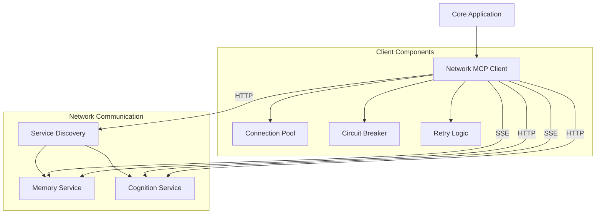

# Network MCP Client Implementation Guide

## Overview

The Network MCP Client is a critical component for Phase 4 of the Cortex Core. It enables communication between the core application and distributed MCP services over the network. This document provides comprehensive implementation details for transforming the in-process MCP client from Phase 3 into a network-capable client that reliably communicates with standalone services.

The Network MCP Client maintains the same interface as the Phase 3 client but adds robust handling for network communication, connection management, retry logic, and error recovery. This allows the core application to interact with distributed services while maintaining backward compatibility with existing code.

## Core Objectives

1. **Maintain Interface Compatibility**: Keep the same interface as Phase 3's MCP client
2. **Enable Network Communication**: Use HTTP/SSE for tool calls and resource streaming
3. **Add Connection Management**: Implement connection pooling and health checks
4. **Implement Error Handling**: Add robust recovery for network failures
5. **Support Service Discovery**: Integrate with the service discovery mechanism
6. **Enable Distributed Operation**: Support communication with multiple services

## Architecture



## Interface Definition

### NetworkMcpClient Class

```python
class NetworkMcpClient:
    """
    Network-capable MCP client for communicating with remote MCP services.
    Maintains the same interface as the Phase 3 MCP client but handles
    network communication, retries, circuit breaking, and error recovery.
    """

    def __init__(self, service_discovery):
        """
        Initialize the Network MCP client.

        Args:
            service_discovery: The service discovery instance for resolving service endpoints
        """

    async def connect(self, service_name: str) -> None:
        """
        Connect to a specific MCP service.

        Args:
            service_name: Name of the service to connect to

        Raises:
            ServiceNotFoundError: If the service cannot be found
            ConnectionError: If the connection cannot be established
        """

    async def call_tool(self, service_name: str, tool_name: str, arguments: dict) -> dict:
        """
        Call a tool on a specific MCP service.

        Args:
            service_name: Name of the service to call
            tool_name: Name of the tool to call
            arguments: Arguments to pass to the tool

        Returns:
            The tool's response

        Raises:
            ServiceNotFoundError: If the service cannot be found
            ToolNotFoundError: If the tool cannot be found
            ServiceCallError: If the call fails
            CircuitOpenError: If the circuit breaker is open
        """

    async def read_resource(self, service_name: str, resource_uri: str) -> Tuple[Any, Optional[str]]:
        """
        Read a resource from a specific MCP service.

        Args:
            service_name: Name of the service to read from
            resource_uri: URI of the resource to read

        Returns:
            Tuple of (resource content, mime type)

        Raises:
            ServiceNotFoundError: If the service cannot be found
            ResourceNotFoundError: If the resource cannot be found
            ResourceReadError: If the resource read fails
            CircuitOpenError: If the circuit breaker is open
        """

    async def stream_resource(self, service_name: str, resource_uri: str) -> AsyncIterable:
        """
        Stream a resource from a specific MCP service using SSE.

        Args:
            service_name: Name of the service to stream from
            resource_uri: URI of the resource to stream

        Returns:
            An async iterable of resource events

        Raises:
            ServiceNotFoundError: If the service cannot be found
            ResourceNotFoundError: If the resource cannot be found
            ResourceStreamError: If the resource stream fails
            CircuitOpenError: If the circuit breaker is open
        """

    async def close(self) -> None:
        """
        Close all connections and clean up resources.
        """
```

## Implementation Details

### Connection Management

Connection management is a critical aspect of the network client, handling the establishment, pooling, and reuse of HTTP connections to services.

#### Connection Pool

The connection pool maintains reusable connections to each service to avoid the overhead of creating new connections for each request.

```python
class ConnectionPool:
    """
    Manages a pool of connections to MCP services.
    """

    def __init__(self, max_connections: int = 10, idle_timeout: int = 60):
        """
        Initialize the connection pool.

        Args:
            max_connections: Maximum connections per service
            idle_timeout: Maximum idle time in seconds before closing
        """
        self.pools: Dict[str, List[Tuple[httpx.AsyncClient, float]]] = {}
        self.max_connections = max_connections
        self.idle_timeout = idle_timeout
        self.lock = asyncio.Lock()

    async def get_connection(self, service_url: str) -> httpx.AsyncClient:
        """
        Get a connection from the pool or create a new one.

        Args:
            service_url: URL of the service

        Returns:
            An HTTP client for the service
        """
        async with self.lock:
            # Create pool for service if it doesn't exist
            if service_url not in self.pools:
                self.pools[service_url] = []

            # Clean expired connections
            now = time.time()
            self.pools[service_url] = [
                (client, timestamp)
                for client, timestamp in self.pools[service_url]
                if now - timestamp < self.idle_timeout
            ]

            # Check for available connection
            if self.pools[service_url]:
                client, _ = self.pools[service_url].pop(0)
                return client

            # Create new connection if pool not full
            if len(self.pools[service_url]) < self.max_connections:
                return self._create_new_connection(service_url)

            # Wait for a connection to become available
            while not self.pools[service_url]:
                await asyncio.sleep(0.1)

            client, _ = self.pools[service_url].pop(0)
            return client

    def release_connection(self, service_url: str, client: httpx.AsyncClient):
        """
        Release a connection back to the pool.

        Args:
            service_url: URL of the service
            client: The HTTP client to release
        """
        if service_url in self.pools and len(self.pools[service_url]) < self.max_connections:
            self.pools[service_url].append((client, time.time()))
        else:
            # Close connection if pool is full or doesn't exist
            asyncio.create_task(client.aclose())

    def _create_new_connection(self, service_url: str) -> httpx.AsyncClient:
        """
        Create a new HTTP client for the service.

        Args:
            service_url: URL of the service

        Returns:
            A new HTTP client
        """
        return httpx.AsyncClient(
            base_url=service_url,
            timeout=httpx.Timeout(30.0),  # 30 second timeout
            follow_redirects=True
        )

    async def close(self):
        """
        Close all connections in the pool.
        """
        for service_url, connections in self.pools.items():
            for client, _ in connections:
                await client.aclose()
        self.pools.clear()
```

### Circuit Breaker

The circuit breaker prevents repeated attempts to call a failing service, allowing it time to recover and preventing cascading failures.

```python
class CircuitBreaker:
    """
    Circuit breaker to prevent repeated calls to failing services.
    """

    # Circuit states
    CLOSED = "CLOSED"      # Normal operation, requests go through
    OPEN = "OPEN"          # Service is down, reject requests immediately
    HALF_OPEN = "HALF_OPEN"  # Testing if service is back up

    def __init__(
        self,
        failure_threshold: int = 5,
        reset_timeout: int = 30,
        half_open_max_calls: int = 1
    ):
        """
        Initialize the circuit breaker.

        Args:
            failure_threshold: Number of failures before opening circuit
            reset_timeout: Seconds before trying half-open state
            half_open_max_calls: Max calls allowed in half-open state
        """
        self.failure_threshold = failure_threshold
        self.reset_timeout = reset_timeout
        self.half_open_max_calls = half_open_max_calls

        self.services = {}  # Track state for each service
        self.lock = asyncio.Lock()

    async def get_service_state(self, service_name: str) -> dict:
        """
        Get or create state tracking for a service.

        Args:
            service_name: The service to get state for

        Returns:
            Service state dictionary
        """
        async with self.lock:
            if service_name not in self.services:
                self.services[service_name] = {
                    "state": self.CLOSED,
                    "failures": 0,
                    "last_failure_time": 0,
                    "half_open_calls": 0
                }
            return self.services[service_name]

    async def should_allow_request(self, service_name: str) -> bool:
        """
        Check if a request should be allowed through.

        Args:
            service_name: The service to check

        Returns:
            True if request should be allowed, False otherwise
        """
        service = await self.get_service_state(service_name)

        # If circuit is CLOSED, always allow
        if service["state"] == self.CLOSED:
            return True

        # If circuit is OPEN, check if reset timeout has elapsed
        if service["state"] == self.OPEN:
            if time.time() - service["last_failure_time"] > self.reset_timeout:
                # Transition to HALF_OPEN
                async with self.lock:
                    service["state"] = self.HALF_OPEN
                    service["half_open_calls"] = 0
                return True
            return False

        # If HALF_OPEN, allow limited calls
        if service["state"] == self.HALF_OPEN:
            async with self.lock:
                if service["half_open_calls"] < self.half_open_max_calls:
                    service["half_open_calls"] += 1
                    return True
            return False

    async def record_success(self, service_name: str):
        """
        Record a successful call to the service.

        Args:
            service_name: The service that was called
        """
        async with self.lock:
            service = await self.get_service_state(service_name)

            # Reset failures on success
            service["failures"] = 0

            # If HALF_OPEN and successful, transition to CLOSED
            if service["state"] == self.HALF_OPEN:
                service["state"] = self.CLOSED
                service["half_open_calls"] = 0

    async def record_failure(self, service_name: str):
        """
        Record a failed call to the service.

        Args:
            service_name: The service that failed
        """
        async with self.lock:
            service = await self.get_service_state(service_name)

            # Record failure
            service["failures"] += 1
            service["last_failure_time"] = time.time()

            # If threshold reached, open circuit
            if service["state"] == self.CLOSED and service["failures"] >= self.failure_threshold:
                service["state"] = self.OPEN

            # If HALF_OPEN and failed, go back to OPEN
            if service["state"] == self.HALF_OPEN:
                service["state"] = self.OPEN
                service["half_open_calls"] = 0
```

### Retry Strategy

The retry strategy handles transient failures by automatically retrying failed requests.

```python
class RetryStrategy:
    """
    Strategy for retrying failed network requests.
    """

    def __init__(
        self,
        max_retries: int = 3,
        initial_backoff: float = 0.1,
        backoff_factor: float = 2.0,
        max_backoff: float = 10.0,
        retryable_status_codes: List[int] = None,
        retryable_exceptions: List[Type[Exception]] = None
    ):
        """
        Initialize the retry strategy.

        Args:
            max_retries: Maximum number of retry attempts
            initial_backoff: Initial backoff time in seconds
            backoff_factor: Multiplier for backoff on each retry
            max_backoff: Maximum backoff time in seconds
            retryable_status_codes: HTTP status codes to retry
            retryable_exceptions: Exception types to retry
        """
        self.max_retries = max_retries
        self.initial_backoff = initial_backoff
        self.backoff_factor = backoff_factor
        self.max_backoff = max_backoff

        self.retryable_status_codes = retryable_status_codes or [
            408,  # Request Timeout
            429,  # Too Many Requests
            500,  # Internal Server Error
            502,  # Bad Gateway
            503,  # Service Unavailable
            504   # Gateway Timeout
        ]

        self.retryable_exceptions = retryable_exceptions or [
            httpx.ConnectError,
            httpx.ReadError,
            httpx.WriteError,
            httpx.PoolTimeout,
            httpx.ReadTimeout,
            httpx.WriteTimeout,
            httpx.ConnectTimeout,
            asyncio.TimeoutError
        ]

    def should_retry(self, attempt: int, exception: Exception = None, status_code: int = None) -> bool:
        """
        Determine if a request should be retried.

        Args:
            attempt: The current attempt number (0-based)
            exception: The exception that occurred, if any
            status_code: The HTTP status code, if any

        Returns:
            True if the request should be retried, False otherwise
        """
        # Check if we've exceeded max retries
        if attempt >= self.max_retries:
            return False

        # Check if the exception is retryable
        if exception is not None:
            return any(isinstance(exception, exc_type) for exc_type in self.retryable_exceptions)

        # Check if the status code is retryable
        if status_code is not None:
            return status_code in self.retryable_status_codes

        return False

    def get_backoff_time(self, attempt: int) -> float:
        """
        Calculate the backoff time for a retry attempt.

        Args:
            attempt: The current attempt number (0-based)

        Returns:
            The backoff time in seconds
        """
        backoff = self.initial_backoff * (self.backoff_factor ** attempt)
        return min(backoff, self.max_backoff)
```

### Complete Network MCP Client Implementation

Here's the complete implementation of the Network MCP Client:

```python
import asyncio
import httpx
import json
import logging
import time
from typing import Dict, List, Any, AsyncIterable, Optional, Tuple, Type

logger = logging.getLogger(__name__)

class ServiceNotFoundError(Exception):
    """Raised when a service cannot be found."""
    pass

class ToolNotFoundError(Exception):
    """Raised when a tool cannot be found."""
    pass

class ResourceNotFoundError(Exception):
    """Raised when a resource cannot be found."""
    pass

class ServiceCallError(Exception):
    """Raised when a service call fails."""
    pass

class ResourceReadError(Exception):
    """Raised when a resource read fails."""
    pass

class ResourceStreamError(Exception):
    """Raised when a resource stream fails."""
    pass

class CircuitOpenError(Exception):
    """Raised when the circuit breaker is open."""
    pass

class NetworkMcpClient:
    """
    Network-capable MCP client for communicating with remote MCP services.
    Maintains the same interface as the Phase 3 MCP client but handles
    network communication, retries, circuit breaking, and error recovery.
    """

    def __init__(self, service_discovery, config: Dict[str, Any] = None):
        """
        Initialize the Network MCP client.

        Args:
            service_discovery: The service discovery instance for resolving service endpoints
            config: Optional configuration dictionary
        """
        self.service_discovery = service_discovery
        self.config = config or {}

        # Initialize connection pool
        max_connections = self.config.get("max_connections", 10)
        idle_timeout = self.config.get("idle_timeout", 60)
        self.connection_pool = ConnectionPool(max_connections, idle_timeout)

        # Initialize circuit breaker
        failure_threshold = self.config.get("failure_threshold", 5)
        reset_timeout = self.config.get("reset_timeout", 30)
        half_open_max_calls = self.config.get("half_open_max_calls", 1)
        self.circuit_breaker = CircuitBreaker(
            failure_threshold,
            reset_timeout,
            half_open_max_calls
        )

        # Initialize retry strategy
        max_retries = self.config.get("max_retries", 3)
        initial_backoff = self.config.get("initial_backoff", 0.1)
        backoff_factor = self.config.get("backoff_factor", 2.0)
        max_backoff = self.config.get("max_backoff", 10.0)
        self.retry_strategy = RetryStrategy(
            max_retries,
            initial_backoff,
            backoff_factor,
            max_backoff
        )

        # Track service connections
        self.services = {}

        logger.info(f"Initialized Network MCP Client with service discovery: {service_discovery}")

    async def connect(self, service_name: str) -> None:
        """
        Connect to a specific MCP service.

        Args:
            service_name: Name of the service to connect to

        Raises:
            ServiceNotFoundError: If the service cannot be found
            ConnectionError: If the connection cannot be established
        """
        # Skip if already connected
        if service_name in self.services:
            return

        # Resolve service endpoint
        endpoint = await self.service_discovery.resolve(service_name)
        if not endpoint:
            raise ServiceNotFoundError(f"Service '{service_name}' not found")

        # Create connection (just store the endpoint URL)
        self.services[service_name] = {
            "endpoint": endpoint,
            "connected": True
        }

        logger.info(f"Connected to MCP service: {service_name} at {endpoint}")

    async def call_tool(self, service_name: str, tool_name: str, arguments: dict) -> dict:
        """
        Call a tool on a specific MCP service.

        Args:
            service_name: Name of the service to call
            tool_name: Name of the tool to call
            arguments: Arguments to pass to the tool

        Returns:
            The tool's response

        Raises:
            ServiceNotFoundError: If the service cannot be found
            ToolNotFoundError: If the tool cannot be found
            ServiceCallError: If the call fails
            CircuitOpenError: If the circuit breaker is open
        """
        # Ensure we're connected to the service
        await self.connect(service_name)

        # Check circuit breaker
        if not await self.circuit_breaker.should_allow_request(service_name):
            raise CircuitOpenError(f"Circuit breaker open for service '{service_name}'")

        service = self.services[service_name]
        endpoint = service["endpoint"]

        # Prepare for retries
        attempt = 0
        last_exception = None

        while True:
            client = None
            try:
                # Get connection from pool
                client = await self.connection_pool.get_connection(endpoint)

                # Make request
                response = await client.post(
                    f"/tool/{tool_name}",
                    json=arguments,
                    headers={"Content-Type": "application/json"}
                )

                # Handle success
                if response.status_code == 200:
                    result = response.json()
                    await self.circuit_breaker.record_success(service_name)
                    return result

                # Handle error responses
                if response.status_code == 404:
                    raise ToolNotFoundError(f"Tool '{tool_name}' not found on service '{service_name}'")

                # Consider retrying based on status code
                if self.retry_strategy.should_retry(attempt, status_code=response.status_code):
                    attempt += 1
                    backoff_time = self.retry_strategy.get_backoff_time(attempt)
                    logger.warning(f"Retrying tool call '{service_name}.{tool_name}' (attempt {attempt+1}) after {backoff_time}s - received status {response.status_code}")
                    await asyncio.sleep(backoff_time)
                    continue

                # Non-retryable error
                error_detail = f"Status: {response.status_code}"
                try:
                    error_json = response.json()
                    if isinstance(error_json, dict) and "error" in error_json:
                        error_detail = f"{error_detail}, Error: {error_json['error']}"
                except:
                    # Failed to parse error JSON
                    error_detail = f"{error_detail}, Body: {response.text[:100]}"

                raise ServiceCallError(f"Failed to call tool '{service_name}.{tool_name}': {error_detail}")

            except (ServiceNotFoundError, ToolNotFoundError, CircuitOpenError):
                # Don't retry these specific exceptions
                raise

            except Exception as e:
                last_exception = e

                # Consider retrying based on exception type
                if self.retry_strategy.should_retry(attempt, exception=e):
                    attempt += 1
                    backoff_time = self.retry_strategy.get_backoff_time(attempt)
                    logger.warning(f"Retrying resource stream '{service_name}/{resource_uri}' (attempt {attempt+1}) after {backoff_time}s due to {type(e).__name__}: {str(e)}")
                    await asyncio.sleep(backoff_time)
                    continue

                # Record failure if we're not retrying
                await self.circuit_breaker.record_failure(service_name)
                raise ResourceStreamError(f"Failed to stream resource '{service_name}/{resource_uri}': {str(e)}") from e

    async def close(self) -> None:
        """
        Close all connections and clean up resources.
        """
        # Close connection pool
        await self.connection_pool.close()

        # Clear service registry
        self.services.clear()

        logger.info("Network MCP Client closed")
```

## Resource Streaming Pattern

Resource streaming uses Server-Sent Events (SSE) to receive continuous events from MCP services.

### SSE Event Format

Server-Sent Events follow this format:

```
data: {"key": "value"}

data: {"another": "event"}
```

Each event is a line starting with `data: ` followed by the event payload (usually JSON), and events are separated by double newlines.

### Consuming SSE Streams

Here's an example of consuming a resource stream:

```python
async def process_history_stream(client, user_id):
    """Process a stream of history events for a user."""
    try:
        async for event in client.stream_resource("memory", f"history/{user_id}/stream"):
            # Process each event as it arrives
            print(f"Received history event: {event}")

            # Perform actions based on event type
            if "message" in event:
                # Process message event
                await handle_message(event["message"])

    except ResourceStreamError as e:
        logger.error(f"Error streaming history: {e}")
        # Implement fallback strategy
```

## Error Handling Strategies

### Error Types

The Network MCP Client defines several error types:

1. **ServiceNotFoundError**: The requested service is not registered
2. **ToolNotFoundError**: The requested tool does not exist
3. **ResourceNotFoundError**: The requested resource does not exist
4. **ServiceCallError**: The service call failed for other reasons
5. **ResourceReadError**: The resource read failed
6. **ResourceStreamError**: The resource stream failed
7. **CircuitOpenError**: The circuit breaker is open, preventing the call

### Error Handling Patterns

Here are recommended patterns for handling errors:

```python
# Pattern 1: Handle specific error types
try:
    result = await mcp_client.call_tool("memory", "store_input", {"user_id": user_id, "data": data})
except ServiceNotFoundError:
    # Service discovery issue
    logger.error("Memory service not found")
    # Fallback: Store locally until service is available
except ToolNotFoundError:
    # Service exists but tool doesn't
    logger.error("store_input tool not found on memory service")
    # Report configuration issue
except CircuitOpenError:
    # Service is temporarily unavailable
    logger.warning("Memory service circuit open")
    # Queue for later processing
except ServiceCallError as e:
    # Other service call failure
    logger.error(f"Failed to store input: {e}")
    # Attempt alternate storage or notify user

# Pattern 2: Simplified error handling
try:
    result = await mcp_client.call_tool("memory", "store_input", {"user_id": user_id, "data": data})
except (ServiceNotFoundError, CircuitOpenError):
    # Service unavailable, queue for later
    await queue_for_later("memory", "store_input", {"user_id": user_id, "data": data})
except Exception as e:
    # Any other error
    logger.error(f"Unexpected error storing input: {e}")
    # Notify monitoring system
```

## Integration with Service Discovery

The Network MCP Client integrates with the service discovery mechanism to locate and connect to services.

### Service Discovery Interface

```python
class ServiceDiscovery:
    """Interface for service discovery."""

    async def resolve(self, service_name: str) -> Optional[str]:
        """
        Resolve a service name to an endpoint URL.

        Args:
            service_name: Name of the service to resolve

        Returns:
            URL of the service or None if not found
        """
        pass

    async def is_healthy(self, service_name: str) -> bool:
        """
        Check if a service is healthy.

        Args:
            service_name: Name of the service to check

        Returns:
            True if the service is healthy, False otherwise
        """
        pass
```

### Usage with Network MCP Client

```python
# Initialize service discovery
service_discovery = ServiceDiscovery()
await service_discovery.initialize()

# Create network MCP client with service discovery
mcp_client = NetworkMcpClient(service_discovery)

# Use client to call services
result = await mcp_client.call_tool("memory", "store_input", {...})
```

## Configuration Options

The Network MCP Client supports the following configuration options:

| Option                | Description                           | Default | Recommended Range |
| --------------------- | ------------------------------------- | ------- | ----------------- |
| `max_connections`     | Maximum connections per service       | 10      | 5-20              |
| `idle_timeout`        | Connection idle timeout (seconds)     | 60      | 30-120            |
| `failure_threshold`   | Failures before circuit opens         | 5       | 3-10              |
| `reset_timeout`       | Time before testing circuit (seconds) | 30      | 10-60             |
| `half_open_max_calls` | Max calls in half-open state          | 1       | 1-3               |
| `max_retries`         | Maximum retry attempts                | 3       | 2-5               |
| `initial_backoff`     | Initial retry backoff (seconds)       | 0.1     | 0.1-1.0           |
| `backoff_factor`      | Backoff multiplier for retries        | 2.0     | 1.5-3.0           |
| `max_backoff`         | Maximum backoff time (seconds)        | 10.0    | 5.0-30.0          |

Example configuration:

```python
config = {
    "max_connections": 10,
    "idle_timeout": 60,
    "failure_threshold": 5,
    "reset_timeout": 30,
    "half_open_max_calls": 1,
    "max_retries": 3,
    "initial_backoff": 0.1,
    "backoff_factor": 2.0,
    "max_backoff": 10.0
}

# Create client with custom config
mcp_client = NetworkMcpClient(service_discovery, config)
```

## Integration Examples

### Core Application Integration

```python
# In app/main.py or similar
from app.core.service_discovery import ServiceDiscovery
from app.core.network_mcp_client import NetworkMcpClient

# Setup function
async def setup_mcp_client():
    # Initialize service discovery
    service_discovery = ServiceDiscovery()
    await service_discovery.initialize()

    # Create network MCP client
    mcp_client = NetworkMcpClient(service_discovery)

    return mcp_client

# Startup event
@app.on_event("startup")
async def startup():
    # Initialize MCP client
    app.state.mcp_client = await setup_mcp_client()

# Shutdown event
@app.on_event("shutdown")
async def shutdown():
    # Close MCP client
    if hasattr(app.state, "mcp_client"):
        await app.state.mcp_client.close()
```

### Memory Service Integration

```python
# In app/services/memory.py
class MemoryServiceClient:
    """Client for the Memory Service."""

    def __init__(self, mcp_client: NetworkMcpClient):
        self.mcp_client = mcp_client
        self.service_name = "memory"

    async def store_input(self, user_id: str, input_data: dict) -> dict:
        """Store input data for a user."""
        return await self.mcp_client.call_tool(
            self.service_name,
            "store_input",
            {
                "user_id": user_id,
                "input_data": input_data
            }
        )

    async def get_history(self, user_id: str) -> list:
        """Get history for a user."""
        history, _ = await self.mcp_client.read_resource(
            self.service_name,
            f"history/{user_id}"
        )
        return history

    async def stream_history(self, user_id: str) -> AsyncIterable:
        """Stream history events for a user."""
        return self.mcp_client.stream_resource(
            self.service_name,
            f"history/{user_id}/stream"
        )
```

### Endpoint Integration

```python
# In app/api/input.py
from fastapi import APIRouter, Depends, HTTPException
from app.services.memory import MemoryServiceClient
from app.dependencies import get_memory_service, get_current_user

router = APIRouter()

@router.post("/input")
async def receive_input(
    input_data: dict,
    user: dict = Depends(get_current_user),
    memory_service: MemoryServiceClient = Depends(get_memory_service)
):
    """Receive input from client."""
    try:
        # Store input using memory service
        result = await memory_service.store_input(user["user_id"], input_data)
        return {"status": "success", "result": result}
    except Exception as e:
        # Handle errors
        raise HTTPException(status_code=500, detail=f"Failed to process input: {str(e)}")
```

## Complete Usage Example

Here's a complete example showing how to use the Network MCP Client:

```python
import asyncio
import logging
from app.core.service_discovery import ServiceDiscovery
from app.core.network_mcp_client import NetworkMcpClient

# Configure logging
logging.basicConfig(level=logging.INFO)
logger = logging.getLogger(__name__)

async def main():
    # Initialize service discovery
    service_discovery = ServiceDiscovery()
    await service_discovery.initialize()

    # Create network MCP client
    mcp_client = NetworkMcpClient(service_discovery)

    try:
        # Call a tool
        user_id = "user-123"
        input_data = {
            "message": "Hello, world!",
            "timestamp": "2025-03-20T12:34:56Z"
        }

        result = await mcp_client.call_tool(
            "memory",
            "store_input",
            {
                "user_id": user_id,
                "input_data": input_data
            }
        )

        logger.info(f"Store result: {result}")

        # Read a resource
        history, _ = await mcp_client.read_resource(
            "memory",
            f"history/{user_id}"
        )

        logger.info(f"History: {history}")

        # Stream a resource
        logger.info("Starting history stream...")
        count = 0
        async for event in mcp_client.stream_resource(
            "memory",
            f"history/{user_id}/stream"
        ):
            logger.info(f"Stream event: {event}")
            count += 1
            if count >= 5:
                break

    except Exception as e:
        logger.error(f"Error: {e}")
    finally:
        # Clean up
        await mcp_client.close()

if __name__ == "__main__":
    asyncio.run(main())
```

## Testing the Network MCP Client

### Unit Testing

```python
import pytest
import asyncio
from unittest.mock import AsyncMock, patch
from app.core.network_mcp_client import NetworkMcpClient, ServiceNotFoundError

@pytest.fixture
def mock_service_discovery():
    """Create a mock service discovery."""
    mock = AsyncMock()
    mock.resolve.return_value = "http://localhost:9000"
    mock.is_healthy.return_value = True
    return mock

@pytest.fixture
async def mcp_client(mock_service_discovery):
    """Create a test MCP client."""
    client = NetworkMcpClient(mock_service_discovery)
    yield client
    await client.close()

@pytest.mark.asyncio
async def test_connect(mcp_client, mock_service_discovery):
    """Test connecting to a service."""
    # Connect to service
    await mcp_client.connect("memory")

    # Verify service discovery was called
    mock_service_discovery.resolve.assert_called_once_with("memory")

    # Verify service was stored
    assert "memory" in mcp_client.services
    assert mcp_client.services["memory"]["endpoint"] == "http://localhost:9000"

@pytest.mark.asyncio
async def test_connect_service_not_found(mcp_client, mock_service_discovery):
    """Test connecting to a non-existent service."""
    # Configure mock to return None
    mock_service_discovery.resolve.return_value = None

    # Attempt to connect
    with pytest.raises(ServiceNotFoundError):
        await mcp_client.connect("non-existent")

@pytest.mark.asyncio
async def test_call_tool(mcp_client):
    """Test calling a tool."""
    # Mock httpx.AsyncClient
    with patch("httpx.AsyncClient") as mock_client:
        # Configure mock client
        mock_instance = AsyncMock()
        mock_client.return_value = mock_instance

        # Configure post response
        mock_response = AsyncMock()
        mock_response.status_code = 200
        mock_response.json.return_value = {"result": "success"}
        mock_instance.post.return_value = mock_response

        # Call tool
        result = await mcp_client.call_tool(
            "memory",
            "store_input",
            {"user_id": "test", "data": "test"}
        )

        # Verify result
        assert result == {"result": "success"}

        # Verify post was called
        mock_instance.post.assert_called_once()

        # Verify URL
        call_args = mock_instance.post.call_args[0]
        assert call_args[0] == "/tool/store_input"
```

### Integration Testing

```python
import pytest
import asyncio
import httpx
from app.core.network_mcp_client import NetworkMcpClient
from app.core.service_discovery import ServiceDiscovery

@pytest.mark.integration
@pytest.mark.asyncio
async def test_network_mcp_client_integration():
    """Integration test for Network MCP Client."""
    # This test requires actual services to be running

    # Initialize service discovery
    service_discovery = ServiceDiscovery()
    await service_discovery.initialize()

    # Create network MCP client
    mcp_client = NetworkMcpClient(service_discovery)

    try:
        # Test connecting to memory service
        await mcp_client.connect("memory")

        # Test calling a tool
        result = await mcp_client.call_tool(
            "memory",
            "store_input",
            {
                "user_id": "test-user",
                "input_data": {
                    "message": "Test message",
                    "timestamp": "2025-03-20T12:34:56Z"
                }
            }
        )

        assert "status" in result
        assert result["status"] == "stored"

        # Test reading a resource
        history, content_type = await mcp_client.read_resource(
            "memory",
            "history/test-user"
        )

        assert isinstance(history, list)
        assert content_type == "application/json"

        # Verify message is in history
        found = False
        for item in history:
            if isinstance(item, dict) and item.get("message") == "Test message":
                found = True
                break

        assert found, "Test message not found in history"

    finally:
        # Clean up
        await mcp_client.close()
```

## Common Issues and Solutions

### Connection Failures

**Issue**: The client fails to connect to services with network errors.

**Solution**:

1. Check service discovery configuration
2. Verify service is running and accessible
3. Check network connectivity (firewalls, routing)
4. Increase connection timeout
5. Add more detailed logging

```python
# Enhanced connect method with better error reporting
async def connect(self, service_name: str) -> None:
    """Connect to a specific MCP service with detailed error reporting."""
    # Skip if already connected
    if service_name in self.services:
        return

    # Resolve service endpoint
    endpoint = await self.service_discovery.resolve(service_name)
    if not endpoint:
        logger.error(f"Service discovery failed to resolve '{service_name}'")
        raise ServiceNotFoundError(f"Service '{service_name}' not found")

    try:
        # Test connection
        async with httpx.AsyncClient() as client:
            response = await client.get(f"{endpoint}/health", timeout=5.0)
            if response.status_code != 200:
                logger.error(f"Health check failed for '{service_name}': {response.status_code}")
                raise ConnectionError(f"Service '{service_name}' health check failed")
    except Exception as e:
        logger.error(f"Connection test failed for '{service_name}' at {endpoint}: {str(e)}")
        raise ConnectionError(f"Failed to connect to service '{service_name}': {str(e)}")

    # Create connection
    self.services[service_name] = {
        "endpoint": endpoint,
        "connected": True
    }

    logger.info(f"Connected to MCP service: {service_name} at {endpoint}")
```

### Circuit Breaker Triggering

**Issue**: The circuit breaker trips frequently, preventing service calls.

**Solution**:

1. Increase failure threshold (higher tolerance for failures)
2. Decrease reset timeout (faster recovery)
3. Improve error handling in services
4. Address underlying service stability issues
5. Add monitoring for circuit breaker state changes

```python
# Monitor circuit breaker state changes
async def record_failure(self, service_name: str):
    """Record a failed call to the service with monitoring."""
    async with self.lock:
        service = await self.get_service_state(service_name)

        # Current state
        current_state = service["state"]

        # Record failure
        service["failures"] += 1
        service["last_failure_time"] = time.time()

        # If threshold reached, open circuit
        if service["state"] == self.CLOSED and service["failures"] >= self.failure_threshold:
            service["state"] = self.OPEN
            # Log state change
            logger.warning(f"Circuit breaker opened for service '{service_name}' after {service['failures']} failures")
            # Send alert or metric
            await self._notify_circuit_open(service_name)

        # If HALF_OPEN and failed, go back to OPEN
        if service["state"] == self.HALF_OPEN:
            service["state"] = self.OPEN
            service["half_open_calls"] = 0
            # Log state change
            logger.warning(f"Circuit breaker reopened for service '{service_name}' after test failure")
```

### Memory Leaks

**Issue**: The client doesn't properly clean up resources, leading to memory leaks.

**Solution**:

1. Ensure connections are always returned to the pool
2. Add timeouts for idle connections
3. Use try/finally blocks for resource cleanup
4. Implement proper shutdown procedure
5. Add periodic resource cleanup

```python
# Periodic connection pool cleanup
async def _cleanup_connections(self):
    """Periodically clean up idle connections."""
    while True:
        try:
            # Wait for cleanup interval
            await asyncio.sleep(60)  # Every minute

            # Current time
            now = time.time()

            # Check each service
            for service_url, connections in list(self.pools.items()):
                # Find expired connections
                expired = []
                for i, (client, timestamp) in enumerate(connections):
                    if now - timestamp > self.idle_timeout:
                        expired.append(i)

                # Close expired connections (in reverse order)
                for i in sorted(expired, reverse=True):
                    client, _ = connections.pop(i)
                    await client.aclose()

                logger.debug(f"Closed {len(expired)} idle connections for {service_url}")

        except asyncio.CancelledError:
            # Task cancelled, exit
            break
        except Exception as e:
            # Log error but continue cleanup loop
            logger.error(f"Error in connection cleanup: {e}")
```

### Long-Running Streams

**Issue**: SSE streams disconnect or timeout after a period.

**Solution**:

1. Implement automatic reconnection for streams
2. Use longer timeouts for stream connections
3. Add heartbeat mechanism
4. Handle disconnections gracefully
5. Implement backoff for reconnection attempts

```python
# Stream with automatic reconnection
async def stream_with_reconnect(self, service_name: str, resource_uri: str) -> AsyncIterable:
    """Stream a resource with automatic reconnection on failures."""
    # Retry counter
    retries = 0
    max_retries = 10

    # Last event ID for resuming
    last_event_id = None

    while retries < max_retries:
        try:
            # Connect to stream
            async for event in self.stream_resource(service_name, resource_uri):
                # Reset retry counter on successful events
                retries = 0

                # Store event ID if available
                if "id" in event:
                    last_event_id = event["id"]

                # Yield event to consumer
                yield event

            # Stream ended normally
            break

        except ResourceStreamError as e:
            # Increment retry counter
            retries += 1

            # Calculate backoff time
            backoff_time = min(2 ** retries, 60)  # Max 60 seconds

            logger.warning(f"Stream disconnected, reconnecting in {backoff_time}s (attempt {retries}/{max_retries}): {e}")

            # Wait before reconnecting
            await asyncio.sleep(backoff_time)

    if retries >= max_retries:
        logger.error(f"Stream reconnection failed after {max_retries} attempts")
        raise ResourceStreamError(f"Failed to maintain stream to '{service_name}/{resource_uri}' after {max_retries} attempts")
```

## Monitoring and Observability

Add monitoring to track client health and performance:

```python
# Instrumentation for monitoring
class InstrumentedNetworkMcpClient(NetworkMcpClient):
    """
    Network MCP client with added instrumentation for monitoring.
    """

    def __init__(self, service_discovery, config=None, metrics=None):
        super().__init__(service_discovery, config)
        self.metrics = metrics or {}
        self.call_counters = {}
        self.error_counters = {}

    async def call_tool(self, service_name, tool_name, arguments):
        """Call a tool with instrumentation."""
        start_time = time.time()
        error = None

        try:
            # Call the tool
            result = await super().call_tool(service_name, tool_name, arguments)

            # Update call counter
            key = f"{service_name}.{tool_name}"
            self.call_counters[key] = self.call_counters.get(key, 0) + 1

            return result

        except Exception as e:
            # Record error
            error = e
            error_key = f"{service_name}.{tool_name}.{type(e).__name__}"
            self.error_counters[error_key] = self.error_counters.get(error_key, 0) + 1
            raise

        finally:
            # Record duration
            duration = time.time() - start_time

            # Update metrics
            if "call_durations" not in self.metrics:
                self.metrics["call_durations"] = []

            self.metrics["call_durations"].append({
                "service": service_name,
                "tool": tool_name,
                "duration": duration,
                "success": error is None,
                "error_type": type(error).__name__ if error else None,
                "timestamp": time.time()
            })

            # Log metrics periodically
            if len(self.metrics["call_durations"]) % 100 == 0:
                self._log_metrics()

    def _log_metrics(self):
        """Log accumulated metrics."""
        if not self.metrics.get("call_durations"):
            return

        # Calculate statistics
        durations = [m["duration"] for m in self.metrics["call_durations"]]
        success_count = sum(1 for m in self.metrics["call_durations"] if m["success"])
        error_count = len(self.metrics["call_durations"]) - success_count

        logger.info(f"MCP Client Metrics: calls={len(durations)}, "
                   f"success_rate={success_count/len(durations)*100:.1f}%, "
                   f"avg_duration={sum(durations)/len(durations)*1000:.1f}ms, "
                   f"errors={error_count}")
```

## Performance Optimization

For optimal performance, consider these optimization strategies:

### Connection Pooling Optimization

```python
# Optimized connection pool configuration
optimized_config = {
    "max_connections": 20,       # Increased for higher concurrency
    "idle_timeout": 30,          # Shorter idle timeout
    "connection_keepalive": True, # Enable keepalive
    "tcp_nodelay": True          # Disable Nagle's algorithm
}

# Create client with optimized config
mcp_client = NetworkMcpClient(service_discovery, optimized_config)
```

### Batch Processing

```python
# Batch process multiple requests
async def batch_process(client, service_name, tool_name, items):
    """Process multiple items in parallel batches."""
    # Process in batches of 10
    batch_size = 10
    results = []

    for i in range(0, len(items), batch_size):
        batch = items[i:i+batch_size]

        # Process batch in parallel
        tasks = [
            client.call_tool(service_name, tool_name, item)
            for item in batch
        ]

        # Wait for all tasks to complete
        batch_results = await asyncio.gather(*tasks, return_exceptions=True)

        # Process results
        for result in batch_results:
            if isinstance(result, Exception):
                # Handle error
                logger.error(f"Batch item failed: {result}")
                results.append({"status": "error", "error": str(result)})
            else:
                # Handle success
                results.append(result)

    return results
```

## Migration from Phase 3

When migrating from Phase 3's in-process MCP client to the network-based client, follow these steps:

### 1. Update Service References

```python
# Phase 3: In-process service references
from app.services.memory_service import MemoryService
memory_service = MemoryService()

# Phase 4: Network service references
from app.services.memory_client import MemoryServiceClient
from app.core.network_mcp_client import NetworkMcpClient
from app.core.service_discovery import ServiceDiscovery

service_discovery = ServiceDiscovery()
mcp_client = NetworkMcpClient(service_discovery)
memory_client = MemoryServiceClient(mcp_client)
```

### 2. Update Service Interface Classes

```python
# Phase 3: Direct service implementation
class MemoryService:
    def store_input(self, user_id, input_data):
        # Direct implementation
        ...

# Phase 4: Network client wrapper
class MemoryServiceClient:
    def __init__(self, mcp_client):
        self.mcp_client = mcp_client
        self.service_name = "memory"

    async def store_input(self, user_id, input_data):
        # Call remote service via MCP client
        return await self.mcp_client.call_tool(
            self.service_name,
            "store_input",
            {"user_id": user_id, "input_data": input_data}
        )
```

### 3. Update Error Handling

```python
# Phase 3: Local errors
try:
    result = memory_service.store_input(user_id, input_data)
except ValueError as e:
    # Handle value error
    ...

# Phase 4: Network errors
try:
    result = await memory_client.store_input(user_id, input_data)
except ServiceNotFoundError:
    # Service discovery issue
    ...
except CircuitOpenError:
    # Service temporarily unavailable
    ...
except ServiceCallError as e:
    # Service call failed
    ...
```

### 4. Update Dependency Injection

```python
# Phase 3: Direct service injection
def get_memory_service():
    return MemoryService()

@app.post("/input")
async def receive_input(
    input_data: dict,
    memory_service: MemoryService = Depends(get_memory_service)
):
    ...

# Phase 4: Client injection
def get_memory_client():
    return MemoryServiceClient(app.state.mcp_client)

@app.post("/input")
async def receive_input(
    input_data: dict,
    memory_client: MemoryServiceClient = Depends(get_memory_client)
):
    ...
```

## Conclusion

The Network MCP Client enables the Cortex Core to communicate with distributed MCP services while maintaining the same interface from Phase 3. It provides robust connection management, retry logic, circuit breaking, and error handling for network communication.

Key takeaways:

1. **Same Interface**: The client maintains the same interface as Phase 3 for seamless migration
2. **Network Communication**: Uses HTTP for tool calls and SSE for resource streaming
3. **Connection Management**: Implements connection pooling for efficiency
4. **Error Handling**: Includes retry logic and circuit breaking for resilience
5. **Monitoring**: Provides instrumentation for observability
6. **Performance**: Includes optimization strategies for high throughput

By following the implementation and usage patterns in this document, you can successfully implement the Network MCP Client for Phase 4 of the Cortex Core project.

## Further Reading

- [DISTRIBUTED_MCP_ARCHITECTURE.md](DISTRIBUTED_MCP_ARCHITECTURE.md) - Details on the overall distributed MCP architecture
- [SERVICE_DISCOVERY.md](SERVICE_DISCOVERY.md) - Information about the service discovery mechanism
- [STANDALONE_MEMORY_SERVICE.md](STANDALONE_MEMORY_SERVICE.md) - Implementation of the standalone Memory Service
- [STANDALONE_COGNITION_SERVICE.md](STANDALONE_COGNITION_SERVICE.md) - Implementation of the standalone Cognition Service
- [DISTRIBUTED_ERROR_HANDLING.md](DISTRIBUTED_ERROR_HANDLING.md) - More details on error handling in a distributed environment
  should_retry(attempt, exception=e):
  attempt += 1
  backoff_time = self.retry_strategy.get_backoff_time(attempt)
  logger.warning(f"Retrying tool call '{service_name}.{tool_name}' (attempt {attempt+1}) after {backoff_time}s due to {type(e).**name**}: {str(e)}")
  await asyncio.sleep(backoff_time)
  continue

                  # Record failure if we're not retrying
                  await self.circuit_breaker.record_failure(service_name)
                  raise ServiceCallError(f"Failed to call tool '{service_name}.{tool_name}': {str(e)}") from e

              finally:
                  # Return connection to pool
                  if client:
                      self.connection_pool.release_connection(endpoint, client)

      async def read_resource(self, service_name: str, resource_uri: str) -> Tuple[Any, Optional[str]]:
          """
          Read a resource from a specific MCP service.

          Args:
              service_name: Name of the service to read from
              resource_uri: URI of the resource to read

          Returns:
              Tuple of (resource content, mime type)

          Raises:
              ServiceNotFoundError: If the service cannot be found
              ResourceNotFoundError: If the resource cannot be found
              ResourceReadError: If the resource read fails
              CircuitOpenError: If the circuit breaker is open
          """
          # Ensure we're connected to the service
          await self.connect(service_name)

          # Check circuit breaker
          if not await self.circuit_breaker.should_allow_request(service_name):
              raise CircuitOpenError(f"Circuit breaker open for service '{service_name}'")

          service = self.services[service_name]
          endpoint = service["endpoint"]

          # Prepare for retries
          attempt = 0
          last_exception = None

          while True:
              client = None
              try:
                  # Get connection from pool
                  client = await self.connection_pool.get_connection(endpoint)

                  # Make request
                  response = await client.get(f"/resource/{resource_uri}")

                  # Handle success
                  if response.status_code == 200:
                      # Get content type
                      content_type = response.headers.get("Content-Type")

                      # Try to parse JSON if appropriate
                      if content_type and "application/json" in content_type:
                          content = response.json()
                      else:
                          content = response.content

                      await self.circuit_breaker.record_success(service_name)
                      return content, content_type

                  # Handle 404
                  if response.status_code == 404:
                      raise ResourceNotFoundError(f"Resource '{resource_uri}' not found on service '{service_name}'")

                  # Consider retrying based on status code
                  if self.retry_strategy.should_retry(attempt, status_code=response.status_code):
                      attempt += 1
                      backoff_time = self.retry_strategy.get_backoff_time(attempt)
                      logger.warning(f"Retrying resource read '{service_name}/{resource_uri}' (attempt {attempt+1}) after {backoff_time}s - received status {response.status_code}")
                      await asyncio.sleep(backoff_time)
                      continue

                  # Non-retryable error
                  error_detail = f"Status: {response.status_code}"
                  try:
                      error_json = response.json()
                      if isinstance(error_json, dict) and "error" in error_json:
                          error_detail = f"{error_detail}, Error: {error_json['error']}"
                  except:
                      # Failed to parse error JSON
                      error_detail = f"{error_detail}, Body: {response.text[:100]}"

                  raise ResourceReadError(f"Failed to read resource '{service_name}/{resource_uri}': {error_detail}")

              except (ServiceNotFoundError, ResourceNotFoundError, CircuitOpenError):
                  # Don't retry these specific exceptions
                  raise

              except Exception as e:
                  last_exception = e

                  # Consider retrying based on exception type
                  if self.retry_strategy.should_retry(attempt, exception=e):
                      attempt += 1
                      backoff_time = self.retry_strategy.get_backoff_time(attempt)
                      logger.warning(f"Retrying resource read '{service_name}/{resource_uri}' (attempt {attempt+1}) after {backoff_time}s due to {type(e).__name__}: {str(e)}")
                      await asyncio.sleep(backoff_time)
                      continue

                  # Record failure if we're not retrying
                  await self.circuit_breaker.record_failure(service_name)
                  raise ResourceReadError(f"Failed to read resource '{service_name}/{resource_uri}': {str(e)}") from e

              finally:
                  # Return connection to pool
                  if client:
                      self.connection_pool.release_connection(endpoint, client)

      async def stream_resource(self, service_name: str, resource_uri: str) -> AsyncIterable:
          """
          Stream a resource from a specific MCP service using SSE.

          Args:
              service_name: Name of the service to stream from
              resource_uri: URI of the resource to stream

          Returns:
              An async iterable yielding events from the stream

          Raises:
              ServiceNotFoundError: If the service cannot be found
              ResourceNotFoundError: If the resource cannot be found
              ResourceStreamError: If the resource stream fails
              CircuitOpenError: If the circuit breaker is open
          """
          # Ensure we're connected to the service
          await self.connect(service_name)

          # Check circuit breaker
          if not await self.circuit_breaker.should_allow_request(service_name):
              raise CircuitOpenError(f"Circuit breaker open for service '{service_name}'")

          service = self.services[service_name]
          endpoint = service["endpoint"]

          # Prepare for retries
          attempt = 0
          last_exception = None

          while True:
              client = None
              try:
                  # Get connection from pool (don't release this one until stream completes)
                  client = await self.connection_pool.get_connection(endpoint)

                  # Start SSE stream
                  async with client.stream(
                      "GET",
                      f"/resource/{resource_uri}",
                      headers={"Accept": "text/event-stream"}
                  ) as response:
                      # Check response status
                      if response.status_code == 404:
                          raise ResourceNotFoundError(f"Resource '{resource_uri}' not found on service '{service_name}'")

                      if response.status_code != 200:
                          error_detail = f"Status: {response.status_code}"
                          raise ResourceStreamError(f"Failed to stream resource '{service_name}/{resource_uri}': {error_detail}")

                      # Record success
                      await self.circuit_breaker.record_success(service_name)

                      # Process SSE stream
                      buffer = ""
                      async for chunk in response.aiter_bytes():
                          chunk_str = chunk.decode('utf-8')
                          buffer += chunk_str

                          # Process complete SSE events (delimited by double newlines)
                          while "\n\n" in buffer:
                              event, buffer = buffer.split("\n\n", 1)

                              # Parse event data
                              data = None
                              for line in event.split("\n"):
                                  if line.startswith("data: "):
                                      data_str = line[6:]  # Remove "data: " prefix
                                      try:
                                          data = json.loads(data_str)
                                      except json.JSONDecodeError:
                                          data = data_str
                                      break

                              if data:
                                  yield data

                  # Stream completed successfully
                  return

              except (ServiceNotFoundError, ResourceNotFoundError, CircuitOpenError):
                  # Don't retry these specific exceptions
                  # If connection was obtained, release it back to the pool
                  if client:
                      self.connection_pool.release_connection(endpoint, client)
                  raise

              except Exception as e:
                  # If connection was obtained, release it back to the pool
                  if client:
                      self.connection_pool.release_connection(endpoint, client)

                  last_exception = e

                  # Consider retrying based on exception type
                  if self.retry_strategy.
