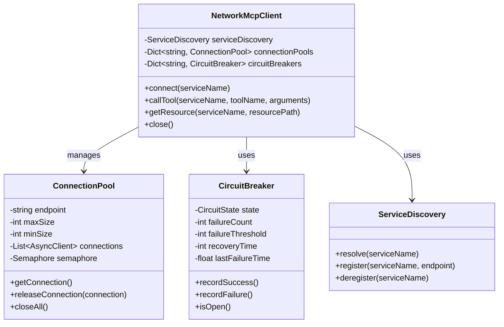

# Network MCP Client

## Overview

This document provides a comprehensive guide to the Network MCP Client, which is the core component for enabling network-based communication between distributed services in Phase 4 of the Cortex Core system. The NetworkMcpClient is responsible for making tool calls and streaming resources from remote MCP servers over HTTP and Server-Sent Events (SSE) connections.

Unlike the in-process MCP client from Phase 3, the NetworkMcpClient adds robust handling for network conditions including connection management, retries, circuit breaking, and error recovery—all while maintaining the same clean interface for calling tools and accessing resources.

## Core Responsibilities

The NetworkMcpClient has several key responsibilities:

1. **Service Communication**: Make HTTP and SSE requests to remote MCP services
2. **Connection Management**: Create, reuse, and close network connections efficiently
3. **Error Handling**: Detect and recover from network failures and service errors
4. **Circuit Breaking**: Prevent cascading failures when services are unavailable
5. **Retry Logic**: Automatically retry transient failures with exponential backoff
6. **Serialization**: Handle serialization and deserialization of requests and responses
7. **Service Discovery Integration**: Resolve service endpoints through the service discovery system

## Architecture

The NetworkMcpClient architecture consists of several key components:



## Complete Implementation

Below is the complete implementation of the NetworkMcpClient. We'll break this down into sections afterwards:

```python
import asyncio
import json
import time
import logging
from enum import Enum
from typing import Dict, Any, Optional, AsyncIterable, List, Set, Tuple
import httpx

logger = logging.getLogger(__name__)

class CircuitState(Enum):
    """Circuit breaker states."""
    CLOSED = "CLOSED"        # Normal operation
    OPEN = "OPEN"            # Service is failing, not accepting requests
    HALF_OPEN = "HALF_OPEN"  # Testing if service is back online

class CircuitBreaker:
    """
    Circuit breaker for service call protection.

    Implements the circuit breaker pattern to prevent cascading failures when a
    service is experiencing issues. When too many failures occur, the circuit
    "opens" and prevents further calls for a set recovery period.
    """

    def __init__(self, failure_threshold: int = 5, recovery_time: int = 30):
        """
        Initialize the circuit breaker.

        Args:
            failure_threshold: Number of failures before opening the circuit
            recovery_time: Time in seconds before checking if service is back online
        """
        self.failure_count = 0
        self.failure_threshold = failure_threshold
        self.recovery_time = recovery_time
        self.state = CircuitState.CLOSED
        self.last_failure_time = None

    def record_success(self):
        """Record a successful call."""
        if self.state == CircuitState.HALF_OPEN:
            # Reset on success in half-open state
            self.failure_count = 0
            self.state = CircuitState.CLOSED
            logger.info("Circuit half-open call succeeded, circuit closed")

    def record_failure(self):
        """Record a failed call."""
        self.failure_count += 1
        self.last_failure_time = time.time()

        if self.state == CircuitState.CLOSED and self.failure_count >= self.failure_threshold:
            # Open the circuit
            self.state = CircuitState.OPEN
            logger.warning(f"Circuit opened after {self.failure_count} failures")

    def is_open(self) -> bool:
        """
        Check if circuit is open.

        Returns:
            True if circuit is open and calls should be prevented, False otherwise
        """
        if self.state == CircuitState.OPEN:
            # Check if recovery time has elapsed
            if self.last_failure_time and time.time() - self.last_failure_time >= self.recovery_time:
                # Move to half-open state
                self.state = CircuitState.HALF_OPEN
                logger.info(f"Circuit moved to half-open state after {self.recovery_time}s")
                return False
            return True

        return False

class ConnectionPool:
    """
    Pool of HTTP connections for a service.

    Manages a pool of httpx.AsyncClient instances for efficient connection reuse.
    Implements connection limiting and automatic cleanup.
    """

    def __init__(self, endpoint: str, max_size: int = 10, min_size: int = 2):
        """
        Initialize the connection pool.

        Args:
            endpoint: Service endpoint URL
            max_size: Maximum number of connections in the pool
            min_size: Minimum number of connections to maintain
        """
        self.endpoint = endpoint
        self.max_size = max_size
        self.min_size = min_size
        self.connections: List[httpx.AsyncClient] = []
        self.semaphore = asyncio.Semaphore(max_size)
        self._closed = False

    async def initialize(self):
        """Initialize the connection pool with min_size connections."""
        # Create initial connections
        for _ in range(self.min_size):
            client = httpx.AsyncClient(base_url=self.endpoint, timeout=10.0)
            self.connections.append(client)

        logger.debug(f"Initialized connection pool for {self.endpoint} with {self.min_size} connections")

    async def get_connection(self) -> httpx.AsyncClient:
        """
        Get a connection from the pool.

        Returns:
            An httpx.AsyncClient connection

        Raises:
            RuntimeError: If the pool is closed
        """
        if self._closed:
            raise RuntimeError("Connection pool is closed")

        await self.semaphore.acquire()

        try:
            # Get existing connection or create new one
            if self.connections:
                return self.connections.pop()
            else:
                logger.debug(f"Creating new connection to {self.endpoint}")
                return httpx.AsyncClient(base_url=self.endpoint, timeout=10.0)
        except Exception as e:
            # Release semaphore on error
            self.semaphore.release()
            raise e

    def release_connection(self, connection: httpx.AsyncClient):
        """
        Return a connection to the pool.

        Args:
            connection: The connection to return
        """
        if self._closed:
            # Close the connection if pool is closed
            asyncio.create_task(connection.aclose())
            return

        # Add back to pool if we're under max_size
        if len(self.connections) < self.max_size:
            self.connections.append(connection)
        else:
            # Close the connection if pool is full
            asyncio.create_task(connection.aclose())

        # Release semaphore
        self.semaphore.release()

    async def close_all(self):
        """Close all connections in the pool."""
        self._closed = True

        for connection in self.connections:
            await connection.aclose()

        self.connections.clear()
        logger.debug(f"Closed all connections in pool for {self.endpoint}")

class ServiceCallError(Exception):
    """Error calling a service."""
    pass

class CircuitOpenError(ServiceCallError):
    """Error due to circuit breaker being open."""
    pass

class ResourceStreamError(ServiceCallError):
    """Error streaming a resource."""
    pass

class NetworkMcpClient:
    """
    Client for communicating with distributed MCP services over the network.

    Implements the Model Context Protocol client interface for making tool calls
    and streaming resources from remote MCP servers over HTTP and SSE.
    """

    def __init__(self, service_discovery):
        """
        Initialize the client.

        Args:
            service_discovery: Service discovery interface for resolving service endpoints
        """
        self.service_discovery = service_discovery
        self.connection_pools: Dict[str, ConnectionPool] = {}
        self.circuit_breakers: Dict[str, CircuitBreaker] = {}
        self._active_tasks: Set[asyncio.Task] = set()

    async def connect(self, service_name: str) -> None:
        """
        Connect to a specific MCP service.

        Args:
            service_name: Name of the service to connect to

        Raises:
            ServiceCallError: If the service cannot be found or connected to
        """
        if service_name in self.connection_pools:
            return  # Already connected

        # Get service endpoint from discovery
        endpoint = await self.service_discovery.resolve(service_name)
        if not endpoint:
            raise ServiceCallError(f"Service {service_name} not found")

        # Initialize connection pool for this service
        pool = ConnectionPool(endpoint)
        await pool.initialize()
        self.connection_pools[service_name] = pool

        # Initialize circuit breaker for this service
        self.circuit_breakers[service_name] = CircuitBreaker()

        logger.info(f"Connected to MCP service {service_name} at {endpoint}")

    async def call_tool(
        self,
        service_name: str,
        tool_name: str,
        arguments: Dict[str, Any],
        timeout: float = 30.0,
        max_retries: int = 3
    ) -> Dict[str, Any]:
        """
        Call a tool on a specific MCP service.

        Makes an HTTP POST request to the tool endpoint on the specified service.
        Handles retries, circuit breaking, and error recovery.

        Args:
            service_name: Name of the service
            tool_name: Name of the tool to call
            arguments: Tool arguments
            timeout: Request timeout in seconds
            max_retries: Maximum number of retries

        Returns:
            Tool result

        Raises:
            ServiceCallError: If the call fails
            CircuitOpenError: If circuit breaker is open
        """
        await self.connect(service_name)

        # Check circuit breaker
        circuit = self.circuit_breakers.get(service_name)
        if circuit and circuit.is_open():
            raise CircuitOpenError(f"Circuit open for {service_name}")

        retries = 0
        last_error = None

        while retries <= max_retries:
            connection = None
            try:
                # Get connection from pool
                connection = await self._get_connection(service_name)

                # Make HTTP request to tool endpoint
                response = await connection.post(
                    f"/tool/{tool_name}",
                    json=arguments,
                    timeout=timeout
                )

                # Return connection to pool
                if connection:
                    self.connection_pools[service_name].release_connection(connection)
                    connection = None

                # Handle response
                if response.status_code == 200:
                    # Record success for circuit breaker
                    if circuit:
                        circuit.record_success()

                    # Return result
                    return response.json()
                else:
                    # Handle error response
                    error_message = self._handle_error(service_name, response)
                    last_error = ServiceCallError(error_message)

            except (httpx.ConnectError, httpx.ReadTimeout, httpx.WriteTimeout) as e:
                # Network or timeout error - retry
                last_error = ServiceCallError(f"Network error calling {service_name}.{tool_name}: {str(e)}")
                logger.warning(f"Retryable error in call to {service_name}.{tool_name}: {e}")

            except Exception as e:
                # Other exception
                last_error = ServiceCallError(f"Error calling {service_name}.{tool_name}: {str(e)}")
                logger.error(f"Error in call to {service_name}.{tool_name}: {e}", exc_info=True)

            finally:
                # Return connection to pool if not already done
                if connection:
                    self.connection_pools[service_name].release_connection(connection)

            # Record failure for circuit breaker
            if circuit:
                circuit.record_failure()

            # Should we retry?
            retries += 1
            if retries <= max_retries:
                # Exponential backoff
                wait_time = 0.1 * (2 ** retries)
                logger.info(f"Retrying {service_name}.{tool_name} in {wait_time:.2f}s (attempt {retries}/{max_retries})")
                await asyncio.sleep(wait_time)
            else:
                break

        # All retries failed
        raise last_error or ServiceCallError(f"Unknown error calling {service_name}.{tool_name}")

    async def get_resource(
        self,
        service_name: str,
        resource_path: str,
        timeout: float = 60.0
    ) -> AsyncIterable[Dict[str, Any]]:
        """
        Get a streaming resource from a specific MCP service.

        Creates an SSE connection to the resource endpoint on the specified service.
        Yields items from the SSE stream as they arrive.

        Args:
            service_name: Name of the service
            resource_path: Path to the resource
            timeout: Connection timeout in seconds

        Returns:
            AsyncIterable of resource data

        Raises:
            ServiceCallError: If the resource access fails
            CircuitOpenError: If circuit breaker is open
        """
        await self.connect(service_name)

        # Check circuit breaker
        circuit = self.circuit_breakers.get(service_name)
        if circuit and circuit.is_open():
            raise CircuitOpenError(f"Circuit open for {service_name}")

        connection = None
        stream = None

        try:
            # Get connection from pool
            connection = await self._get_connection(service_name)

            # Create SSE connection to resource endpoint
            stream = await connection.stream(
                "GET",
                f"/resource/{resource_path}",
                timeout=timeout,
                headers={"Accept": "text/event-stream"}
            )

            # Never return connection to pool while streaming
            # We'll close it manually when done

            # Stream data from SSE connection
            async with stream:
                async for line in stream.aiter_lines():
                    if line.startswith("data: "):
                        try:
                            data = json.loads(line[6:])
                            yield data
                        except json.JSONDecodeError:
                            logger.warning(f"Invalid JSON in SSE stream: {line[6:]}")

        except (httpx.ConnectError, httpx.ReadTimeout, httpx.WriteTimeout) as e:
            # Network or timeout error
            if circuit:
                circuit.record_failure()
            raise ResourceStreamError(f"Network error accessing {service_name}/{resource_path}: {str(e)}")

        except Exception as e:
            # Other exception
            if circuit:
                circuit.record_failure()
            logger.error(f"Error streaming resource {service_name}/{resource_path}: {e}", exc_info=True)
            raise ResourceStreamError(f"Error streaming {service_name}/{resource_path}: {str(e)}")

        finally:
            # Clean up resources
            if stream:
                # Nothing to do, the context manager handles it
                pass

            if connection:
                # Return connection to pool when streaming is done or failed
                self.connection_pools[service_name].release_connection(connection)

        # Record success for circuit breaker
        if circuit:
            circuit.record_success()

    async def call_tool_batch(
        self,
        calls: List[Tuple[str, str, Dict[str, Any]]],
        timeout: float = 30.0,
        max_retries: int = 3
    ) -> List[Dict[str, Any]]:
        """
        Call multiple tools in parallel.

        Args:
            calls: List of (service_name, tool_name, arguments) tuples
            timeout: Request timeout in seconds
            max_retries: Maximum number of retries

        Returns:
            List of tool results in the same order as the calls
        """
        # Create tasks for each call
        tasks = []
        for service_name, tool_name, arguments in calls:
            task = self.create_background_task(
                self.call_tool(
                    service_name=service_name,
                    tool_name=tool_name,
                    arguments=arguments,
                    timeout=timeout,
                    max_retries=max_retries
                )
            )
            tasks.append(task)

        # Wait for all tasks to complete
        results = await asyncio.gather(*tasks, return_exceptions=True)

        # Process results
        processed_results = []
        for result in results:
            if isinstance(result, Exception):
                # Return error as dict
                processed_results.append({
                    "status": "error",
                    "error": str(result)
                })
            else:
                processed_results.append(result)

        return processed_results

    def create_background_task(self, coroutine) -> asyncio.Task:
        """
        Create a tracked background task.

        Args:
            coroutine: Coroutine to run as a task

        Returns:
            The created task
        """
        task = asyncio.create_task(coroutine)
        self._active_tasks.add(task)
        task.add_done_callback(self._remove_task)
        return task

    def _remove_task(self, task):
        """Remove a task from the active tasks set."""
        self._active_tasks.discard(task)

    async def close(self):
        """
        Close all connections.

        Closes all connection pools and cancels any active tasks.
        """
        # Cancel all active tasks
        for task in self._active_tasks:
            if not task.done():
                task.cancel()

        # Wait for all tasks to complete
        if self._active_tasks:
            await asyncio.gather(*self._active_tasks, return_exceptions=True)

        # Close all connection pools
        for service_name, pool in list(self.connection_pools.items()):
            logger.info(f"Closing connections to {service_name}")
            await pool.close_all()

        self.connection_pools.clear()
        self.circuit_breakers.clear()
        logger.info("NetworkMcpClient closed")

    async def _get_connection(self, service_name: str) -> httpx.AsyncClient:
        """
        Get a connection from the pool for a service.

        Args:
            service_name: Name of the service

        Returns:
            An httpx.AsyncClient connection

        Raises:
            ServiceCallError: If not connected to the service
        """
        pool = self.connection_pools.get(service_name)
        if not pool:
            raise ServiceCallError(f"Not connected to service {service_name}")

        return await pool.get_connection()

    def _handle_error(self, service_name: str, response) -> str:
        """
        Handle error response from service.

        Args:
            service_name: Name of the service
            response: HTTP response

        Returns:
            Error message
        """
        status = response.status_code
        try:
            error_data = response.json()
            error_message = error_data.get("detail", error_data.get("message", "Unknown error"))
        except Exception:
            error_message = response.text or f"HTTP {status}"

        logger.error(f"Error from {service_name}: HTTP {status} - {error_message}")
        return f"Service error ({status}): {error_message}"
```

## Key Components

### CircuitBreaker

The CircuitBreaker implements the [circuit breaker pattern](https://martinfowler.com/bliki/CircuitBreaker.html) to prevent cascading failures when a service is experiencing issues:

```python
class CircuitBreaker:
    def __init__(self, failure_threshold: int = 5, recovery_time: int = 30):
        self.failure_count = 0
        self.failure_threshold = failure_threshold
        self.recovery_time = recovery_time
        self.state = CircuitState.CLOSED
        self.last_failure_time = None
```

**States:**

- **CLOSED**: Normal operation; requests flow through
- **OPEN**: Service is failing; requests are blocked
- **HALF-OPEN**: Recovery testing; allowing one request to check if service is back online

**Configuration Options:**

- `failure_threshold`: Number of failures before opening the circuit (default: 5)
- `recovery_time`: Time in seconds before checking if service is back online (default: 30)

### ConnectionPool

The ConnectionPool manages a pool of HTTP connections for efficient connection reuse:

```python
class ConnectionPool:
    def __init__(self, endpoint: str, max_size: int = 10, min_size: int = 2):
        self.endpoint = endpoint
        self.max_size = max_size
        self.min_size = min_size
        self.connections: List[httpx.AsyncClient] = []
        self.semaphore = asyncio.Semaphore(max_size)
```

**Key Features:**

- Maintains a pool of `httpx.AsyncClient` instances
- Limits concurrent connections with a semaphore
- Lazy initialization of connections
- Proper cleanup of connections when no longer needed

**Configuration Options:**

- `max_size`: Maximum number of connections in the pool (default: 10)
- `min_size`: Minimum number of connections to maintain (default: 2)

### NetworkMcpClient

The NetworkMcpClient is the main class that provides the MCP client interface:

```python
class NetworkMcpClient:
    def __init__(self, service_discovery):
        self.service_discovery = service_discovery
        self.connection_pools: Dict[str, ConnectionPool] = {}
        self.circuit_breakers: Dict[str, CircuitBreaker] = {}
        self._active_tasks: Set[asyncio.Task] = set()
```

**Key Methods:**

- `connect`: Connects to a specific MCP service
- `call_tool`: Calls a tool on a specific MCP service
- `get_resource`: Gets a streaming resource from a specific MCP service
- `call_tool_batch`: Calls multiple tools in parallel
- `close`: Closes all connections

## Usage Patterns

### Basic Usage

```python
# Create service discovery
service_discovery = SimpleServiceDiscovery()

# Create client
client = NetworkMcpClient(service_discovery)

# Call a tool
try:
    result = await client.call_tool(
        service_name="memory",
        tool_name="store_input",
        arguments={
            "user_id": "user-123",
            "input_data": {"message": "Hello, world!"}
        }
    )
    print(f"Tool result: {result}")
except ServiceCallError as e:
    print(f"Error calling tool: {e}")

# Stream a resource
try:
    async for item in client.get_resource("memory", "history/user-123"):
        print(f"Resource item: {item}")
except ResourceStreamError as e:
    print(f"Error streaming resource: {e}")

# Clean up
await client.close()
```

### Service Integration Pattern

```python
class MemoryServiceClient:
    """High-level client for the Memory Service."""

    def __init__(self, mcp_client: NetworkMcpClient):
        self.mcp_client = mcp_client

    async def store_input(self, user_id: str, input_data: Dict[str, Any]) -> Dict[str, Any]:
        """Store input data in the Memory Service."""
        return await self.mcp_client.call_tool(
            service_name="memory",
            tool_name="store_input",
            arguments={
                "user_id": user_id,
                "input_data": input_data
            }
        )

    async def get_history(self, user_id: str) -> List[Dict[str, Any]]:
        """Get history from the Memory Service."""
        history = []
        async for item in self.mcp_client.get_resource(
            service_name="memory",
            resource_path=f"history/{user_id}"
        ):
            history.append(item)
        return history

# Usage
memory_client = MemoryServiceClient(mcp_client)
result = await memory_client.store_input("user-123", {"message": "Hello"})
history = await memory_client.get_history("user-123")
```

### Batch Processing Pattern

```python
# Define multiple calls
calls = [
    ("memory", "store_input", {"user_id": "user-1", "input_data": {"message": "Hello"}}),
    ("memory", "store_input", {"user_id": "user-2", "input_data": {"message": "World"}}),
    ("cognition", "get_context", {"user_id": "user-1"})
]

# Call in parallel
results = await client.call_tool_batch(calls)

# Process results
for i, result in enumerate(results):
    service_name, tool_name, _ = calls[i]
    if "error" in result:
        print(f"Error calling {service_name}.{tool_name}: {result['error']}")
    else:
        print(f"Result from {service_name}.{tool_name}: {result}")
```

### Error Handling Pattern

```python
try:
    result = await client.call_tool("memory", "store_input", {
        "user_id": "user-123",
        "input_data": {"message": "Hello"}
    })
    print(f"Success: {result}")
except CircuitOpenError:
    # Circuit is open, service is failing
    print("Service is currently unavailable (circuit open)")
    # Use fallback strategy
    fallback_result = get_fallback_data()
except ServiceCallError as e:
    # Other service error
    print(f"Service error: {e}")
    # Log error and handle gracefully
    log_error(e)
```

## Advanced Features

### Connection Pooling

The NetworkMcpClient includes a sophisticated connection pooling system that:

1. Reuses existing connections to reduce latency
2. Limits the number of concurrent connections to prevent resource exhaustion
3. Creates connections on-demand to avoid unnecessary resource usage
4. Properly closes connections when they're no longer needed

Connection pooling configuration:

```python
# Configure connection pool sizes
pool = ConnectionPool(
    endpoint="http://memory-service:9000",
    max_size=20,  # Max 20 concurrent connections
    min_size=5    # Keep 5 connections ready
)
```

### Circuit Breaking

The circuit breaker pattern prevents cascading failures by temporarily stopping calls to a failing service:

1. **CLOSED state**: Normal operation; all requests go through
2. **OPEN state**: Service is failing; all requests are immediately rejected
3. **HALF-OPEN state**: After a recovery period, one test request is allowed to see if the service is back online

Circuit breaker configuration:

```python
# Configure circuit breaker
circuit = CircuitBreaker(
    failure_threshold=10,  # Open after 10 failures
    recovery_time=60       # Try again after 60 seconds
)
```

### Batch Processing

The `call_tool_batch` method allows calling multiple tools in parallel:

```python
# Call multiple tools in parallel
results = await client.call_tool_batch([
    ("memory", "store_input", {"user_id": "user-1", "data": {"message": "Hello"}}),
    ("cognition", "get_context", {"user_id": "user-1"})
])
```

This is more efficient than making sequential calls, especially when the tools are independent of each other.

### Background Tasks

The NetworkMcpClient includes a task tracking system that:

1. Creates and tracks background tasks
2. Ensures proper cancellation when closing the client
3. Prevents task leaks by monitoring task completion

```python
# Create a background task
task = client.create_background_task(
    some_coroutine()
)

# All tasks are properly cancelled when closing the client
await client.close()
```

## Configuration Options

### Timeout Configuration

Adjust timeouts based on expected operation duration:

```python
# Quick operation (default: 30s)
result = await client.call_tool(
    service_name="memory",
    tool_name="get_status",
    arguments={},
    timeout=5.0  # 5 second timeout
)

# Long-running operation
result = await client.call_tool(
    service_name="cognition",
    tool_name="generate_summary",
    arguments={"text": long_text},
    timeout=120.0  # 2 minute timeout
)

# Streaming resource (default: 60s for connection establishment)
async for item in client.get_resource(
    service_name="memory",
    resource_path="stream_data",
    timeout=300.0  # 5 minute connection timeout
):
    process_item(item)
```

### Retry Configuration

Adjust retry settings based on service reliability:

```python
# More retries for unreliable service
result = await client.call_tool(
    service_name="unreliable_service",
    tool_name="flaky_operation",
    arguments={},
    max_retries=5  # Try up to 5 times (default: 3)
)

# No retries for idempotent operation
result = await client.call_tool(
    service_name="critical_service",
    tool_name="non_idempotent_operation",
    arguments={},
    max_retries=0  # No retries
)
```

### Circuit Breaker Configuration

```python
# Custom circuit breaker for each service
client.circuit_breakers["memory"] = CircuitBreaker(
    failure_threshold=5,   # Open after 5 failures
    recovery_time=30       # Try again after 30 seconds
)

client.circuit_breakers["cognition"] = CircuitBreaker(
    failure_threshold=10,  # More tolerant of failures
    recovery_time=60       # Longer recovery time
)
```

## Error Handling Strategies

### Retry-able vs. Non-retry-able Errors

The client automatically distinguishes between errors that should be retried and those that should not:

**Retry-able Errors:**

- Network connection failures
- Read/write timeouts
- Temporary service unavailability (HTTP 503)

**Non-retry-able Errors:**

- Authentication errors (HTTP 401)
- Authorization errors (HTTP 403)
- Not found errors (HTTP 404)
- Client errors (HTTP 4xx except 429)
- Invalid arguments

### Fallback Strategies

Implement fallback strategies for when services are unavailable:

```python
try:
    result = await client.call_tool("memory", "get_data", {"id": "123"})
except (ServiceCallError, CircuitOpenError):
    # Service is unavailable or failing
    # Use cached data as fallback
    result = cache.get("data_123")
    if not result:
        # No cached data, use default
        result = {"status": "default", "data": []}
```

### Graceful Degradation

Design your system to continue functioning with reduced capabilities when services are unavailable:

```python
try:
    # Try to get enhanced data from cognition service
    context = await client.call_tool("cognition", "get_context", {"user_id": "123"})
    enriched_data = process_with_context(data, context)
    return enriched_data
except (ServiceCallError, CircuitOpenError):
    # Cognition service unavailable, return basic data
    logger.warning("Cognition service unavailable, returning basic data")
    return data
```

## Testing

### Unit Testing

```python
import pytest
import asyncio
from unittest.mock import AsyncMock, MagicMock, patch
import httpx
from network_mcp_client import NetworkMcpClient, ServiceCallError, CircuitOpenError

@pytest.fixture
def mock_service_discovery():
    """Mock service discovery."""
    discovery = AsyncMock()
    discovery.resolve.return_value = "http://test-service:8000"
    return discovery

@pytest.fixture
async def client(mock_service_discovery):
    """Create a client with mock service discovery."""
    client = NetworkMcpClient(mock_service_discovery)
    yield client
    await client.close()

@pytest.mark.asyncio
async def test_call_tool_success(client, monkeypatch):
    """Test successful tool call."""
    # Mock httpx.AsyncClient
    mock_client = AsyncMock()
    mock_response = MagicMock()
    mock_response.status_code = 200
    mock_response.json.return_value = {"result": "success"}
    mock_client.post.return_value = mock_response

    # Mock connection pool
    mock_pool = AsyncMock()
    mock_pool.get_connection.return_value = mock_client
    mock_pool.release_connection = AsyncMock()

    # Replace connection pool
    client.connection_pools["test-service"] = mock_pool

    # Call tool
    result = await client.call_tool("test-service", "test-tool", {"arg": "value"})

    # Check result
    assert result == {"result": "success"}

    # Check that the request was made correctly
    mock_client.post.assert_called_once_with(
        "/tool/test-tool",
        json={"arg": "value"},
        timeout=30.0
    )

@pytest.mark.asyncio
async def test_call_tool_network_error(client, monkeypatch):
    """Test tool call with network error."""
    # Mock httpx.AsyncClient
    mock_client = AsyncMock()
    mock_client.post.side_effect = httpx.ConnectError("Connection error")

    # Mock connection pool
    mock_pool = AsyncMock()
    mock_pool.get_connection.return_value = mock_client
    mock_pool.release_connection = AsyncMock()

    # Replace connection pool
    client.connection_pools["test-service"] = mock_pool

    # Mock asyncio.sleep to avoid waiting
    monkeypatch.setattr(asyncio, "sleep", AsyncMock())

    # Call tool - should retry and eventually fail
    with pytest.raises(ServiceCallError) as exc_info:
        await client.call_tool("test-service", "test-tool", {"arg": "value"}, max_retries=2)

    # Check error message
    assert "Connection error" in str(exc_info.value)

    # Check that post was called multiple times (initial + retries)
    assert mock_client.post.call_count == 3

    # Check that the connection was released
    assert mock_pool.release_connection.call_count == 3

@pytest.mark.asyncio
async def test_circuit_breaker(client):
    """Test circuit breaker functionality."""
    # Create a circuit breaker
    from network_mcp_client import CircuitBreaker
    circuit = CircuitBreaker(failure_threshold=2, recovery_time=1)

    # Replace circuit breaker
    client.circuit_breakers["test-service"] = circuit

    # Mock connection pool
    mock_pool = AsyncMock()
    mock_client = AsyncMock()
    mock_response = MagicMock()
    mock_response.status_code = 500
    mock_response.json.side_effect = Exception("Not JSON")
    mock_response.text = "Internal Server Error"
    mock_client.post.return_value = mock_response
    mock_pool.get_connection.return_value = mock_client
    mock_pool.release_connection = AsyncMock()

    # Replace connection pool
    client.connection_pools["test-service"] = mock_pool

    # Call tool - should fail
    with pytest.raises(ServiceCallError):
        await client.call_tool("test-service", "test-tool", {}, max_retries=0)

    # Call tool again - should fail
    with pytest.raises(ServiceCallError):
        await client.call_tool("test-service", "test-tool", {}, max_retries=0)

    # Call tool a third time - circuit should be open
    with pytest.raises(CircuitOpenError):
        await client.call_tool("test-service", "test-tool", {}, max_retries=0)

    # Wait for recovery time
    import time
    time.sleep(1.1)

    # Next call should be allowed (half-open state)
    # But will still fail due to our mock
    with pytest.raises(ServiceCallError):
        await client.call_tool("test-service", "test-tool", {}, max_retries=0)
```

### Integration Testing

For integration testing, use real services in a controlled environment:

```python
@pytest.mark.integration
@pytest.mark.asyncio
async def test_memory_service_integration():
    """Integration test with real Memory Service."""
    # Create real service discovery
    from service_discovery import SimpleServiceDiscovery
    discovery = SimpleServiceDiscovery()

    # Register Memory Service
    await discovery.register("memory", "http://localhost:9000")

    # Create client
    from network_mcp_client import NetworkMcpClient
    client = NetworkMcpClient(discovery)

    try:
        # Store some test data
        result = await client.call_tool(
            "memory",
            "store_input",
            {
                "user_id": "test-user",
                "input_data": {"message": "Integration test"}
            }
        )

        assert result["status"] == "stored"

        # Get history
        history = []
        async for item in client.get_resource("memory", "history/test-user"):
            history.append(item)

        # Verify our test message is in the history
        assert any(
            item.get("message") == "Integration test"
            for item in history
        )

    finally:
        # Clean up
        await client.close()
```

## Security Considerations

### Transport Security

Always use HTTPS in production environments:

```python
# Service discovery should return HTTPS URLs in production
await service_discovery.register("memory", "https://memory-service.example.com")
```

To configure TLS certificate verification:

```python
import ssl
import httpx

class SecureConnectionPool(ConnectionPool):
    """Connection pool with enhanced security settings."""

    def __init__(self, endpoint: str, ca_cert_path: str = None, **kwargs):
        super().__init__(endpoint, **kwargs)
        self.ca_cert_path = ca_cert_path

    async def get_connection(self) -> httpx.AsyncClient:
        """Get a connection with security settings."""
        await self.semaphore.acquire()

        try:
            # Create client with verify=ca_cert_path
            if self.connections:
                return self.connections.pop()
            else:
                verify = self.ca_cert_path or True
                return httpx.AsyncClient(
                    base_url=self.endpoint,
                    timeout=10.0,
                    verify=verify
                )
        except Exception as e:
            self.semaphore.release()
            raise e
```

### Authentication

To add service-to-service authentication:

```python
class AuthenticatedMcpClient(NetworkMcpClient):
    """MCP client with service-to-service authentication."""

    def __init__(self, service_discovery, auth_token: str):
        super().__init__(service_discovery)
        self.auth_token = auth_token

    async def call_tool(self, service_name: str, tool_name: str, arguments: Dict[str, Any], **kwargs):
        """Call a tool with authentication."""
        await self.connect(service_name)

        # Rest of implementation...

        # Get connection from pool
        connection = await self._get_connection(service_name)

        # Make HTTP request with authentication header
        response = await connection.post(
            f"/tool/{tool_name}",
            json=arguments,
            headers={"Authorization": f"Bearer {self.auth_token}"},
            timeout=kwargs.get("timeout", 30.0)
        )

        # Rest of implementation...
```

### Security Checklist

1. **Use HTTPS** for all service communication in production
2. **Implement authentication** between services
3. **Validate input** before sending to services
4. **Limit connection timeouts** to prevent resource exhaustion
5. **Implement rate limiting** to prevent DoS attacks
6. **Use secure connection pools** with proper certificate validation
7. **Log security events** for audit trails
8. **Sanitize error messages** to prevent information leakage

## Performance Tuning

### Connection Pooling

Optimize connection pool settings based on workload:

```python
# High throughput service
client.connection_pools["high-traffic"] = ConnectionPool(
    endpoint="http://high-traffic-service:8000",
    max_size=50,  # Higher concurrency
    min_size=10   # More connections ready
)

# Low throughput service
client.connection_pools["low-traffic"] = ConnectionPool(
    endpoint="http://low-traffic-service:8000",
    max_size=5,   # Lower concurrency
    min_size=1    # Fewer idle connections
)
```

### Timeout Optimization

Set timeouts based on expected response times:

```python
# Quick operation
result = await client.call_tool(
    service_name="memory",
    tool_name="get_status",
    arguments={},
    timeout=1.0  # 1 second timeout for quick operations
)

# Long-running operation
result = await client.call_tool(
    service_name="cognition",
    tool_name="analyze_document",
    arguments={"document": large_document},
    timeout=300.0  # 5 minute timeout for long operations
)
```

### Batch Processing

Use batch processing to reduce overhead:

```python
# Instead of this (3 separate HTTP requests):
result1 = await client.call_tool("memory", "get_item", {"id": "1"})
result2 = await client.call_tool("memory", "get_item", {"id": "2"})
result3 = await client.call_tool("memory", "get_item", {"id": "3"})

# Do this (parallel processing):
results = await client.call_tool_batch([
    ("memory", "get_item", {"id": "1"}),
    ("memory", "get_item", {"id": "2"}),
    ("memory", "get_item", {"id": "3"})
])
```

### Performance Monitoring

Monitor key performance metrics:

1. **Response Time**: Time taken for tool calls and resource streaming
2. **Retry Rate**: Percentage of requests that need retries
3. **Circuit Breaker Status**: Open/closed state of circuit breakers
4. **Connection Pool Utilization**: Number of active connections
5. **Resource Consumption**: Memory and CPU usage

## Monitoring and Debugging

### Logging Strategy

Configure detailed logging to aid debugging:

```python
import logging

# Configure basic logging
logging.basicConfig(
    level=logging.INFO,
    format="%(asctime)s - %(name)s - %(levelname)s - %(message)s"
)

# Get logger for MCP client
logger = logging.getLogger("network_mcp_client")

# Set more detailed logging for development
logger.setLevel(logging.DEBUG)
```

Add context to logs for traceability:

```python
# Create trace ID for request
trace_id = str(uuid.uuid4())

# Add context to log messages
logger.info(
    "Calling MCP service",
    extra={
        "trace_id": trace_id,
        "service": service_name,
        "tool": tool_name,
        "user_id": arguments.get("user_id")
    }
)
```

### Structured Logging

Use structured logging for better analysis:

```python
import json
import logging
import traceback
from datetime import datetime

class JsonFormatter(logging.Formatter):
    """Format logs as JSON."""

    def format(self, record):
        log_record = {
            "timestamp": datetime.utcnow().isoformat(),
            "level": record.levelname,
            "message": record.getMessage(),
            "logger": record.name
        }

        # Add extra fields
        for key, value in record.__dict__.items():
            if key not in ("args", "asctime", "created", "exc_info", "exc_text", "filename",
                         "funcName", "id", "levelname", "levelno", "lineno", "module",
                         "msecs", "message", "msg", "name", "pathname", "process",
                         "processName", "relativeCreated", "stack_info", "thread", "threadName"):
                log_record[key] = value

        # Add exception info if available
        if record.exc_info:
            log_record["exception"] = {
                "type": record.exc_info[0].__name__,
                "message": str(record.exc_info[1]),
                "traceback": traceback.format_exception(*record.exc_info)
            }

        return json.dumps(log_record)
```

### Client Diagnostics

Add diagnostic information to the client:

```python
class DiagnosticMcpClient(NetworkMcpClient):
    """MCP client with diagnostic capabilities."""

    def __init__(self, service_discovery):
        super().__init__(service_discovery)
        self.call_stats = {}

    async def call_tool(self, service_name: str, tool_name: str, arguments: Dict[str, Any], **kwargs):
        """Call a tool with diagnostics."""
        start_time = time.time()
        success = False

        try:
            result = await super().call_tool(service_name, tool_name, arguments, **kwargs)
            success = True
            return result
        finally:
            end_time = time.time()
            duration = end_time - start_time

            # Update stats
            key = f"{service_name}.{tool_name}"
            if key not in self.call_stats:
                self.call_stats[key] = {
                    "calls": 0,
                    "successes": 0,
                    "failures": 0,
                    "total_duration": 0,
                    "max_duration": 0,
                    "min_duration": float("inf")
                }

            stats = self.call_stats[key]
            stats["calls"] += 1
            stats["successes"] += 1 if success else 0
            stats["failures"] += 0 if success else 1
            stats["total_duration"] += duration
            stats["max_duration"] = max(stats["max_duration"], duration)
            stats["min_duration"] = min(stats["min_duration"], duration)

    def get_diagnostics(self):
        """Get diagnostic information."""
        diagnostics = {
            "call_stats": self.call_stats,
            "connections": {
                service: len(pool.connections)
                for service, pool in self.connection_pools.items()
            },
            "circuit_breakers": {
                service: {"state": breaker.state.value, "failure_count": breaker.failure_count}
                for service, breaker in self.circuit_breakers.items()
            }
        }
        return diagnostics
```

## Best Practices

### Client Initialization

```python
async def create_client():
    """Create and initialize the MCP client."""
    # Create service discovery
    service_discovery = SimpleServiceDiscovery()

    # Register known services
    await service_discovery.register("memory", "http://memory-service:9000")
    await service_discovery.register("cognition", "http://cognition-service:9100")

    # Create client
    client = NetworkMcpClient(service_discovery)

    # Pre-connect to services
    await client.connect("memory")
    await client.connect("cognition")

    return client
```

### Client Lifecycle Management

```python
# In application startup
async def startup():
    app.mcp_client = await create_client()

# In application shutdown
async def shutdown():
    if hasattr(app, "mcp_client"):
        await app.mcp_client.close()
```

### Error Handling

```python
async def call_service_safely(service_name, tool_name, arguments):
    """Call a service with comprehensive error handling."""
    try:
        return await client.call_tool(service_name, tool_name, arguments)
    except CircuitOpenError:
        logger.warning(f"Circuit open for {service_name}, using fallback")
        return get_fallback_data()
    except ServiceCallError as e:
        logger.error(f"Service call error: {e}")
        # Implement appropriate error handling
        raise ApiError(f"Service unavailable: {service_name}")
```

### Resource Cleanup

```python
async def use_client():
    """Use the client with proper resource cleanup."""
    client = await create_client()
    try:
        # Use the client
        result = await client.call_tool("memory", "get_data", {"id": "123"})
        return result
    finally:
        # Always close the client
        await client.close()
```

### Testing Patterns

```python
@pytest.fixture
async def mcp_client():
    """Fixture for MCP client testing."""
    # Create mock or real service discovery
    discovery = create_test_discovery()

    # Create client
    client = NetworkMcpClient(discovery)

    # Yield for test use
    yield client

    # Clean up
    await client.close()
```

## Integration with Core Application

### Core Integration

```python
from fastapi import FastAPI, Depends
from network_mcp_client import NetworkMcpClient, ServiceCallError

app = FastAPI()

# Store client in app state
app.mcp_client = None

@app.on_event("startup")
async def startup():
    # Create service discovery
    from service_discovery import SimpleServiceDiscovery
    discovery = SimpleServiceDiscovery()

    # Register services from configuration
    for service_name, endpoint in app.config["SERVICES"].items():
        await discovery.register(service_name, endpoint)

    # Create client
    app.mcp_client = NetworkMcpClient(discovery)

@app.on_event("shutdown")
async def shutdown():
    if app.mcp_client:
        await app.mcp_client.close()

# Dependency to get MCP client
async def get_mcp_client():
    return app.mcp_client

# API endpoint using MCP client
@app.post("/api/store-input")
async def store_input(
    user_id: str,
    input_data: dict,
    mcp_client: NetworkMcpClient = Depends(get_mcp_client)
):
    try:
        result = await mcp_client.call_tool(
            service_name="memory",
            tool_name="store_input",
            arguments={
                "user_id": user_id,
                "input_data": input_data
            }
        )
        return result
    except ServiceCallError as e:
        # Handle service error
        return {"status": "error", "message": str(e)}
```

### Service-to-Service Integration

```python
# In Cognition Service
class MemoryClient:
    """Client for the Memory Service."""

    def __init__(self, mcp_client: NetworkMcpClient):
        self.mcp_client = mcp_client

    async def get_history(self, user_id: str) -> list:
        """Get history from Memory Service."""
        try:
            # Stream history items
            history = []
            async for item in self.mcp_client.get_resource(
                service_name="memory",
                resource_path=f"history/{user_id}"
            ):
                history.append(item)
            return history
        except ServiceCallError as e:
            logger.error(f"Error getting history: {e}")
            return []

    async def store_data(self, user_id: str, data: dict) -> dict:
        """Store data in Memory Service."""
        return await self.mcp_client.call_tool(
            service_name="memory",
            tool_name="store_input",
            arguments={
                "user_id": user_id,
                "input_data": data
            }
        )
```

## Common Pitfalls and Solutions

### 1. Not Closing Connections

**Pitfall**: Failing to close connections can lead to resource leaks.

**Solution**: Always use `await client.close()` in a `finally` block or application shutdown hook:

```python
try:
    # Use client
    result = await client.call_tool(...)
finally:
    # Always close client
    await client.close()
```

### 2. Improper Error Handling

**Pitfall**: Not handling service errors properly can lead to poor user experience.

**Solution**: Use comprehensive error handling with fallbacks:

```python
try:
    result = await client.call_tool(...)
except CircuitOpenError:
    # Service is unavailable, use fallback
    result = get_fallback_data()
except ServiceCallError as e:
    # Log error and handle gracefully
    logger.error(f"Service error: {e}")
    result = {"status": "error", "message": "Service temporarily unavailable"}
```

### 3. Excessive Retries

**Pitfall**: Retrying too many times can waste resources and delay failure recognition.

**Solution**: Configure appropriate retry limits based on operation criticality:

```python
# Critical operation with limited retries
result = await client.call_tool(
    service_name="critical_service",
    tool_name="important_operation",
    arguments={},
    max_retries=2  # Limit retries
)
```

### 4. Ignoring Circuit Breaker

**Pitfall**: Ignoring circuit breaker state and continuing to make calls.

**Solution**: Check circuit breaker state before making calls in critical paths:

```python
if client.circuit_breakers.get(service_name).is_open():
    # Circuit is open, use fallback immediately
    return get_fallback_data()
else:
    # Circuit is closed, try the call
    try:
        return await client.call_tool(service_name, tool_name, arguments)
    except Exception as e:
        # Handle error
        return {"status": "error", "message": str(e)}
```

### 5. Not Setting Appropriate Timeouts

**Pitfall**: Using default timeouts for all operations can lead to unnecessary waiting or premature cancellation.

**Solution**: Set appropriate timeouts based on expected operation duration:

```python
# Quick status check
status = await client.call_tool(
    service_name="monitoring",
    tool_name="get_status",
    arguments={},
    timeout=2.0  # Short timeout
)

# Processing large document
result = await client.call_tool(
    service_name="processor",
    tool_name="process_document",
    arguments={"document": large_document},
    timeout=300.0  # Long timeout
)
```

### 6. Not Handling Resource Streaming Properly

**Pitfall**: Improper handling of resource streaming can lead to memory issues or lost data.

**Solution**: Process stream items as they arrive:

```python
# Process stream items one at a time
async for item in client.get_resource("memory", "history/user-123"):
    # Process each item individually
    process_item(item)

    # Optionally yield to event loop
    await asyncio.sleep(0)
```

### 7. Ignoring Service Discovery Changes

**Pitfall**: Not handling service discovery changes can lead to using outdated endpoints.

**Solution**: Periodically refresh service endpoints:

```python
async def refresh_service_endpoints():
    """Periodically refresh service endpoints."""
    while True:
        # Wait for refresh interval
        await asyncio.sleep(60)  # Refresh every minute

        try:
            # Update endpoints
            for service_name in client.connection_pools:
                endpoint = await service_discovery.resolve(service_name)
                if endpoint:
                    # Close old connections
                    await client.connection_pools[service_name].close_all()

                    # Create new connection pool
                    pool = ConnectionPool(endpoint)
                    await pool.initialize()
                    client.connection_pools[service_name] = pool
        except Exception as e:
            logger.error(f"Error refreshing endpoints: {e}")
```

## Conclusion

The NetworkMcpClient is a critical component in the distributed MCP architecture, enabling reliable communication between services in Phase 4 of the Cortex Core system. By implementing robust connection management, retry logic, circuit breaking, and error handling, it provides a solid foundation for building resilient distributed systems.

Key takeaways:

1. **Connection Management**: Efficient connection pooling for optimal resource usage
2. **Error Handling**: Comprehensive error detection and recovery
3. **Circuit Breaking**: Prevention of cascading failures during service outages
4. **Retry Logic**: Automatic retry of transient failures with exponential backoff
5. **Service Discovery Integration**: Dynamic resolution of service endpoints

By following the patterns and practices outlined in this document, you can create a robust, reliable, and efficient NetworkMcpClient implementation that will enable the transition from an in-process to a distributed MCP architecture in Phase 4.
