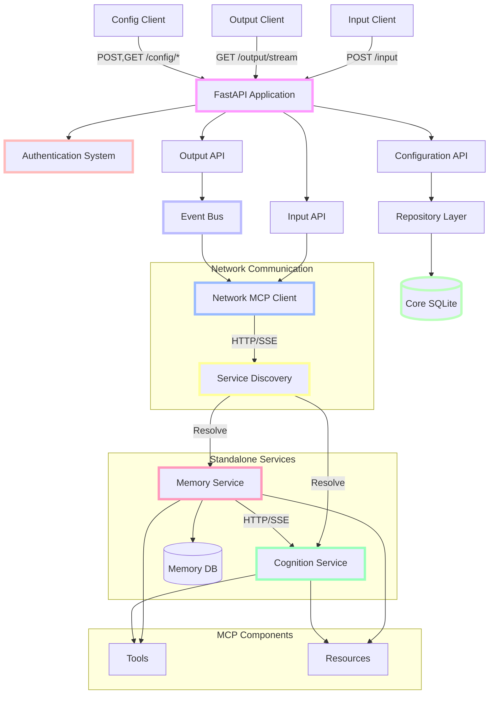

# Cortex Core Phase 4: Distributed Services

## Project Overview

Phase 4 transforms the in-process MCP architecture established in Phase 3 into a truly distributed system with standalone services communicating over the network. Building on the validated service patterns and interfaces, this phase moves services to independent processes, implements network-based communication, adds service discovery, and enhances error handling for distributed operations.

This phase focuses on extracting the Memory and Cognition services into standalone applications, updating the MCP client for network communication, implementing robust connection management, and creating a simple but effective service discovery mechanism. These changes enable independent scaling and deployment of services while maintaining compatibility with existing client applications.

## Goals of Phase 4

1. **Implement Standalone Services**: Extract Memory and Cognition services to independent processes
2. **Enable Network Communication**: Update MCP client for HTTP/SSE-based network communication
3. **Add Service Discovery**: Create simple but effective service registration and discovery
4. **Enhance Connection Management**: Implement robust connection handling and recovery
5. **Improve Error Handling**: Add distributed-specific error handling and recovery
6. **Enable Independent Scaling**: Allow services to be scaled independently
7. **Maintain Backward Compatibility**: Ensure existing client applications continue to work

## System Architecture - Phase 4



### Phase 4 Components

1. **Network MCP Client** (Enhanced)

   - Updated for network-based communication
   - Uses HTTP for tool calls
   - Uses SSE for resource streaming
   - Implements connection pooling
   - Handles retry and circuit breaking
   - Manages timeouts and error recovery

2. **Service Discovery** (New)

   - Simple registry of available services
   - Service endpoint resolution
   - Basic health checking
   - Environment-based configuration
   - Service initialization and registration
   - No complex dependencies or external systems

3. **Standalone Memory Service** (Enhanced)

   - Extracted to independent process
   - Same interface from Phase 3
   - Adds network communication layer
   - Includes own database connection
   - Implements health check endpoints
   - Containerization support

4. **Standalone Cognition Service** (Enhanced)

   - Extracted to independent process
   - Same interface from Phase 3
   - Network-based communication with Memory Service
   - Adds health check endpoints
   - Containerization support
   - Independent scaling capability

5. **FastAPI Application** (Existing)

   - Updated to use network MCP client
   - Maintains existing endpoints
   - Enhanced error handling for network issues
   - Added monitoring for service health

6. **Input/Output APIs** (Existing)

   - Adapted to work with network-based services
   - Enhanced error handling for service unavailability
   - Added timeout management
   - Maintained backward compatibility

7. **Event Bus** (Existing)

   - Integrated with network MCP client
   - Maintained functionality for SSE connections
   - Added error handling for service failures

8. **Repository Layer** (Existing)
   - Maintained for core application data
   - Separated from service-specific repositories
   - Focused on configuration and user data

## What's Included in Phase 4

- ✅ Network-capable MCP client implementation
- ✅ Standalone Memory Service process
- ✅ Standalone Cognition Service process
- ✅ Service discovery mechanism
- ✅ Connection pooling and management
- ✅ Retry and circuit breaking logic
- ✅ Timeout configuration and handling
- ✅ Health check endpoints
- ✅ Containerization support
- ✅ Independent service deployment
- ✅ Service-specific database connections
- ✅ Enhanced error handling for distributed operation
- ✅ Basic monitoring and observability

## What's Explicitly NOT Included in Phase 4

- ❌ Complex service mesh
- ❌ Advanced load balancing
- ❌ Sophisticated service discovery (e.g., Consul, etcd)
- ❌ Complex container orchestration
- ❌ Auto-scaling mechanisms
- ❌ Distributed tracing
- ❌ Complex monitoring solutions
- ❌ Multi-region deployment
- ❌ Detailed performance optimization
- ❌ Advanced security hardening
- ❌ PostgreSQL migration (reserved for Phase 5)
- ❌ Azure B2C integration (reserved for Phase 5)

## Success Criteria for Phase 4

Phase 4 is considered successfully completed when:

1. Memory and Cognition services run as standalone processes
2. Network MCP client successfully communicates with distributed services
3. Service discovery correctly resolves service endpoints
4. Connection management handles temporary service failures
5. Services can be deployed and scaled independently
6. Existing client applications continue to work without modification
7. The system maintains data integrity across services
8. All tests pass with the distributed architecture

## Key Implementation Principles for Phase 4

1. **Simple Service Discovery**: Use a straightforward service registry without complex dependencies
2. **Robust Connections**: Implement basic retry and circuit breaking without excessive complexity
3. **Independent Service State**: Ensure services maintain their own state without shared dependencies
4. **Pragmatic Error Handling**: Handle common network failures without over-engineering
5. **Consistent Interface**: Maintain the same MCP interface established in Phase 3
6. **Direct Communication**: Use direct HTTP/SSE communication without middleware layers
7. **Minimal Dependencies**: Avoid introducing unnecessary third-party components
8. **Simplified Deployment**: Create straightforward deployment patterns
9. **Clear Network Boundaries**: Enforce proper serialization and deserialization at service boundaries
10. **Focused Testing**: Prioritize testing of network resilience and error recovery

## Phase 4 Data Flow

1. **Input Processing Flow with Distributed Services**:

   ```
   Client → POST /input + JWT → Input API → Network MCP Client →
   Service Discovery → Memory Service Tool:store_input →
   Memory Service DB → Response
   ```

2. **Context Generation Flow**:

   ```
   Client → Query → Input API → Network MCP Client →
   Service Discovery → Cognition Service Tool:get_context →
   Cognition Service → Network MCP Client →
   Memory Service Resource:history → Memory Service DB →
   Context Data → Response
   ```

3. **Output Flow with Distributed Services**:
   ```
   Client → GET /output/stream + JWT → Output API → SSE Connection →
   Event Bus → Network MCP Client → Service Discovery →
   Memory Service Resource:history → Filtered Events → Client
   ```

## Critical Implementation Details

### Network MCP Client

The network MCP client provides communication with distributed MCP services over HTTP and SSE.

Key details:

- HTTP for tool calls (request/response)
- SSE for resource streaming (continuous data)
- Connection pooling for efficiency
- Timeout management for unresponsive services
- Retry logic for transient failures
- Circuit breaking for service outages
- Error handling and logging

**Network MCP Client Implementation Example**:

```python
class NetworkMcpClient:
    def __init__(self, service_discovery):
        self.service_discovery = service_discovery
        self.connection_pool = {}
        self.circuit_breakers = {}

    async def connect(self, service_name: str) -> None:
        """Connect to a specific MCP service"""
        if service_name in self.connection_pool:
            return  # Already connected

        # Get service endpoint from discovery
        endpoint = await self.service_discovery.resolve(service_name)
        if not endpoint:
            raise ServiceNotFoundError(f"Service {service_name} not found")

        # Initialize connection pool for this service
        self.connection_pool[service_name] = await create_connection_pool(endpoint)

    async def call_tool(self, service_name: str, tool_name: str, arguments: dict) -> dict:
        """Call a tool on a specific MCP service"""
        await self.connect(service_name)

        # Check circuit breaker
        if self._is_circuit_open(service_name):
            raise CircuitOpenError(f"Circuit open for {service_name}")

        try:
            # Get connection from pool
            connection = await self._get_connection(service_name)

            # Make HTTP request to tool endpoint
            response = await connection.post(
                f"/tool/{tool_name}",
                json=arguments,
                timeout=10.0  # Configurable timeout
            )

            # Handle response
            if response.status_code == 200:
                return await response.json()
            else:
                # Handle error response
                self._handle_error(service_name, response)

        except Exception as e:
            # Handle exceptions and update circuit breaker
            self._record_failure(service_name)
            raise ServiceCallError(f"Error calling {service_name}.{tool_name}: {str(e)}")

    async def get_resource(self, service_name: str, resource_path: str) -> AsyncIterable:
        """Get a streaming resource from a specific MCP service"""
        await self.connect(service_name)

        # Check circuit breaker
        if self._is_circuit_open(service_name):
            raise CircuitOpenError(f"Circuit open for {service_name}")

        try:
            # Get connection from pool
            connection = await self._get_connection(service_name)

            # Create SSE connection to resource endpoint
            sse_client = await connection.stream(
                "GET",
                f"/resource/{resource_path}",
                timeout=30.0  # Longer timeout for SSE
            )

            # Stream data from SSE connection
            async for line in sse_client.aiter_lines():
                if line.startswith("data: "):
                    data = json.loads(line[6:])
                    yield data

        except Exception as e:
            # Handle exceptions and update circuit breaker
            self._record_failure(service_name)
            raise ResourceStreamError(f"Error streaming {service_name}/{resource_path}: {str(e)}")

    def _is_circuit_open(self, service_name: str) -> bool:
        """Check if circuit breaker is open for a service"""
        # Simplified circuit breaker implementation
        pass

    def _record_failure(self, service_name: str) -> None:
        """Record a service failure for circuit breaking"""
        # Simplified implementation
        pass

    def _handle_error(self, service_name: str, response) -> None:
        """Handle error response from service"""
        # Implementation for error handling
        pass

    async def _get_connection(self, service_name: str):
        """Get a connection from the pool for a service"""
        # Implementation for connection pooling
        pass
```

### Service Discovery

The service discovery mechanism provides a simple way to locate and connect to services.

Key details:

- Simple registry of service endpoints
- Environment-based configuration
- Basic health checking
- No external dependencies
- Direct lookup rather than complex resolution

**Service Discovery Implementation Example**:

```python
class ServiceDiscovery:
    def __init__(self):
        self.services = {}
        self.health_status = {}

    async def initialize(self):
        """Initialize service discovery from environment"""
        # Read service endpoints from environment variables
        self.services = {
            "memory": os.getenv("MEMORY_SERVICE_URL", "http://localhost:9000"),
            "cognition": os.getenv("COGNITION_SERVICE_URL", "http://localhost:9100")
        }

        # Initialize health status
        self.health_status = {service: None for service in self.services}

        # Start background health checking
        asyncio.create_task(self._health_check_loop())

    async def register(self, service_name: str, endpoint: str):
        """Register a service endpoint manually"""
        self.services[service_name] = endpoint
        self.health_status[service_name] = None

    async def resolve(self, service_name: str) -> Optional[str]:
        """Resolve a service name to an endpoint"""
        if service_name not in self.services:
            return None

        return self.services[service_name]

    async def is_healthy(self, service_name: str) -> bool:
        """Check if a service is healthy"""
        if service_name not in self.health_status:
            return False

        return self.health_status[service_name] == True

    async def _health_check_loop(self):
        """Background task for health checking"""
        while True:
            for service_name, endpoint in self.services.items():
                try:
                    # Simple health check via HTTP
                    async with httpx.AsyncClient() as client:
                        response = await client.get(
                            f"{endpoint}/health",
                            timeout=5.0
                        )

                        self.health_status[service_name] = response.status_code == 200
                except Exception:
                    self.health_status[service_name] = False

            # Wait before next check
            await asyncio.sleep(30)  # Check every 30 seconds
```

### Standalone Memory Service

The Memory Service is extracted into a standalone process with its own database connection and network interface.

Key details:

- Independent FastAPI application
- MCP server implementation
- Same tools and resources from Phase 3
- Connection to dedicated database
- Network communication interface
- Health check endpoint
- Containerization support

**Standalone Memory Service Structure**:

```
memory-service/
├── app/
│   ├── __init__.py
│   ├── main.py                # FastAPI application
│   ├── mcp/
│   │   ├── __init__.py
│   │   ├── server.py          # MCP server implementation
│   │   ├── tools.py           # Tool implementations
│   │   └── resources.py       # Resource implementations
│   ├── database/
│   │   ├── __init__.py
│   │   ├── connection.py      # Database connection
│   │   ├── models.py          # SQLAlchemy models
│   │   └── repositories.py    # Repository implementations
│   └── utils/
│       ├── __init__.py
│       └── config.py          # Configuration utilities
├── Dockerfile                 # Container definition
├── requirements.txt           # Dependencies
└── README.md                  # Documentation
```

**Memory Service Main Application Example**:

```python
from fastapi import FastAPI
from mcp.server.fastmcp import FastMCP
from app.database.connection import initialize_db
from app.mcp.tools import register_tools
from app.mcp.resources import register_resources

# Create FastAPI application
app = FastAPI(title="Memory Service")

# Create MCP server
mcp = FastMCP("MemoryService")

@app.on_event("startup")
async def startup():
    # Initialize database connection
    await initialize_db()

    # Register MCP tools and resources
    register_tools(mcp)
    register_resources(mcp)

    # Start MCP server
    mcp.run()

# Health check endpoint
@app.get("/health")
async def health_check():
    # Implement health check logic
    return {"status": "healthy"}
```

### Standalone Cognition Service

The Cognition Service is extracted into a standalone process with its own network interface and connection to the Memory Service.

Key details:

- Independent FastAPI application
- MCP server implementation
- Same tools and resources from Phase 3
- Network communication with Memory Service
- Health check endpoint
- Containerization support

**Standalone Cognition Service Structure**:

```
cognition-service/
├── app/
│   ├── __init__.py
│   ├── main.py                # FastAPI application
│   ├── mcp/
│   │   ├── __init__.py
│   │   ├── server.py          # MCP server implementation
│   │   ├── tools.py           # Tool implementations
│   │   └── resources.py       # Resource implementations
│   ├── clients/
│   │   ├── __init__.py
│   │   └── memory.py          # Memory Service client
│   └── utils/
│       ├── __init__.py
│       └── config.py          # Configuration utilities
├── Dockerfile                 # Container definition
├── requirements.txt           # Dependencies
└── README.md                  # Documentation
```

**Cognition Service Memory Client Example**:

```python
from app.utils.config import get_config
from mcp.client import McpClient

class MemoryServiceClient:
    def __init__(self):
        self.client = None
        self.endpoint = get_config().memory_service_url

    async def connect(self):
        """Connect to Memory Service"""
        if self.client is not None:
            return

        self.client = McpClient()
        await self.client.connect(self.endpoint)

    async def get_history(self, user_id: str) -> list:
        """Get history from Memory Service"""
        await self.connect()

        return await self.client.get_resource(f"history/{user_id}")

    async def store_data(self, user_id: str, data: dict) -> dict:
        """Store data in Memory Service"""
        await self.connect()

        return await self.client.call_tool(
            "store_input",
            {
                "user_id": user_id,
                "input_data": data
            }
        )
```

### Containerization

Containerization enables simple deployment and scaling of distributed services.

Key details:

- Simple Docker containerization
- Environment-based configuration
- Minimal container size
- Health check configuration
- Clear service boundaries
- No complex orchestration requirements

**Example Dockerfile for Memory Service**:

```dockerfile
# Use Python 3.10 slim image
FROM python:3.10-slim

# Set working directory
WORKDIR /app

# Copy requirements
COPY requirements.txt .

# Install dependencies
RUN pip install --no-cache-dir -r requirements.txt

# Copy application code
COPY . .

# Expose port for service
EXPOSE 9000

# Health check
HEALTHCHECK --interval=30s --timeout=10s --start-period=5s --retries=3 \
    CMD curl -f http://localhost:9000/health || exit 1

# Run the application
CMD ["uvicorn", "app.main:app", "--host", "0.0.0.0", "--port", "9000"]
```

### Error Handling in Distributed Environment

Distributed systems require more robust error handling to manage network failures and service unavailability.

Key details:

- Timeout configuration for network calls
- Retry logic for transient failures
- Circuit breaking for persistent issues
- Fallback strategies when services are unavailable
- Detailed error logging for diagnosis
- Consistent error response format

**Distributed Error Handling Examples**:

1. **Retry Logic**:

```python
async def call_with_retry(func, *args, max_retries=3, backoff_factor=1.5, **kwargs):
    """Call a function with retry logic"""
    retries = 0
    last_exception = None

    while retries < max_retries:
        try:
            return await func(*args, **kwargs)
        except (TimeoutError, ConnectionError) as e:
            retries += 1
            last_exception = e

            if retries >= max_retries:
                break

            # Exponential backoff
            wait_time = backoff_factor ** retries
            await asyncio.sleep(wait_time)

    # Max retries exceeded
    raise ServiceUnavailableError(f"Service call failed after {max_retries} retries") from last_exception
```

2. **Circuit Breaker**:

```python
class CircuitBreaker:
    """Simple circuit breaker implementation"""

    def __init__(self, failure_threshold=5, recovery_time=30):
        self.failure_count = 0
        self.failure_threshold = failure_threshold
        self.recovery_time = recovery_time
        self.state = "CLOSED"
        self.last_failure_time = None

    def record_success(self):
        """Record a successful call"""
        if self.state == "HALF_OPEN":
            # Reset on success in half-open state
            self.failure_count = 0
            self.state = "CLOSED"

    def record_failure(self):
        """Record a failed call"""
        self.failure_count += 1
        self.last_failure_time = time.time()

        if self.state == "CLOSED" and self.failure_count >= self.failure_threshold:
            # Open the circuit
            self.state = "OPEN"

    def is_open(self):
        """Check if circuit is open"""
        if self.state == "OPEN":
            # Check if recovery time has elapsed
            if time.time() - self.last_failure_time >= self.recovery_time:
                # Move to half-open state
                self.state = "HALF_OPEN"
                return False
            return True

        return False
```

## Integration with Client Applications

Phase 4 maintains backward compatibility with client applications from previous phases, focusing on internal architecture changes that don't affect external interfaces.

### For External Clients

- No changes required for existing clients
- Same input, output, and configuration endpoints
- Same authentication mechanism
- Same event formats for SSE connections
- Same request/response formats for all endpoints

### For Service Developers

Enhanced guidance for developing and deploying distributed services:

1. **Containerization**:

   - Follow standard Docker containerization practices
   - Use environment variables for configuration
   - Implement health checks
   - Minimize container size
   - Document all configuration options

2. **Network Communication**:

   - Use the MCP client for service-to-service communication
   - Implement proper error handling for network calls
   - Configure appropriate timeouts
   - Add retry logic for transient failures
   - Consider circuit breaking for persistent issues

3. **Service Discovery**:

   - Register service endpoints in the service discovery system
   - Provide clear documentation for required configuration
   - Implement health check endpoints
   - Follow consistent naming conventions
   - Document dependencies on other services

4. **Testing**:
   - Test with realistic network conditions
   - Simulate failures to verify error handling
   - Test scalability with multiple instances
   - Verify health check functionality
   - Test with actual container deployments

## Common Pitfalls and Challenges

Be aware of these common implementation challenges specific to Phase 4:

1. **Network-Related Issues**:

   - Missing timeout configuration
   - Inadequate retry logic
   - Not handling connection failures
   - Ignoring network latency impact
   - Assuming reliable networks

2. **Service Discovery Challenges**:

   - Hardcoded service endpoints
   - Missing health checks
   - Inadequate service registration
   - No fallback strategies for unavailable services
   - Overly complex discovery mechanisms

3. **Containerization Mistakes**:

   - Bloated container images
   - Missing health checks
   - Improper environment configuration
   - Tight coupling between containers
   - Inadequate logging configuration

4. **Distributed Error Handling**:

   - Ignoring network failures
   - Missing circuit breaking
   - Inadequate timeout configuration
   - Poor error logging
   - Cascade failures across services

5. **Resource Management**:
   - Connection leaks
   - Excessive connection creation
   - Missing connection pooling
   - Not releasing resources
   - Improper shutdown procedures

## Validating Your Implementation

To ensure your Phase 4 implementation is correct:

1. **Distributed Service Testing**:

   - Start each service in a separate process
   - Verify network communication works
   - Test with services on different machines
   - Verify correct message passing between services
   - Test with multiple service instances

2. **Resilience Testing**:

   - Simulate network failures
   - Stop and restart services
   - Introduce network latency
   - Test with partial system availability
   - Verify recovery after failures

3. **Scalability Testing**:

   - Run multiple instances of each service
   - Test with increasing load
   - Verify independent scaling works
   - Check resource utilization under load
   - Verify connection pooling effectiveness

4. **Container Testing**:
   - Deploy services as containers
   - Test container orchestration
   - Verify health checks work
   - Test container restarts
   - Verify proper environment configuration

## Phase 4 in the Overall Project Timeline

Phase 4 builds on Phase 3 and prepares for Phase 5:

1. Phase 1: Functional Input/Output System with In-Memory Storage
2. Phase 2: Configuration API & Basic Persistence
3. Phase 3: MCP Protocol and Service Architecture
4. **Phase 4: Distributed Services** (current phase)
5. Phase 5: Production Hardening

## Developer Environment

Phase 4 requires the following additions to the Phase 3 environment:

- Docker and Docker Compose for containerization
- Network debugging tools
- Multiple terminal windows or tmux for running services
- Additional testing tools for distributed systems

Additional environment variables:

```
# Service endpoints
MEMORY_SERVICE_URL=http://localhost:9000
COGNITION_SERVICE_URL=http://localhost:9100

# Network configuration
CONNECTION_TIMEOUT=10
MAX_RETRIES=3
CIRCUIT_BREAKER_THRESHOLD=5
```

## Implementation Approach

The recommended implementation sequence for Phase 4 is:

1. **Network MCP Client**

   - Enhance the MCP client for network communication
   - Implement connection pooling
   - Add timeout configuration
   - Create retry and circuit breaking logic
   - Test with simulated network conditions

2. **Service Discovery**

   - Create simple service discovery mechanism
   - Implement service registration and resolution
   - Add basic health checking
   - Create environment-based configuration
   - Test with multiple service configurations

3. **Standalone Memory Service**

   - Extract Memory Service to separate application
   - Implement MCP server interface
   - Set up dedicated database connection
   - Add health check endpoint
   - Create Dockerfile and containerization
   - Test as standalone service

4. **Standalone Cognition Service**

   - Extract Cognition Service to separate application
   - Implement MCP server interface
   - Create Memory Service client
   - Add health check endpoint
   - Create Dockerfile and containerization
   - Test as standalone service

5. **Core Application Updates**

   - Update core application to use network MCP client
   - Integrate with service discovery
   - Enhance error handling for distributed operation
   - Maintain backward compatibility
   - Test with distributed services

6. **Multi-Service Setup**

   - Create Docker Compose configuration
   - Set up local development environment
   - Implement service startup ordering
   - Test combined system operation
   - Verify end-to-end functionality

7. **Resilience Enhancements**

   - Implement more robust error handling
   - Add service unavailability strategies
   - Enhance logging for distributed debugging
   - Test failure scenarios and recovery
   - Verify system stability

8. **Documentation**
   - Document distributed architecture
   - Create deployment guides
   - Update service specifications
   - Document error handling strategies
   - Create examples for service developers

At each step, verify that the implementation works as expected before moving on, focusing on complete functional paths with actual network communication.

## Conclusion

Phase 4 transforms the in-process MCP architecture from Phase 3 into a truly distributed system with standalone services. By implementing network-based communication, simple service discovery, and enhanced error handling, this phase enables independent scaling and deployment of services while maintaining the clean architecture and backward compatibility.

The focus remains on pragmatic implementation and minimal complexity, implementing just enough distributed system patterns to enable effective operation without overengineering. This approach allows for gradual enhancement in future phases while providing immediate benefits in terms of scalability and flexibility.

The subsequent documentation will provide detailed specifications for the network MCP client, service discovery mechanism, containerization approach, and distributed error handling strategies.
